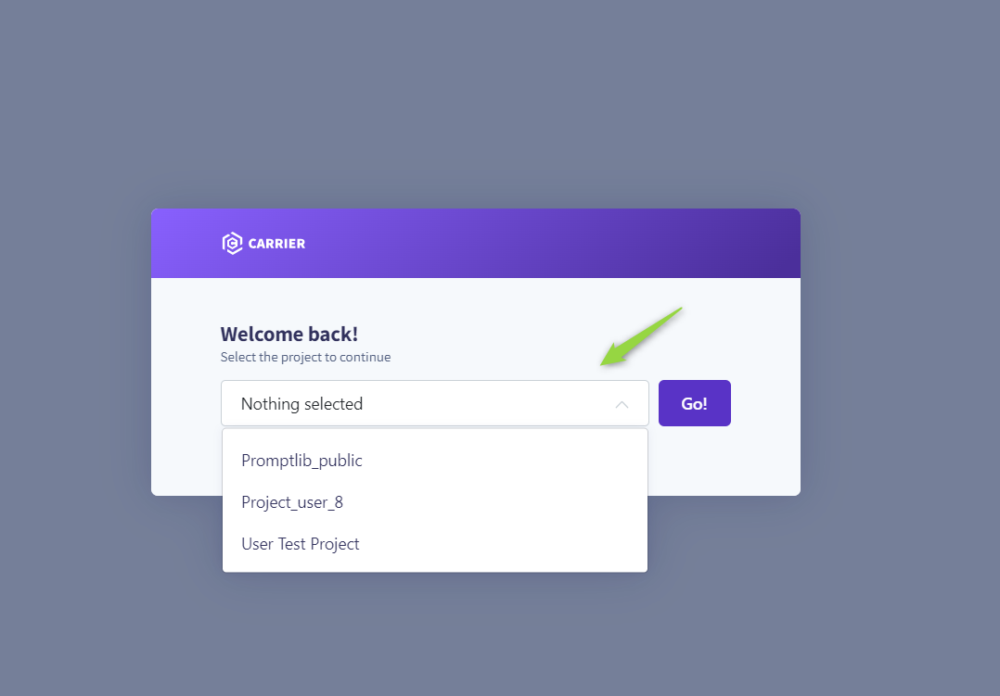
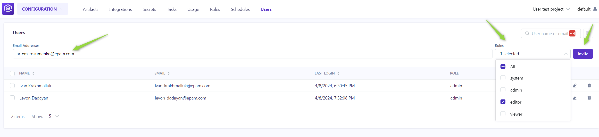
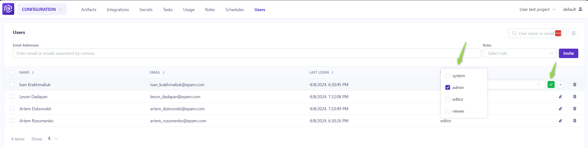

#   Managing Users and Roles

## How to access Admin menu:

To configure or modify the admin settings for a specific project:

1. Navigate to https://alita.lab.epam.com/-/configuration/users/.
2. Select the project from the dropdown list for which you want to set up or adjust the admin settings.

## Users Menu

In the **Users** menu, administrators can manage project participants efficiently. Here's how to navigate this section:

**Adding New Users**:

Only users with an admin role can invite new members. To do so:

1. Enter the prospective member's email address in the **Email Address** input field.
2. Select their role from the **Role** dropdown menu. 
3. Click the **Invite** button. 
4. An invitation will be sent, and upon their first login, their details will be added to the **Users table**, activating their account.

**Notes**

* Multiple users can be invited simultaneously by separating email addresses with a comma.
* For Epam projects, use the invitee's Epam email. For customer projects, the customer's Active Directory is utilized for invitations.

**Managing Users**:

The **Users table** displays all members, their roles, and their last login information. Admins can modify a user's role or revoke access by clicking the respective **Edit** or **Delete** icons next to a user's name.

## Roles Menu

The **Roles** menu allows for the detailed configuration of permissions across default and custom roles, tailoring access to the project's needs.

**Default Roles**:

* **System**: Grants comprehensive permissions, including additional administrative capabilities.
* **Admin**: Allows full project access and user management.
* **Editor**: Provides editing rights within the project without administrative privileges.
* **Viewer**: Limits access to viewing permissions, excluding any create, read, update, delete (CRUD) actions.

**Customizing Roles**:

To adjust permissions for any role:

1. Click the **Edit roles** icon.
2. Toggle the checkboxes for each permission as needed.
3. Click the **Save** to apply changes.

**Creating a New Role**:

1. Click **Edit roles**.
2. Then **Add role**. After naming the new role, select the desired permissions. 
3. This custom role will now be available for assignment in the **Users** menu.

By understanding and utilizing the **Users** and **Roles** menus, administrators can ensure that project participants have the appropriate access levels, fostering a secure and efficient collaborative environment.   