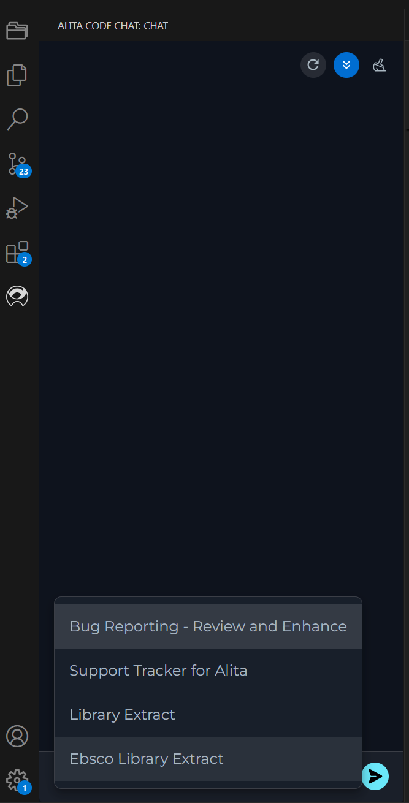
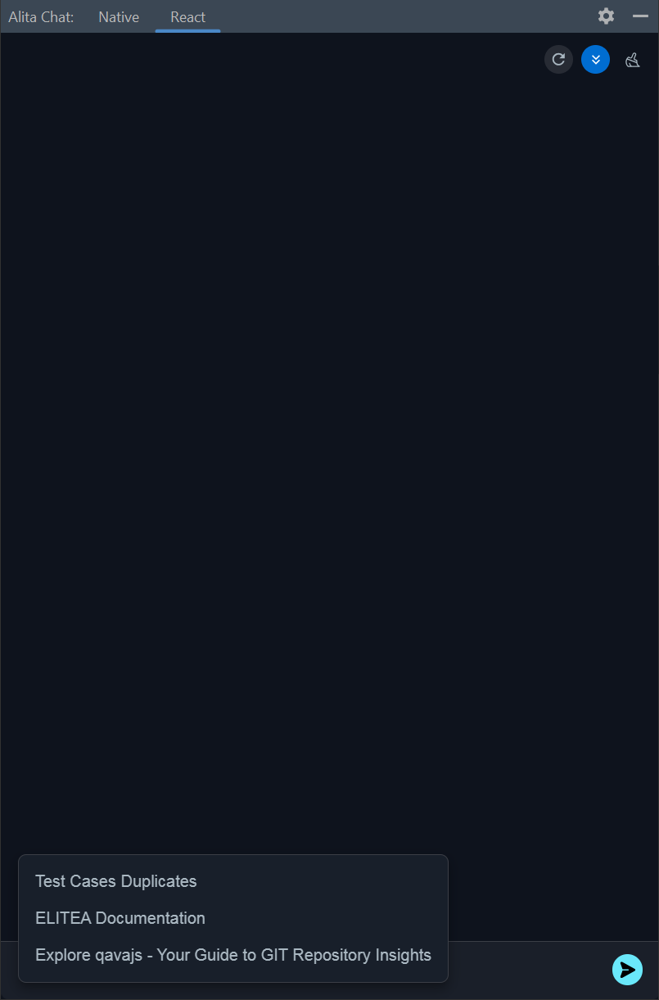
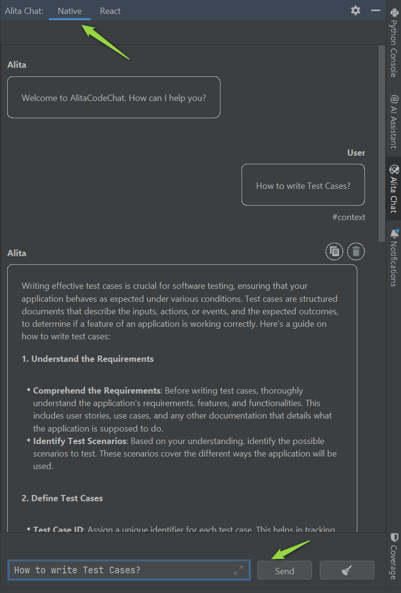
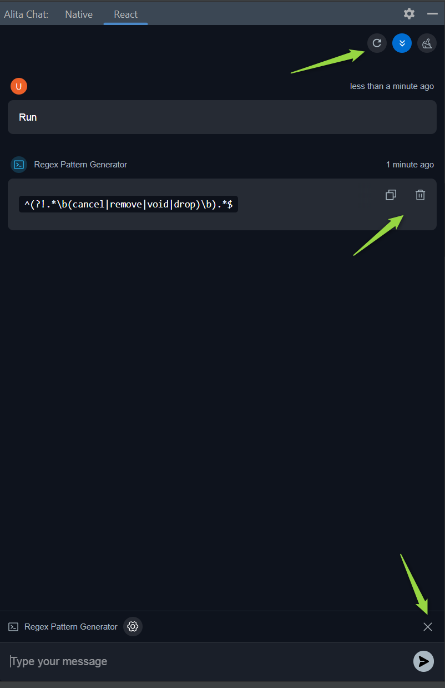

# Alita Code Chat 

Alita Code Chat for VSCode and IntelliJ is an auxiliary GUI for Alita Code, you can utilize the functionality of Alita Code and you can also chat with ELITEA HUB.

## Pre-requisite

Alita Code Chat depends on Alita Code for VS Code and IntelliJ. Alita Code can be installed through their respective marketplaces:

* **VS Code**: Install [Alita Code](https://marketplace.visualstudio.com/items?itemName=ProjectAlita.AlitaCode) from the VS Code Marketplace.
* **IntelliJ**: Install [AlitaCode](https://plugins.jetbrains.com/plugin/23040-alitacode) from the JetBrains Marketplace.

## Features list:

* Chat with ELITEA directly. It will use the model settings set by Alita Code extension.
* Type trigger chat to add participants to chat: `/` for prompt, `#` for datasources and `@` for agents.

**Note**: Alita Code Chat doesn't support Chat History, in case of restarting VS Code or IntelliJ, the Chat History will be cleaned.

## Alita Code Chat for VS code

Alita Code Chat is a visual studio extension to work as chatting companion using Alita Code.

### Installation

Getting started with Alita Code Chat is straightforward:

1. Navigate to the **Extensions** section in VS Code.
2. Search for **Alita Code Chat** in the Marketplace and click **Install**.

**Note**: After successful installation Alita Code Chat shortcut will be added to left menu of VS Code.

### Alita Code Chat Usage

With Alita Code Chat set up, you can now:

* **Prompts** - call and use prompts configured in ELITEA HUB.
* **Datasources** - call and use datasources configured in ELITEA HUB.
* **Agents** - call and use agents configured in ELITEA HUB.
* **Chat** - is a specific type of input designed for conversational AI models, which aims to initiate or guide a dialogue. This can be in the form of a question, statement, or command that simulates human-like interaction, prompting the AI to produce a conversational response for engagement.

**Important:** To successfully call and utilize prompts, datasources, or agents from ELITEA HUB, it is essential that these items are tagged with `code` in ELITEA HUB. This tag ensures that the resources are correctly categorized and accessible. Ensure that the `code` tag is applied to relevant prompts, datasources, and applications to enable their proper functionality within the ELITEA ecosystem.

**Additional Interaction Features:**

* **Auto scroll to bottom**: This option can be toggled on or off to automatically scroll to the bottom of the output as it is being generated. This feature is helpful during long outputs to keep the most recent content visible.
* **Reload Alita Code Settings**: This option allows to reload and update Alita Code settings.
* **Stop generating**: To stop generation of output.

**Post-Output Actions:**

* **Continue the Dialogue**: To keep the conversation going, simply type your next question or command in the chat box and click the **Send** icon.
* **Copy the Output**: Click the **Copy to clipboard** icon to copy the generated text for use elsewhere.
* **Delete Output**: To remove the current output from the chat, click the **Delete** icon.
* **Purge Chat History**: For a fresh start or to clear sensitive data, click the **Clean** icon to erase the chat history.

#### Prompts

To call and use **Prompts** from ELITEA HUB:

1. Open the Alita Code Chat.
2. Type `/` in the chat box.
3. Select the prompt that you want to run.
4. Once all instructions for the prompt are set in the **Context** and/or **Messages** sections, you can start the execution by typing your text (be it a question or a command)  into the chat box. Use simple commands like "Go", "Start Generating", "Execute", or "Run it" and click the **Send** icon to begin. These commands signal the Gen AI to process the information and generate the desired output based on the configured settings.
5. If you need to start a fresh conversation or prompt, simply click the **X** icon to clear the current setup and begin anew.

**Handling Variables:**

* **Variable Input**: If the selected prompt requires variables, a pop-up window will appear prompting you to input the necessary values.
* **Variable Configuration**: You can adjust or update variable values at any time by clicking the **Settings** icon. This allows for dynamic changes to the prompt's behavior based on updated inputs.

#### Datasources

To call and use **Datasources** from ELITEA HUB:

1. Open the Alita Code Chat.
2. Type `#` in the chat box.
3. Select the datasource that you want to run.
4. Start conversation in the form of a question, statement, or command that simulates human-like **interaction**.
5. If you need to start a fresh conversation or datasource, simply click the **X** icon to clear the current setup and begin anew.

#### Agents

To call and use **Agents** from ELITEA HUB:

1. Open the Alita Code Chat.
2. Type `@` in the chat box.
3. Select the application that you want to run.
4. Start conversation in the form of a question, statement, or command that simulates human-like **interaction**.
5. If you need to start a fresh conversation or application, simply click the **X** icon to clear the current setup and begin anew.

#### Chat

1. Open the Alita Code Chat.
2. Start conversation in the form of a question, statement, or command that simulates human-like **interaction**.

## AlitaCodeChat for IntelliJ

AlitaCodeChat is an IntelliJ plugin to work as chatting companion using AlitaCode.

### Installation

Getting started with AlitaCodeChat is straightforward:

1. Navigate to the **Settings**→**Plugins** section in IntelliJ.
2. Search for **AlitaCodeChat** in the Marketplace and click **Install**.

**Note**:

* After successful installation AlitaCodeChat shortcut will be added to right menu of IntelliJ.
* To ensure seamless integration and functionality, the Alita Code and AlitaCodeChat plugins must be installed with matching versions. Please verify that both plugins are updated to the same version to avoid compatibility issues.

AlitaCodeChat for IntelliJ is available in 2 modes:

* **Native** - allowing to chat with configured/selected LLM model in AlitaCode settings.
* **React** - allowing to interact both with configured/selected LLM model as well as the prompts, datasources and agents configured in ELITEA Hub.

**Important:** To successfully call and utilize prompts, datasources, or agents from ELITEA HUB, it is essential that these items are tagged with `code` in ELITEA HUB. This tag ensures that the resources are correctly categorized and accessible. Ensure that the `code` tag is applied to relevant prompts, datasources, and applications to enable their proper functionality within the ELITEA ecosystem.

### AlitaCodeChat Usage

#### Prompts

To call and use **Prompts** from ELITEA HUB:

1. Open the AlitaCodeChat.
2. Select the **React** tab.
3. Type `/` in the chat box.
4. Select the prompt that you want to run.
5. Once all instructions for the prompt are set in the **Context** and/or **Messages** sections, you can start the execution by typing your text (be it a question or a command)  into the chat box. Use simple commands like "Go", "Start Generating", "Execute", or "Run it" and click the **Send** icon to begin. These commands signal the Gen AI to process the information and generate the desired output based on the configured settings.
6. If you need to start a fresh conversation or prompt, simply click the **X** icon to clear the current setup and begin anew.

**Handling Variables:**

* **Variable Input**: If the selected prompt requires variables, a pop-up window will appear prompting you to input the necessary values.
* **Variable Configuration**: You can adjust or update variable values at any time by clicking the **Settings** icon. This allows for dynamic changes to the prompt's behavior based on updated inputs.

#### Datasources

To call and use **Datasources** from ELITEA HUB:

1. Open the AlitaCodeChat.
2. Select the **React** tab.
3. Type `#` in the chat box.
4. Select the datasource that you want to run.
5. Start conversation in the form of a question, statement, or command that simulates human-like **interaction**.
6. If you need to start a fresh conversation or datasource, simply click the **X** icon to clear the current setup and begin anew.

#### Agents

To call and use **Agents** from ELITEA HUB:

1. Open the AlitaCodeChat.
2. Select the **React** tab.
3. Type `@` in the chat box.
4. Select the application that you want to run.
5. Start conversation in the form of a question, statement, or command that simulates human-like **interaction**.
6. If you need to start a fresh conversation or application, simply click the **X** icon to clear the current setup and begin anew.

#### Chat

1. Open the AlitaCodeChat.
2. Select either the **Native** or **React** tab.
3. Start conversation in the form of a question, statement, or command that simulates human-like **interaction**.

#### Additional Interaction Features

* **Auto scroll to bottom**: This option can be toggled on or off to automatically scroll to the bottom of the output as it is being generated. This feature is helpful during long outputs to keep the most recent content visible.
* **Reload Alita Code Settings**: This option allows to reload and update Alita Code settings.
* **Stop generating**: To stop generation of output.

**Post-Output Actions:**

* **Continue the Dialogue**: To keep the conversation going, simply type your next question or command in the chat box and click the **Send** icon.
* **Copy the Output**: Click the **Copy to clipboard** icon to copy the generated text for use elsewhere.
* **Delete Output**: To remove the current output from the chat, click the **Delete** icon.
* **Purge Chat History**: For a fresh start or to clear sensitive data, click the **Clean** icon to erase the chat history.

