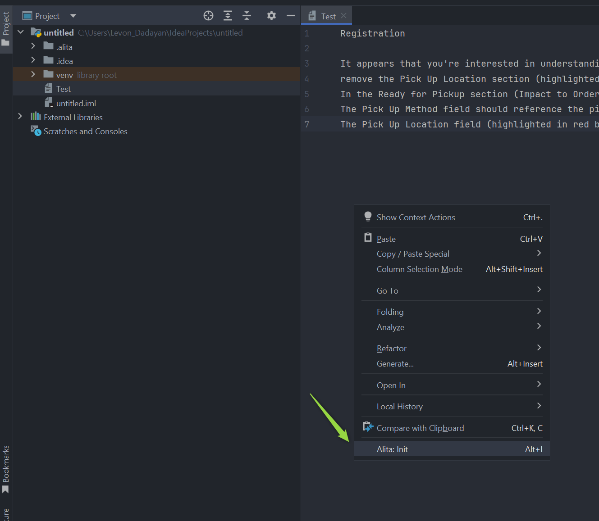

# Alita Code

## Get Started with Alita Code

Welcome to the **Alita Code** your comprehensive resource for harnessing the power of the ultimate AI-powered IDE extension that's set to transform your coding workflow. Alita Code integrates seamlessly with VS Code amd InteliiJ, offering intelligent suggestions, automating routine tasks, and providing a level of adaptability that's unmatched, all designed to elevate your coding experience.

### Why Choose Alita Code?

Alita Code is not just another IDE extension. It's a revolutionary tool designed to:

* **Boost Productivity** - with AI-powered suggestions, Alita Code analyzes your code in real-time, offering insights to enhance code quality, readability, and performance.
* **Automate Testing and Documentation** - simplify the creation of unit tests, integration tests, and automated tests. Alita Code also enriches your code with automatic commenting, making it more accessible and maintainable.
* **Customizable Assistance** - tailor Alita Code's assistance to your project's specific needs with customizable prompts, both internal and powered by Alita Backend's llms for external prompts.

### Key Features

Alita Code comes packed with features designed to streamline your development process:

* AI-powered code suggestions for smarter coding
* Automated generation of unit tests, integration tests, and automated tests
* Automatic code commenting for better maintainability
* Customizable internal prompts for tailored assistance
* Project-specific external prompts powered by Alita Backend
* Code explanation and optimization recommendations
* Seamless native IDE integration
* Regular updates and enhancements
* Comprehensive documentation and dedicated support
* Collaboration-friendly design for team projects
* Secure and privacy-conscious implementation

### Getting Started with Extension Commands

Jumpstart your Alita Code experience with these essential commands:

* **Alita: Init**: Initialize Alita Code in your workspace by creating a `.promptLib` folder at the root.
* **Alita: Create Prompt**: Craft a new prompt within the `.promptLib` folder.
* **Alita: Extend Context**: Enhance the context of an existing prompt in the `.promptLib` folder.
* **Alita: Predict**: Choose from a list of prompts and generate predictions based on your selection.
* **Alita: Sync External Prompts**: Synchronize your external prompts with Alita Backend.

**Alita Code** is designed to be your coding companion, offering a blend of AI-powered efficiency and customizable support. Whether you're looking to enhance your productivity, streamline your testing process, or simply make your code more understandable, Alita Code is here to help. Let's embark on this journey to revolutionize your coding experience together.

## Alita Code for VS Code

Alita Code is a visual studio extension to handle prompt-engineering based code generation using ELITEA as a backend.

### Installation

Getting started with Alita Code is straightforward:

1. Navigate to the **Extensions** section in VS Code.
2. Search for **Alita Code** in the Marketplace and click **Install**.

### Setup

Once installed, setting up Alita Code to work with your projects is simple. To configure Alita Code effectively, you can adjust settings from the Settings page in Alita. There are two distinct types of settings available to cater to different needs:

* **User Settings** are global and apply to all sessions across any workspace. These settings ensure a consistent environment across your projects, providing a uniform experience regardless of the workspace in use. This is particularly useful for general preferences that you want to maintain across all your development activities.
* **Workspace Settings** are specific to a particular workspace. This flexibility is crucial when you need to apply different configurations such as project IDs, models, or other specific parameters in various workspaces. For example, in VSCode, you might want to have different project IDs for different projects to maintain separate environments or use different Gen AI models tailored to specific tasks.

To configure:

1. From the VS Code Welcome screen, open the repository or folder where your project is located.
2. Access **Configuration** by going to **Settings**.
3. Navigate to **Extensions** → **Alita Code**.
4. Select either **User** or **Workspace** tab.
5. Configuring Alita Code for Integration with the ELITEA Platform. To connect Alita Code with the ELITEA platform, configure the following settings appropriately:
      * **Alitacode: Provider Server URL**: Enter the URL of your LLM service provider. For connecting to ELITEA HUB, use `https://alita.lab.epam.com`.
      * **Alitacode: Auth Token**: Provide your API Key or Bearer token for authentication with the LLM service provider. For ELITEA HUB, input the generated Token.
      * **Alitacode: Model Name**: Select the desired LLM model from the dropdown list provided.
      * **Alitacode: Custom Model Name**: If the required model is not listed, enter a custom model name for local prompts.
      * **Alitacode: Custom Model Tokens**: Specify the maximum tokens for local prompts, with a default setting of 4096 tokens.
      * **Alitacode: Project ID**: Input the Project ID for the ELITEA backend. This setting is ignored when using OpenAI.
      * **Alitacode: Integration Uid**: Enter the Integration UID from the ELITEA backend. For ELITEA HUB, use the Integration UID provided by Alita lab. This setting is ignored for OpenAI.
      * **Alitacode: Max Tokens**: Set the maximum number of tokens for the selected model.
      * **Alitacode: Temperature**: Adjust the temperature setting for the selected model to control the randomness of the output.
      * **Alitacode: Default View Mode**: Choose how the prediction results are displayed:
        * **append** - when you run `Alita Predict` the results will be displayed after the text or part that you have selected.
        * **split** - when you run `Alita Predict` the results will be displayed in a separate place (view).
        * **replace** - when you run `Alita Predict` the results will be displayed instead of the text or part that you have selected.
        * **prepend** -when you run `Alita predict` the results will be displayed before the text or part that you have selected.
      * **Alitacode: Top P**: Set the Top P value for the selected model.
      * **Alitacode: Top K**: Set the Top K value for the selected model.
      * **Alitacode: Verify Ssl**: Toggle this setting to verify the LLM service provider's SSL certificate. For ELITEA HUB, keep this checkbox not selected.
      * **Alita Code: Enable**: Toggle to enable or disable the Alita Code extension as needed.

These settings ensure that Alita Code is properly configured to interact with the ELITEA platform, allowing for seamless integration and efficient use of LLM models within your projects.

**Note**: Changes may require restarting VS Code to take effect.

.png)

.png)

**Important**:
 
* For connecting to ELITEA HUB, copy the required settings (URL, ProjectId, Integration Uid, Model Name) from **ELITEA HUB → Settings → Configuration** page. 
* Check and verify that the **Alitacode: Verify Ssl** is NOT selected.

### Configuration

To initialize **Alita Code** in your project:

1. Open any file and right-click to select **Alita → Alita:Init**.
2. This creates a `.promptLib` folder with default prompts and `prompts.json` files.

### Alita Code Usage

With Alita Code set up, you can now:

* **Create Prompts**: Right-click in the editor and navigate to **Alita → Create Prompt** to craft new prompts.
* **Extend Context**: Enhance the context of an existing prompt by selecting text and choosing **Extend Context** from the right-click menu.
* **Predict**: Generate predictions by selecting **Alita Predict** after right-clicking selected text.
* **Sync External Prompts**: Keep your external prompts up-to-date with **Alita Sync External Prompts**.

#### Create a Prompt

Creating a custom prompt in Alita Code allows you to tailor Gen AI suggestions to your specific tasks. Here's how to create one:

1. **Open a File**: Start by opening any file from your project, or create a new one.
2. **Access Alita Menu**: Right-click in the editor view to bring up the context menu, where you'll find the Alita item.
3. **Create Prompt Option**: Hover over Alita in the menu, and on the second level menu, select `Create Prompt`.
4. **Name Your Prompt**: Enter a name for your prompt-template, such as "Generate unit-tests".
5. **Describe Your Prompt**: Press Enter and provide a description for your prompt.
6. **Provide Prompt Content**: Press Enter again and input the content of your prompt. This can be modified later in the `.promptLib` folder.
7. **Finalize Creation**: Hit Enter to finalize. Alita will add a reference to the new prompt in `prompts.json` and create a corresponding `.yaml` file in the `.promptLib` folder, which can be edited to extend content and add examples.

#### Extend Prompt Context

Enhance the context of an existing prompt with selected text from your code, improving the relevance of AI suggestions:

1. **Open and Select**: Open any file from your project and select a portion of the text.
2. **Access Alita Menu**: Right-click to open the context menu and find the Alita item.
3. **Extend Context Option**: Hover over Alita and select "Extend Context" from the submenu.
4. **Choose a Prompt**: Pick the prompt you wish to extend the context for from the dropdown list.
5. **Extend Context**: The selected text will be automatically added to the prompt's context, enriching its understanding for future suggestions.

This feature significantly boosts productivity by integrating Gen AI tools directly into the testing process for real-time analysis and enhancement.

#### Predict (Execute) Prompt

To predict (execute) a prompt directly from VS Code to generate Gen AI-driven code suggestions:

1. **Open a File and Select Text**: Open any project file and select the text you want to analyze or for which you need suggestions.
2. **Access Alita Menu**: Right-click in the editor view to see the Alita menu item.
3. **Predict Option**: Hover over Alita and choose `Alita Predict` from the submenu.
4. **Select a Prompt**: Pick the prompt you wish to execute from the dropdown list.
5. **View Predictions**: The generated response will be displayed according to the method selected in `Alita Code: Default View Mode`.

.png)

**Note**: You can use default prompts, those you've created, or external prompts synced from **ELITEA HUB**.

#### Synchronize External Prompts

Sync prompts created in the Alita HUB with your Alita Code setup for seamless integration:

1. **Open `prompts.json`**: Locate and open the `prompts.json` file.
2. **Access Alita Menu**: Right-click in the editor to see the Alita menu option.
3. **Sync Prompts Option**: Select `Alita Sync External Prompts` from the submenu.
4. **Synchronization**: The prompts will be synced and added to the `prompts.json` file, with a `.yaml` file created for each synced prompt.
5. **Usage**: These prompts are now ready to be used with `Alita: Predict` command.

**Note**: To sync and use prompts from ELITEA HUB, tag the prompt with `code` in ELITEA HUB.

By following these detailed steps, you can maximize your productivity and coding efficiency with Alita Code's AI-powered features.

## AlitaCode for IntelliJ Idea

AlitaCode is a IntelliJ plugin to handle prompt-engineering based code generation using ELITEA as a backend.

### Installation

Getting started with AlitaCode is straightforward:

1. Navigate to the **Settings**→**Plugins** section in IntelliJ.
2. Search for **AlitaCode** in the Marketplace and click **Install**.

### Setup

Once installed, setting up AlitaCode to work with your projects is simple. To configure AlitaCode effectively:

1. Navigate to the to the **Settings**→**Tools** section in IntelliJ.
2. Select the **Alita**.
3. Start configuration:
      * **LLM Provider**: Select the LLM Provider. To connect with ELITEA Hub, select `Alita`.
      * **LLM Auth Token**: Provide your Bearer token for the LLM service provider.
      * **Project ID**: Enter the Project Id for ELITEA Backend, ignored for OpenAI.
      * **LLM Server URL**: Enter the URL to your LLM service provider. (e.g. `https://alita.lab.epam.com/`)
      * **Integration UID**: Enter the AI integration Id from ELITEA Backend, ignored for OpenAI.
      * **LLM Model Name**: Choose the LLM model from the dropdown list.
      * **Custom Model Name**: Enter a custom model name if the desired model is not listed.
      * **Custom Encoding Type**: Select the encoding type, default `cl100k_base`.
      * **Custom Model Size**: Set the max tokens for custom model, default is `4096`.
      * **LLM Response timeout**: Set the response timeout, default is `90` seconds. 
      * **Max Tokens**: Set the max tokens for the selected model.
      * **Temperature**: Adjust the temperature for the selected model.
      * **Top K**: Set the Top K value for the selected model.
      * **Top P**: Set the Top P value for the selected model.
      * **Display Type**: Select the default display mode for the predictions.
        * **append** - when you run `Alita Predict` the results will be displayed after the text or part that you have selected. 
        * **split** - when you run `Alita Predict` the results will be displayed in a separate place (view).
        * **replace** - when you run `Alita Predict` the results will be displayed instead of the text or part that you have selected. 
4. To check and apply configuration:
      * Click the **Reload** icon next to the **Integration UID**.
      * Select the ai_dial as integration and click **OK** button.
5. To complete the setup click the **OK** button.

.png)

.png)

.png)

**Important**: For connecting to ELITEA HUB, copy the required settings (URL, Token, Project ID, Integration UID, Model Name) from **ELITEA HUB → Settings → Configuration** page. 

### Configuration

To initialize **Alita Code** in your project:

1. Open any file and right-click to select **Alita → Alita:Init**.
2. This creates a `.promptLib` folder with default prompts and `prompts.json` files.

### AlitaCode Usage

With AlitaCode set up, you can now:

* **Create Prompts**: Right-click in the editor and navigate to **Alita → Create Prompt** to craft new prompts.
* **Extend Context**: Enhance the context of an existing prompt by selecting text and choosing **Extend Context** from the right-click menu.
* **Predict**: Generate predictions by selecting **Alita Predict** after right-clicking selected text.
* **Sync External Prompts**: Keep your external prompts up-to-date with **Alita Sync External Prompts**.

#### Create a Prompt

Creating a custom prompt in Alita Code allows you to tailor Gen AI suggestions to your specific tasks. Here's how to create one:

1. **Open a File**: Start by opening any file from your project, or create a new one.
2. **Access Alita Menu**: Right-click in the editor view to bring up the context menu, where you'll find the **Alita Actions** item.
3. **Create Prompt Option**: Hover over **Alita Actions** in the menu, and on the second level menu, select **Alita: Create Prompt**. The Create Prompt window is opened:
    * **Name**: Assign a descriptive name that clearly reflects the aim of the prompt.
    * **Description**: Summarize the purpose of the prompt, detailing what it intends to achieve. 
    * **Context**: Well crafted prompt corresponding to well-acceppted Frameworks for creating prompts (e.g. CREATE, CRISPE, Elavis Saravia, etc.). In case the prompt's context contains **Variables**, then provide the names and values of the variables in the Variables section..
    * Click the **Use the project integration settings in the context file** checkbox to configure Model, Top-P, Top-K, Tempreature and MaX Tokens settings.
4. Click the **Ok** button to create a prompt. This can be modified later in the `.promptLib` folder. AlitaCode will add a reference to the new prompt in `prompts.json` and create a corresponding `.yaml` file in the `.promptLib` folder, which can be edited to extend content and add examples.

#### Edit Prompt Context

Enhance the context of an existing prompt with selected text from your code, improving the relevance of AI suggestions:

1. **Open and Select**: Open any file from your project and select a portion of the text.
2. **Access Alita Menu**: Right-click to open the context menu and find the **Alita Actions** item.
3. **Edit Context Option**: Hover over **Alita Actions** and select **Alita: Edit Context** from the submenu.
4. **Choose a Prompt**: Select the prompt you wish to modify for from the list and click the **Edit** button.
5. **Edit Context** The selected prompt's `yaml` file will be opened where you can make the changes.

This feature significantly boosts productivity by integrating Gen AI tools directly into the testing process for real-time analysis and enhancement.

#### Predict (Execute) Prompt

To predict (execute) a prompt directly from VS Code to generate Gen AI-driven code suggestions:

1. **Open a File and Select Text**: Open any project file and select the text you want to analyze or for which you need suggestions.
2. **Access Alita Menu**: Right-click in the editor view to see the **Alita Actions** item.
3. **Predict Option**: Hover over **Alita Actions** and choose **Alita: Predict** from the submenu.
4. **Select a Prompt**: Pick the prompt you wish to execute from the list and click the **OK** button.
5. **View Predictions**: The generated response will be displayed according to the method selected in `AlitaCode: Display Type`.

.png)

**Note**: You can use default prompts, those you've created, or external prompts synced from **ELITEA HUB**.

#### Synchronize External Prompts

Sync prompts created in the ELITEA HUB with your AlitaCode setup for seamless integration:

1. **Open `prompts.json`**: Locate and open the `prompts.json` file.
2. **Access Alita Menu**: Right-click in the editor to see the **Alita Actions** item.
3. **Sync Prompts Option**: Select the **Alita: Sync External Prompts** option from the submenu.
4. **Synchronization**: The prompts will be synced and added to the `prompts.json` file.
5. **Usage**: These prompts are now ready to be used with `Alita: Predict` command.

**Note**: To sync and use prompts from ELITEA HUB, tag the prompt with `code` in ELITEA HUB.

By following these detailed steps, you can maximize your productivity and coding efficiency with Alita Code's AI-powered features.

