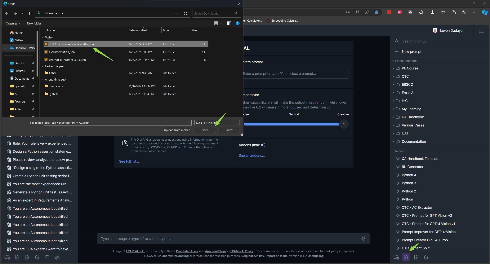

# Interoperability Guide: ELITEA and EPAM AI Dial

Welcome to the user-friendly manual on using [ELITEA](https://alita.lab.epam.com) and [EPAM AI Dial](https://chat.lab.epam.com/) seamlessly together. This guide walks you through the steps to export from one platform and import into another, ensuring a hassle-free interoperation between ELITEA and EPAM AI Dial.

## Export Prompts from ELITEA

**Exporting a prompt** in ELITEA enables you to use it on different platforms including EPAM AI Dial. Here’s how to do it:

### Exporting the Prompt for AI DIAL:

1. **Start the Export**: Click on the **Export prompt** icon.
2. **Choose Format**: Select the **`[DIAL] format`** format when prompted. This format is specially designed for compatibility with EPAM AI Dial.
3. **Download**: After selecting the format, the file will be downloaded automatically to your device in JSON format.

### Import Prompts to EPAM AI Dial

Once you have the JSON file from ELITEA, you can easily import it into AI Dial.

### Importing the Prompt into AI Dial:

1. **Begin Import**: Click on the **Import prompts** icon within the AI Dial platform.
2. **Select File**: Browse your device and select the JSON file you exported from ELITEA.
3. **Complete Import**: The platform will automatically add the prompt to the **Prompts** section.
4. **Usage**: You can now select and use the prompt within AI Dial.

## Export Prompts from EPAM AI Dial

If you have developed or customized prompts in EPAM AI Dial, you can easily export them for use in ELITEA.

1. **Prompt Selection**: Identify and select the prompt you wish to export.
2. **Export**: Click the **`...`** icon next to your selected prompt and choose the **Export** option.
3. **File Download**: The prompt will be exported and downloaded in JSON format, ready for ELITEA.

### Import Prompts to ELITEA

To use the prompts created or exported from EPAM AI Dial in ELITEA, follow these simple steps.

1. **Initiate Import**: Select the **Import** option within ELITEA.
2. **Choose File**: Browse and select the exported JSON prompt file.
3. **Complete Process**: The prompt will be added under the **My libraries - Prompts** page in ELITEA.
4. **Use Prompt**: You can now access and utilize the imported prompt.

## Exporting and Importing Collections from ELITEA to EPAM AI Dial

You can also export entire collections from ELITEA and import them into EPAM AI Dial for broader prompt management.

1. **Export Collection**: In ELITEA, select the collection you wish to export and choose the **`Export Collection`** option. Select the **`[DIAL] format`** for optimal compatibility.
2. **Download Collection**: The collection, encompassing multiple prompts, will be exported as a JSON file and automatically downloaded to your device.
3. **Import into AI Dial**: Upon importing the collection file into EPAM AI Dial, please note that the included prompts will be added as separate items, not as a unified folder.

This feature enhances workflow efficiency by allowing bulk transferring of prompts between the platforms, albeit without retaining the folder structure during import into AI Dial.

## Troubleshooting

* **File Format**: Ensure the prompt file is in JSON format. Other formats won’t be processed.
* **Template Compatibility**: ELITEA supports [Jinja](https://jinja.palletsprojects.com/en/3.1.x/) template. Make sure the content and variables in your prompt adhere to this format, especially avoiding spaces in variable names.
* **File Structure**: If you encounter any unrecognized errors, open the exported JSON file in a text editor. Validate its structure and formatting against the Jinja template requirements, making any necessary adjustments.

By following these detailed steps, you should be able to smoothly export and import prompts and collections between ELITEA and EPAM AI Dial, enhancing your productivity and efficiency in creating and managing prompts.

## Useful Links

* [ELITEA Prompt Library - User Guide](user-guide.md)
* [ELITEA Prompt Library - Release Notes](release-notes.md)
* [Epam AI Dial - User Guide](https://docs.epam-rail.com/user-guide)