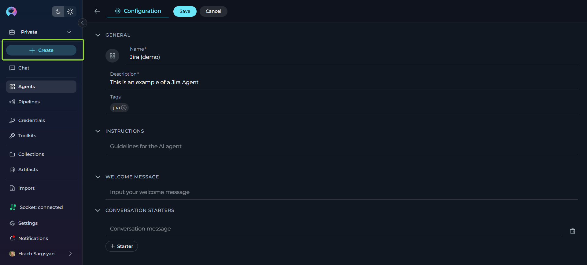
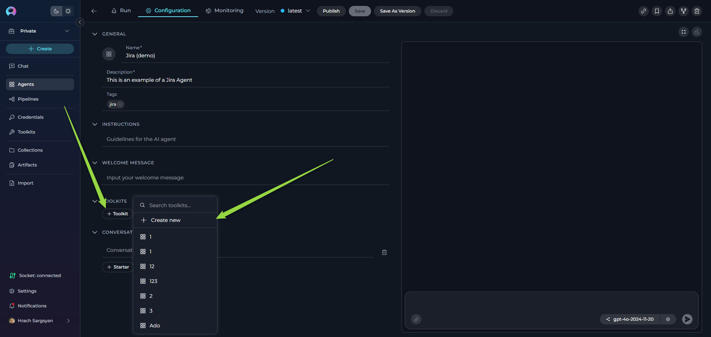
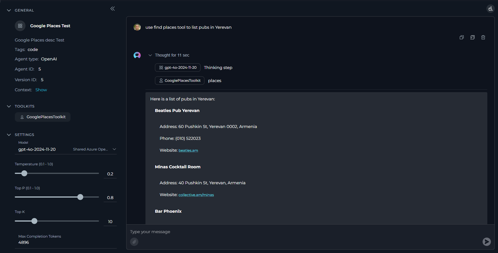
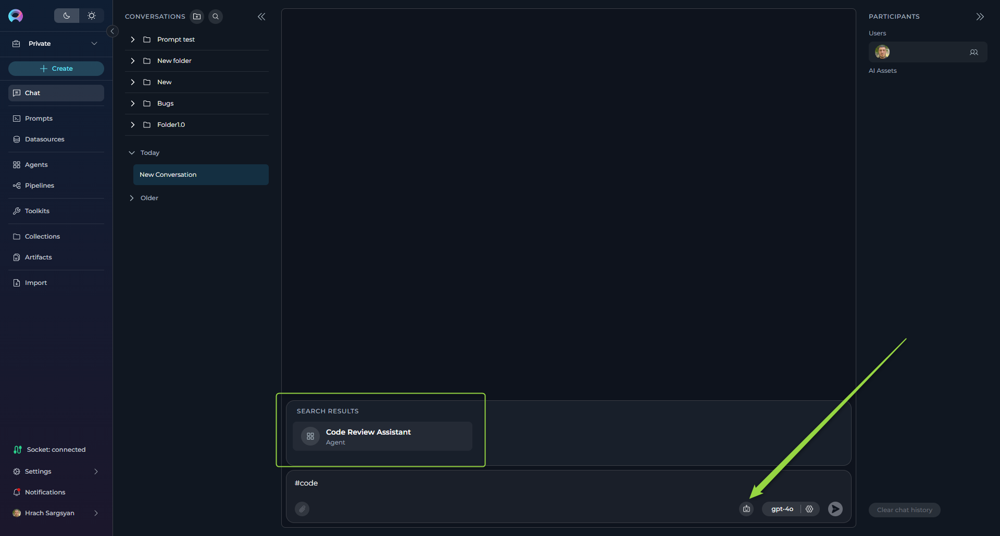

# Create Your First Agent

## Introduction

ELITEA Agents are customizable virtual assistants that automate tasks and streamline workflows. Each agent is tailored to handle specific tasks based on the instructions and capabilities you define. This guide will walk you through creating your first agent from start to execution.

---

## Step 1: Navigate to the Agents Menu

1. **Open the Sidebar:**
      * From the main platform navigation, locate and click **Agents** in the sidebar.

2. **Access the Agents Dashboard:**
      * You'll see a list of all existing agents for your project (if any).
      * If this is your first time, the list will be empty.

---

## Step 2: Create a New Agent

1. **Start Agent Creation:**
      * Click the **`+ Create`** button located at the top of the main sidebar.

2. **Configure General Information:**
      * **Name**: Enter a unique, descriptive name for your agent (e.g., "Code Review Assistant", "Daily Report Generator").
      * **Description**: Provide a clear description of what your agent will do.
      * **Tags** (optional): Add relevant tags by typing tag names or selecting from existing ones.

3. **Add Agent Instructions:**
      * In the **Instructions** section, provide detailed guidelines that specify:
        * How the agent should behave
        * What tasks it should perform
        * Any specific requirements or constraints
      * **Example**: "You are a helpful assistant that reviews code for best practices. Always check for security issues, performance concerns, and code readability."

4. **Configure Optional Features:**
      * **Welcome Message** (optional): Add a message that users see when they first interact with your agent.
      * **Conversation Starters** (optional): Create predefined prompts to help users get started quickly.

5. **Save Your Agent:**
      * Click **Save** to create your agent.
      * Your new agent will appear in the Agents list.

---

## Step 3: Add Toolkits

Toolkits enhance your agent's capabilities by connecting it to external services like GitHub, Jira, or Slack.

1. **Access Toolkits Section:**
      * In your agent configuration, scroll to the **Toolkits** section.

2. **Add a Toolkit:**
      * Click the **`+ Toolkit`** button.
      * Select an existing toolkit from the list, or
      * Click **`+ Create New`** to create a new toolkit.

3. **Configure and Save:**
      * Follow the toolkit-specific configuration steps.
      * Save your agent with the new toolkit integration.

!!! note "Reference"
      For detailed instructions on creating toolkits, refer to the [Create a Toolkit](create-toolkit.md) guide.

---

## Step 4: Test and Manage Your Agent

For testing and fine-tuning purposes, you can interact with your agent directly through its dedicated chat interface.

1. **Access the Agent's Chat Interface:**
      * Click on your agent from the Agents list to open its dedicated chat interface.

2. **Select AI Model:**
      * Choose an appropriate AI model from the dropdown (e.g., gpt-4o-2024-11-20).

3. **Adjust Parameters** (optional):
      * **Temperature**: Control creativity level (0.1 for consistent, 1.0 for creative).
      * **Top P**: Adjust word selection diversity.
      * **Max Completion Tokens**: Set response length limit.

4. **Test Your Agent:**
      * Use a **Conversation Starter** (if configured), or
      * Type your question or command directly.
      * Click **Send** or use simple commands like "Go", "Start", or "Execute".

**Continue the Conversation:**

  * Keep chatting by typing follow-up questions or commands.

**Version Management:**

   * **Save**: Update the current "latest" version or the current named version
   * **Save As Version**: Create a new named version
   * **Publish**: Submit for approval to make publicly available

---

## Step 5: Add Your Agent to Conversations

The primary way to use your agent is by adding it to conversations for collaborative work.

1. **Navigate to Chat Menu:**
      * Go to the **Chat** section from the main sidebar.

2. **Start a New Conversation:**
      * Click **`+ Create`** to start a new conversation.
      * Or select an existing conversation where you want to add your agent.

3. **Add Your Agent:**
      * At the bottom of the chat, you can see the switch to assistant icon.
      * To switch assistants (e.g., select an Agent):
         - Click the Switch assistant icon.
         - In the opened "Frequently Used" list, click on the your agent name (e.g., Code Review Assistant) to select it.
         - Alternatively, type # followed by the your agent name (e.g., #Code Review Assistant) in the input box to quickly select an assistant
4. **Interact with Your Agent:**
      * Type your question or request and send it.
      * Your agent will respond based on its instructions and available toolkits.

!!! tip "Conversation Benefits"
      Using agents in conversations allows for collaborative workflows where human team members and AI agents work together, maintaining context and continuity throughout the discussion.

!!! note "Reference"
      For detailed instructions on creating conversation, refer to the [Create first Conversation](../archive/create-conversation.md) guide.
---

## Next Steps

Now that you've created your first agent, consider:

* **Adding more toolkits** to expand capabilities
* **Creating conversation starters** for common use cases
* **Building pipelines** to connect multiple agents for complex workflows
* **Monitoring performance** using the built-in monitoring features

!!! tip "Best Practices"
      * Write clear, specific instructions for better agent performance
      * Test your agent with various inputs before sharing
      * Use descriptive names and tags for easy organization
      * Consider creating different versions for different use cases

---

!!! info "References"
    For more detailed information, refer to:

    * **[Agents Menu Guide](../menus/agents.md)** - Comprehensive agent documentation
    * **[Create a Toolkit](create-toolkit.md)** - Learn to integrate external services
    * **[Create Credentials](../getting-started/create-credential.md)** - Set up secure authentication
    * **[Chat Menu Guide](../menus/chat.md)** - Comprehensive chat documentation
    * **[Glossary](../home/glossary.md)** - Definitions of key terms and concepts
