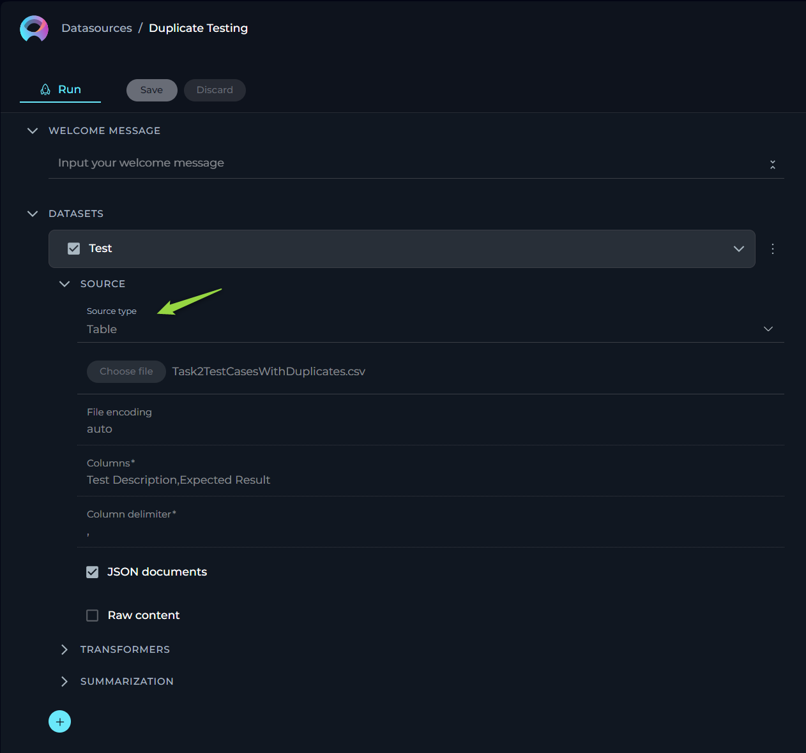
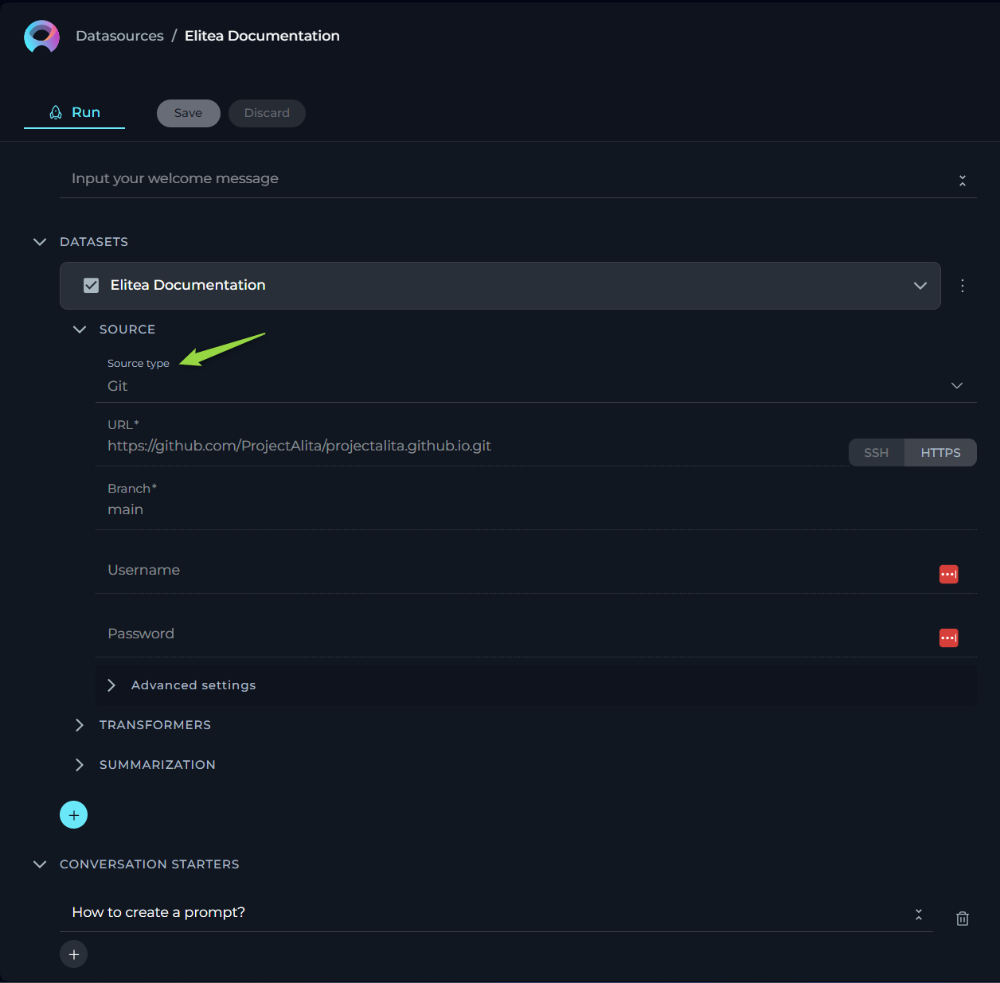
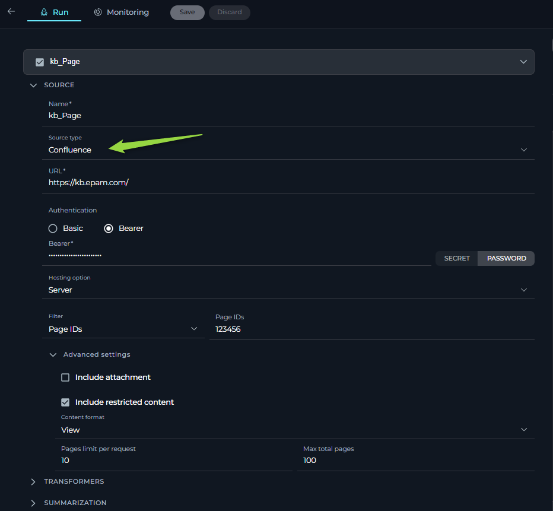
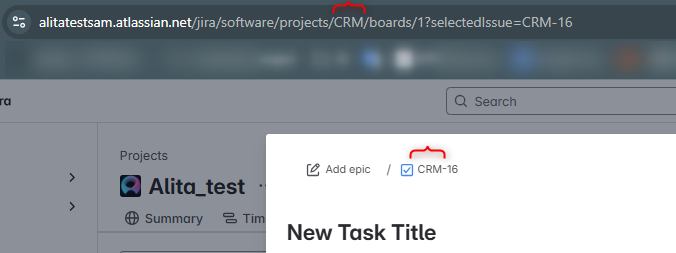
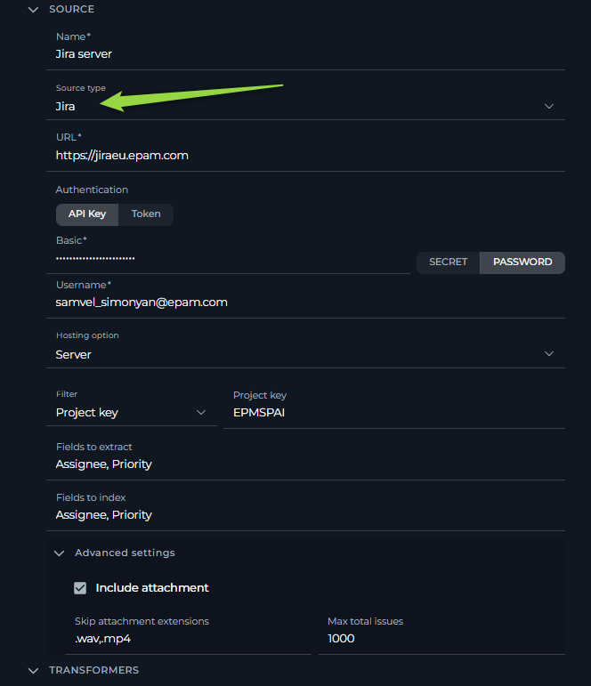
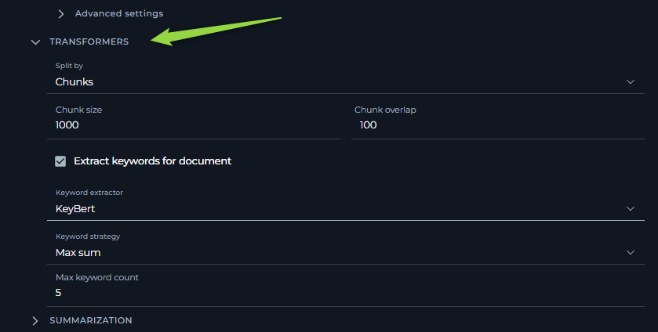
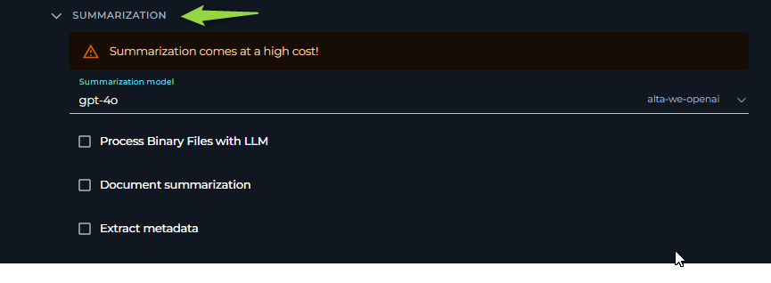
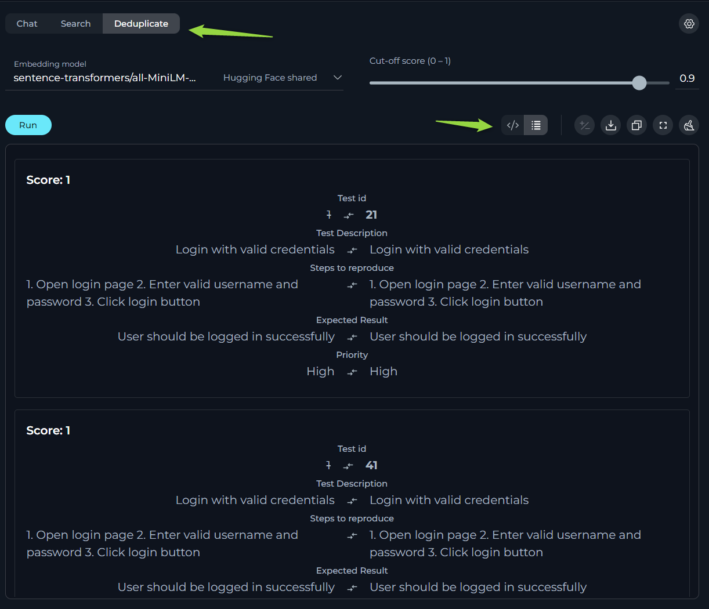
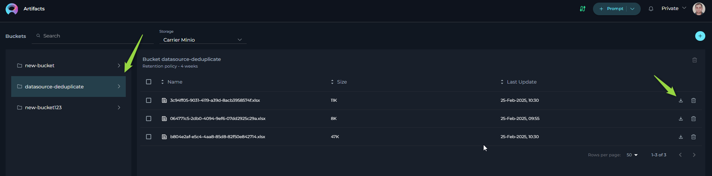

# Datasources

## Private project - Datasources menu

Datasources play a pivotal role in broadening and enriching the functionalities of ELITEA and AI technologies. They enable the extension of LLMs by integrating user-specific or project-specific data, which is not initially part of the model’s training set, thereby enhancing the LLM's context with tailored information.

### Creating a Datasource

To set up a new datasource and augment your model's capabilities:

1. Click the **+ Datasource** button located at the top right corner.
2. Fill out the **Name** and **Description** fields.
3. Choose an **Embedding model** from the dropdown list provided.
4. Select the desired **Storage type** from another dropdown menu.
5. Optionally, add tags by typing a tag name or selecting from pre-existing tags in the Tags input box.
6. Click **Save** to finalize the creation.

### Exploring Datasources

Discovering the intricacies of a datasource is both simple and insightful:
Click on the card or the name of a datasource to unveil its configurations, providing a detailed overview of its setup and usage.

### Connecting a Dataset to the Datasource

The initial step involves linking your dataset to the desired datasource:

1. Press the **`+`** icon to start adding a new dataset.
2. Enter a name for your dataset.
3. From the dropdown list, select the source type of your dataset. Available options include:
      * **File**: Any supported file type for upload.
      * **Table**: Supported file types with a table structure, such as CSV or XLSX.
      * **GIT**: Any accessible Git repository.
      * **Confluence**: Any Confluence page accessible to you.
      * **QTest**: Any QTest project accessible to you.

Depending on the selected source type, various configurations may be necessary to access the dataset source, primarily involving authentication and authorization parameters. This step is exempt for File and Table options since the files will be directly uploaded.

#### Source type - File

ELITEA supports a variety of file types and offers flexible settings to handle your documents effectively. Below is an easy-to-understand breakdown of the options, settings, and parameters available for configuration.

* **Name** - specify a unique name for your source configuration. This helps in easily identifying and managing multiple sources.
* **Choose File Option** - select the file you wish to process. ELITEA supports a range of commonly used file types, ensuring compatibility and ease of use. Supported file types: PDF, DOCX, TXT, JSON.
* **Advanced Settings** - under this section, additional features enable further customization of how your file is processed.
    * **Split Pages** - when enabled, each page of your document is treated as a separate entity. This is particularly useful when dealing with PDF documents, enabling more granular control over the analysis or processing of individual pages.
    * **Parse Tables by Rows** Selecting this option ensures that any tables within your document are parsed row by row, maintaining the structure and context. This setting is valuable when dealing with documents that contain tabular information, ensuring the data remains organized and comprehensible.
* **Default Document Loader** - choose the mechanism by which your document is loaded into the system. Each loader handles your file differently, catering to specific needs.
    * **TextLoader** - optimized for plain text documents, ensuring swift and efficient loading.
    * **PythonLoader** - best suited for technical or coded documents, offering more sophisticated parsing capabilities.
  * **Extension Whitelist** - specify file extensions that are explicitly allowed. This security measure ensures only designated file types are processed, safeguarding against unwanted or potentially harmful files. List the extensions separated by commas (e.g., `.pdf`, `.docx`, `.txt`), overriding the default supported types if necessary.
  * **Extension Blacklist** - conversely, list file extensions you wish to exclude from processing. Any file type (e.g., `.exe`, `.bin`, `.png`) mentioned here will be automatically rejected, further enhancing security and control over the documents your system handles.

#### Source type - Table

This functionality is crucial for users who work with structured data in formats such as spreadsheets or structured text files. The aim is to make the process straightforward for users without requiring deep technical knowledge. Here, we outline the options, settings, and parameters available for your table data sources.

* **Name** - specify a unique name for your source configuration. This helps in easily identifying and managing multiple sources.
* **Choose File Option** - select the file you wish to process. ELITEA supports a range of commonly used file types, ensuring compatibility and ease of use. Supported File Types: CSV, JSON, XLSX.
* **Columns** - specify which column(s) within your table you want to focus on. These columns should contain the data you wish to analyze or use for generating embeddings. You can select single or multiple columns depending on your requirement. This flexibility allows you to tailor the analysis to the specific data points that are most valuable to your objectives. To select multiple columns, separate each column name with a comma (",").
* **JSON Documents** - enable this option if your table data is structured as JSON documents, particularly relevant when dealing with JSON files. This tells the system to parse the file as a collection of JSON entries, allowing for a more nuanced understanding and utilization of nested data structures within the file.
* **Raw Content** - when enabled, this setting ensures that your selected data is treated as raw content, bypassing any default preprocessing or formatting. This is particularly useful when you want the data to be ingested in its purest form, without any alterations that might affect its original structure or meaning.

#### Source type - GIT

For users who rely on Git repositories to manage their code, documents, or other types of projects, this source type allows to streamline the process of linking and extracting data from these repositories. Here, we outline the options, settings, and parameters available for your GIT source type.

* **Name** - specify a unique name for your source configuration. This helps in easily identifying and managing multiple sources.
* **URL** - link to Git Repo. To connect to your Git repository, you'll need to provide the URL. ELITEA supports two types of Git repository links:
    * **SSH** - for a secure and password-less connection. If you choose this option, an SSH key pair is required, with the public key added to your Git account and the private key entered in the subsequent SSH Key field. For **SSH**: input the SSH Key in the designated field.
    * **HTTPS** - a widely used method that might require username and password authentication based on the repository's access settings. For **HTTPS**: if prompted, enter the username and password to authenticate.

**Important Note**:
To ensure a successful connection, **you must clone your Git repository and provide the cloned Git link**. Simply copying the Git repository address from your browser's address bar is not sufficient. Cloning the repository ensures that you're using a valid, accessible link that ELITEA can connect to without issues.

* **Branch** - here, specify the branch within your Git repository you wish to access. By default, the '**main**' branch is selected, but you may adjust this to any branch name that suits your current focus or project needs.
* **Advanced Settings** - under this tab, we offer options to further customize how data is retrieved from your Git repository.
  * **Multithreading** - enabling multithreading can significantly speed up the process of fetching data from your Git repo, especially beneficial for large repositories or when network latency is a concern. This option allows the system to perform multiple operations in parallel, reducing overall extraction time.
  * **Default Document Loader** - choose the mechanism by which your document is loaded into the system. Each loader handles your file differently, catering to specific needs.
      * **TextLoader**: - optimized for plain text documents, ensuring swift and efficient loading.
      * **PythonLoader**: - best suited for technical or coded documents, offering more sophisticated parsing capabilities.
  * **Extension Whitelist** - specify file extensions that are explicitly allowed. This security measure ensures only designated file types are processed, safeguarding against unwanted or potentially harmful files. List the extensions separated by commas (e.g., `.pdf`, `.docx`, `.txt`), overriding the default supported types if necessary.
  * **Extension Blacklist** - conversely, list file extensions you wish to exclude from processing. Any file type (e.g., `.exe`, `.bin`, `.png`) mentioned here will be automatically rejected, further enhancing security and control over the documents your system handles.

#### Source type - Confluence

For users who rely on Confluence pages to manage their information, documents, or other types of projects, this source type allows to streamline the process of linking and extracting data from these knowledge pages. Here, we outline the options, settings, and parameters available for your Confluence source type.

* **Name** - specify a unique name for your source configuration. This helps in easily identifying and managing multiple sources.
* **URL** - link to Confluence. To connect to your Confluence KB, you'll need to provide the URL. No need to provide the full link as the page (e.g. `https://www.kb.epam.com/` is enough) handling must be done with the help of **Filters** option. Regarding authentication, you have two options to securely connect to Confluence:
    * **API Key**: If you choose the API Key option, you'll need to generate an API Key from your Confluence account and input it in the provided API Key field. The **Secret** and **Password** options are available.
    * **Token**: Similarly, if the Token option suits you better, you'll have to create an authentication Token from your Confluence user settings and enter it in the Token field. The **Secret** and **Password** options are available.
**Note**: These authentication methods ensure secure access to your Confluence content, maintaining the integrity and confidentiality of your data.
* **Username** - input the username associated with your Confluence account. This is the same username you use to log in to your Confluence site.
* **Hosting Option** - choose the appropriate hosting type for your Confluence setup:
    * **Cloud** - if your Confluence is hosted on Atlassian’s cloud.
    * **Server** - if your Confluence is hosted on your own servers or enterprise environment. **Important Note**: When connecting to Epam's Confluence, ensure you select the **Server** option to establish the correct configuration.
**Note**:This distinction is crucial for establishing the correct connection and accessing your data appropriately.
* **Filter** - use the filter option to refine which Confluence pages you wish to fetch. You can filter by:
    * **Space Key** - to fetch pages from specific Confluence spaces.
    * **Page IDs** - to target specific pages.
    * **Labels** - to retrieve pages tagged with specific labels.

**Important Note**: To establish a successful connection to Confluence from ELITEA, you **must select one of these filters** and provide the corresponding value for it. This step is crucial as it defines the scope of content that ELITEA will access and import from Confluence, aligning the integration process with your project's specific requirements.

* **Advanced Settings** - these settings offer additional controls over how your Confluence content is fetched and presented:
    * **Include Attachment** - check this if you want to include page attachments in your data fetch. Useful for cases where documents or images are integral to your content.
    * **Include restricted content** - check this if you want to include not only public but private pages that are accessible with the provided token.
    * **Content Format** - select the format in which you wish to view or receive the content. Options include:
        * **View** - the page content as displayed in Confluence.
        * **Storage** - the raw storage format (HTML/XML) used by Confluence.
        * **Anonymous** - content as it appears to users not logged in.
        * **Editor** - content in an editable format.
    * **Pages Limit Per Request** - define how many pages you want to fetch in a single request, with a default setting of 50. This helps manage data volume and response times.
    * **Max Total Pages** - set the maximum number of pages the system should fetch, defaulting to 1000. Useful for limiting data scope and ensuring performance.

#### Source type - Jira

Integrating Jira with ELITEA allows you to connect directly to your Jira instance and leverage issues as a data source. This integration enables you to index Jira issues for various purposes, such as knowledge retrieval, issue analysis, and more. Below, we detail the configuration options, settings, and parameters available for the Jira source type.

* **Name** - specify a unique name for dataset configuration. This helps in easily identifying and managing multiple sources.
* **URL** - the base URL of your Jira instance.
    * For **Server** Jira instances, provide the base URL, e.g., `https://jiraeu.epam.com`.
    * For **Cloud** Jira instances, provide the base URL, e.g., `https://yourproject.atlassian.net`.
* **API Key** -  Required for Jira dataset.
    * Input your Jira API Key manually or select a pre-configured secret from the **[ELITEA Secrets Management](../menus/settings/secrets.md)**
* **Username** - Enter your Jira username, which is used to authenticate with your Jira instance.
* **Hosting Option** - Choose the appropriate hosting type for your Jira setup:
    * **Cloud** - Select this option if your Jira instance is hosted on Atlassian’s cloud.
    * **Server** - Select this option if your Jira instance is a self-hosted server version, like `https://jiraeu.epam.com`.

* **Filter** - This section allows you to filter Jira issues to be indexed. You must select one of the following filter options:
    1. **Project Key** - To index all issues from a specific Jira project, select this option and input the **Project Key**.  The Project Key is typically a short code used to identify your Jira project (e.g., "CRM", "EPMXYZ").

      

      

    2. **Epic ID** - To index issues linked to a specific Epic, select this option and input the **Epic ID**. This will include all issues that are children of the specified Epic. ( e.g. CRM-1 , or EPMSPAI-252)
    
       **Important**: JQL syntax and functionality can vary between Jira Cloud and Server versions. With the Epic ID filter, Alita will include issues that are retrieved using the following JQL.Verify your JQL query within your Jira instance to ensure it selects the desired issues.
      **Jira Cloud**: `parentEpic = CRM-4`, 
      **Jira Server**: `"Parent Link" = EPMXYZ-39`
          

    3. **JQL** - For more advanced filtering, select **JQL** and input a custom Jira Query Language (JQL) query. This allows you to define complex criteria to select specific issues.

        **Note**: You can use JQL within your Jira instance to test and refine your query before copying it to ELITEA. 
          

* **Fields to extract** and  **Fields to Index** - Specify a comma-separated list of Jira field IDs that you want to extract and store in the dataset. These fields will be available for analysis, to create embeddings and facilitate information retrieval.

    **Note**: Field IDs can be distinct from the field names displayed in the Jira user interface. Use your browser's developer tools or consult your Jira administrator to obtain the correct Field IDs, especially for custom fields. If you specify non-existent or invalid field IDs, they will be ignored.

    **Note**:  A default set of fields will always be indexed, even if not explicitly mentioned here: **status,summary,reporter,description**.

* **Advanced Settings** - These settings offer further customization for Jira data ingestion.
    * **Include Attachment** - Enable this checkbox to include attachments from Jira issues in the indexing process. ELITEA supports indexing text-based attachments, images with text and e.g. diagrams, and PDF files with text and images.
    * **Skip attachment** -  If **Include Attachment** is enabled, use this field to specify a comma-separated list of file extensions to exclude from attachment indexing (e.g., `.mp4, .ico, .avi, .xlsx`). This can help reduce indexing time and resource consumption by skipping irrelevant or large file types like videos or non-text images.
    * **Max total issue number** -  Set a limit on the maximum number of Jira issues to be indexed. This is useful to control dataset size and indexing time, especially when your filter might include a large number of issues.

   

### TRANSFORMERS

Transformers enhance your documents by extracting significant keywords, summarizing content, and improving searchability. *Please note if you don't clearly understand the purpose of the parameters and options available here than leave them as is. Don't make any changes.*

* **Extract Keywords** - options include:
    * **For Document** - analyses the entire document for keyword extraction.
    * **For Chunks** - processes document sections independently for more granular insights.
* **Keyword Extractor** - the only available option is **KeyBert**, designed for efficient keyword extraction.
* **Keyword Strategy** - choices range from **Max Sum**, to **Max MMR High**, and **Max MMR Low**, each offering different focuses on relevance and diversity.
* **Maximum Keyword Count** - defines the limit on the number of keywords to be extracted.
* **Split By** - determines how the document is sectioned for analysis, with options like Chunks, Lines, Paragraphs, Sentences, or Nothing.

### SUMMARIZATION
    
Summarization utilizes LLMs to condense documents into their core messages. Due to the high computational demand, use of this feature incurs additional costs. Please note if you don't clearly understand the purpose of the parameters and options available here than leave them as is. Don't make any changes.

1. * **Summarization model** - select from available LLMs based on your document’s complexity.
2. * **Document summarization** - enables summarization of the entire document.
3. * **Process Binary Files with LLM** - enables summarization of non text files like images 
3. * **Extract metadata** - enables summarization for metadata.

* If you have enabled **Include Attachment**, ensure you select a **Multi-model summarization model** in the Summarization section. Multi-model models, such as **GPT-4o**, are required to process and index attachments that may contain images.

**Important Notes:**

* **Skipped Issues**: Jira issues with an empty **Description** field will be skipped and not indexed.
* **Field IDs**: Ensure you are using Field IDs and not Field Names when specifying "Fields to extract" and "Fields to Index".

Click **Create** to begin the Jira dataset indexing process. The processing time will depend on the number of issues and attachments being indexed and overall load on system.

#### Source type - QTest

Integrating QTest with ELITEA enhances your test management by connecting directly to QTest Test Case Management System (TCMS). This integration allows you to select test cases for duplication checks, search functionalities, and leverage manual test cases for future automation with Generative AI. Below, we detail the configuration options, settings, and parameters available for the QTest source type.

* **URL** - the link to your QTest. **Note**: You must provide the link to your QTest in the following format `https://<host of your installation of QTest>/api/<api version used>`
* **QTest Project ID** - the specific project ID within QTest you wish to connect to. Enter the project ID to direct ELITEA to the correct QTest project.
* **API Key** - ELITEA supports two types of authentication methods for QTest API Keys to ensure secure access:
    * **Secret** - Utilize a confidential key configured in the **Secrets** feature within ELITEA HUB for enhanced security during API requests. This secret can be selected from the secrets you have set up previously.
    * **Password** - an option for API access, that verifies authorized requesters through a password.
* **Test Cases per Page** - configures the number of test cases displayed per page within the QTest for selection.
* **DQL for QTest** - this setting allows you to query and filter data before indexing it. Utilize DQL (Data Query Language) to define specific criteria that refine the data fetched from QTest, ensuring that only relevant data is processed and indexed.
* **Columns** - specify the columns within your test cases that you wish to focus on for analysis or embedding generation.  Select single or multiple columns to tailor the analysis to your project's specific needs. To select multiple columns, separate each column name with a comma (",").

### TRANSFORMERS

Transformers enhance your documents by extracting significant keywords, summarizing content, and improving searchability. *Please note if you don't clearly understand the purpose of the parameters and options available here than leave them as is. Don't make any changes.*

* **Extract Keywords** - options include:
    * **For Document** - analyses the entire document for keyword extraction.
    * **For Chunks** - processes document sections independently for more granular insights.
* **Keyword Extractor** - the only available option is **KeyBert**, designed for efficient keyword extraction.
* **Keyword Strategy** - choices range from **Max Sum**, to **Max MMR High**, and **Max MMR Low**, each offering different focuses on relevance and diversity.
* **Maximum Keyword Count** - defines the limit on the number of keywords to be extracted.
* **Split By** - determines how the document is sectioned for analysis, with options like Chunks, Lines, Paragraphs, Sentences, or Nothing.

### SUMMARIZATION

Summarization utilizes LLMs to condense documents into their core messages. Due to the high computational demand, use of this feature incurs additional costs. Please note if you don't clearly understand the purpose of the parameters and options available here than leave them as is. Don't make any changes.

1. * **Summarization model** - select from available LLMs based on your document’s complexity.
2. * **Document summarization** - enables summarization of the entire document.
3. * **Chunk summarization** - applies summarization to specific sections or chunks of the document.
4. * Finally, click **Create** to index the dataset for use. Note that processing time can take up to 10 minutes, depending on the source type and size.

**Note**: Multiple datasets can be utilized within the same datasource, enhancing versatility and depth of analysis.

### CONTEXT

**Context** input field is a designated area for providing instructions (prompt'), that facilitates the utilization of information from configured datasets via LLMs. This prompt guides the LLM on how to interpret and analyze the dataset, ensuring that the generated output aligns with the user's specific objectives. **Note**: By providing detailed and clear instructions in the **Context** field, users effectively guide the processing and analysis of their datasets, leveraging the robust capabilities of LLMs for tailored insights and actions.

### WELCOME MESSAGE

The **Welcome Message** feature allows you to provide additional context for prompts, datasources, and agents. Currently, the Welcome Message is sent to LLM along with other instructions.

**How to Add the Welcome Message**:

1. **Add the Welcome Message**: Type the welcome message text in the input field.
2. **Save the Configuration**: After entering the desired text, ensure to save the changes to the datasource. This action makes the configured welcome message available to user in the **Chat** section.

**Using the Welcome Message**:

 Go to the **Chat** section of the datasource. Here, you will see the configured **Welcome Message**. It will provide additional notification, instruction to the user.

**Examples of Welcome Message**:

* "Use this datasource for asking questions about FT Armenia"
* "Don't forget to double-check the generated responses"

### CONVERSATION STARTERS

The **Conversation Starter** feature enables you to configure and add predefined text that can be used to initiate a conversation when executing an agent. This feature is particularly useful for setting a consistent starting point for interactions facilitated by the datasource.

**How to Add a Conversation Starter**:

1. **Access the Configuration Panel**: Navigate to the **Conversation Starter**  section.
2. **Add a Conversation Starter**: Click the `+` icon to open the text input field where you can type the text you wish to use as a conversation starter.
3. **Save the Configuration**: After entering the desired text, ensure to save the changes to the prompt. This action makes the configured conversation starter available for use.

**Using a Conversation Starter**:

**Initiate a Conversation**: Go to the **Chat** section of the datasource. Here, you will find the saved conversation starters listed. Click on the desired starter to automatically populate the chat input and execute the datasource.

**Examples of Conversation Starters**:

* "How to create a prompt?"
* "I am on bench, and want to know what activities can be done"

By setting up conversation starters, you streamline the process of initiating specific tasks or queries, making your interactions with the datasource more efficient and standardized.

### Working with Your Dataset

After you've successfully created your dataset(s), a variety of features become available for you to explore and utilize. These features are designed to help you interact with your dataset in a more intuitive and productive manner. Here's a brief overview of what you can do:

#### Chat

The **Chat** feature is tailored for conversational AI models, enabling you to engage in dialogues or interactions akin to conversing with a human. Whether you're asking a question, making a statement, or giving a command, this feature is designed to generate responses that mimic human conversation.

**To use the Chat and query info**:

1. Select the **Embedding model** from the dropdown list. **Note**: It must be the same one which is used for creating the datasource.
2. Choose an **Chat model** (e.g., gpt-4-0125-preview, gpt-35-turbo, etc.) suited to your conversation needs.
3. Optionally, you can configure Advanced Settings for more tailord outputs by clicking the **Settings** icon. **Note**: Please exercise caution with these settings. If unsure about their functions, it's advisable to leave them at their default values. The following settings are available:
      * **Initial Lookup Result (1 – 50)** - specifies the number of initial results retrieved from the indexed dataset(s) for further processing. 
        * **Higher values**: More initial results are retrieved, which can increase the chances of finding relevant information but may slow down processing.
        * **Lower values**: Fewer initial results are retrieved, which can speed up processing but might miss some relevant information.
      * **Pages Per Document (1 – 30)** - defines the number of pages to be considered per document during the retrieval or processing phase.
        * **Higher values**: More pages per document are considered, which can provide more comprehensive information but may slow down processing.
        * **Lower values**: Fewer pages per document are considered, which can speed up processing but might miss some important details.
      * **Expected Search Results (1 – 40)** - sets the anticipated number of search results to be returned, guiding the system's retrieval scope.
        * **Higher values**: More search results are returned, which can provide a broader range of information but may include less relevant results.
        * **Lower values**: Fewer search results are returned, which can provide more focused and relevant information but might miss some useful results.
      * **Temperature (0.1-1.0)** - adjusts the level of creativity or unpredictability in responses.
        * **Higher values**: Responses are more creative and varied, but may be less consistent and more unpredictable.
        * **Lower values**: Responses are more consistent and predictable, but may be less creative and varied.
      * **Top P (0-1)** - determines the cumulative probability threshold for selecting words, balancing between creativity and consistency.
        * **Higher values**: A wider range of words is considered, leading to more creative and diverse responses.
        * **Lower values**: A narrower range of words is considered, leading to more consistent and predictable responses.
      * **Top K (1-40)** - limits the choice of words to the K most probable, affecting the response's diversity and predictability.
        * **Higher values**: More words are considered, leading to more diverse and potentially creative responses.
        * **Lower values**: Fewer words are considered, leading to more predictable and focused responses.
      * **Maximum length** - sets the cap on the response length, helping tailor responses to be as concise or detailed as desired.
        * **Higher values**: Responses can be longer and more detailed.
        * **Lower values**: Responses are shorter and more concise.
4. Type your text in the chat box and click the **Send** icon to initiate the dialogue.

**Additional Interaction Features:**

* **Auto scroll to bottom**: This option can be toggled on or off to automatically scroll to the bottom of the output as it is being generated. This feature is helpful during long outputs to keep the most recent content visible.
* **Full Screen Mode**: Increase the size of the output window for better visibility and focus. This mode can be activated to expand the output interface to the full screen.

**Post-Output Actions:**

* **Continue the Dialogue**: To keep the conversation going, simply type your next question or command in the chat box and click the **Send** icon.
* **Copy the Output**: Click the **Copy to clipboard** icon to copy the generated text for use elsewhere.
* **Regenerate Response**: If the output isn't satisfactory, click the **Regenerate** icon to prompt the Gen AI to produce a new response.
* **Delete Output**: To remove the current output from the chat, click the **Delete** icon.
* **Purge Chat History**: For a fresh start or to clear sensitive data, click the **Clean** icon to erase the chat history.
* **Specialized Download Options** for **Tabular** outputs. When the Gen AI generates output in a tabular format, additional options become available to manage and utilize this structured data:
    * **Download as xlsx**: Allows you to save the tabular output directly in an Excel spreadsheet format, facilitating easy data manipulation and analysis.
    * **Copy as markdown**: Enables copying the tabular output in markdown format, suitable for use in markdown-supported environments like GitHub or blogging platforms.
    * **Copy as html**: Permits copying the tabular output in HTML format, ideal for integration into web pages or emails, preserving the formatting and structure.

#### Search

The **Search** feature allows you to quickly locate specific information within your indexed dataset.

**How to Conduct a Search**:

1. Select the **Embedding model** from the dropdown list. **Note**: It must be the same one which is used for creating the datasource.
2. Optionally, you can configure **Advanced Settings** for more tailord outputs by clicking the **Settings** icon. **Note**: Please exercise caution with these settings. If unsure about their functions, it's advisable to leave them at their default values. The following settings are available:
      * **Initial Lookup Result (1 – 50)** - specifies the number of initial results retrieved from the indexed dataset(s) for further processing. 
        * **Higher values**: More initial results are retrieved, which can increase the chances of finding relevant information but may slow down processing.
        * **Lower values**: Fewer initial results are retrieved, which can speed up processing but might miss some relevant information.
      * **Pages Per Document (1 – 30)** - defines the number of pages to be considered per document during the retrieval or processing phase.
        * **Higher values**: More pages per document are considered, which can provide more comprehensive information but may slow down processing.
        * **Lower values**: Fewer pages per document are considered, which can speed up processing but might miss some important details.
      * **Expected Search Results (1 – 40)** - sets the anticipated number of search results to be returned, guiding the system's retrieval scope.
        * **Higher values**: More search results are returned, which can provide a broader range of information but may include less relevant results.
        * **Lower values**: Fewer search results are returned, which can provide more focused and relevant information but might miss some useful results.
      * **String content** - determines whether the system should include or consider specific text data in its processing or generation.
3. Type your query into the input field and hit the **Send** icon.

**Post-Output Actions:**

* **View Selection**:  A tool for quickly switching between **Code view** and **List view** views.
* **Copy the Output**: Click the **Copy to clipboard** icon to copy the generated text for use elsewhere.
* **Full Screen Mode**: Increase the size of the output window for better visibility and focus. This mode can be activated to expand the output interface to the full screen.
* **Purge Chat History**: For a fresh start or to clear sensitive data, click the **Clean** icon to erase the chat history.

#### Deduplicate

The **Deduplication** is a handy feature for identifying duplicate information.

**How to Run Deduplication**:

1. Select the **Embedding model** from the dropdown list. **Note**: It must be the same one which is used for creating the datasource.
2. Configure the following settings:
      * **Cut-off Score (0.1-1.0)** - determines the threshold for identifying duplicate content based on similarity scores.
        * **Higher values**: More items will be **excluded**, as they will not be considered similar enough. This can be useful if you want to ensure that only highly unique content remains.
        * **Lower values**: More items will be **retained**, as they will be considered similar enough. This can be useful if you want to keep more variations of the content.
3. Optionally, you can configure **Advanced Settings** for more tailord outputs by clicking the **Settings** icon. **Note**: Please exercise caution with these settings. If unsure about their functions, it's advisable to leave them at their default values. The following settings are available:
      * **Show Additional Metadata** - a checkbox option that determines whether to display extra information about the content.
        * **Selected**: Additional metadata will be shown, providing more context and details about the content.
        * **Not Selected**: Additional metadata will not be shown, resulting in a cleaner and simpler display of the content.
      * **Exclude Fields** - a comma-separated list of field names that should be excluded from the deduplication process.
        * **Specified fields**: The fields listed will be ignored during deduplication, which means differences in these fields will not affect whether content is considered a duplicate. This can be useful if certain fields (like timestamps or IDs) are not relevant to the deduplication criteria.
        * **No fields specified**: All fields will be considered during deduplication, which means any differences in any field can affect whether content is considered a duplicate.
4. Click the **Run** button to start the process.

**Note:** Remember, deduplication efforts will hinge upon the parameters you've set for the dataset.

By using these features, you’re equipped to enhance your dataset, making it a more efficient and effective tool for your AI applications. Proceed with adjustments only if you're confident in your understanding of their implications.

**Post-Output Actions:**

*   **View Selection**:  Quickly switch between **Code view** and **List view** to visualize the output in your preferred format.
*   **Show Differences**: Toggle the **Show differences** option to easily highlight or hide changes and modifications in the output.
*   **Copy Output to Clipboard**: Click the **Copy to clipboard** icon (<icon placeholder - copy icon>) to instantly copy the generated text output for use in other applications or documents.
*   **Full Screen Mode**:  Maximize the output window for improved readability and focus. Activate **Full Screen Mode** to expand the output interface to occupy the entire screen.
*   **Purge Chat History**:  Start fresh or remove sensitive information by clicking the **Clean** icon (<icon placeholder - clean icon>) to erase the current chat history.
*   **Download Results**:
    *   **Download via Post-Output Icon**: Save the results in an Excel spreadsheet format (.xlsx) directly using the **Download** icon located in the post-output section, facilitating easy data manipulation and analysis.
    *   **Download from Artifacts Menu**: Access and download current and **previous** results from the **"datasource-deduplicate"** bucket within the **Artifacts menu**.  This method allows you to retrieve current and historical deduplication results if needed. For more details, see the [ELITEA Artifacts page](../menus/artifacts.md#artifacts).

  

## Public project - Datasources menu

The **Datasources** menu within **Public** project showcases a collection of published and shared datasources within the community.

### Layout of the Datasources Menu

The Datasources menu is organized into three distinct pages, each designed to offer a unique perspective on the available datasources:

* **Latest**: Displays all recently published datasources, providing a fresh look at the newest contributions to the community.
* **My Likes**: Highlights the datasources that you have liked. This personalized page allows you to revisit favorites effortlessly.
* **Trending**: Showcases the datasources with the highest number of likes, serving as a valuable resource for discovering top-rated datasources that hold significant value and popularity within the community.

### Engaging with Published Datasources

Interaction within the community is highly encouraged to recognize and appreciate valuable datasources. The following actions enable active participation:

### Liking Published Datasources

Upon publication, a datasource becomes a crucial resource for the community. To support and acknowledge a datasource, use the **Like** functionality:

* To like a datasource, click on the **Heart** icon associated with it.
* If you wish to withdraw your like, simply click the **Heart** icon again to Unlike the datasource.

### Other Actions for Published Datasources

**Using Published Datasources**:

* View and run datasources by clicking on the datasource card or name. Refer to the [Exploring Datasources](#exploring-datasources) section for guidance on using datasource.
* **Note**: Modifications to a published datasource cannot be saved for future use.

