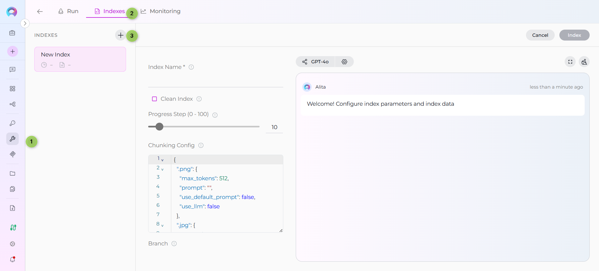

# Indexing Quick Start

Get started with the new Indexing Tab interface in just a few minutes. This guide shows you how to create your first index and start searching your data.

## Prerequisites

Before you begin, ensure you have:

- ✅ **PgVector configured** - Set up in [AI Configuration](../menus/settings/ai-configuration.md)
- ✅ **Embedding Model selected** - Choose your preferred model
- ✅ **Toolkit with indexing support** - GitHub, Confluence, Jira, etc.

## Quick Steps

### 1. Access the Indexing Interface

1. Navigate to **Toolkits** in the main navigation
2. **Select a toolkit** that supports indexing (e.g., GitHub, Confluence, Jira)
3. **Click the "Indexes" tab** in the toolkit detail view (`enabled when "Index Data" tool is selected and PgVector + embedding model are configured`)
4. The Indexes interface opens with sidebar showing existing indexes

### 2. Create Your First Index

1. **Click the + Icon** (+ Create New Index button) in the Indexes sidebar
2. **Fill required fields** in the new index creation form:
     - **Index Name (Collection Suffix)**: Unique name for your index (max 7 characters, e.g., `docs`, `main`)
     - **Toolkit-specific parameters** (varies by toolkit type)
3. **Configure optional settings:**
     - **Progress Step**: Progress reporting interval (0-100)
     - **Clean Index**: Remove existing data before indexing
     - **Chunking Config**: Document chunking configuration
4. **Click "Index"** button to start processing (button activates when required fields are filled)

### 3. Start Searching

Once indexing completes:

1. **Select your completed index** from the sidebar 
2. **Navigate to Run Tab** in the center panel
3. **Choose a search tool** from the dropdown menu:
      - **Search Index**: Basic semantic search
      - **Stepback Search Index**: Advanced search with query decomposition
      - **Stepback Summary Index**: Search with automatic summarization
4. **Enter your query** (e.g., "How do I configure authentication?")
5. **Configure search parameters** (optional): Filter, Cut Off, Search Top, etc.
6. **Click Run** to execute search and view results in the right panel chat interface

## Example: GitHub Repository Index

Here's a complete example for indexing a GitHub repository:

**Step 1: Create Index**

- Click **+ Create New Index** in sidebar
- **Index Name**: `docs` (collection suffix)
- Configure GitHub-specific parameters (repository, branch, etc.)
- Click **Index** button

**Step 2: Monitor Progress**

- Watch progress bar in center panel
- Wait for ✅ **Completed** status (~2-5 minutes depending on size)

**Step 3: Search**

- Select completed index from sidebar
- Navigate to **Run** tab
- Choose **Search Index** from tool dropdown
- Enter query: `"API authentication best practices"`
- Click **Run** button

---

🎉 **You're ready!** Start indexing your data and unlock powerful search capabilities across your content.

!!! info "Next Steps"
    - **[Indexing Overview](../how-tos/indexing/indexing-overview.md)** - General concepts and getting started
    - **[Complete User Guide](../how-tos/indexing/using-indexes-tab-interface.md)** - Detailed interface documentation
    - **[Indexing Tools](../how-tos/indexing/indexing-tools.md)** - Advanced search parameters 