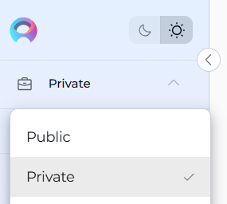
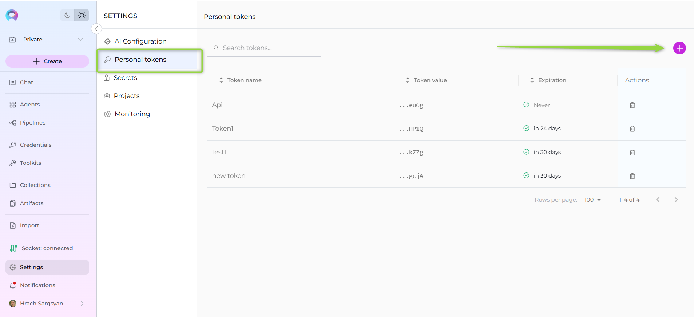
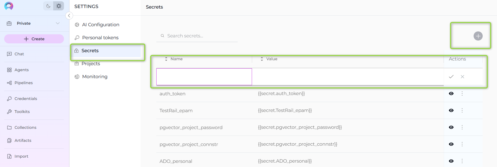
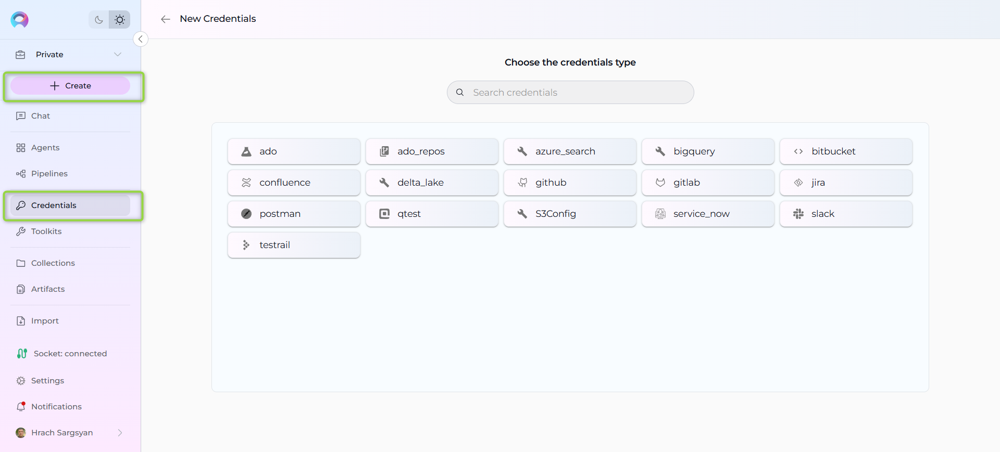
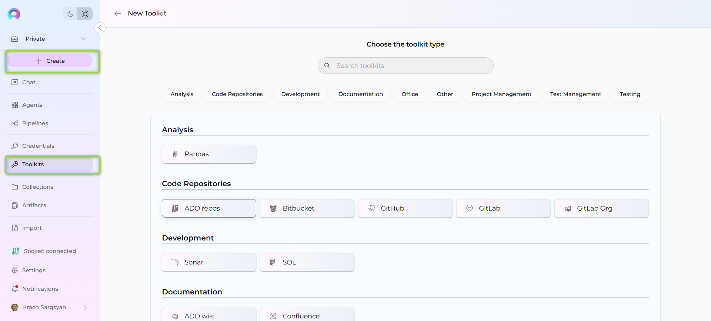
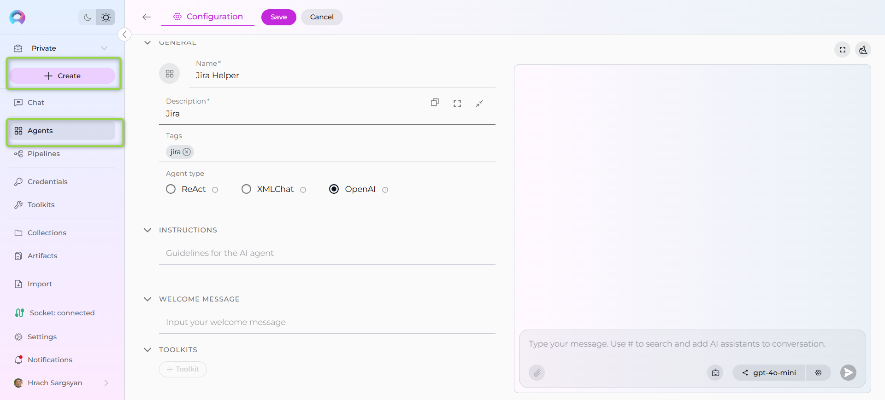
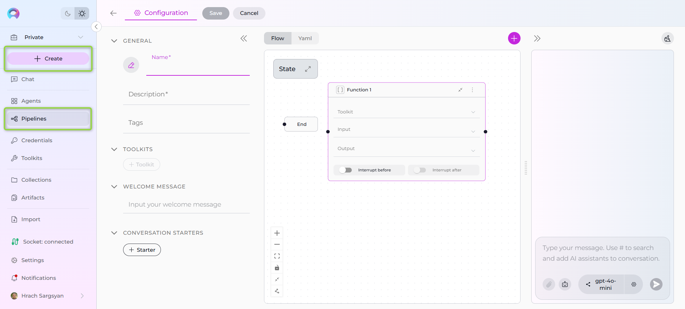
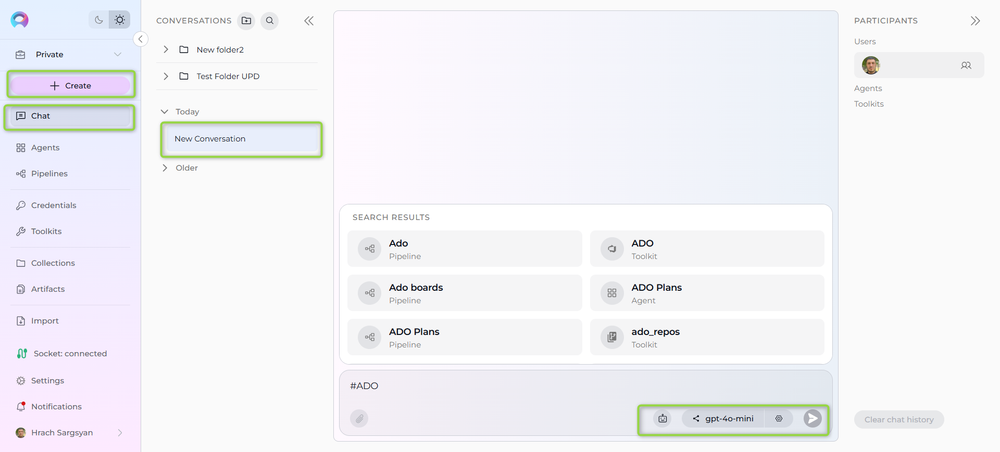

# Quick Start with ELITEA

Welcome to ELITEA! This guide will help you quickly get up and running with the platform, from your first login to creating your first AI-powered agent. Follow these steps to start leveraging the full power of ELITEA's AI capabilities.

## In this guide, you will:

* **Access the ELITEA platform** and set up your workspace.
* **Create and configure your Private project** for personal usage and experiments.
* **Generate a Personal Access Token** for secure API access and integrations.
* **Set up Secrets** for secure storage of sensitive information like API keys.
* **Create Credentials** to connect your agents to external services.
* **Build your first Toolkit** to integrate with external systems (GitHub, Jira, etc.).
* **Create your first AI Agent** with custom instructions and conversation starters.
* **Design a Pipeline** for complex, multi-step AI workflows.
* **Start your first conversation** with your newly created agent.
* **Learn organization techniques** for managing your AI resources effectively.

By the end of this guide, you'll have a fully functional AI agent connected to external services, ready to assist with your daily tasks.

---

## Step 1: Access the Platform

1. **Open Your Browser**: Use any modern web browser (Chrome, Firefox, Safari, Edge).
2. **Navigate to ELITEA**: Enter `https://next.elitea.ai` in your address bar.
3. **Login**: Sign in with your account credentials
4. **Initial Navigation**: You'll land in the **Chat** menu automatically.

---

## Step 2: Wait for Project Initialization

!!! info "Important"
     First-time users need to wait for project setup. The **Private** project is provisioned automatically.

1. **Be Patient**: Allow up to **5 minutes** for your **Private** project to be created automatically.
2. **Initial View**: You'll start in the **Public** project view during this initialization period.
3. **Check Status**: You'll know your **Private** project is ready when you can switch from **Public** to **Private** using the project switcher.

---

## Step 3: Switch to Your Private Project

1. **Locate Project Switcher**: Find the **Smart Drawer's Project Switcher** in the top left corner of the interface.
2. **Switch Projects**: Change from **Public** to **Private** once your project initialization is complete.
3. **Confirm Switch**: You should now see your private workspace where you can create and manage your own assets.

### Understanding Project Types

**Private Project**: Your personal workspace where only you have access to create and manage credentials, toolkits, agents, pipelines and collections.

**Team Projects**: If you're invited to team projects, you'll see them in the project switcher. Team projects enable:

* Collaborative workspaces with shared resources
* Role-based access (viewer, editor, admin, system)
* Shared conversations with teammate collaboration
* Real-time collaborative editing in Chat Canvas
* Shared credentials, toolkits, agents, pipelines, and collections for team use

**Public Project**: A community space to explore and learn from other users' shared content.

---

## Step 4: Generate a Personal Access Token

Before creating agents and toolkits, you'll need a personal token for secure access:

1. **Navigate to Settings:** 
    * Click the ELITEA icon in the top left to open the sidebar
    * Select **Settings** from the menu
2. **Access Personal Tokens**: Choose **Personal Tokens** from the Settings submenu.
3. **Create New Token:**
    * Click the **`+` icon** to create a new token
    * Enter a descriptive **name** (e.g., "My Development Token")
    * Set an **expiration date** for security
    * Click **Generate**
4. **Copy and Store:** **Immediately copy the token** and store it securely. This is the only time you'll see the full token value.
5. **Configure Integration:** (Optional):
    * Select your preferred **Integration Option** from the dropdown (e.g., gpt-4, gpt-4o)
    * Download VS Code or JetBrains settings if you plan to use code extensions

!!! note "Reference"
      For more information, see the [Personal Access Tokens Guide](../getting-started/create-personal-access-token.md) and [Elitea Code Extensions](../integrations/extensions/elitea-code.md).

---

## Step 5: Create Your First Secret

Secrets provide secure storage for sensitive information like API keys and passwords:

1. **Navigate to Settings**: Open the sidebar and select **Settings**.
2. **Access Secrets**: Choose **Secrets** from the Settings submenu.
3. **Create New Secret**:
     * Click the **`+ Create`** button
     * Enter a descriptive **name** (e.g., "GitHub-API-Key", "OpenAI-Token")
     * Add your sensitive **value** (API key, password, token, etc.)
     * Optionally add a **description** explaining what this secret is for
     * Click **Save**
4. **Secure Storage**: Your secret is now encrypted and stored securely for use in credentials and toolkits.

!!! info "Important"
     Secrets are write-only for security. Once saved, you cannot view the actual value again, only reference it by name.

!!! note "Reference"
      For more information, see the [Secrets Management](../menus/settings/secrets.md)

---

## Step 6: Create Your First Credential

Credentials allow your agents to securely connect to external services:

1. **Navigate to Credentials**: Open the sidebar and select **Credentials**.
2. **Create New Credential**:
     * Click the **`+ Create`** button
     * Choose your **Credential Type** (e.g., GitHub, Jira, Azure DevOps)
     * Fill in the required fields (API keys, usernames, passwords, or secrets)
     * Give it a clear, descriptive **name**
     * Click **Save**.
  

!!! note "Reference"
      For more information, see the [Credentials Guide](../menus/credentials.md)

---

## Step 7: Build Your First Toolkit

Toolkits connect your agents to external systems and services:

1. **Navigate to Toolkits**: Open the sidebar and select **Toolkits**.
2. **Create New Toolkit**:
      * Click the **`+ Create`** button
      * Select the **Toolkit Type** that matches your credential (e.g., GitHub, Slack, Jira)
      * Enter a **name** and optional **description**
3. **Configure the Toolkit**:
      * In the CONFIGURATION section, select your previously created credential from the dropdown
      * Fill in any additional settings (API endpoints, project keys, etc.)
      * In the "Tools" section, **enable only the specific tools** your agent will use
4. **Save**: Click **Save** to create your toolkit.

!!! note "Reference"
      For more information, see the [Toolkits Guide](../menus/toolkits.md).

---

## Step 8: Create Your First Agent

Agents are AI-powered assistants that can perform tasks using your toolkits:

1. **Navigate to Agents**: Open the sidebar and select **Agents**.
2. **Create New Agent**:
     * Click **`+ Create`** to start building your agent
     * Enter a clear **name** (e.g., "GitHub Assistant", "Jira Helper")
     * Add a **description** explaining what your agent does
     * Optionally add **tags** for organization
3. **Configure Agent Details**:
     * Choose the appropriate **Agent Type** (typically "OpenAI" for general use)
     * Write clear **instructions** for your agent's behavior
     * Add **conversation starters** to guide users
     * Set a **welcome message** (optional)
5. **Save**: Click **Save** to activate your agent
4. **Add Toolkits**:
     * Scroll to the **"Toolkits"** section
     * Click **"+ Toolkit"**
     * Select your previously created toolkit from the list.

!!! note "Reference"
      For more information, see the [Agents Documentation](../menus/agents.md).

---

## Step 9: (Optional) Create a Pipeline

Pipelines are visual workflows that can orchestrate multiple agents and automate complex processes:

1. **Navigate to Pipelines**: Open the sidebar and select **Pipelines**.
2. **Create New Pipeline**:
     * Click **`+ Pipeline`**
     * Enter a **name** and **description**
     * Add **tags** if desired
3. **Configure Pipeline**:
     * Add and configure **toolkits** as needed
     * Set up **welcome messages** and **conversation starters**
     * Design your workflow using the visual pipeline editor
4. **Build Your Flow**:
     * **Add Nodes**: Use different node types like `function`, `tool`, `llm`, and `loop`
     * **Connect Nodes**: Link nodes to define the execution sequence
     * **Set Entry Points**: Define where your pipeline starts
     * **Configure Transitions**: Specify how data flows between nodes
5. **Save**: Click **Save** when your pipeline is ready.

!!! note "Reference"
     For detailed pipeline creation with YAML instructions and advanced flow configurations, refer to the [Pipeline Agent Framework User Guide](../features/pipelines/pipeline-agent-framework.md) or [Pipelines Documentation](../menus/pipelines.md).

---

## Step 10: Start Your First Conversation

Now it's time to test your setup:

1. **Navigate to Chat**: Click on **Chat** in the sidebar.
2. **Create New Conversation**:
    * Click the **`+ Create`** button
    * Give your conversation a name (or use the default)
3. **Select Your Assistant**:
     * Look for the assistant switcher at the bottom of the chat
     * Click the **Switch assistant** icon
     * Select your newly created agent from the list
     * Alternatively, type **`#`** followed by your agent's name (e.g., `#GitHubAssistant`)
4. **Start Interacting**:
     * Use your predefined conversation starters, or
     * Ask your agent to perform tasks using its connected toolkit
     * Test different capabilities to ensure everything works correctly

!!! note "Reference"
     For more information, see the [Chat Documentation](../menus/chat.md).

---

## Step 11: Organize and Expand

As you become comfortable with the platform:

1. **Create Folders**: Organize your conversations using folders in the Chat section.
2. **Build Collections**: Group related prompts, agents, and pipelines in **Collections** for better organization.
3. **Create Datasources**: Connect your own data to make your agents more context-aware.
4. **Explore Advanced Features**: Try pipeline agents for complex workflows, artifacts for file sharing, and extensions for development environments.

---

## Quick Troubleshooting

**Agent not working?**

  * Verify toolkit credentials are correct
  * Check that your agent has the necessary toolkits assigned
  * Ensure you have proper permissions for external services

**Can't see your Private project?**

  * Wait the full **5** minutes for initialization
  * Try refreshing your browser
  * Check the project switcher in the top left

**Token issues?**

  * Make sure you copied the full token immediately after generation
  * Check that your token hasn't expired
  * Verify integration settings match your intended use

---

## What's Next?

You're now ready to explore ELITEA's full potential! Consider these next steps:

* **Dive Deeper**: Explore the [platform documentation](https://elitea.ai/docs) for advanced features.
* **Join the Community**: Check out public agents and pipelines for inspiration.
* **Integrate Development Tools**: Set up VS Code or JetBrains extensions using your personal token.
* **Scale Your Workflows**: Create pipeline agents for complex, multi-step processes.
* **Share Your Work**: Publish useful agents and prompts to help other users.

Welcome to the future of AI-powered productivity with ELITEA!
