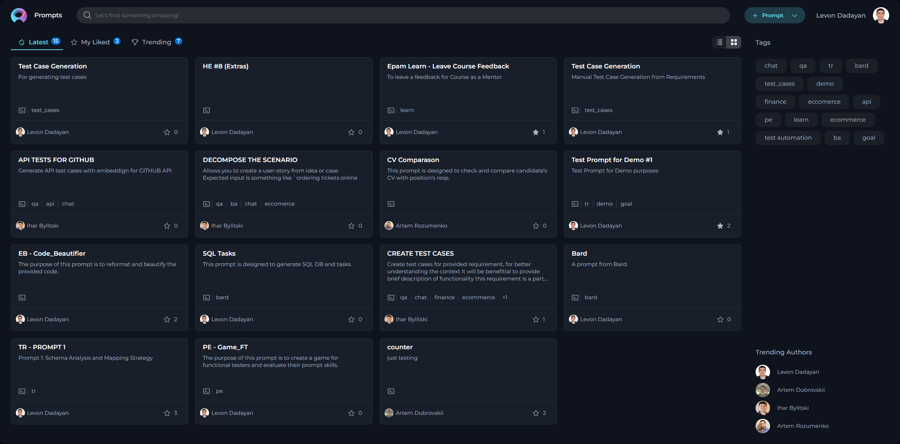

#  How to Create and Publish Useful Prompts for Testing and QA Activities 

## Introduction

Welcome to our comprehensive guide designed to empower our Testing and Quality Assurance (QA) community in the crafting and sharing of valuable prompts, specifically tailored for an array of testing activities. In today's rapidly evolving software development landscape, the adoption of Generative AI Tools has become increasingly instrumental in augmenting our testing efforts. These cutting-edge tools offer unparalleled capabilities in automating and innovating processes ranging from generating test cases and creating detailed test plans to formulating comprehensive test strategies and writing automation scripts. Additionally, they play a critical role in generating realistic and diverse test data, facilitating a more thorough and effective testing process.

The intention behind this activity is twofold: to streamline the process of prompt generation that leverages Gen AI Tools, ensuring that these prompts become potent tools in identifying and resolving defects, bolstering product quality, and refining our testing strategies. Moreover, it seeks to evolve our QA community to actively contribute to and share their expertise through valuable prompts. By participating in enriching our Prompt Library, you not only aid in creating a substantial repository of resources but also contribute to a culture of knowledge sharing and collective growth within our community.

We encourage you to share prompts across various domains, including but not limited to, generating test cases, creating comprehensive test plans and strategies, developing automation scripts, and generating test data. This endeavor will not only help elevate the efficiency and effectiveness of our testing processes but also foster innovation and creativity within our QA practices.

In leveraging Gen AI tools, it is imperative to always review the generated outputs meticulously to ensure they not only meet our stringent quality standards but also strictly adhere to Epam’s security guidelines and policies. Our collective commitment to maintaining the highest level of security and protecting sensitive information is paramount and non-negotiable.

Your contribution to this initiative will play a pivotal role in enhancing our testing capabilities, driving quality improvements, and maintaining our competitive edge in delivering superior software solutions. Let us embark on this journey together, fostering a vibrant and collaborative QA community that thrives on innovation, excellence, and shared success.

## Access to Alita

To access it:

1. Open your browser.
2. Type in <https://alita.lab.epam.com> in the address bar.
3. Provide your EPAM account to login. **Note**: No need for registration.
4. After successful login, you are navigated to the **Prompts** menu.
5. Once you have access, navigate to **Discover→My Library** menu, where you will be able to create prompts and collections. **Note:** If you are logging in for the first time into Alita, wait for 5 minutes to allow private project initialization to be completed before creating prompts. 

**Note**: You need to enable Epam VPN to access Alita.

## Prompts

Prompts are essentially instructions or scenarios designed to generate outcomes to assist QA activities. The effectiveness of the prompts directly correlates with the efficiency and accuracy of our testing efforts. To ensure that every prompt we create serves its purpose effectively, it’s crucial to adhere to several foundational principles. These guidelines not only help in crafting prompts that are valuable and practical but also ensure that they align with our overarching goals of security, versatility, and clarity in our QA processes. With this context in mind, let’s delve into the core principles that should guide the creation of effective prompts:

**Creating Effective Prompts**

1. **Relevance**: Directly tie your prompt to testing and QA activities to ensure relevance.
2. **Clarity**: Utilize clear, concise language for better comprehension.
3. **Specificity**: Clearly mention the testing phase, type, and specific focus area of the prompt.
4. **Scalability**: Aim for prompts that can be broadly applied across various projects.
5. **Security**: Avoid including any customer data or sensitive information.

### How to Create a Prompt

Creating a prompt involves capturing essential details that guide the testing process effectively. Here is how you can create a prompt that adds value:

1. **Initiate Prompt Creation**: Click the **+ Prompt** button located at the top right of your screen to start crafting your prompt.
2. **Provide Prompt Details**:
    * **Name**: Assign a descriptive name that clearly reflects the aim of the prompt.
    * **Description**: Summarize the purpose of the prompt, detailing what it intends to achieve. **Note**: The Name and Description fields are crucial for others to understand the prompt’s purpose and are not editable after saving.
    * **Tag(s)**: A descriptive Tag(s) for grouping the prompts.
    * **Context**: Well crafted prompt corresponding to well-acceppted Frameworks for creating prompts (e.g. CREATE, CRISPE, Elavis Saravia, etc.).
    * In case the prompt's context contains **Variables** - then a descriptive variable name.
    * In case the prompt has **System** or **Assistant** messages - then those messages must be informative.
3. **Select the Model**: Choose the appropriate model (e.g., gpt-3.5-turbo, gpt-4-0125-preview, etc.) for which the prompt has been tailored and tested.
4. **Configure Advanced Settings**: Tune the output of your prompt by adjusting configurations such as Temperature, Top P, Top K, and Maximum length, ensuring the prompt's output aligns with expectations.
5. **Test Your Prompt**: Execute the prompt and review the results to confirm everything functions as intended.
6. **Finalize**: Click Save to keep your draft or proceed to the next step to share your work with the community.

**Providing Name, Description and Context of the prompt:**

**Setup Variables:**

**Configuring Advanced Settings:**

#### Prompt Requirements for Consistency and Quality

When crafting your prompt, ensure it includes the following elements for clarity and effectiveness:

* **Descriptive Name**: Clearly indicates the focus of the prompt.
* **Brief Description**: Eloquently explains the prompt’s goal.
* **Descriptive Tags**: Facilitates prompt categorization and searchability.
* **Framework Adherence**: Ensures the prompt aligns with accepted Prompt creation frameworks (e.g., CREATE, CRISPE, Elavis Saravia, etc.).
* **Variable Clarity**: In scenarios with variables, use descriptive names.
* **Informative System Messages**: If your prompt generates system or assistant messages, they must be clear and helpful.
* **Expected Outcomes**: Define what successful application of the prompt looks like.

### Submitting Your Prompt for Publishing

To make your prompt available to the wider QA community, follow the steps below for publication:

1. **Publishing Initiation**: With your prompt crafted and saved, click the Publish button to start the submission process.
2. **Version Naming**: Provide an informative version name (e.g., Gen-1.0) in the pop-up window. This name should reflect the content or purpose of the prompt, aiding in version control and future modifications.
3. **Review Submission**: Click Publish to submit your prompt for the moderation review process. This step is crucial to ensure the quality and relevance of prompts available to the QA community.

**Publishing the prompt:**

**Providing Version:**

## Review Process by Moderators and Outcome of Prompt Submission

### Moderator Review Process

After a prompt is submitted for publication, it enters a critical assessment phase led by our designated moderators. Our moderators are QA professionals with a broad understanding of what constitutes a high-quality, effective prompt.
The review process aims to ensure that each prompt meets our standards for relevance, clarity, security, and overall utility. 

The moderators follow a structured evaluation protocol:

1. **Initial Assessment**: Moderators perform an initial check to ensure that the prompt submission is complete and adheres to the submission format.
2. **Content Review**: The content of the prompt is closely examined for its relevance to QA activities, clarity of instructions, adherence to accepted frameworks, and the security of information.
3. **Practical Evaluation**: Moderators assess the prompt’s practical application, reviewing variables, system messages for clarity, and the feasibility of expected outcomes.
4. **Compliance Check**: There's a final compliance check against our community guidelines and security policies to ensure no sensitive information is shared.

### Possible Outcomes of the Review

After the review process, the prompt can have one of the following outcomes:

* **Published**: The prompt meets all requirements and is made available in the Prompt Library for the entire network.
* **Feedback for Revision**: The prompt has potential but requires changes. Specific feedback is provided for refinement.
* **Rejected**: The prompt does not meet the necessary criteria and cannot be published in its current form. Reasons for rejection are shared with the submitter.

**Statuses of Prompts**

Users can track the status of their prompts throughout the review process. The following statuses are available:

* **All Statuses**: A general view of all submitted prompts irrespective of their current stage.
* **Draft**: The prompt is saved but not yet submitted for publishing.
* **Published**: The prompt has been approved by moderators and is available in the Library.
* **On Moderation**: The prompt is currently being reviewed by the moderators.
* **User Approval**: The prompt is pending prompt's author approval for publishing a new version.
* **Rejected**: The prompt has been reviewed and rejected for publication.

To check the status of your submitted prompts, navigate to "**My libraries → Prompts**" page on the platform, and select the status you wish to view from the dropdown menu.

### Engagement with Prompts: Liking and Trending

Once a prompt is published, it becomes an essential resource for the QA community. You are encouraged to engage with these prompts through our "**Like**" functionality. Prompts that receive a significant number of likes can appear in the "**Trending**" page of the Prompt Library, highlighting their popularity and usefulness.

The "**Trending**" page serves as a quick reference for discovering highly valued prompts within the community. To like a prompt, simply click on the heart icon associated with the prompt in the Prompt Library. Your engagement helps in identifying the most impactful prompts, enriching our QA processes and driving a culture of continuous improvement and collaboration.

By understanding and participating in the review process, you are contributing to a shared knowledge base that benefits the entire QA community. Your efforts and interactions, including submitting, refining, and liking prompts, play a crucial role in enhancing our collective testing efficacy.

## Collections

Following the creation and publishing of individual prompts, the next step is the organization and further dissemination of these prompts through Collections. Collections serve as a means to group prompts by theme, project, testing phase, or any other meaningful categorization that enhances accessibility and usefulness for the QA community. This section will guide you through creating collections, adding prompts to them, publishing these collections, and how your peers can interact with them through likes.

**The Purpose and Usefulness of Collections**

Collections are immensely valuable for several reasons:

* **Thematic Organization**: They allow for the grouping of prompts by specific themes or projects, making it easy for users to find a set of related prompts.
* **Efficiency**: By organizing prompts into collections, we save time for our QA engineers by providing consolidated resources that can be easily accessed and applied.
* **Sharing Best Practices**: Collections can be shared across teams, promoting best practices and unified testing approaches across different projects.

### Creating Collection

1. Click the **+ Collection** button located at the top right corner.
2. You will be prompted to fill in the **Name** and **Description** fields. Remember, these fields are essential as they give the first impression and understanding of what your collection is about.

### Adding Prompts to Your Collection

To add prompts to your collection, follow these steps:

1. Once you've created a collection, you can start adding relevant prompts. Navigate to the prompt you wish to add and select an option to Add to Collection.
2. Select the Collection you wish to add your prompt to from the pop-up window. You can add multiple prompts to a collection as long as they share the thematic relevance or purpose you've defined for your collection.

### Publishing Your Collection

Publishing your collection makes it available to the entire QA network, allowing others to benefit from the curated set of prompts you've organized:

1. After adding the desired prompts to your collection, open the collection and review the content to ensure completeness and relevance.
2. Click the **Publish** icon to submit your collection for review. This process is similar to publishing individual prompts, where your collection will be reviewed for adherence to our guidelines and overall quality.
3. Once approved, your collection will be published and accessible from the Collection menu, ready to be used by the community.

**Note**: A Collection must contain public prompts before publication.

### Engagement with Collections: Liking and Trending

Just as with individual prompts, users are encouraged to engage with collections through likes. This interaction is crucial for several reasons:

* **Recognition**: Liking a collection serves as a form of recognition and appreciation for the contributor's effort in curating valuable resources.
* **Visibility**: Collections with a high number of likes gain visibility and are more likely to appear in the "Trending" page, ensuring that the most useful collections are easily accessible to the community.
* **Feedback Mechanism**: Likes serve as a feedback mechanism, helping contributors understand the impact and usefulness of their collections, guiding future efforts in prompt and collection creation.

By actively creating, contributing to, and engaging with collections, QA engineers enhance the shared knowledge base and support the continuous improvement of testing practices within the community. Collections not only facilitate access to valuable testing resources but also foster a collaborative environment where knowledge and best practices are freely exchanged.

## Contribution

### Why Share Your Prompts?

Sharing your prompts not only contributes to the collective knowledge of our QA community but also highlights your expertise and creativity.
By contributing, you’re directly impacting the efficiency and efficacy of our testing processes, encouraging a culture of innovation and continuous improvement.

### Rewards and Recognition

To acknowledge the value of your contributions, we have an Appreciation Program in place. Leading contributors will be recognized by the Management Team.
Your innovation could lead the way in defining our testing standards - an opportunity to shine and be recognized among your peers.
By following these enhanced guidelines and utilizing the provided resources, you're well on your way to creating impactful prompts that can significantly improve our QA practices.
Let's work together to build a richer, more effective Prompt Library for everyone in our network.

## Useful Resources

### Alita

* [Alita - User Guide](user-guide.md)
* [Alita - Release Notes](release-notes.md)
* [Alita overview](https://kb.epam.com/display/EPMQAOPALT/Alita+overview)

### Prompt Engineering

* [Prompt Engineering Foundations](https://learn.epam.com/detailsPage?id=92d11cb4-dbaa-45a3-8b22-60f9f391f588)
* [EngX AI-Supported Quality Assurance Engineering](https://learn.epam.com/detailsPage?id=1c89e986-9a96-4aed-8166-291af0a8a19c)
* [Guide to Effective Prompting](https://www.promptingguide.ai/)
* [Introduction to Prompt Engineering](https://www.youtube.com/watch?v=AgGu96_rnXo&list=PLYio3GBcDKsPP2_zuxEp8eCulgFjI5a3g)