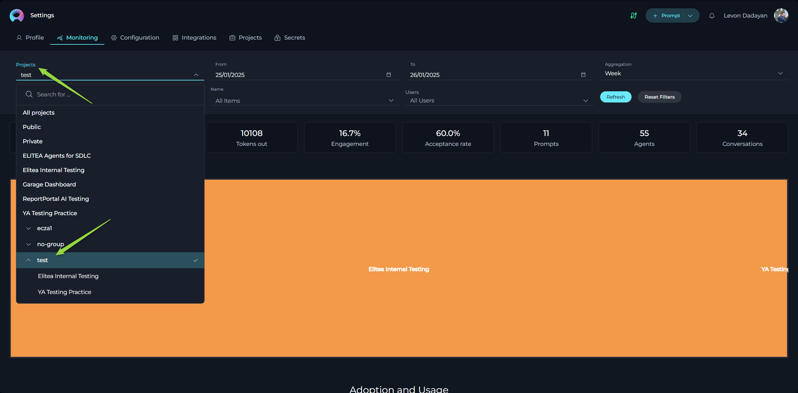
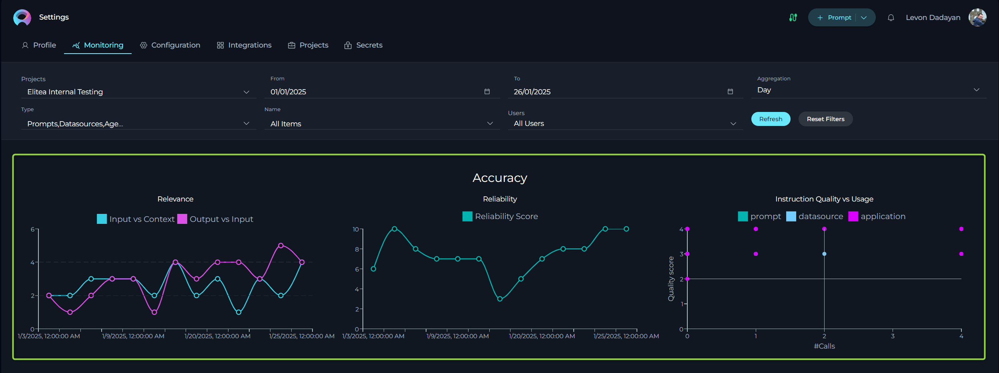

# ELITEA Monitoring User Guide: Understanding Application Usage and Performance

## Introduction

This user guide provides a comprehensive overview of the **Monitoring** feature in ELITEA. This powerful tool is designed to offer deep insights into the application's usage and performance, empowering administrators and users to make informed decisions for optimization and improvement. Whether you're looking to understand user engagement, assess the effectiveness of your  entities (prompts, datasources, agents and conversations), or identify areas for enhancement, the Monitoring feature provides the data and visualizations you need.


**Purpose of the Monitoring Feature:**

* **Gain Insights into Application Usage:** Understand how users are interacting with ELITEA, including the frequency of use, active user trends, and popular features.
* **Evaluate Each Entity Performance:** Assess the effectiveness of your prompts, datasources, and agents by tracking metrics like **user engagement** and **acceptance rate of AI generated output**.
* **Identify Areas for Optimization:** Pinpoint areas where user engagement can be improved and understand how effectively AI generated outputs are being utilized.
* **Make Data-Driven Decisions:** Utilize concrete data and visualizations to guide your strategies for improving ELITEA's adoption and effectiveness.

**How to Use This Guide:**

This guide is structured to provide a detailed understanding of each aspect of the **Monitoring** feature. You will find explanations of key metrics, how they are calculated, and how to interpret the various charts and data presented. Whether you are a Chapter Manager, Project Admin, or a user interested in understanding ELITEA usage, this guide will equip you with the knowledge to effectively utilize ELITEA's monitoring capabilities.

## Overview of Monitoring Feature

The ELITEA Monitoring feature is a powerful analytics tool designed to track and visualize key aspects of application usage and the effectiveness of AI-driven workflows.  It allows users with administrative roles to gain valuable insights into how ELITEA is being adopted and utilized within their projects and portfolios.

**Key Monitoring Capabilities (Currently in Scope):**

* **User Engagement:** Measures how actively users with the "**Monitor**" role are interacting with ELITEA projects. This helps understand the adoption and active usage levels within your teams.
* **Acceptance Rate of AI Generated Output:**  Tracks how often users accept and utilize the outputs generated by ELITEA's prompts, datasources and agents. This metric provides insights into the perceived usefulness and quality of the AI-driven assistance provided by ELITEA.

**Important Note:**
  
* ELITEA's Monitoring feature **exclusively tracks activities performed by users who have been assigned the "Monitor" role** within ELITEA projects. This ensures that the metrics reflect the engagement and usage patterns of designated users who are intended to utilize and benefit from ELITEA's capabilities.
* It's important to note that **Monitoring is a cross-project capability**. This means that regardless of which project is currently selected in the **Project** dropdown menu at the top of the screen, the Monitoring screen will provide data aggregated across all projects that you have Admin access to. This allows for portfolio-level analysis and a holistic view of ELITEA usage across your organization.

**Future Enhancements:**

ELITEA's Monitoring feature is continuously evolving. Future updates will expand the scope of monitoring capabilities to include metrics that measure:

* **Relevancy of User Input:**  Assess how well user inputs align with the intended context and purpose of ELITEA's functionalities.
* **Relevancy of Output Generated by ELITEA:** Evaluate the quality and relevance of the outputs generated by ELITEA in relation to user inputs and needs.

These future metrics will provide even deeper insights into the effectiveness and efficiency of ELITEA, allowing for more fine-tuned optimization and improvement.

Here's the enhanced section for the ELITEA Monitoring User Guide, detailing Project Types, Grouping, and User Role Assignment for Monitoring:

## Project Scope and User Roles in Monitoring

ELITEA Monitoring provides flexible options to analyze data at different levels, from individual projects to aggregated group (portfolio) views. Understanding the different project types and user roles is crucial for effectively utilizing the Monitoring feature.

### Project Types in ELITEA Monitoring

ELITEA Monitoring allows you to review data across various project scopes, catering to different analytical needs:

*   **All projects:** This option provides a comprehensive, aggregated view of monitoring data across **all projects** available within your ELITEA deployed environment. This is useful for high-level, organization-wide analysis.
*   **Public Project:** ELITEA includes a default **Public project**, accessible to all users. Monitoring data for the Public project can be reviewed separately to understand usage patterns within this shared space.
*   **Private Workspace:** Each user has a personal **Private** workspace. You always have access to your own **Private** workspace and can review its monitoring data in isolation.
*   **Team Projects:**  These are projects created for specific teams or purposes. Access to *Team* projects and their monitoring data is controlled by user roles and permissions.
*   **Groups (Portfolios):** ELITEA allows you to group multiple projects together into user-defined **Groups** (often referred to as Portfolios). This enables you to aggregate monitoring data across a collection of related projects for portfolio-level reporting and analysis.

**Access and Permissions:**

Your access to monitoring data for different project types depends on your role and permissions within ELITEA:

*   **Project and Group Access Based on Roles:**  Within the Monitoring feature, the projects and groups you can select and view data for are determined by your Admin role and project/group memberships.
*   **Private Workspace and Public Project Access:**  All users will always have access to monitoring data for the **Public** project and their own **Private** workspace.

### Grouping Projects for Portfolio-Level Monitoring

To facilitate portfolio-level reporting and analysis, ELITEA allows you to group multiple projects together. Here's how to create and utilize Project Groups for monitoring:

**Creating a Project Group:**

1.  **Select a Team Project:** From the **Projects** dropdown list at the top of the ELITEA interface, select a **Team project** that you want to include in a group.
2.  **Navigate to Project Settings:** Go to **Settings -> Projects page**.


3.  **Edit Groups:** Locate the **Groups** field (displayed as "Groups:") and click the **Pencil** icon next to it to edit the project's group membership.
4.  **Create or Select a Group:**
    *   **Create New Group:** To create a new group, type the desired **group name** in the input field.
    *   **Select Existing Group:** To add the project to an existing group, start typing the name of the group and select it from the dropdown list of existing groups that appears.
5.  **Save Group Assignment:** Click the **"Save"** button (or a checkmark icon) to add the selected project to the specified group.


6.  **Repeat for Other Projects:** To add more projects to the same group, select another **Team project** from the **Projects** dropdown list and repeat steps 2-5, ensuring you select the *same* group name in step 4.
7.  **Access Group Monitoring Data:** Navigate to the **Monitoring** page.
8.  **Select Project Group in Filters:** Click the **Projects** dropdown in the Filtering Panel. Scroll down the list – you will now see your newly created **Project Group** listed at the bottom, along with the individual projects that are members of that group.
9.  **View Portfolio-Level Metrics:** Click on the name of your created **Project Group** in the **Projects** dropdown. The Monitoring page will now display aggregated metrics and charts for *all projects* that are members of that group, providing a Portfolio-level view.



**Navigating Project Groups and "All projects" in Monitoring:**

When you select a **Project Group** (or **"All projects"**) in the **Projects** dropdown on the Monitoring page, you will notice a visual representation of the projects included in that scope.

*   **Project Rectangles:** Below the "Projects" dropdown, you will see a series of selectable rectangles, each representing a project that is part of the selected Group (or all projects if "All projects" is selected).
*   **Drilling Down into Individual Projects:** These rectangles are interactive. By **clicking on a specific project rectangle**, you can "drill down" into the monitoring data for that individual project. The Monitoring page will then update to display metrics and charts specifically for the project you clicked on, allowing for more granular project-level analysis.

### Assigning the "Monitor" Role to Users in Team Projects

By default, users are automatically assigned the "Monitor" role only within their **Private workspace** and the **Public project**. To enable monitoring for users within **Team projects**, you need to explicitly assign them the "Monitor" role within those projects. Only users with the **Admin role** in a project have the permission to change roles for other users in that project.

**Assigning the "Monitor" Role:**

1.  **Select the Team Project:** From the **Projects** dropdown at the top of the ELITEA interface, select the **Team project** where you want to assign the "Monitor" role to a user.
2.  **Navigate to Project Settings:** Go to **Settings -> Projects page**.
3.  **Locate Teammates Table:** Scroll down the "Projects" page to find the **"Teammates"** table. This table lists all users who are members of the selected Team project and their assigned roles.
4.  **Edit User Role:** Find the row corresponding to the user to whom you want to assign the "Monitor" role. Click the **Pencil icon** in the "Role" column for that user to edit their role.
5.  **Select "Monitor" Role:** In the role dropdown menu that appears, select **"Monitor"** as the new role for the user.
6.  **Apply Changes:** Click the **Checkmark icon** (or "Save" button) to apply the role change and save the updated user role.


After assigning the "Monitor" role to users in your Team projects, their activities within those projects will be included in the ELITEA Monitoring data, allowing you to track their engagement and the effectiveness of ELITEA within your teams.


## Accessing Monitoring Within ELITEA

To access the Monitoring screen in ELITEA, follow these steps:

1.  **Open Settings Menu:** Click on your user avatar located in the top right corner of the ELITEA interface. This will open the settings menu.
2.  **Select Monitoring:** In the **Settings** menu, click on the **"Monitoring"** option.
3.  **Monitoring Landing Page:** After selecting "Monitoring," you will be redirected to the **Monitoring Landing Page**. This page is the central dashboard where you can filter, view, and analyze various monitoring metrics.


**Key Components of the Monitoring Landing Page:**

The **Monitoring Landing Page** is designed to be intuitive and informative, providing a clear overview of ELITEA usage and performance. It is structured into three main panels, each serving a distinct purpose:


* **1. Filtering Panel: Tailoring Your Data View**

    The **Filtering Panel**, located prominently at the top of the Monitoring Landing Page, is your control center for customizing the data displayed throughout the dashboard.  It allows you to precisely define the scope of your analysis by applying various filters.  By using these filters, you can focus on specific projects, timeframes, Use Cases, or even individual users to gain targeted insights.

    Here's a breakdown of the filtering options available:

    *   **Projects:**  This dropdown menu allows you to select the specific projects or pre-configured Portfolio groupings you want to include in your analysis.
        *   **Single Project Selection:** Choose a specific project from the list to view monitoring data relevant only to that project.
        *   **Group Selection:** Scroll to the bottom of the dropdown to select a user-defined  grouping. This aggregates data across all projects within that Group, providing a high-level overview.
        *   **All Projects:** By default, or by selecting an "All Projects" option (if available), you can view data aggregated across all projects you have Admin access to.

    *   **Time Period (From & To Dates):** These date fields enable you to define a custom reporting period.
        *   **"From" Date:**  Select the starting date for your analysis.
        *   **"To" Date:** Select the ending date for your analysis.
        *   The Monitoring feature will then calculate metrics and display charts based on data within this specified date range.

    *   **Type:** This dropdown filter allows you to narrow down the metrics to specific types of ELITEA entities. You can choose to focus on:
        *   **Prompts:** Analyze metrics related specifically to Prompt usage and performance.
        *   **Datasources:** Focus on metrics related to Datasource access and relevance.
        *   **Agents:**  View metrics related to Agent executions and effectiveness.
        *   **Conversations:** Analyze metrics related to user conversations within ELITEA. This allows you to understand overall conversation trends, user engagement at the conversation level, and acceptance rates within conversations.
        *   **Prompts, Datasources, Agents, Conversations (Combined):**  This option (often the default) aggregates metrics across all three entity types, providing a broader overview.

    *   **Name:** This dropdown filter becomes active when you select a specific "Type" (Prompts, Datasources, or Agents). It allows you to further refine your analysis to a specific entity *within* the selected type.
        *   **"All Items":** (Default) When "All Items" is selected, the metrics will be calculated for *all* entities of the chosen "Type".
        *   **Specific Entity Selection:** Choose a specific Prompt name, Datasource name, Agent name or Conversation name from the list to view metrics for that individual entity only.

    *   **Users:** This dropdown allows you to filter the data to show activity related to specific users.
        *   **"All Users":** (Default) Metrics are calculated based on the activity of all users with the "**Monitor**" role within the selected projects and timeframe.
        *   **Specific User Selection:** Choose a specific user from the list to view metrics related only to that user's activity.

    *   **Aggregation:** This dropdown menu allows you to control how the data is grouped and displayed in charts. Choosing the right aggregation level is crucial for visualizing data at the appropriate granularity for your analysis. Available aggregation options include:
        *   **Hour:** Data is grouped and displayed on an hourly basis. This provides the most granular view, allowing you to identify peak usage times within a day, track hourly fluctuations, and potentially pinpoint immediate issues or usage spikes.
        *   **Day:**  Data is grouped and displayed on a daily basis. This is a common and versatile aggregation level, useful for understanding daily usage patterns, tracking daily active users, and monitoring daily token consumption.
        *   **Week:** Data is aggregated and displayed on a weekly basis. This provides a broader view, smoothing out daily fluctuations and highlighting weekly trends in adoption, engagement, and performance. Weekly aggregation is often suitable for regular weekly reporting and tracking week-over-week changes.
        *   **Two Weeks:** Data is aggregated and displayed over two-week periods. This aggregation level can be particularly useful for teams or projects that operate in two-week sprints. It allows you to align your monitoring reports with sprint cycles and assess performance and usage across a complete sprint.
        *   **Three Weeks:** Data is aggregated and displayed over three-week periods. Similar to the "Two Weeks" option, this aggregation is beneficial for teams or projects following three-week sprint cycles. It provides a sprint-level view of metrics, enabling performance evaluation within the context of a three-week iteration.
        *   **Month:** Data is aggregated and displayed on a monthly basis. This provides the broadest overview, smoothing out weekly variations and highlighting long-term trends in adoption, usage, and performance over calendar months. Monthly aggregation is useful for high-level reporting, executive summaries, and identifying long-term patterns.

    *   **Refresh Button:**  After you have selected your desired filters in the Filtering Panel, **click the "Refresh" button to apply these filters.**  Clicking "**Refresh**" triggers the Monitoring feature to recalculate all metrics and update the charts based on your chosen criteria.

    *   **Reset Filters Button:** Click the "**Reset Filters**" button to clear all currently applied filters and revert the Monitoring Landing Page back to its default view, displaying data for all projects and the default timeframe.

    **Note on Filter Persistence:**

    ELITEA Monitoring remembers your filter selections during your active session for a seamless analysis experience.

    *   **Filters are Auto-Saved:** When you click **Refresh** your filter settings are saved for your current session.
    *   **Persistence Across Session:** Your filters remain active even if you navigate to other ELITEA pages or refresh the Monitoring page.
    *   **Resetting Filters to Default:** Filters are reset to default ("All Projects," "Default Time Period," etc.) only when:
        *   You click the "**Reset Filters**" button.
        *   You **log out** of ELITEA.

    This ensures you maintain your analysis context without re-applying filters repeatedly during your active session.


* **2. Key Metrics Summary Panel: At-a-Glance Performance Indicators**

    The **Key Metrics Summary Panel**, positioned below the **Filtering Panel**, provides a concise and easily digestible overview of the most important performance indicators for ELITEA. This panel displays key metrics as numerical values in individual boxes, allowing you to quickly grasp the overall state of application usage and effectiveness based on your applied filters.

    It's important to understand how filters affect the metrics displayed in this panel:

    *   **Project Filter Dependency:** The metrics **Users, Prompts, Agents, and Conversations** are **static counts** that are **only influenced by the "Projects" filter.**  Selecting different projects or groups in the "**Projects**" dropdown will change these numbers to reflect the totals *within* those selected projects. However, **these static counts are *not* affected by the "Time Period," "Type," "Name," or "Users" filters.** They always represent the total number of users, prompts, agents, and conversations *ever created* within the selected project(s).

    *   **Dynamically Filtered Metrics:** In contrast, the metrics **Tokens in, Tokens out, Engagement, and Acceptance Rate** are **dynamic** and **respond to *all* filters** applied in the Filtering Panel, including "Projects," "Time Period," "Type," "Name," and "Users." These metrics are recalculated and updated based on the specific filter criteria you set, providing contextually relevant performance indicators for your chosen scope.

    The metrics included in this panel are:

    *   **Users:**  Displays the **total number of unique users** who have *ever* interacted with ELITEA within the selected project(s). **(Static, Project filter dependent)**
    *   **Tokens in:** Shows the total number of tokens **generated by LLMs and sent back to ELITEA as responses** within the filtered scope. This reflects the **output token generation** for the applied filters. **(Dynamic, All filters dependent)**
    *   **Tokens out:** Displays the total number of tokens **sent to LLMs by ELITEA within the filtered scope.** This represents the **input token consumption** for the applied filters. **(Dynamic, All filters dependent)**
    *   **Engagement:** Presents the Engagement Rate as a percentage, indicating the proportion of active users with the "Monitor" role within the filtered scope and **time period**. **(Dynamic, All filters dependent)**
    *   **Acceptance Rate:** Shows the Acceptance Rate as a percentage, reflecting the proportion of conversations where users accepted the AI-generated output within the filtered scope and **time period**. **(Dynamic, All filters dependent)**
    *   **Prompts:** Displays the **total number of prompts** created within the selected project(s). **(Static, Project filter dependent)**
    *   **Agents:** Displays the **total number of agents** created within the selected project(s). **(Static, Project filter dependent)**
    *   **Conversations:** Displays the **total number of conversations** initiated within the selected project(s). **(Static, Project filter dependent)**

    Understanding which metrics are static and which are dynamic based on the filters is crucial for correctly interpreting the data presented in the Key Metrics Summary Panel and drawing accurate conclusions about ELITEA usage and performance.

* **3. Visual Metrics Panel: Detailed Charts and Trend Analysis**

    The **Visual Metrics Panel**, located below the **Key Metrics Summary Panel**, provides a comprehensive suite of charts and visualizations for in-depth analysis of ELITEA usage, performance, and user sentiment. This panel is organized into several sections, each focusing on a specific aspect of the monitoring data:

    *   **Adoption and Usage:** This section contains charts that visualize user adoption and overall application usage trends over time.
        *   **Active Users Chart:**  A bar chart visualizing the number of unique active users for each time interval (e.g., day, week, month) within your selected timeframe. This chart helps you understand user adoption trends and identify periods of high or low activity.  It often distinguishes between "active" and "inactive" users within each interval.
        *   **Token Usage Chart:** A line chart displaying the trend of token consumption over time. It typically shows two lines:
            *   **Tokens in:** Representing the number of tokens generated by the LLMs (output tokens).
            *   **Tokens out:** Representing the number of tokens sent *to* the LLMs (input tokens).
            This chart helps you monitor token usage patterns, identify potential cost optimization opportunities, and understand the computational demand on the LLM system over time.

    *   **Acceptance Rate:** This section features the **Acceptance Rate Chart**, a bar chart visualizing the number of interactions where users accepted the output versus those where they did not, for the selected period.

    *   **Sentiments:** This section provides insights into user and LLM sentiment through pie charts:
        *   **Human Input Chart:** A pie chart showing the distribution of sentiment (Positive, Negative, Neutral) in user inputs.
        *   **LLM Output Chart:** A pie chart showing the distribution of sentiment (Positive, Negative, Neutral) in LLM-generated outputs.

    *   **Accuracy:** This section presents charts related to the accuracy and quality of ELITEA interactions:
        *   **Relevance Chart:** A line chart displaying the average relevance scores of user inputs (vs. context) and LLM outputs (vs. user inputs) over time.
        *   **Reliability Chart:** A line chart showing the average reliability score of LLM responses over time.
        *   **Instruction Quality vs Usage Matrix:** A 2x2 matrix visualizing the relationship between the quality score and usage frequency of prompts (or other relevant entities).

    *   **Topics:** This section includes the **Topics Chart**, a clustered column chart showing the distribution of prompts, datasources, and agents across different identified topics.

    *   **Topics Summary:** This section features the **Topics Summary Chart**, a clustered column chart showing the distribution of user queries across different identified topics.

    These charts, collectively presented in the Visual Metrics Panel, provide a rich and diverse set of visualizations for analyzing ELITEA usage patterns, user sentiment, AI artifact performance, and overall application effectiveness over time.

By effectively utilizing the Filtering Panel and interpreting the information presented in the **Key Metrics Summary Panel** and **Visual Metrics Panel**, you can gain a comprehensive understanding of ELITEA usage and performance, enabling data-driven decisions for optimization and continuous improvement.


## Metrics

### Overview

The Monitoring feature in ELITEA presents a variety of metrics and charts to help you understand different aspects of application usage and performance. This section provides a detailed breakdown of each currently available metric, explaining its purpose, how it is calculated, the formula used, and practical examples to illustrate its interpretation and utilization. Understanding these metrics is key to effectively monitoring ELITEA's adoption, user engagement, and the effectiveness of your AI-powered workflows.

### In-Scope Metrics

Currently, ELITEA Monitoring focuses on two key metrics that provide valuable insights into user interaction and workflow success: **Engagement Rate** and **Acceptance Rate**. These metrics are designed to be actionable, helping you identify areas for improvement and measure the impact of your optimization efforts.

#### Engagement Rate: Measuring User Activity

**Description:**

The **Engagement Rate** metric is a vital indicator of user adoption and active participation within ELITEA. It quantifies the percentage of users with the designated "**Monitor**" role who are actively interacting with ELITEA projects during a specific time period.  A higher **Engagement Rate** suggests broader adoption and more consistent utilization of ELITEA within your team.

**Formula: Unpacking the Calculation**

```javascript
Engagement Rate = (Number of Active Users with “Monitor” role) / (Total Number of Users with “Monitor” role) * 100%
```

Let's break down the components of this formula:

*   **Numerator: Number of Active Users with “Monitor” role:** This represents the count of *unique* individuals who have been assigned the "Monitor" role in ELITEA and have demonstrated active engagement during the chosen time frame.  "Active engagement" is defined by specific actions (see "Definition of 'Active User'" below).
*   **Denominator: Total Number of Users with “Monitor” role:** This is the total count of all users who have been granted the "Monitor" role within the selected Project or Portfolio. This represents the total potential user base for ELITEA monitoring.
*   **Multiplication by 100%:**  The result of the division is multiplied by 100 to express the Engagement Rate as a percentage, making it easier to interpret and compare.

**Calculation Period:** The Engagement Rate is calculated for the specific time period defined by the **"From" and "To" dates** that you select in the Filtering Panel. This allows you to analyze engagement over different durations, such as weekly, monthly, or custom date ranges.

**Key Notes:**

*   **Calculated per Project or Group:**  Engagement Rate is not a global metric. It is calculated and displayed *separately* for each Project or Group that you select in the "Projects" filter. This allows you to compare engagement levels across different teams or areas of your organization.
*   **Definition of "Active User":**  To be counted as an "active user" for the Engagement Rate metric, a user with the "**Monitor**" role must have performed at least *one* of the following actions within the selected timeframe:
    *   **Engaged in a Conversation (New or Existing) and Interacted with an ELITEA Entity:** This action encompasses both initiating new chat sessions and actively participating in existing ones, demonstrating ongoing engagement with ELITEA's core functionalities. To be considered "active" through conversation engagement, the user must have:
        *   **Created a new conversation within the Chat interface, OR interacted with an *existing* conversation.**  This means either starting a fresh chat or continuing an ongoing dialogue in a previously created chat.
        *   **Interacted within that conversation (whether new or existing) with at least one of the following ELITEA entities:** an LLM model directly, a Prompt, a Datasource, or an Agent.  Simply viewing a conversation or having it open without actively sending messages to or receiving responses from an ELITEA entity does not qualify as "active" usage.
    *   **Directly Executed an ELITEA Entity:** This action signifies a user directly invoking and utilizing ELITEA's core functionalities outside of a standard chat conversation flow. To be considered "active" through this action, the user must have:
        *   **Executed (run or triggered) at least one of the following ELITEA entities:** a Prompt, a Datasource, or an Agent.  This includes direct executions initiated through any part of the ELITEA interface, not solely within chat conversations.

**How to Utilize Engagement Rate for Actionable Insights:**

The User Engagement Rate is not just a number; it's a powerful diagnostic tool to understand ELITEA adoption and guide improvement efforts.

*   **Identify Low Engagement as a Trigger for Action:** A consistently low Engagement Rate (e.g., consistently below 50%, or below your expected target) should serve as a trigger for investigation and action. It suggests that a significant portion of users with the "**Monitor**" role are not actively using ELITEA, indicating a potential gap between the intended and actual utilization of the platform.
*   **Diagnose Potential Causes of Low Engagement:**  A low Engagement Rate prompts you to investigate *why* users are not engaging. Consider these potential reasons:
    *   **Insufficient User Training and Onboarding:** Users may be unaware of ELITEA's capabilities, unsure how to use it effectively, or lack the necessary skills to leverage its Use Cases.
        *   **Resolution:** Implement or enhance user training programs. Provide hands-on workshops, create easily accessible user guides and tutorials, offer personalized onboarding support, and establish channels for users to ask questions and receive guidance.
    *   **Lack of Use Case Relevance to User Needs:** The currently available Use Cases within ELITEA might not be directly relevant or valuable to the daily tasks and workflows of the intended users. If users don't find the Use Cases helpful for their actual work, they are less likely to engage.
        *   **Resolution:**  Actively solicit user feedback on the relevance and usefulness of existing Use Cases. Conduct user interviews, surveys, or feedback sessions to understand their specific needs and pain points. Based on this feedback, fine-tune existing Use Cases to better align with user workflows, or prioritize the development of new Use Cases that address unmet needs and provide more tangible value to users' daily activities.

**Recommendations for Effective Engagement Rate Monitoring:**

*   **Establish a Regular Review Cadence:**  Make reviewing the Engagement Rate a recurring activity. **Weekly reviews are highly recommended** to track trends and identify any sudden drops or consistently low engagement levels.
*   **Set Weekly Reporting Timeframes:**  For consistent weekly tracking, always use the "From" and "To" date filters to define the reporting period as the **past week (e.g., Monday to Sunday of the previous week)**. This ensures that you capture a complete week's worth of usage data, accounting for variations in weekday vs. weekend activity and potential offshore team usage patterns.

**Example Scenario:**

Let's consider "Project Alpha" and analyze its Engagement Rate for the past week (Monday to Sunday):

*   **Data:**
    *   Total users with "**Monitor**" role in "Project Alpha": **50**
    *   Number of users in "Project Alpha" who were "active" (created chats or used workflows) during the past week: 20

*   **Engagement Rate Calculation:** (20 Active Users / 50 Total Users) * 100% = **40%**

*   **Interpretation:** An Engagement Rate of 40% for "Project Alpha" suggests that a significant majority (60%) of users with the "Monitor" role are *not* actively engaging with ELITEA within this project. This low rate warrants further investigation. You should explore potential reasons for this low engagement, such as lack of training, irrelevant Use Cases, or technical barriers, and implement appropriate resolutions to improve user adoption and utilization.


#### Acceptance Rate: Gauging Use Case and Entity Effectiveness

**Description:**

The **Acceptance Rate** metric provides crucial insights into the perceived value and successful utilization of ELITEA's AI-powered capabilities, **extending beyond just Use Cases to encompass the effectiveness of individual Prompts, Datasources, and Agents.** It quantifies the percentage of times users take a defined "acceptance action" after interacting with ELITEA, indicating they found the generated output or the outcome of the execution useful and successfully leveraged ELITEA to achieve their intended goal. A higher Acceptance Rate signifies that ELITEA's functionalities are effectively meeting user needs and providing valuable assistance across various interaction types.

**Formula: Understanding the Broader Acceptance Calculation**

```javascript
Acceptance Rate = (Accepted Interactions) / (All Interactions) * 100%
```

Let's understand the components of this formula in this broader context:

*   **Numerator: Accepted Interactions:** This represents the count of interactions where a user has performed a specific "acceptance action."  Crucially, "interactions" now encompass not only conversations but also direct executions of Prompts, Datasources, and Agents. An interaction is deemed "Accepted" when the user performs a relevant "**acceptance action**" signaling successful utilization of ELITEA's output or functionality.
*   **Denominator: All Interactions:** This is the total count of *all* user interactions within the selected scope (Use Case, Project, timeframe, or entity type).  "Interactions" now include all attempts to utilize ELITEA, whether through conversations or direct executions of Prompts, Datasources, and Agents.

**Calculation Period:** The Acceptance Rate is calculated based on the **"From" and "To" dates** selected in the Filtering Panel, allowing you to analyze acceptance over different timeframes and across various types of interactions.

**Key Notes: Expanding the Definition of "Accepted Interactions"**

*   **Broader Scope of Acceptance Actions:**  The definition of "Accepted Interactions" is now expanded to encompass a wider range of user actions that indicate successful utilization of ELITEA, regardless of whether the interaction occurs within a conversation or through direct entity execution.  "Acceptance actions" now include:

    *   **Keyword Acceptance within Agent Conversations (Explicit Approval):** As before, for Agents designed with explicit approval steps, typing a pre-defined "acceptance keyword" (e.g., "approved," "publish") within a conversation is considered acceptance.

    *   **Content Copying Actions:**  Indicating user utilization of generated text or data:
        *   **Manual Text Selection and Copy:**  Selecting and copying generated text directly from the ELITEA interface.
        *   **"Copy to Clipboard" Button Usage:** Clicking a "Copy to Clipboard" button associated with generated output.
        *   **"Copy to Messages" Button Usage (Prompts):**  Clicking a "Copy to Messages" button specifically available for Prompt executions, indicating the user is incorporating the prompt's output into a conversation.

    *   **Table Export/Download Actions (Prompts):** For Prompts that generate tabular data, utilizing export or download options signifies acceptance:
        *   **"Download as xlsx"**: Downloading generated tables in Excel format.
        *   **"Copy as html"**: Copying table data in HTML format.
        *   **"Copy as markdown"**: Copying table data in Markdown format.

    *   **Agent Goal Completion Actions (External Service Interaction):** For Agents designed to interact with external services, successful goal completion is considered acceptance:
        *   **File Creation in GitHub:** Agents designed to create files in GitHub repositories.
        *   **Issue Creation in Jira:** Agents designed to create issues in Jira.
        *   **Page Creation in Confluence:** Agents designed to create pages in Confluence.
        *   Any other Agent-specific action that signifies successful completion of its intended task in an external system.

    *   **Datasource Specific Actions:** Actions indicating utilization of data retrieved from Datasources:
        *   **Downloading Deduplication Results as Excel File:** Downloading the output of deduplication processes from Datasources in Excel format.
        *   **Copying Search Results:** Copying search results obtained from Datasource queries.

    *   **Contextual Application:** These "acceptance actions" are tracked and considered for Acceptance Rate calculations regardless of whether they occur:
        *   **Within Chat Conversations:** When users interact with Prompts, Datasources, or Agents through the ELITEA Chat interface.
        *   **During Direct Entity Execution:** When users directly execute Prompts, Datasources, or Agents outside of a chat conversation, through other parts of the ELITEA interface.

**How to Utilize Acceptance Rate for Broader Performance Improvement:**

The Acceptance Rate, now with its expanded definition, provides a comprehensive measure of user satisfaction and the effectiveness of ELITEA's AI capabilities across various interaction modes.

*   **Identify Areas of Friction and Success Across ELITEA:**  A low Acceptance Rate, whether for a specific Use Case, a particular Prompt, a Datasource, or an Agent, points to potential areas of friction, usability issues, or output quality problems that need attention. Conversely, high Acceptance Rates highlight successful functionalities and well-performing entities that are effectively meeting user needs.
*   **Diagnose Issues Based on Interaction Type:**  Analyze Acceptance Rates in conjunction with the "Type" and "Name" filters in the Monitoring Panel to pinpoint specific areas for improvement:
    * **Low Prompt Acceptance Rate:** Focus on the Prompt itself. Review the prompt's instructions, context, input parameters, and output examples. Experiment with prompt engineering techniques to improve output relevance, clarity, and accuracy. Consider user feedback on specific prompts to identify areas for refinement.
    *   **Low Agent Acceptance Rate:** Analyze the Agent's workflow, the quality of prompts and tools it utilizes, and its overall logic. Debug potential issues in the agent's execution flow, error handling, or interaction with external services.
    *   **Low Datasource Acceptance Rate:** Examine the Datasource's configuration, data quality, and query effectiveness. Ensure the datasource is providing relevant and accurate information for the intended use cases. Investigate if query parameters are being correctly mapped and if the datasource is reliably accessible.

**Recommendations for Comprehensive Acceptance Rate Monitoring:**

*   **Weekly Review Remains Crucial:** Continue to prioritize weekly reviews of Acceptance Rate metrics to proactively identify and address performance issues across all aspects of ELITEA.
*   **Granular Analysis by Type and Name:** Leverage the "Type" and "Name" filters extensively to analyze Acceptance Rates not only by Use Case but also by individual Prompts, Datasources, and Agents. This granular view is essential for pinpointing specific AI artifacts or functionalities that require optimization.
*   **Weekly Timeframe for Consistency:** Maintain the practice of using a weekly timeframe (e.g., Monday to Sunday of the previous week) for consistent and comparable Acceptance Rate tracking across different entities and time periods.

**Example Scenario (Expanded Scope):**

Let's consider a scenario where you are analyzing the Acceptance Rate for a specific Prompt, "User Story Creator Prompt," used within "Project Alpha" over the past week:

*   **Data:**
    *   Total Executions of "User Story Creator Prompt" in "Project Gamma" last week (both within chats and direct executions): **150**
    *   Number of "Accepted Interactions" for "User Story Creator Prompt" (users copied output, downloaded table, etc.): **75**

*   **Acceptance Rate Calculation:** (75 Accepted Interactions / 150 Total Interactions) * 100% = **50%**

*   **Interpretation:** An Acceptance Rate of 50% for the "Code Summary Prompt" suggests that this particular prompt is only meeting user needs in half of its executions. This warrants a focused investigation into the prompt's design, output quality, and user expectations. You should review the prompt's instructions, analyze user feedback related to code summarization tasks, and potentially refine the prompt to improve its accuracy, clarity, and usefulness, aiming to increase its Acceptance Rate and ensure it effectively serves its intended purpose within ELITEA.

This enhanced "Acceptance Rate" section now provides a much broader and more practical understanding of how to utilize this metric to assess the effectiveness of ELITEA's AI capabilities across Use Cases, Prompts, Datasources, and Agents, whether used in conversations or directly executed. Let me know if you have any further refinements!


## Charts

The **Visual Metrics Panel** in ELITEA Monitoring provides a rich set of charts and diagrams to help you visually analyze trends, patterns, and key performance indicators. This section provides a detailed explanation of each chart type, guiding you on how to interpret these visualizations to gain actionable insights into ELITEA usage and effectiveness.

### Adoption and Usage Charts: Tracking User Activity and Resource Consumption

These charts provide a visual representation of user adoption and overall application usage trends over time, as well as the consumption of LLM tokens.


#### Active Users Chart: Understanding User Adoption Trends

**Purpose:** The **Active Users Chart** helps you visualize user adoption and engagement levels over time. It shows the number of unique active users for each time interval, allowing you to identify trends in user activity and pinpoint periods of high or low engagement.

**Chart Type:** Stacked Bar Chart

**Data Displayed:**

*   **X-axis (Horizontal):** Represents the **Time Interval**, based on the "Aggregation" level you select in the Filtering Panel (e.g., Day, Week, Month). Each bar on the chart corresponds to a specific time interval.
*   **Y-axis (Vertical):** Represents the **Number of Users**.
*   **Stacked Bars:** Each bar is divided into two stacked segments, representing:
    *   **Active Users (Teal/Green segment):** The number of *active* users during that time interval.
    *   **Inactive Users (Light Gray segment):** The number of *inactive* users (users with "Monitor" role who did *not* perform any "active" actions) during that time interval.

**Interpretation:**

*   **Trend Analysis:** Observe the overall trend of the teal/green "active users" bars over time. An upward trend indicates increasing user adoption and engagement, while a downward trend may signal declining interest or usability issues.
*   **Identify Peak and Low Activity Periods:**  Visually identify time intervals (days, weeks, etc.) with the highest and lowest bars for "active users." This can help you understand when ELITEA is most and least utilized.
*   **Active vs. Inactive User Ratio:**  Compare the relative sizes of the teal/green "active users" segment and the light gray "inactive users" segment within each bar. A larger teal/green segment indicates a higher proportion of active users for that period, signifying stronger engagement.

**Example:** If the "Active Users Chart" shows consistently increasing teal/green bars over the past few weeks, it indicates positive user adoption and growing engagement with ELITEA. Conversely, if you see a sudden drop in the height of the teal/green bars for a recent week, it might warrant investigation into potential issues affecting user engagement during that period.

#### Token Usage Chart: Monitoring LLM Resource Consumption

**Purpose:** The **Token Usage Chart** is essential for monitoring the consumption of LLM resources within ELITEA. It visualizes the trend of tokens sent to LLMs (Tokens Out - input tokens) and tokens received from LLMs (Tokens In - output tokens) over time, helping you understand the computational demand and potential costs associated with ELITEA usage.

**Chart Type:** Line Chart

**Data Displayed:**

*   **X-axis (Horizontal):** Represents the **Time Interval**, based on the "Aggregation" level you select in the Filtering Panel (e.g., Day, Week, Month). Each point on the lines corresponds to a specific time interval.
*   **Y-axis (Vertical):** Represents the **Number of Tokens**, typically measured in thousands (e.g., 50k, 100k, 150k).
*   **Lines:** The chart displays two distinct lines, each representing a type of token usage:
    *   **Tokens In (Teal/Cyan Line):**  Represents the number of tokens **generated by LLMs and sent back to ELITEA** (output tokens).
    *   **Tokens Out (Magenta/Purple Line):** Represents the number of tokens **sent *to* the LLMs by ELITEA** (input tokens).

**Interpretation:**

*   **Token Usage Trends:** Observe the overall trends of both the "Tokens In" (teal/cyan) and "Tokens Out" (magenta/purple) lines over time. Upward trends indicate increasing LLM resource consumption, while downward trends suggest decreasing usage or more efficient workflows.
*   **Input vs. Output Token Ratio:** Compare the relative positions and trends of the two lines.  Significant differences in the volume of input vs. output tokens might indicate specific usage patterns or potential areas for optimization. For example, consistently high "Tokens Out" with relatively lower "Tokens In" might suggest users are sending complex or lengthy queries.
*   **Identify Token Spikes:** Look for sudden spikes or peaks in either the "Tokens In" or "Tokens Out" lines. These spikes can highlight periods of unusually high LLM usage, which might warrant further investigation to understand the cause (e.g., a specific event, a new Use Case being heavily utilized).
*   **Cost Monitoring (Indirect):** While the chart doesn't directly display costs, tracking token usage trends is crucial for cost management, as LLM usage is often billed based on token consumption. Monitoring this chart helps you anticipate potential cost fluctuations and optimize workflows to minimize unnecessary token usage.

**Example:** If the "Token Usage Chart" shows a sharp increase in the "Tokens Out" (magenta/purple) line during a particular week, it indicates a surge in input tokens sent to LLMs. This could be due to increased user activity, more complex queries being submitted, or a change in Use Case usage patterns. Further investigation, potentially combined with other monitoring data, can help pinpoint the cause of this token usage spike.

### Acceptance Rate Chart: Measuring User Satisfaction with AI Outputs

**Purpose:** The **Acceptance Rate Chart** visually represents the overall user satisfaction with the outputs generated by ELITEA. It shows the proportion of user interactions where users took "acceptance actions" (indicating satisfaction) versus those where they did not. This chart provides a direct measure of how well ELITEA is meeting user needs and delivering valuable results.


**Chart Type:** Stacked Bar Chart

**Data Displayed:**

*   **X-axis (Horizontal):** Represents the **Time Interval**, based on the "Aggregation" level you select in the Filtering Panel (e.g., Day, Week, Month). Each bar corresponds to a specific time interval.
*   **Y-axis (Vertical):** Represents the **Number of Interactions**.
*   **Stacked Bars:** Each bar is divided into two stacked segments, representing:
    *   **Accepted Interactions (Teal/Green segment):** The number of user interactions during that time interval that were classified as "Accepted" based on user actions (copying output, downloading, explicit approval, etc.).
    *   **Not Accepted Interactions (Light Gray segment):** The number of user interactions during that time interval where users did *not* perform any "acceptance actions."

**Interpretation:**

*   **Overall Acceptance Trend:** Observe the overall trend of the teal/green "Accepted Interactions" bars over time. An upward trend indicates increasing user satisfaction and more effective Use Cases, Prompts, Datasources, or Agents. A downward trend may signal declining user satisfaction or issues with output quality or relevance.
*   **Identify Periods of High and Low Acceptance:** Visually identify time intervals with the highest and lowest bars for "Accepted Interactions." This can help correlate acceptance rates with specific events, changes in Use Cases, or other factors.
*   **Accepted vs. Not Accepted Ratio:** Compare the relative sizes of the teal/green "Accepted Interactions" segment and the light gray "Not Accepted Interactions" segment within each bar. A larger teal/green segment indicates a higher Acceptance Rate for that period, signifying greater user satisfaction and perceived value.

**Example:** If the "Acceptance Rate Chart" shows consistently tall teal/green bars, dominating the light gray "Not Accepted" segments, it indicates a high overall Acceptance Rate and suggests that ELITEA is effectively meeting user needs and generating valuable outputs. Conversely, if you observe a significant increase in the light gray "Not Accepted" segments, particularly for a specific Use Case or time period, it warrants investigation into potential issues affecting user satisfaction and output quality.

### Sentiments Charts: Understanding User and AI Tone

These pie charts provide a quick visual overview of the emotional tone expressed in user inputs and generated LLM outputs, helping you assess the overall user experience and the sentiment conveyed by the AI.


#### Human Input Chart: Analyzing User Sentiment

**Purpose:** The **Human Input Chart** visualizes the distribution of sentiment expressed in user inputs to ELITEA. By analyzing the sentiment of user queries and instructions, you can gain insights into user attitudes, potential frustrations, and areas where users might be expressing negative sentiment that needs to be addressed.

**Chart Type:** Pie Chart

**Data Displayed:**

*   **Pie Chart Slices:** The pie chart is divided into three slices, each representing a sentiment category:
    *   **Positive (Green slice):** Represents the percentage of user inputs classified as having a positive sentiment (e.g., expressing satisfaction, appreciation, optimism).
    *   **Negative (Orange slice):** Represents the percentage of user inputs classified as having a negative sentiment (e.g., expressing frustration, dissatisfaction, criticism).
    *   **Neutral (Light Blue slice):** Represents the percentage of user inputs classified as having a neutral sentiment (e.g., factual questions, objective statements, requests without emotional tone).

**Interpretation:**

*   **Overall Sentiment Balance:**  Examine the relative sizes of the pie chart slices to understand the overall sentiment balance in user inputs. A larger green "Positive" slice is generally desirable, indicating a positive user experience.
*   **Identify Negative Sentiment Trends:**  Pay attention to the size of the orange "Negative" slice. A consistently large or increasing "Negative" slice might signal user frustration, usability issues, or problems with output quality that are causing negative sentiment.
*   **Neutral Sentiment as Baseline:** The light blue "Neutral" slice represents a baseline level of objective or unemotional communication. While a high "Neutral" percentage is not necessarily negative, it's important to consider the context. In some cases, a shift from "Neutral" to "Positive" might be a desirable outcome of improvements to ELITEA.

**Example:** If the "Human Input Chart" shows a large green "Positive" slice and small orange "Negative" and light blue "Neutral" slices, it indicates that users are generally expressing positive sentiment in their interactions with ELITEA, suggesting a positive user experience. Conversely, a larger orange "Negative" slice might prompt further investigation into potential usability issues or areas of user dissatisfaction.

#### LLM Output Chart: Assessing AI Tone and Positivity

**Purpose:** The **LLM Output Chart** visualizes the distribution of sentiment expressed in the outputs generated by ELITEA's Large Language Models (LLMs). Analyzing the sentiment of LLM responses is crucial for ensuring that the AI is communicating in a helpful, positive, and appropriate tone, contributing to a positive user experience and avoiding unintended negative or unhelpful communication styles.

**Chart Type:** Pie Chart

**Data Displayed:**

*   **Pie Chart Slices:** Similar to the "**Human Input Chart**" this pie chart is also divided into three slices, each representing a sentiment category for LLM outputs:
    *   **Positive (Green slice):** Represents the percentage of LLM outputs classified as having a positive sentiment (e.g., helpful, encouraging, supportive, optimistic).
    *   **Negative (Orange slice):** Represents the percentage of LLM outputs classified as having a negative sentiment (e.g., unhelpful, discouraging, critical, pessimistic).
    *   **Neutral (Light Blue slice):** Represents the percentage of LLM outputs classified as having a neutral sentiment (e.g., factual responses, objective information, task-oriented outputs without emotional tone).

**Interpretation:**

*   **Desired Positive AI Tone:** Aim for a large green "Positive" slice in the "LLM Output Chart." This indicates that ELITEA's AI is generally communicating in a positive and helpful tone, contributing to a positive user experience.
*   **Minimize Negative LLM Sentiment:**  The orange "Negative" slice should ideally be minimal. A significant or increasing "Negative" slice in LLM outputs is a cause for concern. It might indicate issues with prompt design, agent logic, or underlying LLM behavior that are causing the AI to generate unhelpful, critical, or negatively toned responses.
*   **Contextual Neutrality:**  The light blue "Neutral" slice represents a baseline of objective and task-focused AI communication. While neutrality is often appropriate for factual responses, consider whether a higher proportion of "Positive" sentiment in LLM outputs could further enhance user engagement and satisfaction, depending on the specific Use Case and context.

**Example:** If the "LLM Output Chart" shows a dominant green "Positive" slice, with minimal orange "Negative" and a moderate light blue "Neutral" slice, it suggests that ELITEA's AI is generally communicating in a helpful and positive manner. However, if you observe a noticeable increase in the orange "Negative" slice, it's crucial to investigate the prompts, agents, or configurations that are leading to these negatively toned outputs and take corrective actions to ensure the AI communicates in a more positive and constructive way.

### Accuracy Charts: Assessing Relevance and Reliability

These charts provide quantitative measures of the accuracy, relevance, and reliability of ELITEA's AI-powered interactions, helping you evaluate the quality and trustworthiness of the generated outputs and data retrievals.



#### Relevance Chart: Measuring Input and Output Alignment

**Purpose:** The **Relevance Chart** helps you assess the relevance of user inputs to the intended context and the relevance of LLM outputs to the user inputs they are responding to. By tracking relevance scores over time, you can monitor the quality of interactions and identify potential issues with input clarity or output alignment.

**Chart Type:** Line Chart

**Data Displayed:**

*   **X-axis (Horizontal):** Represents the **Time Interval**, based on the "Aggregation" level you select in the Filtering Panel (e.g., Day, Week, Month). Each point on the lines corresponds to a specific time interval.
*   **Y-axis (Vertical):** Represents the **Relevance Score**, typically on a scale from 0 to 5 or 0 to 10, where higher scores indicate greater relevance.
*   **Lines:** The chart displays two distinct lines, each representing a type of relevance score:
    *   **Input vs. Context (Teal/Cyan Line):** Represents the average relevance score of **user inputs compared to the intended context** of the interaction (e.g., the topic of the Use Case, the purpose of the prompt). Higher scores indicate that user inputs are generally well-aligned with the expected context.
    *   **Output vs. Input (Magenta/Purple Line):** Represents the average relevance score of **LLM outputs compared to the user inputs** they are responding to. Higher scores indicate that LLM outputs are generally relevant and responsive to user queries and instructions.

**Interpretation:**

*   **Relevance Score Trends:** Observe the trends of both the "Input vs. Context" (teal/cyan) and "Output vs. Input" (magenta/purple) lines over time. Ideally, you want to see consistently high relevance scores for both, indicating that user inputs are clear and focused, and LLM outputs are relevant and on-topic.
*   **Identify Relevance Dips:** Look for dips or downward trends in either relevance line. A drop in "Input vs. Context" relevance might suggest users are providing less focused or less relevant inputs, potentially due to confusion or usability issues. A drop in "Output vs. Input" relevance might indicate problems with prompt design, agent logic, or LLM performance, leading to less relevant or off-topic outputs.
*   **Compare Input and Output Relevance:** Compare the relative levels of the two relevance lines. Ideally, you want both lines to be consistently high and relatively close to each other, indicating a good flow of relevant information between users and the AI system. Significant divergence between the lines might warrant further investigation.

**Example:** If the "Relevance Chart" shows both the "Input vs. Context" and "Output vs. Input" lines consistently above a score of 4 (on a 0-5 scale), it suggests a high degree of relevance in ELITEA interactions. Users are generally providing relevant inputs, and the AI is generating relevant and responsive outputs. However, if you notice a dip in the "Output vs. Input" line below a certain threshold, it might indicate a need to review and refine the prompts or agents responsible for generating those less relevant outputs.

#### Reliability Chart: Assessing LLM Response Consistency

**Purpose:** The **Reliability Chart** focuses specifically on the reliability of LLM responses, measuring the consistency and predictability of the AI's output quality over time. A high Reliability score indicates that the LLM is generating consistently dependable and trustworthy responses.

**Chart Type:** Line Chart

**Data Displayed:**

*   **X-axis (Horizontal):** Represents the **Time Interval**, based on the "Aggregation" level you select in the Filtering Panel (e.g., Day, Week, Month). Each point on the line corresponds to a specific time interval.
*   **Y-axis (Vertical):** Represents the **Reliability Score**, typically on a scale from 0 to 10 or a percentage scale, where higher scores indicate greater reliability.
*   **Reliability Score Line (Teal/Cyan Line):**  A single line representing the average reliability score of LLM responses for each time interval.

**Interpretation:**

*   **Reliability Trend:** Observe the trend of the teal/cyan "Reliability Score" line over time. A consistently high and stable line is desirable, indicating that the LLM is providing dependable and consistent responses.
*   **Identify Reliability Drops:** Look for dips or downward trends in the Reliability Score line. A drop in reliability might signal issues with the LLM model itself, changes in the input data quality, or problems with the prompts or agents that are relying on the LLM.
*   **Benchmark against Target Reliability:**  Establish a target reliability score for your ELITEA implementation. Use the Reliability Chart to monitor whether the average reliability score is consistently meeting or exceeding your target.

**Example:** If the "Reliability Chart" shows the "Reliability Score" line consistently above 8 (on a 0-10 scale), it suggests that ELITEA's LLM responses are generally highly reliable and consistent. However, if you observe a sudden drop in the Reliability Score below your target threshold, it might indicate a need to investigate potential issues affecting LLM performance or consistency, such as model updates, changes in API configurations, or underlying data quality problems.

#### Instruction Quality vs. Usage Matrix: Optimizing AI Artifacts

**Purpose:** The **Instruction Quality vs. Usage Matrix** is a powerful 2x2 matrix visualization designed to help you optimize your ELITEA Prompts (and potentially Agents or Datasources in future iterations). It plots the relationship between the "Quality Score" of your Prompts and their "Usage" frequency, allowing you to identify high-performing, underutilized, or low-quality prompts for targeted improvement efforts.

**Chart Type:** 2x2 Matrix (Scatter Plot within Quadrants)

**Data Displayed:**

*   **X-axis (Horizontal):** Represents **Usage (#Calls)**, indicating the number of times each Prompt has been executed or called within the selected timeframe.
*   **Y-axis (Vertical):** Represents **Quality Score**, reflecting a composite score that combines metrics like Relevance and Reliability to assess the overall quality and effectiveness of each Prompt's instructions.
*   **Quadrants:** The matrix is divided into four quadrants, each representing a combination of Instruction Quality and Usage levels:
    *   **Low Quality, Low Usage (Bottom-Left Quadrant):** Contains Prompts with both low Quality Scores and low Usage frequency. These are typically prompts that are underperforming and not being actively utilized.
    *   **High Quality, Low Usage (Top-Left Quadrant):** Contains Prompts with high Quality Scores but low Usage frequency. These are potentially valuable prompts that are not being leveraged to their full potential.
    *   **High Quality, High Usage (Top-Right Quadrant):** Contains Prompts with both high Quality Scores and high Usage frequency. These are your top-performing and most valuable prompts, effectively meeting user needs and being actively utilized.
    *   **Low Quality, High Usage (Bottom-Right Quadrant):** Contains Prompts with low Quality Scores but surprisingly high Usage frequency. These are prompts that are being used frequently despite their lower quality, potentially indicating a critical need for improvement or that users are using them despite their limitations due to lack of better alternatives.
*   **Data Points:** Each data point on the matrix represents a **Prompt**. The position of the data point within the matrix is determined by its "Quality Score" (Y-axis) and "#Calls" (X-axis). Hovering over a data point typically reveals the name of the Prompt it represents.

**Interpretation:**

*   **Identify High-Value Prompts (Top-Right Quadrant):** Focus on the Prompts located in the "High Quality, High Usage" (top-right) quadrant. These are your most valuable assets. Analyze these prompts to understand what makes them successful (e.g., clear instructions, relevant context, effective prompt engineering techniques). Leverage these insights to improve other prompts.
*   **Optimize Underutilized High-Quality Prompts (Top-Left Quadrant):** Prompts in the "High Quality, Low Usage" (top-left) quadrant represent untapped potential. Investigate why these high-quality prompts are not being used more frequently. Potential reasons include:
        *   **Lack of User Awareness:** Users may not know about these valuable prompts. Promote these prompts through training, documentation, or in-app discovery features.
        *   **Discoverability Issues:** Make sure these prompts are easily discoverable and accessible within the ELITEA interface.
        *   **Limited Use Cases:** Explore if the use cases for these prompts can be expanded or better communicated to users.
*   **Improve or Retire Low-Quality Prompts (Bottom-Left Quadrant):** Prompts in the "Low Quality, Low Usage" (bottom-left) quadrant are likely underperforming and not providing value. Consider these options:
        *   **Improve and Refine:** Analyze these prompts to identify specific weaknesses in their instructions, context, or logic. Invest time in prompt engineering to improve their quality and relevance.
        *   **Retire or Deprecate:** If improvement efforts are not successful, or if these prompts are no longer relevant, consider retiring or deprecating them to avoid user confusion and focus on higher-value assets.
*   **Address Low-Quality, High-Usage Prompts (Bottom-Right Quadrant - Critical Attention Needed):** Prompts in the "Low Quality, High Usage" (bottom-right) quadrant are a critical area for attention. These prompts are being used frequently *despite* their low quality, which is a potential problem. This situation might indicate:
        *   **Critical Need:** Users may be using these low-quality prompts because they address a critical need for which no better alternatives exist within ELITEA.
        *   **User Frustration:** Users might be experiencing frustration and reduced productivity due to the low quality of these frequently used prompts.
        *   **Prioritize Improvement:** **Prioritize immediate improvement efforts for prompts in this quadrant.**  Focus on significantly enhancing their quality and relevance to better meet the needs of users who are relying on them heavily.

**Example:** By examining the "Instruction Quality vs. Usage Matrix," you might identify that your "Code Documentation Prompt" is located in the "High Quality, High Usage" quadrant, indicating it's a valuable and well-utilized asset. On the other hand, you might find a "Competitor Analysis Prompt" in the "Low Quality, High Usage" quadrant, signaling a critical need to improve this prompt to better serve the users who are frequently relying on it, despite its current shortcomings.

### Topics Chart: Understanding Content Distribution

**Purpose:** The **Topics Chart** provides a visual representation of how your ELITEA Prompts, Datasources, and Agents are distributed across different identified topics or categories. This chart helps you understand the content focus of your AI artifacts and identify areas where you have strong content coverage and areas where you might need to expand your topic coverage.


**Chart Type:** Clustered Column Chart

**Data Displayed:**

*   **X-axis (Horizontal):** Represents **Topics** identified within ELITEA (e.g., "User Stories," "Code Documentation," "Competitive Analysis," "Confluence Pages"). Each cluster of columns corresponds to a specific topic.
*   **Y-axis (Vertical):** Represents the **Number of Items (# Items)**, indicating the count of ELITEA entities associated with each topic.
*   **Clustered Columns:** For each topic on the X-axis, you will see a cluster of columns, with each column representing a different type of ELITEA entity:
    *   **Prompts (Teal/Cyan Column):**  The number of Prompts categorized under that topic.
    *   **Datasources (Light Blue Column):** The number of Datasources categorized under that topic.
    *   **Agents (Magenta/Purple Column):** The number of Agents categorized under that topic.

**Interpretation:**

*   **Topic Coverage Distribution:** Examine the overall distribution of columns across different topics. This chart provides a visual overview of which topics are well-represented by your ELITEA content (Prompts, Datasources, Agents) and which topics have less coverage.
*   **Identify Content Gaps:** Look for topics on the X-axis that have very short or missing columns, indicating a lack of Prompts, Datasources, or Agents related to those topics. These "gaps" represent potential areas where you need to create new AI artifacts to expand ELITEA's content coverage and address user needs in those areas.
*   **Content Focus Areas:** Identify topics with tall columns across all entity types (Prompts, Datasources, Agents). These "focus areas" represent topics where you have a strong and well-developed set of AI resources within ELITEA.

**Example:** If the "Prompt Topics Chart" shows tall columns for "User Stories" and "Code Documentation" but very short or no columns for "Competitive Analysis," it indicates that your ELITEA implementation has strong content coverage for user story creation and code documentation tasks, but lacks resources for competitive analysis. This might prompt you to prioritize the creation of new Prompts, Datasources, or Agents focused on competitive analysis to address this content gap and expand ELITEA's capabilities in that area.

### Topics Summary Chart: Understanding User Query Focus

**Purpose:** The **Topics Summary Chart** provides insights into the topics that users are most frequently querying and interacting with within ELITEA. By analyzing the distribution of user queries across different topics, you can understand user interests, identify popular areas of focus, and ensure that your ELITEA content and functionalities are aligned with user demand.


**Chart Type:** Clustered Column Chart (Single Cluster per Topic)

**Data Displayed:**

*   **X-axis (Horizontal):** Represents **Topics** identified within ELITEA (consistent with the "Prompt Topics Chart" - e.g., "User Stories," "Code Documentation," "Competitive Analysis," "Confluence Pages"). Each column corresponds to a specific topic.
*   **Y-axis (Vertical):** Represents the **Number of Items (# Items)**, indicating the count of user queries associated with each topic.
*   **Columns:** For each topic on the X-axis, you will see a single column representing:
    *   **User Queries (Teal/Cyan Column):** The number of user queries (or interactions) that have been categorized as belonging to that specific topic.

**Interpretation:**

*   **User Interest Distribution:** Examine the relative heights of the columns across different topics. This chart visually represents the distribution of user interest across various topics within ELITEA. Taller columns indicate topics that users are querying more frequently, signifying higher user interest and demand.
*   **Identify Popular Topics:** Pinpoint topics with the tallest columns. These are the most popular areas of user interest within ELITEA. Ensure that you have robust and high-quality content (Prompts, Datasources, Agents) available to effectively address user queries and needs in these popular topic areas.
*   **Identify Under-Queried Topics:** Look for topics with short or very short columns. These are topics that users are querying less frequently. This might indicate:
        *   **Lack of User Awareness:** Users might not be aware that ELITEA has capabilities related to these topics. Consider promoting these functionalities through training or in-app communication.
        *   **Limited User Need:** There might be genuinely less user demand for information or assistance related to these topics.
        *   **Relevance Issues:**  The existing content related to these topics might not be sufficiently relevant or useful to users, leading to lower query frequency.

**Example:** If the "Topics Summary Chart" shows a very tall column for "User Stories" and significantly shorter columns for other topics like "Code Documentation" or "Competitive Analysis," it indicates that user interest and demand within ELITEA are heavily focused on user story-related tasks and information. This insight might prompt you to prioritize further development and optimization of Use Cases, Prompts, and Agents related to user stories to cater to this high user demand. You might also consider investigating why other topics are less frequently queried and explore strategies to increase user awareness or improve content relevance in those areas.

By utilizing these detailed chart explanations and understanding how to interpret the visualizations provided by ELITEA Monitoring, you can gain valuable insights into application usage, user behavior, AI artifact performance, and content effectiveness, enabling data-driven decisions to continuously improve and optimize your ELITEA implementation.


## Use Cases and Reporting: Practical Scenarios for ELITEA Monitoring

The **Monitoring** feature is not just about viewing charts and metrics; it's about gaining actionable insights to improve ELITEA's value and user experience. This section outlines several practical use case scenarios, demonstrating how you can leverage the Monitoring data to answer key questions, identify areas for optimization, and generate insightful reports.

**Scenario 1: Tracking Overall ELITEA Adoption and Engagement (Portfolio Level)**

*   **Goal:**  As a Portfolio Manager, you want to track the overall adoption and engagement of ELITEA across your entire portfolio of projects on a weekly basis. You need to report on user activity and identify any portfolio-wide trends.
*   **How to Use Monitoring:**
    1.  **Access Monitoring Landing Page:** Navigate to the Monitoring page in ELITEA.
    2.  **Set Project Filter to Portfolio:** In the Filtering Panel, select your desired Portfolio grouping from the **Projects** dropdown menu.
    3.  **Set Time Period to "Last Week":** Use the **From** and **To Date** filters to set the time range to cover the past week (e.g., Monday to Sunday of the previous week).
    4.  **Set Aggregation to "Week":**  Ensure the **Aggregation** dropdown is set to "Week" for weekly reporting.
    5.  **Apply Filters:** Click the **"Refresh"** button.
    6.  **Review Key Metrics Summary Panel:**  Focus on the **Engagement Rate** metric in the Key Metrics Summary Panel. This will give you the overall Engagement Rate for your entire Portfolio for the past week. Note down this percentage for your report.
    7.  **Analyze Adoption and Usage Charts Panel:** Examine the **Active Users Chart** and **Token Usage Chart** in the Adoption and Usage Charts Panel.
        *   **Active Users Chart:** Observe the trend of "Active Users" over the past weeks (or months, if you expand the timeframe). Is user adoption increasing, decreasing, or stable? Note down any significant trends.
        *   **Token Usage Chart:** Analyze the "Tokens In" and "Tokens Out" lines. Is token consumption increasing, decreasing, or fluctuating? Correlate token usage trends with user activity trends.
    8.  **Generate Report:**  Compile your findings into a weekly Portfolio Adoption Report. Include:
        *   Portfolio Name and Reporting Week (Date Range).
        *   Overall Engagement Rate for the Portfolio (from Key Metrics Summary Panel).
        *   Summary of Active User trends (from Active Users Chart - e.g., "Active users increased by 15% this week").
        *   Summary of Token Usage trends (from Token Usage Chart - e.g., "Token consumption remained stable compared to last week").
        *   Key Insights and Potential Actions: Based on your analysis, include a brief summary of key insights and any recommended actions (e.g., "Engagement Rate is healthy, continue current adoption strategies," or "Engagement Rate declined slightly, investigate potential causes and consider targeted training").

**Scenario 2: Identifying Underperforming AI entities (Use Case Level Analysis)**

*   **Goal:** As a Project Admin, you want to identify AI entities within your project that have low user acceptance rates. You suspect that some entities might not be as effective or user-friendly as others and need to pinpoint those for improvement.
*   **How to Use Monitoring:**
    1.  **Access Monitoring Landing Page:** Navigate to the Monitoring page in ELITEA.
    2.  **Select Your Project:** In the Filtering Panel, select your specific project from the **Projects** dropdown menu.
    3.  **Set Time Period to "Last Month":** Use the **From** and **To Date** filters to set the time range to cover the past month to get a representative sample of Use Case usage.
    4.  **Set Aggregation to "Week":**  Set the **Aggregation** to "Week" to analyze weekly trends in Acceptance Rate.
    5.  **Filter by "Type" and "Name":**  Leave the "Type" filter set to "Prompts, Datasources, Agents, Conversations" (or "All Items"). Leave the "Name" filter set to "All Items" initially to get an overview of all Use Cases.
    6.  **Apply Filters:** Click the **"Refresh"** button.
    7.  **Review Key Metrics Summary Panel:**  Examine the **Acceptance Rate** metric in the Key Metrics Summary Panel. This provides the overall Acceptance Rate for all Use Cases within your project. Note this baseline value.
    8.  **Analyze Acceptance Rate Chart:**  Focus on the **Acceptance Rate Chart** in the Visual Metrics Panel. Observe the overall Acceptance Rate trend over the past month.
    9.  **Granular Use Case Analysis:** Now, use the **"Type"** and **"Name"** filters to analyze Acceptance Rates for individual Use Cases:
        *   **Select "Type" to "Conversations":** This will filter the data to focus on conversation-based Use Cases.
        *   **Use "Name" dropdown to select individual Use Case Names one by one:** For each Use Case Name, click "Refresh" and observe the **Acceptance Rate** metric in the Key Metrics Summary Panel and the **Acceptance Rate Chart**. Note down the Acceptance Rate for each Use Case.
        *   **Identify Low Acceptance Use Cases:** Compare the Acceptance Rates of different Use Cases. Identify Use Cases with significantly lower Acceptance Rates compared to the average or your desired benchmark (e.g., Use Cases with Acceptance Rates below 60%).
    10. **Investigate Low Acceptance Use Cases:** For the Use Cases with low Acceptance Rates, investigate potential causes:
        *   **Review User Feedback:** Gather user feedback specifically on these underperforming Use Cases.
        *   **Analyze Use Case Workflow:** Examine the design and complexity of the Use Case workflow. Is it intuitive and user-friendly?
        *   **Evaluate Output Quality:** Assess the quality and relevance of the AI-generated outputs for these Use Cases.
    11. **Take Action to Improve:** Based on your investigation, take targeted actions to improve the low-acceptance Use Cases:
        *   **Enhance User Training:** Provide more specific training and guidance for these Use Cases.
        *   **Refine Use Case Design:** Simplify the workflow, improve prompts, or adjust agent logic to enhance output quality and user experience.

**Scenario 3: Monitoring Prompt Performance and Optimizing for Quality**

*   **Goal:** As a Prompt Engineer, you want to monitor the performance of specific Prompts within your project, identify underperforming prompts, and optimize them for better relevance and reliability.
*   **How to Use Monitoring:**
    1.  **Access Monitoring Landing Page:** Navigate to the Monitoring page in ELITEA.
    2.  **Select Your Project:** In the Filtering Panel, select your specific project from the **Projects** dropdown menu.
    3.  **Set Time Period to "Last 3 Months":** Use a longer timeframe (e.g., "Last 3 Months") to get a broader performance overview.
    4.  **Set Aggregation to "Month":** Set **Aggregation** to "Month" for monthly trend analysis.
    5.  **Set "Type" to "Prompts":** In the "Type" dropdown, specifically select **"Prompts"** to focus your analysis on prompts.
    6.  **Leave "Name" as "All Items" initially:** Start with an overview of all prompts.
    7.  **Apply Filters:** Click the **"Refresh"** button.
    8.  **Analyze Instruction Quality vs. Usage Matrix:** Focus on the **Instruction Quality vs. Usage Matrix** in the Accuracy Charts Panel.
        *   **Identify Low-Quality, High-Usage Prompts:**  Look for prompts in the **Bottom-Right Quadrant** (Low Quality, High Usage). These are critical prompts that need immediate attention and improvement. Note down the names of these prompts.
        *   **Identify High-Quality, Low-Usage Prompts:** Look for prompts in the **Top-Left Quadrant** (High Quality, Low Usage). These are prompts with untapped potential. Note down their names for potential promotion and wider utilization.
    9.  **Granular Prompt Analysis:** For the prompts you identified in step 8 (especially low-quality, high-usage ones), perform a more detailed analysis:
        *   **Use "Name" Filter:**  Select the name of a specific prompt from the "Name" dropdown and click "Refresh."
        *   **Review Key Metrics Summary Panel:** Examine the **Acceptance Rate**, **Relevance**, and **Reliability** metrics in the Key Metrics Summary Panel for this specific prompt.
        *   **Analyze Performance Charts:** Focus on the **Relevance Chart** and **Reliability Chart** in the Accuracy Charts Panel, and the **Acceptance Rate Chart**. Observe the trends of these metrics over the past months.
    10. **Optimize Prompts:** Based on your analysis, take action to optimize underperforming prompts:
        *   **Prompt Engineering:** Refine the prompt instructions, context, input parameters, and examples to improve output quality and relevance.
        *   **User Feedback:** Gather user feedback specifically on these prompts to understand their pain points and areas for improvement.
        *   **A/B Testing (If Applicable):** If possible, create variations of the prompt and A/B test them to see which version performs better based on monitoring metrics.
        *   **Promote High-Quality, Low-Usage Prompts:** For prompts in the "High Quality, Low Usage" quadrant, promote their use through documentation, training, or in-app suggestions to increase their visibility and utilization.

These are just a few examples of how you can utilize the ELITEA Monitoring feature for practical analysis and reporting. By strategically applying filters, understanding the metrics and charts, and focusing on specific use cases and entities, you can unlock valuable insights to continuously improve ELITEA's effectiveness and user experience.