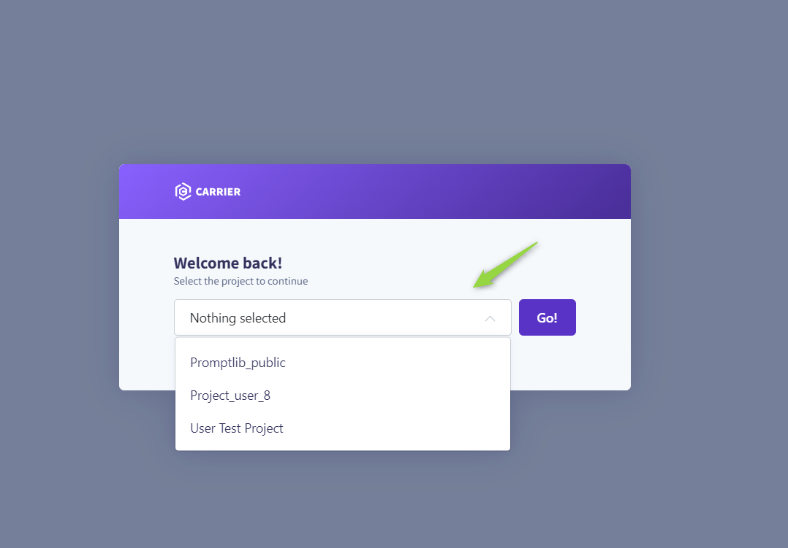
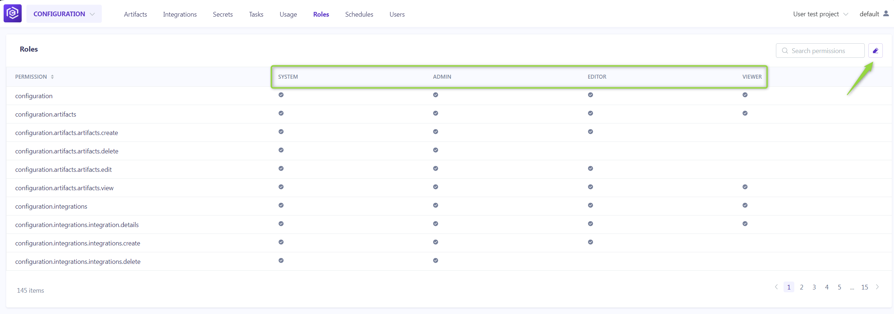

# Roles Management

## How to access Admin menu:

To configure or modify the admin settings for a specific project:

1. Navigate to `https://alita.lab.epam.com/-/configuration/users/`.
2. Select the project from the dropdown list for which you want to set up or adjust the admin settings.

## Roles Menu

The **Roles** menu allows for the detailed configuration of permissions across default and custom roles, tailoring access to the project's needs.

**Default Roles**:

* **System**: Grants comprehensive permissions, including additional administrative capabilities.
* **Admin**: Allows full project access and user management.
* **Editor**: Provides editing rights within the project without administrative privileges.
* **Viewer**: Limits access to viewing permissions, excluding any create, read, update, delete (CRUD) actions.

**Customizing Roles**:

To adjust permissions for any role:

1. Click the **Edit roles** icon.
2. Toggle the checkboxes for each permission as needed.
3. Click the **Save** to apply changes.

**Creating a New Role**:

1. Click **Edit roles**.
2. Then **Add role**. After naming the new role, select the desired permissions. 
3. This custom role will now be available for assignment in the **ELITEA HUB→Settings→Projects** menu.

By understanding and utilizing the **Roles** menu, administrators can ensure that project participants have the appropriate access levels, fostering a secure and efficient collaborative environment.   