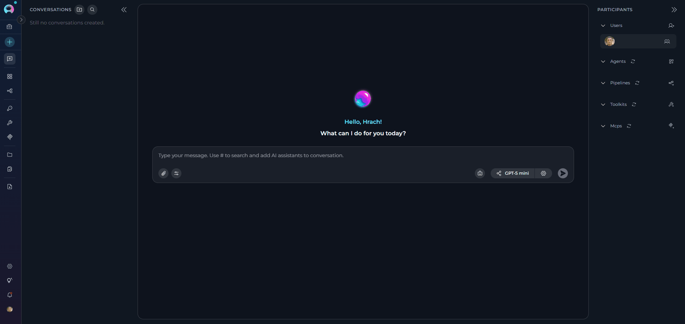
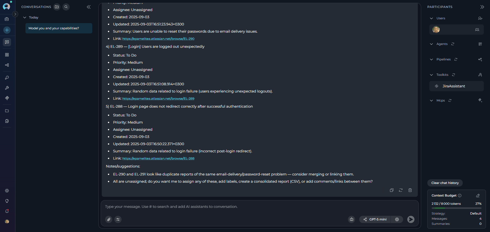
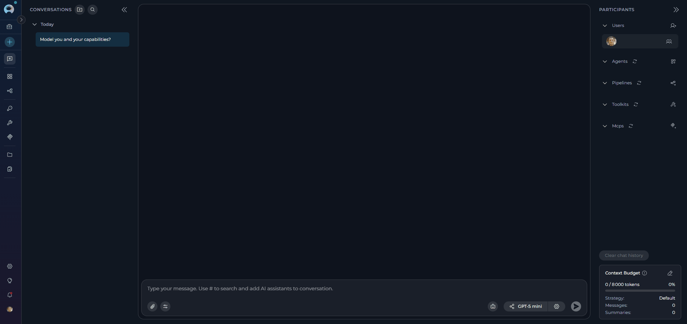
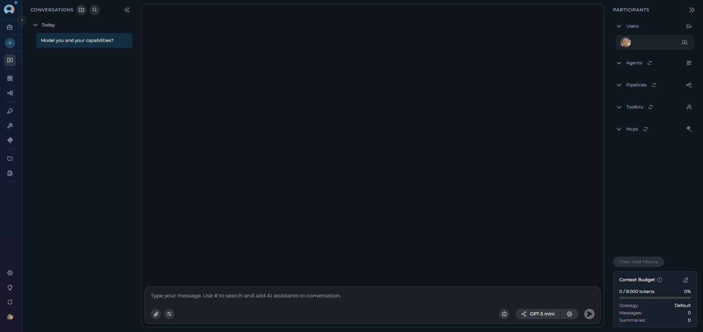

# Quick Start

Get started with ELITEA by sending your first chat message. This hands-on guide will walk you through the essentials of using Chat, the heart of the ELITEA platform.

---

## Step 1: Open Chat

1. **Navigate to ELITEA**: Open your browser and go to your ELITEA instance (e.g., [https://next.elitea.ai/](https://next.elitea.ai/))
2. **Sign In**: Enter your account credentials.
3. **Access Chat**: Click **Chat** in the left sidebar (or you'll be redirected there automatically).

!!! info "Chat Interface Overview"
    You'll see the Chat interface with three main areas:
    
    * **Left sidebar**: Your conversations list
    * **Center area**: Message history and input box
    * **Right sidebar**: Participants panel

---

## Step 2: Send Your First Message

1. **Locate the message input box** at the bottom of the center area.
2. **Select an LLM Model:** Look for the **LLM model selector** at the bottom of the chat interface
3. **Type** `Hello` or `What model are you and what are your capabilities?`
4. **Click the Send button** (paper airplane icon) or press **Enter**.

{: loading=lazy }

!!! success "Success Indicator"
    If you see a response from the AI, you've successfully sent your first message!

---

## Step 3: Connect a Toolkit (Jira)

Connecting tools enhances your chat capabilities by giving the AI access to external services like Jira, GitHub, or Confluence.

!!! warning "Before you begin"
    You'll need:
    
    * Jira account credentials (base URL, username, API token)
    
**How to connect Jira:**

1. **Create a Toolkit from Canvas**:
      * In the **PARTICIPANTS** panel on the right, find **toolkits**
      * Click the **+ Add toolkit** icon
      * Click **+ Create new Toolkit**
      * Select **Jira** as the toolkit type
      * Enter a name (e.g., `JiraAssistant`)

2. **Create a Credential** (when configuring the toolkit):
      * In the **CONFIGURATION** section, click the credentials dropdown
      * Select **+ New credentials** (or **+ New private credentials**)
      * You'll be redirected to the **Create Credentials** page
      * Select **Jira** as the credential type
      * Give it a name like `My Jira Credentials`
      * Fill in your Jira **Base URL**, and **Token**(Auth: Bearer) or **Api Key** and **Username** (Auth: Basic)
      * Click **Save**

3. **Return to Toolkit Creation**:
      * Go back to the toolkit creation canvas
      * Click the **refresh icon** next to the Jira configuration field
      * Your newly created credential will appear in the list
      * Select it from the dropdown

4. **Complete Toolkit Configuration**:
      * Select an **Embedding Model** (e.g., `text-embedding-3-small`)
      * Choose a **Vector Store** (PostgreSQL with pgvector extension)
      * Enable the tools you need (e.g., **Search using JQL**, **Create issue**)
      * Click **Create**
      * Click **X** to close the Toolkit Canvas interface
      * The toolkit will appear in your **PARTICIPANTS** panel

5. **Use it**:
      * Type: `Find all open bugs in project ABC`
      * Click **Send**
      * The toolkit will search Jira and return results

{: loading=lazy }

---

## Step 4: Send an Attachment

Attach files or images to your chat messages for AI-powered analysis.

!!! info "Supported File Types"
    * **Images**: JPEG, JPG, PNG, GIF, and more
    * **Documents & Data**: JSON, TXT, MD, YAML, and more
    * **Maximum**: 10 images per message
    * **Size limits**: Vary by AI model (e.g., 5MB for Anthropic, 20MB for OpenAI)

 **How to Attach Files**

1. **Enable Attachments** (first time only):
      * Click the **paperclip icon** in the message input area
      * The **Attachment settings** popup appears
      * Select an existing **Artifact Toolkit** or create a new one
      * Click **Save**

2. **Attach Files** (three ways):
      * **Click**: Click the paperclip icon → select files
      * **Drag & Drop**: Drag files from your computer into the message input area
      * **Paste**: Copy an image (Ctrl+V or Cmd+V) and paste it

3. **Add Text Prompt** (required):
      * Type a message describing what you want the AI to do
      * Example: `Analyze this diagram and explain the workflow`

4. **Send**:
     * Click the **Send button**
     * The AI will analyze your attachment and respond

{: loading=lazy }

---

## Step 5: Create an Agent from Chat (Optional)

Once you've had a successful chat session, you might want to reuse the same setup. Creating an agent saves your configuration for future use.

**How to create an agent**

1. **Have a conversation** with the desired tools and settings.
2. **Create Agent from Canvas**:
      * In the **PARTICIPANTS** panel on the right, find **Agents**
      * Click **+ Add agent** icon
      * Click **Create new agent**
      * This opens the Agent Canvas interface
3. **Configure Your Agent**:
      * Give your agent a **name** (e.g., `Jira Assistant`)
      * Add a **description** of what it does (e.g., `Helps manage Jira tickets and queries`)
      * Add **instructions** that define its behavior (e.g., `You are a Jira assistant. Help users search for tickets, create issues, and analyze project data. Always use JQL syntax for searches.`)
      * Click **Save** to proceed to advanced configuration
4. **Add Toolkits**
      * In the advanced configuration, select toolkits to attach to your agent
      * Configure LLM model and settings
      * Click **Save**
      * Click **X** to close the Agent Canvas interface
5. **Use Your Agent**: 
      * Select your agent in the **PARTICIPANTS** section (it will be highlighted)
      * Type a message and send (e.g., `Find all high-priority tickets updated this week`)
      
 {: loading=lazy }

!!! info "Benefits of Agent Creation"
    * **Reusability**: Use the same setup across multiple chats
    * **Consistency**: Same instructions and tools every time
    * **Sharing**: Share with teammates in team projects
    * **Efficiency**: Skip setup and start working immediately

---

## Step 6: Use Public Agents (Optional)

Explore pre-built agents created by the ELITEA community to discover new capabilities.

**How to Find and Use Public Agents**

1. In the **PARTICIPANTS** panel on the right, find **agents**
2. Click the **+** icon
3. Browse the list of available agents
4. **Look for the "Public" badge** to identify community-shared agents
5. Select a public agent to add it to your conversation
6. Click the agent in the **PARTICIPANTS** list to activate it
7. Type your message or use conversation starters if available
8. The agent responds based on its specialized instructions and capabilities

{: loading=lazy }

!!! tip "Learning from Public Agents"
    Public agents are a great way to learn how others are using ELITEA. You can:
    
    * View their configurations (read-only) by clicking the ⚙️ settings icon
    * Understand their prompt engineering and structure
    * Create your own versions with customizations
    * Combine concepts from multiple public agents

---

!!! info "Useful Links"
    * **[Chat Guide](../menus/chat.md)**: Explore all chat features in detail
    * **[Create an Agent](../how-tos/chat-conversations/how-to-create-and-edit-agents-from-canvas.md)**: Learn advanced agent creation
    * **[Use Public Items from Chat](../how-tos/chat-conversations/use-public-items-from-chat.md)**: Access and use shared agents, toolkits, and prompts
    * **[Connect Toolkits](connect-toolkits-quick-start.md)**: Connect more external services
    * **[Create Credentials](create-credential.md)**: Manage service credentials
    * **[Create Secrets](create-secret.md)**: Securely store sensitive data

---