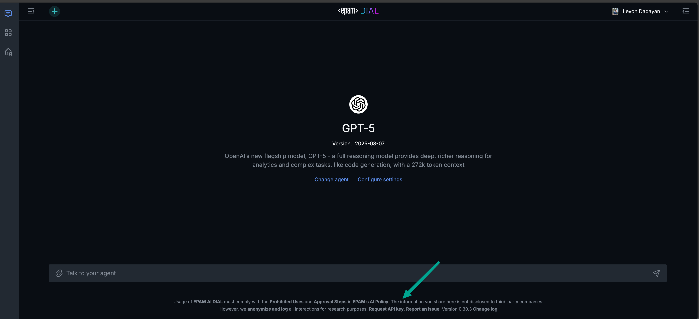
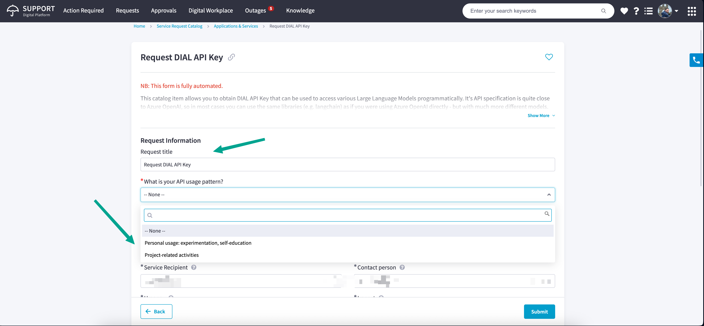
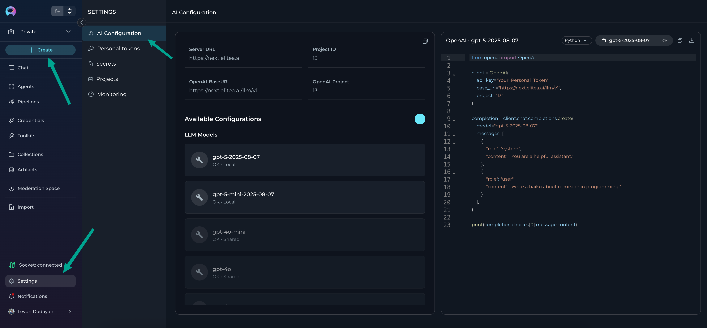
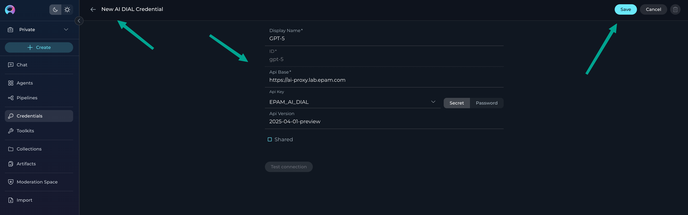
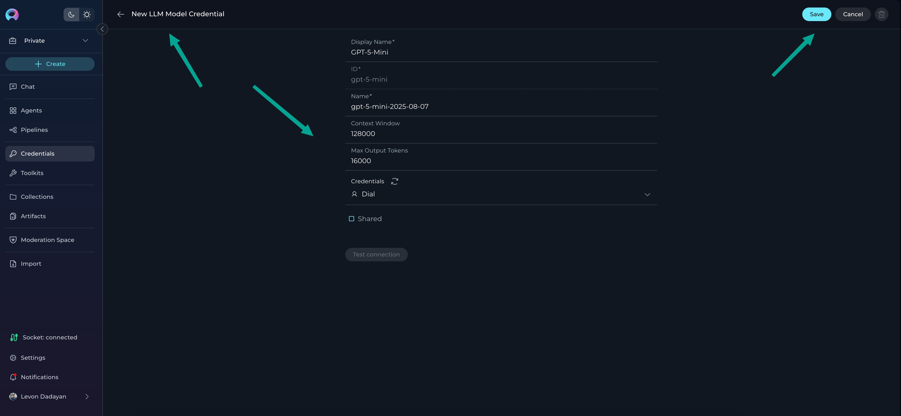
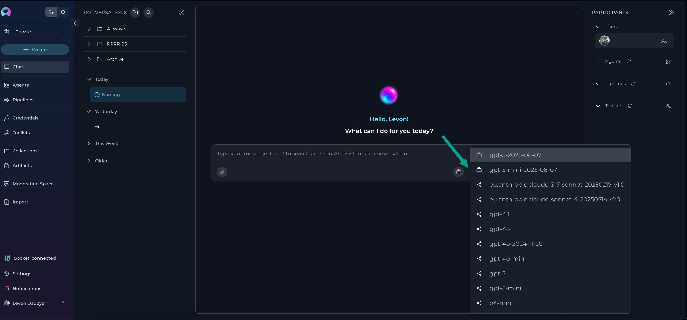

# Configure EPAM AI DIAL Keys (Next Environment)

## Overview
This quick guide shows how to request an EPAM AI DIAL API key and configure it in ELITEA (Next) so you can use dedicated LLM models without hitting shared limits.

!!! warning "Important"
    The LLM models in the Next environment are shared and for evaluation only with daily limits. For any sustained or production use, request your own EPAM AI DIAL keys and configure them under Settings → AI Configuration.

---

## Request an EPAM AI DIAL API Key
1. Open EPAM AI DIAL: [https://chat.lab.epam.com](https://chat.lab.epam.com).
2. Click “Request API key” at the bottom, or go directly: [Request API Key](https://support.epam.com/ess?id=sc_cat_item&table=sc_cat_item&sys_id=910603f1c3789e907509583bb001310c).
3. Fill in the required details to open a support request.
4. Wait for the confirmation email with your API key and usage details.

---

## Configure the DIAL Credential in ELITEA (Next)
1. Log in to the Next environment: https://next.elitea.ai
2. Go to Settings → [AI Configuration](../menus/settings/ai-configuration.md)
3. Click **+ Create**
4. Select credential type: “**AI DIAL**”
5. Fill the fields:
    - **Display name**: a clear name (e.g., “Team DIAL Prod”)
    - **API Base**: `https://ai-proxy.lab.epam.com`
    - **API key**: paste the key from the email
    - **API version**: `2025-04-01-preview` (current supported)
6. Click **Save**.

**Result**: The DIAL credential is created and appears in AI Configuration as available to use.

---

## Create and Configure LLM Models
After creating the DIAL credential, add the LLM models that your key can access.

1. Go to Settings → [AI Configuration](../menus/settings/ai-configuration.md)
2. Click **+ Create** → select “**LLM Model**”
3. Fill the fields:
      - **Display name**: a friendly label (e.g., “Dial Claude Sonnet”)
      - **Name**: the exact model name as listed here: [Available Models and Rate Limits](https://kb.epam.com/display/EPMGPT/Personal+API+Keys%3A+Available+Models+and+Rate+Limits)
      - **Context Window**: the supported context window for that model
      - **Max Output Tokens**: the supported max output tokens
      - **Credentials**: Pick the DIAL credential you created (or create new via “New private credentials”)
4. Click **Save**.

**Result**: The model appears in the model selector across Chat, Agents, and Pipelines.

!!! tip
    The last added model becomes the default in New Conversation model selection.

---

## Notes & Limits
- EPAM AI DIAL enforces its own per-model and per-key limits. Review the limits at the model catalog link above and plan accordingly.
- If a model is not visible, verify the exact name and that your key is entitled to it.
- For troubleshooting or blocked usage, use your dedicated key (avoid shared Next models) and verify from AI Configuration that the credential and model show status OK.

---

## Related
- [AI Configuration](../menus/settings/ai-configuration.md)
- [Create a Credential](./create-credential.md)
- [Quick Start (Next env)](./next-quick-start.md)