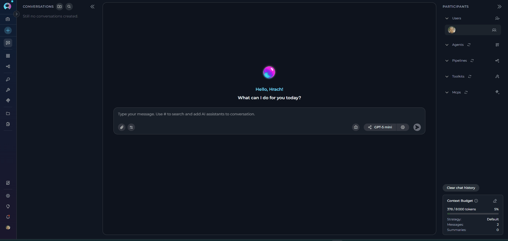
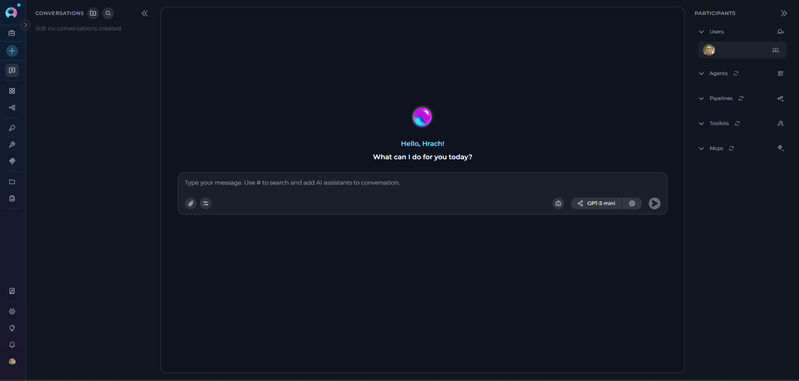
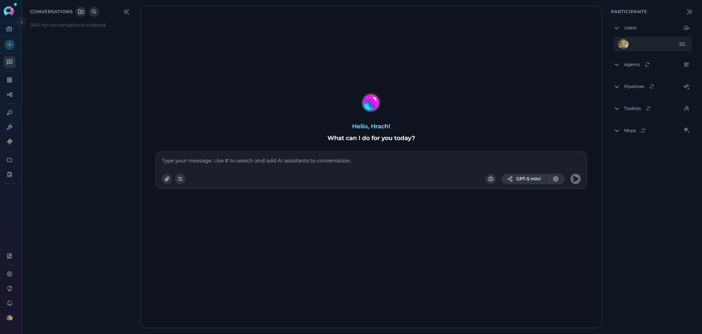
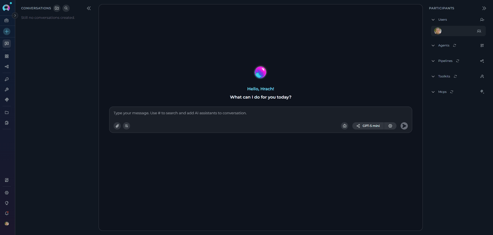

# Quick Start: Connect Toolkits

Learn how to connect external tools and services to ELITEA through toolkits. This guide covers the most commonly used integrations: Jira, Confluence, GitHub, Figma, TestRail, and Artifact storage.

---

## What are Toolkits?

Toolkits connect ELITEA to external services, enabling you to:

* Fetch data from project management tools
* Search documentation
* Analyze code repositories
* Read design files
* Manage test cases
* Store and retrieve files

---

## Before You Begin

!!! warning "Prerequisites"
    Requirements vary by toolkit type. Depending on the service you're connecting to, you may need:
    
    * **Credentials**: Account credentials for the external service
    * **Authentication**: API tokens, access keys, or passwords
    * **Service URLs**: Base URLs for self-hosted or enterprise services
    * **Service-Specific Info**: Repository names, space keys, project IDs, bucket names, etc.
    * **Permissions**: Appropriate access rights in the external service
    
    Refer to each toolkit section below for specific requirements.

---

## Jira Toolkit

Connect to Jira for issue tracking, project management, and agile workflows.

!!! info "What You'll Need"
    * **Jira Base URL** (e.g., `https://yourcompany.atlassian.net`)
    * **Authentication** (choose one):
        * **Basic Auth**: Username + API Key(server)
        * **Bearer Token**: Personal Access Token(cloud)

**How to Connect**

1. **Access Chat**: Click **Chat** in the left sidebar

2. **Create a Toolkit from Chat**:
      * In the **PARTICIPANTS** panel on the right, find **toolkits**
      * Click the **+ Add toolkit** icon
      * Click **+ Create new Toolkit**
      * Select **Jira** as the toolkit type
      * Enter a name (e.g., `MyJiraToolkit`)

3. **Create Credentials**:
      * In the **CONFIGURATION** section, click the credentials dropdown
      * Select **+ New credentials** (or **+ New private credentials**)
      * You'll be redirected to the **Create Credentials** page
      * Select **Jira** as the credential type
      * Give it a name like `My Jira Credentials`
      * Fill in:
          * **Base URL**: Your Jira instance URL
          * **For Basic Auth**: Username + API Key
          * **For Bearer Token**: Token only
      * Click **Save**

4. **Complete Toolkit Configuration**:
      * Return to the toolkit canvas (or refresh if needed)
      * Click the **refresh icon** next to the Jira configuration field
      * Select your newly created credential from the dropdown
      * Select an **Embedding Model** (e.g., `text-embedding-3-small`)
      * Choose a **Vector Store** (PostgreSQL with pgvector extension)
      * Enable the tools you need (e.g., Search using JQL, Create issue)
      * Click **Create**
      * Close the Canvas interface

5. **Use it**:
      * Type: `Find all open bugs in project ABC`
      * The toolkit will search Jira and return results

{: loading=lazy }

!!! tip "Common Tools"
    * **Search using JQL**: Query issues with Jira Query Language
    * **Create issue**: Create new Jira issues
    * **Update issue**: Modify existing issues
    * **Set issue status**: Change issue workflow status
    * **Add comments**: Add comments to issues
    * **Get comments with image descriptions**: Retrieve comments including AI-generated image descriptions
    * **Link issues**: Create relationships between issues
    * **Modify labels**: Add or remove issue labels
    * **Get attachments content**: Download and access file attachments
    * **List projects**: View available Jira projects
    * **Search index**: Perform semantic search using vector embeddings (requires indexing)

---

## Confluence Toolkit

Connect to Confluence for documentation search and knowledge base access.

!!! info "What You'll Need"
    * **Confluence Base URL** (e.g., `https://yourcompany.atlassian.net/wiki`)
    * **Authentication** (choose one):
        * **Basic Auth**: Username + API Key(server)
        * **Bearer Token**: Personal Access Token(cloud)

**How to Connect**

1. **Access Chat**: Click **Chat** in the left sidebar

2. **Create a Toolkit from Chat**:
      * In **PARTICIPANTS** panel, click **+ Add toolkit**
      * Click **+ Create new Toolkit**
      * Select **Confluence**

3. **Create Credentials**:
      * Click credentials dropdown → **+ New credentials**
      * Select **Confluence** as credential type
      * Name it (e.g., `My Confluence Credentials`)
      * Fill in:
          * **Base URL**: Your Confluence instance URL
          * **For Basic Auth**: Username + API Key
          * **For Bearer Token**: Token only
      * Click **Save**

4. **Complete Toolkit Configuration**:
      * Return to toolkit canvas
      * Refresh and select your credential
      * Specify a Confluence space to limit searches-the toolkit will be automatically named with this space name
      * Select an **Embedding Model** (e.g., `text-embedding-3-small`)
      * Choose a **Vector Store** (PostgreSQL with pgvector extension)
      * Enable the tools you need (e.g., Read page by id, Update page by title)
      * Click **Create**

5. **Use it**:
      * Type: `Search Confluence for API documentation`
      * The toolkit will search and return relevant pages

{: loading=lazy }

!!! tip "Common Tools"
    * **Search pages**: Find pages across Confluence
    * **Site search**: Perform full-text search across all content
    * **Read page by id**: Retrieve specific page content
    * **Get page with image descriptions**: Get page content including AI-generated image descriptions
    * **Create pages**: Create new Confluence pages
    * **Update page by id**: Modify existing pages by ID
    * **Update page by title**: Modify existing pages by title
    * **Get page attachments**: Access page attachments
    * **Get pages with label**: Retrieve pages by label
    * **Search by title**: Find pages by title
    * **Search index**: Perform semantic search using vector embeddings (requires indexing)

---

## GitHub Toolkit

Connect to GitHub repositories for code analysis, issue management, and pull request operations.

!!! info "What You'll Need"
    * **Base URL** (default: `https://api.github.com`, or your GitHub Enterprise URL)
    * **Authentication** (choose one):
        * **Access Token**: Personal Access Token (recommended)
        * **Username + Password**: Basic authentication
        * **App Private Key**: GitHub App ID + Private Key
        * **Anonymous**: No authentication (public repositories only)

**How to Connect**

1. **Access Chat**: Click **Chat** in the left sidebar

2. **Create a Toolkit from Chat**:
      * In **PARTICIPANTS** panel, click **+ Add toolkit**
      * Click **+ Create new Toolkit**
      * Select **GitHub**

3. **Create Credentials** (optional for public repos):
      * Click credentials dropdown → **+ New credentials**
      * Select **GitHub** as credential type
      * Name it (e.g., `My GitHub Credentials`)
      * Fill in (choose one method):
          * **Token**: Access Token only
          * **Password**: Username + Password
          * **App Private Key**: App ID + Private Key
      * Click **Save**

4. **Complete Toolkit Configuration**:
      * Return to toolkit canvas
      * Refresh and select your credential (or leave empty for public access)
      * Configure:
          * **Project**: Organization or username
          * **Repository**: Repository name(e.g., `ProjectAlita/projectalita.github.io`)
          * **Branch**: Default branch (e.g., `main`)
      * Select an **Embedding Model** (e.g., `text-embedding-3-small`)
      * Choose a **Vector Store** (PostgreSQL with pgvector extension)
      * Enable the tools you need (e.g., Read file, List pull request diffs)
      * Click **Create**

5. **Use it**:
      * Type: `Get the guide from projectalita.github.io repo for creating secrets in ELITEA`
      * The toolkit will fetch and display the secret creation documentation

      {: loading=lazy }

!!! tip "Common Tools"
    * **Read file**: Read files from repository
    * **List files in bot branch**: Browse repository contents
    * **Create issue**: Create new GitHub issues
    * **Update issue**: Modify existing issues
    * **Comment on issue**: Add comments to issues
    * **Get issue**: Retrieve issue details
    * **List open pull requests**: View open PRs
    * **List pull request diffs**: View changes in PRs
    * **Get commits**: View commit history
    * **Create branch**: Create new branches
    * **Update file**: Modify repository files
    * **Search index**: Perform semantic search using vector embeddings (requires indexing)

---

## Figma Toolkit

Connect to Figma for design file access and collaboration.

!!! info "What You'll Need"
    * **Figma Token**: Personal Access Token from Figma account settings

**How to Connect**

1. **Access Chat**: Click **Chat** in the left sidebar

2. **Create a Toolkit from Chat**:
      * In **PARTICIPANTS** panel, click **+ Add toolkit**
      * Click **+ Create new Toolkit**
      * Select **Figma**
      * Enter a name (e.g., `MyFigmaToolkit`)

3. **Create Credentials**:
      * Click credentials dropdown → **+ New credentials**
      * Select **Figma** as credential type
      * Name it (e.g., `My Figma Credentials`)
      * Fill in:
          * **Token**: Your Figma Personal Access Token
      * Click **Save**

4. **Complete Toolkit Configuration**:
      * Return to toolkit canvas
      * Refresh and select your credential
      * Select an **Embedding Model** (e.g., `text-embedding-3-small`)
      * Choose a **Vector Store** (PostgreSQL with pgvector extension)
      * Enable tools for accessing Figma files(e.g. Get file, Get project files)
      * Click **Create**

5. **Use it**:
      * Type: `Get information from Figma file XYZ`
      * The toolkit will access Figma and retrieve file data

     {: loading=lazy }

!!! info "Getting Your Figma Token"
    1. Go to Figma account settings
    2. Navigate to **Personal Access Tokens**
    3. Click **Generate new token**
    4. Copy the token immediately (it won't be shown again)

!!! tip "Common Tools"
    * **Get file**: Retrieve Figma file information
    * **Get file images**: Extract images from Figma files
    * **Get file nodes**: Access specific nodes within files
    * **Get file comments**: View comments on designs
    * **Post file comment**: Add comments to Figma files
    * **Get file versions**: View version history
    * **Get project files**: List files in a project
    * **Get team projects**: View team projects
    * **Search index**: Perform semantic search using vector embeddings (requires indexing)

---

## TestRail Toolkit

Connect to TestRail for test case management and test execution tracking.

!!! info "What You'll Need"
    * **TestRail URL** (e.g., `https://yourcompany.testrail.io`)
    * **Email**: Your TestRail account email
    * **Password**: Your TestRail password or API key

**How to Connect**

1. **Access Chat**: Click **Chat** in the left sidebar

2. **Create a Toolkit from Chat**:
      * In **PARTICIPANTS** panel, click **+ Add toolkit**
      * Click **+ Create new Toolkit**
      * Select **TestRail**

3. **Create Credentials**:
      * Click credentials dropdown → **+ New credentials**
      * Select **TestRail** as credential type
      * Name it (e.g., `My TestRail Credentials`)
      * Fill in:
          * **URL**: Your TestRail instance URL (e.g., `https://yourcompany.testrail.io`)
          * **Email**: Your account email (e.g., `user@company.com`)
          * **Password**: Your password or API key
      * Click **Save**

4. **Complete Toolkit Configuration**:
      * Return to toolkit canvas
      * Refresh and select your credential
      * Enter a name (e.g., `MyTestRailToolkit`)
      * Select an **Embedding Model** (e.g., `text-embedding-3-small`)
      * Choose a **Vector Store** (PostgreSQL with pgvector extension)
      * Enable the tools you need (e.g., Get cases, Add case)
      * Click **Create**

5. **Use it**:
      * Type: `Show me all test cases related to log-in functionality from project with id 1`
      * The toolkit will fetch and display test case information

     {: loading=lazy }

!!! tip "Common Tools"
    * **Get cases**: Retrieve test case information
    * **Get case**: Get specific test case details
    * **Get cases by filter**: Filter and search test cases
    * **Add case**: Create new test case
    * **Add cases**: Create multiple test cases
    * **Update case**: Modify existing test cases
    * **Get suites**: List test suites
    * **Search index**: Perform semantic search using vector embeddings (requires indexing)

---

## Artifact Toolkit

Create storage buckets for file attachments in chat conversations.

!!! info "What You'll Need"
    * **Bucket Name**: A unique identifier (lowercase letters, numbers, hyphens only)

!!! info "When to Use Artifact Toolkit"
    The Artifact Toolkit is essential for:
    
    * Enabling file attachments in chat
    * Storing uploaded images and documents
    * Managing conversation artifacts
    * File retention and organization

**How to Connect**

**Manual Setup from Toolkit Canvas:**

1. **Access Chat**: Click **Chat** in the left sidebar

2. **Create a Toolkit**:
      * In **PARTICIPANTS** panel, click **+ Add toolkit**
      * Click **+ Create new Toolkit**
      * Select **Artifact**
      * Enter a name that matches your bucket name

3. **Configure Bucket**:
      * **Bucket**: Enter a unique name (lowercase, alphanumeric, hyphens)
          * ✔️ Valid: `my-files`, `project-2024`, `team-assets`
          * ✘ Invalid: `My Files`, `project_2024`, `Team@Assets`
      * Select an **Embedding Model** (e.g., `text-embedding-3-small`)
      * Choose a **Vector Store** (PostgreSQL with pgvector extension)
      * Enable the tools you need (e.g., CreateFile, ListFiles)
      * Click **Create**

4. **Use it**:
      * Files uploaded via chat are stored in this bucket
      * Agents can read, create, and manage files programmatically
      * Example: `List all files in my artifact bucket` or `Read the contents of report.pdf`

      {: loading=lazy }

!!! tip "Common Tools"
    * **CreateFile**: Write new files to bucket
    * **ReadFile**: Read file contents
    * **ListFiles**: Browse bucket contents
    * **DeleteFile**: Remove files
    * **AppendData**: Add data to existing files
    * **OverwriteData**: Replace file contents
    * **CreateNewBucket**: Create additional storage buckets
    * **Search index**: Perform semantic search using vector embeddings (requires indexing)

!!! tip "Quick Setup from Chat"
    The easiest way to create an Artifact Toolkit is directly from chat when attaching files. See **[Send an Attachment](chat-quick-start.md#step-4-send-an-attachment)**.

---

## Troubleshooting

**Authentication Errors (401/403)**

* Verify credentials are correct
* Check API token hasn't expired
* Ensure user has required permissions
* For Atlassian tools, verify correct authentication method

**Connection Issues**

* Verify base URL is correct** (must include `http://` or `https://`)
* Check firewall/proxy settings
* Test connection from browser first
* Ensure service is accessible from your network

**Toolkit Not Appearing**

* Click refresh icon next to credential selector
* Verify toolkit was created successfully
* Check project permissions
* Reload the page

**Tools Return No Results**

* Check the "Limit" field in toolkit configuration
* Verify search parameters are correct
* Ensure you have access to the requested data
* Check service-specific query syntax (e.g., JQL for Jira)

!!! tip "Pro Tips"
    * **Use private credentials** for personal API tokens to keep them secure
    * **Use secrets** to securely store sensitive data like API keys and 
    * **Create separate toolkits** for different projects or contexts
    * **Test connections** using the "Test Connection" button in credentials
    * **Start with read-only tools** before enabling create/update operations
    * **Use descriptive names** for toolkits and credentials to stay organized

---

!!! info "Useful Links"
    * **[Toolkits Menu](../menus/toolkits.md)**: Manage and view all your toolkits
    * **[Credential Configuration Guide](../how-tos/credentials-toolkits/how-to-use-credentials.md)**: Advanced configuration options
    * **[AI Configuration](../menus/settings/ai-configuration.md)**: Configure PgVector, embedding models, and LLM settings
    * **[Chat Menu](../menus/chat.md)**: Explore all chat features in detail
    * **[Create Secrets](create-secret.md)**: Securely store sensitive data

---
