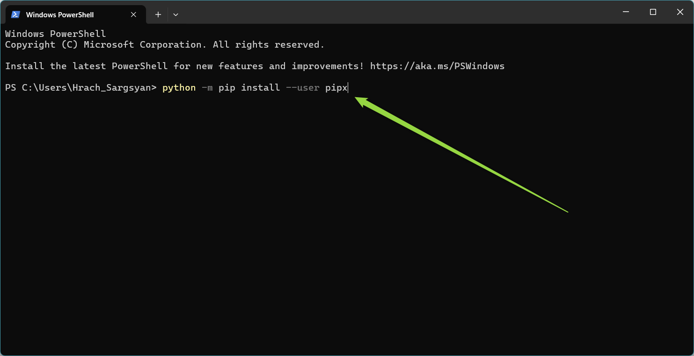
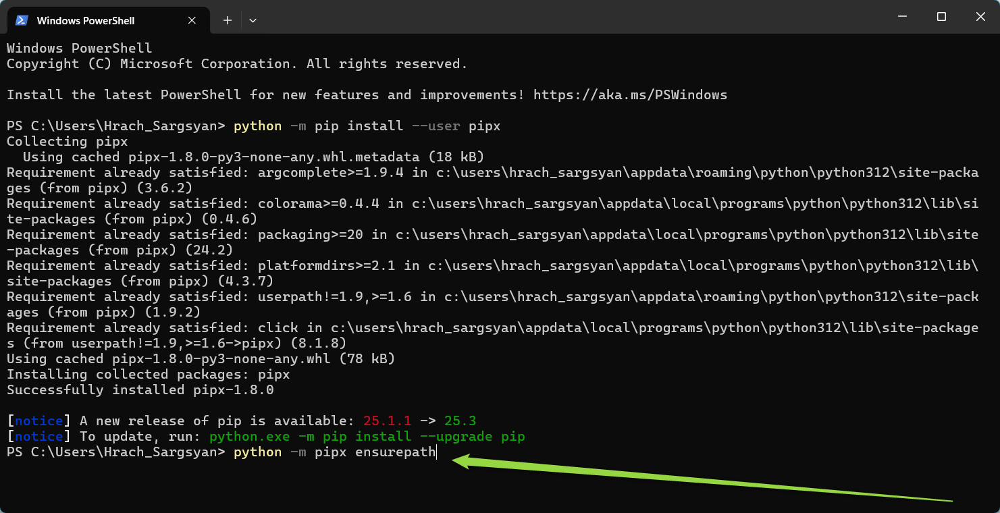
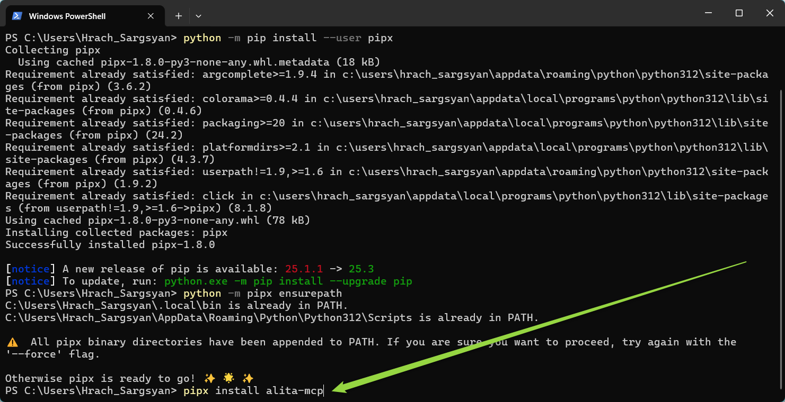
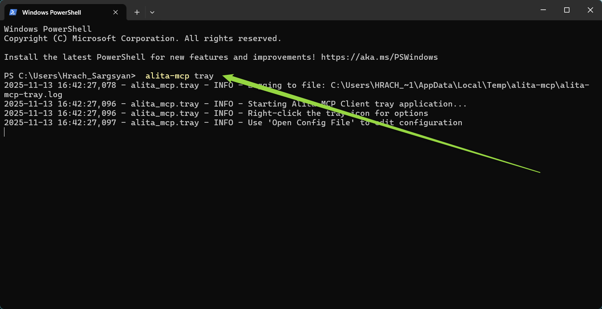
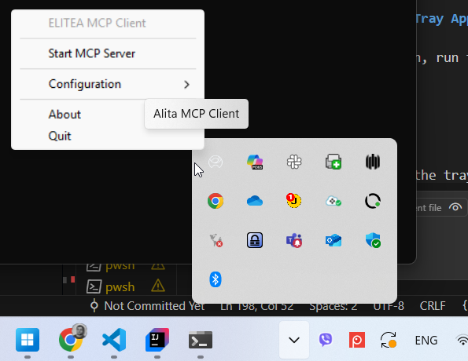
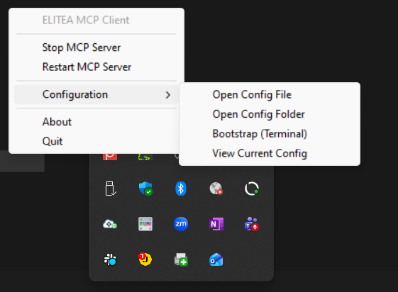
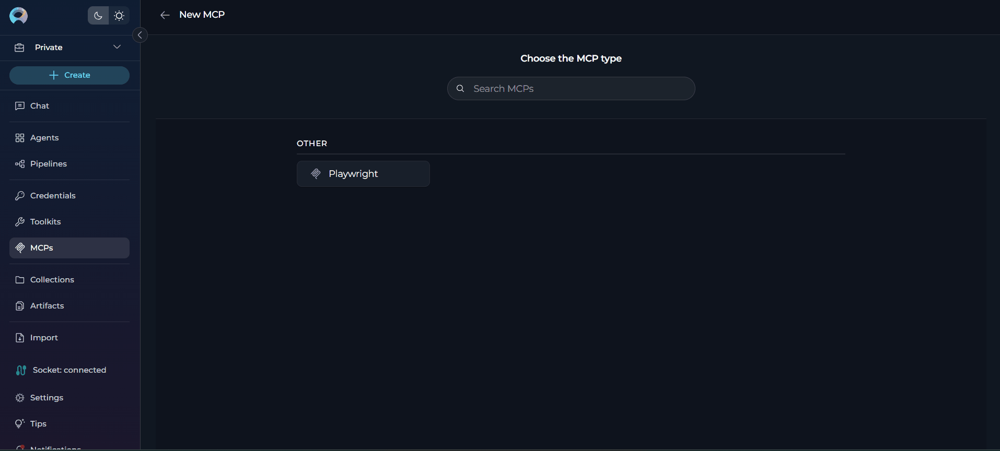
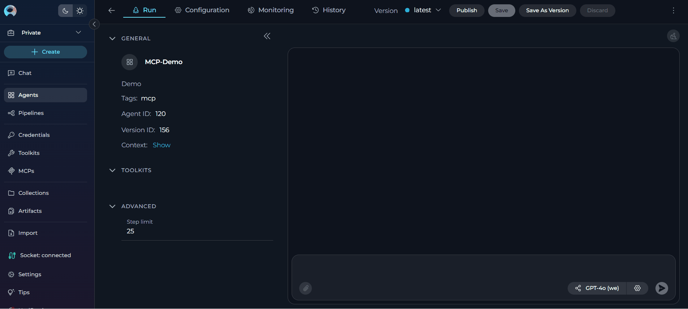

# Quick Start: Connect External Tools to Elitea with MCP

## What You'll Accomplish

By the end of this guide, you'll have connected external tools (like Playwright for browser automation or GitHub for repository management) to your Elitea agents, allowing them to use these powerful tools directly from the Elitea interface.

---

## Before You Start

Before you begin, make sure you have:

- ☑️ **Python installed** on your computer (version 3.10 or newer) - [Download Python](https://www.python.org/downloads/)
- ☑️ **Node.js installed** (required for most MCP servers like Playwright, GitHub, Figma) - [Download Node.js](https://nodejs.org/)
- ☑️ **Your Elitea Project ID** (find this in Elitea Settings → [Configuration](../menus/settings/ai-configuration.md#key-configuration-fields))
- ☑️ **Your Elitea Authentication Token** (create one in Elitea Settings → [Personal Tokens](create-personal-access-token.md))
- ☑️ **Your Elitea deployment URL** (example: `https://next.elitea.ai`)

!!! note "Additional Dependencies"
    Some MCP servers may require additional dependencies beyond Python and Node.js. Check the specific MCP server documentation for any additional requirements before installation.

---

## What is an MCP Client and Why Do I Need It?

**MCP Client** means Elitea can connect to external tools that follow the Model Context Protocol (MCP) standard.

**Why it matters to you:** Your Elitea agents can use powerful external tools like:
- **Playwright** - Automate web browsers, take screenshots, test websites
- **GitHub** - Create issues, manage pull requests, read repositories
- **And many more** - Any tool that supports MCP can be connected

This means your agents become much more powerful without you writing any code!

---

## Step-by-Step Setup

### Part 1: Install the Alita MCP Client

The client is a program that connects Elitea to external MCP tools.

1. **Open PowerShell**
     - Press `Windows key`, type "PowerShell", and press Enter

2. **Install pipx** (a tool that helps install Python programs)
     - Copy this command and paste it into PowerShell, then press Enter:
       ```powershell
       python -m pip install --user pipx
       ```
     - Wait for it to finish

     

3. **Set up pipx's path**
     - This makes sure your computer can find pipx. Copy and run:
       ```powershell
       python -m pipx ensurepath
       ```
     

4. **Install alita-mcp**
     - This is the actual client program. Copy and run:
       ```powershell
       pipx install alita-mcp
       ```
     - Wait for installation to complete

     

5. **Close and reopen PowerShell**
     - This refreshes your environment so the new program is recognized

---

### Part 2: Configure the Client

Now you'll set up the connection to your Elitea account and add external tools.

1. **Run the setup wizard**
     - In PowerShell, type:
       ```bash
       alita-mcp bootstrap
       ```
     - Press Enter

2. **Answer the basic prompts**
     - **Deployment URL:** Type your Elitea URL (example: `https://next.elitea.ai`) and press Enter
     - **Authentication token:** Paste your token (the one you copied earlier) and press Enter
     - **Host:** Just press Enter to accept the default (`0.0.0.0`)
     - **Port:** Just press Enter to accept the default (`8000`)
     - **Project ID:** Enter your Project ID number (find it in Elitea Settings → Configuration)

3. **Add an MCP Server** (example: Playwright)
     - When asked "Do you want to add an MCP server?", type `y` and press Enter
     - **Server Name:** Type a name like `Playwright` and press Enter
     - **Server Type:** Select `stdio` and press Enter
     - **Command:** Type `npx` and press Enter (or `npx.cmd` on Windows if needed)
     - **Args:** Type `@playwright/mcp@latest` and press Enter
     - **Keep Connection Alive:** Type `y` for Yes (recommended for browser automation)

     { loading=lazy }

4. **Add more servers** (optional)
     - You can add GitHub, Figma, or other MCP servers by repeating the process
     - **For GitHub:**
       ```
       Command: npx
       Args: @modelcontextprotocol/server-github
       Keep Connection Alive: y
       ```
     - **For Figma:**
       ```
       Command: npx
       Args: @modelcontextprotocol/server-figma
       Keep Connection Alive: y
       ```

5. **Finish setup**
     - When done adding servers, type `n` when asked to add more
     - You should see a confirmation message

!!! tip "Common MCP Servers"
    **Playwright:**
    ```
    @playwright/mcp@latest
    ```
    
    **GitHub:**
    ```
    @modelcontextprotocol/server-github
    ```
    
    **Figma:**
    ```
    @modelcontextprotocol/server-figma
    ```

---

### Part 3: Start the MCP Client

Now you'll start the client so it runs in the background.

#### Using the System Tray (Recommended - Easiest Way)

1. **Start the tray application**
     - In PowerShell, type:
       ```powershell
       alita-mcp tray
       ```
     - Press Enter
     - You should see the Alita icon appear in your system tray

      

2. **Start the MCP Server from the tray**
     - Look in the bottom-right corner of your screen (system tray)
     - Click the Alita icon
     - Select **Start MCP Server**

      { data-gallery="my-gallery" }

3. **Verify it's running**
     - The tray icon should show the server is active

!!! tip "Quick Access to Config File"
    You can easily open and edit the configuration file from the tray:
    
    1. Click the Alita icon in the system tray
    2. Select **Configuration** → **Open Config File**
    3. The `config.json` file will open in your default text editor
    4. Make any needed changes and save
    5. Restart the MCP server for changes to take effect

    { width="300" align=left}

!!! tip "Run in Background"
    To run the tray app in the background without keeping a PowerShell window open:
    ```powershell
    alita-mcp tray --daemon
    ```


!!! example "Example of correct configuration"
    ```json
    {
      "deployment_url": "https://next.elitea.ai",
      "auth_token": "your-token-here",
      "host": "0.0.0.0",
      "port": 8000,
      "servers": {
        "Playwright": {
          "type": "stdio",
          "command": "npx",
          "args": ["@playwright/mcp@latest"],
          "stateful": true
        }
      },
      "project_id": 456
    }
    ```


---

### Part 4: Connect Tools in Elitea

Now you'll make the external tools available to your Elitea agents.

1. **Log into Elitea**
     - Open your Elitea deployment in a web browser
     - Navigate to your project

2. **Open the MCPs menu**
     - Look for the **MCPs** menu in the left sidebar
     - Click it to open

3. **Create an MCP entry**
     - Click **+ Create**
     - You should see your running MCP servers (like "Playwright")

4. **Configure the MCP**
     - **Name:** Give it a clear name (example: "Playwright Browser Automation")
     - **Description:** Optional - describe what it does
     - **Tools:** Review the list of tools and uncheck any you don't need

5. **Save**
     - Click **Save** to create the MCP entry

      { loading=lazy }


---

### Part 5: Add MCP Tools to Your Agent

Now you'll give your agent access to these new tools.

1. **Navigate to your agent**
     - In Elitea, go to the agent or pipeline you want to enhance
     - Click on it to open

2. **Go to Configuration**
     - Click the **Configuration** tab

3. **Add the MCP toolkit**
     - Scroll down to the **Toolkits** section
     - Click **+MCP**
     - Select your MCP server from the list (example: "Playwright Browser Automation")
     - Click **Add**

4. **Save your agent**
     - Click **Save** to apply the changes

     { loading=lazy }

---

### Part 6: Add MCP to a Conversation and Chat

You can add MCP tools directly to conversations when creating a new chat or in an existing conversation.

#### Adding MCP to a Conversation

1. **Navigate to Chat**
     - Open the sidebar in Elitea
     - Select **Chat**

2. **Start a conversation**
     - Click **+ Create** to start a new conversation, OR
     - Open an existing conversation

3. **Add MCP to the conversation**
     - In the **Participants** section of the chat, look for the **MCPs** element
     - Click to add an MCP
     - Select your MCP from the available options (e.g., "Playwright Browser Automation")
     - The MCP will be added to your conversation with all configured tools enabled

4. **Use MCP in chat**
     - You can now directly interact with the MCP tools
     - Ask questions or request actions that will trigger the MCP tools
     - Example: "Take a screenshot of https://example.com"

!!! tip "Adding Multiple MCPs"
    You can add multiple MCPs to the same conversation! Just repeat the process to add GitHub MCP, Playwright MCP, or any other MCP you've configured.

{ loading=lazy }

!!! example "Real-World Example: Testing a Login Page"
    Here's a practical example of using Playwright MCP to test a login page:

    ```
    You: Navigate to https://practicetestautomation.com/practice-test-login/

    [MCP opens the browser and loads the login page]

    You: Take a screenshot of the login page

    [MCP captures and displays the screenshot]

    You: Fill in the username field with "student" and password field with "Password123"

    [MCP enters the credentials into the form fields]

    You: Click the Submit button

    [MCP clicks the button and waits for the page to load]

    You: Check if we successfully logged in - look for a success message

    [MCP analyzes the page and reports: "Login successful - found confirmation message"]

    You: Take a screenshot of the success page

    [MCP captures the logged-in state]
    ```

    This shows how you can use MCP tools to test web applications, verify functionality, and document the results with screenshots - all through natural conversation!

---

## How to Know It's Working

✔️ **You've succeeded if:**

- The tray icon shows the MCP server is running
- Your MCP appears in the Elitea MCPs menu with tools listed
- The connection status icon shows **grey** (connected)
- When you ask your agent to use a tool, it executes successfully
- No error messages appear


✘ **Something's wrong if:**

- The tray shows "Disconnected" or errors
- The connection status icon shows **orange** (disconnected)
- No tools appear when creating the MCP in Elitea
- Agent says it can't access the tools
- You see error messages in the tray or console


---

## Common Problems & Fixes

### Problem: "Node.js not found" error with Playwright
**Fix:** 

1. Install Node.js from [nodejs.org](https://nodejs.org/)
2. Download the LTS (Long Term Support) version
3. Restart your terminal after installation
4. Verify by running: `node --version`

### Problem: "npx command not found" on Windows
**Fix:**

1. Open your configuration file at `%APPDATA%\alita-mcp-client\config.json`
2. Change `"command": "npx"` to `"command": "npx.cmd"` in the servers section
3. Save the file and restart the MCP client

### Problem: No tools showing up in Elitea
**Fix:**

1. Make sure the MCP client is running (check the tray icon or terminal)
2. Restart the MCP server from the tray menu
3. Refresh the Elitea page in your browser
4. Check that your Project ID is correct

### Problem: "Server configuration empty" error
**Fix:**

1. Open your `config.json` file at `%APPDATA%\alita-mcp-client\config.json`
2. Make sure the `"servers"` section is not empty
3. If it's empty, run `alita-mcp bootstrap` again to add servers


### Problem: Tray icon not visible
**Fix:**

1. Make sure the tray app is actually running (check PowerShell window)
2. Try running `alita-mcp tray` again
3. Check if other applications are hiding the icon in the system tray
4. Click the small arrow (^) in the system tray to show hidden icons

### Problem: "Connection failures in Elitea", "Port already in use" , "Address already in use"  errors
**Fix:**

1. Another application is using port 8000 (the default MCP port)
2. **Option 1 - Change the port:**
     - Open your `config.json` file at `%APPDATA%\alita-mcp-client\config.json`
     - Change `"port": 8000` to a different port like `"port": 8001`
     - Save the file and restart the MCP client
3. **Option 2 - Find and stop the conflicting application:**
     - Open PowerShell as Administrator
     - Run: `netstat -ano | findstr :8000`
     - Note the PID (Process ID) in the last column
     - Run: `tasklist | findstr <PID>` (replace `<PID>` with the number)
     - Stop that application if it's not needed
4. Restart the MCP client after making changes

### Problem: Tools work but give errors
**Fix:**

1. Check the tool's specific requirements (authentication, permissions, etc.)
2. For GitHub: Make sure you have proper access tokens configured
3. For Playwright: Ensure you have sufficient system resources for browser automation
4. Click the tray icon and select **View Logs** to see detailed error messages


---

## What You Can Do Next

Now that your MCP client is running, you can:

- **Automate browser testing** with Playwright tools
- **Manage GitHub repositories** directly from Elitea agents
- **Connect more MCP servers** to add even more capabilities
- **Create complex workflows** that combine multiple external tools
- **Share configurations** with your team by exporting your `config.json`

---


!!! info "Helpful Resources"
    - [Full MCP Client Documentation](../integrations/mcp/mcp-client.md)
    - [Elitea Settings & Configuration](../menus/settings/ai-configuration.md)
    - [MCP Protocol Official Docs](https://modelcontextprotocol.io/)
    - [Playwright MCP Server](https://github.com/microsoft/playwright-mcp)
    - [GitHub MCP Server](https://github.com/github/github-mcp-server)
    - [How to Create and Edit MCPs from Canvas](../how-tos/chat-conversations/how-to-create-and-edit-mcps-from-canvas.md)

---
