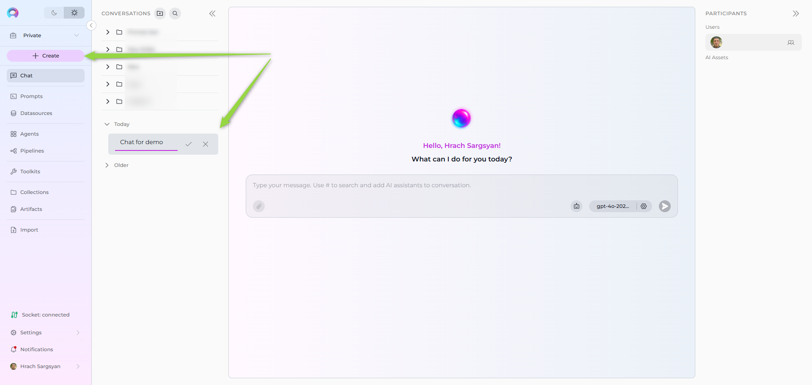
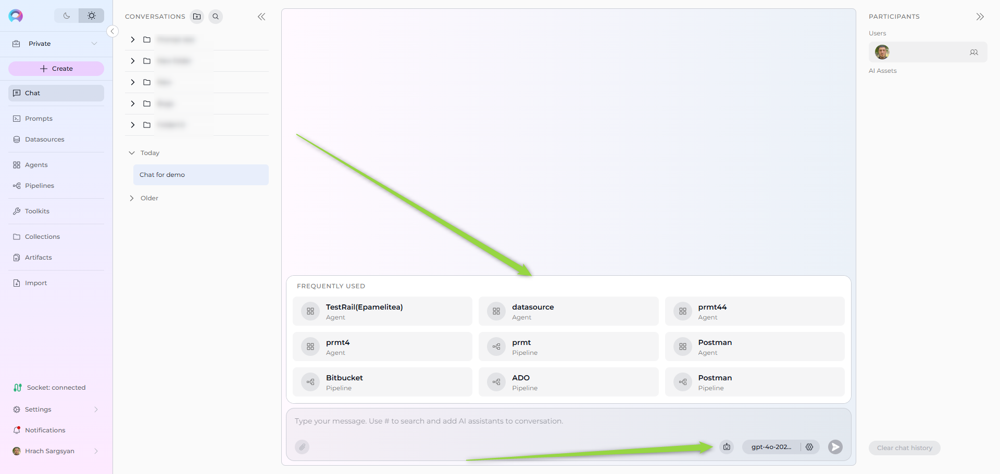
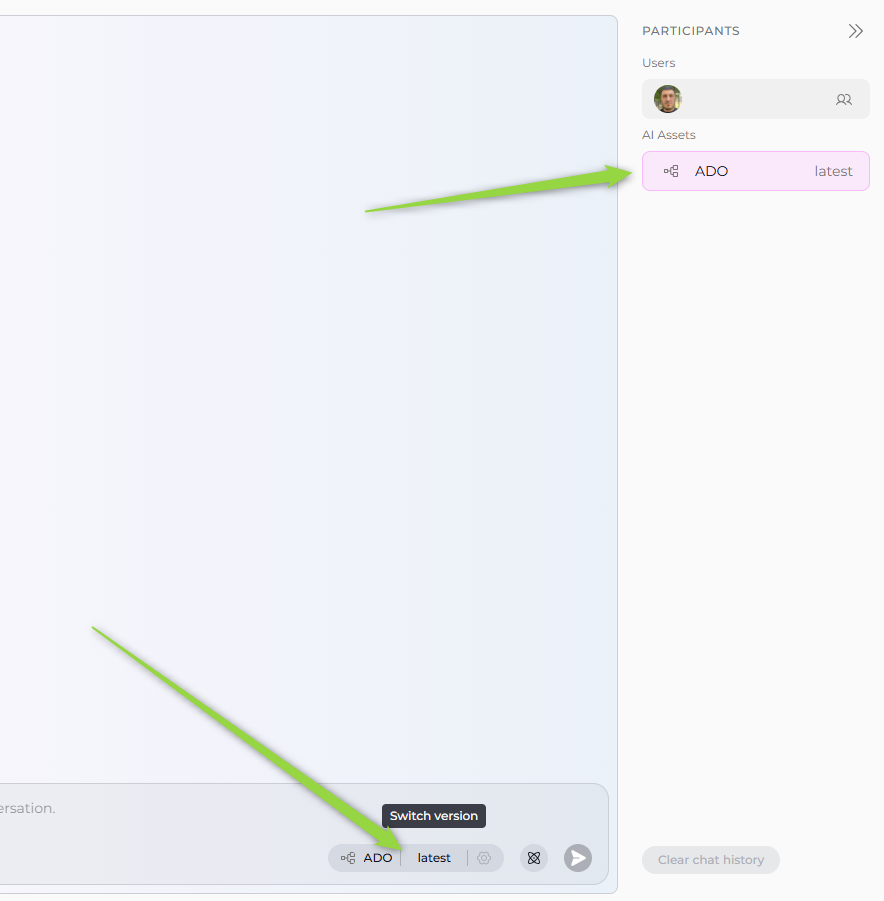
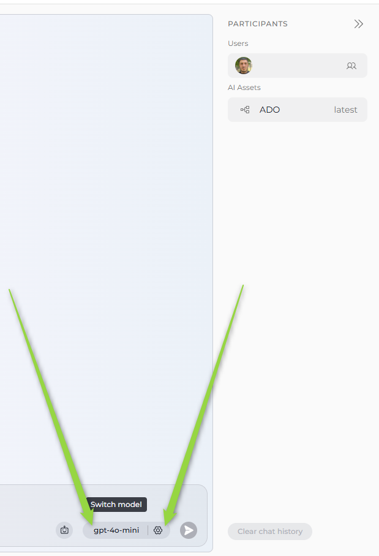

# Creating a Conversation and Adding AI Assistants (Agents, Pipelines and Toolkits) into Conversation

---

## Step 1: Start a New Conversation

1. Go to the **Chat** section in the left sidebar.
2. Click the **+ Create** button at the top.
3. Enter a name for your conversation (defaults to "New Conversation") and confirm.

Your new conversation will appear in the conversation list on the left.

## Step 2: Organize Conversations with Folders

1. To create a folder, click the **Create folder** icon above the conversation list.
2. Enter a name for the folder and confirm.
3. Drag and drop a conversation into the folder to organize it.

---

## Step 3: Selecting and Switching Assistants (Agents, LLM Models, etc.)

1. At the bottom of the chat, you can see the switch to assistant icon.
2. To **switch assistants** (e.g., select an Agent):
      * Click the **Switch assistant** icon.
      * In the opened "Frequently Used" list, click on the desired assistant (e.g., Agent) to select it.
      * Alternatively, type **#** followed by the assistant name (e.g., `#ADO`) in the input box to quickly select an assistant.

      

3. The Agent will be visible under "AI Assets" in the **PARTICIPANTS** area.
4. Select a version of the agent at the bottom of the chat

      

5. To **switch to an LLM model**, click the **Switch to model** button.
6. Select a desired LLM model (e.g., gpt-4o)
7. To configure the model settings, click the **Settings** (gear) icon next to the assistant name.
8. Configure the Model settings in the opened modal window.

      

---

## Step 4: Interact with Assistants and Models

1. Make sure the desired Agent or model is selected at the bottom of the chat.
2. Type your question or command in the input box or run the conversation starter. (e.g., "compare", "run", or any task).
3. Click the **Send** button (paper plane icon) to submit.
4. Agent or model responses will appear in the chat thread, clearly labeled by which participant replied.

---

## Useful Features

* **Folders**: Organize conversations by creating folders and dragging conversations into them.
* **Like/Dislike/Comment**: React to responses using thumbs up/down or leave comments.
* **Regenerate**: Use the regenerate icon next to a message to refine outputs.
* **Clear Chat History**: Use the button at the bottom right to clear the chat if needed.

---

## Tips

* All participants appear in the right sidebar for easy switching.
* Replies from different participants are clearly labeled in the chat history.

---

## More Resources

* [ELITEA Chat Documentation](../menus/chat.md)
* [How to Use Chat Functionality](../how-tos/how-to-use-chat-functionality.md)

---