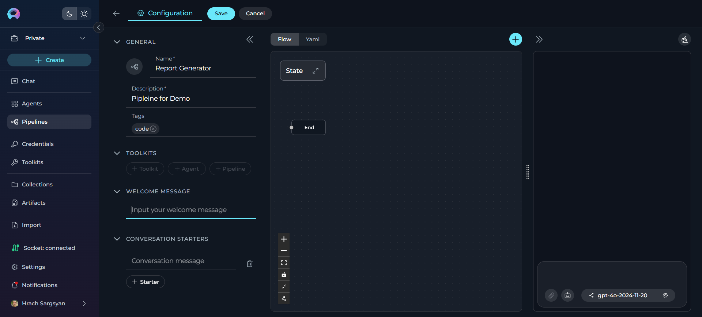

# Create Your First Pipeline

## Introduction

ELITEA Pipelines are powerful workflow automation tools that visually design and execute sequences of states and actions. Each pipeline is designed to handle specific tasks or sequences of tasks by connecting various nodes such as conditions, decisions, loops, and tool integrations. This guide will walk you through creating your first pipeline from start to execution.

---

## Step 1: Navigate to the Pipelines Menu

1. **Open the Sidebar:**
      * From the main platform navigation, locate and click **Pipelines** in the sidebar.

2. **Access the Pipelines Dashboard:**
      * You'll see a list of all existing pipelines for your project (if any).
      * If this is your first time, the list will be empty.

---

## Step 2: Create a New Pipeline

1. **Start Pipeline Creation:**
      * Click the **`+ Create`** button located at the top of the main sidebar.

2. **Configure General Information:**
      * **Name**: Enter a unique, descriptive name for your pipeline (e.g., "Data Processing Workflow", "Report Generation Pipeline").
      * **Description**: Provide a clear description of what your pipeline will do.
      * **Tags** (optional): Add relevant tags by typing tag names or selecting from existing ones.

3. **Save Initial Pipeline:**
      * Click **Save** to create your initial pipeline.
      * This creates the "latest" version of your pipeline.

4. **Configure Optional Features:**
      * **Welcome Message** (optional): Add a message that users see when they first interact with your pipeline.
      * **Conversation Starters** (optional): Create predefined prompts to help users get started quickly.

5. **Save Your Configuration:**
      * Click **Save** again to preserve your additional configurations.

---

## Step 3: Add Toolkits, Agents, or Pipelines

After saving your initial pipeline, the **TOOLKITS** section becomes available with three integration options to enhance your pipeline's functionality.

### **Add a Toolkit**

1. **Access Toolkits Section:**
      * In your pipeline configuration, scroll to the **TOOLKITS** section.

2. **Add a Toolkit:**
      * Click the **`+ Toolkit`** button.
      * **Select Existing Toolkits**: Browse and choose from available toolkits in the platform's toolkit library, or
      * **Create New Toolkit**: Click the **`+ Create new`** button to build a custom toolkit for your specific requirements.

!!! info "Reference"
    For detailed information on creating and managing toolkits, refer to the **[Toolkits Menu Guide](../menus/toolkits.md)**.

### **Add an Agent**

1. **Click the `+ Agent` Button:**
      * This allows you to incorporate existing agents into your pipeline workflow.

### **Add a Pipeline**

1. **Click the `+ Pipeline` Button:**
      * This allows you to nest other pipelines within your current pipeline.

---

## Step 4: Design Your Pipeline Workflow

### **Using the Flow Designer**

1. **Access Flow Designer:**
      * Navigate to the **Configuration** tab.
      * Select the **Flow** tab to visually design your pipeline.

2. **Add Nodes:**
      * Click the **+** icon to add new nodes.
      * Choose from available node types: **Agent**, **Condition**, **Decision**, **Function**, **LLM**, **Loop**, **Loop from Tool**, **Pipeline**, **Router**, **State Modifier**, **Tool**, and **Custom**.

3. **Connect Nodes:**
      * Drag and drop connections between nodes to establish workflow logic.
      * Use the **End** node to define pipeline completion.

4. **Customize View:**
      * Zoom in or out for better navigation.
      * Adjust the view for managing complex workflows.

### **Using the YAML Editor** (Optional)

1. **Switch to YAML:**
      * Click the **YAML** tab for advanced code-based configuration.

2. **Define Workflow:**
      * Write complex workflows, conditions, and logic using YAML syntax.
      * Fine-tune node configurations and set advanced parameters.

3. **Validate Syntax:**
      * Ensure your YAML syntax is correct before saving.

---

## Step 5: Test and Execute Your Pipeline

1. **Navigate to Run Tab:**
      * Click on the **Run** tab to access the execution environment.

2. **Select AI Model:**
      * Choose an appropriate AI model from the dropdown (e.g., gpt-4o-2024-11-20).

3. **Adjust Parameters** (optional):
      * **Temperature**: Control creativity level (0.1 for consistent, 1.0 for creative).
      * **Top P**: Adjust word selection diversity.
      * **Max Completion Tokens**: Set response length limit.

4. **Start Execution:**
      * Use a **Conversation Starter** (if configured), or
      * Type your question or command directly.
      * Use simple commands like "Go", "Start Generating", "Execute", or "Run it".
      * Click **Send** to execute your pipeline.

**Monitor Execution:**

  * View the pipeline execution flow and results in real-time.
  * Track execution progress and analyze outputs.

**Post-Execution Actions:**

   * **Copy Output**: Click the copy icon to save results.
   * **Regenerate**: Click regenerate if output isn't satisfactory.
   * **Continue Dialogue**: Type follow-up questions or commands.

**Version Management:**

   * **Save**: Update the current "latest" version or the current named version
   * **Save As Version**: Create a new named version
   * **Publish**: Submit for approval to make publicly available

---

## Step 6: Add Your Pipeline to Conversations

The primary way to use your pipeline is by adding it to conversations for collaborative work.

1. **Navigate to Chat Menu:**
      * Go to the **Chat** section from the main sidebar.

2. **Start a New Conversation:**
      * Click **`+ Create`** to start a new conversation.
      * Or select an existing conversation where you want to add your pipeline.

3. **Add Your Pipeline:**
      * At the bottom of the chat, you can see the switch to assistant icon.
      * To switch assistants (e.g., select a Pipeline):
         - Click the Switch assistant icon.
         - In the "Frequently Used" list, click your pipeline name (e.g., Data Processing Workflow) to select it.
         - Alternatively, type # followed by your pipeline name (e.g., #Data Processing Workflow) in the input box to quickly select an assistant
      * **Alternative Method**: Click the **+** button on the **PARTICIPANTS** panel next to the **Pipeline** section to add your pipeline directly to the conversation.

4. **Interact with Your Pipeline:**
      * Type your question or request and send it.
      * Your pipeline will respond based on its workflow design and available toolkits.

!!! tip "Conversation Benefits"
      Using pipelines in conversations allows for collaborative workflows where human team members and AI pipelines work together, maintaining context and continuity throughout the discussion.

!!! note "Reference"
      For detailed instructions on creating a conversation, refer to the [Create first Conversation](create-conversation.md) guide.

---

## Next Steps

Now that you've created your first pipeline, consider:

* **Adding more toolkits** to expand integration capabilities
* **Creating complex workflows** with multiple node types
* **Building nested pipelines** for modular workflow design
* **Setting up monitoring** for performance optimization
* **Publishing versions** for team collaboration

!!! tip "Best Practices"
    * Plan your workflow before adding nodes for clear structure
    * Use descriptive names for nodes and pipelines
    * Test iteratively during development
    * Validate data flow between nodes with sample data

---

!!! info "Related Documentation"
    For more detailed information, refer to:

    * **[Pipelines Menu Guide](../menus/pipelines.md)** - Comprehensive pipeline documentation
    * **[Chat Menu Guide](../menus/chat.md)** - Learn about conversations and collaboration
    * **[Create a Toolkit](create-toolkit.md)** - Learn to integrate external services
    * **[Create Credentials](create-credential.md)** - Set up secure authentication
    * **[Pipeline Agent Framework](../features/pipelines/pipeline-agent-framework.md)** - Advanced pipeline development
    * **[Glossary](../home/glossary.md)** - Definitions of key terms and concepts
