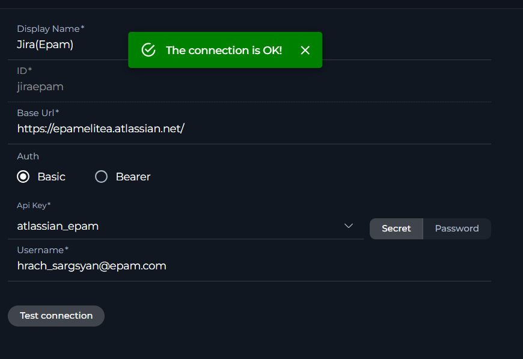
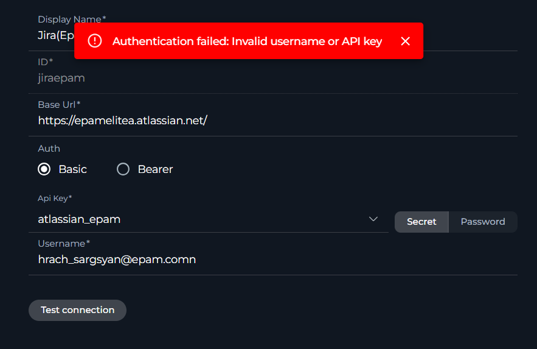
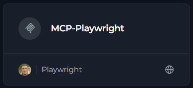
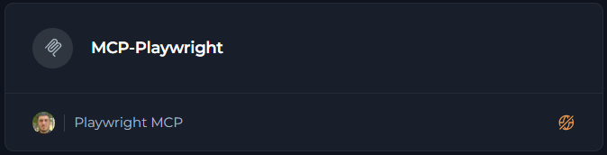

# System Health & Troubleshooting Guide

A comprehensive guide to verify your ELITEA system health and quickly resolve common issues.

---

## Quick Health Checklist

Use this checklist for rapid system verification:

**✔️ Socket Connection**

Socket indicator shows green dot (on Elitea logo, top-left corner)

The socket connection indicator shows the real-time connection status between your browser and the ELITEA server:

- **Green dot** = Connected and ready { align=center width=45}
- **Red dot** = Disconnected - check your network connection { align=center width=45}

**✔️ Permissions**

Can create entities available by permission scope

Verify that you can create agents, toolkits, credentials, and other entities based on your assigned permissions. If you cannot create certain items, contact your administrator to review your permission scope.

**✔️ Credentials**

Test connection shows "successful" status

After creating credentials for external services (Jira, Confluence, GitHub, etc.), use the "Test Connection" button to verify they work correctly. A successful test confirms your API tokens and authentication settings are valid.

{ align=center width=300} { align=center width=317}

**✔️ MCP Integration**

MCP status shows connected (if using MCP features)

If you're using Model Context Protocol (MCP) features, verify the MCP status indicator shows as connected. This ensures proper communication with MCP servers for enhanced functionality. If not connected, you need to run your MCP server first. See [how to create and use MCP client](../integrations/mcp/create-and-use-client-stdio.md) for setup instructions.

- **Connected and ready** 

{width=300}

- **Disconnected - MCP server not running** 

{width=300}

**✔️ Indexes Tab Availability**

Indexes tab is visible in Toolkit Configuration (for supported toolkits)

- **Indexes tab** is automatically disabled if required prerequisites are not met. To access this tab in your toolkit configuration, ensure:
     - **PgVector Configuration**: Vector storage must be configured at project level (Settings → AI Configuration)
     - **Embedding Model**: An embedding model must be selected and configured (Settings → AI Configuration)
     - **Index Data Tool**: The "Index Data" tool must be enabled in your toolkit configuration
- **Delete button** (in Indexes tab) is disabled if **Remove Index** tool is not selected in toolkit configuration
- **Run tab** (in Indexes tab) is disabled if at least one search index tool (**Search Index**, **Stepback Search Index**, or **Stepback Summary Index**) is not selected in toolkit configuration

For detailed setup instructions, see [How to create and use indexes](../how-tos/indexing/using-indexes-tab-interface.md).

---

## **Common Issues: Quick Fixes**

### Agent & LLM Problems

??? example "**Agent stops or provides incomplete responses**"
    **Symptoms:**
    
    - Agent starts working but stops mid-response
    - Answer appears truncated or incomplete
    - Complete answer visible in "thinking step" but not final response
    
    
    
    
    
    **Root Cause:** Max completion token limit reached
    
    **Solution:**
    
    1. Open agent configuration (⚙️ settings icon)
    2. Locate "Max completion tokens" field
    3. Increase value (e.g., from 2000 to 4000 or higher)
    4. For nested agents: Check each agent's token limits
    5. Save and retry
    
    
    
    **Related:** [Troubleshooting Guide §1](../support/troubleshooting.md#1-agent-stops-without-answer-or-provides-truncated-response)

??? example "**Content policy violation (400 error)**"
    **Symptoms:**
    
    - "This conversation violates our policy"
    - "Message filtered due to prohibited content"
    - "Rejected as a result of our safety system"
    
    
    
    **Root Cause:** Message triggered LLM safety mechanisms
    
    **Solution:**
    
    1. Review your prompt for sensitive topics
    2. Rephrase instructions that might look like prompt injection (e.g., "Ignore user input")
    3. Clearly state the purpose of security-related instructions
    4. Avoid prohibited content per your provider's policy
    
    **Related:** [Troubleshooting Guide §8](../support/troubleshooting.md#8-content-policy-violations)

??? example "**Rate limit exceeded (429 error)**"
    **Symptoms:**
    
    - "Hit token rate limit. Minute limit: X / Y tokens"
    - Error appears during heavy usage or repeated requests
    
    
    
    
    
    **Root Cause:** Too many requests to LLM or embedding models
    
    **Solution:**
    
    1. **Wait 1-5 minutes** and retry
    2. Switch to a different LLM model if available
    3. Reduce request frequency or batch operations
    4. For shared environments: Coordinate with team to spread usage
    
    **Related:** [Troubleshooting Guide §9](../support/troubleshooting.md#9-rate-limit-exceeded-429-error-code)

??? example "**Context length exceeded (400 error)**"
    **Symptoms:**
    
    - "This model's maximum context length is X tokens. However, your messages resulted in Y tokens"
    - Error when processing large files or long conversations
    
    
    
    **Root Cause:** Input exceeds model's context window limit
    
    **Common Limits:**
    
    - GPT-4o: 128,000 tokens
    - Claude Sonnet: 200,000 tokens
    - GPT-5: 400,000 tokens
    
    **Solution:**
    
    1. **Reduce input size:** Break large files into smaller chunks
    2. **Use summarization:** Summarize content before passing to LLM
    3. **Use indexing:** Instead of passing full documents, use toolkit indexing and semantic search
    4. **Clear chat history:** Start a new conversation to reduce context
    
    **Related:** [Troubleshooting Guide §10](../support/troubleshooting.md#10-context-length-exceeded)

---

### Toolkit & Integration Problems

??? example "**Indexing fails with permission errors**"
    **Symptoms:**
    
    - "The calling user does not have permission to view the content"
    - Indexing stops or fails partway through
    - Some items indexed, others skipped
    
    
    
    
    
    **Root Cause:** User token lacks access to some items
    
    **Solution:**
    
    1. **Use filters to exclude restricted items:**
       - **Jira:** Add JQL filter in toolkit configuration
       - **Confluence:** Add CQL filter in toolkit configuration
    2. **Verify token permissions:** Ensure API token has read access
    3. **Retry indexing:** Some failures due to items deleted during indexing
    
    **Related:** [Troubleshooting Guide §11](../support/troubleshooting.md#11-indexing-access-issues)

??? example "**Atlassian API redirect errors (Too many redirects)**"
    **Symptoms:**
    
    - "Exceeded 30 redirects"
    - Some toolkit tools work, others don't (e.g., can't fetch images)
    - Connection repeatedly fails
    
    
    
    **Root Cause:** Incorrect API version setting
    
    **Solution:**
    
    1. Open toolkit configuration
    2. Locate **API Version** field
    3. Set correct version:
       - **Atlassian Cloud:** API version **3**
       - **EPAM Jira/Server:** API version **2**
    4. Save and test connection
    
    
    
    **Note:** Partial functionality doesn't guarantee correct configuration!
    
    **Related:** [Troubleshooting Guide §12](../support/troubleshooting.md#12-atlassian-api-connection-issues)

??? example "**Authentication errors (401/403 Unauthorized)**"
    **Symptoms:**
    
    - "Unauthorized (401)" error
    - "Permission denied" or "Access forbidden"
    - Toolkit connection fails
    
    
    
    **Root Cause:** Incorrect authentication configuration or invalid tokens
    
    **Solution:**
    
    **For Atlassian (Jira/Confluence):**
    
    - **Cloud:** Use **Basic Auth** with API key + username
    - **Server/EPAM:** Use **Bearer Token** with API key only
    
    
    
    **For All Toolkits:**
    
    1. Verify credentials in Credentials menu
    2. Click "Test Connection" button
    3. Check for extra spaces in API keys/tokens (common issue!)
    4. Ensure token hasn't expired
    5. Verify user has necessary permissions
    
    **Related:** [Troubleshooting Guide §13](../support/troubleshooting.md#13-atlassian-authentication-token-issues)

??? example "**Toolkit configuration validation errors**"
    **Symptoms:**
    
    - Toolkit returns small number of results
    - You know more items exist but they're not shown
    - Lists appear incomplete
    
    **Root Cause:** Toolkit "Limit" field set too low
    
    **Solution:**
    
    1. Go to **Toolkits** menu
    2. Edit the affected toolkit
    3. Find **"Limit"** field (may be in Advanced Settings)
    4. Increase value (e.g., from 10 to 100, or 50 to 500)
    5. Save configuration
    6. Retry your query
    
    
    
    **Related:** [Troubleshooting Guide §14](../support/troubleshooting.md#14-toolkit-resource-limit-issues)

---

### Pipeline Configuration Problems

??? example "**Entry point not defined error**"
    **Symptoms:**
    
    - "Entry point is not defined in the schema"
    - Pipeline fails immediately on start
    - Error appears before any execution
    
    
    
    **Root Cause:** No starting node designated in pipeline
    
    **Solution:**
    
    1. Open your pipeline
    2. Identify the first node that should execute
    3. Click **three dots (⋮)** on that node
    4. Select **"Entry Point"** option
    5. Save and retry
    
    
    
    **Related:** [Troubleshooting Guide §2](../support/troubleshooting.md#2-entry-point-not-defined)

??? example "**Pipeline input processing issues**"
    **Symptoms:**
    
    - Node ignores provided input
    - Responses are general instead of specific to your data
    - Variables seem to not work
    
    
    
    
    
    **Root Cause:** Variables not referenced in task field
    
    **Solution:**
    
    1. Open node configuration
    2. In the **Task** field, add variable references:
       - Using **f-string**: `Analyze this data: {input_data}`
       - Using **variable syntax**: Select variable from dropdown
    3. Verify variable names match exactly (check for typos!)
    4. Variables in "Input" section must be referenced in task to be used
    5. Save and retry
    
    
    
    **Related:** [Troubleshooting Guide §6](../support/troubleshooting.md#6-nodes-not-receiving-input-data)

---

!!! tip "Best Practices"
    - Keep API tokens and credentials up to date
    - Monitor token usage and rate limits
    - Use descriptive names for agents, toolkits, and credentials    
    - Check the **end of error messages** for actual error details
    - Look for **node names** in pipeline errors to identify problem areas
    - Use **Test Connection** button before assuming toolkit issues
    - Check for **typos** in variable names and configuration fields
    - Review **recent changes** to identify what might have broken
 
!!! info "Additional Resources"
    * **[Full Troubleshooting Guide](../support/troubleshooting.md)**: Detailed error messages with screenshots
    * **[FAQs](../support/faqs.md)**: Frequently asked questions
    * **[Contact Support](../support/contact-support.md)**: Get additional help

---

