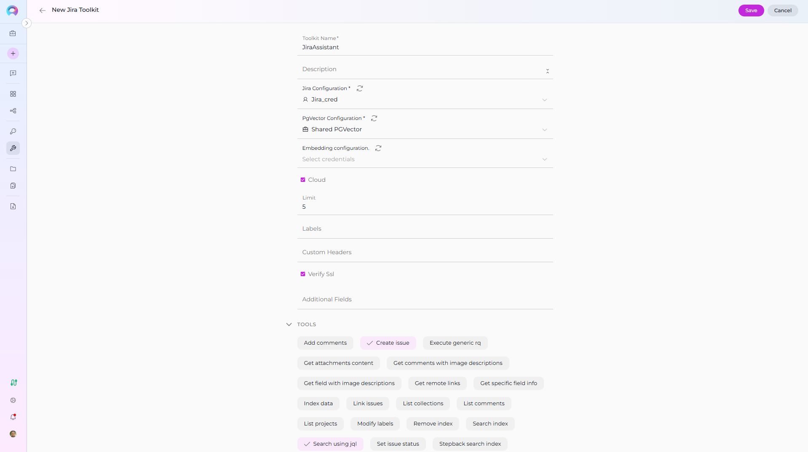
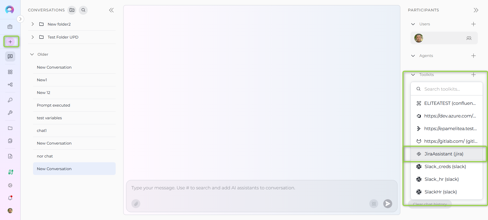

# Very Quick Start with ELITEA

Get up and running in just a few minutes. Follow these minimal steps, then dive deeper when you’re ready.

---

## Step 1: Access the Platform

1. Open your browser and go to https://next.elitea.ai
2. Sign in with your account credentials.
3. If prompted, switch to your Private project using the project switcher (top left). If your Private project isn’t ready yet, wait up to 5 minutes.

---

## Step 2: Create Your First Credential (short)

Credentials allow your agents to securely connect to external services:

1. **Navigate to Credentials**: Open the sidebar and select **Credentials**.
2. **Create New Credential**:
     * Click the **`+ Create`** button
     * Choose your **Credential Type** (e.g., Jira)
     * Fill in the required fields (Base Url, API keys, usernames, passwords, or secrets)
     * Give it a clear, descriptive **name**
     * Click **Save**.
  

!!! note "Reference"
      For more information, see the [Credentials Guide](../menus/credentials.md)

---

## Step 3: Build Your First Toolkit (e.g., Jira)

1. **Navigate to Toolkits**: Open the sidebar and select **Toolkits**.
2. **Create New Toolkit**:
      * Click the **`+ Create`** button
      * Select the **Toolkit Type** that matches your credential (e.g., Jira)
      * Enter a **name** (e.g., `#JiraAssistant`) and optional **description**
3. **Configure the Toolkit**:
      * In the CONFIGURATION section, select your previously created credential from the dropdown
      * Fill in any additional settings (API endpoints, project keys, etc.)
      * In the "Tools" section, **enable only the specific tools** your agent will use
         * e.g., **"Search using JQL"** and **Create issue**
4. **Save**: Click **Save** to create your toolkit.

!!! note "Reference"
      For more information, see the [Toolkits Guide](../menus/toolkits.md).

---

## Step 4: Start Your First Conversation (simple example)

Now it's time to test your setup:

1. **Navigate to Chat**: Click on **Chat** in the sidebar.
2. **Create New Conversation**:
    * Click the **`+ Create`** button
    * Give your conversation a name (or use the default)
3. **Select Your Assistant**:
     * Look for the Toolkits dropdown on the Participants panel.
     * Click the + button  
     * Select your newly created Toolkit from the list
     * Alternatively, type **`#`** followed by your toolkit's name (e.g., `#JiraAssistant`) and select from the search results

     

4. **Start Interacting**:
     * Ask your Toolkit to perform tasks using its connected tools

    **Example Request:**

      - Search example: "Find the 3 highest-priority open bugs in project ABC created in the last 7 days"
      - Issue creation example: "Create a Jira bug in project ABC titled 'Login fails on mobile' with high priority and assign it to me"

!!! note "Reference"
     For more information, see the [Chat Guide](../menus/chat.md).

---

!!! info "Related Documentation"
    For more detailed information, refer to:

    * **[Create a Secret](create-secret.md)** - Secure storage for API keys and passwords
    * **[Create a Personal Access Token](create-personal-access-token.md)** - Generate tokens for API access
    * **[Glossary](../home/glossary.md)** - Definitions of key terms and concepts
