# ELITEA Onboarding Tips

Welcome to ELITEA! While your workspace is being set up, explore these helpful tips to get started quickly and make the most of the platform. **This is your guided journey** — follow these building blocks step by step to master ELITEA!

---

## Category 1: Welcome & First Steps

### Tip 1: Welcome to ELITEA

ELITEA is your AI-powered workspace where you create intelligent agents, automate workflows with pipelines, and chat with powerful AI models. Everything you need is organized in the left sidebar for easy access.

**Quick Action:** Click the ELITEA logo (top-left) to explore all available menus.

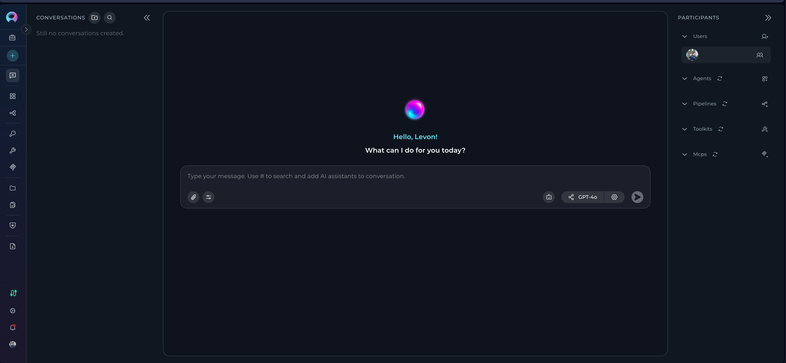

---

### Tip 2: Navigate the Sidebar

Your main navigation lives in the left sidebar: Chat for conversations, Agents for AI assistants, Pipelines for workflows, Collections for organization, and more. Each menu gives you quick access to create and manage your AI resources.

**Quick Action:** Hover over each sidebar icon to see what it does.

---

### Tip 3: Switch Between Projects

Use the Project Selector at the top of the sidebar to switch between your **Private** workspace and "**Team**" Projects. Your Private project is your personal sandbox for experimentation.

**Quick Action:** Click the project dropdown to see all available workspaces.

---

### Tip 4: Chat is Your Command Center

The Chat menu is where everything happens! You can talk to AI models, create toolkits, agents and pipelines on the fly, add teammates, attach files, and edit everything using Canvas—all without leaving your conversation.

**Quick Action:** Navigate to Chat and click "+ Create" to start a conversation.

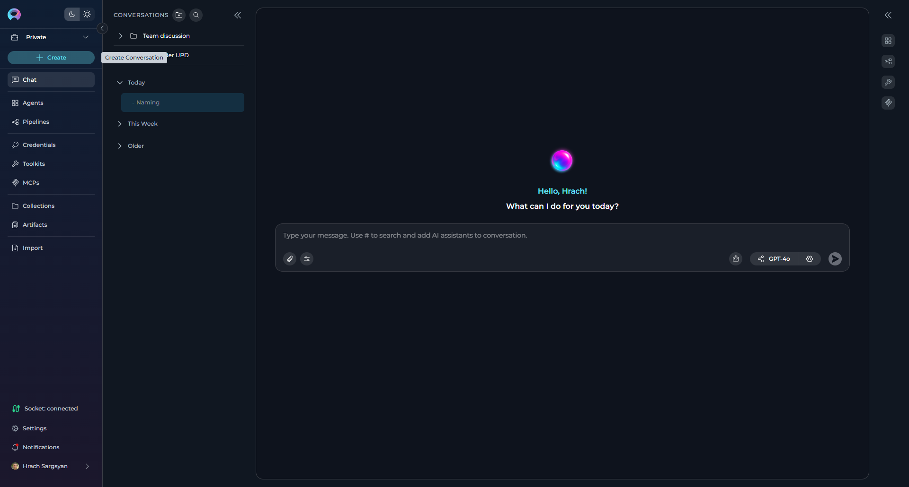

---

### Tip 5: Choose Your AI Model

In any conversation, you can select from multiple AI models (GPT-4o, Anthropic Claude 3.7 Sonnet, and more) using the model dropdown at the bottom of Chat. Different models excel at different tasks—experiment to find what works best!

**Quick Action:** Click the model selector dropdown at the bottom of Chat to explore models.

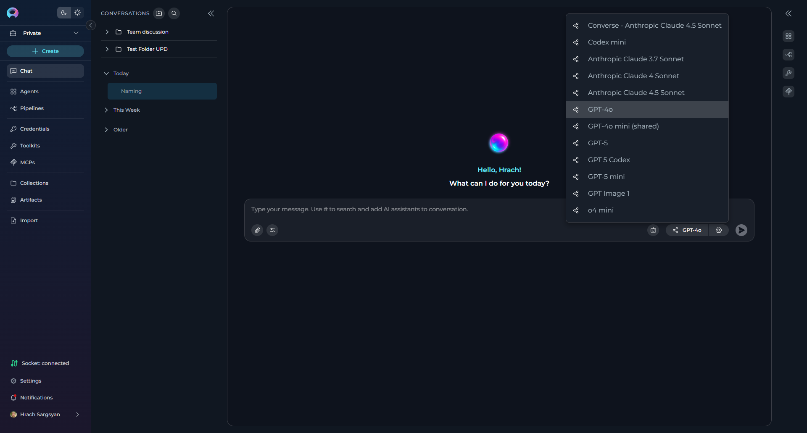

---

### Tip 6: Send Your First Message

Ready to interact with AI? Type your message in the chat input box at the bottom and press Enter or click Send. Try asking: "Create a brief article about Smoke Testing." Watch the AI generate a response instantly!

**Quick Action:** Type "Create a brief article about Smoke Testing." and click **Send** icon.

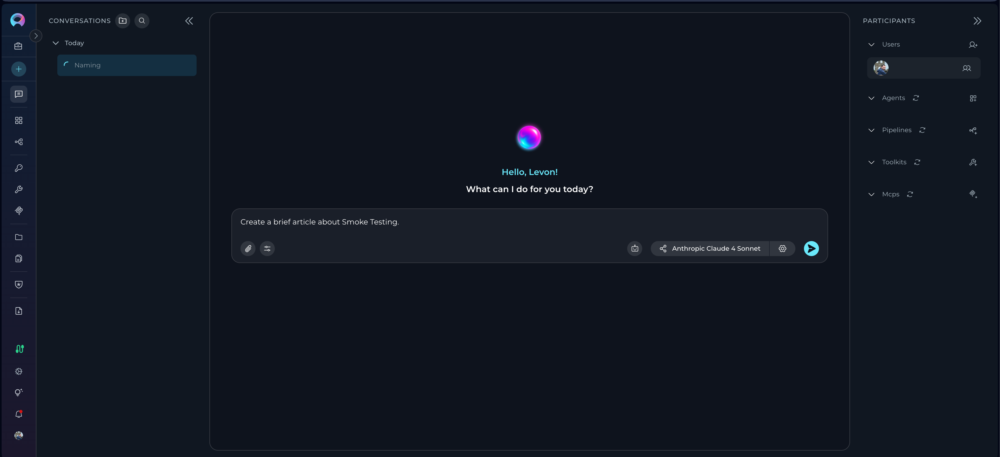

---

## Category 2: Participants & Toolkits - Your AI Team

### Tip 7: Understanding Participants

The Participants panel on the right shows everyone in your conversation—both AI assistants (agents, pipelines, toolkits, MCPs) and human teammates. Each collapsible section lets you add or remove participants. This is your collaboration hub!

**Quick Action:** Look at the Participants panel to see all available participant types.

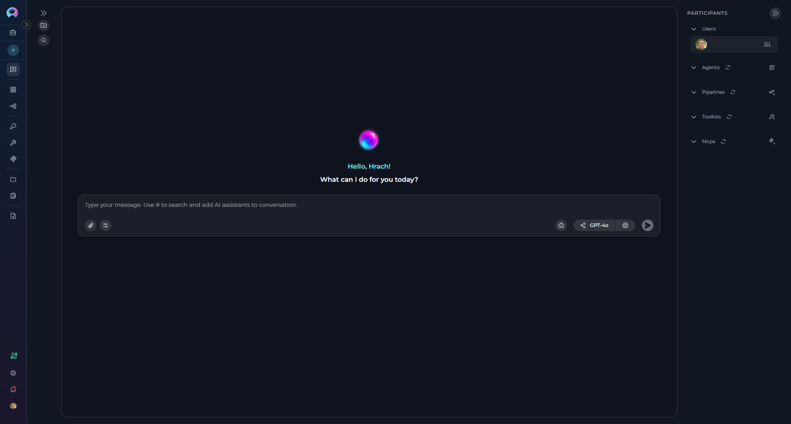

---

### Tip 8: Connect Your First Toolkit from Chat

Toolkits connect AI to external services like Jira, GitHub, Confluence, and more. Start by clicking **+** next to "Toolkits" in the Participants panel, then click "**+ Create new Toolkit**".

**Quick Action:** Click + next to Toolkits > Click "+ Create new Toolkit".

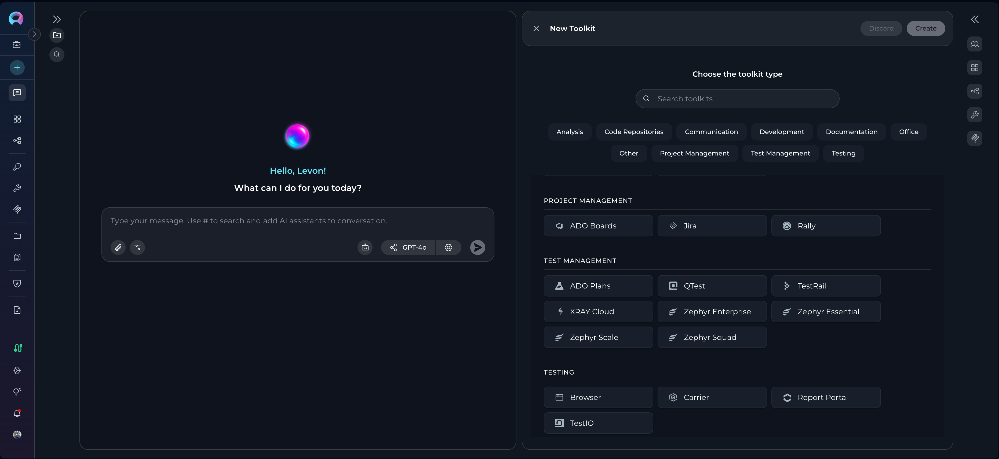

---

### Tip 9: Configure Jira Toolkit

Select "**Jira**" as the toolkit type from the dropdown. Fill in the required fields: **Name*** (e.g., "My Jira Integration") and **Description*** (what this toolkit will be used for).

**Quick Action:** Select Jira type > Fill Name and Description fields.

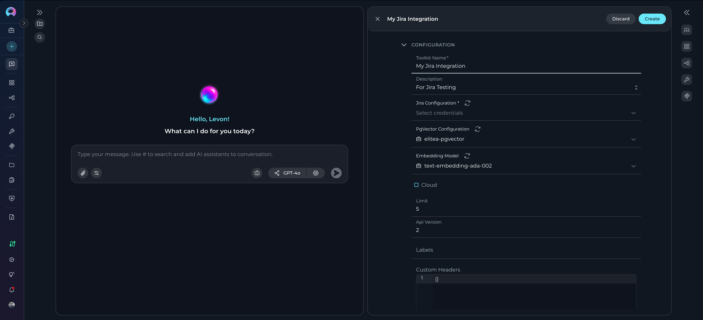

---

### Tip 10: Create Credentials from Toolkit

In the toolkit configuration, you'll need credentials to connect. Click the "**+ Create**" button next to the Credentials dropdown. A new page opens (in new tab) where you enter your Jira API token, email, and server URL. Save the credential.

**Quick Action:** Click "+ Create" next to Credentials > Fill in API details > Save.

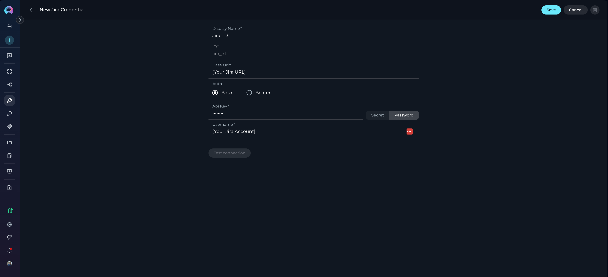

---

### Tip 11: Return and Select Your Credential

After saving your credential, return to the toolkit configuration page. Click the **Refresh** icon next to the Credentials dropdown. Your newly created credential now appears in the list—select it!

**Quick Action:** Click refresh icon > Select your new credential from dropdown.

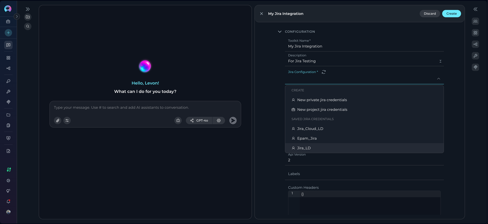

---

### Tip 12: Enable Jira Tools

Scroll to the TOOLS section and check the tools you want to use. For Jira, try enabling "search_issues", "Create issue", and "Get issue". Only enable what you need—this improves security and performance!

**Quick Action:** Check "search_issues", "Create issue", "Get issue" in TOOLS section.

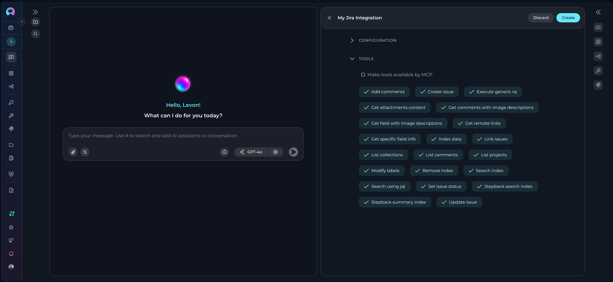

---

### Tip 13: Save and Use Your Toolkit

Click **Save** to create your toolkit. Close the Canvas (X button). Your Jira toolkit now appears in the Participants panel. The AI can automatically use it when you ask Jira-related questions!

**Quick Action:** Click Save > Close Canvas > Ask "What are recently opened Jira issues?"

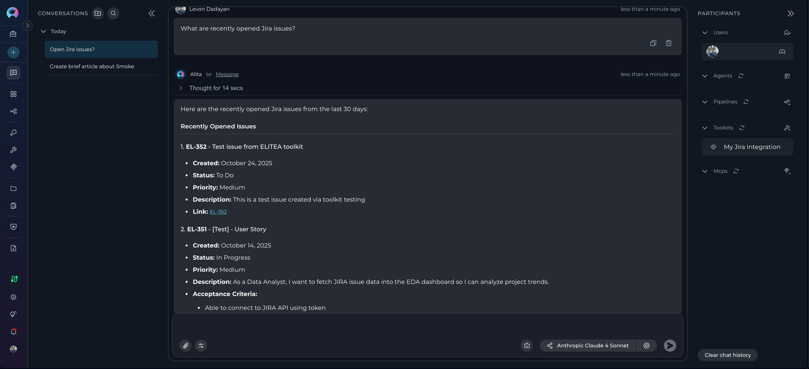

---

### Tip 14: Add AI Assistants with #

Type **#** in the chat input to search for Agents, Pipelines, Toolkits, or MCP servers. Select one from the dropdown—it appears as a chip above the input box. Click on it to make it active for your next message!

**Quick Action:** Type # in chat, select an assistant, then click it to activate.

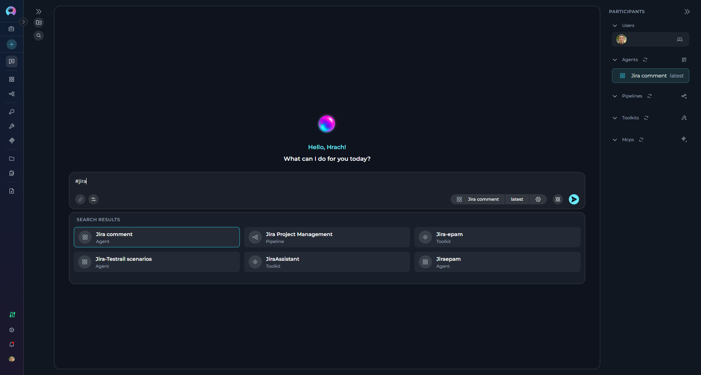

---

## Category 3: Creating Your First Agent - Complete Workflow

### Tip 15: What Are Agents?

Agents are AI assistants with specific instructions and capabilities. They can search the web, create tickets, analyze data, or handle any task you define. Each agent combines an AI model with custom instructions and optional toolkits to become a specialized teammate!

**Quick Action:** In Chat, type # and browse existing agents to see examples.

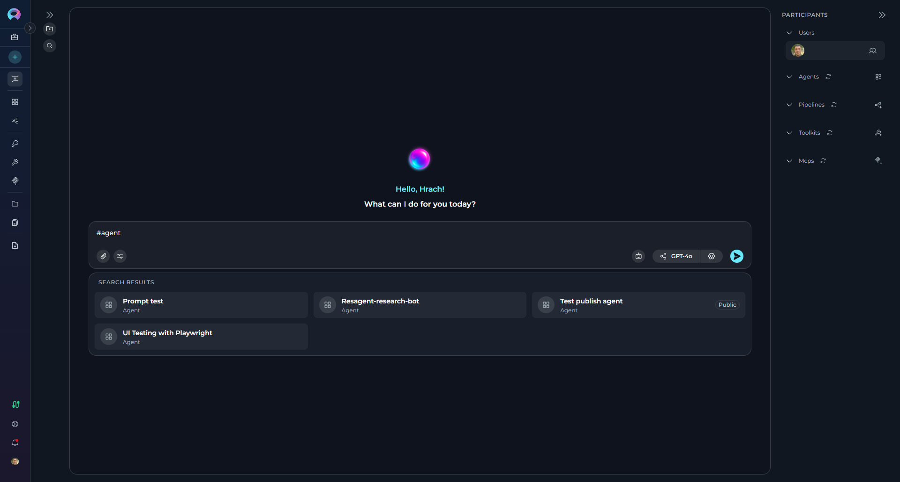

---

### Tip 16: Start Creating an Agent

In the Participants panel, click the **+** icon next to "Agents", then click "**+ Create new**". The Agent Canvas interface opens—this is your visual editor for configuring everything about your agent!

**Quick Action:** Click + next to Agents > Click "+ Create new".

---

### Tip 17: Fill Required Agent Fields

In the Canvas interface, start with the GENERAL section. Enter a **Name*** (e.g., "Code Review Assistant") and **Description*** (what your agent does). Required fields are marked with * and must be filled before you can save!

**Quick Action:** Fill in Name and Description fields in the GENERAL section.

---

### Tip 18: Write Agent Instructions

In the INSTRUCTIONS section, tell your agent exactly how to behave. Example: "You are a code reviewer that checks for security issues, performance concerns, and best practices. Always be constructive and specific." Clear instructions = better results!

**Quick Action:** Write detailed instructions in the INSTRUCTIONS section.

---

### Tip 19: Add Welcome Message (Optional)

In the WELCOME MESSAGE section, write what users see when they first interact with your agent. Example: "Hello! I'm your code review assistant. Share your code and I'll help identify improvements!"

**Quick Action:** Add a friendly welcome message for your agent.

---

### Tip 20: Add Conversation Starters

In the CONVERSATION STARTERS section, click "+ Starter" to add helpful prompts (maximum 4). Examples: "Review this code", "Check for security issues", "Explain best practices". Guide users on how to use your agent!

**Quick Action:** Click "+ Starter" and add 2-3 useful prompts.

---

### Tip 21: Save Initial Configuration

After filling required fields and instructions, click the **Save** button. This creates your agent and opens the advanced configuration interface where you can select AI models, add toolkits, and fine-tune settings!

**Quick Action:** Click Save to proceed to advanced configuration.

---

### Tip 22: Select AI Model for Agent

In the advanced configuration, click "**Select LLM Model**" to choose which AI model powers your agent (GPT-4, Claude, etc.). Each model has different strengths—choose based on your agent's task!

**Quick Action:** Click "Select LLM Model" and choose a model.

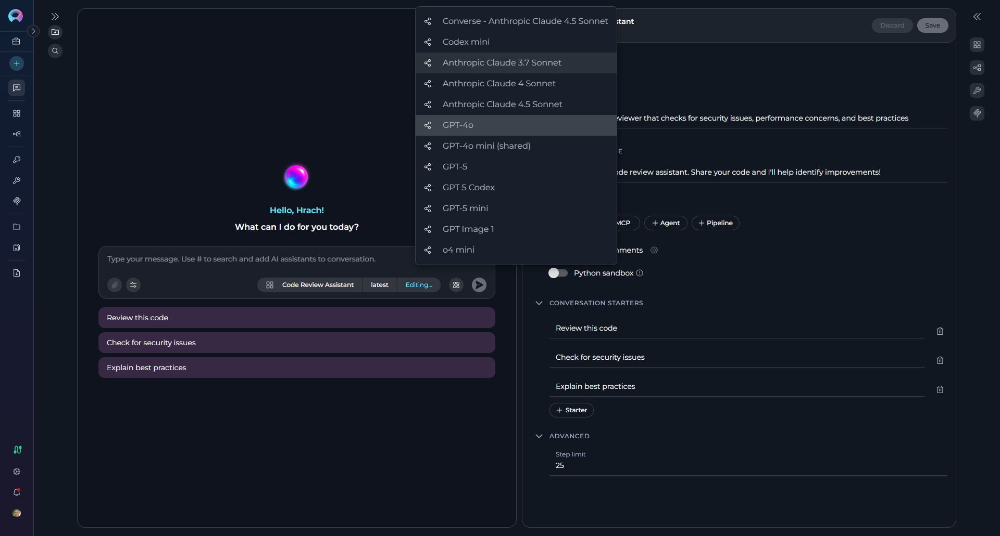

---

### Tip 23: Configure Model Settings

Click the **Model Settings** icon (⚙️) next to the model selector to fine-tune parameters. Set Temperature (0.1=focused, 1.0=creative), Top P, and Max Completion Tokens. Click Apply to save these settings!

**Quick Action:** Click ⚙️ icon, adjust Temperature, click Apply.

---

### Tip 24: Your Agent is Created!

After configuring model settings, click the **X** to close Canvas. Your new agent appears in the Participants panel under "Agents" and is immediately ready to use in your conversation!

**Quick Action:** Close Canvas to see your agent in the Participants panel.

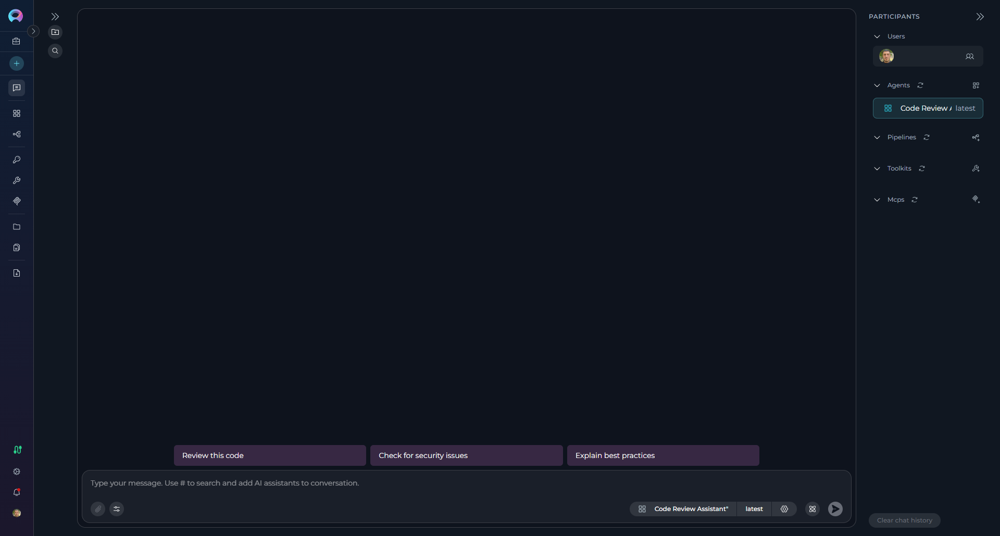

---

### Tip 25: Test Your New Agent

To test your agent, type **#YourAgentName** in the chat input and select it. Click on the agent chip to make it active (it will be highlighted). Now type a message or click a conversation starter and send—watch your agent respond!

**Quick Action:** Type #[AgentName], click the chip, send a test message.

---

### Tip 26: Edit Agents Anytime

Need to update your agent? In the Participants panel, hover over the agent and click the **Edit** icon that appears. The Canvas interface reopens with all current settings—modify anything and save. Changes apply immediately!

**Quick Action:** Hover over agent in Participants, click Edit icon.

---

### Tip 27: Add Toolkits to Agents

Supercharge your agent by adding toolkits! In the agent configuration, find the TOOLKITS section and select from your created toolkits (like Jira, GitHub, Confluence). Your agent can now interact with those external services automatically!

**Quick Action:** Open agent settings, scroll to TOOLKITS, select a toolkit, Save.

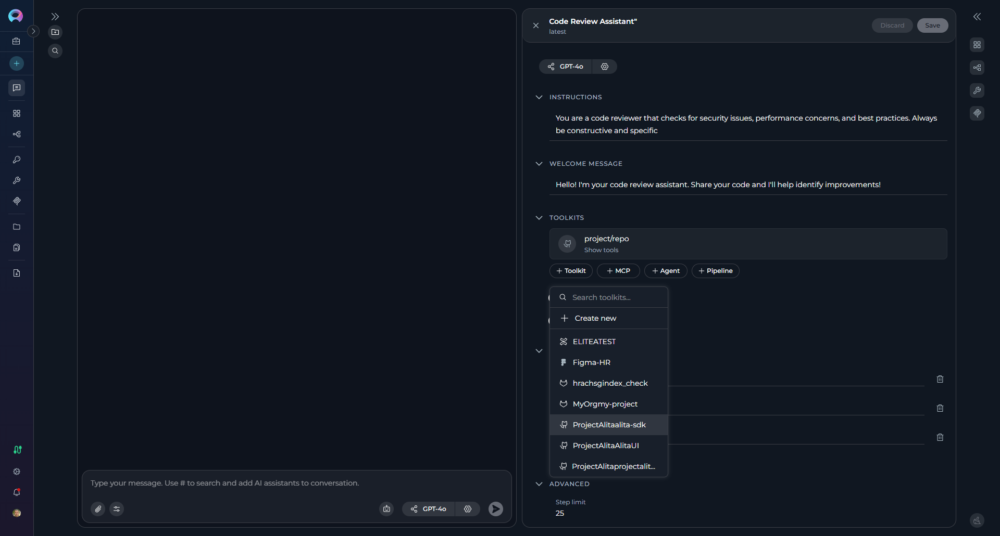

---

## Category 4: Creating Pipelines - Multi-Step Workflows

### Tip 28: What Are Pipelines?

Pipelines are automated workflows that chain together multiple AI steps, decisions, loops, and tool calls. Perfect for complex processes like "read ticket → analyze → create subtasks → update status"—all happening automatically!

**Quick Action:** In Chat, type # and browse existing pipelines to see examples.

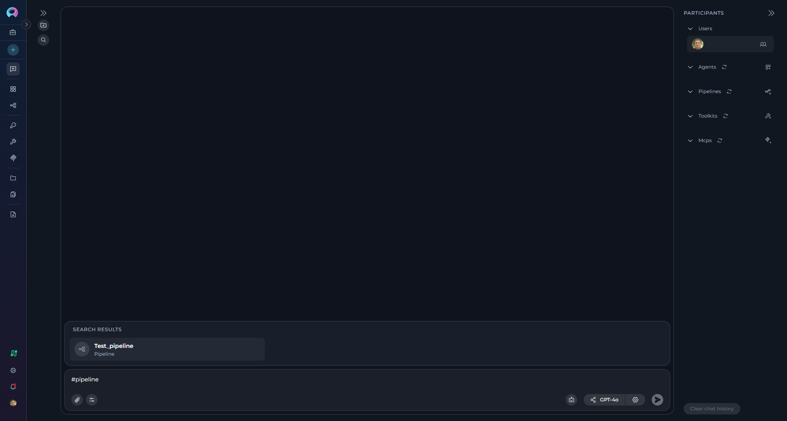

---

### Tip 29: Start Creating a Pipeline

In the Participants panel, click the **+** icon next to "Pipelines", then click "**+ Create new**". The Pipeline Canvas interface opens with Configuration and Flow Editor tabs—this is where you build your automated workflows!

**Quick Action:** Click + next to Pipelines > Click "+ Create new".

---

### Tip 30: Configure Pipeline Basics

In the Configuration tab, fill the GENERAL section with **Name*** (e.g., "Customer Feedback Pipeline") and **Description***. Add optional Welcome Message and Conversation Starters just like with agents. Configure step limit in ADVANCED section (default: 25 steps).

**Quick Action:** Fill Name and Description, optionally add starters.

---

### Tip 31: Save to Unlock Flow Editor

Click **Save** to create your pipeline. Important: The Flow Editor tab is disabled until you save! After saving, the advanced configuration opens where you can design your visual workflow in the Flow Editor tab.

**Quick Action:** Click Save to unlock the Flow Editor tab.

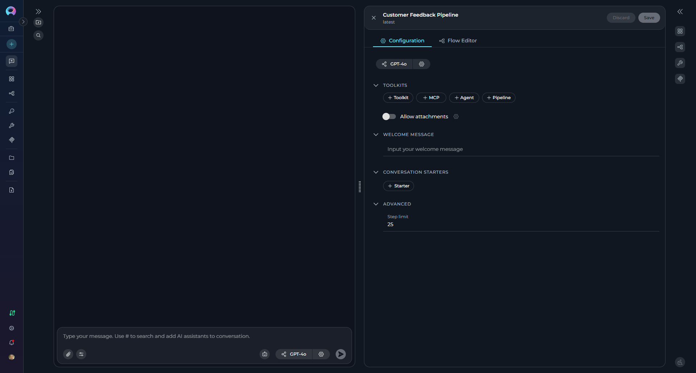

---

### Tip 32: Access the Flow Editor

After saving, click the **Flow Editor** tab to design your workflow visually. The Flow Editor uses a drag-and-drop canvas where you connect nodes to create your automation logic. This is where pipelines come to life!

**Quick Action:** Click the "Flow Editor" tab after initial save.

---

### Tip 33: Add Nodes to Your Workflow

In Flow Editor, click **+ Add Node** to see available node types: Agent (AI conversations), Function (tool calls), Condition (if/else logic), Loop (repetition), Router (multiple paths), and more. Each node performs a specific workflow step!

**Quick Action:** Click "+ Add Node" to explore node types.

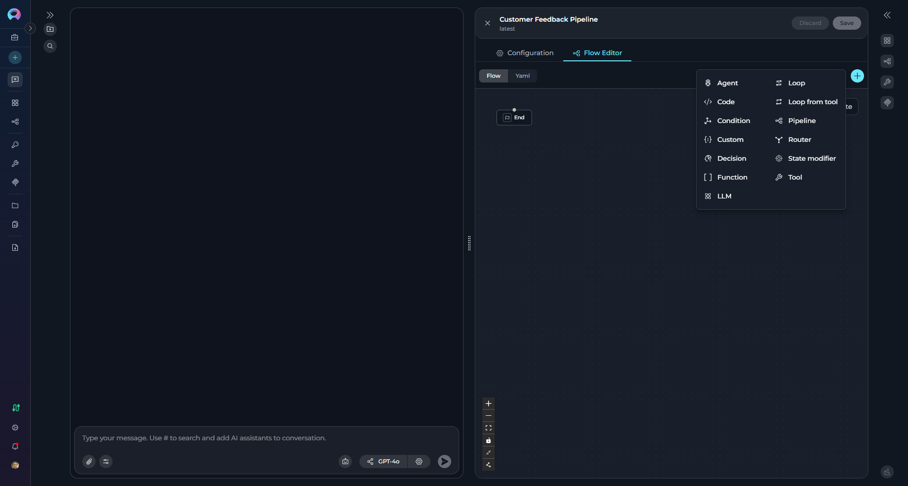

---

### Tip 34: Design Your Workflow Visually

Drag nodes onto the canvas and connect them by drawing lines between connection points. Each connection shows the flow of data and control through your pipeline. Build complex logic without writing code!

**Quick Action:** Drag an Agent node onto the canvas and connect it.

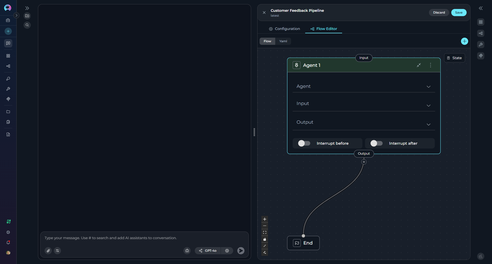

---

### Tip 35: Configure Pipeline Model & Toolkits

Return to the Configuration tab to select the LLM model for your pipeline and add toolkits, nested agents, or nested pipelines. Pipelines can use everything agents can—plus they orchestrate multiple steps!

**Quick Action:** Click Configuration tab, select model, add toolkits.

---

### Tip 36: Save and Test Your Pipeline

After designing your workflow, click **Save** and close the Canvas (X button). Your pipeline appears in the Participants panel. Add it to Chat with **#PipelineName**, activate it, and send a message to watch it execute each step!

**Quick Action:** Save pipeline, add to Chat with #, test it.

---

## Category 5: Collaboration & Advanced Features

### Tip 37: Enable File Attachments

Click the paperclip icon (📎) in Chat. First time, an "Attachment settings" popup appears. Select an existing Artifact Toolkit or create a new one to store files. Save the configuration. Now the attachment feature is enabled for this conversation!

**Quick Action:** Click 📎, configure Artifact Toolkit, save settings.

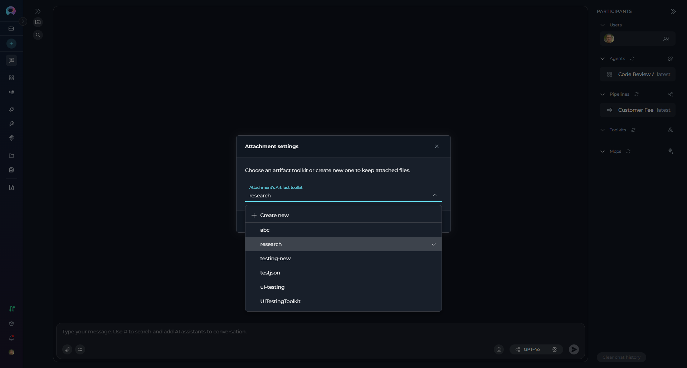

---

### Tip 38: Attach Files to Chat

Once enabled, click the paperclip icon again to see "Attach files" and "Attachment settings". Click "Attach files", select images or documents, type a message describing what you want the AI to do, and send. AI analyzes your files!

**Quick Action:** Click 📎 > Attach files > Select file > Type message > Send.

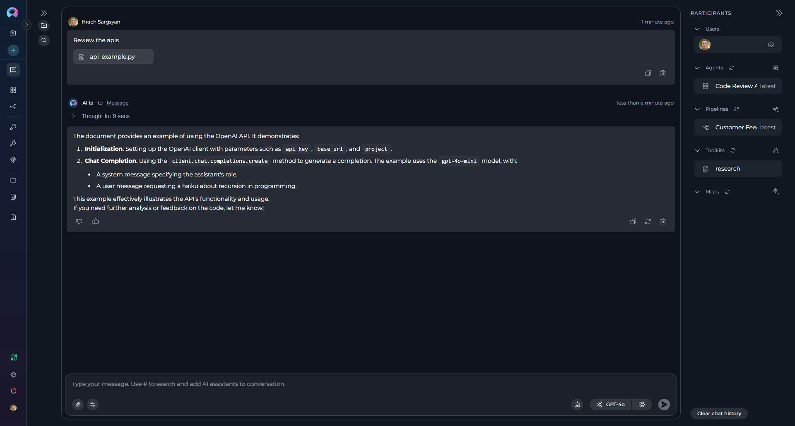

---

### Tip 39: Add Human Teammates (Team Projects Only)

Collaborate with colleagues! In the Participants panel, click the **users icon** next to your avatar to see "Add users" option. Click it, search for teammates by name, select them, and click Add. They join the conversation and can interact!

**Quick Action:** Click users icon in Participants > Add users > Select > Add.

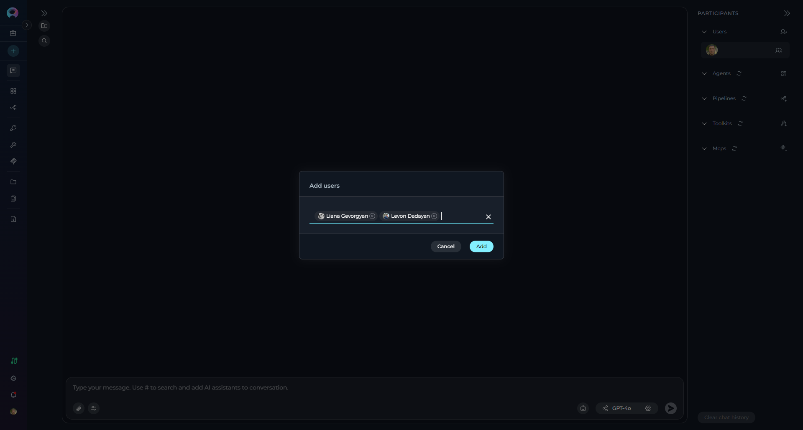

---

### Tip 40: Mention Teammates with @

To get a teammate's attention, type **@** in your message followed by their name (e.g., "@John Doe, can you review this?"). They receive a notification. Use "@All Users" to notify everyone in the conversation!

**Quick Action:** Type @ in message, select teammate, complete message.

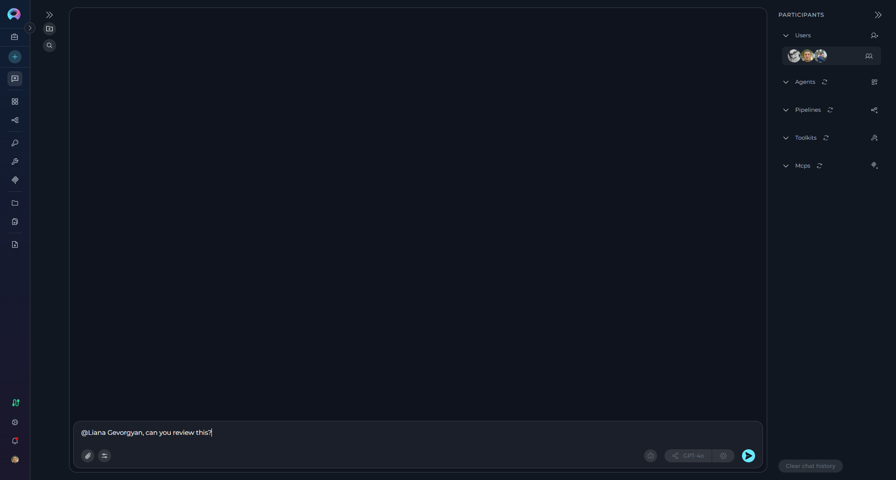

---

### Tip 41: Edit Participants Using Canvas

Hover over any agent, pipeline, or toolkit in the Participants panel and click the **Edit** icon (or click ⚙️ settings icon). The Canvas editor opens where you can modify all settings—instructions, models, toolkits, workflow design—and save changes instantly!

**Quick Action:** Hover over participant > Click Edit icon > Modify > Save.

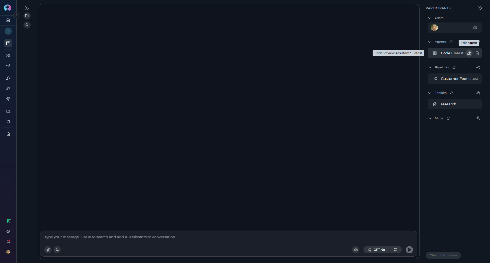

---

### Tip 42: Copy and Regenerate Responses

Hover over any AI response to see action buttons: **Copy** (paste elsewhere), **Regenerate** (get a different response). Make AI outputs actionable and collaborative!

**Quick Action:** Hover over AI message to reveal action buttons.

---

### Tip 43: Multi-Assistant Collaboration

Add multiple agents or pipelines to one conversation! They can work together—one agent gathers data, another analyzes it, a third creates tickets. Build powerful multi-step workflows where specialists collaborate automatically!

**Quick Action:** Add 2+ agents using #, activate each when needed.

---

### Tip 44: Switch Active Participants

At the bottom of the chat input, click the "Switch assistant" icon to quickly change which agent or pipeline is active. The active participant will respond to your next message. Switch seamlessly between different AI specialists!

**Quick Action:** Click the assistant switcher at the bottom of chat input.

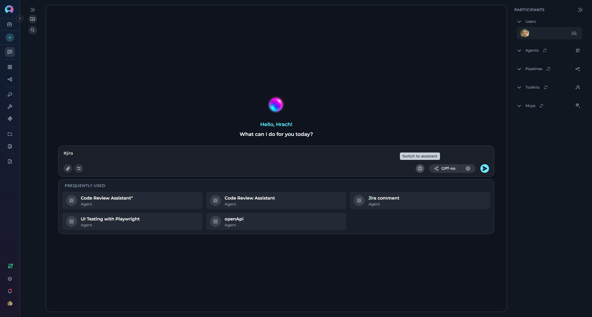

---

### Tip 45: Add Participants from Panel

Click the **+** icon next to any section in the Participants panel (Agents, Pipelines, Toolkits, MCPs, or Users) to browse and add participants. They'll appear in the list and be ready to use in your conversation.

**Quick Action:** Click + next to "Agents" in Participants to see available agents.

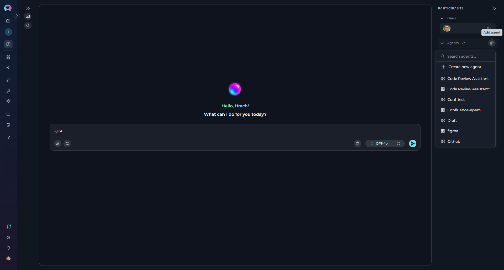

---

### Tip 46: Search Your Conversations

Use the search bar at the top of the Chat sidebar to find specific conversations by name or content. Filter by date, participants, or project. Never lose track of important conversations!

**Quick Action:** Click search icon in Chat sidebar, enter search terms.

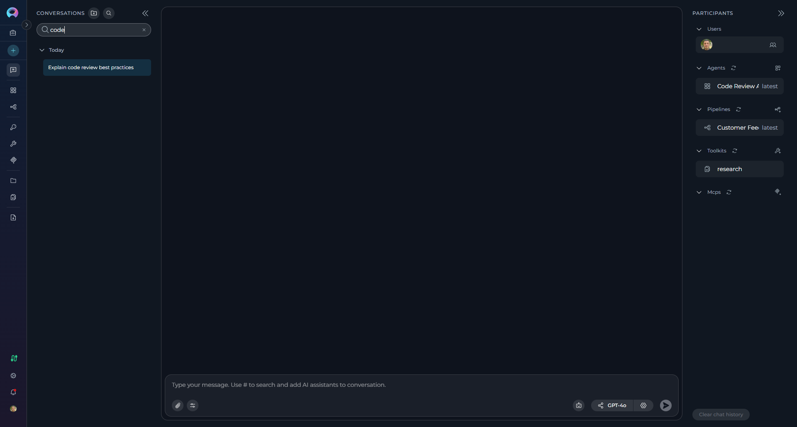

---

### Tip 47: Organize Chats with Folders

Keep conversations organized by clicking "+ Create folder" in the Chat sidebar. Name your folder (like "Work Projects" or "Experiments"), then drag conversations into it. Public and private folders help you structure your workspace!

**Quick Action:** Click "+ Create folder" in Chat sidebar and name it.

---

### Tip 48: View Message Execution Details

Click on any AI response message in Chat to expand execution details. See timing information, execution logs, and which tools were called. Perfect for understanding performance and debugging workflows!

**Quick Action:** Click any AI message to expand execution details.

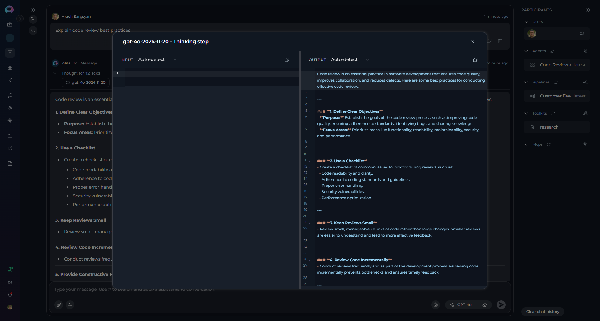

---

## 🎉 Your Workspace is Ready!

Congratulations! You've completed your ELITEA onboarding journey with **49 building-block tips** that took you from first steps to advanced workflows. You now know how to:

✅ Navigate ELITEA and understand Chat as your central workspace  
✅ Create custom AI agents with specific instructions and capabilities  
✅ Build automated pipelines with visual workflow design  
✅ Connect external services using toolkits and credentials  
✅ Collaborate with AI assistants and human teammates  
✅ Use advanced features like file attachments and multi-assistant conversations

**Your First Real Project:**

1. **Create an agent** for a task you do often (code review, writing, research)
2. **Add a toolkit** if your agent needs external data (GitHub, Jira, web search)
3. **Test in Chat** with real examples and refine the instructions
4. **Build a pipeline** once you have a multi-step process to automate
5. **Share with teammates** in a team project conversation

**Continue Learning:**

* [Quick Start Guide](../getting-started/quick-start.md) for detailed walkthroughs
* [Chat Documentation](../menus/chat.md) for comprehensive reference
* [Creating Agents](../getting-started/create-agent.md) for agent best practices
* [Pipeline Documentation](../menus/pipelines.md) for advanced workflow patterns
* [Glossary](../home/glossary.md) for definitions of all ELITEA terms

Welcome to ELITEA! 🚀 Your AI-powered workspace awaits.
