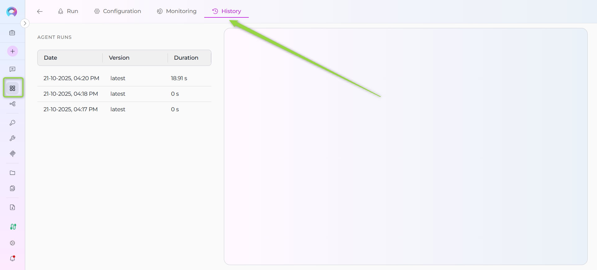
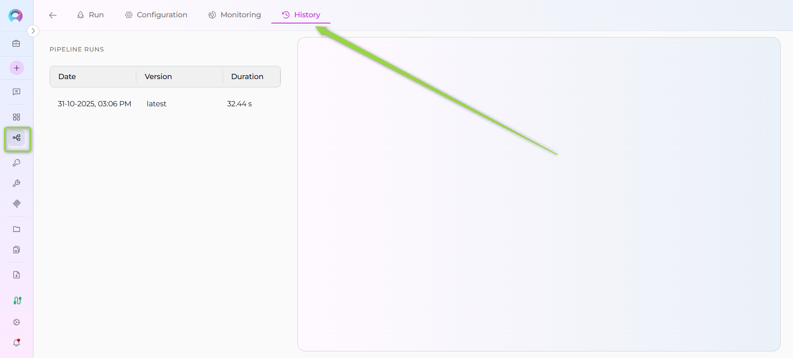
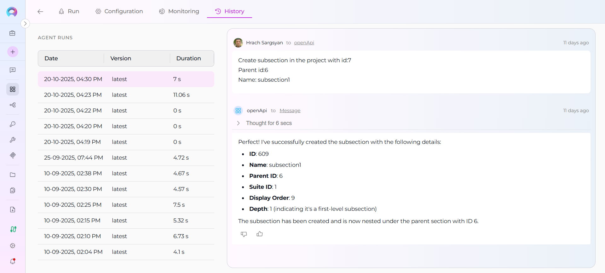
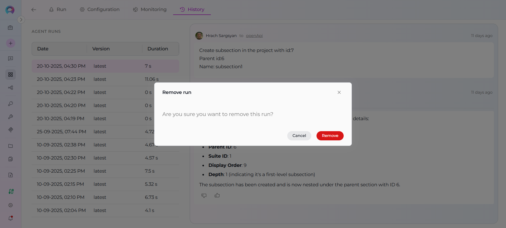

# Agents and Pipelines History

## Overview

The **History** tab in Agents and Pipelines allows you to view and review all past execution runs of your agent or pipeline. This feature provides a complete audit trail of interactions, enabling you to replay conversations, analyze performance metrics, and debug issues from previous runs.

Each history entry captures:

- **Date and time** of the run
- **Version** of the agent/pipeline used
- **Duration** of the execution
- **Complete conversation** with all messages exchanged
- **Execution details** for troubleshooting

This is particularly useful for:

- **Debugging**: Review failed runs to identify issues
- **Performance analysis**: Track execution times across different versions
- **Audit trail**: Maintain records of all agent/pipeline interactions
- **Testing**: Verify behavior changes between versions
- **Learning**: Study how the agent/pipeline responded in various scenarios

## Prerequisites

Before accessing the History tab, ensure you have:

- **Project access**: You must be a member of the project containing the agent or pipeline
- **Agent or Pipeline**: At least one agent or pipeline must exist in the project
- **Run history**: The agent or pipeline must have been executed at least once

!!! note "Permissions"
    The History tab is visible to all users who can view the agent or pipeline. You don't need special permissions to view run history.

## Accessing the History Tab

### For Agents

1. Navigate to the **Agents** menu in the left sidebar
2. Click on the agent you want to review
3. In the agent detail view, click the **History** tab

### For Pipelines

1. Navigate to the **Pipelines** menu in the left sidebar
2. Click on the pipeline you want to review
3. In the pipeline detail view, click the **History** tab

!!! tip "Quick Navigation"
    The History tab is located alongside other tabs like Run, Configuration, and Monitoring in the agent or pipeline detail page.

## Understanding the History View

The History tab has a **two-panel layout**:

### Left Panel: Run History List

The left panel displays all historical runs in a list format with three columns:

- **Date**: Timestamp when the run was executed (format: DD-MM-YYYY, hh:mm AM/PM)
- **Version**: The version of the agent/pipeline that was used for this run
- **Duration**: How long the execution took (displayed in human-readable format)

**Features:**

- **Infinite scroll**: As you scroll down, more runs are automatically loaded
- **Selection**: Click on any run to view its details in the right panel
- **Visual indicator**: The selected run is highlighted
- **Chronological order**: Runs are displayed from newest to oldest

### Right Panel: Chat Replay

The right panel shows the complete conversation for the selected run:

- **All messages**: Both user inputs and agent/pipeline responses
- **Message order**: Messages appear in the order they were exchanged
- **Formatting**: Messages retain their original formatting, including code blocks and lists
- **Read-only**: This is a replay view—you cannot modify or continue the conversation

!!! info "Empty State"
    When no run is selected, the right panel remains empty. Select a run from the left panel to view its conversation.

## Using the History Tab

### Viewing a Past Run

1. Navigate to the History tab as described above
2. Browse the list of runs in the left panel
3. Click on the run you want to review
4. The complete conversation for that run appears in the right panel
5. Scroll through the messages to review the interaction

### Finding a Specific Run

Since runs are ordered by date (newest first), you can:

- **Recent runs**: Look at the top of the list
- **Specific date**: Scroll down until you find the date range
- **Specific version**: Look for the version name in the Version column

!!! tip "Load More Runs"
    If you have many historical runs, scroll to the bottom of the list to automatically load more entries.

### Comparing Versions

To compare how different versions of your agent or pipeline performed:

1. Identify two runs with different versions in the Version column
2. Select the first run and review its conversation
3. Select the second run and review its conversation
4. Compare the responses, duration, and behavior

### Analyzing Performance

To analyze execution performance:

1. Look at the **Duration** column for execution times
2. Select slower runs to identify what might have caused delays
3. Compare durations across different versions to measure improvements

### Deleting a Run

If you need to remove a specific run from history:

1. Hover over the run you want to delete in the left panel
2. Click the **Delete** icon that appears
3. Confirm the deletion in the modal dialog
4. The run is permanently removed from history

!!! warning "Permanent Deletion"
    Deleting a run from history is permanent and cannot be undone. Make sure you want to remove the record before confirming.

## Common Use Cases

### 1. Debugging a Failed Run

**Scenario**: An agent produced unexpected results or failed to complete.

**Steps**:

1. Go to the History tab
2. Find the failed run by date or version
3. Select the run to view the conversation
4. Review the messages to identify:
   - What input triggered the issue
   - Where the agent's response went wrong
   - Any error messages or unexpected behavior
5. Use this information to fix the agent's configuration or prompts

### 2. Performance Optimization

**Scenario**: You want to optimize your pipeline's execution time.

**Steps**:

1. Open the History tab
2. Review the Duration column across multiple runs
3. Identify runs that took longer than expected
4. Select those runs to see what operations were performed
5. Optimize the pipeline based on the longest-running operations

### 3. Version Comparison

**Scenario**: You updated your agent and want to verify improvements.

**Steps**:

1. Create a new version of the agent
2. Run the same test inputs on both the old and new versions
3. Go to the History tab
4. Compare runs from the old version vs. the new version
5. Verify that the new version produces better results

### 4. Audit and Compliance

**Scenario**: You need to provide evidence of what your agent processed.

**Steps**:

1. Navigate to the History tab
2. Find the relevant run by date
3. Review the complete conversation
4. Use this as documentation for compliance or audit purposes

### 5. Learning and Training

**Scenario**: You want to understand how your agent handles different inputs.

**Steps**:

1. Review multiple runs in the History tab
2. Study patterns in successful responses
3. Identify common failure scenarios
4. Use these insights to improve your agent's instructions or configuration

## Troubleshooting

### No History Entries Appear

**Problem**: The History tab is empty or shows no runs.

**Solutions**:

- **Verify runs**: Make sure the agent or pipeline has been executed at least once
- **Check project**: Confirm you're viewing the correct agent/pipeline in the correct project
- **Wait for sync**: If you just ran the agent, wait a few seconds and refresh the page
- **Check permissions**: Ensure you have access to view this agent/pipeline

### Selected Run Shows No Messages

**Problem**: When you click a run, the right panel remains empty.

**Solutions**:

- **Wait for loading**: The conversation may still be loading—look for a loading indicator
- **Check selection**: Ensure the run is highlighted in the left panel
- **Refresh**: Try selecting another run, then select the original run again
- **Network issues**: Check your internet connection and try again

### Cannot Delete a Run

**Problem**: The delete button doesn't appear or deletion fails.

**Solutions**:

- **Hover properly**: Make sure you hover directly over the run item to reveal the delete icon
- **Check permissions**: You may not have permission to delete runs in this project
- **Retry**: If deletion fails, wait a moment and try again

### List Not Loading More Runs

**Problem**: Scrolling to the bottom doesn't load more historical runs.

**Solutions**:

- **Check total count**: You may already have all available runs loaded
- **Network issues**: Check your internet connection
- **Scroll position**: Try scrolling back up slightly, then scroll down again to trigger loading

### Duration Shows Unusual Values

**Problem**: The duration column shows unexpected values like very short or very long times.

**Explanation**:

- **Very short durations** (< 1 second): The agent/pipeline responded very quickly
- **Very long durations** (> several minutes): The execution involved complex processing, multiple tool calls, or external API delays
- **This is normal**: Duration reflects actual execution time and can vary widely

## Best Practices

### Regular Review

- **Check history periodically**: Review your agent/pipeline runs regularly to catch issues early
- **Monitor trends**: Track performance over time to identify degradation
- **Version tracking**: Always note which version was used for important runs

### Performance Monitoring

- **Baseline duration**: Establish a baseline for normal execution times
- **Alert on anomalies**: If a run takes much longer than usual, investigate immediately
- **Version comparison**: After each update, compare new runs to previous versions

### Debugging Workflow

1. **Reproduce issues**: When a problem is reported, find the run in history first
2. **Analyze context**: Review what led to the issue in the conversation
3. **Test fixes**: After fixing, run the same scenario and compare in history
4. **Document findings**: Use the history as documentation of the issue and resolution

### Data Management

- **Clean old runs**: Periodically delete very old runs that are no longer needed
- **Keep important runs**: Don't delete runs that serve as examples or evidence
- **Version milestones**: Keep at least one run from each major version for reference

### Security Considerations

- **Sensitive data**: Be aware that all messages are stored in run history
- **Access control**: Ensure only authorized users can access agents/pipelines with sensitive data
- **Retention policy**: Consider establishing a policy for how long to retain run history

## Related Documentation

!!! info "Related Resources"
    - [Agents Menu](../menus/agents.md) - Learn about managing agents
    - [Pipelines Menu](../menus/pipelines.md) - Learn about managing pipelines
    - [Entity Versioning](../features/entity-versioning.md) - Understanding version management
