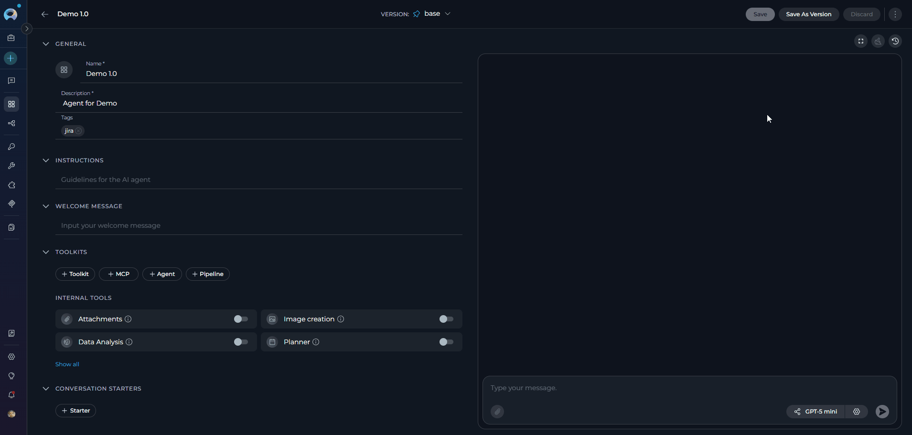
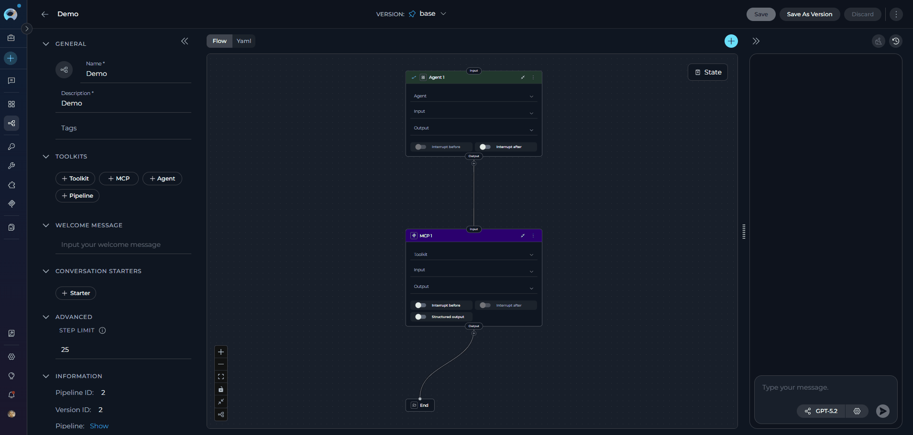
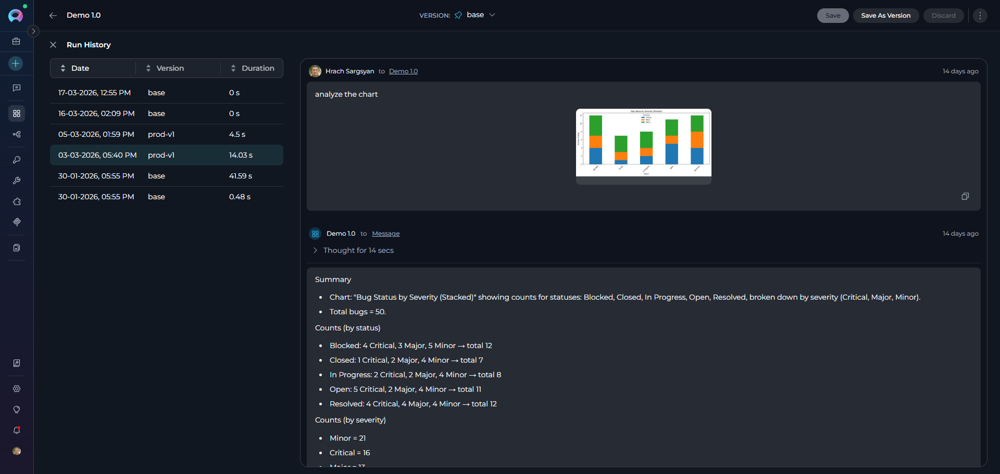
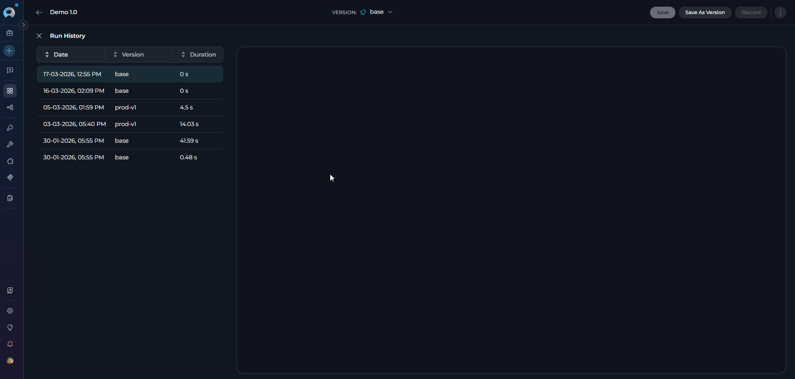
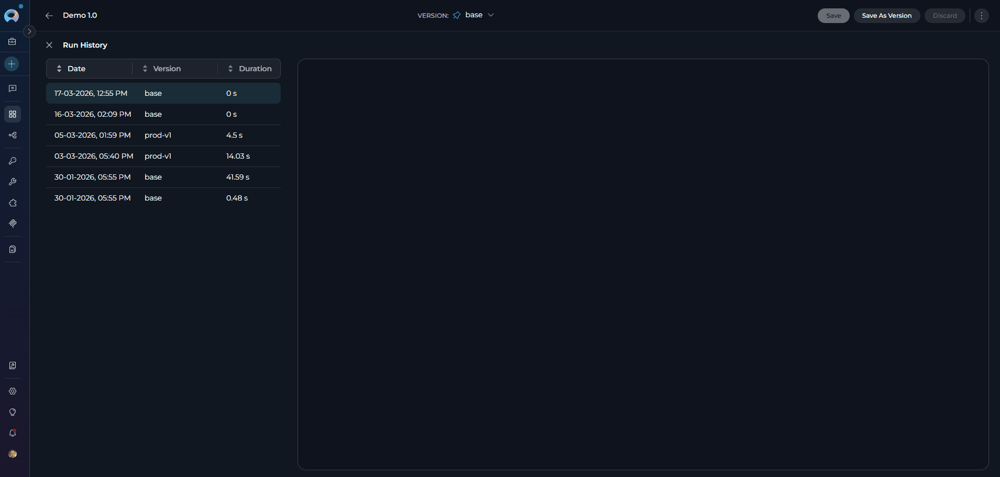
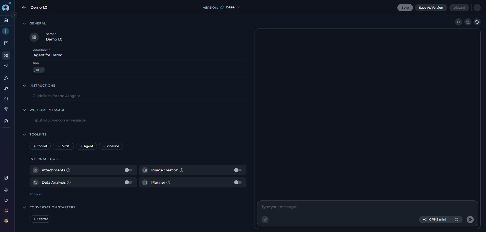

# Agents and Pipelines History

## Overview

The **Run History** panel in Agents and Pipelines allows you to view and review all past execution runs of your agent or pipeline. This feature provides a complete audit trail of interactions, enabling you to replay conversations, analyze performance metrics, and debug issues from previous runs.

Each history entry captures:

- **Date and time** of the run
- **Version** of the agent/pipeline used
- **Duration** of the execution
- **Complete conversation** with all messages exchanged
- **Execution details** for troubleshooting

This is particularly useful for:

- **Debugging**: Review failed runs to identify issues
- **Performance analysis**: Track execution times across different versions
- **Audit trail**: Maintain records of all agent/pipeline interactions
- **Testing**: Verify behavior changes between versions
- **Learning**: Study how the agent/pipeline responded in various scenarios

## Prerequisites

Before accessing Run History, ensure you have:

- **Project access**: You must be a member of the project containing the agent or pipeline
- **Agent or Pipeline**: At least one agent or pipeline must exist in the project
- **Run history**: The agent or pipeline must have been executed at least once

!!! note "Permissions"
    Run History is visible to all users who can view the agent or pipeline. You don't need special permissions to view run history.

## Accessing Run History

### For Agents

1. Navigate to the **Agents** menu in the left sidebar
2. Click on the agent you want to review
3. In the agent page, look at the **right panel** (embedded chat area)
4. Click the **clock icon** (🕐) in the top bar of the right panel. The tooltip reads *"View run history"*
5. The page is replaced by the **Run History** panel. Click the **✕ (Close)** button in the top-left to return.

     { loading=lazy }

### For Pipelines

1. Navigate to the **Pipelines** menu in the left sidebar
2. Click on the pipeline you want to review
3. In the pipeline page, look at the **right panel** (embedded chat area)
4. Click the **clock icon** (🕐) in the top bar of the right panel. The tooltip reads *"View run history"*
5. The page is replaced by the **Run History** panel. Click the **✕ (Close)** button in the top-left to return.

     { loading=lazy }

!!! tip "Right panel must be visible"
    The clock icon appears in the top bar of the embedded chat panel on the right side of the agent/pipeline page. If the right panel is collapsed, expand it first using the collapse toggle button.

## Understanding the Run History View

The Run History panel replaces the current page view and has a **two-panel layout**: a header bar at the top with a close button and "Run History" title, a left panel listing all past runs, and a right panel showing the selected conversation replay.

     { loading=lazy }

### Left Panel: Run History List

The left panel displays all historical runs in a sortable list with the following columns:

| Column | Description |
|--------|-------------|
| **Date** | Timestamp when the run was executed (format: `dd-MM-yyyy, hh:mm AM/PM`) |
| **Version** | The version of the agent/pipeline used for this run |
| **Duration** | How long the execution took (human-readable format) |

All column headers are clickable to sort the list ascending or descending by that column.

**Features:**

- **Infinite scroll**: As you scroll down, more runs are automatically loaded
- **Selection**: Click on any row to view its conversation in the right panel
- **Visual indicator**: The selected run is highlighted
- **Default order**: Newest runs appear first (sorted by Date descending)
- **Three-dot menu (⋮)**: Each row has a context menu with [actions](#run-actions) available on hover

### Right Panel: Chat Replay

The right panel shows the complete conversation for the selected run:

- **All messages**: Both user inputs and agent/pipeline responses
- **Message order**: Messages appear in the order they were exchanged
- **Formatting**: Messages retain their original formatting, including code blocks and lists
- **Read-only**: This is a replay view—you cannot modify or continue the conversation

!!! info "Empty State"
    When no run is selected, the right panel remains empty. Select a run from the left panel to view its conversation.

### Run Actions

Each run row has a **three-dot menu (⋮)** that appears on hover, containing the following actions:

| Action | Description |
|--------|-------------|
| **Share link** | Copies a direct URL to this specific run to the clipboard. Opening the link automatically navigates to the Run History panel and selects that run. |
| **Delete** | Permanently removes this run record. A confirmation dialog titled "Remove run" appears before deletion. |
| **Restore conversation** | Pre-populates the embedded test chat with the selected run's message history. **Note:** restores chat history only — agent/pipeline configuration, instructions, and tool settings are **not** reverted. |

!!! warning "Permanent Deletion"
    Deleting a run is permanent and cannot be undone. Confirm carefully before removing any run record.

## Using Run History

### Viewing a Past Run

1. Access Run History as described in [Accessing Run History](#accessing-run-history)
2. Browse the list of runs in the left panel
3. Click on the run you want to review
4. The complete conversation for that run appears in the right panel
5. Scroll through the messages to review the interaction
6. Click **✕ (Close)** when done to return to the agent/pipeline page

     { loading=lazy }

### Finding a Specific Run

Since runs are sorted by date (newest first) by default, you can:

- **Recent runs**: Look at the top of the list
- **Specific date**: Scroll down or click the **Date** column header to reverse the sort order
- **Specific version**: Click the **Version** column header to sort alphabetically by version name
- **By duration**: Click the **Duration** column header to sort by execution time

!!! tip "Load More Runs"
    If you have many historical runs, scroll to the bottom of the list to automatically load more entries.

### Comparing Versions

To compare how different versions of your agent or pipeline performed:

1. Identify two runs with different versions in the Version column
2. Select the first run and review its conversation
3. Select the second run and review its conversation
4. Compare the responses, duration, and behavior

### Analyzing Performance

To analyze execution performance:

1. Look at the **Duration** column for execution times
2. Select slower runs to identify what might have caused delays
3. Compare durations across different versions to measure improvements

### Copying a Run Link

To share a specific run with team members or save it for later reference:

1. Hover over the run you want to share in the left panel
2. Click the **⋮ (three-dot menu)** icon that appears
3. Select **Share link**
4. A success toast appears confirming the link was copied to your clipboard
5. Share the link — when opened it navigates directly to the Run History panel with that run selected

     { loading=lazy }

### Deleting a Run

If you need to remove a specific run from history:

1. Hover over the run you want to delete in the left panel
2. Click the **⋮ (three-dot menu)** icon that appears
3. Select **Delete**
4. Confirm the deletion in the **"Remove run"** dialog
5. The run is permanently removed from history

     { loading=lazy }

!!! warning "Permanent Deletion"
    Deleting a run from history is permanent and cannot be undone. Make sure you want to remove the record before confirming.

### Restoring a Conversation

The **Restore conversation** action pre-populates the embedded test chat (right panel of the agent/pipeline page) with the message history from a selected run. This lets you quickly resume or replay an earlier conversation without manually re-entering the same inputs.

To restore a past conversation:

1. Open the Run History panel by clicking the **clock icon** (🕐) in the right panel top bar
2. Find the run whose conversation you want to restore
3. Hover over that run row and click the **⋮ (three-dot menu)** icon
4. Select **Restore conversation**
5. Click **✕ (Close)** to return to the agent/pipeline page
6. The embedded chat on the right now shows the restored message history — continue the conversation from there

     

!!! warning "What is restored"
    * **Restore conversation restores chat history only.** The agent/pipeline's configuration, instructions, model settings, and tool settings are **not** reverted to their state at the time of the original run. If the agent/pipeline has changed since that run, the restored chat will continue with the current configuration.
    * The **Restore conversation** option is available for **Agents** and **Pipelines** only. It does not appear in the history panels for Toolkits or MCPs.

## Common Use Cases

??? info "Debugging a Failed Run"

    **Scenario**: An agent produced unexpected results or failed to complete.

    **Steps**:

    1. Open the agent and click the **clock icon** (🕐) in the right panel top bar
    2. Find the failed run by date or version
    3. Select the run to view the conversation
    4. Review the messages to identify:
       - What input triggered the issue
       - Where the agent's response went wrong
       - Any error messages or unexpected behavior
    5. Use this information to fix the agent's configuration or prompts

??? info "Performance Optimization"

    **Scenario**: You want to optimize your pipeline's execution time.

    **Steps**:

    1. Open the pipeline and click the **clock icon** (🕐) in the right panel top bar
    2. Review the Duration column across multiple runs
    3. Click the **Duration** column header to sort by execution time
    4. Select the longest-running runs to see what operations were performed
    5. Optimize the pipeline based on the longest-running operations

??? info "Version Comparison"

    **Scenario**: You updated your agent and want to verify improvements.

    **Steps**:

    1. Create a new version of the agent and run the same test inputs on both versions
    2. Open the agent and click the **clock icon** (🕐) in the right panel top bar
    3. Click the **Version** column header to group runs by version
    4. Compare runs from the old version vs. the new version
    5. Verify that the new version produces better results

??? info "Audit and Compliance"

    **Scenario**: You need to provide evidence of what your agent processed.

    **Steps**:

    1. Open the agent and click the **clock icon** (🕐) in the right panel top bar
    2. Find the relevant run by date
    3. Review the complete conversation
    4. Use **Share link** from the ⋮ menu to save a direct URL to the run for documentation

??? info "Learning and Training"

    **Scenario**: You want to understand how your agent handles different inputs.

    **Steps**:

    1. Open the agent and click the **clock icon** (🕐) in the right panel top bar
    2. Review multiple runs in the left panel
    3. Study patterns in successful responses
    4. Identify common failure scenarios
    5. Use these insights to improve your agent's instructions or configuration

## Troubleshooting

??? warning "No History Entries Appear"

    **Problem**: The Run History panel is empty or shows no runs.

    **Solutions**:

    - **Verify runs**: Make sure the agent or pipeline has been executed at least once
    - **Check project**: Confirm you're viewing the correct agent/pipeline in the correct project
    - **Wait for sync**: If you just ran the agent, wait a few seconds and refresh the page
    - **Check permissions**: Ensure you have access to view this agent/pipeline

??? warning "Selected Run Shows No Messages"

    **Problem**: When you click a run, the right panel remains empty.

    **Solutions**:

    - **Wait for loading**: The conversation may still be loading—look for a loading indicator
    - **Check selection**: Ensure the run is highlighted in the left panel
    - **Refresh**: Try selecting another run, then select the original run again
    - **Network issues**: Check your internet connection and try again

??? warning "Cannot Delete a Run"

    **Problem**: The delete option doesn't appear or deletion fails.

    **Solutions**:

    - **Hover properly**: Make sure you hover directly over the run row to reveal the ⋮ menu
    - **Use the menu**: Click the ⋮ icon and select **Delete**, then confirm in the dialog
    - **Check permissions**: You may not have permission to delete runs in this project
    - **Retry**: If deletion fails, wait a moment and try again

??? warning "List Not Loading More Runs"

    **Problem**: Scrolling to the bottom doesn't load more historical runs.

    **Solutions**:

    - **Check total count**: You may already have all available runs loaded
    - **Network issues**: Check your internet connection
    - **Scroll position**: Try scrolling back up slightly, then scroll down again to trigger loading

??? warning "Duration Shows Unusual Values"

    **Problem**: The duration column shows unexpected values like very short or very long times.

    **Explanation**:

    - **Very short durations** (< 1 second): The agent/pipeline responded very quickly
    - **Very long durations** (> several minutes): The execution involved complex processing, multiple tool calls, or external API delays
    - **This is normal**: Duration reflects actual execution time and can vary widely

## Best Practices

??? tip "Regular Review"

    - **Check history periodically**: Click the clock icon (🕐) regularly to review your agent/pipeline runs and catch issues early
    - **Monitor trends**: Track performance over time to identify degradation
    - **Version tracking**: Always note which version was used for important runs

??? tip "Performance Monitoring"

    - **Baseline duration**: Establish a baseline for normal execution times
    - **Alert on anomalies**: If a run takes much longer than usual, investigate immediately
    - **Version comparison**: After each update, compare new runs to previous versions

??? tip "Debugging Workflow"

    1. **Reproduce issues**: When a problem is reported, click the clock icon (🕐) and find the run in history first
    2. **Analyze context**: Review what led to the issue in the conversation
    3. **Test fixes**: After fixing, run the same scenario and compare in history
    4. **Document findings**: Use **Share link** from the ⋮ menu to save a direct URL to the key runs as documentation

??? tip "Data Management"

    - **Clean old runs**: Periodically delete very old runs that are no longer needed
    - **Keep important runs**: Don't delete runs that serve as examples or evidence
    - **Version milestones**: Keep at least one run from each major version for reference

??? tip "Security Considerations"

    - **Sensitive data**: Be aware that all messages are stored in run history
    - **Access control**: Ensure only authorized users can access agents/pipelines with sensitive data
    - **Retention policy**: Consider establishing a policy for how long to retain run history

!!! info "Related Resources"
    - [Agents Menu](../../menus/agents.md) - Learn about managing agents
    - [Pipelines Menu](../../menus/pipelines.md) - Learn about managing pipelines
    - [Entity Versioning](entity-versioning.md) - Understanding version management
