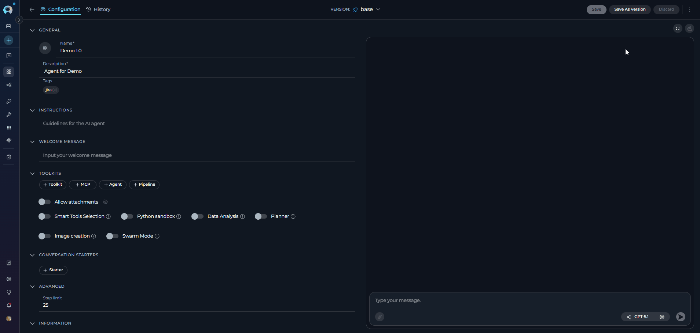
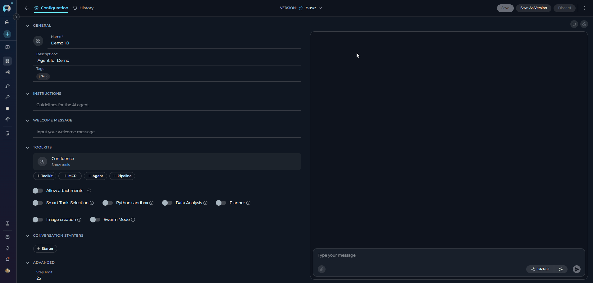
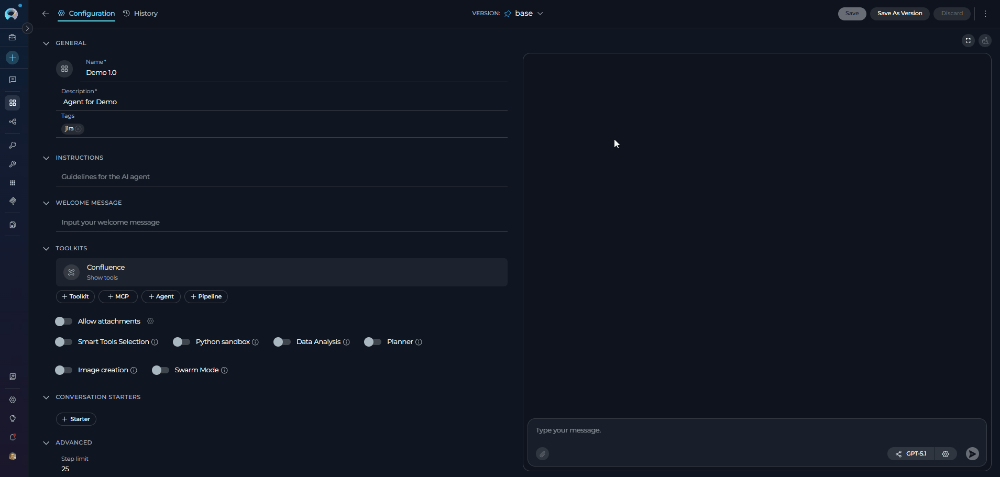
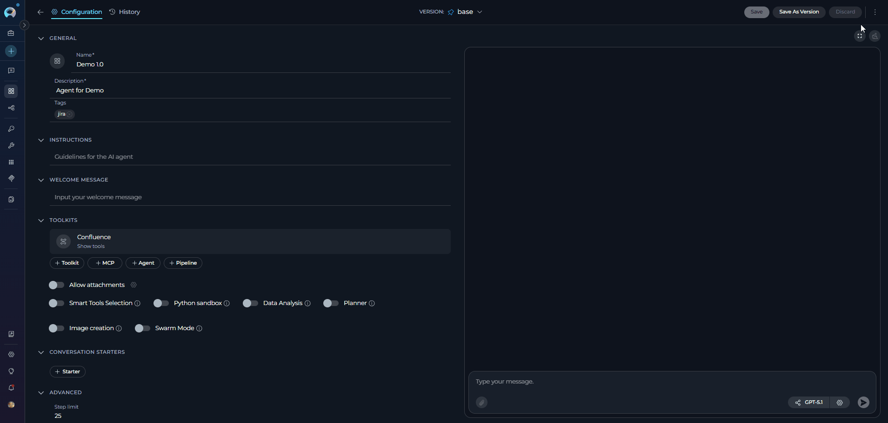
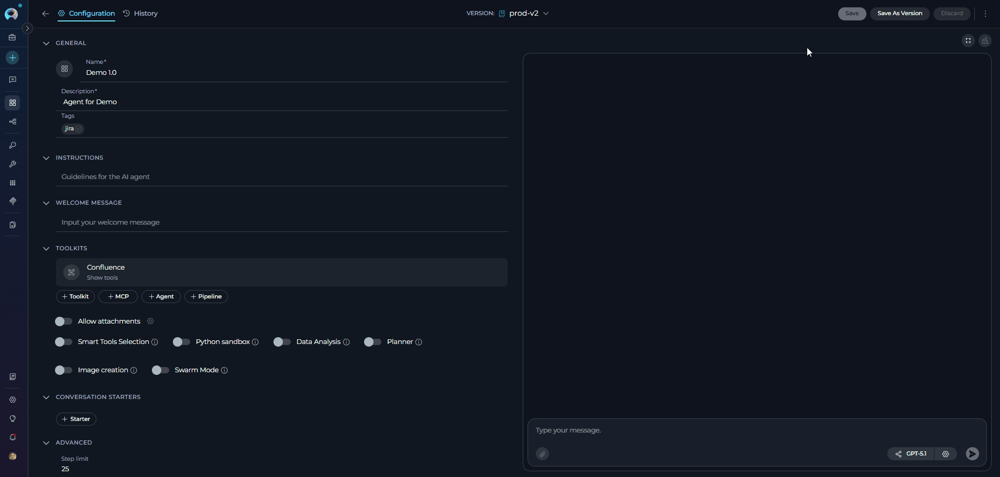
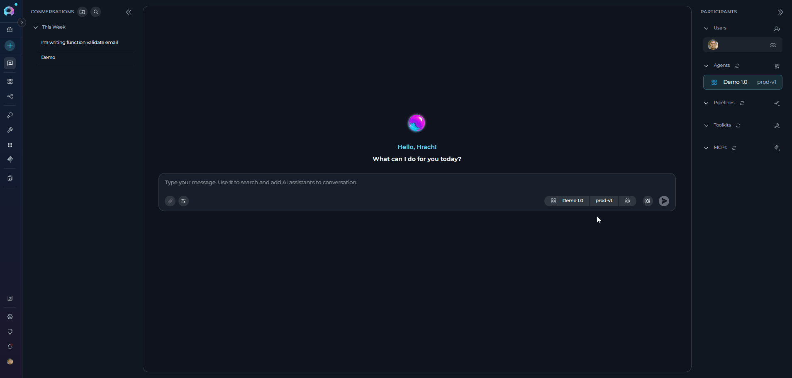
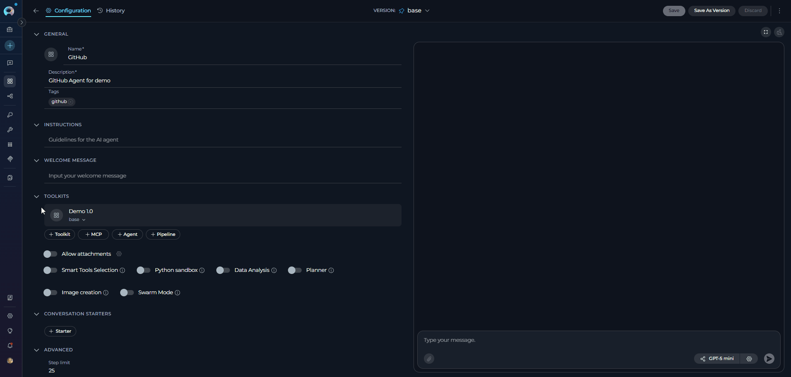
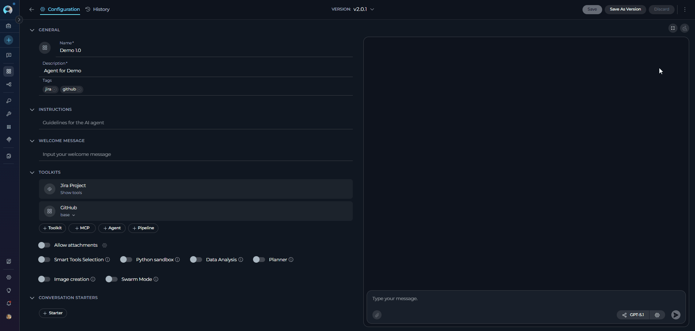

# Agent and Pipeline Versioning

## Overview

Entity versioning (for agents and pipelines) in ELITEA allows you to create, manage, and track different iterations of your agents. This feature enables you to maintain multiple versions of an agent while preserving the ability to revert to previous configurations, compare changes, and publish specific versions.

**Key Concepts**

* **Base Version**: The initial version created when you first save an agent, automatically named "base". This version can be continuously updated and saved without creating new versions.
* **Named Versions**: Specific snapshots of your agent configuration that are saved with custom names for easy identification and management. Named versions can also be edited and saved independently when selected.
* **Default Version**: A designated version that is automatically used when the agent is added to conversations, other agents, pipelines, or as an MCP toolkit. The default version is marked with a pin icon in the version dropdown.
* **Version History**: A complete record of all versions created for an agent, including creation dates, status, and author information.

## Creating and Managing Agent Versions

!!! info "Version Naming Rules"
    When creating or publishing versions, the following naming constraints apply:

    * **Allowed Characters**: Only alphanumeric characters (a-z, A-Z, 0-9), hyphens (`-`), and underscores (`_`)
    * **Maximum Length**: 20 characters
    * **Reserved Name**: `base` is automatically assigned to the initial working version and cannot be used as a custom version name
    * **Uniqueness**: Version names must be unique within an Agent or Pipeline
    * **No Spaces**: Spaces are not allowed in version names

### Initial Save ("Base" Version)

1. **Create Your Agent**: Configure instructions, tools, settings, and other parameters.
2. **Click Save**: This creates the initial "base" version of your agent.
3. **Continue Editing**: You can modify and save changes to the initial "base" version 

### Creating New Versions

When you want to preserve a specific configuration:

1. **Click "Save As Version"** button in the top toolbar
2. **Enter Version Name**: Provide a descriptive name for your version
       * Keep names under 20 characters
       * Only alphanumeric characters, hyphens (`-`), and underscores (`_`) are allowed
       * Use clear, descriptive names (e.g., "prod-v1", "beta-test")
3. **Click Save**: The new version is created and becomes the current active version. The system automatically navigates to the newly created version, updates the version dropdown to show the new version, and updates the URL to reflect the new version ID. You can immediately continue editing the new version or switch to another version.

!!! warning "Warning"
      Version names must be unique within the agent. The system will prevent duplicate names.

### Version Selection and Navigation

**Using the Version Dropdown**:

  *  Located in the top toolbar next to the agent name
  *  Shows all available versions with creation dates and version information (version ID and name, creation date and time, author information in public projects, and default version indicator with pin icon)
  *  Click any version to switch and view its configuration. When you switch, the system loads the selected version's complete configuration, updates the URL to include the new version ID, updates all form fields to show the selected version's data, and updates the breadcrumb navigation. Any unsaved changes in the previous version are preserved (you'll see them if you switch back).
  *  Versions are sorted with default version first, then published versions, then draft versions by creation date (newest first), with "base" at the bottom:

**Version Sorting Order:**

1. **Default Version** (if set) appears at the top with a pin icon
2. **Published Versions** sorted by creation date (newest first)
3. **Draft Versions** sorted by creation date (newest first)

### Editing and Saving Changes

* All versions (including "base" and named versions) are editable. Click **Save** to persist changes to the version that is currently selected.
* To branch off without modifying the current version, use **Save As Version** to create a new version instead of overwriting the selected one.

!!! info "Save Behavior"
    Saving applies to the currently selected version. If you switch to a named version, any edits you make and save will update that named version.

## Default Version Management

### What is a Default Version?

The default version is a special designation that determines which version of your agent is automatically used in various contexts. When you set a version as default, it becomes the version that is automatically selected when:

* Adding the agent to new conversations
* Adding the agent to existing conversations
* Using the agent as a toolkit in other agents or pipelines
* Accessing the agent as an MCP (Model Context Protocol) toolkit

!!! tip "Benefits of Setting a Default Version"
    * **Consistency**: Ensures all integrations use the same stable version
    * **Production Control**: Allows you to continue development in "base" while users interact with a stable default version
    * **Easy Updates**: Change the default version to roll out updates to all integrations simultaneously
    * **Version Management**: Clearly identify which version is in active production use

### How to Set a Default Version

There are two ways to set a version as default:

**Option 1: Using the Version Dropdown**

1. Click the **version dropdown** in the top toolbar
2. Find the version you want to set as default
3. Click the **pin icon** (📌) next to the version name
4. Review the confirmation dialog explaining the impact
5. Click **"Set as a default"** to confirm

**Option 2: Using the Three-Dot Menu**

1. Navigate to the version you want to designate as default
2. Click the **three-dot menu** (⋮) in the toolbar
3. Select **"Set as default"**
4. Review the confirmation dialog explaining the impact
5. Click **"Set as a default"** to confirm

The default version will now be marked with a pin icon (📌) in the version dropdown and will appear at the top of the version list.

!!! info "Default Version Behavior"
    * **Automatic Selection**: The default version is automatically used in all new integrations
    * **Version Dropdown Priority**: Always appears at the top of the version list with a pin icon
    * **Deletion Protection**: Cannot be deleted until a different version is set as default
    * **Status Restriction**: Only Draft versions can be set as default (published versions cannot be set as default)
    * **Implicit Default**: If no default version is explicitly set, "base" serves as the implicit default

## Publishing Versions

!!! note "Agent-Only Feature"
    Publishing and unpublishing are only available for Agents. Pipelines do not have publish functionality.

**How to Publish**

1. **Select a Draft Version**: You can only publish versions with Draft status
2. **Click "Publish"** button in the toolbar (requires publish permission)
3. **Enter Version Name**: A dialog appears asking you to provide a name for the published version
4. **System creates new version**  and submits it for review
5. **Submit for Review**: The version goes to the moderation queue

!!! info "Publishing Process"
    * **Permission Required**: You must have `applications.publish` permission
    * **Version Creation**: Publishing creates a new version with your specified name, then submits that version for moderation
    * **Moderation Review**: All published versions require moderator approval
    * **If Approved**: Version status changes to Published and becomes publicly available
    * **If Rejected**: You receive feedback and can resubmit after modifications

**Unpublishing**

To remove a published version from public availability:

1. Select the published version
2. Click "Unpublish" button in the toolbar
3. Confirm the action
4. Version status returns to Draft

## Using Versions in Conversations and Nested Agents

**Version Selection in Conversations**

When you add an agent to a conversation:

* The **default version** (if set) is automatically selected
* If no default version is set, the **"base" version** is used
* You can switch to a different version at any time during the conversation using the version dropdown in the chat interface
* Each conversation maintains its own version selection independently

**Version Selection in Nested Agents/Pipelines**

When adding an agent as a toolkit in another agent or pipeline:

* The **default version** (if set) is automatically selected during the initial setup
* If no default version is set, the **"base" version** is used
* You can manually select a specific version from the version dropdown when configuring the toolkit
* The selected version is saved with the parent agent/pipeline configuration
* Changing the default version in the source agent does **not** automatically update nested references - you must manually update the version selection in each parent agent/pipeline

!!! tip "Version Management in Nested Structures"
    When using agents as toolkits:
    
    - Set a stable version as default before adding to other agents/pipelines
    - Document which version is being used in nested structures
    - Update nested references manually when rolling out new versions
    - Test thoroughly after changing versions in nested agents

## Deleting Versions

**How to Delete a Version**

The deletion process depends on whether the version is being used by other agents or pipelines:

**Option 1: Version NOT in Use**

1. Select the version you want to delete
2. Click "Delete Version" button
3. Confirm deletion in the dialog
4. The version is deleted and you're redirected to the default version (if set) or "base" version

**Option 2: Version IS in Use**

1. Select the version you want to delete
2. Click "Delete Version" button
3. Version Replacement modal appears showing:
       * List of all agents/pipelines currently using this version
       * Count of affected entities
4. Select a replacement version from the dropdown (defaults to default version or "base")
5. Confirm deletion
6. The system will:
       * Delete the selected version
       * Automatically update all references to use the replacement version
       * Show success message with count of updated references
7. You're redirected to the default version (if set) or "base" version

!!! info "Deletion Restrictions"
    - The "base" version cannot be deleted
    - The default version cannot be deleted - set a different version as default first
    - When a version is in use, all references are automatically updated to your chosen replacement version

## Best Practices

??? tip "Version Naming Conventions"
    * **Use Semantic Versioning**: `v1.0`, `v1.1`, `v2.0`
    * **Include Purpose**: `production-release`, `beta-test`, `hotfix-001`
    * **Date-based**: `2024-01-15-release`, `jan-2024-update`
    * **Feature-based**: `enhanced-search`, `multi-lang-support`

??? tip "Version Management Strategy"
    1. **Keep "base" for Development**: Use for ongoing work and experimentation
    2. **Create Named Versions for Milestones**: Save stable configurations
    3. **Set a Default Version**: Designate your most stable version as default for production use
    4. **Publish Tested Versions**: Only submit well-tested versions for publication
    5. **Document Changes**: Use descriptive names that indicate what changed

??? tip "Workflow Recommendations"
    **Development Workflow**:
    
    1. Work on changes in "base" version
    2. Test thoroughly in Chat interface
    3. Create named version when stable (e.g., "v1.0")
    4. Set the stable version as default for production use
    5. Continue development in "base"
    6. When ready for next release, create new named version (e.g., "v1.1")
    7. Test the new version
    8. Update default version to roll out changes to all users
    
    **Team Collaboration**:
    
    * Create versions before major changes
    * Use consistent naming conventions
    * Set clear default versions for production
    * Document version purposes and changes
    * Test versions before setting as default or publishing
    * Communicate default version changes to team members

## Troubleshooting

??? warning "Cannot Delete Version"
    * Ensure you're not trying to delete the "base" version (base cannot be deleted)
    * Cannot delete the default version - set a different version as default first
    * Check that you have proper delete permissions
    * If version is in use by other agents/pipelines, you must select a replacement version

??? warning "Version Name Validation Errors"
    * Version names must be 20 characters or less
    * Only alphanumeric characters, hyphens (`-`), and underscores (`_`) are allowed
    * Version name must be unique within the agent/pipeline
    * Cannot use "base" as a version name (reserved)

??? warning "Version Not Found"
    * Refresh the page to reload version list
    * Check if version was deleted by another user
    * Verify project permissions

??? warning "Publishing Issues"
    * Ensure you have `applications.publish` permission
    * Only Draft status versions can be published
    * Version must belong to an Agent (Pipelines cannot be published)
    * Ensure all required fields are completed
    * Check that tools are properly configured
    * Verify model settings are valid

---

!!! info "Additional Resources"
     - [Agents](../../menus/agents.md) - Complete guide to creating and configuring agents
     - [Pipelines](../../menus/pipelines.md) - Learn how to build and manage pipelines
     - [ELITEA Glossary](../../home/glossary.md) - Definitions of key terms and concepts