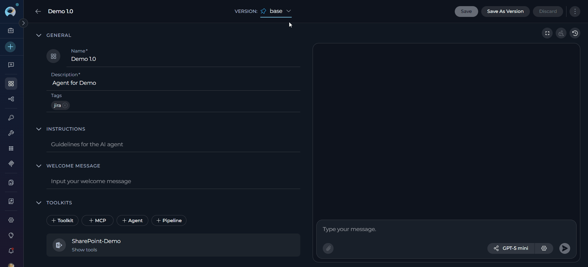
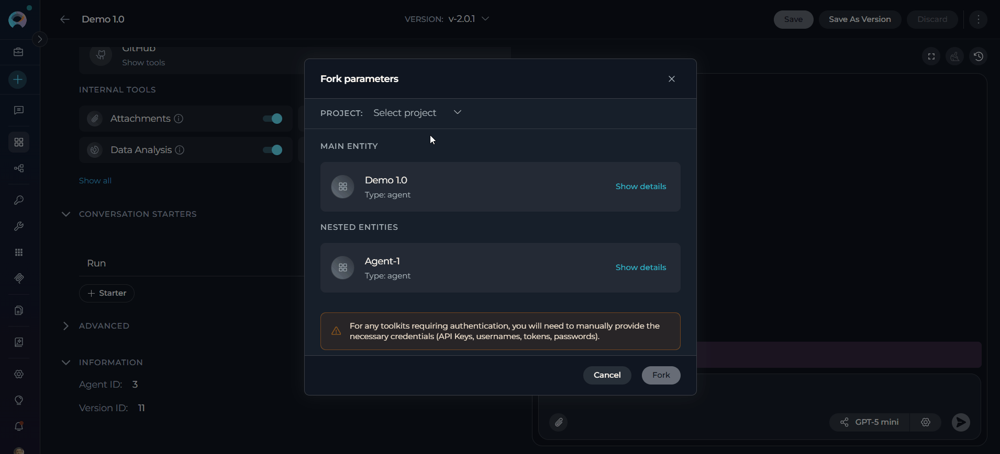
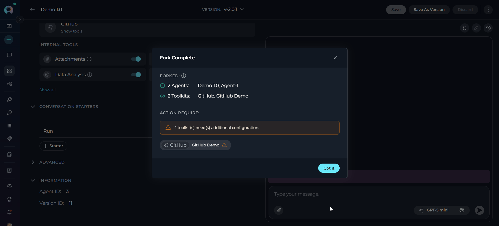
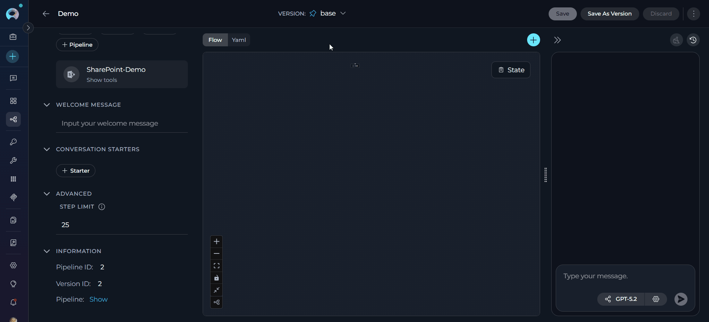
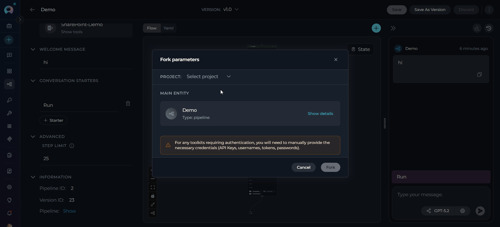
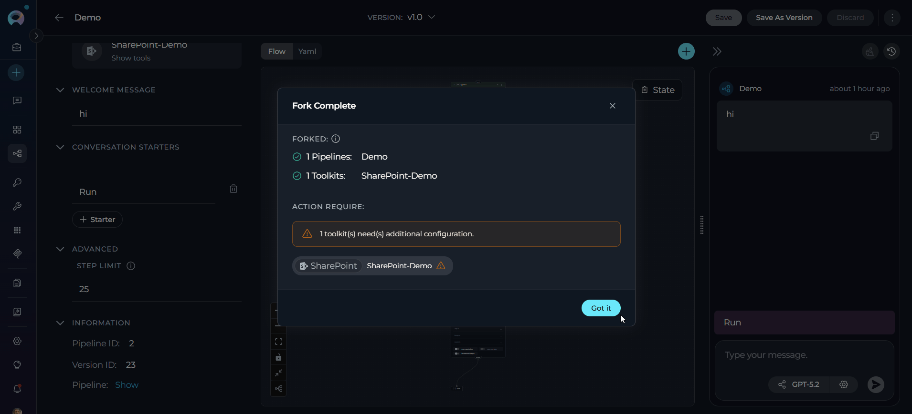

# Fork Agents and Pipelines

## Introduction

ELITEA provides a **Forking** functionality that allows you to copy agents and pipelines between projects within the same ELITEA environment. Use forking to reuse, share, or migrate your work without the need to download and upload files.

The Forking feature supports:

- **Specific version only** — Only the **currently selected version** of the agent or pipeline is forked
- **Individual agents and pipelines** — Fork a single entity to any project you have access to
- **Nested dependencies** — Agents referencing other agents are automatically included
- **In-place project transfer** — No file downloads required; the operation is fully integrated in the UI

!!! note "Version Scope"
    The Fork Wizard forks only the **currently selected version** of the agent ar pipeline. There is no option to select multiple versions during forking.

---

## Forking Agents

**Step 1: Initiate Fork**

1. Navigate to the **Agents** menu within the project containing the agent you want to fork
2. Open the agent detail page
3. Select the version you want to fork using the version selector
4. Click the **three-dot menu (⋮)** in the toolbar
5. Select **Fork** from the dropdown menu
6. The **Fork parameters** wizard opens

     

**Step 2: Select Project and Review Configuration**

The Fork Wizard opens as a modal dialog titled **"Fork parameters"**. It displays in a single-column layout:

1. **Select a Target Project:**
      - At the top of the modal, click the **Project** dropdown (placeholder: **"Select project"**)
      - No project is pre-selected; you must choose a target project manually
      - You must have the appropriate fork permission in the target project

2. **Review Entity Cards:** The wizard displays a **Main entity** card for the agent being forked, and a **Nested entities** section for any dependent agents that will be forked automatically
      - Click **Show details** on any card to expand its full configuration
      - Expanded details include: Description, Instructions, Toolkits and their tools, Welcome message, Conversation starters, Internal tools, and Step limit

     

    !!! note "Model Settings & Credentials"
        - **Model Settings:** The original model is preserved if it is available in the destination project. If the model is not available, the system falls back to the first model in the list. Review and adjust model settings after the fork if needed.
        - **Credentials:** For any toolkits requiring authentication, you will need to manually provide the necessary credentials (API Keys, usernames, tokens, passwords) after the fork.

**Step 3: Fork**

- **Click Fork** at the bottom of the modal. Upon a successful operation, the modal transitions to a **Fork Complete** screen.
- Click **Got it** to dismiss the modal and navigate directly to the forked agent in the target project.

     

!!! note "Forking Agents with Nested Dependencies"
    When the agent you are forking uses other agents as toolkits (a "master agent" pattern), ELITEA automatically identifies and includes all nested agents in the fork operation.

    - All nested agents are copied to the **same target project** as the master agent.
    - Connections and configurations between the master agent and its nested agents are preserved.
    - You can review each nested entity card in the Fork Wizard before proceeding.
    - Authentication credentials for each toolkit must be reconfigured manually in the target project.
    - If entities with the same names already exist in the target project, you may encounter duplicate-detection warnings.

---

## Forking Pipelines

**Step 1: Initiate Fork**

1. Navigate to the **Pipelines** menu within the project containing the pipeline you want to fork
2. Open the pipeline detail page
3. Select the version you want to fork using the version selector
4. Click the **three-dot menu (⋮)** in the toolbar
5. Select **Fork** from the dropdown menu
6. The **Fork parameters** wizard opens

     

**Step 2: Select Project and Review Configuration**

The Fork Wizard opens as a modal dialog titled **"Fork parameters"**. It displays in a single-column layout:

1. **Select a Target Project:**
      - At the top of the modal, click the **Project** dropdown (placeholder: **"Select project"**)
      - No project is pre-selected; you must choose a target project manually

2. **Review the Entity Card:** The wizard displays the pipeline as a card showing its name and type
      - Click **Show details** to expand the full configuration
      - Expanded details include: Description, a live **Pipeline Diagram** (Mermaid, with fullscreen view option), Toolkits and their tools, Welcome message, Conversation starters, and Step limit

     

    !!! note "Model Settings & Credentials"
        - **Model Settings:** The original model is preserved if it is available in the destination project. If the model is not available, the system falls back to the first model in the list. Review and adjust model settings after the fork if needed.
        - **Credentials:** For any toolkits requiring authentication, you will need to manually provide the necessary credentials (API Keys, usernames, tokens, passwords) after the fork.

**Step 3: Fork**

- **Click Fork** at the bottom of the modal. Upon a successful operation, the modal transitions to a **Fork Complete** screen.
- Click **Got it** to dismiss the modal and navigate directly to the forked pipeline in the target project.

     

---

## Best Practices

??? tip "When to Fork vs. Export/Import"
    Use **Forking** when transferring entities between projects within the **same ELITEA environment** — it is faster and fully integrated.
    
    Use **Export/Import** when you need to:
    
    - Transfer entities between **different ELITEA environments**
    - Create **backups** of your entities as downloadable files
    - Create **duplicates within the same project** (forking to the same project is not supported)
    - Share entities with users who do not have access to your environment

??? tip "Version Selection"
    - Only the **currently selected (viewed) version** of the agent or pipeline is forked — there is no multi-version selector in the Fork Wizard.
    - To fork a specific version, navigate to that version **before** opening the Fork Wizard.
    - It is strongly recommended to fork the **latest** version. Forking a non-latest version may cause validation errors or result in the latest version being cloned from the selected version.

??? tip "Pre-Fork Checks"
    - Verify the destination project has the required toolkits configured
    - Ensure the necessary LLM and embedding models are available in the target project
    - Confirm you have fork permissions in the target project

??? tip "Post-Fork Configuration"
    - Reconfigure all toolkit credentials in the forked entity
    - Test the forked agent or pipeline in the target project
    - Verify that nested dependencies function correctly

??? tip "Project Organization"
    - Fork related entities together to preserve workflow integrity
    - Maintain consistent naming conventions across projects
    - Group forked entities by functionality or team

---

## Troubleshooting

??? warning "Issue: Fork Button Not Visible or Disabled"
    **Possible Causes:**
    
    - You do not have the fork permission in the current project
    - The Fork Wizard is already open in another tab or session

    **Solution:**
    
    - Contact your project administrator to grant fork permissions
    - Close any existing wizard dialogs before initiating a new fork

??? warning "Issue: No Projects Available in the Project Dropdown"
    **Cause:** You do not have access to any other project within the same ELITEA environment, or there are no other projects to fork into.
    
    **Solution:**
    
    - Request access to the target project from your administrator
    - Use Export and Import to move the entity to a different ELITEA environment

??? warning "Issue: Forking Is Not Allowed on the Selected Project"
    **Cause:** Your account lacks the fork permission in the selected destination project.
    
    **Solution:**
    
    - Select a different destination project where you have the required permissions
    - Request the fork permission from the target project's administrator

??? warning "Issue: Some Items Have Already Existed"
    **Cause:** An entity with the same internal object ID already exists in the target project. ELITEA prevents duplicate forks of the same entity to the same project.
    
    **Solution:**
    
    - Use the link provided in the wizard to navigate to the existing entity
    - Use **Export and Import** if you need to create an additional copy within the same project

??? warning "Issue: Model Not Available After Fork"
    **Cause:** The model used by the original entity does not exist in the destination project.
    
    **Solution:**
    
    - The system will remap models automatically; verify the remapping in **Show details** before confirming
    - Add the required model configuration to the destination project first, then re-fork

??? warning "Issue: Toolkit Credentials Missing After Fork"
    **Cause:** Authentication credentials are intentionally excluded from the fork for security reasons.
    
    **Solution:**
    
    - Open the forked entity in the target project
    - Navigate to each toolkit and reconfigure the required credentials (API Keys, usernames, tokens, passwords)
    - Test the entity to confirm all toolkits are operational

??? warning "Issue: Nested Agent Not Forked"
    **Possible Causes:**
    
    - The nested agent belongs to a project you do not have access to
    - A permissions issue prevented the nested agent from being copied
    
    **Solution:**
    
    - Verify you have access to all projects involved in the master agent's toolkit chain
    - Fork each nested agent individually to the target project, then re-fork the master agent

---

!!! related "Additional Resources"
    - **[Import/Export](import-export.md):** Transfer entities between different ELITEA environments
    - **[Entity Versioning](entity-versioning.md):** Learn about version management
    - **[Agents Menu](../../menus/agents.md):** Complete agents documentation
    - **[Pipelines Menu](../../menus/pipelines.md):** Complete pipelines documentation
    - **[Toolkits Menu](../../menus/toolkits.md):** Complete toolkits documentation
    - **[Credentials Menu](../../menus/credentials.md):** Configure authentication credentials for toolkits
---
