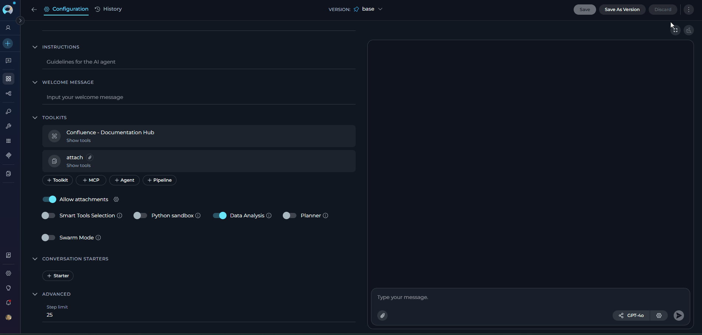
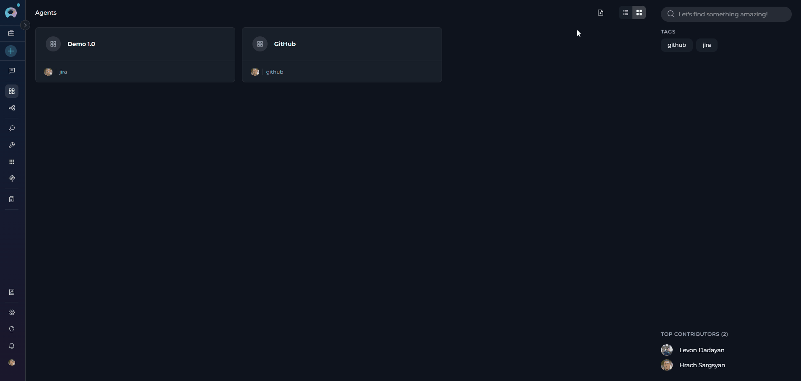
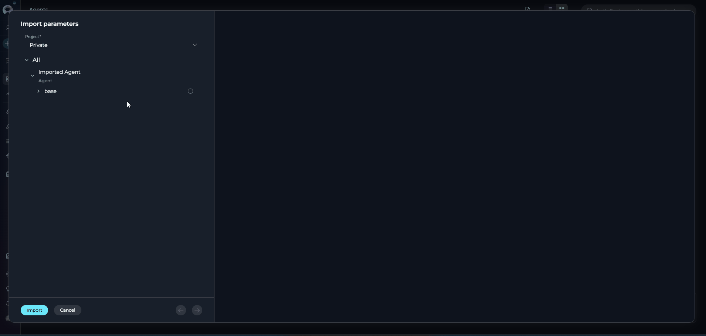
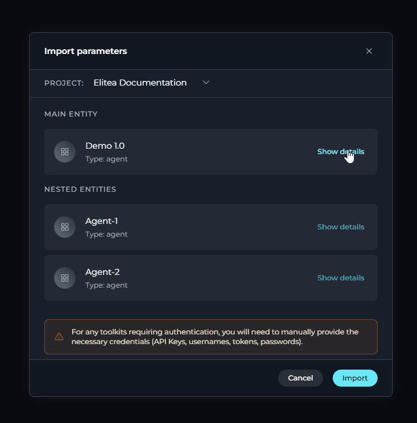
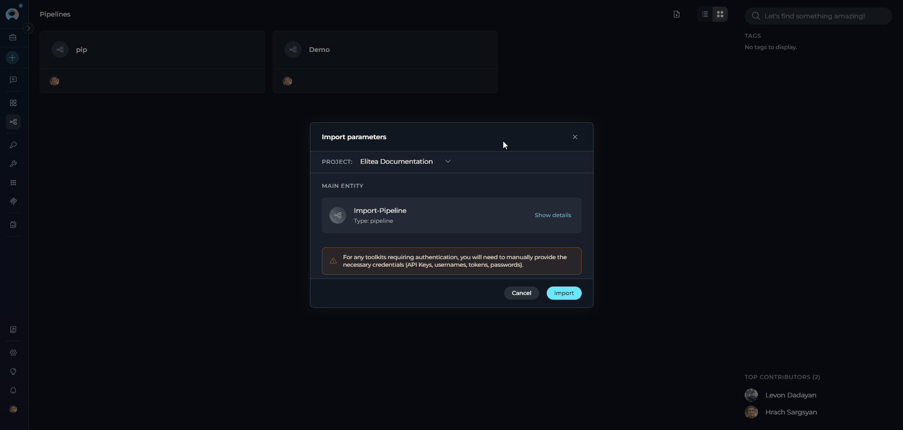

# Import/Export Agents and Pipelines

## Introduction

ELITEA provides Import and Export functionality that allows you to backup, migrate, share, and version-control your agents and pipelines. You can export agents and pipelines in Markdown (`.md`) or ZIP format, then import them into other projects or share them with team members.

The Import/Export feature supports:

- **Individual agents and pipelines** - Export single entities
- **Nested dependencies** - Agents referencing other agents
- **Multiple file formats** - `.md` for single entities, `.zip` for multi-entity exports

---

## Export Functionality

### Exporting an Agent or Pipeline

1. **Navigate to the Entity:**
      - Go to the **Agents** menu (or **Pipelines** menu for pipelines)
      - Open the specific agent or pipeline you want to export

2. **Initiate Export:**
      - Click the **three-dot menu (⋮)** in the toolbar
      - Select **Export** from the dropdown menu
      - The file will automatically download to your local device

3. **File Format:**
      - Agents and pipelines are exported as **Markdown (`.md`)** files
      - Each file contains YAML frontmatter with configuration and Markdown body with instructions



!!! note "Exporting Agents with Nested Dependencies"
    When you export an agent or pipeline that contains nested agents (agents referencing other agents), the system automatically includes all dependencies in the export:
    
    - If the agent has **nested dependencies**, the export will be a **ZIP file** containing multiple `.md` files (one for the main agent and one for each nested dependency)
    - If the agent has **no nested dependencies**, the export will be a single **`.md` file**
    
    The system automatically detects and packages all required dependencies to ensure a complete export.

!!! example "Export File Structure (Markdown Format)"
    The exported `.md` file includes the **selected version** of the agent or pipeline:

    ```markdown
    ---
    name: Demo
    description: Demo
    model: gpt-4o-2024-11-20
    temperature: 0.2
    max_tokens: 2048
    agent_type: openai
    step_limit: 25
    internal_tools:
    - data_analysis
    toolkits:
    - toolkit: attach
      type: artifact
      settings:
        bucket: attach
        embedding_model: text-embedding-3-small
        pgvector_configuration:
          private: false
          alita_title: elitea-pgvector
          configuration_type: pgvector
      tools:
      - index_data
      - search_index
      - stepback_search_index
      - stepback_summary_index
      - appendData
      - overwriteData
      - createNewBucket
    - toolkit: Confluence - Documentation Hub
      type: confluence
      settings:
        cloud: true
        limit: 5
        space: DOCS
        labels: null
        max_pages: 10
        custom_headers: {}
        embedding_model: text-embedding-3-small
        max_retry_seconds: 60
        min_retry_seconds: 10
        number_of_retries: 2
        pgvector_configuration:
          private: false
          alita_title: elitea-pgvector
          configuration_type: pgvector
        confluence_configuration:
          private: true
          alita_title: confluenceepam
      tools:
      - index_data
      - search_index
      - stepback_search_index
      - stepback_summary_index
      - remove_index
      - execute_generic_confluence
      - get_page_id_by_title
      - get_page_attachments
      - delete_page
    ---

    # Agent Instructions

    Your instructions for the agent go here in Markdown format.
    ```


!!! warning "Security Note"
    Authentication credentials and API keys for toolkits are **NOT** included in exports. You must reconfigure these during import.

---

## Import Functionality

ELITEA allows you to import agents and pipelines from exported files. Agents support both single-entity and multi-entity imports, while pipelines use single-entity imports.

!!! warning "Credentials Configuration Required"
    After importing agents or pipelines, you must manually reconfigure authentication credentials for all toolkits. Credentials are **NOT** included in exports for security reasons. Ensure you have the necessary API keys, tokens, and connection details ready before testing imported entities.
    
    **What Gets Imported:**
    
    1. Toolkit type and name are imported
    2. Selected tools are preserved
    3. Settings are imported
---

### Importing Agents

Agents can be imported individually from `.md` files or in bulk from `.zip` files with automatic dependency resolution.

#### Importing Agent from .md File (Single Entity)

Use `.md` file import when you want to import a single agent.

**Step 1: Select .md File**

1. Navigate to **Agents** menu
2. Click the **Import** button in the toolbar
3. Select the `.md` file from the file dialog
4. The file is parsed and the Import Wizard opens



!!! note "Import Wizard Interface"
    The Import Wizard displays in a modal dialog with two panels:

    **Left Panel - Entity Tree:**
    
    - Shows the agent found in the import file
    - Displays agent name, type, and version
    - Checkbox selection for the agent
    - Project selector dropdown

    **Right Panel - Configuration:**
    
    - Shows detailed configuration for the agent
    - Displays model settings
    - Shows toolkit configurations
    - Allows model selection/remapping

**Step 2: Select Project and Review Configuration**

1. **Select Project Destination:**
       - At the top of the left panel, find the **Project** selector
       - Click the dropdown to select destination project
       - You must have appropriate permissions in the target project

2. **Review Configuration:** Check the agent details in the left panel and review LLM settings,toolkits, tools, and parameters in the right panel(credentials will need to be reconfigured after import)

3. **Model Remapping:** The system automatically detects and matches models. If the exact model isn't available, select an alternative from the dropdown (grouped by type: GPT-4, Claude, etc.)


**Step 3: Import**

   - **Click Import:** Located at the bottom of the left panel. The button is disabled if no project is selected or permissions are missing. Upon successful import, a notification appears and the imported agent and its associated toolkits become available in the Agents and Toolkits dashboards.

   

---

#### Importing Agents from .zip File (Multiple Entities)

Use `.zip` file import when you want to import multiple agents with dependencies (nested agents).

**Step 1: Select .zip File**

1. Navigate to **Agents** menu
2. Click the **Import** button in the toolbar
3. Select a `.zip` file from the file dialog
4. All `.md` files in the ZIP are extracted and parsed
5. The Import Wizard opens showing all agents


**Step 2: Select Project and Review Configuration**

1. **Select Project Destination:**
      - At the top of the left panel, find the **Project** selector
      - Click the dropdown to select destination project
      - You must have appropriate permissions in the target project

2. **Select Entities and Versions:**
      - Check/uncheck boxes next to agents and versions you want to import
      - All entities and versions are selected by default

3. **Review Configuration:** Click on an agent in the left panel to view its detailed configuration in the right panel

4. **Model Remapping:** The system automatically detects and matches models. If the exact model isn't available, select an alternative from the dropdown (grouped by type: GPT-4, Claude, etc.)

**Step 3: Import**

   - **Click Import:** Located at the bottom of the left panel. The button is disabled if no project is selected or permissions are missing. Upon successful import, a notification appears and the imported agent and its associated toolkits and nested agents become available in the Agents and Toolkits dashboards.





!!! note "ZIP File Structure:"
    ZIP files can contain multiple `.md` files representing different agents:

---

### Importing Pipelines

Pipelines are imported from `.md` or `.zip` files. Each pipeline export contains a single entity.


**Step 1: Select Import File**

1. Navigate to **Pipelines** menu
2. Click the **Import** button in the toolbar
3. Select the `.md` or `.zip` file from the file dialog
4. The file is parsed and the Import Wizard opens


**Step 2: Select Project and Review Configuration**

1. **Select Project Destination:**
        - At the top of the left panel, find the **Project** selector
        - Click the dropdown to select destination project
        - You must have appropriate permissions in the target project

2. **Review Configuration:** Check the pipeline details in the left panel and review pipeline structure, nodes, and parameters in the right panel. You can also review  the pipeline flow diagram to understand the workflow

3. **Model Remapping:** The system automatically detects and matches models used in pipeline nodes. If the exact model isn't available, select an alternative from the dropdown (grouped by type: GPT-4, Claude, etc.)

**Step 3: Import**

   - **Click Import:** Located at the bottom of the left panel. The button is disabled if no project is selected or permissions are missing. Upon successful import, a notification appears and the imported pipeline becomes available in the Pipelines dashboard, with its associated toolkits accessible in the Toolkits dashboard.



---

## Best Practices

### Export Recommendations

??? tip "Version Control"
    - Export regularly to maintain backups
    - Use descriptive naming for easy identification

??? tip "Documentation"
    - Add clear descriptions to your agents and pipelines
    - Document dependencies and special requirements

??? tip "Security"
    - Store exports in secure locations
    - Review content before sharing with others

### Import Recommendations

??? tip "Pre-Import Checks"
    - Verify destination project has required toolkits
    - Ensure necessary models are available
    - Check you have appropriate permissions

??? tip "Selective Import"
    - Review all entities before importing
    - Deselect unnecessary toolkits

??? tip "Post-Import Configuration"
    - Reconfigure toolkit credentials
    - Test imported agents/pipelines
    - Verify nested dependencies work correctly

??? tip "Project Organization"
    - Import related entities together
    - Maintain consistent naming conventions
    - Group by functionality or team

---

## Troubleshooting

??? warning "Issue: Model Not Available"
    **Cause:** The model specified in the import file doesn't exist in destination project
    
    **Solution:** 
    - Select an alternative model from the dropdown
    - Add the required model configuration to the project first

??? warning "Issue: Missing Toolkit"
    **Cause:** Referenced toolkit not installed in destination project
    
    **Solution:**
    - Install the toolkit in the destination project first
    - Or deselect the entity referencing the unavailable toolkit

??? warning "Issue: Permission Denied"
    **Cause:** Insufficient permissions in destination project
    
    **Solution:**
    - Request appropriate permissions from project administrator
    - Import to a different project where you have permissions

??? warning "Issue: Invalid Import Format"
    **Cause:** The `.md` file doesn't have proper YAML frontmatter structure
    
    **Solution:**
    - Verify the file starts with `---`
    - Check YAML syntax is valid
    - Ensure closing `---` is present

??? warning "Issue: Import Button Disabled"
    **Possible Causes:**
    - No project selected
    - No entities selected for import
    - Missing permissions in destination project
    
    **Solution:**
    - Select a destination project from dropdown
    - Check at least one entity/version
    - Verify project permissions

??? warning "Issue: Failed to Parse MD File"
    **Possible Causes:**
    - Invalid YAML frontmatter
    - Missing closing `---` delimiters
    - Corrupted file encoding
    
    **Solution:**
    - Open file in text editor and verify format
    - Ensure UTF-8 encoding
    - Re-export from source if possible

??? warning "Issue: Nested Agent Not Found"
    **Possible Causes:**
    - Referenced agent not included in ZIP
    - Import UUID mismatch
    - Agent imported to different project
    
    **Solution:**
    - Include all dependent agents in same import
    - Verify all `.md` files are in ZIP
    - Import all entities to same project

??? warning "Issue: Toolkit Tools Not Available"
    **Possible Causes:**
    - Toolkit version mismatch
    - Tool deprecated or renamed
    - Toolkit not properly configured
    
    **Solution:**
    - Update toolkit to latest version
    - Review toolkit configuration
    - Select alternative tools if available

---
!!! related "Additional Resources"
    - **[Entity Versioning](entity-versioning.md):** Learn about version management
    - **[Credentials Menu](../../menus/credentials.md):** Configure authentication credentials for toolkits
    - **[Agents Menu](../../menus/agents.md):** Complete agents documentation
    - **[Pipelines Menu](../../menus/pipelines.md):** Complete pipelines documentation
---
