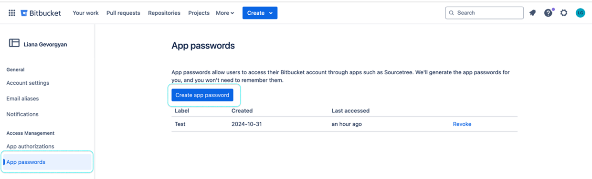
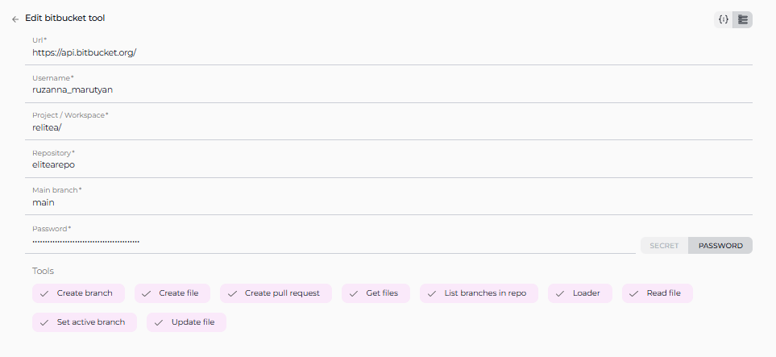

# ELITEA Toolkit Guide: Bitbucket Integration

## 1. Introduction

### 1.1 Purpose of the Guide

This guide is your comprehensive resource for setting up and utilizing the **Bitbucket toolkit** within ELITEA. It will walk you through each step, from initial Bitbucket account setup to integrating it seamlessly with ELITEA Agents.  This integration empowers you to automate code management tasks, streamline development workflows, and enhance collaboration directly within the ELITEA platform. By following this guide, you will be able to leverage the combined power of ELITEA and Bitbucket to boost your productivity and optimize your software development processes.

### 1.2 Brief Overview of Bitbucket

Bitbucket is a web-based version control repository hosting service owned by Atlassian, primarily used for source code and development projects that use either Git or Mercurial revision control systems. It offers professional teams a collaborative platform to plan projects, collaborate on code, test, and deploy, all in one place. Bitbucket is widely used by development teams for:

*   **Version Control:** Tracking changes to code over time, enabling easy rollback and collaboration.
*   **Code Collaboration:** Facilitating team-based code development through features like pull requests and code reviews.
*   **Branch Management:**  Organizing code development into branches for feature development, bug fixes, and releases.
*   **Workflow Automation:** Supporting automated workflows for building, testing, and deploying software.

Integrating Bitbucket with ELITEA allows you to bring these powerful code management capabilities directly into your AI-driven workflows, enabling agents to interact with your repositories, automate code-related tasks, and enhance your development lifecycle.

### 1.3 Target Audience

This guide is designed for a broad range of users, including:

*   **End-Users:** Developers, engineers, and project team members who will use ELITEA Agents with Bitbucket integration to automate code-related tasks and streamline their workflows.
*   **Administrators:** ELITEA administrators responsible for setting up and configuring toolkit integrations, ensuring seamless connectivity and security.
*   **Support Staff:** Support personnel who need to understand the Bitbucket integration to assist users with setup, troubleshooting, and best practices.

This guide assumes an **beginner level of technical understanding**, meaning users should have a basic familiarity with ELITEA and version control concepts, but advanced technical expertise is not required.

## 2. Account Setup and Initial Configuration in Bitbucket

Before integrating Bitbucket with ELITEA, you need to ensure you have a Bitbucket account and the necessary access permissions.

### 2.1 Account Creation

If you don't already have a Bitbucket account, follow these steps to create one:

1.  **Visit Bitbucket Website:** Go to the official Bitbucket website (e.g., [bitbucket.org](https://bitbucket.org)).
2.  **Sign Up:** Click on the **"Sign Up"** or **"Create Account"** button, usually located in the top right corner of the homepage.
3.  **Enter Details:** Fill in the required information on the signup form. This typically includes your email address, full name, and a secure password. **Note:** It is recommended to use your **company email address** for professional use cases.
4.  **Verify Email:** Check your inbox for a verification email from Bitbucket. Click on the confirmation link in the email to verify your email address and activate your account.
5.  **Log In:** Once your email is verified, log in to Bitbucket using your newly created credentials (email address and password).

### 2.2 Access Requirements

*   **Valid Company Email:**  In most enterprise settings, you will need a valid company email address to sign up for a Bitbucket account.
*   **Repository Access:** Ensure you have the necessary permissions to access the specific Bitbucket repositories you intend to integrate with ELITEA. This may involve being added as a member to the repository or having appropriate organizational permissions.
*   **Organizational Admin Approval (Potentially):** Depending on your organization's policies, you might require approval from your Bitbucket or organizational administrator to create integrations or grant access to external applications like ELITEA. Check with your internal IT or administration team if you encounter access restrictions.

### 2.3 Software-Specific Setup: Creating an App Password in Bitbucket

For secure integration with ELITEA, it's recommended to create an **App Password** within Bitbucket specifically for ELITEA's use. App passwords provide a more secure alternative to using your main Bitbucket account password directly in integrations.

**Steps to Create an App Password in Bitbucket:**

1.  **Log in to Bitbucket:** Access your Bitbucket account at [bitbucket.org](https://bitbucket.org).
2.  **Access Personal Settings:** Click on your profile avatar in the bottom left corner and select **"Personal settings"** from the dropdown menu.
3.  **Navigate to App Passwords:** In the left-hand navigation menu under "Security," click on **"App passwords"**.
4.  **Create App Password:** Click on the **"Create app password"** button.
5.  **Name the App Password:** In the "Label" field, enter a descriptive name for the app password, such as "ELITEA Integration" or "ELITEA Agent Access." This helps you identify the purpose of this app password later.
6.  **Define Permissions (Crucial for Security):** Carefully select the **permissions** you grant to this app password. **Grant only the minimum necessary permissions** required for your ELITEA Agent's intended interactions with Bitbucket.  For basic integration, you might need permissions like:
    *   **Repository: Read** (to allow ELITEA to read repository content, list branches, etc.)
    *   **Repository: Write** (if you want ELITEA to create files, branches, or pull requests)
    *   **Issues: Read** (if you want ELITEA to access and manage issues)
    *   **Pull requests: Write** (if you want ELITEA to create pull requests)
    *   **Wiki: Read** (if you want ELITEA to access wiki content)
    *   **Wiki: Write** (if you want ELITEA to modify wiki content)
    *   **Project: Read** (to list projects)
    *   **Account: Read** (to verify account details)

    **Important Security Practice:**  **Do not grant "Admin" or unnecessary permissions to the app password.** Limiting permissions reduces the potential security impact if the app password is ever compromised.
7.  **Create Password:** Click the **"Create"** button.
8.  **Securely Copy and Store the App Password:**  **Immediately copy the generated app password** that is displayed in the pop-up window. **This is the only time you will see the full app password.** Store it securely in a password manager or a safe location. You will need this app password to configure the Bitbucket toolkit in ELITEA.



## 3. System Integration with ELITEA

### 3.1 Overview and Usage of Bitbucket Integration with ELITEA

The Bitbucket toolkit integration in ELITEA provides a seamless bridge between your AI Agents and your Bitbucket repositories. This integration allows your Agents to:

*   **Access Code Repositories:** Directly interact with your Bitbucket repositories to retrieve code, documentation, and project information.
*   **Automate Code Management Tasks:** Automate tasks such as creating branches, listing files, reading file contents, creating pull requests, and managing issues directly through ELITEA Agents.
*   **Enhance Development Workflows:** Streamline development workflows by integrating AI-powered automation into your code management processes.
*   **Improve Collaboration:** Facilitate code collaboration by enabling agents to assist with pull request creation, commenting, and issue tracking.

### 3.2 Integration Steps: Configuring the Bitbucket Toolkit in ELITEA

To integrate Bitbucket with ELITEA and enable your Agents to interact with your repositories, follow these configuration steps within ELITEA:

1.  **Navigate to Agents Menu:** In ELITEA, go to the **Agents** menu and either **create a new Agent** or **edit an existing Agent** that you want to integrate with Bitbucket.
2.  **Access Toolkits Section:** Within the Agent configuration, scroll down to the **"Tools"** section.
3.  **Add Toolkit:** Click the **"+" icon** under the "TOOLS" section to add a new toolkit.
4.  **Select Bitbucket Toolkit:** From the dropdown list of available toolkits, choose **"Bitbucket"**. This will open the "New Bitbucket tool" configuration section.
5.  **Configure Bitbucket Toolkit Settings:**  Fill in the following configuration fields in the "New Bitbucket tool" section:

    *   **Name:**  Enter a descriptive **Name** for your Bitbucket toolkit instance. This name will be used to reference the toolkit within your Agent's instructions (e.g., "MyBitbucketRepo", "CodeRepoAccess").
    *   **Description:** Provide a brief **Description** of the toolkit's purpose or the specific Bitbucket repository it will access (e.g., "Access to Project Alpha code repository").
    *   **URL:** Enter your Bitbucket API URL. **Crucially, ensure you use the following format:** `https://api.bitbucket.org/` (This is the base URL for the Bitbucket API).
    *   **Username:** Enter your Bitbucket **Username**. This is the username associated with the Bitbucket account for which you created the App Password.

    

    *   **Repository:** Enter the **Repository name** that you want to access with this toolkit. Use the format: `repository_owner/repository_name` (e.g., `ProjectAlita/projectalita.github.io`).
    *   **Main branch:** Specify the **Main branch** of your repository, typically `main` or `master`.
    *   **Authentication Options - Password:** Select the **"Password"** authentication option.
        *   **Password/Secret:** Choose **"Password"** and then paste the **App Password** you generated in Bitbucket (during the "Software-Specific Setup" section of this guide) into the **"Password"** field.  **Important Security Note:** For enhanced security, consider using the **"Secret"** option instead and storing your App Password securely as a Secret within [Secrets](../../atform-documentation/menus/settings.md#secrets) feature.

    

6.  **Enable Desired Tools:** In the **"Tools"** section within the Bitbucket toolkit configuration, **check the boxes next to the specific Bitbucket tools** you want to enable for your Agent. Select only the tools that your Agent will actually need to use to minimize unnecessary permissions and maintain security. Available tools include:
    *   **Create pull request**
    *   **Create file**
    *   **Read file**
    *   **List branches in repo**
    *   **Set active branch**
    *   **Create branch**

7.  **Complete Setup:** Click the **arrow icon** (located at the top right of the toolkit configuration section) to complete the Bitbucket toolkit setup and return to the main Agent configuration menu.

### 3.3 Tool Overview: Bitbucket Toolkit Functionalities

Once the Bitbucket toolkit is configured and added to your Agent, you can leverage the following tools within your Agent's instructions to interact with your Bitbucket repositories:

*   **Create pull request:**  **Tool Name:** `create_pull_request`
    *   **Functionality:** Creates a new pull request in the specified Bitbucket repository.
    *   **Use Case:** Automate the creation of pull requests for code changes, feature branches, or bug fixes directly from within ELITEA workflows.
*   **Create file** **Tool Name:** `create_file`
    *   **Functionality:** Creates a new file in the specified Bitbucket repository.
    *   **Use Case:** Automate the creation of new code files, documentation files, or configuration files within your repository.
*   **Read file:** **Tool Name:** `read_file`
    *   **Functionality:** Reads the content of a file from the specified Bitbucket repository.
    *   **Use Case:** Retrieve code snippets, configuration files, or documentation content from your repository to provide context or data to your ELITEA Agent.
*   **List branches in repo:** **Tool Name:** `list_branches_in_repo`
    *   **Functionality:** Lists all branches available in the specified Bitbucket repository.
    *   **Use Case:** Get a list of branches for branch management tasks, reporting, or to provide users with branch options within ELITEA workflows.
*   **Set active branch:** **Tool Name:** `set_active_branch`
    *   **Functionality:** Sets a specific branch as the active branch in the specified Bitbucket repository for subsequent operations.
    *   **Use Case:** Switch the active branch for file operations or pull request creation within your ELITEA Agent workflows.
*   **Create branch:** **Tool Name:** `create_branch`
    *   **Functionality:** Creates a new branch in the specified Bitbucket repository.
    *   **Use Case:** Automate the creation of new branches for feature development, bug fixes, or experimental code changes directly from ELITEA.

## 4. Instructions and Prompts for Using the Bitbucket Toolkit

To effectively utilize the Bitbucket toolkit within your ELITEA Agents, you need to provide clear instructions within the Agent's "Instructions" field, telling the Agent *how* and *when* to use these tools.

**General Instruction Structure:**

When instructing your Agent to use a Bitbucket toolkit, you will typically follow this pattern:

```
Use the "[tool_name]" tool to [describe the action you want to perform]. 
Provide the following parameters:
- Parameter 1: <value or description of value>
- Parameter 2: <value or description of value>
- ...
```

**Example Agent Instructions for Bitbucket Toolkit Tools:**

*   **Agent Instructions for Creating a New Branch:**

    ```
    Use the "create_branch" tool to create a new branch in the repository.
    Provide the following parameters:
    - Repository Name: "your-bitbucket-username/your-repository-name"
    - New Branch Name: "feature-xyz"
    - Base Branch: "main"
    ```

*   **Agent Instructions for Listing Branches in a Repository:**

    ```
    Use the "list_branches_in_repo" tool to list all branches in the repository.
    Provide the following parameters:
    - Repository Name: "your-bitbucket-username/your-repository-name"
    ```

*   **Agent Instructions for Reading a File from a Repository:**

    ```
    Use the "read_file" tool to read the content of a file from the repository.
    Provide the following parameters:
    - Repository Name: "your-bitbucket-username/your-repository-name"
    - File Path: "path/to/your/file.txt"
    - Branch Name: "main"
    ```

**Important Considerations for Agent Instructions:**

*   **Tool Name Accuracy:** Ensure you use the correct **Tool Name** (e.g., `"create_pull_request"`) as listed in the "Tool Overview" section. Typos or incorrect tool names will prevent the Agent from using the tools correctly.
*   **Parameter Clarity:** Clearly specify the **parameters** required for each tool and provide instructions on where the Agent should obtain the values for these parameters (e.g., from user input, from previous steps in the workflow, or hardcoded values).
*   **Context and Examples:** Provide sufficient context and examples within your Agent's "Instructions" to guide the LLM in understanding *when* and *how* to use the Bitbucket toolkit's tools effectively within your desired workflow.

## 5. Best Practices and Use Cases for Bitbucket Integration

### 5.1 Best Practices for Efficient Integration

*   **Test Integration Regularly:**  After setting up the Bitbucket toolkit and incorporating it into your Agents, **thoroughly test the integration** to ensure it is functioning as expected. Test each tool you intend to use to verify connectivity, authentication, and correct execution of Bitbucket actions.
*   **Monitor Agent Performance:**  After deploying Agents with Bitbucket integration, **monitor their performance** regularly. Track metrics like task completion success rate, execution time, and error rates to identify any potential issues or areas for optimization in your Agent's instructions or toolkit configurations.
*   **Follow Security Best Practices:**
    *   **Use App Passwords:** Always use Bitbucket App Passwords instead of your main account password for integrations.
    *   **Grant Least Privilege:** Grant only the minimum necessary permissions to the App Password to limit potential security risks.
    *   **Securely Store Credentials:** Utilize ELITEA's Secrets Management feature to securely store and manage your Bitbucket App Passwords or tokens instead of hardcoding them directly in Agent configurations.
*   **Provide Clear Instructions and Prompts:**  Craft clear and unambiguous instructions within your ELITEA Agents to guide them in using the Bitbucket toolkit effectively. Use the prompt examples provided in this guide as a starting point and adapt them to your specific use cases.
*   **Start with Simple Use Cases:** Begin by implementing Bitbucket integration for simpler automation tasks and gradually progress to more complex workflows as you gain experience and confidence with the toolkit.

### 5.2 Use Cases for Bitbucket Toolkit Integration

The Bitbucket toolkit opens up a wide range of automation possibilities for your software development workflows within ELITEA. Here are some compelling use cases:

*   **Automated Branch Creation for New Features:**  Agents can automatically create new branches in your Bitbucket repository based on user requests or triggers within ELITEA workflows. This streamlines the branch management process for feature development.
*   **Code Snippet Retrieval for Contextual Assistance:** Agents can retrieve code snippets from your Bitbucket repository and provide them to users within ELITEA conversations, offering contextual code examples or documentation directly within the AI interaction.
*   **Automated Documentation Updates:** Agents can be configured to automatically update documentation files within your Bitbucket repository based on changes in code or project requirements, ensuring documentation stays synchronized with the latest codebase.
*   **Pull Request Automation for Code Reviews:** Agents can assist in the code review process by automatically creating pull requests for code changes submitted through ELITEA workflows. This can streamline the code review process and improve code quality.
*   **Issue Tracking and Management:** Agents can be used to create, update, and comment on issues in your Bitbucket issue tracker, automating issue management tasks and improving project tracking.
*   **Codebase Analysis and Reporting:** Agents can analyze code files within your Bitbucket repository to generate reports on code complexity, identify potential code quality issues, or extract specific information from the codebase.

**Example Use Case Table:**

| Tool                    | Use Case Example                                                                                                     | Benefit                                                                                                    |
| ----------------------- | -------------------------------------------------------------------------------------------------------------------- | ---------------------------------------------------------------------------------------------------------- |
| `Create pull request`   | Agent automatically creates a pull request when a developer completes a feature branch in ELITEA.                    | Streamlines code review process, reduces manual PR creation effort.                                        |
| `Create file`           | Agent generates a new documentation file based on user input and automatically commits it to the repository.         | Automates documentation creation, ensures documentation is up-to-date in the repository.                   |
| `Read file`             | Agent retrieves a specific code file to provide code examples or context to a user within a chat conversation.       | Provides users with quick access to code snippets directly within ELITEA, enhancing contextual assistance. |
| `List branches in repo` | Agent lists all branches in a repository to allow a user to select a target branch for a new feature or code change. | Simplifies branch selection and management within ELITEA workflows.                                        |
| `Set active branch`     | Agent automatically switches to a specific branch before performing file operations or pull request creation.        | Ensures operations are performed on the correct branch, reducing errors and improving workflow accuracy.   |
| `Create branch`         | Agent automatically creates a new feature branch based on a user request to start developing a new feature.          | Automates branch creation, speeding up the feature development workflow.                                   |

## 6. Integration Helpdesk/Common Issues and Key Terms

### 6.1 Troubleshooting Common Issues

*   **Connection Errors:**
    *   **Problem:** ELITEA Agent fails to connect to Bitbucket, resulting in errors during toolkit execution.
    *   **Possible Solutions:**
        *   **Verify Bitbucket URL:** Double-check that you have entered the correct Bitbucket API URL (`https://api.bitbucket.org/`) in the toolkit configuration.
        *   **Check Authentication:** Ensure that the Username and App Password (or Token) you provided are correct and valid for your Bitbucket account and repository.
        *   **Verify App Password Permissions:** Review the permissions granted to your Bitbucket App Password. Ensure it has the necessary permissions (Read, Write, etc.) for the Bitbucket tools you are trying to use in ELITEA.
        *   **Network Connectivity:** Confirm that both your ELITEA environment and your Bitbucket instance are connected to the internet and that there are no network connectivity issues blocking the integration.
        *   **Hosting Option:** Double-check that you have selected the correct "Hosting Option" (Cloud or Server) in the Confluence toolkit configuration, especially when connecting to Epam's Confluence (use "Server").
*   **Permission Denied Errors:**
    *   **Problem:** Agent execution fails with "Permission Denied" or "Unauthorized" errors when trying to access or modify Bitbucket resources.
    *   **Possible Solutions:**
        *   **Verify App Password Permissions:**  Double-check the permissions granted to your Bitbucket App Password. Ensure it has the necessary permissions (Read, Write, etc.) for the specific Bitbucket actions your Agent is trying to perform (e.g., creating a file, creating a pull request).
        *   **Repository Access:** Confirm that the Bitbucket account associated with the App Password has the required access to the specified repository. Verify that the account is a member of the repository and has the necessary roles or permissions.
*   **Incorrect Repository or Branch Names:**
    *   **Problem:** Agent tools fail to operate on the intended repository or branch.
    *   **Possible Solutions:**
        *   **Double-Check Repository Name:** Carefully verify that you have entered the correct Bitbucket Repository name in the toolkit configuration, using the format `repository_owner/repository_name`.
        *   **Verify Branch Name:** Ensure that you are using the correct branch name (e.g., `main`, `develop`, `feature-branch`) in your Agent's instructions when specifying branch-related parameters for Bitbucket tools.

### 6.2 FAQs

1.  **Q: Can I use my regular Bitbucket password for the ELITEA integration?**
    *   **A:** While technically possible, it is **strongly recommended to use a Bitbucket App Password** instead of your main account password for security reasons. App Passwords provide a more secure and controlled way to grant access to external applications like ELITEA.
2.  **Q: What permissions should I grant to the Bitbucket App Password?**
    *   **A:** Grant only the **minimum necessary permissions** required for your ELITEA Agent's intended interactions with Bitbucket. For basic integration, "Repository: Read" and "Repository: Write" permissions might be sufficient. Avoid granting "Admin" or unnecessary permissions.
3.  **Q: Can I integrate with both Cloud and Server hosted Bitbucket instances?**
    *   **A:** Yes, the ELITEA Bitbucket toolkit supports both **Cloud** and **Server** hosted Bitbucket instances. Ensure you select the correct "Hosting Option" (Cloud or Server) during toolkit configuration to match your Bitbucket setup.
4.  **Q: Why is my Agent getting "Permission Denied" errors even though I think I have configured everything correctly?**
    *   **A:** Double-check the permissions granted to your Bitbucket App Password. Ensure that the App Password has the specific permissions required for the Bitbucket tools your Agent is trying to use (e.g., "Write" permission for creating files or pull requests). Also, verify that the Bitbucket account associated with the App Password has the necessary access to the target repository.

### 6.3 Glossary of Key Terms

*   **API (Application Programming Interface):** A set of rules and specifications that allows different software systems to communicate and exchange data with each other.
*   **App Password:** A password specifically generated for application integrations in Bitbucket, providing a more secure alternative to using your main account password.
*   **Repository:** A storage location for code, files, and version history in Bitbucket (and other version control systems).
*   **Branch:** A parallel version of a repository, used for isolating code changes and feature development.
*   **Pull Request (PR):** A request to merge code changes from one branch into another, often used for code review and collaboration.
*   **Toolkit:** In ELITEA, a toolkit refers to an integration with an external service or platform (like Bitbucket, Jira, Confluence) that provides a set of pre-built tools and functionalities for Agents to use.

### 6.4 Support and Contact Information

If you encounter any issues, have questions, or require further assistance beyond what is covered in this guide regarding the Bitbucket integration or ELITEA Agents in general, please do not hesitate to contact our dedicated ELITEA Support Team. We are here to help you resolve any problems quickly and efficiently and ensure you have a smooth and productive experience with ELITEA.

**How to Reach ELITEA Support:**

*   **Email:**  **[SupportAlita@epam.com](mailto:SupportAlita@epam.com)**

**Best Practices for Effective Support Requests:**

To help us understand and resolve your issue as quickly as possible, please ensure you provide the following information in your support email:

*   **ELITEA Environment:** Clearly specify the ELITEA environment you are using (e.g., "Nexus," "Alita Lab," "EYE").
*   **Project Details:**  Indicate the **Project Name** and whether you are working in your **Private** workspace or a **Team** project.
*   **Detailed Issue Description:** Provide a clear, concise, and detailed description of the problem you are encountering. Explain what you were trying to do, what you expected to happen, and what actually occurred.
*   **Relevant Configuration Information:**  To help us diagnose the issue, please include relevant configuration details, such as:
    *   **Agent Instructions (Screenshot or Text):** If the issue is with an Agent, provide a screenshot or copy the text of your Agent's "Instructions" field.
    *   **Toolkit Configurations (Screenshots):** If the issue involves the Bitbucket toolkit or other toolkits, include screenshots of the toolkit configuration settings within your Agent.    
*   **Error Messages (Full Error Text):** If you are encountering an error message, please provide the **complete error text**. In the Chat window, expand the error details and copy the full error message. This detailed error information is crucial for diagnosis.
*   **Your Query/Prompt (Exact Text):** If the issue is related to Agent execution, provide the exact query or prompt you used to trigger the issue.

**Before Contacting Support:**

We encourage you to first explore the resources available within this guide and the broader ELITEA documentation. You may find answers to common questions or solutions to known issues in the documentation.
