# ELITEA Toolkit Guide: Browser Integration

## Introduction

### Purpose of this Guide

This guide is your definitive resource for integrating and effectively utilizing the **Browser toolkit** within ELITEA. It provides a detailed, step-by-step walkthrough, from setting up your Google Programmable Search Engine to configuring the toolkit in ELITEA and seamlessly incorporating it into your Agents. By following this guide, you will unlock the possibility of automated web information retrieval, streamlined data gathering workflows, and enhanced access to online resources, all directly within the ELITEA platform. This integration empowers you to leverage AI-driven automation to optimize your web data workflows, enhance research capabilities, and improve data-driven decision-making within your projects.

### Brief Overview of Browser Toolkit

The ELITEA Browser Toolkit provides a suite of tools that allow ELITEA Agents to interact with web content programmatically. This toolkit enables Agents to:

*   **Search the Web:** Utilize web search including Google Programmable Search Engine to perform general and custom searches tailored to specific needs.
*   **Crawl Web Pages:**  Retrieve content from single or multiple URLs for detailed analysis and data extraction.
*   **Extract HTML Content:** Obtain the raw HTML structure of web pages for advanced content processing and information scraping.
*   **Access Wikipedia:** Directly query Wikipedia for quick access to encyclopedic knowledge.

By integrating the Browser Toolkit, ELITEA Agents can access and process vast amounts of information available on the web, enabling use cases ranging from market research to content verification and real-time data monitoring.

## Toolkit Account Setup and Configuration

### Account Setup: Google Programmable Search Engine

The Google Tool within the Browser Toolkit leverages Google's Programmable Search Engine (CSE). To use this tool effectively, you need to set up a Custom Search Engine and obtain an API Key from Google. Follow these steps:

1.  **Access Google Programmable Search Engine:** Open your web browser and navigate to [https://programmablesearchengine.google.com/u/1/controlpanel/all](https://programmablesearchengine.google.com/u/1/controlpanel/all).

2.  **Sign In with Google Account:** If you are not already logged in, sign in with your Google account. If you don't have a Google account, you will need to create one.
3.  **Create a New Search Engine:** Click the **"Add"** button to create a new Custom Search Engine.

    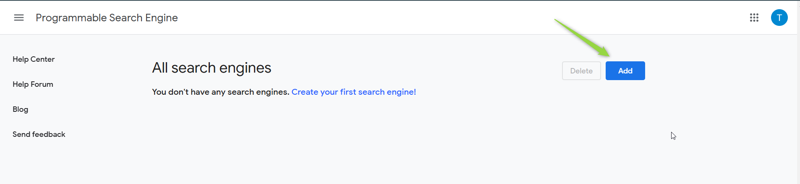

4.  **Configure Search Engine Details:** Fill in the required fields for your search engine:
    *   **Sites to search:** Specify the websites or web pages you want your search engine to cover. You can enter specific URLs or entire domains. You can also choose to search the entire web if needed.
    *   **Name of the search engine:**  Enter a descriptive name for your custom search engine.
    *   **Search Settings:** Configure additional search settings as needed for your use case.
    *   **Terms of Service:** Make sure to read and agree to Google's Programmable Search Engine Terms of Service.

    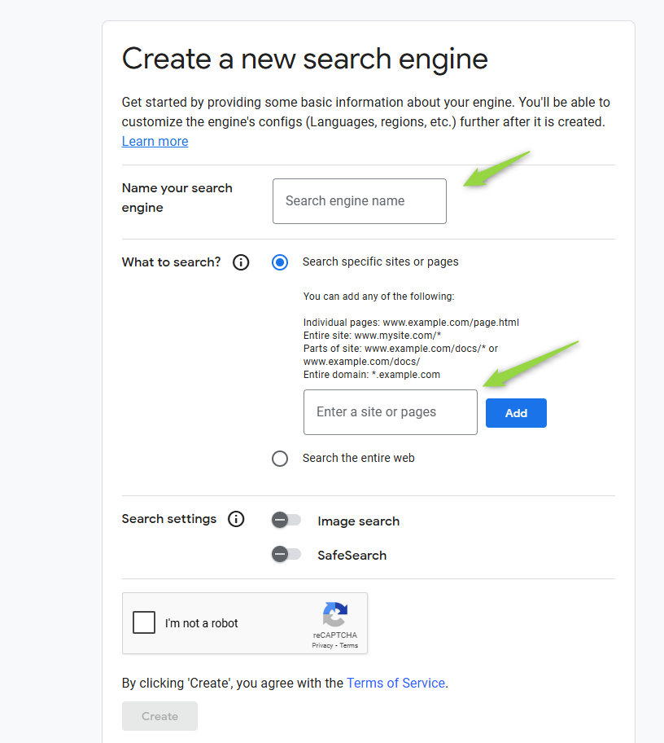

5.  **Get Custom Search Engine ID:** Once your search engine is created, you will be provided with a **Custom Search Engine ID**.  You can find this ID in the code snippet provided by Google or by clicking on your search engine in the Programmable Search Engine control panel.

    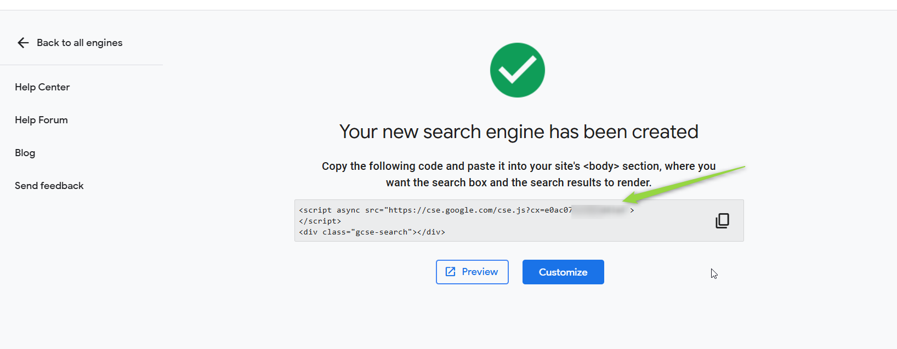

    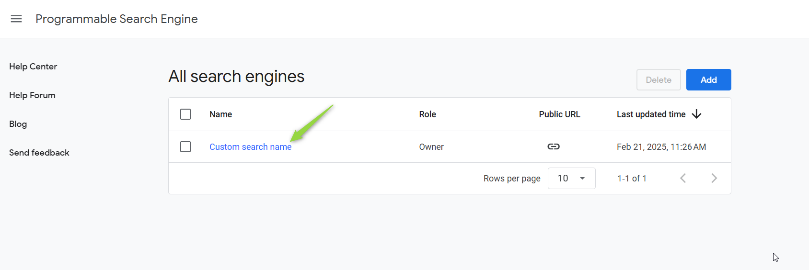

    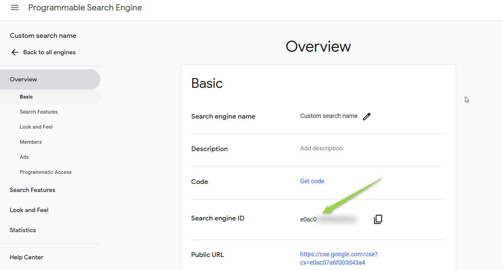

### Token/API Key Generation: Obtaining Google API Key

To use the Google Tool, you also need a Google API Key:

1.  **Access Programmatic Access Section:** In the Programmable Search Engine control panel, scroll down to the **"Programmatic Access"** section and click the **"Get started"** button.

    

    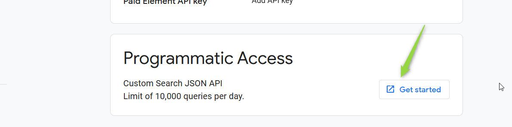

2.  **Select or Create Project:** Select an existing Google Cloud Project or create a new one if required.

3.  **Get API Key:** Your API key will be displayed. **Securely copy and store this API Key.** You will need it to configure the Browser Toolkit in ELITEA.

    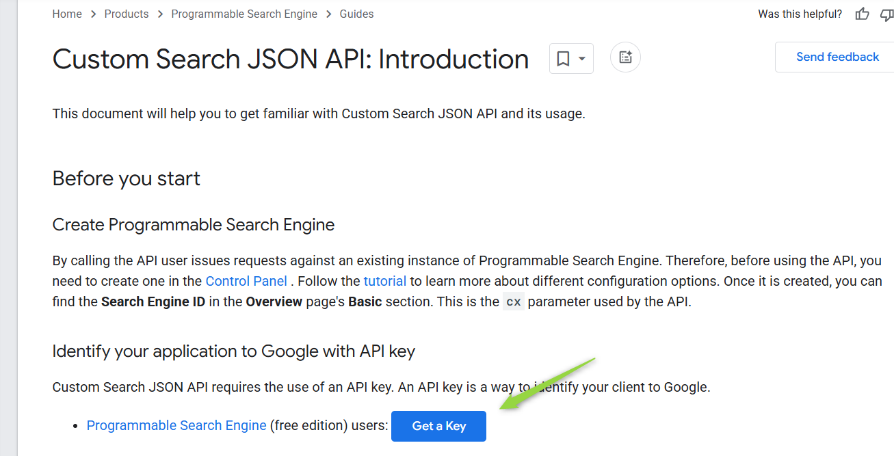

    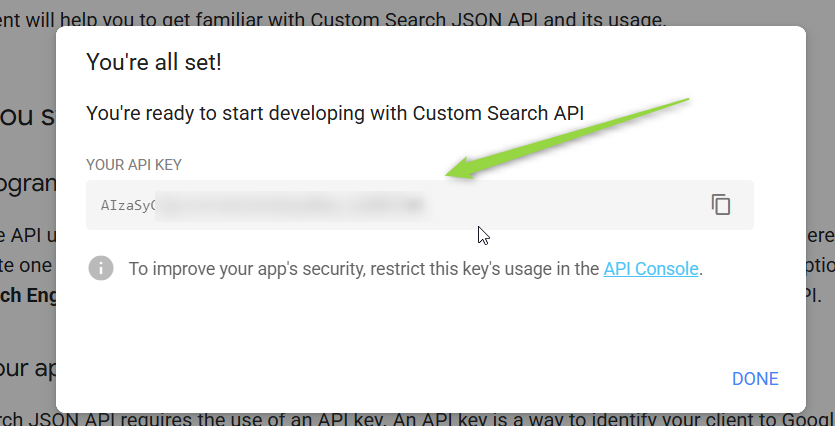

**Important Security Note:** Treat your Google API Key and Custom Search Engine ID as sensitive credentials. Store them securely and avoid exposing them in your Agent instructions or public configurations. ELITEA's Secrets Management feature is recommended for secure storage.

## System Integration with ELITEA

### Agent Creation/Configuration

To integrate Browser functionalities into your workflows, you will need to configure the Browser Toolkit within an ELITEA Agent. You can either create a new Agent specifically for Browser interactions or modify an existing Agent to incorporate Browser tools.

1.  **Navigate to Agents Menu:** In ELITEA, go to the **Agents** menu from the main navigation panel.
2.  **Create or Edit Agent:**
    *   **Create a New Agent:** Click on the **"+ Agent"** button to create a new Agent. Follow the on-screen prompts to define essential Agent attributes such as Agent name, a descriptive Agent description, the desired Agent type, and initial instructions for the Agent.
    *   **Edit an Existing Agent:** Select the Agent you intend to integrate with Browser from your list of Agents. Click on the Agent to open its configuration settings for editing.

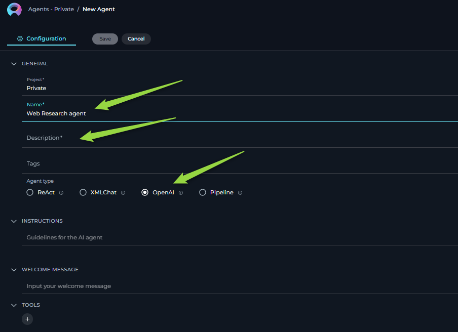

3.  **Access Tools Section:** Within the Agent configuration interface, scroll down until you locate the **"Tools"** section. This section is where you will add and configure toolkits, including the Browser Toolkit.

### Toolkit Configuration

This section provides detailed instructions on how to configure the Browser Toolkit within your ELITEA Agent.

1.  **Add Toolkit:** In the "Tools" section of the Agent configuration, click on the **"+" icon**. This action will display a dropdown list of available toolkits that can be integrated with your Agent.
2.  **Select Browser Toolkit:** From the dropdown list of available toolkits, choose **"Browser"**. Selecting "Browser" will open the "New Browser tool" configuration panel, where you will specify the settings for your Browser integration.
3.  **Configure Browser Toolkit Settings:** Carefully fill in the following configuration fields within the "New Browser tool" section:

    *   **Name:** Enter a descriptive **Name** for your Browser toolkit instance.
    *   **Description:** Provide a concise **Description** for the toolkit.
    *   **API Key:** In the "API Key" field, paste the **Google API Key** you obtained in the previous steps or select a secure secret ( mandatory only in case Google tool is selected ).
    *   **Custom Search Engine ID:** Enter your **Custom Search Engine ID** obtained from Google Programmable Search Engine setup ( mandatory only in case Google tool is selected ).
    *   **Select Tools:**  Choose the specific tools from the Browser Toolkit that you want to enable for this agent by selecting the checkboxes next to their names.

    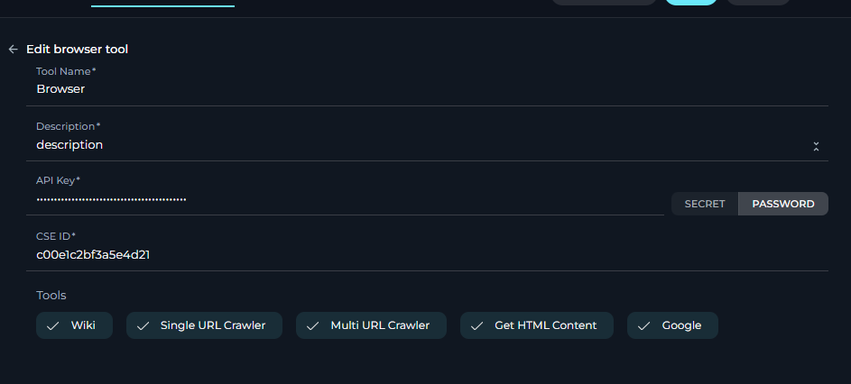

    **Enable Desired Tools:** In the "Tools" section within the Browser toolkit configuration panel, **select the checkboxes next to the specific Browser tools** that you want to enable for your Agent. Available tools include:

    *   **wiki** - Search Wikipedia.
    *   **single\_url\_crawler** - Crawl a single URL.
    *   **multi\_url\_crawler** - Crawl multiple URLs.
    *   **get\_html\_content** - Get HTML content of a page.
    *   **google** - Use Google Programmable Search Engine.
    *   **get\_pdf\_content** - Extract content from PDF files.
    

5.  **Complete Setup:** After configuring all the necessary settings and enabling the desired tools, click the **arrow icon** to finalize the Browser toolkit setup and return to the main Agent configuration menu  or 
6.  **Click Save** in the Agent configuration to save all changes and activate the Browser toolkit integration for your Agent.

### Tool Overview: Browser Toolkit Functionalities

Once the Browser toolkit is successfully configured and added to your Agent, you can leverage the following tools within your Agent's instructions to enable intelligent web interactions:

*   **1. single\_url\_crawler:**  **Tool Name:** `single_url_crawler`
    *   **Description:** Crawls a single URL and returns the text content of the web page.
    *   **Parameters:**
        *   `url`  The URL to crawl and retrieve data from.
    *   **Use Case Example:** To extract specific information from a known webpage, such as product details, news articles, or documentation pages.

*   **2. multi\_url\_crawler:**  **Tool Name:** `multi_url_crawler`
    *   **Description:** Crawls multiple URLs (including parallel crawling) and returns the content from these pages related to a specific query.
    *   **Parameters:**
        *   `query`  The query text to search for within the specified pages.
        *   `urls`  A list of URLs to crawl and search.
    *   **Use Case Example:** To compare information across multiple websites related to a specific topic, like competitor pricing, product reviews, or news coverage.

*   **3. get\_html\_content:**  **Tool Name:** `get_html_content`
    *   **Description:** Retrieves the raw HTML content of a specified web page.
    *   **Parameters:**
        *   `url`  The URL to get the HTML content from.
    *   **Use Case Example:** For advanced web scraping and analysis, allowing Agents to parse and extract structured data or specific elements from the HTML of a webpage.

*   **4. google:**  **Tool Name:** `google`
    *   **Description:** A wrapper around Google Programmable Search Engine. Useful for answering questions about current events, general knowledge, and accessing information available on the web through your custom search engine.
    *   **Parameters:**
        *   `query`: The search query text.
    *   **Use Case Example:** To perform web searches to answer user questions, gather information on current events, perform market research, or find relevant resources online.

*   **5. wikipedia:**  **Tool Name:** `wikipedia`
    *   **Description:** A wrapper around Wikipedia. Useful for answering general knowledge questions about people, places, companies, facts, historical events, or other encyclopedic subjects.
    *   **Parameters:**
        *   `query` : The search query text.
    *   **Use Case Example:** To quickly access and retrieve factual information from Wikipedia for knowledge augmentation, fact-checking, or providing definitions and background information.

*   **6. Get PDF Content:**  **Tool Name:** `Get_PDF_Content`
    *   **Description:** Useful for getting content of the PDF files that are accessible via URL.
    *   **Parameters:**
        *   `URL` : The URL of the file.
    *   **Use Case Example:** To get the contents and other information about a file available on the Internet.

## Use Cases

Here are practical use cases demonstrating how to leverage the Browser Toolkit within ELITEA agents for various business needs:

1.  **Market Research and Competitive Analysis:**
    *   **Scenario:** A company wants to perform competitive analysis on its competitors' digital presence, including product offerings, pricing, and marketing strategies.
    *   **Tools Used:** `multi_url_crawler`, `google`
    *   **Example Instruction:** "Use the 'multi_url_crawler' tool to fetch content from competitor websites [competitor URLs] based on the query 'product pricing and features'. Also, use the 'google' tool to search for '[competitor name] new product reviews' to understand market perception."
    *   **Benefit:** Obtain comprehensive insights into competitors' online strategies and market positioning, enabling up to date informed decision-making for product development and marketing.

2.  **Content Verification and Fact-checking:**
    *   **Scenario:** User needs to ensure the factual accuracy of a story before publication, verifying historical events, public figures' information, or claims made in articles.
    *   **Tools Used:** `wikipedia`, `single_url_crawler`
    *   **Example Instruction:** "Use the 'wikipedia' tool to verify the historical facts about [topic of article]. Compare the information with the content obtained from the URL [URL of article] using 'single_url_crawler' to ensure consistency and accuracy."
    *   **Benefit:** Ensures the credibility and accuracy of the content, strengthening audience trust.

3.  **Monitoring Brand Reputation:**
    *   **Scenario:** A corporation wants to monitor its brand reputation online by analyzing mentions across news websites, blogs, and forums, identifying sentiment and context.
    *   **Tools Used:** `google`, `get_html_content`
    *   **Example Instruction:** "Use the 'google' tool to search for '[Company Name] brand mentions' across news and blog websites. For each search result URL, use 'get_html_content' to extract the page content and analyze sentiment towards the brand e.g. reviews and comments "
    *   **Benefit:** Provides ongoing assessment of public perception, allowing for proactive management of brand reputation and quick response to negative sentiment or misinformation.

4.  **Enhancing Problem Solving:**
    *   **Scenario:** User wants to a quick access to detailed technical information and solutions to resolve issues more efficiently.
    *   **Tools Used:** `wikipedia`, `multi_tool_use` (combining `wikipedia` and `get_html_content`)
    *   **Example Instruction:** "Use 'multi_tool_use' to concurrently use 'wikipedia' to get information and 'get_html_content' from [URL of FAQ/Forum] to find solutions for [user issue]. Provide the combined information."
    *   **Benefit:** Enhances the quality and efficiency by providing instant access to relevant knowledge, speeding up problem resolution.

5.  **Getting Up-to-Date Data from the Web:**
    *   **Scenario:** Agents need to retrieve real-time, dynamic data from the web, such as current exchange rates, live sports scores, stock market updates, or weather information.
    *   **Tools Used:** `google`, `single_url_crawler`
    *   **Example Instruction:** "Use the 'google' tool to search for 'current exchange rate USD to EUR'. Extract the exchange rate from the Google search results. Alternatively, use 'single_url_crawler' to get the exchange rate from [URL of financial website]."
    *   **Benefit:** Enables access to and utilization of real-time information available on the web, allowing agents to provide up-to-date answers and integrate dynamic data into workflows.

6.  **Searching and Analyzing Documentation using CSE:**
    *   **Scenario:** Agents need to efficiently search and analyze a large set of online documentation, such as product manuals, API documentation, or internal knowledge bases, to find specific information or answer user queries related to the documentation.
    *   **Tools Used:** `google` (using Custom Search Engine configured for documentation sites)
    *   **Example Instruction:** "Use the 'google' tool with the query '[user question related to documentation]' to search within the documentation indexed by the Custom Search Engine. Summarize the relevant information found in the search results."
    *   **Benefit:** Streamlines information retrieval from extensive documentation, making it easier for agents to find specific details, answer documentation-related questions, and provide users with relevant excerpts or summaries.

## Troubleshooting and Support

### Troubleshooting

*   **Web Page Protected Against Non-Human Access:**
    *   **Problem:**  Tools like `single_url_crawler` or `get_html_content` fail to retrieve content from a webpage, and you may encounter errors indicating that the page is protected against automated access (e.g., CAPTCHA requirements, bot detection).

        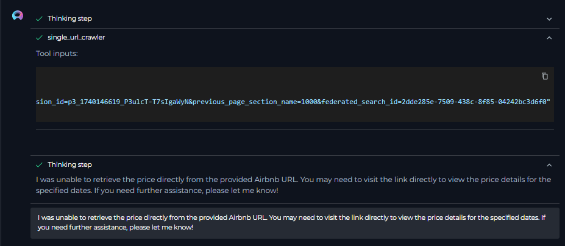

    *   **Possible Solutions:**
        1.  **Page Access Restrictions:** The website is intentionally blocking programmatic access. Unfortunately, ELITEA Browser Toolkit is not designed to bypass such protections.
        2.  **Contact Website Administrator (If Applicable):** If you require legitimate access to the content and believe the block is unintentional, contact the website administrator to inquire about allowing programmatic access from ELITEA's servers.

*   **Inaccessible URL:**
    *   **Problem:** Tools fail with errors indicating that the provided URL is not accessible or cannot be reached (e.g., "URL not found", "Connection timed out").

        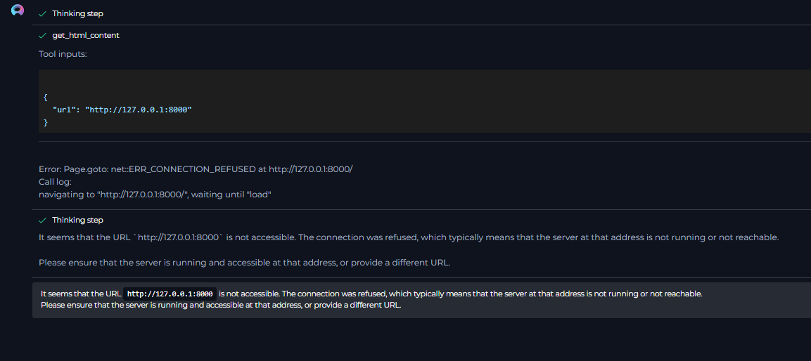

    *   **Troubleshooting Steps:**
        1.  **Verify URL:** Double-check the URL for typos or errors. Ensure it is a valid and correctly formatted web address.
        2.  **Access URL Manually:** Try accessing the URL directly in your web browser to confirm it is accessible and the website is online.
        3.  **Network Connectivity:** Ensure that there are no network connectivity issues preventing ELITEA from accessing the URL from its server environment. (Note: ELITEA accesses the web from its servers, not your local network. Local VPNs or private networks might affect your personal access but not ELITEA's server-side access).

*   **Local Hosted Web Pages:**
    *   **Problem:** ELITEA Agents cannot access web pages hosted on your local machine or within your private network (e.g., `http://localhost:8080` or internal company URLs not publicly accessible).
    *   **Explanation:** ELITEA Agents and the Browser Toolkit operate from ELITEA's cloud servers. They cannot directly access resources on your local machine or private networks that are not exposed to the public internet.
    *   **Limitations:**  Unless your locally hosted web pages or internal services are specifically configured for public web access, they will not be accessible to the ELITEA Browser Toolkit.

*   **Error with Some Web Page Elements:**
    *   **Problem:**  For some web pages, the Browser Toolkit might not be able to retrieve all dynamic content, especially elements heavily reliant on JavaScript rendering or AJAX loading. You might find that the retrieved content is incomplete or missing certain sections.

        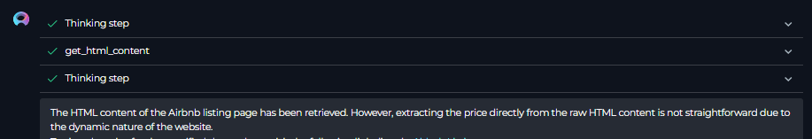

    *   **Explanation:** The Browser Toolkit, in its current form, might have limitations in fully rendering and extracting content from highly dynamic web pages that heavily depend on client-side JavaScript execution. Static content and server-rendered HTML are generally retrieved more reliably.
    *   **Limitations:**  Be aware that for very complex, JavaScript-heavy websites, the Browser Toolkit's content extraction might be limited to the initially loaded HTML and may not capture dynamically generated content that appears after page load.

### FAQs

*   **Q: Some data cannot be retrieved from a webpage, even though the tool executes without errors. Why?**
    *   **A:**  Possible reasons include:
        *   **Dynamic Content (JavaScript):** The data you are trying to retrieve might be dynamically loaded using JavaScript and might not be fully rendered or accessible to the Browser Toolkit's content extraction capabilities.
        *   **Protected Content (Login Required):** The data might be behind a login wall or require authentication. The Browser Toolkit, in its current configuration, does not support handling website logins or authenticated sessions.
        *   **Website Structure Changes:** The website's structure might have changed since the last successful data retrieval, and the element you are targeting might no longer exist or have a different structure.
        *   **Website Blocking:** The website might be implementing measures to block or limit automated scraping, even if not explicitly showing CAPTCHAs.

*   **Q: Can I use the Browser Toolkit without a Custom Search Engine ID and API Key?**
    *   **A:** Yes, you can use the Browser Toolkit without configuring the Google Tool (and therefore without a CSE ID and API Key).  When configuring the toolkit, simply **deselect the "google" tool**.  The other tools (wiki, single\_url\_crawler, multi\_url\_crawler, get\_html\_content) will function independently without requiring Google API credentials. The CSE fields will become optional if the "google" tool is not selected.

*   **Q: I am getting an error that the page is protected. Can I overcome this issue?**
    *   **A:** No, in most cases, you cannot directly overcome website protections against robots or programmatic access from within the ELITEA Browser Toolkit. If a website is intentionally blocking automated access, you will need to respect those restrictions. Contacting the website administrator to request permission for programmatic access might be an option in specific scenarios, but there is no guarantee they will grant it.

### Support and Contact Information

If you encounter persistent issues, have questions not covered in this guide, or require further assistance with the Browser Toolkit or ELITEA Agents, please do not hesitate to contact our dedicated ELITEA Support Team. We are here to help you resolve any problems quickly and efficiently and ensure you have a smooth and productive experience with ELITEA.

**How to Reach ELITEA Support:**

*   **Email:** **[SupportAlita@epam.com](mailto:SupportAlita@epam.com)**

**Best Practices for Effective Support Requests:**

To help us understand and resolve your issue as quickly as possible, please ensure you provide the following information in your support email:

*   **ELITEA Environment:** Clearly specify the ELITEA environment you are using (e.g., "Nexus," "Alita Lab," "EYE").
*   **Project Details:** Indicate the **Project Name** and whether you are working in your **Private** workspace or a **Team** project.
*   **Detailed Issue Description:** Provide a clear, concise, and detailed description of the problem you are encountering. Explain what you were trying to do, what you expected to happen, and what actually occurred.
*   **Relevant Configuration Information:** To help us diagnose the issue, please include relevant configuration details, such as:
    *   **Agent Instructions (Screenshot or Text):** If the issue is with an Agent, provide a screenshot or copy the text of your Agent's "Instructions" field.
    *   **Toolkit Configurations (Screenshots):** If the issue involves the Browser toolkit or other toolkits, include screenshots of the toolkit configuration settings within your Agent.
*   **Error Messages (Full Error Text):** If you are encountering an error message, please provide the **complete error text**. In the Chat window, expand the error details and copy the full error message. This detailed error information is crucial for diagnosis.
*   **Your Query/Prompt (Exact Text):** If the issue is related to Agent execution, provide the exact query or prompt you used to trigger the issue.
*   **URL in Question:** If the issue is related to web page crawling or content retrieval, please provide the specific **URL** that is causing problems.

**Before Contacting Support:**

We encourage you to first explore the resources available within this guide and the broader ELITEA documentation. You may find answers to common questions or solutions to known issues in the documentation.

## Useful Links

To further enhance your understanding and skills in using the Browser Toolkit with ELITEA, here are some helpful external resources:

*   **[Programmable Search Engine Help](https://support.google.com/programmable-search/#topic=4513742)**: - *Official Google Programmable Search Engine documentation and help resources.*
*   **[Programmable Search Engine Setup](https://programmablesearchengine.google.com/u/1/controlpanel/all)**: - *Direct link to the Google Programmable Search Engine control panel to set up and manage your custom search engines.*
*   **[ELITEA Secrets Management](../../platform-documentation/menus/settings.md#secrets)**: Learn how to securely store your Zephyr Scale API Token using ELITEA's Secrets management feature for enhanced security.
*   **[ELITEA Agents Configuration](../../platform-documentation/menus/agents.md)**:  Find out more about creating and configuring Agents in ELITEA, where you integrate the Zephyr Scale toolkit to automate your workflows.
