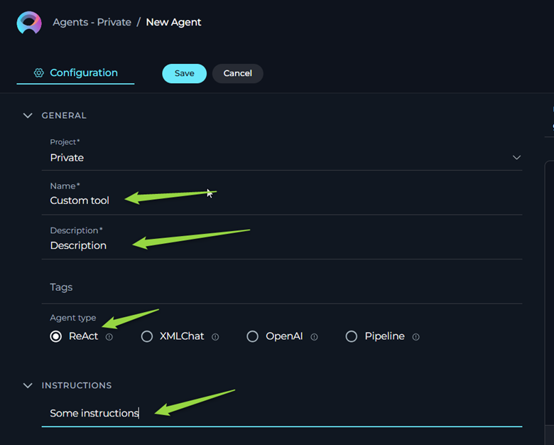
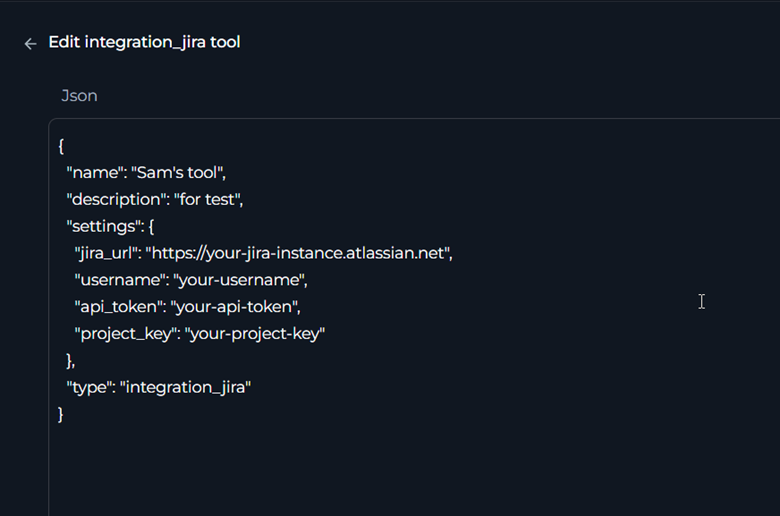

# ELITEA Toolkit Guide: ELITEA Custom Toolkit

### Purpose and Overview

The ELITEA Custom Toolkit is a specialized development tool designed to implement custom solutions by **ELITEA Development team** . It provides capability to provide certain users with non standard solutions also it is a streamlined way to build, test, and iterate on the backend components of ELITEA toolkits **before** the corresponding frontend user interface is fully developed. This toolkit enables controlled access and rapid backend development cycles within the ELITEA platform.

### Important Considerations

*   **Backend Dependency:**  The Custom Toolkit **requires** a fully functional backend implementation within ELITEA to operate. Without a corresponding backend service ready to handle requests, this toolkit **cannot** be configured or used effectively. Configurations entered in the Custom Toolkit will have **no effect** if there is no backend component designed to process them.

*   **Not for General API Integrations:**  This toolkit is **not** intended for general-purpose integrations with external applications or APIs. For integrating ELITEA with external APIs (like REST APIs, SOAP APIs, etc.), you should use the **"OpenAPI Toolkit"**.

## Toolkit Creation and Configuration

### Configuration Steps

To create and configure an ELITEA Custom Toolkit for testing your backend components, follow these steps:

1.  **Navigate to ELITEA Agents:** Access the Agent configuration section within your ELITEA instance.

2.  **Configure a New Agent (or Edit Existing):** Select an existing agent or create a new agent by clicking "Create Agent". Configure the agent by specifying the **Agent Name**, **Description**, **Instructions**, and **Agent Type** as needed for your testing purposes. *(Note: The specific Agent Type must be selected depending on toolkits backend configurations.)*

    

3.  **Add a New Tool:** In the Agent configuration, locate the "Tools" section and click the **"+" (Add Tool)** icon.

4.  **Select Custom Toolkit:** From the dropdown list of available toolkits, choose **"Custom"**.

5.  **Enter JSON Configuration:** In the "Schema" (or Configuration) field provided for the Custom Toolkit, enter the required configuration parameters in **JSON format**. The specific JSON structure and parameters will be dictated by the backend component that was  developed.
    
    

    #### Crucial Configuration Note

    *   **Backend Component Documentation:** Refer to the documentation or specifications for your **backend component** to understand the exact JSON configuration schema it expects.

6.  **Save Configuration:** Click the **"Save"** button to save the Custom Toolkit configuration.

## Use Cases

1.  **Leveraging User-Requested Custom Toolkits:**

    *   **Scenario:** You have a specific and unique business need that isn't met by standard ELITEA toolkits. You request the ELITEA team to develop a custom toolkit tailored precisely to your requirements. This custom toolkit is designed for your exclusive use and may not be intended for general release.
    *   **How the Custom Toolkit Enables This:** The ELITEA Custom Toolkit is the primary way to integrate and utilize these user-requested, bespoke toolkits within ELITEA agents. The ELITEA team develops the backend service for your custom toolkit. You, as the user, then employ the Custom Toolkit in ELITEA to connect to and interact with this backend. You'll use JSON configurations within the Custom Toolkit to send instructions and data to your custom backend service and receive results.
    *   **Example:** Your organization needs to integrate ELITEA with a highly specific, internal legacy database for a niche workflow. You request a custom toolkit. The ELITEA team builds a backend service that bridges ELITEA to your legacy database. They provide you with documentation detailing the JSON configuration schema for interacting with this service. You then use the ELITEA Custom Toolkit to configure ELITEA agents. By crafting specific JSON payloads within the Custom Toolkit, your agents can now query, update, or manage data within your legacy database, directly through the custom toolkit's backend.

2.  **Implementing Specialized and Niche Workflows:**

    *   **Scenario:** You need to implement highly specialized or niche workflows within ELITEA that are not addressed by publicly available or general-purpose toolkits. These workflows might involve unique data processing, interactions with internal systems not exposed via standard APIs, or very specific business logic.
    *   **How the Custom Toolkit Enables This:** The Custom Toolkit allows you to directly connect to and utilize custom-built backend services within ELITEA. This is ideal for implementing workflows that require unique functionality or integrations that go beyond the scope of standard toolkits. You have full control over the backend logic and define how your agents interact with it through JSON configurations within the Custom Toolkit.
    *   **Example:** You are building an agent to automate a complex, multi-step internal compliance process. This process requires specialized data validation, custom rule engines, and interactions with internal audit systems. You develop a custom backend service to encapsulate this complex logic. Within ELITEA, you use the Custom Toolkit to create agents that send specific compliance-related data (as JSON) to your backend service. The backend then executes the complex compliance checks and returns results back to the agent, all orchestrated via the Custom Toolkit.

3.  **Controlled Testing and Internal Access to Toolkits:**

    *   **Scenario:** You need to test a toolkit's backend functionality in a controlled environment before broader deployment or frontend UI development. You might want to provide access to the toolkit's backend capabilities to a limited group, such as internal QA, beta testers, or a specific team, without making it widely available.
    *   **How the Custom Toolkit Enables This:** By configuring the Custom Toolkit within agents and controlling access to the ELITEA projects or workspaces containing these agents, you can effectively restrict who can interact with the toolkit's backend. This allows for focused testing, internal validation, and feedback gathering in a secure and controlled manner.
    *   **Example:** You are developing a new, sensitive data processing toolkit. Before releasing it broadly, you want your internal security team to audit its backend logic and data handling. You deploy the toolkit's backend, configure a Custom Toolkit in an ELITEA agent, and grant access to the ELITEA project containing this agent only to your security team. They can then use the agent and Custom Toolkit to send test data (via JSON configurations) to the backend, examine its behavior, and perform security assessments in a safe, isolated environment.

These use cases highlight the ELITEA Custom Toolkit's role in enabling specialized, tailored, and controlled toolkit functionalities within ELITEA, particularly when dealing with user-requested custom solutions, niche workflows, and scenarios requiring restricted access for testing or internal use.

## Troubleshooting and Support

### Troubleshooting

1.  **Toolkit Not Saved:**

    *   **Problem:** You attempt to save the Custom Toolkit configuration, but it fails to save, and you may see an error message or the configuration is discarded.
    *   **Possible Cause:** The JSON configuration you entered in the "Schema" field is not valid JSON.
    *   **Troubleshooting Steps:**
        *   **Validate JSON:** Use a JSON validator tool (online or within your code editor) to check if the JSON you entered is syntactically correct. Ensure proper formatting, brackets, quotes, and data types are used.
        *   **Check Required Fields:** Refer to the backend component's documentation to see if there are any *required* fields in the JSON configuration. Ensure all mandatory fields are present and correctly formatted.

2.  **Custom Tool Converted to Another Tool on UI:**

    *   **Problem:** After entering the JSON configuration and saving, the Custom Toolkit in the UI appears to have been converted to a different toolkit type.
    *   **Possible Cause:** There is an existing toolkit within the ELITEA system that has been configured with the *same* combination of toolkit type and configuration parameters as what you entered. ELITEA might be designed to reuse existing toolkit configurations to avoid duplication.
    *   **Troubleshooting Steps:**
        *   **Check for Existing Toolkits:** Carefully review the list of available toolkits in your ELITEA environment. Look for toolkits that might have a similar name or description to what you were trying to create.
        *   **Reuse Existing Toolkit (if appropriate):** If you find an existing toolkit that matches your intended configuration, consider reusing it instead of creating a duplicate.
        *   **Create a Unique Configuration:** If you need a *distinct* Custom Toolkit configuration, ensure that the JSON you enter is truly unique and does not conflict with any existing toolkit configurations in the system. You might need to adjust parameter names or values to make it distinct. If the system logic is matching based on toolkit type *and* JSON configuration, you might need to ensure even minor variations in JSON structure. (Consult ELITEA documentation or support for details on how toolkit uniqueness is determined).

## Support and Contact Information

### ELITEA Support Team

As the ELITEA Custom Toolkit is primarily intended for internal ELITEA Developers, support and specific documentation beyond this guide may be available through internal ELITEA development channels. For general ELITEA platform issues or questions, please contact the ELITEA Support Team:

*   **Email:** SupportELITEA@epam.com

To help us assist you efficiently, please provide the following details in your support request:

*   **ELITEA Environment:** (e.g., "Development," "Testing," "Production")
*   **Project Details:** Project Name, Workspace (if applicable).
*   **Detailed Issue Description:** Clear explanation of the problem, steps to reproduce, expected vs. actual behavior.
*   **Custom Toolkit Configuration (JSON Payload):** Provide the JSON configuration you are using with the Custom Toolkit.
*   **Error Messages (if any):** Full error messages or logs observed.
*   **Details of Backend Component:** (If relevant and known) Information about the backend service you are testing with the Custom Toolkit.

**Before Contacting Support:**

We encourage you to first explore the resources available within this guide and the broader ELITEA documentation. You may find answers to common questions or solutions to known issues in the documentation.