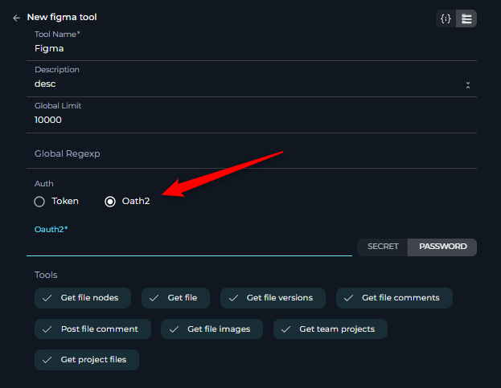

# ELITEA Toolkit Guide: Figma Integration

## Introduction

### Purpose of this Guide

This guide is your definitive resource for integrating and effectively utilizing the **Figma toolkit** within ELITEA. It provides a detailed, step-by-step walkthrough, from setting up your Figma API credentials to configuring the toolkit in ELITEA and seamlessly incorporating it into your Agents. By following this guide, you will unlock the power of automated design interaction, enhanced collaboration with design assets, all directly within the ELITEA platform. This integration empowers you to leverage AI-driven automation to optimize your workflows involving Figma designs, enhance design productivity, and improve design-related processes within your projects.

### Brief Overview of Figma

Figma is a leading cloud-based design platform for collaborative interface design. It is widely used by designers and teams to create, prototype, and share user interface and user experience designs. Key features of Figma include:

*   **Collaborative Design:** Figma enables real-time collaboration, allowing multiple users to work on the same design file simultaneously, fostering teamwork and efficient design iterations.
*   **Vector Graphics and Prototyping:** Provides powerful vector graphics editing tools and robust prototyping capabilities to create interactive and realistic design mockups.
*   **Web-Based Platform:** As a web-based application, Figma is accessible from any modern web browser across different operating systems, facilitating seamless access and collaboration.
*   **Version History and Team Libraries:** Maintains a comprehensive version history of design files and enables the creation of shared team libraries for reusable design components and styles, ensuring design consistency and efficient asset management.

Integrating Figma with ELITEA brings these powerful design collaboration and management capabilities directly into your AI-driven workflows. Your ELITEA Agents can then intelligently interact with your Figma design files and assets to automate design-related tasks, enhance design workflows, improve design asset management, and leverage AI to optimize your entire design lifecycle within Figma.

## Toolkit Account Setup and Configuration in Figma

### Account Setup

To use the Figma Toolkit, you will need an active Figma account. To set up your Figma account, follow these steps:

1.  **Visit Figma Website:** Open your web browser and navigate to the official Figma website: [https://www.figma.com/](https://www.figma.com/).

2.  **Get Started for Free or Log In:** Click on the **"Get started for free"** button to create a new account or use the **"Log in"** option if you have an existing Figma account.

3.  **Follow Registration Process:** Follow the on-screen instructions to complete the registration process and create your Figma account. You can sign up using your email address or connect with your Google account.

    

4.  **Access Figma Home Page:** Once your account is created and verified, you will be redirected to your Figma home page.

### Token/API Key Generation: Creating a Figma Personal Access Token

For secure integration with ELITEA, user will need to use a Figma **Personal Access Token**.

**Follow these steps to generate a Figma Personal Access Token:**

1.  **Access Figma Settings:** In Figma, click on your profile icon (typically your avatar or initials) located in the top left corner of the Figma interface and navigate to **"Settings"**. **Note:** Ensure you have the correct Figma account selected if you are logged into multiple Figma accounts.

    

2.  **Navigate to Security Tab:** In the Settings menu, click on the **"Security"** tab.

3.  **Generate New Personal Access Token:** Scroll down to the "Personal access tokens" section and click on the **"Generate new token"** button.

    

4.  **Configure Token Permissions (If Required):** In the "New personal access token" window, enter a **Token name** to identify the token (e.g., "ELITEA Integration Token").  **Note:** While the documentation mentions selecting permissions for comment posting, the Figma Personal Access Tokens currently have broad access and specific permission scopes are not configurable during token creation through the UI. Ensure you understand the access granted by Personal Access Tokens.  You can set an **Expiration date** for the token if desired for security best practices.

    

5.  **Create Token:** Click the **"Generate token"** button to create the Personal Access Token.

6.  **Securely Copy and Store Your API Token:**  A dialog box will appear displaying your newly generated Personal Access Token. **Immediately copy the generated API token**. **This is the only time you will see the full token value.** Store it securely in a password manager or, preferably, ELITEA's built-in Secrets feature for enhanced security within ELITEA. You will need this API token to configure the Figma toolkit in ELITEA.

**Additional Information on Figma Access Tokens:**

For more detailed information on managing Figma Personal Access Tokens, refer to the official Figma documentation: [figma.com/Manage-personal-access-tokens](https://help.figma.com/hc/en-us/articles/8085703771159-Manage-personal-access-tokens)

### OAuth 2.0 Setup for Figma (Application-Specific Authentication)

For more secure and application-specific authentication, you can also configure OAuth 2.0 for the Figma Toolkit. This method is generally recommended for applications and integrations that require more granular control over access and user authorization.

**Follow these steps to set up OAuth 2.0 for Figma:**

1.  **Access Figma Developers Apps Page:** Open your web browser and navigate to the Figma Developers Apps page: [figma.com/developers/apps](https://www.figma.com/developers/apps). Ensure you are logged in with the correct Figma account.

2.  **Create a New App:** Click on the **"Create new app"** button.

    

3.  **Configure App Details:** In the "Create a new app" dialog:
    *   **App name:** Enter a descriptive name for your application (e.g., "ELITEA Figma Integration").
    *   **Website URL:** Enter the website URL of your ELITEA instance or a placeholder URL if you don't have a specific website for your integration.
    *   **Logo:** Upload a logo for your application.
    *   Click **"Create"**.

    

4.  **Obtain Client ID and Client Secret:** After creating the app, you will be provided with a **Client ID** and **Client Secret**. **Securely keep these credentials.** You will need them to configure OAuth 2.0 authentication in ELITEA.

    

5.  **Configure Redirect URL:** Click on the name of your newly created app to access its settings. Navigate to the **"OAuth 2.0 redirect URLs"** section and click **"Add redirect URL"**. Enter the appropriate **Redirect URL** for your instance.  **Note:** The Redirect URL depends on how your third-party app handles OAuth 2.0 flows and might require specific configuration within your third-party app.

    

6.  **Obtain OAuth 2.0 Token (through ELITEA):** To obtain an OAuth 2.0 token, you will typically need to initiate the OAuth 2.0 flow from within your third-party app using your configured Client ID, Client Secret, and Redirect URL. The exact steps for obtaining the OAuth 2.0 token will depend on your integration implementation with Figma. Refer to [figma.com/oauth-with-plugins](https://www.figma.com/plugin-docs/oauth-with-plugins/) for instructions on completing the OAuth 2.0 authorization flow and obtaining the OAuth 2.0 token for Figma.

## System Integration with ELITEA

### Toolkit Configuration

This section provides detailed instructions on how to configure the Figma toolkit within your ELITEA Agent.

1.  **Add Toolkit:** In the "Tools" section of the Agent configuration, click on the **"+" icon**. This action will display a dropdown list of available toolkits that can be integrated with your Agent.
2.  **Select Figma Toolkit:** From the dropdown list of available toolkits, choose **"Figma"**. Selecting "Figma" will open the "New Figma tool" configuration panel, where you will specify the settings for your Figma integration.

     

3.  **Configure Figma Toolkit Settings:** Carefully fill in the following configuration fields within the "New Figma tool" section:

    *   **Name:** Enter a descriptive **Name** for your Figma Toolkit instance (e.g., "DesignFigma", "FigmaAccess").
    *   **Description:** Provide a concise **Description** for the toolkit (e.g., "Toolkit for accessing Figma design files").
    *   **Global Regexp (Optional):** Enter a **Global Regexp** (Regular Expression) to filter results received from the Figma API. This filter will be applied to JSON responses from Figma API calls. Leave blank for no global filtering.
    *   **Global Limit:** Enter a **Global Limit** (character count) to limit the size of the results. This filter will be applied to JSON responses from Figma API calls. Set this to a reasonable value to ensure manageable content within the character limit. Setting it to `0` or a very small value might result in truncated or empty responses. **Note:** The Global Limit cannot be set to null.

          

    *   **Authentication:** Choose your preferred **Authentication** method:
        *   **Token (Personal Access Token):** Select this option to use a Figma Personal Access Token for authentication. Paste your Figma Personal Access Token (typically starting with "figd\_***") into the **"Token"** field or select it from ELITEA secrets if you already have it there.

            

        *   **OAuth 2:** Select this option to use OAuth 2.0 authentication. You will need to provide:
            *   **OAuth Token:** Paste your **OAuth 2.0 token** obtained through the OAuth 2.0 flow into the **"OAuth"** field or select it from ELITEA secrets if you already have it there.

            

4.  **Enable Desired Tools:** In the "Tools" section within the Figma toolkit configuration panel, **select the checkboxes next to the specific Figma tools** that you want to enable for your Agent. Available tools include:

    *   **get\_file\_nodes** - Retrieve nodes from a Figma file.
    *   **get\_file** - Retrieve a Figma file details.
    *   **get\_file\_versions** - Get version details of a Figma file.
    *   **get\_file\_comments** - Get comments from a Figma file.
    *   **post\_file\_comment** - Post a comment to a Figma file.
    *   **get\_file\_images** - Get images from a Figma file.
    *   **get\_team\_projects** - Get projects for a Figma team.
    *   **get\_project\_files** - Get files for a Figma project.

5.  **Complete Setup:** After configuring all the necessary settings and enabling the desired tools, click the **arrow icon** to finalize the Figma toolkit setup and return to the main Agent configuration menu.
6.  **Click Save** in the Agent configuration to save all changes and activate the Figma toolkit integration for your Agent.

### Tool Overview: Figma Toolkit Functionalities

Once the Figma toolkit is successfully configured and added to your Agent, you can leverage the following tools within your Agent's instructions to enable intelligent interaction with Figma design files:

*   **1. get\_file\_nodes:**  **Tool Name:** `get_file_nodes`
    *   **Functionality:** Retrieves specific nodes (design elements like frames, layers, groups) from a Figma file.
    *   **Parameters:**
        *   `file_key` (string, required): The Key of the Figma file (obtainable from the file URL).
        *   `node ids` (string, required): Comma-separated string of Node IDs to retrieve (e.g., `"123:456 or 789-012"`).
    *   **Purpose:** To extract info about specific design elements or components from a Figma file for analysis, inspection, or integration into other workflows. Example: Retrieve specific frames or layers to analyze their properties or content...

    

*   **2. get\_file:**  **Tool Name:** `get_file`
    *   **Functionality:** Retrieves the details of a Figma file.
    *   **Parameters:**
        *   `file_key` (string, required): The Key of the Figma file (obtainable from the file URL).
    *   **Purpose:** To access the complete Figma file structure and data for comprehensive analysis, data extraction, or conversion. Real live figma files canbe huge so make sture to use filters or previouse tool to get specific info about the file. Example: Retrieve following file content to analyze all layers, pages, frames, and styles...

*   **3. get\_file\_versions:**  **Tool Name:** `get_file_versions`
    *   **Functionality:** Retrieves the version history of a Figma file.
    *   **Parameters:**
        *   `file_key` (string, required): The Key of the Figma file (obtainable from the file URL).
    *   **Purpose:** To track changes and revisions in a Figma file over time, access previous versions of a design, or analyze design evolution. Example: Retrieve following file versions to compare design iterations...

*   **4. get\_file\_comments:**  **Tool Name:** `get_file_comments`
    *   **Functionality:** Retrieves comments from a Figma file.
    *   **Parameters:**
        *   `file_key` (string, required): The Key of the Figma file (obtainable from the file URL).
    *   **Purpose:** To access and analyze feedback and discussions related to a design, track comment threads, or extract feedback for review. Example: Retrieve comments to analyze user feedback on a design prototype...

*   **5. post\_file\_comment:**  **Tool Name:** `post_file_comment`
    *   **Functionality:** Posts a new comment to a Figma file.
    *   **Parameters:**
        *   `file_key` (string, required): The Key of the Figma file (obtainable from the file URL).
        *   `message` (string, required): The content of the comment to post.
    *   **Purpose:** To enable automated feedback, annotation, or communication within Figma design files. Example:  Post comments to following design file about ...

*   **6. get\_file\_images:**  **Tool Name:** `get_file_images`
    *   **Functionality:** Retrieves images from a Figma file.
    *   **Parameters:**
        *   `file_key` (string, required): The Key of the Figma file (obtainable from the file URL).
        *   `node ids` (string, optional): Comma-separated string of Node IDs for which to retrieve images.
    *   **Purpose:** To extract image assets from Figma designs for use in other applications, documentation, or automated workflows. Example: Get an image of followinng node...

*   **7. get\_team\_projects:**  **Tool Name:** `get_team_projects`
    *   **Functionality:** Retrieves a list of projects within a Figma team.
    *   **Parameters:**
        *   `team_id` (string, required): The ID of the Figma Team.
    *   **Purpose:** To get an overview of projects within a Figma team. Example: List all projects within a design team ...

*   **8. get\_project\_files:**  **Tool Name:** `get_project_files`
    *   **Functionality:** Retrieves a list of files within a specific Figma project.
    *   **Parameters:**
        *   `project_id` (string, required): The ID of the Figma Project.
    *   **Purpose:** To get overview of files within a Figma project, list available design files for processing, or automate file-related tasks within a project context. Example: Retrieve a list of all design files in a project ...

## Instructions and Prompts for Using the Figma Toolkit

To effectively utilize the Figma toolkit within your ELITEA Agents, you need to provide clear and precise instructions within the Agent's "Instructions" field, telling the Agent *how* and *when* to use these tools. 
**Note:** Instructions highly depend on the information that can be retrieved from the Figma file, as well as its structure and content, which, in turn, rely on the details provided by the designer when creating the Figma file. For better results, designers should provide valid and descriptive information, along with clear and meaningful names for the components.  In case of large files utilize a "global regexp" filter to remove unnecessary data and focus only on the required information.

**General Instruction Structure:**

 When instructing your Agent to use a Figma tool, you will typically follow this pattern:

 Use the "[tool_name]" tool to [describe the action you want to perform] in Figma.
  Parameters:
  File Key: 
  Node ID:(optional)

Output format (optional)
Provide the result in json format

## Integration Helpdesk and Troubleshooting

### Troubleshooting Common Issues

1.  **No File or Nodes Found Using Correct Request IDs:**
    *   **Problem:** Agent returns "No file found" or "No nodes found" even when you believe you are using the correct File Key and Node IDs.
    *   **Troubleshooting Steps:**
        *   **Verify Credentials:** Double-check your Figma API credentials (Personal Access Token or OAuth 2.0 token) in the toolkit configuration. Ensure they are correct, valid, and not expired. Incorrect credentials will often lead to "file not found" responses, (not to 401 or 403 errors).
        *   **Account Access:** Make sure the Figma account associated with the token has access to the Figma file and the specified nodes. If the file is in a private Figma team or project, ensure the token has the necessary permissions within that team or project.
        *   **File Key and ID Accuracy:** Check the File Key and Node IDs you are using in your Agent instructions. File Keys and Node IDs are case-sensitive and must match the Figma file and element identifiers exactly. Copy and paste IDs directly from the Figma UI to avoid typos.
        *   **File Visibility and Sharing:** Ensure the Figma file is not set to "private" in a way that prevents API access. Check the file's sharing settings in Figma to confirm that "Anyone with the link can view" or appropriate access permissions are enabled if you are intending to access a publicly shared file. For files within private teams, ensure your token's associated account is a member of that team.
      

2.  **Receiving Partial JSON or Incomplete Answers:**
    *   **Problem:** The Agent returns only a portion of the expected JSON response or provides incomplete answers based on Figma data.
    *   **Troubleshooting Steps:**
        *   **Increase Global Limit Filter Value:** The Figma Toolkit configuration includes a "Global Limit" filter that restricts the character count of the output. If this limit is set too low, it might be truncating the full JSON response or cutting off important information. **Try increasing the "Global Limit" value** in the toolkit configuration to a larger number (e.g., 1000, 5000, or higher, depending on the expected size of the Figma data).
        *   **Remove Global Limit (for testing):** For testing purposes, you can temporarily set the "Global Limit" to a very high value (e.g., 10 000 or more) to see if you receive the full JSON response. If the Global Limit was the cause, and you can then adjust it to an appropriate value that captures the necessary data without being excessively large.

3.  **Getting Values Cut by Global Regex Filter:**
    *   **Problem:** You are receiving data, but certain values or sections seem to be missing or truncated, and you suspect the "Global Regexp" filter might be the cause.
    *   **Troubleshooting Steps:**
        *   **Verify Global Regex Value:** Carefully review the **"Global Regexp"** value you have configured in the Figma Toolkit. Ensure that the regular expression is correctly written and is intended to filter the JSON response in the way you expect. Incorrectly written regex filters can inadvertently remove or truncate data you intended to keep.
        *   **Test Regex (Outside ELITEA):** Test your regular expression using online regex testers or regex debugging tools with example Figma API JSON responses to verify that it is matching and filtering the data as you intend. This will help you identify if the regex itself is the source of the issue.
        *   **Refine or Remove Regex:** If the regex is cutting off desired data, refine the regular expression to be more specific and avoid unintended matches. If you are unsure if the regex is needed or causing problems, try **temporarily removing the "Global Regex" filter** from the toolkit configuration (leave the field blank) to see if you receive the full, unfiltered JSON response. If it resolves the issue, then refine the regex filter.

4.  **"It seems there was an issue retrieving the file details. The response was incomplete..." Message:**
    *   **Problem:** The Agent returns a message indicating "It seems there was an issue retrieving the file details. The response was incomplete. Could you please check the file key and try again?". This often suggests that the response from the Figma API was truncated or incomplete.
    *   **Troubleshooting Steps:**
        *   **Increase Global Limit:** As mentioned in point 2, this message often occurs when the "Global Limit" filter is set too low and is truncating the Figma API response to data that makes no sence. **Increase the "Global Limit" value** in the toolkit configuration to a larger number to allow for a larger response size. Experiment with progressively larger values until you receive a complete and meaningful response.
        *   **Check File Key:** While the error message suggests checking the File Key, in this specific case of "incomplete response," the File Key is less likely to be the primary issue (assuming you have already verified its correctness). However, it's still a good practice to double-check the File Key to rule out any possibility of typos. Focus primarily on adjusting the Global Limit value to resolve this "incomplete response" issue.

5.  **Toolkit Fails to Post Comments:**
    *   **Problem:** The `post_file_comment` tool fails to post comments to Figma files, and you might receive errors related to permissions or token capabilities.
    *   **Troubleshooting Steps:**
        *   **Verify Token Permissions (for Personal Access Tokens - Limited Scope Control):** While Figma Personal Access Tokens currently have broad access, ensure that the account associated with the token has general commenting permissions within the Figma file or project. Check if you can manually post comments to the Figma file using the same Figma account associated with the token. If you cannot post comments manually, it indicates a permissions issue within Figma itself, not necessarily with the toolkit.
        *   **Check Token Expiration:** Ensure that your Figma Personal Access Token is not expired. If the token has an expiration date, generate a new token and update the token in your ELITEA Figma Toolkit configuration. Expired tokens will often lose certain functionalities, including comment posting.
        *   **Review Figma API Documentation:**  Consult the Figma API documentation for any specific requirements or known issues related to comment posting via the API. There might be specific formatting requirements or limitations for comment content or placement.

## Support and Contact Information

### ELITEA Support Team

If you encounter persistent issues, have questions not covered in this guide, or require further assistance with the Figma Toolkit or ELITEA Agents, please do not hesitate to contact our dedicated ELITEA Support Team. We are here to help you resolve any problems quickly and efficiently and ensure you have a smooth and productive experience with ELITEA.

**How to Reach ELITEA Support:**

*   **Email:** **[SupportAlita@epam.com](mailto:SupportAlita@epam.com)**

**Best Practices for Effective Support Requests:**

To help us understand and resolve your issue as quickly as possible, please ensure you provide the following information in your support email:

*   **ELITEA Environment:** Clearly specify the ELITEA environment you are using (e.g., "Nexus").
*   **Project Details:** Indicate the **Project Name** and whether you are working in your **Private** workspace or a **Team** project.
*   **Detailed Issue Description:** Provide a clear, concise, and detailed description of the problem you are encountering. Explain what you were trying to do, what you expected to happen, and what actually occurred.
*   **Relevant Configuration Information:** To help us diagnose the issue, please include relevant configuration details, such as:
    *   **Agent Instructions (Screenshot or Text):** If the issue is with an Agent, provide a screenshot or copy the text of your Agent's "Instructions" field.
    *   **Toolkit Configurations (Screenshots):** If the issue involves the Figma toolkit or other toolkits, include screenshots of the toolkit configuration settings within your Agent, especially the "Authentication" and "Filters" sections.
*   **Error Messages (Full Error Text):** If you are encountering an error message, please provide the **complete error text**. In the Chat window, expand the error details and copy the full error message. This detailed error information is crucial for diagnosis.
*   **Your Query/Prompt (Exact Text):** If the issue is related to Agent execution, provide the exact query or prompt you used to trigger the issue.
*   **Figma File Key and Node IDs (if applicable):** If the issue is related to accessing specific not private Figma files or nodes, please provide the **Figma File Key** and the **Node IDs** you are using in your instructions.

**Before Contacting Support:**

We encourage you to first explore the resources available within this guide and the broader ELITEA documentation. You may find answers to common questions or solutions to known issues in the documentation.

## Useful Links

### External Resources

To further enhance your understanding and skills in integrating Figma with ELITEA, here are some helpful external resources:

*   **Figma Website:** [https://www.figma.com/](https://www.figma.com/) - *Access the main Figma product website for product information, documentation, tutorials, and community resources.*
*   **Figma for Developers Documentation:** [https://www.figma.com/developers/api](https://www.figma.com/developers/api) - *Explore the official Figma API documentation for detailed information on Figma API endpoints, authentication, data structures, and developer guides.*
*   **Figma OAuth 2.0 Documentation:** [https://www.figma.com/plugin-docs/oauth-with-plugins/](https://www.figma.com/plugin-docs/oauth-with-plugins/) - *Learn more about implementing OAuth 2.0 authentication for Figma applications and integrations.*
*   **Figma Help Center:** [https://help.figma.com/hc/en-us](https://help.figma.com/hc/en-us) - *Access the official Figma Help Center for comprehensive articles, FAQs, and troubleshooting guides on all aspects of Figma usage.*
*   **[ELITEA Secrets Management:](../../platform-documentation/menus/settings.md#secrets)** - *Learn how to securely store your Figma API Token using ELITEA's Secrets management feature for enhanced security within ELITEA.*
*   **[ELITEA Agents Configuration:](../../platform-documentation/menus/agents.md)** - *Find out more about creating and configuring Agents in ELITEA, where you integrate the Figma toolkit to automate your design workflows.*