# ELITEA Toolkit Guide: Google Places Integration

## Introduction

### Purpose of this Guide

This guide is your definitive resource for integrating and utilizing the **Google Places toolkit** within ELITEA. It provides a step-by-step walkthrough, from setting up your Google API key to configuring the toolkit in ELITEA and effectively using it within your Agents. By following this guide, you will unlock the power of automated location-based information, streamlined workflows, and enhanced user experiences, all directly within the ELITEA platform. This integration empowers you to leverage AI-driven automation to optimize your location-aware applications using the combined strengths of ELITEA and Google Places.

### Brief Overview of Google Places

Google Places is a powerful location-based service provided by Google that allows applications to access and display information about businesses, landmarks, and points of interest. It offers comprehensive details, including business names, addresses, contact information, user reviews, ratings, and real-time data such as open hours and busy periods. It's designed for applications that need location-based services, and offers features for:

*   **Finding Places:** Search for businesses, points of interest, and other locations based on name, keywords, or geographical coordinates.
*   **Detailed Place Information:** Retrieve rich information about places, including address, phone number, website, opening hours, user reviews, and photos.
*   **Nearby Searches:** Find places that are located within a specified radius of a given location.
*   **Autocomplete Suggestions:** Provide users with intelligent location suggestions as they type.

Integrating Google Places with ELITEA brings these robust location-based capabilities directly into your AI-powered workflows. Your ELITEA Agents can then interact with the Google Places API to automate location-related tasks, enhance application functionalities, and improve user experiences through intelligent automation.

## Google Places API Setup and Configuration

### Account Setup

If you don't have a Google Cloud account with the Places API enabled yet, here’s how to get started:

1.  **Go to Google Cloud Console:** Open your web browser and navigate to [console.cloud.google.com](https://console.cloud.google.com).
2.  **Sign In or Create an Account:** Sign in with your existing Google account, or create a new one if needed.
3.  **Create a Project (if needed):** If you don't have an existing project, create a new one. Click on the project dropdown at the top, and select "New Project". Give your project a name and click "Create".

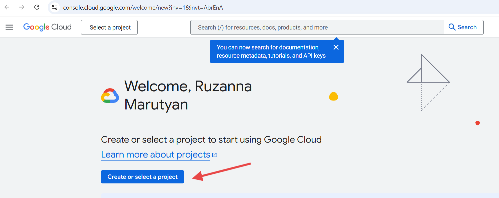
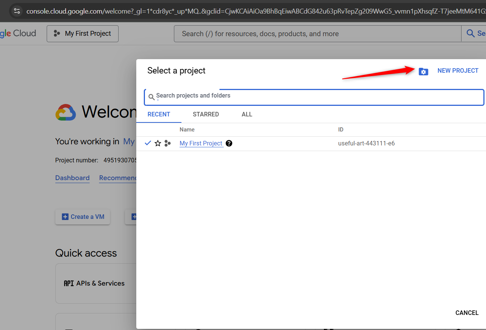
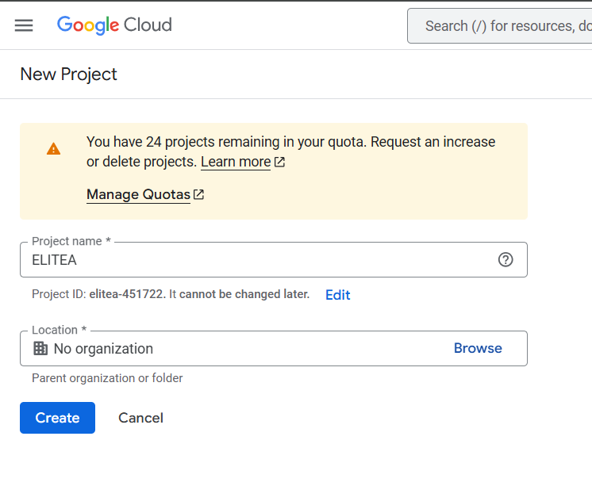

4.  **Enable the Places API:** Once your project is created/selected, navigate to the "APIs & Services" dashboard. 

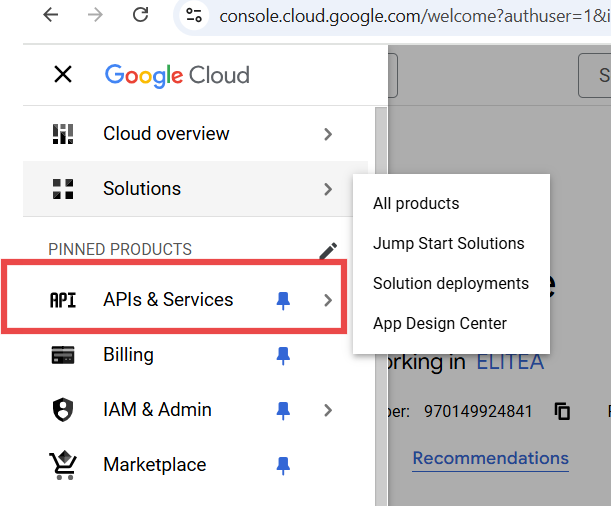

Click on "+ ENABLE APIS AND SERVICES" and search for "Places API". Select the "Places API" and click "Enable".
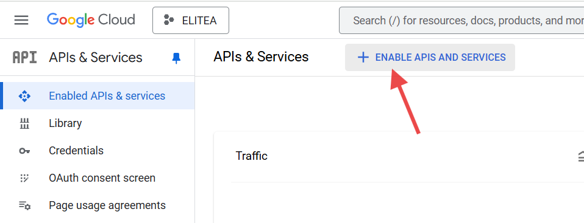
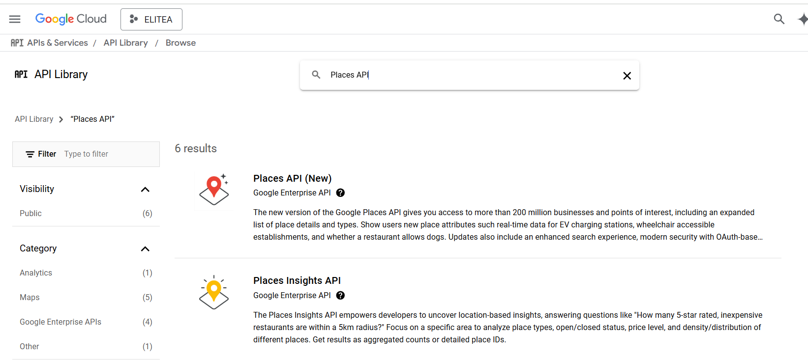
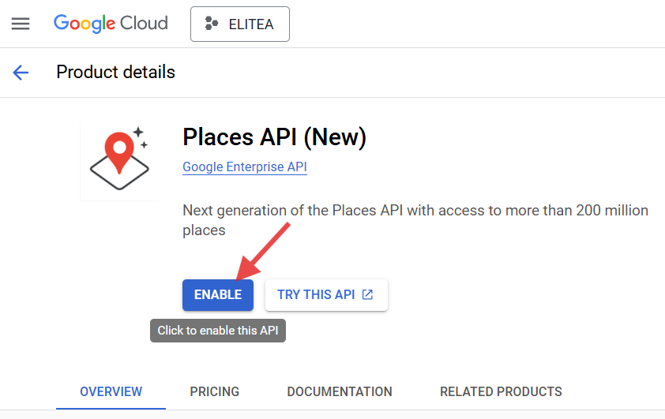

### API Key Generation: Creating an API Key in Google Cloud

For secure integration with ELITEA, you need a Google Places API key. This key authorizes ELITEA to access the Google Places API on your behalf.

**Follow these steps to create an API key:**

1.  **Go to API Credentials:** In the Google Cloud Console, go to "APIs & Services" and then "Credentials".
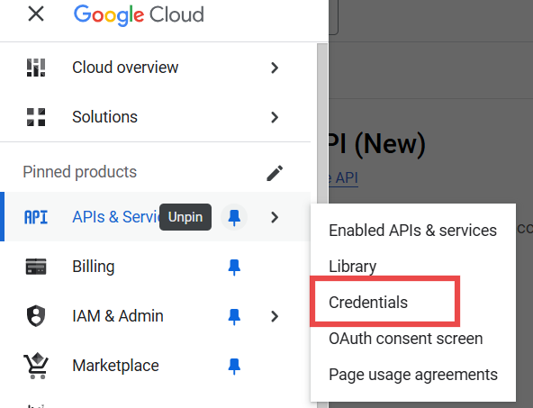
2.  **Create Credentials:** Click on "+ CREATE CREDENTIALS" and select "API key".
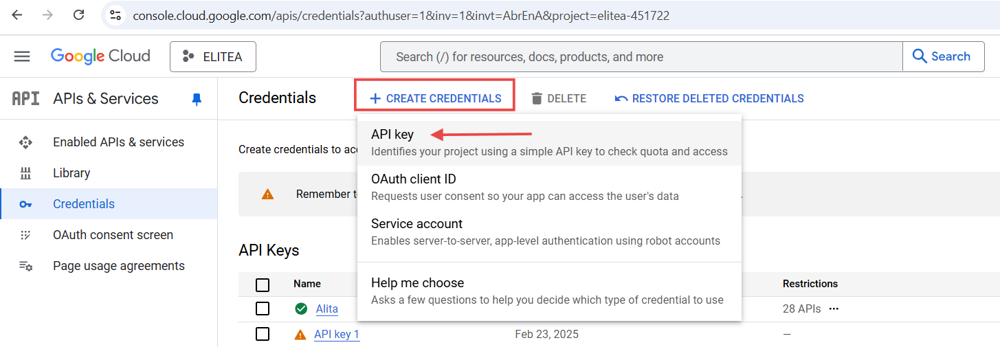
3.  **Restrict the API key (Important):** After the API key is generated, **immediately restrict it** to improve security. Click on "Restrict key".
4.  **Restrict Key Usage:** Under "API restrictions", select "Restrict key" and choose the "Places API". This ensures the key can only be used for the Places API.
5.  **Save Changes:** Click "Save" to apply the restrictions.
6.  **Securely Store Your API Key:** **Immediately copy the generated API Key.** Store it securely using a password manager or ELITEA's built-in Secrets feature (recommended for enhanced security within ELITEA). You will need this API key to configure the Google Places toolkit in ELITEA.

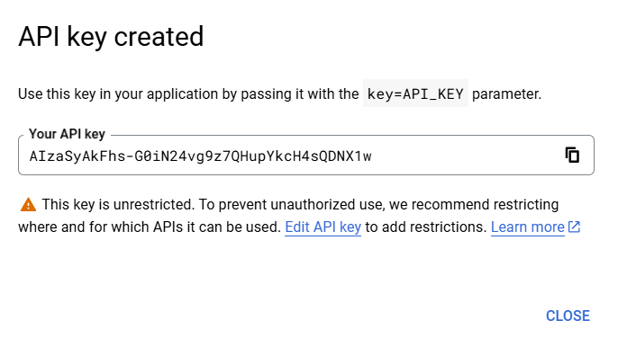

## Google Places Integration with ELITEA

### Agent Creation/Configuration

To integrate Google Places, you'll need to configure it within an ELITEA Agent. You can either create a new Agent or modify an existing one.

1.  **Navigate to Agents:** In ELITEA, go to the **Agents** menu.
2.  **Create or Edit Agent:**
    *   **New Agent:** Click **"+ Agent"** to create a new Agent. Follow the steps to define Agent details like name, description, type, and instructions.
    *   **Existing Agent:** Select the Agent you want to integrate with Google Places and click on its name to edit.
3.  **Access Tools Section:** In the Agent configuration, scroll down to the **"Tools"** section.

### Toolkit Configuration

This section details how to configure the Google Places toolkit within your ELITEA Agent.

1.  **Add Toolkit:** In the "Tools" section, click the **"+" icon**.
2.  **Select Google Places:** Choose **"Google Places"** from the dropdown list of available toolkits. This opens the "New Google Places tool" configuration panel.
3.  **Configure Toolkit Details:** Fill in the following fields:

    *   **Name:** Enter a **Name** for this Google Places toolkit instance. Choose a descriptive name that helps you identify its purpose within your Agent's instructions (e.g., "LocationFinder", "PlacesAPI").
    *   **Description:** Provide a **Description** for the toolkit, clarifying its purpose or the specific type of location information it will access (e.g., "Toolkit to find nearby restaurants").
    *   **Results number (to show):** Specify the **number of results** to return from the Google Places API.
    *   **Api Key:**
        *   Paste the **API Key** you generated in Google Cloud into the "Api Key" field.
        *   **Enhanced Security with Secrets:** For improved security, it's highly recommended to use **"Secret"**. Select **"Secret"** and choose a pre-configured secret from the dropdown. You must first create and securely store your **API Key** as a Secret in ELITEA's [Secrets](../../atform-documentation/menus/settings.md#secrets) feature. Using Secrets prevents hardcoding sensitive credentials directly in the toolkit configuration.

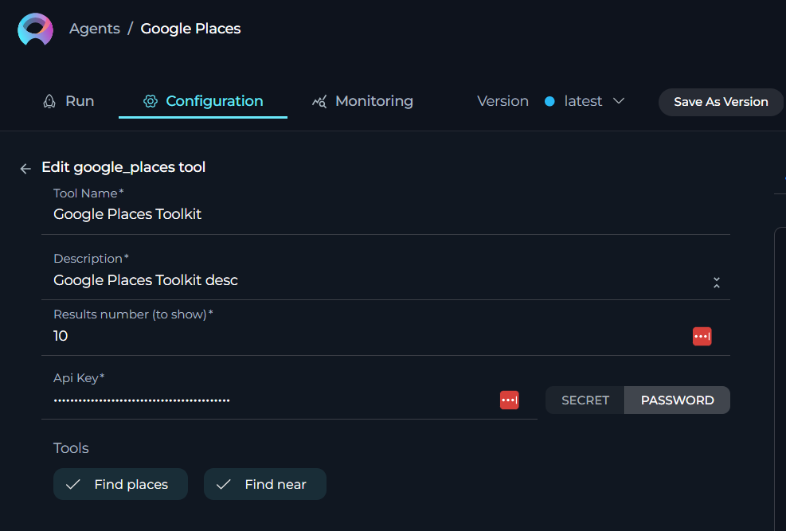

4.  **Enable Tools:** In the "Tools" section of the Google Places toolkit configuration, **select the checkboxes next to the Google Places tools** you want to enable for your Agent. **Enable only the tools your Agent will actually use** to adhere to the principle of least privilege and enhance security. Available tools are:
    *   **Find places:** `find_places` - Allows the Agent to find places based on a search query.
    *   **Find near:** `find_near` - Enables the Agent to find places near a specified location.

5.  **Complete Configuration:** Click the **arrow icon** (at the top right of the toolkit configuration) to save the Google Places toolkit setup and return to the main Agent configuration.
6.  Click **Save** to apply configuration and changes.

### Tool Overview

The Google Places toolkit provides the following tools for your ELITEA Agents:

*   **Find places:** `find_places` - Finds places based on a search query.
*   **Find near:** `find_near` - Finds places near a specified location.

## Instructions and Prompts for Using the Toolkit

To instruct your ELITEA Agent to use the Google Places toolkit, you need to provide clear instructions within the Agent's "Instructions" field. These instructions guide the Agent on *when* and *how* to use the available tools.

### Instruction Creation for OpenAI Agents

When creating instructions for the Google Places toolkit for OpenAI-based Agents, focus on clear, action-oriented language. Break down tasks into simple steps and explicitly state the parameters required for each tool. OpenAI Agents respond best to instructions that are:

*   **Direct and Imperative:** Use action verbs and clear commands (e.g., "Use the 'find_places' tool...", "Find places near...").
*   **Parameter-Focused:** Clearly list each parameter and how the Agent should determine its value.
*   **Context-Aware:** Provide enough context so the Agent understands the overall goal and when to use specific tools within a workflow.

When instructing your Agent to use a Google Places toolkit, use this pattern:
```
1. Identify the goal: [State the objective, e.g., "To find nearby restaurants"].
2. Tool Selection: Use the "[tool_name]" tool.
3. Parameter Specification: Provide the following parameters:
    - Parameter Name 1: <value or description of value>
    - Parameter Name 2: <value or description of value>
    - ...
4. Expected Outcome: [Optionally, describe what should happen after the tool is used].
```

**Example Agent Instructions for Google Places Toolkit Tools:**

*   **Agent Instructions for Finding Places:**

    ```
    1. Goal: To find Italian restaurants in New York City.
    2. Tool: Use the "find_places" tool.
    3. Parameters:
        - Query: "Italian restaurants"
        - Location: "New York City"
    4. Outcome: The Agent will provide a list of Italian restaurants in New York City.
    ```

*   **Agent Instructions for Finding Places Near a Location:**

    ```
    1. Goal: To find coffee shops near Times Square in New York City.
    2. Tool: Use the "find_near" tool.
    3. Parameters:
        - Location: "Times Square, New York City"
        - Query: "coffee shops"
    4. Outcome: The Agent will provide a list of coffee shops near Times Square in New York City.
    ```

### Conversation Starters

Use these conversation starters to interact with your Google Places-integrated Agent.

**1. For Testing and Troubleshooting Connection:**

These starters are designed to verify if the Google Places toolkit is correctly configured and connected to the Google Places API.

*   "Find Italian restaurants in Rome." - *This tests basic connectivity and ability to find places.*
*   "Find coffee shops near the Eiffel Tower in Paris." - *This further tests the 'find near' functionality and location-based searching.*

**2. For General Agent Usage Scenarios:**

These starters demonstrate how to initiate agent execution for common Google Places-related tasks.

*   "I'm looking for a good pizza place near me. Can you find some options?" - *This triggers a `find_near` search based on the user's implied location (which the Agent would need to determine or ask for).*
*   "Find the opening hours for the Louvre Museum in Paris." - *This would require a combination of `find_places` to locate the Louvre and then potentially another call to retrieve details (if the toolkit was expanded to support that).*
*   "What are some popular tourist attractions in Tokyo?" - *This could use the `find_places` tool with a general query.*

These conversation starters provide a starting point for interacting with your Google Places-integrated ELITEA Agent and can be customized further based on your specific use cases and workflows.

## Use Cases

The Google Places toolkit unlocks numerous automation possibilities for location-aware applications and workflows within ELITEA. Here are some key use cases, demonstrating how each tool can be applied:

*   **Automated Restaurant Recommendation:**
    *   **Scenario:** A user asks for a restaurant recommendation near their current location.
    *   **Tools Used:** `find_near`
    *   **Example Instruction:** "If the user asks for a restaurant recommendation near their location, use the 'find_near' tool with their location and the query 'restaurants'."
    *   **Benefit:** Provides personalized recommendations based on proximity.

*   **Travel Planning Assistance:**
    *   **Scenario:** An Agent assists a user in planning a trip by finding points of interest in a specific city.
    *   **Tools Used:** `find_places`
    *   **Example Instruction:** "If the user is planning a trip to Rome, use the 'find_places' tool with the location 'Rome' and the query 'tourist attractions'."
    *   **Benefit:** Streamlines travel planning with automated location discovery.

*   **Real-time Location-Based Alerts:**
    *   **Scenario:** The Agent can send alerts when a user is near a specific type of place.
    *   **Tools Used:** `find_near`
    *   **Example Instruction:** "Use the 'find_near' tool to check if the user is near a Starbucks. If a Starbucks is found within 500 meters, send an alert."
    *   **Benefit:** Enables timely and relevant notifications based on location.

*   **Enhanced Customer Support:**
    *   **Scenario:** The Agent can help customers find the nearest branch of a store or service provider.
    *   **Tools Used:** `find_near`, `find_places`
    *   **Example Instruction:** "If a customer asks for the nearest branch of 'XYZ Bank', use the 'find_near' tool with the customer's location and the query 'XYZ Bank'."
    *   **Benefit:** Improves customer service with quick and accurate location information.

## Troubleshooting and Support

### Troubleshooting

*   **Connection Issues:**
    *   **Problem:** Agent fails to connect to Google Places API, resulting in errors during toolkit execution.
    *   **Troubleshooting Steps:**
        1.  **Verify API Key:** Ensure the API Key is correctly entered.
        2.  **API Restrictions:** Review the API Key restrictions in Google Cloud Console. Ensure the "Places API" is selected under API restrictions.

*   **Authorization Errors (Permission Denied):**
    *   **Problem:** Agent receives "Permission Denied" or "Unauthorized" errors when accessing the Google Places API.
    *   **Troubleshooting Steps:**
        1.  **API Key Restrictions:** Re-verify the API Key restrictions. Ensure the "Places API" is selected. Check for any IP address restrictions that might be blocking ELITEA.
        2.  **API Enabled:** Double-check that the Places API is enabled in your Google Cloud project.

*   **No Results Found:**
    *   **Problem:** Agent returns no results for a search query.
    *   **Troubleshooting Steps:**
        1.  **Query Accuracy:** Check the accuracy of the search query. Ensure it is specific enough to find the desired places.
        2.  **API Usage Limits:** Check your Google Cloud Console for any API usage limits that may have been reached.

### Support Contact

For any issues, questions, or further assistance with the Google Places integration or ELITEA Agents, please reach out to our dedicated ELITEA Support Team. We are committed to providing prompt and effective support to ensure your success with ELITEA.

**Contact ELITEA Support:**

*   **Email:** **[SupportAlita@epam.com](mailto:SupportAlita@epam.com)**

**Best Practices for Effective Support Requests:**

To help us understand and resolve your issue as quickly as possible, please ensure you provide the following information in your support email:

*   **ELITEA Environment:** Clearly specify the ELITEA environment you are using (e.g., "Nexus," "Alita Lab," "EYE").
*   **Project Details:** Indicate the **Project Name** and whether you are working in your **Private** workspace or a **Team** project.
*   **Detailed Issue Description:** Provide a clear, concise, and detailed description of the problem you are encountering. Explain what you were trying to do, what you expected to happen, and what actually occurred.
*   **Relevant Configuration Information:** To help us diagnose the issue, please include relevant configuration details, such as:
    *   **Agent Instructions (Screenshot or Text):** If the issue is with an Agent, provide a screenshot or copy the text of your Agent's "Instructions" field.
    *   **Toolkit Configurations (Screenshots):** If the issue involves the Google Places toolkit or other toolkits, include screenshots of the toolkit configuration settings within your Agent.
*   **Error Messages (Full Error Text):** If you are encountering an error message, please provide the **complete error text**. In the Chat window, expand the error details and copy the full error message. This detailed error information is crucial for diagnosis.
*   **Your Query/Prompt (Exact Text):** If the issue is related to Agent execution, provide the exact query or prompt you used to trigger the issue.

**Before Contacting Support:**

We encourage you to first explore the resources available within this guide and the broader ELITEA documentation. You may find answers to common questions or solutions to known issues in the documentation.

