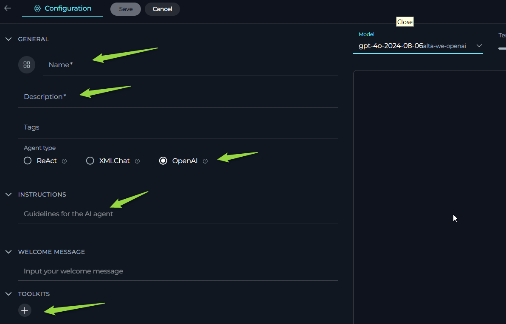
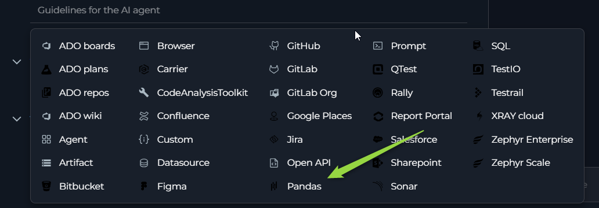
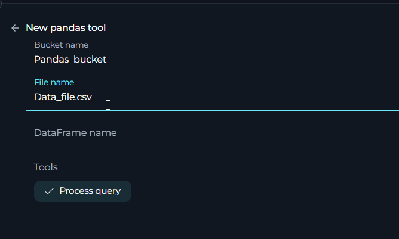

# ELITEA Agent Toolkit Guide: Pandas Integration

## Introduction

### Purpose and Overview

This guide is designed to assist users in setting up and utilizing the **Pandas Toolkit** within the ELITEA application. It provides detailed instructions on configuring the toolkit and integrating it into ELITEA agents. This integration empowers agents to leverage the powerful data analysis capabilities of the Pandas Python library directly within ELITEA, enabling efficient data manipulation, exploration, and analysis within AI-driven workflows.

### Brief Overview of the Pandas Toolkit

The Pandas Toolkit within ELITEA offers a simple yet powerful integration with the Pandas Python library. It allows ELITEA agents to analyze data files stored as artifacts, as well as data provided directly within the agent's context (though context size may impose limitations on large datasets). Key capabilities include:

*   **Data Analysis:** Agents can perform a wide range of data analysis tasks using Pandas functions, including data exploration, filtering, aggregation, and more.
*   **Artifact Data Integration:** Seamlessly analyze data stored in artifact files within ELITEA, leveraging the Artifact Toolkit for data storage and retrieval.
*   **Contextual Data Processing:** Analyze data directly provided within the agent's conversation context, allowing for dynamic data analysis based on user input or workflow context.

**Important Note:** The Pandas Toolkit is designed for data analysis and processing within the ELITEA context. It does **not** provide functionalities for saving or directly modifying data files. All calculations and data manipulations are performed virtually within the agent's context. To persist results or modified data, you will need to use other ELITEA toolkits, such as the Artifact Toolkit, or copy the output.

## Toolkit Setup and Configuration

### Integration with ELITEA

To configure the Pandas Toolkit for use with an ELITEA agent, follow these steps:

1.  **Navigate to ELITEA Agents:** Access the Agent configuration section within your ELITEA instance.

2.  **Configure a New Agent (or Edit Existing):**
    *   Create a new agent or modify an existing one.
    *   Define the **Agent Name**, **Description**, and **Instructions** that guide the agent's behavior when using the Pandas Toolkit.
    *   Select an appropriate **Agent Type** for your workflow, such as "OpenAI" Agent.

    

3.  **Add Pandas Tool:** Within the Agent configuration, locate the "Tools" section and click the **"+" (Add Tool)** icon.

4.  **Select Pandas Toolkit:** From the dropdown list of available toolkits, choose **"pandas"**.

     

5.  **Pandas Tool Configuration:** The "New pandas tool configuration" section will appear. Configure the following:

    *   **Name:**  Enter a descriptive name for your Pandas Toolkit instance (e.g., "DataAnalyzer", "PandasForArtifacts").
    *   **Description:** Provide a brief description outlining the purpose of this Pandas Toolkit instance (e.g., "Used for analyzing data files from artifacts").
    *   **Bucket Name (Optional):**  Specify the name of the Artifact bucket where the data file you intend to analyze is stored. This field is optional. You can also provide data directly in the agent's context, or specify the bucket and filename in the agent's instructions.

    *   **File Name (Optional):** Select the specific filename from the chosen Artifact bucket that you want the Pandas Toolkit to work with by default. This field is optional.
    
    *   **DataFrame name (Optional):** Select the specific data frame from the chosen Artifact bucket that you want the Pandas Toolkit to work with by default. This field is optional. You can also specify the filename only and data frame will be created from specified file.
    
6.  **Select Tool:** Choose the **"Process query"** tool by selecting the checkbox next to it. Currently, this toolkit provides a single core tool for processing Pandas queries.

    *   **Process query Tool:**
        *   **Functionality:** Applies Pandas functions and operations to a dataset.
        *   **Purpose:** To execute a wide range of data analysis tasks using the full capabilities of the Pandas library, as applicable within the ELITEA Agent Toolkit environment.

7.  **Save Configuration:** Click the **"Save"** button to save the Pandas Toolkit configuration for your agent.

      

### File Types Supported

Currently, the Pandas Toolkit can work with test files e.g. `.csv`,`.json`,`.txt`,`.tsv`, and also can work with pandas dataframe files like `.pkl` file format. While mantioned and all other text-based file formats might be usable, they may require additional instructions or encounter limitations with certain Pandas queries due to format-specific parsing nuances. 
Limitations:
Non-text file formats like spreadsheet files (Excel) cannot be imported directly into the toolkit, and conversions to supported text formats (e.g., .csv) must be done externally.

### Retrieving the data:

Pandas toolkit prioritizes retrieving the data based on the following order:

1. **Dataframe from Artifacts (df_name):**
     - If `dataframe_name` is provided, the function attempts to download a dataframe artifact with the specified name from the configured bucket.
     - This method is prioritized if both `dataframe_name` and `file_name` are provided.

2. **Data from Artifacts (file_name):**
     - If `dataframe_name` is not provided, but `file_name` is provided, the function attempts to download a file artifact with the specified name from the configured bucket.
     - It then reads the file content as a CSV to construct the dataframe.

3. **Data= from Context Data (No names provided):**
     - If both `dataframe_name` and `file_name` are left empty, the function expects the dataframe data to be provided directly within the context of the function call.
   **Important Note:** When providing data directly in the context, be mindful of the Large Language Model's (LLM) token window limitations. Ensure that the size of the data is within the acceptable token limits to avoid truncation or errors during processing.  While this method offers flexibility for smaller datasets, it's crucial to manage data size effectively for optimal performance and to stay within the LLM's processing capacity.

Note: `dataFrame_name` and `file_name` are optional parameters. You can choose to provide either, one of them ( recommended), both (not recommended) (in which case `dataFrame` is used), or neither, depending on where your dataframe data originates.

**Important Notes on Data Handling:**

*   **No Data Persistence:** The Pandas Toolkit **cannot save or modify data files directly**. Any data transformations or analyses are performed in memory within the agent's context and are not written back to the original artifact file or any persistent storage by the toolkit itself.
*   **Virtual Modifications:** While you can use Pandas functions to modify data (e.g., add columns, filter rows), these modifications are **virtual and exist only within the agent's current context**. The original data file in the artifact bucket remains unchanged.
*   **Artifact Toolkit Integration:** To save processed data or analysis results persistently, you will need to use the Artifact Toolkit's tools (e.g., `create_file`, `append_data`) in conjunction with the Pandas Toolkit to explicitly save the desired output to an artifact file.

### Bucket Accessibility and Security

The Pandas Toolkit leverages the Elitea Artifact functionality for accessing data files. Therefore, it inherits the same bucket accessibility and security characteristics as described in the [Artifact Toolkit Guide](../../platform-documentation/menus/artifacts.md#artifacts), and [Artifact Functionality Section](../../platform-documentation/menus/artifacts.md)

*   **Project-Specific Buckets:** Buckets are project-specific and not accessible across different ELITEA projects.
*   **Project Member Access:** Project members with access to agents using the Artifact Toolkit or artifact functionality can potentially access data files in configured buckets.
*   **Shared Bucket Usage (Caution):** Using the same bucket across multiple agents or users requires careful consideration to avoid data conflicts or unintended modifications by different operations.
*   **Security Considerations:** Avoid storing sensitive or confidential information in Artifact buckets without appropriate security measures, as project members with agent access can potentially access the data.

### Artifact Retention

Data files stored in Artifact buckets and used by the Pandas Toolkit are subject to the same default retention period and retention management policies as described in the [Artifact Functionality Section](../../platform-documentation/menus/artifacts.md):

*   **Retention Management:** Retention periods can be viewed and potentially modified from the Artifacts menu.
*   **Manual Deletion:** Files and buckets can be manually deleted from the Artifacts menu.

## Artifact Functionality Section

### Use Cases

The Pandas Toolkit empowers ELITEA agents to perform a wide range of data analysis tasks. Here are some practical use cases illustrating how you can leverage the Pandas Toolkit for data analysis within ELITEA workflows:

*   **1. Data Exploration and Initial Analysis from Artifact Files:**
    *   **Scenario:** You have uploaded a CSV data file to an Artifact bucket and want to quickly explore its contents, understand its structure, and get initial summary statistics using Pandas.
    *   **Tools Used:** `process_query` (Pandas Toolkit)
    *   **Example Instructions:** ```
            1. Use the 'process_query' tool to analyze the data from the file named 'sales_data.csv' in the 'data-bucket' artifact bucket.
            2. As a first step, use the Pandas function `df.head()` to display the first few rows of the dataset to understand its structure.
            3. Then, use `df.describe()` to get summary statistics for the numerical columns in the dataset.
            4. Finally, use `df.info()` to get information about data types and missing values in the dataset.
        ```
    *   **Prompts Examples:**
        *   "Show me the first 5 rows of the sales data"
        *   "Describe the numerical columns in the sales data"
        *   "Get information about the sales data"
    *   **Benefit:** Allows for rapid data exploration and understanding of datasets stored in artifacts, providing initial insights into data structure, content, and key statistics. Aligns with Pandas "Data Exploration" use cases.Most probably `df.head()` `df.describe()` and `df.info()` pandas functiosn will be used on provided data to get info about it.

*   **2. Calculating Key Metrics and Aggregations:**
    *   **Scenario:** You need to calculate specific metrics or aggregations from a .pkl dataframe file in artifacts, such as calculating the average price of products, the maximum quantity sold, or the total sales revenue.
    *   **Tools Used:** `process_query` (Pandas Toolkit)
    *   **Example Instructions:**
        ```
             1. Use the 'process_query' tool to analyze the 'product_data.csv' file from the 'metrics-bucket' artifact bucket.
             2. Calculate the average price of products using the Pandas function `df['Price'].mean()`.
             3. Calculate the maximum quantity of any product sold using `df['Quantity'].max()`.
             4. Calculate the total sales revenue (assuming columns 'Price' and 'Quantity' represent price and quantity sold) using `(df['Price'] * df['Quantity']).sum()`.
             5. Present the calculated average price, maximum quantity, and total sales revenue to the user.
        ```
    *   **Prompts Examples:**
        *   "What is the average price of products? Use `df['Price'].mean()`."
        *   "What is the maximum quantity sold? Use `df['Quantity'].max()`."
        *   "Calculate the total sales revenue. Use `(df['Price'] * df['Quantity']).sum()`."
    *   **Benefit:** Enables automated calculation of key metrics and aggregations from artifact data, providing valuable insights for reporting, analysis, and decision-making. Aligns with Pandas "Aggregation" use cases.

*   **3. Column Selection and Data Extraction:**
    *   **Scenario:** You only need to extract specific columns from a large file in artifacts for further processing or to present a simplified view of the data.
    *   **Tools Used:** `process_query` (Pandas Toolkit)

    *   **Example Instructions:**
            ```
            1. Use the 'process_query' tool to analyze 'full_product_catalog.csv' from the 'catalog-bucket' artifact bucket.
            2. Select only the 'ProductName' and 'Price' columns from the dataset using Pandas column selection 
            3. Display the selected 'ProductName' and 'Price' columns to the user in a table format.
            ```
    *   **Prompts Examples:**
                *   "Show me only the 'ProductName' and 'Price' columns from the product catalog. 
                *   "Extract 'ProductName' and 'Price' columns and display the first 10 rows.
    *   **Benefit:** Enables efficient data extraction and presentation by selecting only relevant columns, reducing data complexity and focusing on the essential information needed for a specific task or user view. Aligns with Pandas "Column Selection" use cases. (e.g., `df[['ProductName','Price']]`or `df[['ProductName', 'Price']].head(10)` pandas function will be used to get required info.)

*   **4. Analyzing Data Directly from Context (Limited Data Size):**
    *   **Scenario:** You have a small dataset provided directly within the ELITEA agent's conversation context (e.g., copied and pasted data, or data generated by a previous tool in the workflow), and you want to perform quick analysis without needing to store it as an artifact file first.
    *   **Tools Used:** `process_query` (Pandas Toolkit)
    *   **Example Instructions:**
            ```
            1. Assume the user has provided data directly in the conversation context.
            2. Use the 'process_query' tool to analyze the data provided in the context.
            3. Calculate the average of the first column (assuming it's numerical) using Pandas.
            4. Display the calculated average to the user.
            ```
    *   **Prompts Examples:**
        *   "Analyze this data (provide CSV data in prompt). What is the average of the first column? 
        *   "Analyze this data (provide CSV data in prompt). Show me the last 3 rows using `df.tail(3)`."
    *   **Benefit:** Allows for immediate, in-context data analysis for small datasets, enabling quick data exploration and calculations without the need for artifact file management. Useful for ad-hoc data analysis or when data is dynamically generated within a workflow. Useed function e.g. `df.iloc[:, 0].mean()`."
 
## Troubleshooting and Support

### Troubleshooting

1.  **File Can't Be Found:**

    *   **Problem:** Agent reports that the specified file cannot be found when using the Pandas Toolkit.
    *   **Troubleshooting Steps:**
        *   **Check Bucket Name:** Verify that the **Bucket Name** specified in the Pandas Toolkit configuration and in your agent instructions (if explicitly provided) is correct and matches the name of an existing Artifact bucket in your ELITEA project.
        *   **Verify File Name:** Double-check the **File Name** specified in the Pandas Toolkit configuration and in your agent instructions (if explicitly provided). Ensure the filename is spelled correctly, including the file extension (`.csv`), and that the file actually exists in the specified Artifact bucket.
        *   **List Files (Artifact Toolkit):** Intreduse Artifact toolkit and use the "List Files" tool from the Artifact Toolkit (if configured in the same agent) to list the contents of the specified bucket and confirm that the file exists and the filename is correct.

2.  **Data Analysis Errors:**

    *   **Problem:** Agent returns errors during the execution of Pandas queries, indicating issues with data processing.
    *   **Troubleshooting Steps:**
        *   **Verify Pandas Query Syntax:** Double-check the syntax of the Pandas query you are using in your Agent instructions. Ensure that the Pandas function names, column names, and expressions are correctly spelled and formatted according to Pandas documentation.
        *   **Check Column Names:** Ensure that you are using **correct column names** from your CSV file in your Pandas queries. Column names are case-sensitive and must exactly match the column headers in your data file. Use `df.columns` (or `df.head()` and inspect column names) to verify the exact column names in your dataset.
        *   **File Type Compatibility:** Confirm that you are using text file, Insure the extantion or other specifics are mantioned in the instructions.Text file formats are generally compatible with Pandas (for basic text-based data). While all text formats *might* work, `.csv` is the common and reliably supported format for the Pandas Toolkit.
        *   **Data Format Issues:** Inspect your data file for potential formatting issues that might cause Pandas parsing errors (e.g., inconsistent delimiters, unexpected characters, malformed CSV or json structure). Ensure your file is well-formed and valid.
        *   **Instructions Provided to LLM:** Verify that the instructions provided to the language model are clear and unambiguous, enabling it to correctly interpret your intent and translate it into valid Pandas queries.

3.  **Error about missing numpy._core lib:**

    *   **Problem Description:** When using DataFrame files e.g. ".pkl", the agent returns errors during the execution of Pandas queries, indicating a missing numpy._core lib.
    *   **Troubleshooting Steps:**
        *   **File Type Compatibility:**  The file was most likely created using a Pandas version that is not compatible with the version currently used in Alita (`2.2.3`).
    *   **Resolution:**
        *   **Use Compatible Pandas Version:** Use `pandas==2.2.3` to create the dataframe file.
        *   **Convert File Format:** Alternatively, convert the data to a more compatible file format such as CSV or another file type that can be used instead of a DataFrame file

## FAQs

**Q: Can the Pandas Toolkit work with file types other than CSV and json?**

**A:** Pandas Toolkit be possible to use other text-based file formats. However, using non structured files like txt may require additional instructions to guide the agent in parsing the data correctly, and some Pandas queries might not work as expected due to format-specific nuances.

**Q: Can the Pandas Toolkit save or modify data files?**

**A:** No, the Pandas Toolkit is designed for data analysis and processing only. It **cannot save or modify data files** directly. Any data transformations or analyses are performed virtually within the agent's context and are not persisted by the toolkit itself. To save processed data, use the Artifact Toolkit to create or append data to artifact files.

**Q: Do I need to specify the filename in the Toolkit configuration?**

**A:** Specifying the filename in the Toolkit configuration is optional if the data is provided in the context. However, if you need to analyze a file from the bucket, you will need to provide either the filename or the DataFrame name. Also, providing the filename in instructions allows for more consistent results when using the Pandas toolkit.

**Q: What happens if I don't specify a filename in either the toolkit configuration or agent instructions?**

**A:** If you do not specify a filename in either the toolkit configuration or your agent instructions, the Pandas Toolkit will not be able to locate a data file to analyze, and you will likely encounter "file not found" errors or empty data processing results. Ensure that you provide a valid filename (and bucket name, if necessary) either in the toolkit configuration or within your agent instructions when using the `process_query` tool.

**Q: Can I use complex Pandas functions and operations with this toolkit?**

**A:** Yes, the Pandas Toolkit is designed to provide access to a wide range of Pandas functions and operations that are applicable within the ELITEA Agent Toolkit environment. You can use various Pandas functionalities for data exploration, filtering, aggregation, column manipulation, and more. However, extremely complex or computationally intensive Pandas operations might be limited by the resources and context size available within the ELITEA Agent environment. For very complex data analysis tasks, consider breaking down the workflow into smaller steps or pre-processing data outside of ELITEA if needed.

**Q: Can I use Pandas toolkit to create graphical representations of data?**

**A:** No, the Pandas toolkit does not allow you to create histograms or plots directly. However, if you have data, you can easily generate code that will create graphics in popular graphic creation applications like Mermaid.

## Support and Contact Information

If you encounter any persistent issues, have questions not covered in this guide, or require further assistance with the Pandas Toolkit or ELITEA Agents, please contact the ELITEA Support Team:

*   **Email:** SupportAlita@epam.com

Please provide the following details in your support request to help us assist you efficiently:

*   **ELITEA Environment:** (e.g., "Nexus," "Alita Lab," "EYE")
*   **Project Details:** Project Name, Private or Team project.
*   **Detailed Issue Description:** Clear explanation of the problem, steps to reproduce, expected vs. actual behavior.
*   **Relevant Configuration Information:**
    *   Agent Instructions (screenshot or text)
    *   Pandas Toolkit Configuration (screenshots)
    *   Error Messages (full error text from chat window details)
*   **Your Query/Prompt:** Exact text used to trigger the issue.
*   **Example Data (if applicable and safe to share):**  If your issue is data-related, providing a sanitized example of your CSV data file or the data you are trying to analyze can be very helpful for troubleshooting.

**Before Contacting Support:**

We encourage you to first explore the resources available within this guide and the broader ELITEA documentation. You may find answers to common questions or solutions to known issues in the documentation.

## Useful Links

### External Resources

To further enhance your understanding and skills in using the Pandas Toolkit with ELITEA, here are some helpful external resources:

*   **Pandas Official Documentation:** [https://pandas.pydata.org/docs/](https://pandas.pydata.org/docs/) - *The complete and official documentation for the Pandas Python library. A comprehensive resource for learning about all Pandas functionalities, API, and usage examples.*
*   **[ELITEA Artifacts Page:](../../platform-documentation/menus/artifacts.md#artifacts)** - *Refer to the ELITEA Artifacts page documentation for detailed information on using Artifacts for data storage, bucket management, and file handling within ELITEA, which is essential for using the Pandas Toolkit with artifact data files.*
*   **[ELITEA Agents Configuration:](../../platform-documentation/menus/agents.md)** - *Find out more about creating and configuring Agents in ELITEA, where you integrate the Pandas toolkit to automate your data analysis workflows.*