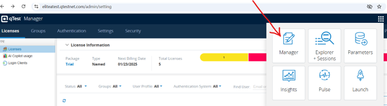
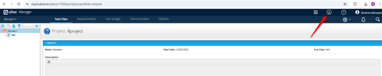
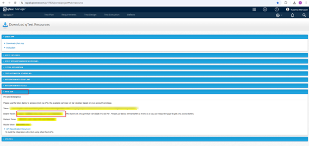
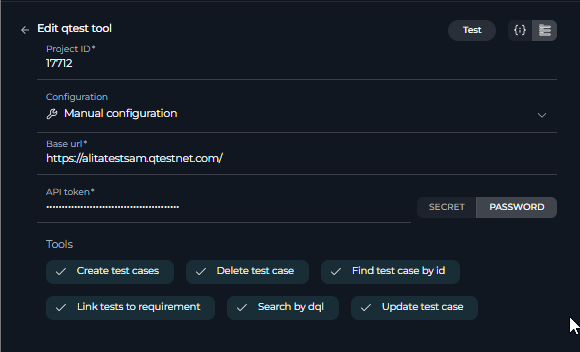

# ELITEA Toolkit Guide: qTest Integration

## Introduction

### Purpose of this Guide

This guide is your definitive resource for integrating and effectively utilizing the **qTest toolkit** within ELITEA. It provides a detailed, step-by-step walkthrough, from setting up your qTest API token to configuring the toolkit in ELITEA and seamlessly incorporating it into your Agents. By following this guide, you will unlock the power of automated test management, streamlined QA workflows, and enhanced collaboration between development and testing teams, all directly within the ELITEA platform. This integration empowers you to leverage AI-driven automation to optimize your qTest-driven workflows, enhance QA productivity, and improve software quality within your projects.

### Brief Overview of qTest

qTest, by Tricentis, is a leading cloud-based test management platform designed to centralize and streamline all aspects of software testing. It is widely used by QA teams to manage test cases, execute test runs, track defects, and generate comprehensive reports. qTest offers a wide array of functionalities, including:

*   **Centralized Test Case Management:** qTest provides a centralized repository for creating, organizing, and managing test cases, ensuring a structured and easily accessible test library for your QA team.
*   **Efficient Test Execution and Tracking:** Enables efficient test execution and real-time tracking of test runs, allowing QA teams to monitor progress, identify bottlenecks, and ensure timely test completion.
*   **Requirement and Defect Traceability:** qTest facilitates traceability by linking test cases to requirements and defects, providing a clear audit trail and ensuring comprehensive test coverage and issue tracking throughout the testing lifecycle.
*   **Comprehensive Reporting and Analytics:** Offers robust reporting and analytics capabilities, allowing QA teams to generate detailed reports on testing progress, quality metrics, defect trends, and test coverage, providing valuable insights for decision-making and continuous improvement.
*   **Agile and DevOps Integration:** qTest is designed to integrate seamlessly with Agile and DevOps workflows, supporting iterative testing, continuous testing practices, and integration with CI/CD pipelines and development tools, enabling efficient and agile QA processes.

Integrating qTest with ELITEA brings these powerful test management capabilities directly into your AI-driven workflows. Your ELITEA Agents can then intelligently interact with your qTest projects and test assets to automate test management tasks, enhance QA processes, improve test coverage, and leverage AI to optimize your entire software testing lifecycle within qTest.

## Toolkit's Account Setup and Configuration in qTest

### Account Setup

qTest is a commercial test management tool and is available as a trial version for a limited period. To create a qTest account, follow these steps:

1.  **Visit Tricentis Website:** Open your web browser and navigate to the official Tricentis qTest website: [https://www.tricentis.com/](https://www.tricentis.com/).
2.  **Navigate to Trials & Demos:** Click on **"Trials & demos"** in the main navigation menu to begin the trial registration process.
3.  **Find qTest and Start Free Trial:** On the "Trials & demos" page, locate the qTest section and click the **"Free trial"** button.
4.  **Fill in Registration Form:** The "Start your free 14-day Tricentis qTest Trial" message should be displayed, and a registration form will appear on the right side of the page. Provide the following basic information in the registration form:
    *   **Business email address:** Enter your business email address (preferably your company email). QTest typically provides free trials for business email IDs.
    *   **First Name:** Enter your first name.
    *   **Last Name:** Enter your last name.
    *   **Country:** Select your country from the dropdown menu.
    *   **Phone:** Enter your phone number.
    *   **Job Title:** Enter your job title.
5.  **Submit Registration Form:** After filling out the registration form, click the **"Next Page"** button to submit the form.
6.  **Create QTest Web Address and Account Details:** A new window will open, prompting you to fill in the details to create your new qTest web address and account credentials:
    *   **Username:** Your username is prefilled based on your account registration. You can modify it if needed.
    *   **Create Your QTest Web Address:** Enter a unique subdomain name in the field provided (e.g., `alitatest`). This subdomain will be used as part of your unique QTest web address to access your qTest trial account (e.g., `alitatest.qtestnet.com`).
    *   **Password:** Create a strong password for your QTest account. Use a combination of uppercase letters, lowercase letters, numbers, and special characters to create a secure password.
    *   **Confirm Password:** Re-enter the same password to confirm it.
    *   **qTest Data Storage Location:** Select a preferred data storage location from the dropdown menu. Choose a location that complies with your organization's data storage and compliance requirements (e.g., United States, Europe).
    *   **Privacy Policy Review:** Read the note regarding the data center location and compliance with jurisdictional laws. Review the Privacy Policy if necessary.
7.  **Start My Trial:** Once all fields are correctly filled, click the orange **"Start My Trial"** button to proceed and create your qTest trial account.
8.  **Check Your Email for Confirmation:** After submitting the form, you should receive a confirmation email from Tricentis qTest. This email may include a link to set up your qTest account and verify your email address. Follow the instructions in the email to complete the registration and activate your free trial.
9.  **Access qTest:** After verifying your email, you will be directed to the qTest platform. Log in using the username, password, and QTest web address you provided during registration.

### Token/API Key Generation: Finding API Token in qTest

To securely integrate ELITEA with qTest, you need to obtain your qTest API token. This token will be used by ELITEA to authenticate and access your qTest projects and test data.

**Follow these steps to find your API token in qTest:**

1.  **Log in to qTest:** Access your qTest instance by navigating to your qTest web address (e.g., `alitatest.qtestnet.com`) and logging in with your qTest credentials.
2.  **Access API & Webhooks Settings:** Once logged in, navigate to your user profile settings. The exact location may vary slightly depending on your qTest version, but it is typically found under your profile menu or user settings. Look for options like **"Integration Settings"**, **"API Access"**, or **"Webhooks"**. In newer versions of qTest, you can find it under **"Manager"** -> **"API & SDK"**.

    

    

3.  **Locate API Key/Token:** In the "API & SDK" settings, you should find your Token or Bearer Token. It may be labeled as **"Token"**, or **"Brstrt Token"**.
4.  **Copy and Store Your API Token:**  **Copy the API token** displayed on the page. **Store it securely** in a password manager or, preferably, ELITEA's built-in Secrets feature for enhanced security within ELITEA. You will need this API token to configure the qTest toolkit in ELITEA.



## System Integration with ELITEA

### Agent Creation/Configuration

To integrate qTest functionalities into your workflows, you will need to configure the qTest toolkit within an ELITEA Agent. You can either create a new Agent specifically for qTest interactions or modify an existing Agent to incorporate qTest tools.

1.  **Navigate to Agents Menu:** In ELITEA, go to the **Agents** menu from the main navigation panel.
2.  **Create or Edit Agent:**
    *   **Create a New Agent:** Click on the **"+ Agent"** button to create a new Agent. Follow the on-screen prompts to define essential Agent attributes such as Agent name, a descriptive Agent description, the desired Agent type, and initial instructions for the Agent.
    *   **Edit an Existing Agent:** Select the Agent you intend to integrate with qTest from your list of Agents. Click on the Agent's name to open its configuration settings for editing.
3.  **Access Tools Section:** Within the Agent configuration interface, scroll down until you locate the **"Tools"** section. This section is where you will add and configure toolkits, including the qTest toolkit.

### Toolkit Configuration

This section provides detailed instructions on how to configure the qTest toolkit within your ELITEA Agent.

1.  **Add Toolkit:** In the "Tools" section of the Agent configuration, click on the **"+" icon**. This action will display a dropdown list of available toolkits that can be integrated with your Agent.
2.  **Select qTest Toolkit:** From the dropdown list of available toolkits, choose **"qTest"**. Selecting "qTest" will open the "New qTest tool" configuration panel, where you will specify the settings for your qTest integration.
3.  **Configure qTest Toolkit Settings:** Carefully fill in the following configuration fields within the "New qTest tool" section:

    *   **Name:**  Enter a descriptive **Name** for your qTest toolkit instance. Choose a name that is easily recognizable and helps you identify its purpose within your Agent's instructions (e.g., "ProjectQTest", "TestManagementAccess", "QTestIntegration").
    *   **Description:** Provide a concise **Description** for the toolkit. This description should clarify the toolkit's purpose or the specific qTest project it is intended to access (e.g., "Toolkit for accessing and managing test cases in qTest", "Integration for qTest Project 'Project Alpha'").
    *   **Base URL:** Enter the base URL of your qTest instance API endpoint. **Ensure you use the correct format**: `https://qtest.example.com` (Replace `qtest.example.com` with your actual qTest subdomain).
    *   **Project ID:** Enter the **Project ID** of the specific qTest project you want to connect to with this toolkit. The Project ID is a numerical identifier for your qTest project. You can typically find the Project ID in your qTest project settings or in the URL when you are within your qTest project.
    *   **Authentication Options - API Token:** Select the **"API Token"** authentication option.
        *   **Password/Secret:** Choose **"Password"** and paste the **Bearer token** you obtained from qTest (during the "Software-Specific Setup" section of this guide) into the **"Password"** field.
        *   **Enhanced Security with Secrets (Recommended):** For enhanced security, it is strongly recommended to use ELITEA's **Secrets Management** feature to store your qTest API token securely. Instead of directly pasting the token into the "Password" field, select the **"Secret"** option and choose the pre-configured secret containing your qTest API token from the dropdown list. This prevents hardcoding sensitive credentials in your toolkit configuration.

    

4.  **Enable Desired Tools:** In the "Tools" section within the qTest toolkit configuration panel, **select the checkboxes next to the specific qTest tools** that you want to enable for your Agent. **It is crucial to enable only the tools that your Agent will actually need to use** to adhere to the principle of least privilege and minimize potential security risks. Available tools include:
    *   **Search by DQL** - Allows searching for test cases using qTest DQL queries.
    *   **Create test cases** - Enables the Agent to create new test cases in qTest.
    *   **Update test case** - Allows the Agent to update existing test cases in qTest.
    *   **Find test case by ID** - Enables the Agent to retrieve a specific test case by its ID.
    *   **Delete test case** - Allows the Agent to delete test cases from qTest.
5.  **Complete Setup:** After configuring all the necessary settings and enabling the desired tools, click the **arrow icon** (located at the top right of the toolkit configuration section) to finalize the qTest toolkit setup and return to the main Agent configuration menu.
6.  Click **Save** in the Agent configuration to save all changes and activate the qTest toolkit integration for your Agent.

### Tool Overview: qTest Toolkit Functionalities

Once the qTest toolkit is successfully configured and added to your Agent, you can leverage the following tools within your Agent's instructions to enable intelligent interaction with your qTest projects and test assets:

*   **Search by DQL:**  **Tool Name:** `search_by_dql`
    *   **Functionality:** Allows Agents to search for test cases in qTest using Data Query Language (DQL) queries. Returns a list of test cases matching the DQL query.
    *   **Purpose:** Enables advanced and flexible test case searching based on complex criteria defined using DQL, allowing Agents to retrieve specific sets of test cases for reporting, analysis, test planning, or workflow automation based on qTest data.

*   **Create test cases:**  **Tool Name:** `create_test_cases`
    *   **Functionality:** Automates the creation of new test cases in qTest within a specified project and test suite. Allows for bulk creation of test cases using a list of test case details.
    *   **Purpose:** Streamlines test case authoring and test plan creation by enabling Agents to automatically generate new test cases in qTest directly from ELITEA workflows, based on requirements, user stories, or automated test generation processes, improving test coverage and reducing manual test case creation effort.

*   **Update test case:**  **Tool Name:** `update_test_case`
    *   **Functionality:** Allows Agents to modify and update fields of existing test cases in qTest. Requires the Test Case ID and a JSON object containing the fields to update and their new values.
    *   **Purpose:** Enables automated test case maintenance, allowing Agents to update test case steps, expected results, statuses, custom fields, or any other test case attributes based on changing requirements, test feedback, or workflow progress, ensuring test cases are always up-to-date and accurately reflect current testing needs.

*   **Find test case by ID:**  **Tool Name:** `find_test_case_by_id`
    *   **Functionality:** Retrieves detailed information about a specific test case from qTest using its unique Test Case ID. Returns comprehensive test case details, including steps, parameters, and custom fields.
    *   **Purpose:** Provides Agents with a quick and precise way to access detailed information for specific test cases, enabling efficient retrieval of test case details for test execution guidance, reporting, analysis, or incorporating test case information into ELITEA workflows.

*   **Delete test case:**  **Tool Name:** `delete_test_case`
    *   **Functionality:** Automates the deletion of a specific test case from qTest, identified by its Test Case ID.
    *   **Purpose:** Enables automated test case cleanup and test data management by allowing Agents to delete obsolete or redundant test cases from qTest, helping maintain a clean, organized, and efficient test case repository and reducing test data clutter.

## Instructions and Prompts for Using the qTest Toolkit

To effectively utilize the qTest toolkit within your ELITEA Agents, you need to provide clear and precise instructions within the Agent's "Instructions" field, telling the Agent *how* and *when* to use these tools.

**General Instruction Structure:**

When instructing your Agent to use a qTest tool, you will typically follow this pattern:

```
Use the "[tool_name]" tool to [describe the action you want to perform] in qTest.
Provide the following parameters:
- Parameter 1: <value or description of value>
- Parameter 2: <value or description of value>
- ...
```

**Example Agent Instructions for qTest Toolkit Tools:**

*   **Agent Instructions for Searching Test Cases using DQL:**

    ```
    Use the "search_by_dql" tool to search for test cases in qTest using a DQL query.
    Provide the following parameters:
    - DQL Query: "Project = 'Project Alpha' AND Status = 'Ready for Automation' AND Priority = 'High'"
    ```

*   **Agent Instructions for Creating New Test Cases:**

    ```
    Use the "create_test_cases" tool to create new test cases in qTest.
    Provide the following parameters:
    - Project ID: "12345"
    - Test Suite ID: "67890"
    - Test Cases Data (JSON Array):
      [
        {
          "Name": "Test Login Functionality - Positive Case",
          "Description": "Verify user login with valid credentials.",
          "Steps": "1. Open Login Page\n2. Enter valid username\n3. Enter valid password\n4. Click Login",
          "Expected Result": "User should be logged in successfully."
        },
        {
          "Name": "Test Login Functionality - Negative Case",
          "Description": "Verify user login with invalid credentials.",
          "Steps": "1. Open Login Page\n2. Enter invalid username\n3. Enter invalid password\n4. Click Login",
          "Expected Result": "Error message should be displayed."
        }
      ]
    ```

*   **Agent Instructions for Updating an Existing Test Case:**

    ```
    Use the "update_test_case" tool to update the description and status of an existing test case in qTest.
    Provide the following parameters:
    - Test Case ID: "7"
    - Fields to Update (JSON):
        {
          "description": "Updated description: Added more detailed steps for test execution.",
          "properties": {
            "Status": "Ready for Review"
          }
        }
    ```

**Important Considerations for Agent Instructions:**

*   **Tool Name Accuracy:** Ensure you use the correct **Tool Name** (e.g., `"search_by_dql"`, `"create_test_cases"`, `"update_test_case"`) as listed in the "Tool Overview" section. Typos or incorrect tool names will prevent the Agent from using the toolkit correctly.
*   **Parameter Clarity:** Clearly specify the **parameters** required for each tool and provide instructions on where the Agent should obtain the values for these parameters (e.g., from user input, from previous steps in the workflow, or hardcoded values).
*   **Context and Examples:** Provide sufficient context and examples within your Agent's "Instructions" to guide the LLM in understanding *when* and *how* to use the qTest toolkit tools effectively within your desired workflow.
*   **qTest IDs and Names:** Ensure that you use the correct Project IDs, Test Suite IDs, Test Case IDs, Field Names, and other identifiers that accurately correspond to your qTest project and test assets. Incorrect IDs or names will lead to errors or incorrect tool execution.
*   **DQL Query Syntax:** When using the "Search by DQL" tool, ensure that you provide valid Data Query Language (DQL) query strings that adhere to qTest DQL syntax. Incorrect DQL syntax will result in search errors. Refer to qTest documentation for DQL syntax details. Use DWL to pre-filter data retrieved from qTest before it is processed by ELITEA Agents. Enter a valid DQL query string to filter test cases based on specific criteria. This ensures that only relevant data is fetched and processed, improving efficiency and reducing noise. Leave this field empty if no pre-filtering is needed.

## Best Practices and Use Cases for qTest Integration

### Best Practices for Efficient Integration

*   **Test Integration Thoroughly:** After setting up the qTest toolkit and incorporating it into your Agents, **thoroughly test each tool** you intend to use to ensure seamless connectivity, correct authentication, and accurate execution of qTest actions.
*   **Monitor Agent Performance and Usage:**  Regularly **monitor the performance of Agents** utilizing qTest toolkits. Track metrics such as task completion success rate, execution time, and error rates to identify any potential issues or areas for optimization in Agent instructions or toolkit configurations.
*   **Follow Security Best Practices:**
    *   **Use API Tokens:** Always use qTest API tokens instead of your main account password for integrations.
    *   **Grant Least Privilege:** While qTest API tokens have limited scope control, ensure you are generating tokens specifically for ELITEA integration and not reusing tokens with broader access.
    *   **Securely Store Credentials:** Utilize ELITEA's Secrets Management feature to securely store and manage your qTest API tokens instead of hardcoding them directly in Agent configurations.
*   **Provide Clear Instructions and Prompts:**  Craft clear and unambiguous instructions within your ELITEA Agents to guide them in using the qTest toolkit effectively. Use the prompt examples provided in this guide as a starting point and adapt them to your specific use cases.
*   **Start with Simple Use Cases:** Begin by implementing qTest integration for simpler automation tasks, such as searching for test cases or retrieving test case details, and gradually progress to more complex workflows as you gain experience and confidence with the toolkit.
*   **Optimize Performance with Advanced Settings:**  Leverage the "Advanced Settings" in the toolkit configuration, specifically "Test Cases per Page" and "DQL for qTest", to fine-tune data fetching parameters and optimize performance, especially when working with large qTest projects or complex queries.

### Use Cases for qTest Toolkit Integration

The qTest toolkit opens up a wide range of automation possibilities for test management, QA workflows, and reporting within ELITEA. Here are some compelling use cases:

*   **Automated Test Case Retrieval for Test Execution Guidance:**
    *   **Scenario:** Testers can use ELITEA Agents to quickly retrieve detailed steps and expected results for specific test cases from qTest, providing them with immediate access to test execution guidance directly within ELITEA.
    *   **Tools Used:** `find_test_case_by_id`, `read_file` (if test data is in external files)
    *   **Example Instruction:** "Use the 'find_test_case_by_id' tool to retrieve the test case with ID 'TC-12345'. Display the 'Name', 'Description', 'Steps', and 'Expected Result' fields to the tester."
    *   **Benefit:** Improves tester efficiency by providing instant access to test case details, eliminating the need to switch between ELITEA and qTest interfaces, streamlining test execution and reducing context switching.

*   **Dynamic Test Case Creation from Requirements or User Stories:**
    *   **Scenario:** When new requirements or user stories are created in ELITEA or linked systems, automatically generate corresponding test case stubs in qTest, pre-populated with basic information extracted from the requirements, streamlining test planning and ensuring test coverage from the outset.
    *   **Tools Used:** `create_test_cases`
    *   **Example Instruction:** "Use the 'create_test_cases' tool to create new test cases in qTest Project 'Project Alpha' and Test Suite 'New Feature Tests' based on the following data extracted from the new user story: `[{\"Name\": \"Test User Story [User Story ID] - Scenario 1\", \"Description\": \"Test scenario 1 for user story [User Story ID]\"}, {\"Name\": \"Test User Story [User Story ID] - Scenario 2\", \"Description\": \"Test scenario 2 for user story [User Story ID]\"}]`."
    *   **Benefit:** Automates test case creation, streamlining test planning and ensuring comprehensive test coverage from the initial stages of development. Reduces manual effort in test case authoring and improves alignment between requirements and test cases.

*   **Automated Test Case Updates Based on Test Feedback or Requirements Changes:**
    *   **Scenario:** When test execution reveals issues or requirements change, ELITEA Agents can automatically update existing test cases in qTest with new steps, expected results, or status changes, ensuring test cases remain current and accurate.
    *   **Tools Used:** `update_test_case`, `read_document` (if updates are based on external documents)
    *   **Example Instruction:** "Use the 'update_test_case' tool to update test case with ID 'TC-56789'. Update the 'Steps' field with the following new steps: '1. Open application\n2. Navigate to updated UI element\n3. ...' and set the 'Status' field to 'Draft' for review."
    *   **Benefit:** Automates test case maintenance, ensuring test cases are always up-to-date with the latest requirements and test feedback. Reduces manual effort in test case updates and improves test case accuracy and relevance over time.

*   **Reporting on Test Case Coverage and Status using DQL Queries:**
    *   **Scenario:** QA managers can use ELITEA Agents to generate custom reports on test case coverage, execution status, or other test metrics by leveraging the "Search by DQL" tool to query qTest and extract specific test case data based on DQL queries.
    *   **Tools Used:** `search_by_dql`
    *   **Example Instruction:** "Use the 'search_by_dql' tool to search for test cases in qTest using the DQL query: 'Project = 'Project Alpha' AND Test Suite = 'Regression Tests' AND Status IN ('Passed', 'Failed')'. Generate a report summarizing the number of passed and failed test cases and calculate the test pass rate."
    *   **Benefit:** Enables automated and customized test reporting and analysis, providing QA managers and stakeholders with real-time visibility into test coverage, test execution progress, and quality metrics directly within ELITEA, improving test management and reporting efficiency.

## Troubleshooting and Support

### Troubleshooting Common Issues

*   **Connection Errors:**
    *   **Problem:** ELITEA Agent fails to connect to qTest, resulting in errors during toolkit execution.
    *   **Possible Solutions:**
        1.  **Verify qTest Base URL:** Double-check that you have entered the correct qTest Base URL in the toolkit configuration, including `https://` or `http://` (e.g., `https://qtest.example.com/`).
        2.  **Check API Token:** Ensure that the **API Token** you provided is correct and valid for your qTest account and project. Carefully re-enter or copy-paste the token to rule out typos.
        3.  **Verify Project ID:** Double-check that you have entered the correct **Project ID** for your qTest project in the toolkit configuration. Ensure the Project ID is a numerical value and corresponds to an existing qTest project.
        4.  **Network Connectivity:** Confirm that both your ELITEA environment and your qTest instance are connected to the internet and that there are no network connectivity issues blocking the integration.

*   **Authorization Errors (Permission Denied/Unauthorized):**
    *   **Problem:** Agent execution fails with "Permission Denied" or "Unauthorized" errors when trying to access or modify qTest resources.
    *   **Possible Solutions:**
        1.  **Verify API Token Validity:** Ensure that the qTest API token you are using is valid and has not been revoked in your qTest user settings. Generate a new token if necessary.
        2.  **Check qTest Permissions:** Confirm that the qTest account associated with the API token has the necessary permissions within qTest to access and modify the specific projects and test assets your Agent is trying to interact with. Verify user roles and permissions within qTest project settings.
        3.  **Project ID Accuracy:** Double-check that you have entered the correct **Project ID** in the toolkit configuration and that the API token is valid for that specific qTest project.

*   **Tool-Specific Parameter Errors:**
    *   **Problem:** Agent execution fails for specific qTest tools due to incorrect parameter values or formats.
    *   **Troubleshooting Steps:**
        1.  **Verify Project ID:** Ensure that you are using the correct qTest Project ID in your Agent's instructions when specifying project-related parameters for qTest tools. Project IDs are numerical and must match the Project ID in qTest exactly.
        2.  **Verify Test Suite and Test Case IDs:** Double-check that you are using the correct Test Suite IDs and Test Case IDs when referencing specific test assets in your Agent's instructions. Test Suite and Test Case IDs are numerical and must match the IDs in qTest exactly.
        3.  **Parameter Format:** Verify that you are providing parameters in the correct format expected by each qTest tool (e.g., string values for names, numerical values for IDs, JSON format for test case data). Refer to the "Instructions and Prompts for Using the Toolkit" section for parameter details and examples.
        4.  **DQL Query Syntax Errors:** When using the "Search by DQL" tool, ensure that you provide valid DQL query strings that adhere to qTest DQL syntax. Incorrect DQL syntax will result in search errors. Refer to qTest documentation for DQL syntax details and examples.

### FAQs

*   **Q: Can I use my regular qTest username and password for the ELITEA integration?**
    *   **A:** No, it is **mandatory to use a qTest API token** for secure integration with ELITEA. Direct password authentication is not supported. API tokens provide a more secure and controlled way to grant access to external applications like ELITEA.
*   **Q: What permissions should I grant to the qTest API Token?**
    *   **A:** qTest API tokens, when generated through the user profile, inherently provide access based on the user's permissions within qTest. Ensure that the qTest user account associated with the API token has the necessary permissions to access and modify the specific projects and test assets your Agent will be interacting with. You do not need to configure specific scopes during token generation.
*   **Q: What is the correct format for the qTest Base URL in the toolkit configuration?**
    *   **A:**  The qTest Base URL should be entered in the format `https://qtest.example.com/api/v1`. Replace `qtest.example.com` with your actual qTest subdomain and ensure you include the `/api/v1` API endpoint path.
*   **Q: How do I find the Project ID for my qTest project?**
    *   **A:** The Project ID is a numerical identifier for your qTest project. You can typically find the Project ID in your qTest project settings, project URL, or by inspecting the browser's address bar when you are within your qTest project. It is usually a numerical value that is unique to each project.
*   **Q: Why is my Agent getting "Permission Denied" errors even though I think I have configured everything correctly?**
    *   **A:** Double-check the following:
        *   **API Token Validity:** Ensure that the API token is valid and has not been revoked.
        *   **qTest Account Permissions:** Verify that the qTest account associated with the API token has the necessary permissions to access the specific projects and test assets your Agent is trying to use.
        *   **Project ID Accuracy:** Double-check that you have entered the correct Project ID in the toolkit configuration and that it corresponds to the qTest project you intend to access.
        *   **Base URL Accuracy:** Ensure that the Base URL is correctly entered and points to the API endpoint of your qTest instance.

### Support and Contact Information

If you encounter any issues, have questions, or require further assistance beyond what is covered in this guide regarding the qTest integration or ELITEA Agents in general, please do not hesitate to contact our dedicated ELITEA Support Team. We are here to help you resolve any problems quickly and efficiently and ensure you have a smooth and productive experience with ELITEA.

**How to Reach ELITEA Support:**

*   **Email:**  **[SupportAlita@epam.com](mailto:SupportAlita@epam.com)**

**Best Practices for Effective Support Requests:**

To help us understand and resolve your issue as quickly as possible, please ensure you provide the following information in your support email:

*   **ELITEA Environment:** Clearly specify the ELITEA environment you are using (e.g., "Nexus," "Alita Lab," "EYE").
*   **Project Details:**  Indicate the **Project Name** and whether you are working in your **Private** workspace or a **Team** project.
*   **Detailed Issue Description:** Provide a clear, concise, and detailed description of the problem you are encountering. Explain what you were trying to do, what you expected to happen, and what actually occurred.
*   **Relevant Configuration Information:**  To help us diagnose the issue, please include relevant configuration details, such as:
    *   **Agent Instructions (Screenshot or Text):** If the issue is with an Agent, provide a screenshot or copy the text of your Agent's "Instructions" field.
    *   **Toolkit Configurations (Screenshots):** If the issue involves the qTest toolkit or other toolkits, include screenshots of the toolkit configuration settings within your Agent.
*   **Error Messages (Full Error Text):** If you are encountering an error message, please provide the **complete error text**. In the Chat window, expand the error details and copy the full error message. This detailed error information is crucial for diagnosis.
*   **Your Query/Prompt (Exact Text):** If the issue is related to Agent execution, provide the exact query or prompt you used to trigger the issue.

**Before Contacting Support:**

We encourage you to first explore the resources available within this guide and the broader ELITEA documentation. You may find answers to common questions or solutions to known issues in the documentation.

## Useful Links

To further enhance your understanding and skills in integrating qTest with ELITEA, here are some helpful resources:

*   **[Tricentis qTest Website](https://www.tricentis.com/software/test-management/qtest/)**: Access the main Tricentis qTest product website for product information and documentation.
*   **[Tricentis qTest Documentation](https://support.tricentis.com/community/manuals_qtest.do)**: Explore the official qTest documentation for detailed information on qTest features, functionalities, and API.
*   **[ELITEA Secrets Management](../../platform-documentation/menus/settings.md#secrets)**: Learn how to securely store your qTest API Token using ELITEA's Secrets management feature for enhanced security.
*   **[ELITEA Agents Configuration](../../platform-documentation/menus/agents.md)**:  Find out more about creating and configuring Agents in ELITEA, where you integrate the qTest toolkit to automate your workflows.
*   **[ELITEA Support Email](mailto:SupportAlita@epam.com)**: Contact the ELITEA support team for direct assistance with qTest integration or any other questions and issues you may encounter.
