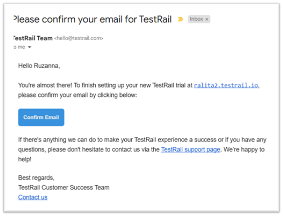
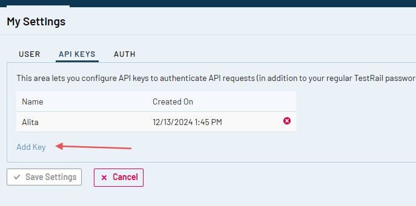

# ELITEA Toolkit Guide: TestRail Integration

## Introduction

### Purpose of this Guide

This guide is your definitive resource for integrating and utilizing the **TestRail toolkit** within ELITEA. It provides a step-by-step walkthrough, from setting up your TestRail API Key to configuring the toolkit in ELITEA and effectively using it within your Agents. By following this guide, you will unlock the power of automated test management, streamlined testing workflows, and enhanced team collaboration, all directly within the ELITEA platform. This integration empowers you to leverage AI-driven automation to optimize your software testing lifecycle using the combined strengths of ELITEA and TestRail.

### Brief Overview of TestRail

TestRail is a comprehensive, web-based test management tool that helps teams of all sizes efficiently organize, manage, and track their software testing efforts. It provides a centralized platform to streamline your testing process, offering features for:

*   **Test Case Management:** Create, organize, and manage test cases with rich text formatting, attachments, and custom fields. Structure test cases into projects, suites, and sections for easy navigation and maintenance.
*   **Test Execution & Tracking:** Plan and execute test runs and test plans, track test results in real-time, and assign tests to team members. Get a clear overview of testing progress and identify areas needing attention.
*   **Reporting & Metrics:** Generate insightful reports and metrics on test coverage, test results, and team performance. Use dashboards and charts to visualize testing progress and identify trends.
*   **Integration with Development Tools:** Seamlessly integrates with issue trackers like Jira, and automation tools, making it a central hub for your testing ecosystem.
*   **Customization & Scalability:** Adapt TestRail to your specific testing processes with customizable workflows, fields, and templates. Scale TestRail as your team and projects grow.

Integrating TestRail with ELITEA brings these robust test management capabilities directly into your AI-powered workflows. Your ELITEA Agents can then interact with your TestRail instance to automate test-related tasks, enhance testing processes, and improve team collaboration through intelligent automation.

## TestRail Account Setup and Configuration

### Account Setup

If you don't have a TestRail account yet, here’s how to get started with a free trial:

1.  **Go to TestRail Website:** Open your web browser and navigate to [TestRail's official website](https://www.gurocksoftware.com/testrail/).
2.  **Start a Free Trial:** On the homepage, locate and click the **"Free Trial"** button.
3.  **Fill Out the Registration Form:** Provide your details in the registration form. This typically includes your name, company email address, company name, and other relevant information. **For professional use, it's highly recommended to use your company email.**
4.  **Submit the Form:** Click on the **“Start Free Trial”** or similar button to submit the form. TestRail will send a confirmation email to the email address you provided.

    

5.  **Verify Your Email:** Open the confirmation email from TestRail and click on the verification link provided within the email. This step is crucial to activate your TestRail trial account.

    

    

6.  **Access Your Account:** After email verification, you will be redirected to your new TestRail instance or prompted to log in. Follow any on-screen instructions to complete the setup and access your TestRail account.

### API Key Generation in TestRail

To securely integrate TestRail with ELITEA, you need to generate an API key within TestRail. This API key will be used by ELITEA to authenticate and access your TestRail instance.

**Follow these steps to create an API Key:**

1.  **Log in to TestRail:** Access your TestRail account using your credentials.

    

2.  **Access My Settings:** Click on your profile name in the top right corner of the TestRail interface. From the dropdown menu, select **"My Settings"**.
3.  **Navigate to API Keys:** In the "My Settings" page, find and click on the **"API keys"** tab.
4.  **Add API Key:** Click the **"Add Key"** button to create a new API key.

    

5.  **Name the API Key:** In the "Name" field, enter a descriptive name for the API key, such as "ELITEA Integration Key". This will help you identify the purpose of this key later.
6.  **Generate API Key:** Click the **"Generate Key"** button. TestRail will generate a new API key and display it to you.
7.  **Securely Store Your API Key:** **Immediately copy the generated API key.** This is the only time it will be displayed in full. Store it securely using a password manager or ELITEA's built-in Secrets feature (recommended for enhanced security within ELITEA). You will need this API Key to configure the TestRail toolkit in ELITEA.


## TestRail Integration with ELITEA

### Agent Creation/Configuration

To integrate TestRail, you'll need to configure it within an ELITEA Agent. You can either create a new Agent or modify an existing one.

1.  **Navigate to Agents:** In ELITEA, go to the **Agents** menu.
2.  **Create or Edit Agent:**
    *   **New Agent:** Click **"+ Agent"** to create a new Agent. Follow the steps to define Agent details like name, description, type, and instructions.
    *   **Existing Agent:** Select the Agent you want to integrate with TestRail and click on its name to edit.
3.  **Access Tools Section:** In the Agent configuration, scroll down to the **"Tools"** section.

### Toolkit Configuration

This section details how to configure the TestRail toolkit within your ELITEA Agent.

1.  **Add Toolkit:** In the "Tools" section, click the **"+" icon**.
2.  **Select TestRail:** Choose **"TestRail"** from the dropdown list of available toolkits. This opens the "New TestRail tool" configuration panel.
3.  **Configure Toolkit Details:** Fill in the following fields:

    *   **Name:** Enter a **Name** for this TestRail toolkit instance. Choose a descriptive name that helps you identify its purpose within your Agent's instructions (e.g., "TestRailQA", "TestManagementTool").
    *   **Description:** Provide a **Description** for the toolkit, clarifying its purpose or the specific TestRail project it accesses (e.g., "Toolkit to access and manage test cases in TestRail").
    *   **URL:** Enter the **URL of your TestRail instance**.  **It is crucial to use the correct format and your specific instance URL.** For example: `https://yourcompany.testrail.io/`.  Replace `yourcompany` with your actual TestRail subdomain.
    *   **Email:** Enter the **Email address** associated with your TestRail account that you used to generate the API key.
    *   **Password/API token:** Select **"API token"** as the authentication method.
        *   **Password/Secret:** Choose **"Secret"** and select a pre-configured secret from the dropdown. You must first create and securely store your **API Key** as a Secret in ELITEA's [Secrets](../../atform-documentation/menus/settings.md#secrets) feature. Using Secrets prevents hardcoding sensitive credentials directly in the toolkit configuration and enhances security. Alternatively, you can choose **"Password"** and paste the **API Key** you generated in TestRail into the **"Password"** field, but using Secrets is highly recommended for security best practices.

        

4.  **Enable Tools:** In the "Tools" section of the TestRail toolkit configuration, **select the checkboxes next to the TestRail tools** you want to enable for your Agent. **Enable only the tools your Agent will actually use** to adhere to the principle of least privilege and enhance security. Available tools are:
    *   **Get case:** Retrieves a specific test case from TestRail.
    *   **Get cases:** Retrieves a list of test cases from a TestRail project.
    *   **Get cases by filter:** Retrieves test cases based on specified filter criteria.
    *   **Add case:** Adds a new test case to TestRail.

5.  **Complete Configuration:** Click the **arrow icon** (at the top right of the toolkit configuration) to save the TestRail toolkit setup and return to the main Agent configuration.
6.  Click **Save** to apply configuration and changes to the Agent.

### Tool Overview

The TestRail toolkit provides the following tools for your ELITEA Agents:

*   **Get case:** `get_case` - Retrieves a specific test case from TestRail using its ID. Useful for reviewing details of a particular test case.
*   **Get cases:** `get_cases` - Retrieves a list of test cases from a specified TestRail project. Useful for getting an overview of test cases within a project.
*   **Get cases by filter:** `get_cases_by_filter` - Retrieves test cases from TestRail based on specified filter criteria, such as priority, status, or type. Useful for targeted retrieval of test cases based on specific attributes.
*   **Add case:** `add_case` - Adds a new test case to a specified TestRail project and section. Useful for automating test case creation.

## Instructions and Prompts for Using the Toolkit

To instruct your ELITEA Agent to use the TestRail toolkit, you need to provide clear instructions within the Agent's "Instructions" field. These instructions guide the Agent on *when* and *how* to use the available tools.

### Instruction Creation for OpenAI Agents

When creating instructions for the TestRail toolkit for OpenAI-based Agents, focus on clear, action-oriented language. Break down tasks into simple steps and explicitly state the parameters required for each tool. OpenAI Agents respond best to instructions that are:

*   **Direct and Imperative:** Use action verbs and clear commands (e.g., "Use the 'get_case' tool...", "Add a new test case with...").
*   **Parameter-Focused:** Clearly list each parameter and how the Agent should determine its value.
*   **Context-Aware:** Provide enough context so the Agent understands the overall goal and when to use specific tools within a workflow.

When instructing your Agent to use a TestRail toolkit, use this pattern:

```markdown
1. Identify the goal: [State the objective, e.g., "To retrieve details of a specific test case"].
2. Tool Selection: Use the "[tool_name]" tool.
3. Parameter Specification: Provide the following parameters:
    - Parameter Name 1: <value or description of value>
    - Parameter Name 2: <value or description of value>
    - ...
4. Expected Outcome: [Optionally, describe what should happen after the tool is used].
```

**Example Agent Instructions for TestRail Toolkit Tools (OpenAI Agent Friendly):**

*   **Agent Instructions for Retrieving a Specific Test Case:**

```markdown
1. Goal: To get the details of test case with ID 2260 from TestRail.
2. Tool: Use the "get_case" tool.
3. Parameters:
    - Case ID: "2260"
4. Outcome: The Agent will retrieve and display the details of test case with ID 2260.
```

*   **Agent Instructions for Adding a New Test Case:**

```markdown
1. Goal: To create a new test case in TestRail project with ID 1, section ID 5, with title "Login Functionality Test" and priority "High".
2. Tool: Use the "add_case" tool.
3. Parameters:
    - Project ID: "1"
    - Section ID: "5"
    - Title: "Login Functionality Test"
    - Case Properties (JSON format): '{"priority_id": 1}'  (Note: priority_id 1 usually corresponds to High priority in TestRail, check your TestRail instance for specific IDs)
4. Outcome: A new test case named "Login Functionality Test" will be created in TestRail under project ID 1 and section ID 5 with High priority.
```

*   **Agent Instructions for Retrieving All Test Cases in a Project:**

```markdown
1. Goal: To get a list of all test cases from TestRail project with ID 2.
2. Tool: Use the "get_cases" tool.
3. Parameters:
    - Project ID: "2"
4. Outcome: The Agent will retrieve and display a list of all test cases in project ID 2.
```

*   **Agent Instructions for Retrieving Test Cases by Filter:**

```markdown
1. Goal: To retrieve all test cases from project ID 1 that are of "Functional" type and have "High" priority.
2. Tool: Use the "get_cases_by_filter" tool.
3. Parameters:
    - Project ID: "1"
    - Filter Arguments (JSON format): '{"priority_id": 1, "type_id": 2}' (Note: priority_id 1 for High, type_id 2 for Functional are examples, check your TestRail instance for specific IDs)
4. Outcome: The Agent will retrieve and display a list of test cases from project ID 1 that match the specified filter criteria (Functional type and High priority).
```

### Conversation Starters

Use these conversation starters to interact with your TestRail-integrated Agent.

**1. For Testing and Troubleshooting Connection:**

These starters are designed to verify if the TestRail toolkit is correctly configured and connected to your TestRail instance.

*   "Get test case with ID 1." - *This tests basic connectivity and read permissions.*
*   "Get all test cases for project ID 1." - *This further tests read permissions and project access.*

**2. For General Agent Usage Scenarios:**

These starters demonstrate how to initiate agent execution for common TestRail-related tasks.

*   "I need to review the details of test case 2260." - *This could trigger the `get_case` tool.*
*   "Create a new test case in project 1, section 5, with title 'User Registration Test' and priority 'Medium'." - *This directly initiates the `add_case` tool.*
*   "List all high priority test cases in project 2." - *This would use the `get_cases_by_filter` tool.*
*   "Get me all test cases from project 3." - *This would use the `get_cases` tool.*

These conversation starters provide a starting point for interacting with your TestRail-integrated ELITEA Agent and can be customized further based on your specific use cases and workflows.

## Use Cases

The TestRail toolkit unlocks numerous automation possibilities for software testing workflows within ELITEA. Here are some key use cases, demonstrating how each tool can be applied:

*   **Automated Test Case Review:**
    *   **Scenario:**  Quickly review the details of a specific test case to understand its steps, expected results, and current status.
    *   **Tools Used:** `get_case`
    *   **Example Instruction:** "Use the 'get_case' tool to retrieve test case with ID 2260 and show me the details."
    *   **Benefit:** Saves time in manually searching for and opening test cases in TestRail, allowing for faster reviews and decision-making.

*   **Project Test Case Overview:**
    *   **Scenario:** Get a comprehensive list of all test cases within a specific TestRail project to understand the testing scope and coverage.
    *   **Tools Used:** `get_cases`
    *   **Example Instruction:** "Use the 'get_cases' tool to list all test cases in project ID 1 so I can get an overview of the project's test suite."
    *   **Benefit:** Provides a quick and easy way to get a high-level view of all test cases in a project, aiding in test planning and progress monitoring.

*   **Filtered Test Case Retrieval for Targeted Analysis:**
    *   **Scenario:** Identify and retrieve test cases based on specific criteria, such as priority, status, or type, for focused analysis or reporting.
    *   **Tools Used:** `get_cases_by_filter`
    *   **Example Instruction:** "Use the 'get_cases_by_filter' tool to get all 'Failed' test cases with 'High' priority in project ID 2 to prioritize bug fixing."
    *   **Benefit:** Enables targeted retrieval of test cases, allowing testers and managers to quickly focus on specific areas of interest, such as failed tests or high-priority items.

*   **Automated Test Case Creation from Requirements:**
    *   **Scenario:** Automatically create new test cases in TestRail based on new software requirements or user stories.
    *   **Tools Used:** `add_case`
    *   **Example Instruction:** "Use the 'add_case' tool to create a new test case in project ID 3, section ID 10, with title 'Data Validation Test' and priority 'Medium' based on this new requirement: [paste requirement details here]."
    *   **Benefit:** Streamlines test case creation, reduces manual effort, and ensures that test cases are created promptly as requirements evolve, improving test coverage and efficiency.

## Troubleshooting and Support

### Troubleshooting

*   **Connection Issues:**
    *   **Problem:** Agent fails to connect to TestRail, resulting in errors during toolkit execution.
    *   **Troubleshooting Steps:**
        1.  **Verify TestRail URL:** Ensure the URL is correctly entered and points to your TestRail instance (e.g., `https://yourcompany.testrail.io/`).
        2.  **Check Authentication:** Double-check the Email address and API Key for accuracy.
        3.  **API Key Generation:** Re-generate a new API key in TestRail and try using that if you suspect the key might be invalid.
        4.  **Network Connectivity:** Verify that both ELITEA and TestRail have internet access and no network issues are blocking the connection.

*   **Authorization Errors (Permission Denied):**
    *   **Problem:** Agent receives "Permission Denied" or "Unauthorized" errors when accessing TestRail resources.
    *   **Troubleshooting Steps:**
        1.  **API Key Validity:** Ensure the API key is valid and has not been revoked in TestRail.
        2.  **Account Permissions:** Confirm that the TestRail account associated with the API key has the necessary permissions to access the specified projects and perform the requested actions (e.g., read test cases, add test cases). TestRail permissions are generally managed within TestRail itself, ensure your user role has sufficient privileges.

*   **Incorrect Project or Section IDs:**
    *   **Problem:** Agent fails to find projects or sections, especially when adding new test cases.
    *   **Troubleshooting Steps:**
        1.  **Verify Project ID:** Double-check the Project ID in your TestRail instance. You can usually find the Project ID in the URL when you are viewing a specific project in TestRail.
        2.  **Verify Section ID:** Similarly, verify the Section ID. Section IDs are typically found in the URL when you are within a specific section of a test suite in TestRail. Ensure the Section ID is valid within the specified Project.

### FAQ

1.  **Q: Can I use my regular TestRail password instead of an API Key?**
    *   **A:** No, for secure integration with ELITEA, you **must use a TestRail API Key**.  Using your regular password directly is not supported and is a security risk.
2.  **Q: Where do I find Project IDs and Section IDs in TestRail?**
    *   **A:** Project IDs and Section IDs are typically visible in the URL when you navigate to a specific project or section within TestRail. For example, in the URL `https://yourcompany.testrail.io/index.php?/projects/overview/1`, `1` is likely the Project ID. Similarly, when viewing a section, the URL will contain a section identifier. You can also find these IDs through TestRail's API if needed, but checking the URL is usually the easiest method.
3.  **Q: What if I don't know the exact IDs for priority or type when filtering test cases?**
    *   **A:** TestRail uses numerical IDs for various fields like priority and type. You need to find the correct IDs within your TestRail instance. Typically, you can find these IDs by inspecting the source code of the TestRail page when you are viewing or editing test cases, or by using TestRail's API to query available priorities and types. Contact your TestRail administrator if you are unsure about these IDs.

### Support Contact

For any issues, questions, or further assistance with the TestRail integration or ELITEA Agents, please reach out to our dedicated ELITEA Support Team. We are committed to providing prompt and effective support to ensure your success with ELITEA.

**Contact ELITEA Support:**

*   **Email:**  **[SupportAlita@epam.com](mailto:SupportAlita@epam.com)**

**Best Practices for Effective Support Requests:**

To help us understand and resolve your issue as quickly as possible, please ensure you provide the following information in your support email:

*   **ELITEA Environment:** Clearly specify the ELITEA environment you are using (e.g., "Nexus," "Alita Lab," "EYE").
*   **Project Details:**  Indicate the **Project Name** and whether you are working in your **Private** workspace or a **Team** project.
*   **Detailed Issue Description:** Provide a clear, concise, and detailed description of the problem you are encountering. Explain what you were trying to do, what you expected to happen, and what actually occurred.
*   **Relevant Configuration Information:**  To help us diagnose the issue, please include relevant configuration details, such as:
    *   **Agent Instructions (Screenshot or Text):** If the issue is with an Agent, provide a screenshot or copy the text of your Agent's "Instructions" field.
    *   **Toolkit Configurations (Screenshots):** If the issue involves the TestRail toolkit or other toolkits, include screenshots of the toolkit configuration settings within your Agent.
*   **Error Messages (Full Error Text):** If you are encountering an error message, please provide the **complete error text**. In the Chat window, expand the error details and copy the full error message. This detailed error information is crucial for diagnosis.
*   **Your Query/Prompt (Exact Text):** If the issue is related to Agent execution, provide the exact query or prompt you used to trigger the issue.

**Before Contacting Support:**

We encourage you to first explore the resources available within this guide and the broader ELITEA documentation. You may find answers to common questions or solutions to known issues in the documentation.

## Useful Links

To further enhance your understanding and skills in integrating TestRail with ELITEA, here are some helpful resources:

*   **[TestRail Website](https://www.gurocksoftware.com/testrail/)**: Access the main TestRail platform to create an account or log in and explore TestRail features.
*   **[TestRail API Documentation](https://www.gurocksoftware.com/testrail/docs/api/)**:  Refer to the official TestRail API documentation for detailed information on API endpoints, data structures, and advanced usage.
*   **[ELITEA Secrets](../../atform-documentation/menus/settings.md#secrets)**: Learn how to securely store your TestRail API Key using ELITEA's Secrets management feature for enhanced security.
*   **[ELITEA Agents Configuration](../../platform-documentation/menus/agents.md)**:  Find out more about creating and configuring Agents in ELITEA, where you integrate the TestRail toolkit to automate your workflows.
*   **[ELITEA Support Email](mailto:SupportAlita@epam.com)**: Contact the ELITEA support team for direct assistance with TestRail integration or any other questions and issues you may encounter.