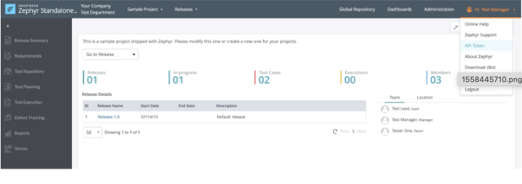
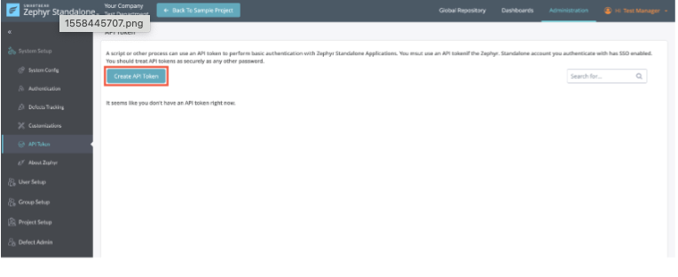
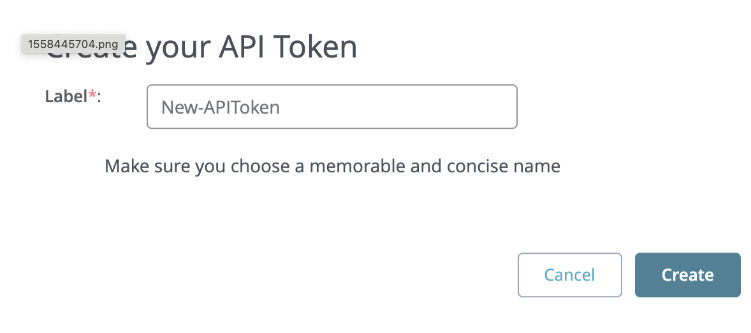
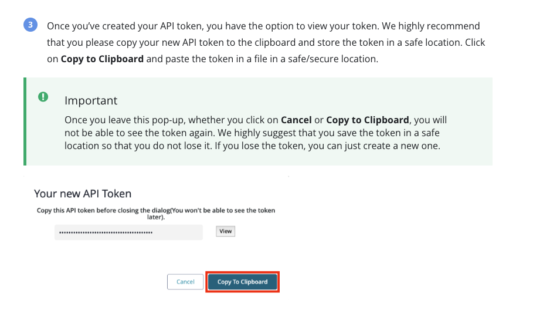
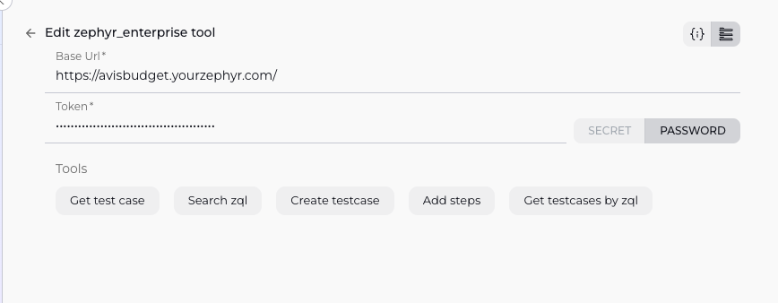

# Zephyr Enterprise Integration with ELITEA

Integrating Zephyr Enterprise with ELITEA allows your Agents to interact with your test management data, enabling automation of tasks like creating test cases, searching for test assets, and potentially integrating test execution results (depending on the specific tools provided). This document guides you through the process.

## Prerequisites: Zephyr Enterprise API Key Setup

Before you can configure the Zephyr Enterprise toolkit in ELITEA, you need to obtain an API Key from your Zephyr Enterprise instance. This key is used by ELITEA to authenticate with the Zephyr Enterprise API.

Follow these steps to get your API Key from Zephyr Enterprise:

1.  Log in to your **Zephyr Enterprise** instance using your web browser.
2.  Click on your **Username** in the top right corner of the page.
3.  From the dropdown menu, select **Profile**.
4.  In your User Profile settings, find the section related to **API Key** or **API Token**.

    
    
5.  If an API Key already exists, **Copy** the existing key.
6.  If no API Key exists, there should be an option to **Generate** or **Create API Key**. Click this button to generate a new key.
    
7.  **Create and Copy** the generated API Key.
    
    
Keep this API Key secure and readily available for the ELITEA configuration steps below. Do **not** share it publicly.

## Agent Creation/Configuration

To integrate Zephyr Enterprise, you'll need to configure it within an ELITEA Agent. You can either create a new Agent or modify an existing one.

1.  **Navigate to Agents:** In ELITEA, go to the **Agents** menu.
2.  **Create or Edit Agent:**
    *   **New Agent:** Click **"+ Agent"** to create a new Agent. Follow the steps to define Agent details like name, description, type, and instructions.
    *   **Existing Agent:** Select the Agent you want to integrate with Zephyr Enterprise and click on its name to edit.
3.  **Access Tools Section:** In the Agent configuration, scroll down to the **"Tools"** section.

## Toolkit Configuration

This section details how to configure the Zephyr Enterprise toolkit within your ELITEA Agent.

1.  **Add Toolkit:** In the "Tools" section, click the **"+" icon**.
2.  **Select Zephyr Enterprise:** Choose **"Zephyr Enterprise"** from the dropdown list of available toolkits (the exact name might vary slightly). This opens the "New Zephyr Enterprise tool" configuration panel.
3.  **Configure Toolkit Details:** Fill in the following fields using the information from your Zephyr Enterprise instance and the API Key you obtained:

    *   **Base Url:** Enter the **Base URL** of your Zephyr Enterprise instance (e.g., `https://your-zephyr-instance.com`). Ensure it's the correct URL you use to access the Zephyr web interface.
    *   **Api Key:**
        *   Paste the **API Key** you copied from your Zephyr Enterprise profile (Step 7 in the Prerequisites) into the "Api Key" field.
       

        *   **Enhanced Security with Secrets:** For improved security, it's highly recommended to use **"Secret"**. Select **"Secret"** and choose a pre-configured secret from the dropdown. You must first create and securely store your **API Key** as a Secret in ELITEA's Secrets  feature. Using Secrets prevents hardcoding sensitive credentials directly in the toolkit configuration.

    

4.  **Enable Tools:** In the "Tools" section of the Zephyr Enterprise toolkit configuration, **select the checkboxes next to the Zephyr Enterprise tools** you want to enable for your Agent. **Enable only the tools your Agent will actually use** to adhere to the principle of least privilege and enhance security. Based on your list, you can enable:
    *   `get test case`
    *   `search zql`
    *   `create testcase`
    *   `add steps`
    *   `get testcases by zql`

5.  **Complete Configuration:** Click the **arrow icon** (at the top right of the toolkit configuration) to save the Zephyr Enterprise toolkit setup and return to the main Agent configuration.
6.  Click **Save** to apply configuration and changes.

## Tool Overview

The Zephyr Enterprise toolkit provides various tools for your ELITEA Agents to interact with your test management data. Based on the tools you have enabled, the toolkit offers the following functionalities:

*   **get test case:** Retrieves details for a specific test case, likely by its unique identifier (ID).
*   **search zql:** Executes a Zephyr Query Language (ZQL) query to find test cases, cycles, folders, or other entities based on criteria.
*   **create testcase:** Creates a new test case record in Zephyr Enterprise. Requires parameters for test case details like name, project, folder, etc.
*   **add steps:** Adds steps to an existing test case. Requires the test case identifier and the details of the steps to add.
*   **get testcases by zql:** A specialized version of the search tool, specifically designed to execute a ZQL query and return test case entities.

## Instructions and Prompts for Using the Toolkit

To instruct your ELITEA Agent to use the Zephyr Enterprise toolkit, you need to provide clear instructions within the Agent's "Instructions" field. These instructions guide the Agent on *when* and *how* to use the available tools.

### Instruction Creation for OpenAI Agents

When creating instructions for the Zephyr Enterprise toolkit for OpenAI-based Agents, focus on clear, action-oriented language. Break down tasks into simple steps and explicitly state the parameters required for each tool. OpenAI Agents respond best to instructions that are:

*   **Direct and Imperative:** Use action verbs and clear commands (e.g., "Use the 'search zql' tool...", "Create a new test case for...").
*   **Parameter-Focused:** Clearly list each parameter required by the tool (e.g., Test Case ID, ZQL Query String, Test Case details, Steps details). Explain how the Agent should determine the value for each parameter from the user's input or context.
*   **Context-Aware:** Provide enough context so the Agent understands the overall goal and when to use specific tools within a workflow (e.g., "If the user wants to find test cases related to feature X, use the 'search zql' tool.").


**Example Agent Instructions for Zephyr Enterprise Toolkit Tools (using the exact tool names you provided):**

*   **Agent Instructions for Getting a Test Case:**

    ```
    1. Goal: Retrieve the details of a specific test case.
    2. Tool: Use the "get test cse" tool.
    3. Parameters:
        - TestCaseId: <Extract the Test Case ID from user input, e.g., "TC-123">
    4. Outcome: Provide the details of the requested test case to the user.
    ```

*   **Agent Instructions for Searching using ZQL:**

    ```
    1. Goal: Find test cases or other items based on a ZQL query provided by the user.
    2. Tool: Use the "search zql" tool.
    3. Parameters:
        - ZqlQuery: <The ZQL query string provided by the user, e.g., "project = 'My Project' AND status = 'Approved'">
    4. Outcome: Present the results from the ZQL search to the user.
    ```

*   **Agent Instructions for Creating a Test Case:**

    ```
    1. Goal: Create a new test case in Zephyr Enterprise.
    2. Tool: Use the "create testcase" tool.
    3. Parameters:
        - Name: <Extract the name of the test case from user input>
        - Project: <Extract the project name or ID>
        - Folder: <Extract the folder path or ID where it should be created>
        - (Include other required fields like Priority, Type, etc., as parameters)
    4. Outcome: Confirm the test case was created and provide its ID.
    ```

*   **Agent Instructions for Adding Steps:**

    ```
    1. Goal: Add steps to an existing test case.
    2. Tool: Use the "add steps" tool.
    3. Parameters:
        - TestCaseId: <Extract the Test Case ID from user input>
        - Steps: <A structured list or text containing the steps to add>
    4. Outcome: Confirm the steps were added to the test case.
    ```

### Conversation Starters

Use these conversation starters to interact with your Zephyr Enterprise-integrated Agent.

**1. For Testing and Troubleshooting Connection/Basic Functionality:**

These starters are designed to verify if the Zephyr Enterprise toolkit is correctly configured and connected to your instance.

*   "Get details for test case TC-1." - *Tests the `get test case` tool (replace 'TC-1' with a valid ID).*
*   "Search Zephyr using ZQL: 'project = "Default" AND status = "Draft"'." - *Tests the `search zql` or `get testcases by zql` tool.*
*   "Create a test case named 'ConnTest' in project 'Default'." - *Tests the `create testcase` tool.*

**2. For General Agent Usage Scenarios:**

These starters demonstrate how to initiate agent execution for common Zephyr-related tasks.

*   "Please create a new test case for the login feature in the 'WebApp' project, named 'Verify successful user login'." - *This triggers a `create testcase` call.*
*   "Add the following steps to test case TC-55: 1. Enter username. 2. Enter password. 3. Click Login." - *This triggers an `add steps` call.*
*   "Find all test cases in the 'Mobile App' project that are marked 'Blocked'." - *This would use the `search zql` or `get testcases by zql` tool with a ZQL query like `project = "Mobile App" AND status = "Blocked"`.*
*   "What are the steps for test case TC-123?" - *This would use the `get test case` tool and then the Agent would process the steps from the response.*

These conversation starters provide a starting point for interacting with your Zephyr Enterprise-integrated ELITEA Agent and can be customized further based on your specific use cases and workflows.

## Use Cases

The Zephyr Enterprise toolkit unlocks numerous automation possibilities for test management workflows within ELITEA. Here are some key use cases, demonstrating how your available tools can be applied:

*   **Automated Test Case Creation from Requirements or Bugs:**
    *   **Scenario:** Automatically create new test cases in Zephyr Enterprise whenever a new requirement is finalized or a bug is logged in another system, based on predefined templates or extracted information.
    *   **Tools Used:** `create testcase`, `add steps`
    *   **Example Instruction (Creation):** "When a new bug report is received with status 'Approved', use the 'create testcase' tool to create a test case in the 'Bug Verification' folder, setting the name based on the bug summary."
    *   **Example Instruction (Adding Steps):** "After creating the verification test case, use the 'add steps' tool to add standard verification steps and steps based on the bug's reproduction steps."
    *   **Benefit:** Ensures test coverage is created promptly for new development or bug fixes, reducing manual effort.

*   **Automated Reporting and Test Case Identification:**
    *   **Scenario:** Quickly find test cases that match specific criteria for reporting, planning, or investigation purposes.
    *   **Tools Used:** `search zql`, `get testcases by zql`, `get test cse`
    *   **Example Instruction:** "If a user asks for all test cases planned for the upcoming release, use the 'get testcases by zql' tool with a ZQL query like 'cycle IN ("Release 2.0")'."
    *   **Benefit:** Provides fast, automated access to structured test data, aiding in decision-making and reporting.


*   **Integrating with CI/CD or Execution Workflows:**
    *   **Scenario:** Potentially trigger test execution or update test case status based on external events (this would likely depend on `execute generic rq` or additional toolkit capabilities not listed). Can also be used *after* execution to fetch results or identify test cases that failed.
    *   **Tools Used:** `search zql`, `get testcases by zql`, `get test cse` (for analysis of results).
    *   **Example Instruction:** "After a build failure, use the 'get testcases by zql' tool with a query like 'executionStatus = "Fail" AND executedInCycle = "<LatestBuildCycle>"' to list the failed tests."
    *   **Benefit:** Connects test management data to automated build and execution pipelines.

## Troubleshooting and Support

### Troubleshooting

*   **Connection Issues:**
    *   **Problem:** Agent fails to connect to Zephyr Enterprise API, resulting in errors during toolkit execution.
    *   **Troubleshooting Steps:**
        1.  **Verify Base URL:** Ensure the Zephyr Enterprise **Base Url** in the toolkit configuration is correct and accessible. It should be the URL you use to access the Zephyr web interface.
        2.  **Network Access:** Ensure there are no network firewalls or proxy settings preventing ELITEA from reaching your Zephyr Enterprise instance URL.

*   **Authorization Errors (Invalid API Key, Permission Denied):**
    *   **Problem:** Agent receives errors related to authentication or insufficient permissions.
    *   **Troubleshooting Steps:**
        1.  **Verify API Key:** Double-check that the **Api Key** in the ELITEA toolkit configuration is exactly the same as the one generated in your Zephyr Enterprise profile. Ensure you are using Secrets correctly if configured that way.
        2.  **Check User Permissions:** The API Key is linked to a Zephyr Enterprise user. Ensure this user has the necessary permissions in Zephyr Enterprise to perform the actions the Agent is attempting (e.g., create test cases in a specific project, add steps to a test case, search across projects). Log in as that user in Zephyr to manually confirm their permissions.
        3.  **API Access Enabled:** Confirm that API access is enabled for the user associated with the API key in Zephyr Enterprise settings, if such a setting exists.

*   **Data/Operation Issues (Not Found, Failed Creation/Update):**
    *   **Problem:** Agent returns no results for a search or query, or `create`/`add steps`/`update` operations fail.
    *   **Troubleshooting Steps:**
        1.  **Check Parameters:** If using `get test cse`, `create testcase`, or `add steps`, verify the parameters provided in the Agent's instructions are correct. Ensure Test Case IDs, Project Names, Folder Paths, etc., are accurate and exist in Zephyr. Ensure all *required* fields are provided for creation/update.
        2.  **Check ZQL Syntax:** If using `search zql` or `get testcases by zql`, verify the ZQL syntax is correct. Test the ZQL query directly in the Zephyr Enterprise search interface using the user linked to the API key to see if it returns the expected results.
        3.  **User Permissions (Again):** This is a common cause. The user linked to the API key must have permissions to view/modify the specific projects, folders, test cases, etc., that the Agent is interacting with.

### Support Contact

For any issues, questions, or further assistance with the Zephyr Enterprise integration or ELITEA Agents, please reach out to our dedicated ELITEA Support Team. We are committed to providing prompt and effective support to ensure your success with ELITEA.

**Contact ELITEA Support:**

*   **Email:** **[SupportAlita@epam.com](mailto:SupportAlita@epam.com)**

**Best Practices for Effective Support Requests:**

To help us understand and resolve your issue as quickly as possible, please ensure you provide the following information in your support email:

*   **ELITEA Environment:** Clearly specify the ELITEA environment you are using (e.g., "Nexus," "Alita Lab," "EYE").
*   **Project Details:** Indicate the **Project Name** and whether you are working in your **Private** workspace or a **Team** project.
*   **Detailed Issue Description:** Provide a clear, concise, and detailed description of the problem you are encountering. Explain what you were trying to do, what you expected to happen, and what actually occurred.
*   **Relevant Configuration Information:** To help us diagnose the issue, please include relevant configuration details, such as:
    *   **Agent Instructions (Screenshot or Text):** If the issue is with an Agent, provide a screenshot or copy the text of your Agent's "Instructions" field.
    *   **Toolkit Configurations (Screenshots):** Include screenshots of the Zephyr Enterprise toolkit configuration settings within your Agent, showing **Base Url** and enabled **Tools**. (The API Key does *not* need to be included in the screenshot if using Secrets).
    *   **Zephyr Enterprise Details:** Mention your Zephyr Enterprise version (if known) and confirm the Zephyr user linked to the API Key has the necessary permissions.
*   **Error Messages (Full Error Text):** If you are encountering an error message, please provide the **complete error text**. In the Chat window or Agent logs, expand the error details and copy the full error message. This detailed error information is crucial for diagnosis.
*   **Your Query/Prompt (Exact Text):** If the issue is related to Agent execution, provide the exact query or prompt you used to trigger the issue, as well as any parameters the Agent attempted to use for the Zephyr Enterprise tool call.

**Before Contacting Support:**

We encourage you to first explore the resources available within this guide and the broader ELITEA documentation. You may find answers to common questions or solutions to known issues in the documentation.