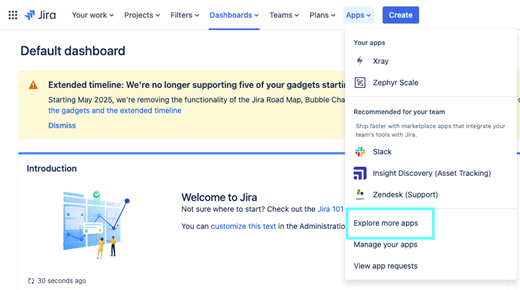

# ELITEA Toolkit Guide: Zephyr Scale Integration

## Introduction

### Purpose of this Guide

This guide is your definitive resource for integrating and effectively utilizing the **Zephyr Scale toolkit** within ELITEA. It provides a detailed, step-by-step walkthrough, from setting up your Zephyr Scale API token to configuring the toolkit in ELITEA and seamlessly incorporating it into your Agents. By following this guide, you will unlock the power of automated test management, streamlined QA workflows, and enhanced collaboration between development and testing teams, all directly within the ELITEA platform. This integration empowers you to leverage AI-driven automation to optimize your Zephyr Scale-driven workflows, enhance QA productivity, and improve software quality within your projects.

### Brief Overview of Zephyr Scale

Zephyr Scale, by SmartBear, is a leading test management application for Jira, designed to provide comprehensive test management capabilities directly within the Jira environment. It is widely used by QA teams to plan, organize, execute, and track software testing efforts seamlessly integrated with their Jira projects. Zephyr Scale offers a wide array of functionalities, including:

*   **Native Jira Integration:** Zephyr Scale is built natively within Jira, providing seamless integration with Jira projects, issues, and workflows, allowing QA teams to manage testing activities directly within their existing Jira environment.
*   **Centralized Test Management within Jira:** Provides a centralized test management repository within Jira, allowing QA teams to create, organize, and manage test cases, test cycles, and test executions all within the familiar Jira interface.
*   **Comprehensive Test Planning and Execution:** Enables efficient test planning, test suite creation, test cycle management, and structured test execution, supporting various testing methodologies and ensuring organized and traceable testing processes.
*   **Real-time Test Tracking and Reporting:** Offers real-time test execution tracking, progress dashboards, and customizable reports, providing QA teams and stakeholders with up-to-date visibility into testing progress, test results, and quality metrics, facilitating data-driven decision-making.
*   **Traceability and Requirements Coverage:** Zephyr Scale ensures traceability by linking test cases to Jira requirements and user stories, providing clear visibility into test coverage, requirement verification, and ensuring alignment between testing efforts and project goals.

Integrating Zephyr Scale with ELITEA brings these powerful test management capabilities directly into your AI-driven workflows. Your ELITEA Agents can then intelligently interact with your Zephyr Scale test assets to automate test management tasks, enhance QA processes, improve test coverage analysis, and leverage AI to optimize your entire software testing lifecycle within Zephyr Scale.

## Toolkit's Account Setup and Configuration in Zephyr Scale

### Account Setup and Zephyr Scale Integration with Jira

Zephyr Scale is an app for Jira and requires an active Jira instance with the Zephyr Scale app installed. To set up your Zephyr Scale account and integrate it with Jira, follow these steps:

1.  **Access Jira Instance:** Log in to your Jira instance (Cloud or Server/Data Center) where you want to install and use Zephyr Scale. You will need Jira administrator privileges to install apps.
2.  **Navigate to Jira Administration - Apps:** In Jira, go to the administration menu (usually by clicking the gear icon in the top right corner) and select **"Apps"**.

    

3.  **Find Zephyr Scale in Marketplace:** In the Atlassian Marketplace, search for **"Zephyr Scale"**.

    

4.  **Install Zephyr Scale:** Locate the **"Zephyr Scale - Test Management for Jira"** app (or "Zephyr Scale Cloud" for Jira Cloud) and click on **"Get app"** or **"Try it free"** to start the installation process.

    

5.  **Add to Jira:** Follow the prompts to add the Zephyr Scale app to your Jira instance. You may need to accept terms and conditions and confirm the installation.
6.  **Verify Installation:** Once the installation is complete, you should see a confirmation message indicating that Zephyr Scale has been added to Jira. You can typically access Zephyr Scale features within your Jira projects under the "Zephyr Scale" menu item in the project sidebar.

    

7.  **Access Zephyr Scale within Jira Project:** Navigate to a Jira project where you want to use Zephyr Scale. You should now see Zephyr Scale-specific options in the project sidebar, such as "Test Cases", "Test Cycles", "Test Plans", and "Reports".

### Token/API Key Generation: Creating a Zephyr Scale API Access Token

For secure integration with ELITEA, it is essential to use a Zephyr Scale **API Access Token**. This method is more secure than using your primary Jira account password directly and allows you to control access permissions for ELITEA.

**Follow these steps to generate a Zephyr Scale API Access Token:**

1.  **Log in to Jira:** Access your Jira instance (Cloud or Server/Data Center) where Zephyr Scale is installed and log in with your Jira credentials.
2.  **Access User Profile Settings:** Click on your profile avatar in the top right corner of the Jira interface. From the dropdown menu, select **"Profile"** or **"Personal settings"**.
3.  **Navigate to Zephyr Scale API Access Tokens:** In your profile settings, look for a section related to Zephyr Scale API access tokens. This is often labeled as **"Zephyr Scale API Access Tokens"** or similar. You may need to scroll down or navigate through tabs within your profile settings to find this section.

    

4.  **Create Access Token:** In the "Zephyr Scale API Access Tokens" section, click on **"Create Access Token"** or a similar button to generate a new API token.

    

5.  **Name Your Token:** In the "Create Access Token" dialog, enter a descriptive **Label** for your token, such as "ELITEA Integration Token" or "ELITEA Agent Access." This label will help you identify the purpose of this token later.
6.  **Create Token:** Click the **"Create"** or **"Generate"** button to create the API token.
7.  **Securely Copy and Store Your API Token:**  **Immediately copy the generated API token** that is displayed in the pop-up window. **This is the only time you will see the full token value.** Store it securely in a password manager or, preferably, ELITEA's built-in Secrets feature for enhanced security within ELITEA. You will need this API token to configure the Zephyr Scale toolkit in ELITEA.


## System Integration with ELITEA

### Agent Creation/Configuration

To integrate Zephyr Scale functionalities into your workflows, you will need to configure the Zephyr Scale toolkit within an ELITEA Agent. You can either create a new Agent specifically for Zephyr Scale interactions or modify an existing Agent to incorporate Zephyr Scale tools.

1.  **Navigate to Agents Menu:** In ELITEA, go to the **Agents** menu from the main navigation panel.
2.  **Create or Edit Agent:**
    *   **Create a New Agent:** Click on the **"+ Agent"** button to create a new Agent. Follow the on-screen prompts to define essential Agent attributes such as Agent name, a descriptive Agent description, the desired Agent type, and initial instructions for the Agent.
    *   **Edit an Existing Agent:** Select the Agent you intend to integrate with Zephyr Scale from your list of Agents. Click on the Agent's name to open its configuration settings for editing.
3.  **Access Tools Section:** Within the Agent configuration interface, scroll down until you locate the **"Tools"** section. This section is where you will add and configure toolkits, including the Zephyr Scale toolkit.

### Toolkit Configuration

This section provides detailed instructions on how to configure the Zephyr Scale toolkit within your ELITEA Agent.

1.  **Add Toolkit:** In the "Tools" section of the Agent configuration, click on the **"+" icon**. This action will display a dropdown list of available toolkits that can be integrated with your Agent.
2.  **Select Zephyr Scale Toolkit:** From the dropdown list of available toolkits, choose **"Zephyr Scale"**. Selecting "Zephyr Scale" will open the "New Zephyr_Scale tool" configuration panel, where you will specify the settings for your Zephyr Scale integration.
3.  **Configure Zephyr Scale Toolkit Settings:** Carefully fill in the following configuration fields within the "New Zephyr_Scale tool" section:

    *   **Name:**  Enter a descriptive **Name** for your Zephyr Scale toolkit instance. Choose a name that is easily recognizable and helps you identify its purpose within your Agent's instructions (e.g., "ProjectZephyrScale", "TestManagementAccess", "ZephyrScaleIntegration").
    *   **Description:** Provide a concise **Description** for the toolkit. This description should clarify the toolkit's purpose or the specific Zephyr Scale project it is intended to access (e.g., "Toolkit for accessing and managing test cases in Zephyr Scale", "Integration for Zephyr Scale Project 'Project Alpha'").
    *   **Base URL:** Enter the base URL of your Jira instance where Zephyr Scale is installed. **Ensure you use the correct format**, including `https://` or `http://` and the full workspace URL (e.g., `https://your-workspace.atlassian.net/jira`). For Epam Jira, use `https://jira.epam.com/jira/`. **Important Note:** Use the base URL of your Jira instance, not the Zephyr Scale-specific API endpoint. The toolkit automatically constructs the API endpoint URL.
    *   **API Token:** In the "API token" field, paste the **API token** you generated in Zephyr Scale (during the "Software-Specific Setup" section of this guide) into the **"API token"** field.
        *   **Enhanced Security with Secrets (Recommended):** For enhanced security, it is strongly recommended to use ELITEA's **Secrets Management** feature to store your Zephyr Scale API token securely. Instead of directly pasting the token into the "API token" field, select the **"Secret"** option and choose the pre-configured secret containing your Zephyr Scale API token from the dropdown list. This prevents hardcoding sensitive credentials in your toolkit configuration.
    *   **Project Key:** Enter the **Project Key** of the specific Jira project in which Zephyr Scale is enabled and that you want to access with this toolkit. The Project Key is a unique identifier for your Jira project (e.g., "PA" for "Project Alpha"). You can typically find the Project Key in your Jira project settings or in the URL when you are within your Jira project.

    

4.  **Enable Desired Tools:** In the "Tools" section within the Zephyr Scale toolkit configuration panel, **select the checkboxes next to the specific Zephyr Scale tools** that you want to enable for your Agent. **It is crucial to enable only the tools that your Agent will actually need to use** to adhere to the principle of least privilege and minimize potential security risks. Available tools include:
    *   **Get Tests** - Retrieves a list of all tests in Zephyr Scale.
    *   **Get Test** - Retrieves detailed information about a specific test case in Zephyr Scale.
    *   **Get Test Steps** - Retrieves the steps associated with a specific test case in Zephyr Scale.
    *   **Create Test Case** - Allows the Agent to create new test cases in Zephyr Scale.
    *   **Generic request** - Allows to send custom HTTP requests to Zephyr Scale API.

5.  **Complete Setup:** After configuring all the necessary settings and enabling the desired tools, click the **arrow icon** (typically located at the top right of the toolkit configuration section) to finalize the Zephyr Scale toolkit setup and return to the main Agent configuration menu.
6.  Click **Save** in the Agent configuration to save all changes and activate the Zephyr Scale toolkit integration for your Agent.

### Tool Overview: Zephyr Scale Toolkit Functionalities

Once the Zephyr Scale toolkit is successfully configured and added to your Agent, you can leverage the following tools within your Agent's instructions to enable intelligent interaction with your Zephyr Scale test assets:

*   **Get Tests:**  **Tool Name:** `get_tests`
    *   **Functionality:** Retrieves a list of all tests (test cases) available in the specified Zephyr Scale project. Returns a list of test case summaries, including key information like Test Case IDs and names.
    *   **Purpose:** Enables Agents to quickly access and review the entire test inventory within a Zephyr Scale project, facilitating test case discovery, reporting on test coverage, or providing users with an overview of available tests.

*   **Get Test:**  **Tool Name:** `get_test`
    *   **Functionality:** Retrieves detailed information about a specific test case in Zephyr Scale, identified by its Test Case ID. Returns comprehensive test case details, including steps, attachments, and custom fields.
    *   **Purpose:** Allows Agents to access in-depth information for specific test cases, enabling retrieval of test steps for test execution guidance, providing context for test analysis, or incorporating detailed test case information into ELITEA workflows and reports.

*   **Get Test Steps:**  **Tool Name:** `get_test_steps`
    *   **Functionality:** Retrieves the execution steps associated with a specific test case in Zephyr Scale, identified by its Test Case ID. Returns a structured list of test steps, including actions, expected results, and step-level data.
    *   **Purpose:** Enables Agents to access and analyze the detailed steps of test cases, facilitating automated test execution analysis, providing testers with step-by-step guidance during manual testing, or incorporating test step information into test documentation and reports.

*   **Create Test Case:**  **Tool Name:** `create_test_case`
    *   **Functionality:** Automates the creation of a new test case in Zephyr Scale within a specified project and test suite. Requires parameters such as Test Case Name, Test Suite ID, and optional details like description and steps.
    *   **Purpose:** Streamlines test case authoring and test plan creation by enabling Agents to automatically generate new test cases in Zephyr Scale directly from ELITEA workflows, based on requirements, user stories, or automated test generation processes, improving test coverage and reducing manual test case creation effort.

## Instructions and Prompts for Using the Zephyr Scale Toolkit

To effectively utilize the Zephyr Scale toolkit within your ELITEA Agents, you need to provide clear and precise instructions within the Agent's "Instructions" field, telling the Agent *how* and *when* to use these tools.

**General Instruction Structure:**

When instructing your Agent to use a Zephyr Scale tool, you will typically follow this pattern:

```
Use the "[tool_name]" tool to [describe the action you want to perform] in Zephyr Scale.
Provide the following parameters:
- Parameter 1: <value or description of value>
- Parameter 2: <value or description of value>
- ...
```

**Example Agent Instructions for Zephyr Scale Toolkit Tools:**

*   **Agent Instructions for Getting a List of Tests:**

    ```
    Use the "get_tests" tool to retrieve a list of all test cases in the Zephyr Scale project.
    Provide the following parameters:
    - Project Key: "PA"
    ```

*   **Agent Instructions for Getting a Specific Test Case:**

    ```
    Use the "get_test" tool to retrieve detailed information for a specific test case from Zephyr Scale.
    Provide the following parameters:
    - Project Key: "PA"
    - Test Case ID: "TC-123"
    ```

*   **Agent Instructions for Creating a New Test Case:**

    ```
    Use the "create_test_case" tool to create a new test case in Zephyr Scale.
    Provide the following parameters:
    - Project Key: "PA"
    - Test Suite ID: "456"
    - Test Case Name: "Verify User Login Functionality"
    - Test Case Description: "This test case verifies the user login functionality with valid credentials."
    ```

**Important Considerations for Agent Instructions:**

*   **Tool Name Accuracy:** Ensure you use the correct **Tool Name** (e.g., `"get_tests"`, `"get_test"`, `"create_test_case"`) as listed in the "Tool Overview" section. Typos or incorrect tool names will prevent the Agent from using the toolkit correctly.
*   **Parameter Clarity:** Clearly specify the **parameters** required for each tool and provide instructions on where the Agent should obtain the values for these parameters (e.g., from user input, from previous steps in the workflow, or hardcoded values).
*   **Context and Examples:** Provide sufficient context and examples within your Agent's "Instructions" to guide the LLM in understanding *when* and *how* to use the Zephyr Scale toolkit tools effectively within your desired workflow.
*   **Project Key and Test Case IDs:** Ensure that you use the correct Project Keys and Test Case IDs that accurately correspond to your Zephyr Scale project and test assets. Incorrect IDs will lead to errors or incorrect tool execution.

## Best Practices and Use Cases for Zephyr Scale Integration

### Best Practices for Efficient Integration

*   **Test Integration Thoroughly:** After setting up the Zephyr Scale toolkit and incorporating it into your Agents, **thoroughly test each tool** you intend to use to ensure seamless connectivity, correct authentication, and accurate execution of Zephyr Scale actions.
*   **Monitor Agent Performance and Usage:**  Regularly **monitor the performance of Agents** utilizing Zephyr Scale toolkits. Track metrics such as task completion success rate, execution time, and error rates to identify any potential issues or areas for optimization in Agent instructions or toolkit configurations.
*   **Follow Security Best Practices:**
    *   **Use API Tokens:** Always use Zephyr Scale API tokens instead of your main account password for integrations.
    *   **Grant Least Privilege:** While Zephyr Scale API tokens have limited scope control, ensure you are generating tokens specifically for ELITEA integration and not reusing tokens with broader access.
    *   **Securely Store Credentials:** Utilize ELITEA's Secrets Management feature to securely store and manage your Zephyr Scale API tokens instead of hardcoding them directly in Agent configurations.
*   **Provide Clear Instructions and Prompts:**  Craft clear and unambiguous instructions within your ELITEA Agents to guide them in using the Zephyr Scale toolkit effectively. Use the prompt examples provided in this guide as a starting point and adapt them to your specific use cases.
*   **Start with Simple Use Cases:** Begin by implementing Zephyr Scale integration for simpler automation tasks, such as retrieving test case lists or reading test case details, and gradually progress to more complex workflows as you gain experience and confidence with the toolkit.

### Use Cases for Zephyr Scale Toolkit Integration

The Zephyr Scale toolkit opens up a wide range of automation possibilities for test management and QA workflows within ELITEA. Here are some compelling use cases:

*   **Automated Test Case Documentation Retrieval for Testers:**
    *   **Scenario:** Testers can use ELITEA Agents to quickly retrieve detailed test steps and expected results for specific test cases from Zephyr Scale, providing them with immediate access to test execution guidance during manual testing.
    *   **Tools Used:** `get_test`, `get_test_steps`
    *   **Example Instruction:** "Use the 'get_test_steps' tool to retrieve the execution steps for test case with ID 'TC-78901' from Zephyr Scale Project 'Project Beta'. Display the steps to the tester to guide test execution."
    *   **Benefit:** Improves tester efficiency by providing instant access to test case details and steps directly within ELITEA, streamlining manual test execution, reducing context switching, and ensuring testers have all necessary information at their fingertips.

*   **Dynamic Test Case Creation from Requirements or User Stories:**
    *   **Scenario:** When new requirements or user stories are created in ELITEA or linked systems, automatically generate corresponding test case stubs in Zephyr Scale, pre-populated with basic information extracted from the requirements, streamlining test planning and ensuring test coverage from the outset.
    *   **Tools Used:** `create_test_case`
    *   **Example Instruction:** "Use the 'create_test_case' tool to create a new test case in Zephyr Scale Project 'Project Gamma' and Test Suite 'New Feature Test Suite' with the name 'Test User Story [User Story ID]' and description based on the user story details provided in ELITEA."
    *   **Benefit:** Automates test case creation, streamlining test planning and ensuring comprehensive test coverage from the initial stages of development. Reduces manual effort in test case authoring and improves alignment between requirements and test cases.

*   **Automated Test Case Updates Based on Test Automation Results:**
    *   **Scenario:** After automated test execution within ELITEA workflows, automatically update the status and results of corresponding test cases in Zephyr Scale to reflect the automated test outcomes, providing real-time test execution status updates in qTest.
    *   **Tools Used:** `update_test_case`
    *   **Example Instruction:** "Use the 'update_test_case' tool to update test case with ID 'TC-34567' in Zephyr Scale Project 'Project Delta'. Set the 'Status' field to 'Pass' if the automated test execution in ELITEA workflow was successful, or set 'Status' to 'Fail' and update the 'Comment' field with the error logs if the test failed."
    *   **Benefit:** Automates test result reporting and test case status updates in qTest, ensuring test results are automatically reflected in the test management system, improving test reporting accuracy and reducing manual effort in updating test case statuses.

*   **Reporting on Test Coverage and Inventory for QA Managers:**
    *   **Scenario:** QA managers can use ELITEA Agents to generate reports summarizing the total number of test cases, test coverage by module, or other test inventory metrics from Zephyr Scale, providing them with automated visibility into test assets and test coverage within ELITEA.
    *   **Tools Used:** `get_tests`
    *   **Example Instruction:** "Use the 'get_tests' tool to retrieve a list of all test cases in Zephyr Scale Project 'Project Epsilon'. Generate a report summarizing the total number of test cases, the number of test cases per test suite, and the test case coverage for each module based on test case names or labels. Send the report to the QA Manager on a weekly basis."
    *   **Benefit:** Enables automated test reporting and analysis, providing QA managers and stakeholders with real-time visibility into test inventory, test coverage, and test metrics directly within ELITEA, improving test management and reporting efficiency.

## Troubleshooting and Support

### Troubleshooting Common Issues

*   **Connection Errors:**
    *   **Problem:** ELITEA Agent fails to connect to Zephyr Scale, resulting in errors during toolkit execution.
    *   **Possible Solutions:**
        1.  **Verify Zephyr Scale Base URL:** Double-check that you have entered the correct Zephyr Scale Base URL in the toolkit configuration, including `https://` or `http://` and ensuring it points to the API endpoint of your Zephyr Scale instance (e.g., `https://your-workspace.atlassian.net/jira`). **Important Note:** Use the base URL of your Jira instance, not the Zephyr Scale-specific API endpoint.
        2.  **Check API Token:** Ensure that the **API Token** you provided is correct and valid for your Zephyr Scale account and project. Carefully re-enter or copy-paste the token to rule out typos.
        3.  **Verify Project Key:** Double-check that you have entered the correct **Project Key** for your Zephyr Scale project in the toolkit configuration. Ensure the Project Key is a valid key for an existing Zephyr Scale project within your Jira instance.
        4.  **Network Connectivity:** Confirm that both your ELITEA environment and your Jira/Zephyr Scale instance are connected to the internet and that there are no network connectivity issues blocking the integration.

*   **Authorization Errors (Permission Denied/Unauthorized):**
    *   **Problem:** Agent execution fails with "Permission Denied" or "Unauthorized" errors when trying to access or modify Zephyr Scale resources.
    *   **Possible Solutions:**
        1.  **Verify API Token Validity:** Ensure that the Zephyr Scale API token you are using is valid and has not been revoked in your Jira user profile settings. Generate a new token if necessary.
        2.  **Check Jira User Permissions:** Confirm that the Jira user account associated with the API token has the necessary permissions within Jira and Zephyr Scale to access and modify the specific projects and test assets your Agent is trying to interact with. Verify user roles and permissions within Jira project and Zephyr Scale settings.
        3.  **Project Key Accuracy:** Double-check that you have entered the correct **Project Key** in the toolkit configuration and that the API token is valid for that specific Zephyr Scale project.

*   **Tool-Specific Parameter Errors:**
    *   **Problem:** Agent execution fails for specific Zephyr Scale tools due to incorrect parameter values or formats.
    *   **Troubleshooting Steps:**
        1.  **Verify Project Key:** Ensure that you are using the correct Zephyr Scale Project Key in your Agent's instructions when specifying project-related parameters for Zephyr Scale tools. Project Keys are case-sensitive and must match the Project Key in Jira/Zephyr Scale exactly.
        2.  **Verify Test Case and Test Suite IDs:** Double-check that you are using the correct Test Case IDs and Test Suite IDs when referencing specific test assets in your Agent's instructions. Test Case and Test Suite IDs are numerical and must match the IDs in Zephyr Scale exactly.
        3.  **Parameter Format:** Verify that you are providing parameters in the correct format expected by each Zephyr Scale tool (e.g., string values for names, numerical values for IDs, JSON format for test case data). Refer to the "Instructions and Prompts for Using the Toolkit" section for parameter details and examples.

### FAQs

*   **Q: Can I use my regular Jira password for the ELITEA integration with Zephyr Scale?**
    *   **A:** No, it is **mandatory to use a Zephyr Scale API token** for secure integration with ELITEA. Direct password authentication is not supported. API tokens provide a more secure and controlled way to grant access to external applications like ELITEA.
*   **Q: What permissions should I grant to the Zephyr Scale API Token?**
    *   **A:** Zephyr Scale API tokens inherit the permissions of the Jira user account they are associated with. Ensure that the Jira user account associated with the API token has the necessary permissions within Jira and Zephyr Scale to access and modify the specific projects and test assets your Agent will be interacting with. You do not need to configure specific scopes during token generation as permissions are managed through Jira user roles and project permissions.
*   **Q: What is the correct format for the Zephyr Scale Base URL in the toolkit configuration?**
    *   **A:**  The Zephyr Scale Base URL should be entered as the base URL of your Jira instance, including `https://` or `http://` and the full workspace URL (e.g., `https://your-workspace.atlassian.net/jira` or `https://your-company.atlassian.net`). For Epam Jira, use `https://jira.epam.com/jira/`. **Do not append `/api/v1` or any other API endpoint path to the Base URL.** The toolkit automatically constructs the API endpoint URL.
*   **Q: How do I find the Project Key for my Zephyr Scale project?**
    *   **A:** The Project Key is a unique identifier for your Jira project where Zephyr Scale is enabled. You can typically find the Project Key in your Jira project settings or in the URL when you are within your Jira project. It is usually a short string of uppercase letters (e.g., "PA", "PROJECTX").
*   **Q: Why is my Agent getting "Permission Denied" errors even though I think I have configured everything correctly?**
    *   **A:** Double-check the following:
        *   **API Token Validity:** Ensure that the API token is valid and has not been revoked.
        *   **Jira User Permissions:** Verify that the Jira user account associated with the API token has the necessary permissions within Jira and Zephyr Scale to access the specific projects and test assets your Agent is trying to use.
        *   **Project Key Accuracy:** Double-check that you have entered the correct Project Key in the toolkit configuration and that it corresponds to the Zephyr Scale project you intend to access.
        *   **Base URL Accuracy:** Ensure that the Base URL is correctly entered and points to the base URL of your Jira instance.
        *   **Hosting Option:** Double-check that you have selected the correct "Hosting option" (Cloud or Server) in the Jira toolkit configuration, especially for self-hosted or Epam Jira instances.

### Support and Contact Information

If you encounter any issues, have questions, or require further assistance beyond what is covered in this guide regarding the Zephyr Scale integration or ELITEA Agents in general, please do not hesitate to contact our dedicated ELITEA Support Team. We are here to help you resolve any problems quickly and efficiently and ensure you have a smooth and productive experience with ELITEA.

**How to Reach ELITEA Support:**

*   **Email:**  **[SupportAlita@epam.com](mailto:SupportAlita@epam.com)**

**Best Practices for Effective Support Requests:**

To help us understand and resolve your issue as quickly as possible, please ensure you provide the following information in your support email:

*   **ELITEA Environment:** Clearly specify the ELITEA environment you are using (e.g., "Nexus," "Alita Lab," "EYE").
*   **Project Details:**  Indicate the **Project Name** and whether you are working in your **Private** workspace or a **Team** project.
*   **Detailed Issue Description:** Provide a clear, concise, and detailed description of the problem you are encountering. Explain what you were trying to do, what you expected to happen, and what actually occurred.
*   **Relevant Configuration Information:**  To help us diagnose the issue, please include relevant configuration details, such as:
    *   **Agent Instructions (Screenshot or Text):** If the issue is with an Agent, provide a screenshot or copy the text of your Agent's "Instructions" field.
    *   **Toolkit Configurations (Screenshots):** If the issue involves the Zephyr Scale toolkit or other toolkits, include screenshots of the toolkit configuration settings within your Agent.
*   **Error Messages (Full Error Text):** If you are encountering an error message, please provide the **complete error text**. In the Chat window, expand the error details and copy the full error message. This detailed error information is crucial for diagnosis.
*   **Your Query/Prompt (Exact Text):** If the issue is related to Agent execution, provide the exact query or prompt you used to trigger the issue.

**Before Contacting Support:**

We encourage you to first explore the resources available within this guide and the broader ELITEA documentation. You may find answers to common questions or solutions to known issues in the documentation.

## Useful Links

To further enhance your understanding and skills in integrating Zephyr Scale with ELITEA, here are some helpful resources:

*   **[Tricentis Zephyr Scale Website](https://www.tricentis.com/software/agile-test-management/zephyr-scale-jira/)**: Access the main Zephyr Scale product website for product information and documentation.
*   **[Zephyr Scale Documentation](https://support.smartbear.com/zephyr-scale-cloud/docs/)**: Explore the official Zephyr Scale documentation for detailed information on Zephyr Scale features, functionalities, and API.
*   **[Atlassian Jira Website](https://www.atlassian.com/software/jira)**: Access the main Jira product website for product information and documentation, as Zephyr Scale is a Jira app.
*   **[ELITEA Secrets Management](../../platform-documentation/menus/settings.md#secrets)**: Learn how to securely store your Zephyr Scale API Token using ELITEA's Secrets management feature for enhanced security.
*   **[ELITEA Agents Configuration](../../platform-documentation/menus/agents.md)**:  Find out more about creating and configuring Agents in ELITEA, where you integrate the Zephyr Scale toolkit to automate your workflows.
*   **[ELITEA Support Email](mailto:SupportAlita@epam.com)**: Contact the ELITEA support team for direct assistance with Zephyr Scale integration or any other questions and issues you may encounter.
