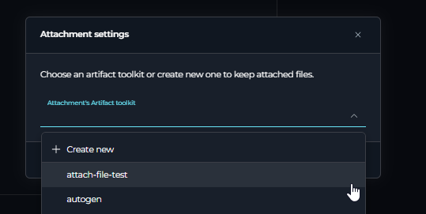
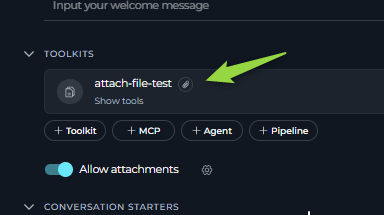
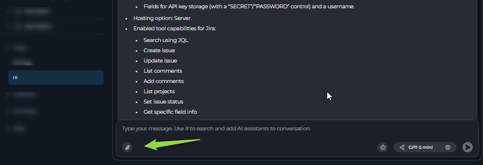
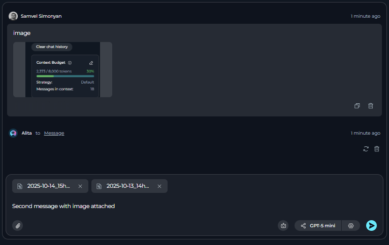
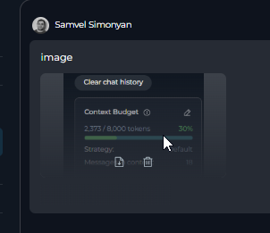
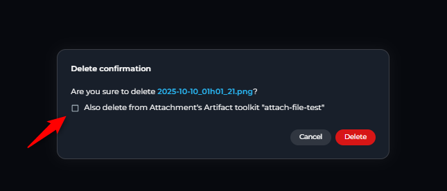

# Guide: Attaching Images and Files in Elitea

## Introduction

### Purpose and Overview

This guide provides detailed instructions on how to enable, use, and manage the file attachment functionality within Elitea chats. This feature allows users to upload images and files directly into conversations with Agents and Pipelines, enabling AI-powered analysis of visual content.

This document covers the setup process, methods for attaching images, managing attached files, and troubleshooting common issues.

### How it Works: The Artifacts Connection

The attachment functionality is integrated with the **Artifact Toolkit**. When you enable attachments for an Agent, Pipeline, or a specific chat, you must link it to an Artifact Toolkit.

*   **Storage:** Every file you attach is automatically uploaded and stored in the specific Artifact bucket associated with that toolkit.
*   **Access:** This allows the AI agent to access the image for analysis and also provides a centralized location for you to manage these files via the **Artifacts** section of the platform.
*   **Retention:** Files are subject to the retention policy of the bucket they are stored in. By default, new buckets have a retention period of 30 days, after which files are automatically deleted. Retention period can be changed manually.

For more information on how buckets and retention policies work, please refer to the [ELITEA Artifact Functionality](../menus/artifacts.md).

### Key Terms

*   **Attachment:** A file or image uploaded by a user into a chat conversation.
*   **Artifact Toolkit:** The Elitea tool responsible for managing file storage in project-specific buckets.
*   **Bucket:** A folder-like container within the Artifacts system where attached files are stored.
*   **Attachment Toolkit:** An instance of the Artifact Toolkit that has been specifically selected to handle the attachment functionality for an Agent, Pipeline, or chat.

## Prerequisites

*   **Permissions:** You must have **Editor** or **Admin** role privileges within the project to enable or configure the attachment functionality for Agents and Pipelines.
*   **Artifact Toolkit (Optional):** You can use an existing Artifact Toolkit or create a new one during the setup process.

## Enabling Attachments

You can enable the attachment feature for Agent/Pipeline from the Agent/Pipeline configuration screen, or for conversation-chats directly from a chat window.

### For Agents and Pipelines

1.  **Navigate to Configuration:** Go to the **Agents** or **Pipelines** list, select the desired item, and open its **Configuration** tab.
2.  **Locate the Toggle:** Find the **Allow attachments** toggle under toolkit section. By default, it is disabled.

    
  

3.  **Enable Attachments:** Click the toggle to enable it. An **Attachment settings** pop-up will appear.
4.  **Configure the Artifact Toolkit:** You have two options:
    *   **Select an Existing Toolkit:** If you already have an Artifact Toolkit you wish to use for storing attachments, select it from the dropdown menu.
    *   **Create a New Toolkit:** Select the "Create new" option. You will be prompted to provide a **Bucket name**. You can use a new name to create a new bucket or enter an existing bucket name.

    

5.  **Save and Confirm:** After selecting or creating a toolkit, click **Save**.
    *   The **Allow attachments** feature will now be active.
    *   The selected Artifact Toolkit will be added to your Agent/Pipeline's tool list, marked with a special paperclip icon to indicate it's designated for attachments.

    

### From a Chat Conversation

You can also enable attachments on-the-fly directly within a chat.

1.  **Start a Chat:** Open a new or existing chat.
2.  **Click the Attach Icon:** In the message input area, click the paperclip icon. If attachments are not yet configured for this chat, the **Attachment settings** pop-up will appear.
3.  **Configure the Toolkit:** Follow the same steps as described above (Step 4) to select an existing Artifact Toolkit or create a new one.
4.  **Activation:** Once saved, the attachment functionality will be enabled for this specific chat conversation.

## Using Attachments in Chat

Once enabled, click on the paperclip icon and you will see "Attach files" and "Attachment settings" options. 

### How to Attach Images

You have three ways to add images to your message prompt both in conversation-chat and in Agent/Pipeline chats:

1.  **Click the Icon:** Click the active paperclip icon in the message input area to open your system's file browser and select your images.
2.  **Drag and Drop:** Drag image files directly from your computer and drop them into the chat window's text input area.
3.  **Paste from Clipboard:** Copy an image to your clipboard and paste it directly into the text input area (using `Ctrl+V` or `Cmd+V`).

### Sending a Message with Attachments

*   After attaching your images, you will see their thumbnails appear above the text input area.
*   **Text is Required:** You must type a text prompt to accompany your images. The "Send" button will remain disabled until text is added.
*   Click the **Send** button. The message, along with the attached images, will be sent to the AI for processing.

### Viewing and Managing Attachments in the Chat

*   **Thumbnails:** Sent images are displayed as clickable thumbnails within the chat history. When clicked, the image will be enlarged
*   **Management Options:** When you hover over an image thumbnail in the chat, two icons will appear: **Download** and **Delete**.

    

### Deleting Attachments

When you click the **Delete** (trash can) icon on an attachment, a confirmation pop-up appears with a crucial choice:

*   **Delete from Chat Only:** If you simply confirm the deletion, the image thumbnail will be removed from the chat conversation, but the original file will remain in the Artifact bucket.
*   **Delete from Chat and Artifacts:** Check the box that says **"Also delete from artifact toolkit"** before confirming. This will permanently delete the image from both the chat conversation and the underlying Artifact storage bucket.

## Advanced Configuration

### Changing the Attachment Bucket

If you need to change the Artifact Toolkit (and therefore the storage bucket) used for attachments:

#### In case of Agent/Pipeline

1.  Navigate to the Agent/Pipeline **Configuration** tab, 
2. Click the **gear icon** next to the **Allow attachments** toggle and select another attachment artifact toolkit.
3.  Click save and the new toolkit will be added to the agent

**Note:** The old Artifact Toolkit will *not* be automatically removed from the agent's tool list. You must manually delete it if it's no longer needed. Previously attached images will remain associated with their original bucket.

#### In case of conversation-chat 

1.  Click the paperclip icon. 
2.  Select the **Attachments Settings** option
3.  In the pop-up, select a different Artifact Toolkit or create a new one.

### Disabling Attachments

#### In case of Agent/Pipeline

**Option 1**

1.  Navigate to the configuration tab where you enabled the feature.
2.  Click the **Allow attachments** toggle to turn it off. A confirmation pop-up will appear.
3.  **Optional Removal:** You can check the box **"Also remove attachments artifact toolkit from the agent"** to both disable the feature and remove the designated toolkit from the agent's tool list.
4.  Confirm your choice. The paperclip icon in chats will become inactive, but previously attached images will remain visible in the chat history.

**Option 2**
1.  Navigate to the configuration tab where you enabled the feature.
2.  Remove the artifact toolkit associated with the attachment functionality.

#### In case of conversation-chat 

1.  Remove the artifact toolkit associated with the attachment functionality from the participants section on the right 

## Supported Formats and Limitations

### Supported Image Formats

Currently, the following image formats are supported for direct analysis by LLMs:

*   `.jpeg`
*   `.jpg`
*   `.png`
*   `.gif` (Only the first frame of animated GIFs will be processed)
*   `.webp`
*   `.bmp`
*   `.svg`

### File Size and Quantity Limits

*   **Quantity:** You can attach a maximum of **10 images** per message. If you attempt to attach more, only the first 10 will be accepted, and a warning will be displayed.
*   **File Size:** The maximum size for a single image depends on the AI model being used by the agent. e.g.
    *   **Anthropic (Claude) Models:** 5 MB per image.
    *   **OpenAI (GPT) Models:** 20 MB per image.

## Troubleshooting

*   **Error Message about File Size:**
    *   **Problem:** After sending a message with multiple images, you receive an error from the LLM provider related to file size.
    *   **Cause:** At least one of the attached images exceeds the size limit for the currently active AI model. If even one file is too large, the entire message (text and all images) will fail to be processed by the LLM.
    *   **Solution:** Identify and remove the oversized image, then resend the message.

*   **Attachment Icon is Disabled/Greyed Out:**
    *   **Problem:** You cannot click the paperclip icon in the chat.
    *   **Cause:** Attachments have not yet been enabled for the Agent/Pipeline.
    *   **Solution:** Follow the steps in the "Enabling Attachments" section. If you do not have Editor/Admin permissions, contact someone who does.

*   **Confusion with Duplicate Filenames:**
    *   **Problem:** You upload an image named `report.png`, and later upload a different image also named `report.png`.
    *   **Behavior:** In the Artifact bucket, the second `report.png` will overwrite and replace the first one. However, in your chat history, the original thumbnail will still be visible. This can lead to confusion and data loss.
    *   **Recommendation:** Avoid using identical filenames for different images within the same chat or bucket to prevent this issue.

*   **Image Visible in Chat but "Not Found" in Artifacts:**
    *   **Problem:** You can see an image thumbnail in the chat, but you cannot find the file in the designated Artifact bucket.
    *   **Cause:** The file was likely deleted directly from the **Artifacts** page, or its retention period expired, or attachment-associated bucket was changed.

*   **Cannot Delete Attachment from Chat when "Also delete from artifact toolkit" is Checked:**
    *   **Problem:** When attempting to delete an attachment from chat with the "Also delete from artifact toolkit" option checked, the deletion fails or shows an error.
    *   **Cause:** The associated artifact toolkit was changed after the file was uploaded, or the file was already deleted from the bucket earlier through the Artifacts page.
    *   **Solution:** Uncheck the "Also delete from artifact toolkit" option and delete only from chat, or verify the current artifact toolkit configuration matches where the file was originally stored.

## FAQ

**Q: Where are my attached images stored?**
**A:** All attachments are stored in the Artifact bucket that you configured when you enabled the "Allow attachments" feature. You can view and manage these files directly from the **Artifacts** section in the main navigation menu.

**Q: How long are my images stored?**
**A:** By default, new Artifact buckets are created with a 30-day retention period. This means files older than 30 days will be automatically and permanently deleted. You can view and modify this retention period from the **Artifacts** page.

**Q: Can I use attachments in a chat with multiple agents?**
**A:** Yes. In Elitea conversation-chat page, the attachment functionality is tied to the *chat session itself*, not the specific agent that is currently active. When you attach a file, it is saved to the chat's designated bucket. All agents participating in that chat can see the conversation history, including the attached images.

**Q: Can I recover an image after I delete it?**
**A:** No. Deletion is permanent. If you delete an image from the Artifacts bucket or use the "delete from artifact" option in the chat, it cannot be recovered.

**Q: Why can't I send a message with just an image and no text?**
**A:** The system requires a text prompt to provide context to the AI model on how to interpret or what to do with the image(s). The "Send" button will only become active after you have entered some text.

**Q: How many tokens are spent per image?**
**A:** It depends on the LLM and LLM provider. Check their documentation for specific details. For example, for Claude it is a fixed number of tokens per image, while for GPT it depends on the image size and resolution.

## A Note on Non-Image File Attachments

Attaching other files (like `.txt`, `.pdf`, `.csv`, `.pptx`, `.xlsx`, `.docx`, `.json`,`.yaml`, code file and more ) is in a demo stage. These files will be saved to the Artifact bucket similarly, but their analysis follows a different path. They are not sent directly to the LLM like images. Instead, they can be read using artifact tools, indexed into a vector database for searching, or processed according to your text prompt and the agent's capabilities.