# Attachments in Conversations

## Overview

Attach files and images directly to chat conversations for AI-powered analysis. This feature enables multimodal interactions where AI can process visual content, documents, and data files alongside text-based queries.

**Key Capabilities:**

- **Image Analysis**: Upload images for visual analysis, OCR, content extraction, and AI-powered interpretation
- **Document Processing**: Attach documents for content indexing, semantic search, and information retrieval
- **Data Files**: Upload CSV, JSON, and other data formats for analysis and processing
- **Multiple Upload Methods**: Click to browse, drag-and-drop, or paste from clipboard
- **Centralized Storage**: All attachments stored in Artifact buckets with configurable retention policies

---

## How Attachments Work

The attachment functionality is integrated with the **Artifact Toolkit**.

*   **Storage:** Every file you attach is automatically uploaded and stored in an Artifact bucket. The backend always uses the default `attachments` bucket — no manual Artifact Toolkit configuration is required.
*   **Access:** This allows the AI agent to access the file for analysis and also provides a centralized location for you to manage these files via the **Artifacts** section of the platform.
*   **Retention:** Files are subject to the retention policy of the bucket they are stored in. By default, new buckets have a retention period of 30 days, after which files are automatically deleted. Retention period can be changed manually.

For detailed information about bucket management and retention policies, see the [Artifacts Documentation](../../menus/artifacts.md).

---

## Prerequisites

Before using attachments, ensure you have:

- **Permission Level**: Editor or Admin role within the project (required for Agent configuration)
- **Active Conversation**: An existing conversation or agent

!!! info "User Permissions"
    Any user with conversation access can attach files once attachments are enabled. Editor or Admin permissions are only required for enabling attachments on Agents.

---

## Enabling Attachments

Attachments must be explicitly enabled before use.

### Enable Attachments for Agents

Configure attachment capabilities at the Agent level to enable file uploads in all conversations using that agent.

1. Navigate to **Agents** from the main menu
2. Select the agent to configure
3. On the **Configuration** tab, locate the **Allow attachments** toggle in the INTERNAL TOOLS section (disabled by default)
4. Click the toggle to enable attachments
5. Save the agent
6. Click the paperclip icon — the file browser opens

**Result:** The `Attachments` internal tool is added to the agent. The backend automatically provisions storage using the default `attachments` bucket — no additional toolkit configuration is required. The paperclip icon becomes enabled in the message input area when using this agent in a conversation.

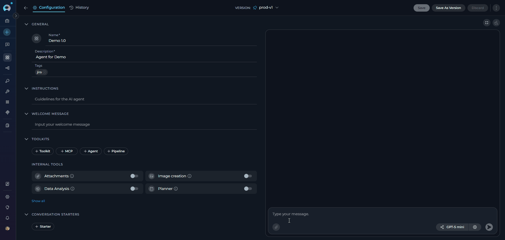{loading=lazy}

### Enable Attachments in a Conversation

Enable attachments directly within an active chat session without modifying the agent configuration.

1. Open a new or existing conversation
2. Locate the **paperclip icon** in the message input area
3. Click the paperclip icon — the file browser opens directly

**Result:** Attachments are immediately available. No additional setup is required.

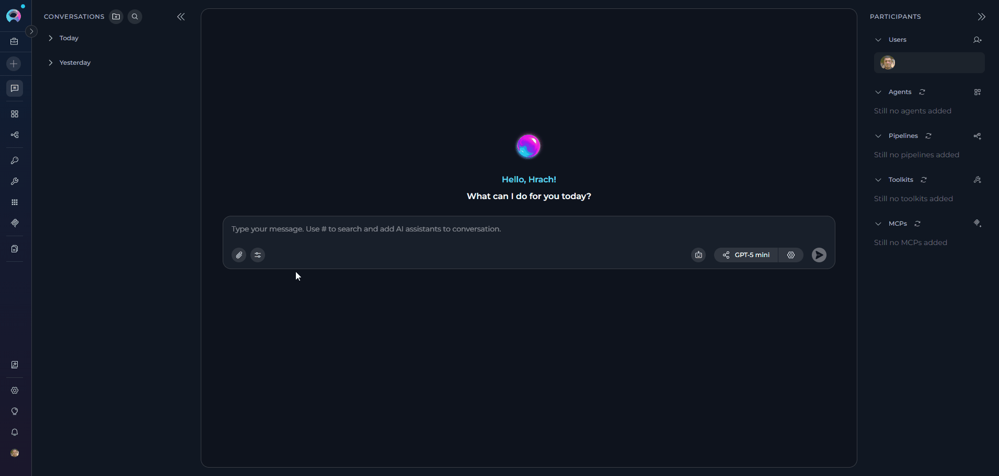{loading=lazy}

### Using Agents with Attachments in Conversations

When you use an agent that has attachments enabled in a conversation, the paperclip icon is automatically enabled in the message input area — no additional steps are required. The attachment state is determined by the active agent's configuration.

- If the active agent has **Allow attachments** enabled, the paperclip is active and you can attach files immediately
- If you switch to an agent without attachments enabled, the paperclip becomes inactive
- The same applies when the agent is used as a nested agent inside another agent

     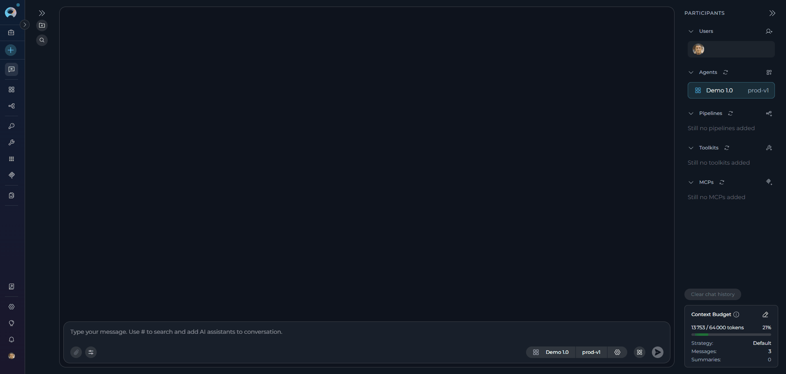{loading=lazy}

!!! info "LLM Chat Conversations"
    In direct LLM chat conversations (without an agent), attachments are always available — no configuration is required. Click the paperclip icon to start attaching files immediately.

---

## Using Attachments in Conversations

When attachments are available — either because you are in a direct LLM chat, using an agent with **Allow attachments** enabled, or in a conversation where attachments are active — the paperclip icon in the message input area is enabled and ready to use.

**Upload Files**

Three methods are available for attaching files:

**Method 1: Click to Browse**

1. Click the **paperclip icon** in the message input area
2. Browse and select files from your file system
3. Click **Open** to attach selected files

     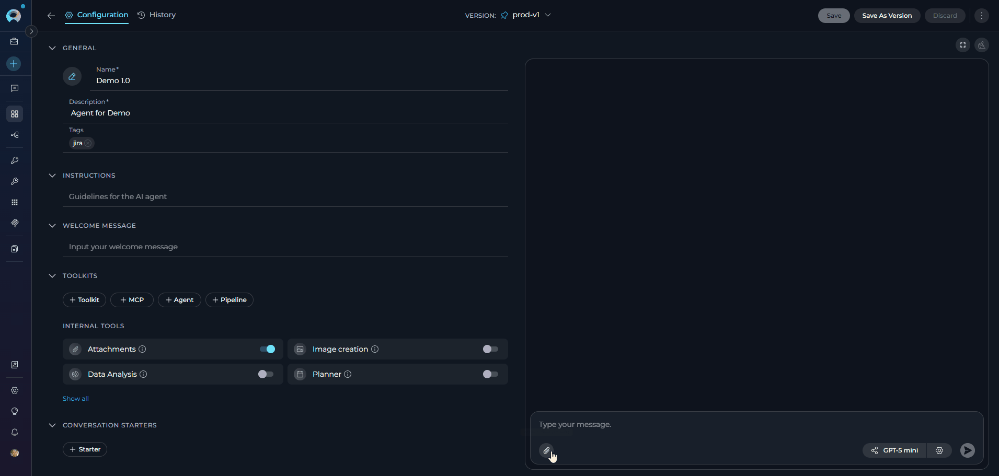{width="500"}

**Method 2: Drag and Drop**

1. Select files from your file explorer
2. Drag files directly into the message input area
3. Release to attach files

     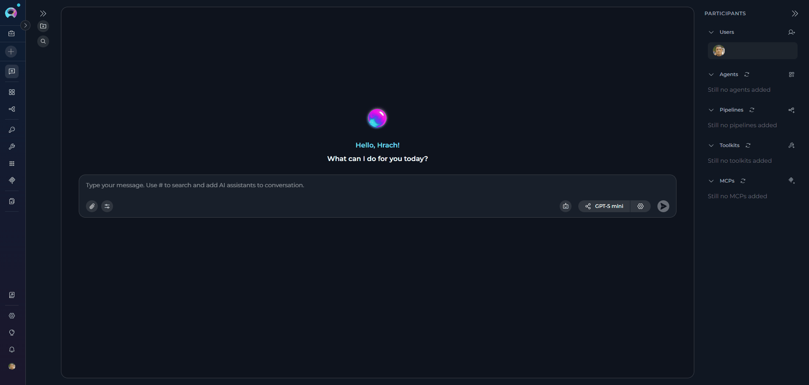{width="500"}

**Method 3: Paste from Clipboard**

1. Copy an image to your clipboard (Ctrl+C or Cmd+C)
2. Click inside the message input area
3. Paste the image (Ctrl+V or Cmd+V)

     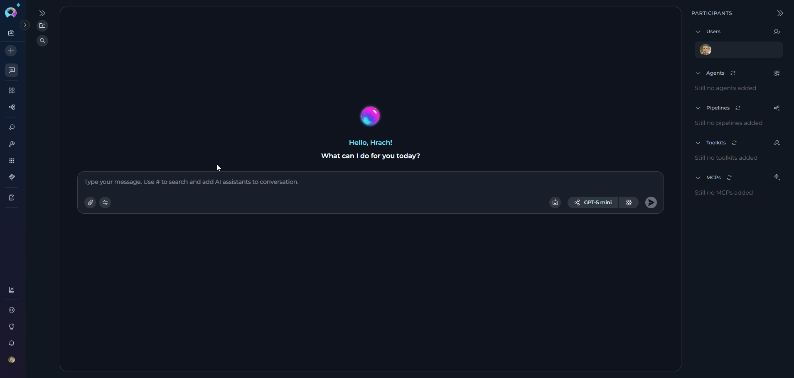{width="500"}

!!! note "Duplicate File Handling"
    If you upload a file with the same name as an existing attachment, it is automatically renamed by appending a timestamp and file size (e.g., `image_20251106_143022_1.50KB.png`). No error is shown and both files are preserved.

**Send Message with Attachments**

1. After attaching files, thumbnails appear above the message input area
2. **Type a text prompt** describing what you want the AI to do (required)
3. Click the **Send** button

     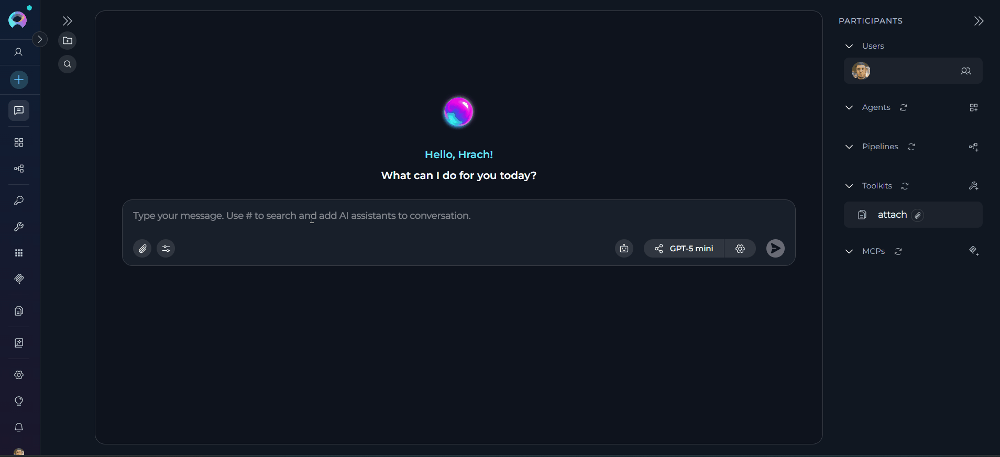{loading=lazy}

!!! info "Text Required"
    The Send button remains disabled until you enter text. A text prompt provides context for the AI to understand how to process your attachments. When sent, each file is automatically uploaded to the default `attachments` Artifact bucket and can be viewed and managed from the **Artifacts** section in the main navigation.

### Manage Attachments in Chat

**View Attachments**

- Sent attachments display as clickable thumbnails in the chat history
- Click any thumbnail to view the full-size image or preview the file

**Download or Delete Attachments**

1. Hover over any attachment thumbnail in the chat
2. Two icons appear:
      - **Download icon**: Save the file to your local system
      - **Delete icon** (trash can): Remove the attachment

     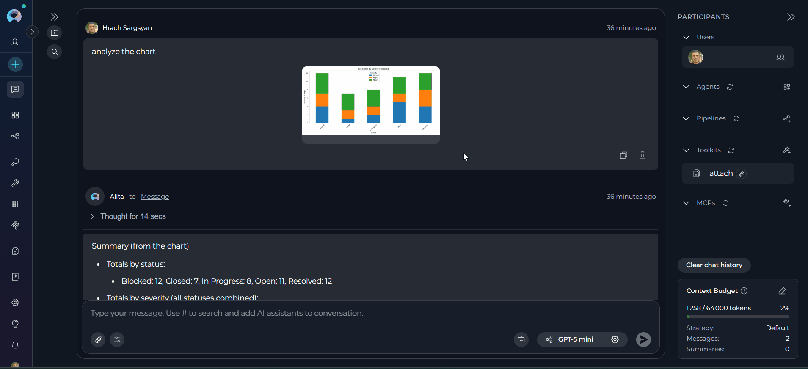{loading=lazy}

### Delete Attachments

When clicking the delete (trash can) icon, a confirmation dialog provides two deletion options:

**Option 1: Delete from Chat Only** (default)

- Removes the thumbnail from the conversation
- Original file remains in the Artifact bucket
- File remains accessible via the Artifacts menu

**Option 2: Delete from Chat and Artifacts**

- Check the box: **"Also delete from artifact toolkit"**
- Removes the thumbnail from the conversation
- **Permanently deletes** the file from the Artifact bucket
- File cannot be recovered

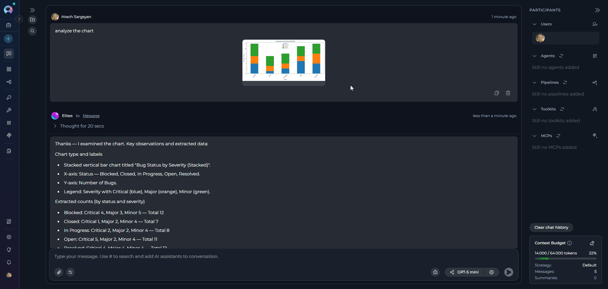{loading=lazy}

!!! warning "Permanent Deletion"
    When "Also delete from artifact toolkit" is checked, the file is permanently deleted from storage and cannot be recovered. Use this option carefully.

### Disable Attachments For Agents

1. Navigate to the Agent **Configuration** tab
2. Click the **Allow attachments** toggle to turn it off
3. Save the agent

**Result:** The paperclip icon becomes inactive in new conversations. Previously attached files remain visible in existing chat history.

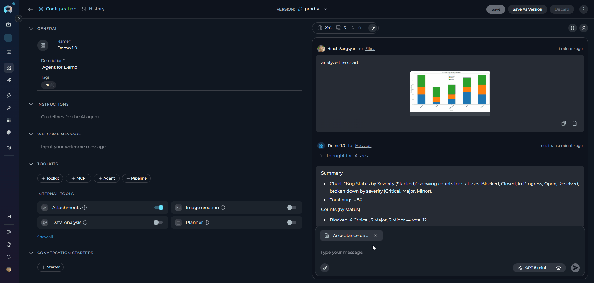{loading=lazy}

---

## Working with Non-Image Files

Non-image file attachments follow a different processing workflow than images. While images are analyzed directly by the LLM's vision capabilities, other file types are indexed for semantic search and retrieval.

**Processing Workflow:**

1. **Upload**: File is uploaded to the default `attachments` bucket
2. **Indexing**: File content is automatically extracted and indexed into a vector database
3. **Retrieval**: When you query, relevant content is retrieved through semantic search

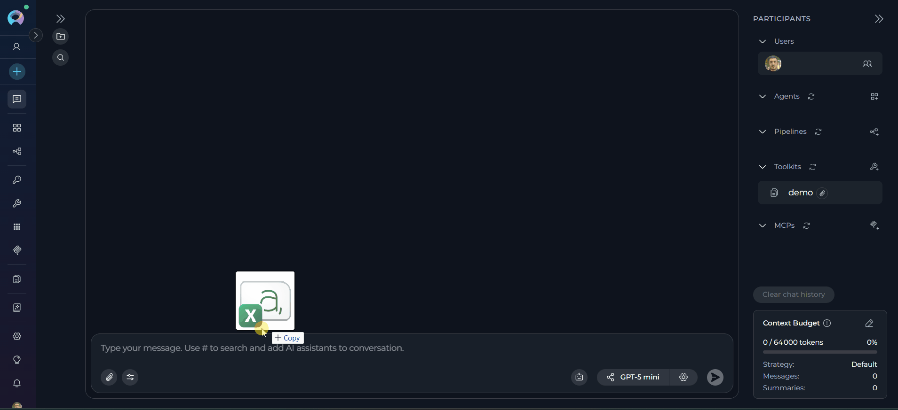{loading=lazy}

**Key Differences from Images:**

| Feature | Images | Non-Image Files |
|---------|--------|-----------------|
| Processing | Sent directly to LLM | Indexed in vector DB |
| Analysis | Real-time vision analysis | Semantic search retrieval |
| Query type | Visual analysis | Content-based search |
| Token usage | Per image | Per retrieved chunk |

!!! tip "Specificity Improves Results"
    Since content is retrieved through semantic search, specific queries that describe the information you're looking for will yield better results than general summarization requests.

**Shared Collection Behavior**

All non-image attachments are indexed into the same storage collection in the default `attachments` bucket.

**Implications:**

- Search results may include content from previously attached files (if using the same toolkit)
- Queries might retrieve information from multiple uploaded files
- Results may include content you didn't intend to search

**Recommendations:**

1. **Be specific in queries** to avoid retrieving irrelevant content from other files
2. **Include context** in queries to help narrow down relevant content
3. **Reference filenames** when querying if you need content from a specific file

**Usage Tips** 

??? tip "Structure your queries effectively"
    Instead of asking "What does the file say?", ask "What are the recommended security practices mentioned in the uploaded security guidelines?"

??? tip "Include context in your prompt"
    Reference the file type or subject: "In the uploaded project plan, what are the Q2 milestones?"

??? tip "Query for specific sections"
    Ask for particular information: "Find all mentions of API rate limits in the uploaded documentation"

??? tip "Use keywords from your files"
    If you know specific terms appear in your files, include them in queries to improve retrieval accuracy

---

## Supported File Types and Limits

**Image Formats**

Images are sent directly to the LLM for visual analysis. Supported formats include:

| Extension | Notes |
|-----------|-------|
| `.jpg` / `.jpeg` | Standard compressed image format |
| `.png` | Lossless compression with transparency |
| `.gif` | First frame only for animated GIFs |
| `.bmp` | Uncompressed raster format |
| `.webp` | Modern compressed format |
| `.svg` | Vector-based graphics |
| `.tiff` / `.tif` | High-quality raster format |
| `.ico` | Windows icon format |
| `.apng` | Animated PNG format |
| `.avif` | Next-gen compressed format |

!!! note "Image Processing"
    Images are sent directly to the LLM's vision capabilities for analysis. Animated GIFs are processed using only the first frame.

**Documents & Data Files**

Documents and data files are indexed into a vector database for semantic search and retrieval. Supported types include:

| Extension | Category |
|-----------|----------|
| `.pdf` | Document |
| `.doc` / `.docx` | Document |
| `.ppt` / `.pptx` | Presentation |
| `.xls` / `.xlsx` | Spreadsheet |
| `.txt` | Text |
| `.md` | Text |
| `.csv` | Data |
| `.json` | Data |
| `.yaml` / `.yml` | Data |
| `.xml` | Data |

**Programming & Code Files**

Source code files are indexed and their content is made available for AI analysis. Supported languages include:

| Extension | Language |
|-----------|----------|
| `.py` | Python |
| `.js` | JavaScript |
| `.ts` | TypeScript |
| `.java` | Java |
| `.cpp` / `.c` / `.h` | C / C++ |
| `.cs` | C# |
| `.go` | Go |
| `.rb` | Ruby |
| `.php` | PHP |
| `.swift` | Swift |
| `.kt` | Kotlin |
| `.rs` | Rust |
| `.html` | HTML |
| `.css` | CSS |
| `.sql` | SQL |
| `.sh` | Shell |

!!! note "Programming File Support"
    You can attach source code files directly to a conversation. The AI reads and analyzes the full code content — enabling code review, bug detection, refactoring suggestions, explanations, and more — without requiring any copy-paste.

!!! info "File Types and Processing"
    Supported types are configured dynamically per ELITEA deployment — unsupported files are rejected with an error listing allowed extensions. Unlike images, non-image files are indexed into a vector database and retrieved via semantic search rather than sent directly to the LLM.

**File Size and Quantity Limits**

| Limit | Default Value | Notes |
|-------|---------------|-------|
| Maximum attachments per message | 10 files | SVG files are not counted toward this limit |
| Maximum total size per message | 150 MB | Combined size of all attachments |
| Maximum individual file size | 150 MB | Applies to any single file |
| Maximum individual image size | 5 MB | SVG files are not subject to this limit |

!!! info "Limits and Validation"
    All limits are configurable per ELITEA deployment — the values above are defaults. Images exceeding 5 MB are rejected client-side before sending; SVG files are exempt from this restriction.

---

## FAQ

??? question "Where are my attached files stored?"
    All attachments are stored in the default `attachments` bucket. You can view and manage these files from the **Artifacts** menu in the main navigation.

??? question "How long are files stored?"
    By default, new Artifact buckets have a 30-day retention period. Files older than the retention period are automatically deleted. You can view and modify retention periods from the **Artifacts** page.

??? question "Can I use attachments with multiple agents in one conversation?"
    Yes. In conversations, all attachments are saved to the default `attachments` bucket. All agents participating in that conversation can access the chat history, including attachments. Which agents can process attachments depends on their individual configuration — only agents with **Allow attachments** enabled can actively use attached files.

??? question "Can I recover a deleted attachment?"
    No. Deletion is permanent. If you delete a file from the Artifacts bucket or use the "delete from artifact" option in chat, it cannot be recovered.

??? question "Why can't I send a message with only an attachment and no text?"
    The system requires a text prompt to provide context about how the AI should interpret or process the attachment(s). The Send button activates only after you enter text.

??? question "How many tokens does an image consume?"
    Token consumption varies by LLM provider:
    
    - **Claude (Anthropic)**: Fixed number of tokens per image (consult model documentation)
    - **GPT (OpenAI)**: Varies based on image size and resolution
    
    Check your LLM provider's documentation for specific token costs.

??? question "What happens when I attach the same filename twice?"
    Duplicate filenames are handled automatically. The system renames the new file by appending a timestamp and file size (e.g., `image_20251106_143022_1.50KB.png`). Both files are preserved in the bucket with distinct names — no error is shown and no data is overwritten.

??? question "Can I use attachments in Pipeline conversations?"
    No. The **Allow attachments** toggle is not available in pipeline configuration — the INTERNAL TOOLS section is hidden for pipelines entirely. To use attachments in a pipeline-based conversation, either:
    
    - Enable attachments on an **agent** and add it as a participant in the conversation, or
    - Use the **conversation-level** paperclip icon to attach files directly in that session

---

## Troubleshooting

??? warning "File size exceeds image limit"
    **Error:** Image is rejected when attaching
    
    **Cause:** The image exceeds the 5 MB per-image size limit (SVG files are exempt).
    
    **Solution:** 
    
    1. Compress or resize the image below 5 MB
    2. For SVG files, the size limit does not apply
    3. Re-attach the file

??? warning "Paperclip icon is disabled"
    **Symptom:** Cannot click the paperclip icon in the chat
    
    **Cause:** Attachments have not been enabled for this Agent or conversation
    
    **Solution:**
    
    1. Follow the "Enabling Attachments" instructions above
    2. Verify you have Editor/Admin permissions (for Agent configuration)
    3. Contact a project administrator if permissions are insufficient

??? warning "Unexpected filename in chat after upload"
    **Symptom:** Attached file appears with a different name than the original (e.g., `image_20251106_143022_1.50KB.png`)
    
    **Cause:** A file with the same name was already attached. The system automatically renames duplicates with a timestamp and file size suffix to avoid overwriting existing files.
    
    **Solution:** This is expected behavior. Both files are preserved. Use unique filenames if you need to distinguish uploads easily.

??? warning "Attachment visible in chat but not found in Artifacts"
    **Symptom:** Thumbnail appears in chat, but file is missing from Artifacts menu
    
    **Possible Causes:**
    
    - File was deleted directly from the Artifacts page
    - Retention period expired and file was auto-deleted
    
    **Solution:** Files deleted from Artifacts cannot be recovered. Re-upload if needed.

??? warning "Cannot delete attachment with \"Also delete from artifact toolkit\" option"
    **Error:** Deletion fails when "Also delete from artifact toolkit" is checked
    
    **Possible Causes:**
    
    - File was already deleted from the bucket via the Artifacts page
    
    **Solution:**
    
    1. Uncheck "Also delete from artifact toolkit"
    2. Delete from chat only

??? warning "Maximum attachment limit reached"
    **Error:** Cannot attach more files to a message
    
    **Cause:** Attempting to attach more than the maximum number of files per message (default: 10)
    
    **Solution:**
    
    1. Remove some attachments to stay within the limit
    2. Send multiple messages if needed
    3. Combine related content into fewer files when possible

??? warning "Maximum image attachment limit reached"
    **Error:** Toast warning — `Maximum N image attachments allowed`
    
    **Cause:** The number of non-SVG images attached would exceed the image attachment limit (default: 10). SVG files do not count toward this limit.
    
    **Solution:**
    
    1. Remove some image attachments
    2. Convert images to SVG format if applicable (SVGs are exempt from this count)
    3. Send images across multiple messages

??? warning "Total message size exceeds limit"
    **Error:** Message fails to send due to total attachment size
    
    **Cause:** Combined size of all attachments exceeds 150 MB
    
    **Solution:**
    
    1. Reduce number of attachments
    2. Compress images or files
    3. Send multiple messages with fewer attachments each

---

!!! info "Related Documentation"
    For more information about related features and configurations:

    - **[Data Analysis Internal Tool](data-analysis-internal-tool.md)** - Analyze CSV and data files with Pandas capabilities
    - **[Artifacts Menu](../../menus/artifacts.md)** - Manage buckets, retention policies, and file storage
    - **[Agent Configuration](../../menus/agents.md)** - Configure agents with attachment support
    - **[Chat Functionality](how-to-use-chat-functionality.md)** - General chat features and usage
    - **[Python Sandbox](python-sandbox-internal-tool.md)** - Execute custom Python code with file access