# Attachments in Conversations

## Overview

Attach files and images directly to chat conversations for AI-powered analysis. This feature enables multimodal interactions where AI can process visual content, documents, and data files alongside text-based queries.

**Key Capabilities:**

- **Image Analysis**: Upload images for visual analysis, OCR, content extraction, and AI-powered interpretation
- **Document Processing**: Attach documents for content indexing, semantic search, and information retrieval
- **Data Files**: Upload CSV, JSON, and other data formats for analysis and processing
- **Multiple Upload Methods**: Click to browse, drag-and-drop, or paste from clipboard
- **Centralized Storage**: All attachments stored in Artifact buckets with configurable retention policies

---

## How Attachments Work

The attachment functionality is integrated with the **Artifact Toolkit**. When you enable attachments for an Agent, Pipeline, or a specific chat, you must link it to an Artifact Toolkit.

*   **Storage:** Every file you attach is automatically uploaded and stored in the specific Artifact bucket associated with that toolkit.
*   **Access:** This allows the AI agent to access the image for analysis and also provides a centralized location for you to manage these files via the **Artifacts** section of the platform.
*   **Retention:** Files are subject to the retention policy of the bucket they are stored in. By default, new buckets have a retention period of 30 days, after which files are automatically deleted. Retention period can be changed manually.

For detailed information about bucket management and retention policies, see the [Artifacts Documentation](../../menus/artifacts.md).

---

## Prerequisites

Before using attachments, ensure you have:

- **Permission Level**: Editor or Admin role within the project (required for Agent/Pipeline configuration)
- **Active Conversation**: An existing conversation, agent, or pipeline
- **Artifact Toolkit** (optional): You can use an existing toolkit or create one during setup

!!! info "User Permissions"
    Any user with conversation access can attach files once attachments are enabled. Editor or Admin permissions are only required for initial configuration of Agents and Pipelines.

---

## Enabling Attachments

Attachments must be explicitly enabled and linked to an Artifact Toolkit before use.

### Enable Attachments for Agents and Pipelines

Configure attachment capabilities at the Agent or Pipeline level to enable file uploads in all conversations using that configuration.

1. Navigate to **Agents** or **Pipelines** from the main menu
2. Select the agent or pipeline to configure
3. On the **Configuration** tab locate the **Allow attachments** toggle in the toolkit section (disabled by default)
4. Click the toggle to enable attachments
5. In the **Attachment settings** popup that appears, configure storage:

      **Option A: Use Existing Toolkit**

      - Select an existing Artifact Toolkit from the dropdown
      - Files will be stored in that toolkit's configured bucket

      **Option B: Create New Toolkit**

      - Select "Create new" from the dropdown
      - Enter a **Bucket name** (lowercase letters, numbers, hyphens only)
      - The bucket will be created automatically with the first file upload

7. Click **Save** to confirm

**Result:** The attachment feature activates and the Artifact Toolkit is added to your toolkit list with a paperclip icon indicator.

**Agents**

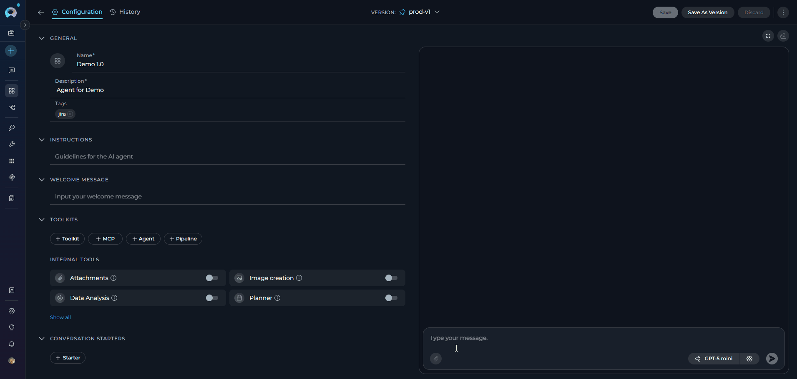{loading=lazy}

**Pipeline**

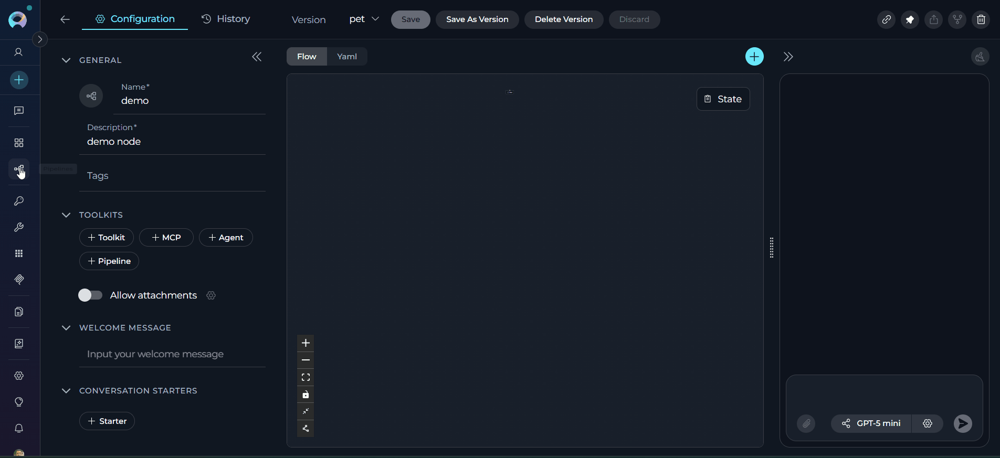{loading=lazy}

!!! note "Toolkit Management"
    The configured Artifact Toolkit appears in the toolkit list and can be managed like any other toolkit. The paperclip icon identifies it as the designated attachment storage.

### Enable Attachments in a Conversation

Enable attachments directly within an active chat session without modifying the agent configuration.

1. Open a new or existing conversation
2. Locate the **paperclip icon** in the message input area
3. Click the paperclip icon
4. If attachments are not configured, the **Attachment settings** popup appears automatically
5. Configure storage (same options as agent configuration):
     - Select an existing Artifact Toolkit, or
     - Create a new toolkit by entering a bucket name
6. Click **Save**

**Result:** Attachments are enabled for this conversation only. The configuration persists for the conversation session.

{loading=lazy}

### Adding Agents with Attachments to Conversations

When you add an agent or pipeline that has attachments enabled to a conversation (or use it as a nested agent within another agent), the attachment functionality is automatically activated.

**Automatic Behavior:**

1. Add an agent or pipeline with enabled attachments to your conversation, or configure it as a nested agent
2. Send your first message in the conversation
3. The agent's/pipeline's configured **Artifact Toolkit** is automatically added to the conversation's toolkit list after the first message
4. The paperclip icon becomes active
5. You can start attaching files without additional configuration

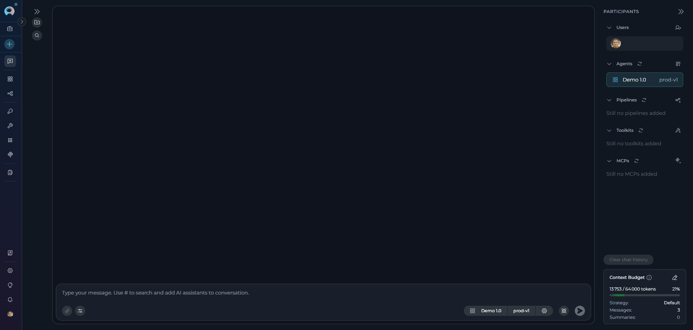{loading=lazy}

!!! tip "Seamless Integration"
    This automatic addition ensures that attachment capabilities are immediately available when working with agents or pipelines configured for file uploads, whether used directly in conversations or as nested agents. You don't need to manually enable attachments or configure toolkits.

---

## Using Attachments in Conversations

Once enabled, the paperclip icon becomes active and provides access to attachment options.

**Access Attachment Options**

Click the paperclip icon to reveal two options:

- **Attach files**: Upload new files to the conversation
- **Attachment settings**: Modify the configured Artifact Toolkit

{loading=lazy}

**Upload Files**

Three methods are available for attaching files:

**Method 1: Click to Browse**

1. Click the **paperclip icon** in the message input area
2. Select **Attach files**
3. Browse and select files from your file system
4. Click **Open** to attach selected files

**Method 2: Drag and Drop**

1. Select files from your file explorer
2. Drag files directly into the message input area
3. Release to attach files

**Method 3: Paste from Clipboard**

1. Copy an image to your clipboard (Ctrl+C or Cmd+C)
2. Click inside the message input area
3. Paste the image (Ctrl+V or Cmd+V)

!!! warning "Clipboard Limitation"
    When pasting multiple images from clipboard on Windows, files may have identical generic names (like "image.png"), causing duplicate filename errors. To avoid this, save images with unique filenames before uploading, or use the click/drag-and-drop methods instead.

**Send Message with Attachments**

1. After attaching files, thumbnails appear above the message input area
2. **Type a text prompt** describing what you want the AI to do (required)
3. Click the **Send** button

!!! info "Text Required"
    The Send button remains disabled until you enter text. A text prompt provides context for the AI to understand how to process your attachments.

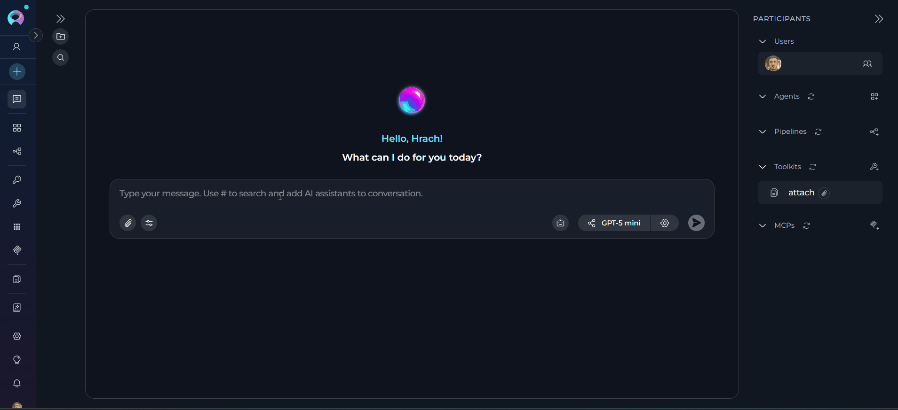{loading=lazy}

### Manage Attachments in Chat

**View Attachments**

- Sent attachments display as clickable thumbnails in the chat history
- Click any thumbnail to view the full-size image or preview the file

**Download or Delete Attachments**

1. Hover over any attachment thumbnail in the chat
2. Two icons appear:
      - **Download icon**: Save the file to your local system
      - **Delete icon** (trash can): Remove the attachment

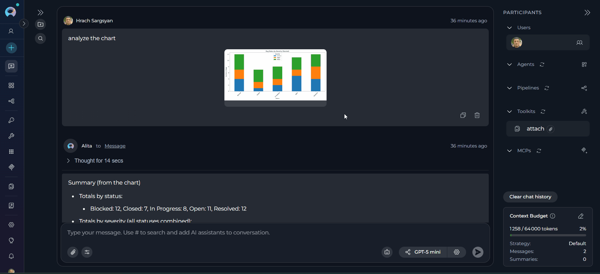{loading=lazy}

### Delete Attachments

When clicking the delete (trash can) icon, a confirmation dialog provides two deletion options:

**Option 1: Delete from Chat Only** (default)

- Removes the thumbnail from the conversation
- Original file remains in the Artifact bucket
- File remains accessible via the Artifacts menu

**Option 2: Delete from Chat and Artifacts**

- Check the box: **"Also delete from artifact toolkit"**
- Removes the thumbnail from the conversation
- **Permanently deletes** the file from the Artifact bucket
- File cannot be recovered

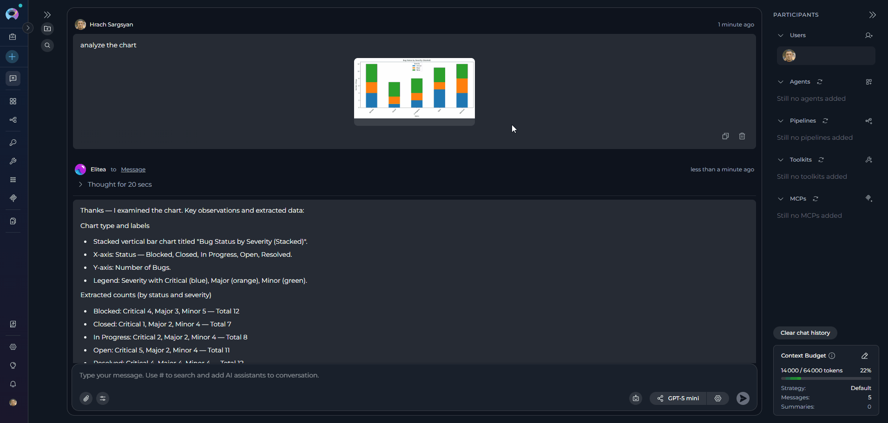{loading=lazy}

!!! warning "Permanent Deletion"
    When "Also delete from artifact toolkit" is checked, the file is permanently deleted from storage and cannot be recovered. Use this option carefully.

---

## Advanced Configuration

**Change Attachment Storage Bucket**

You can switch to a different Artifact Toolkit (and storage bucket) at any time.

**For Agents and Pipelines:**

1. Navigate to the Agent/Pipeline **Configuration** tab
2. Click the **gear icon** next to the **Allow attachments** toggle
3. Select a different Artifact Toolkit from the dropdown
4. Click **Save**

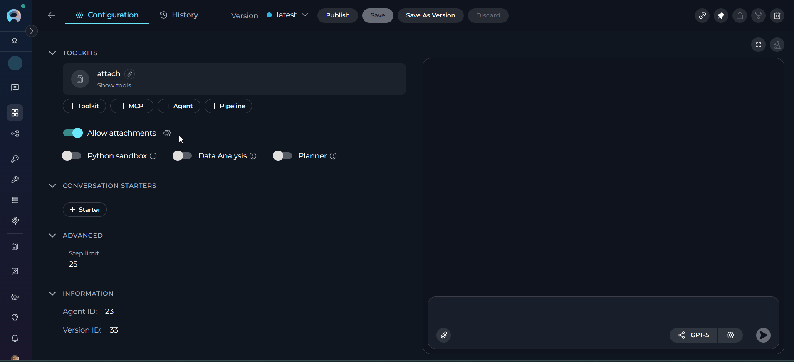{loading=lazy}

!!! note "Toolkit Cleanup"
    The previous Artifact Toolkit remains in the toolkit list and must be manually removed if no longer needed. Previously attached files remain associated with their original bucket.

**For Conversations:**

1. Click the **paperclip icon** in the message input area
2. Select **Attachment Settings**
3. Choose a different Artifact Toolkit or create a new one
4. Click **Save**

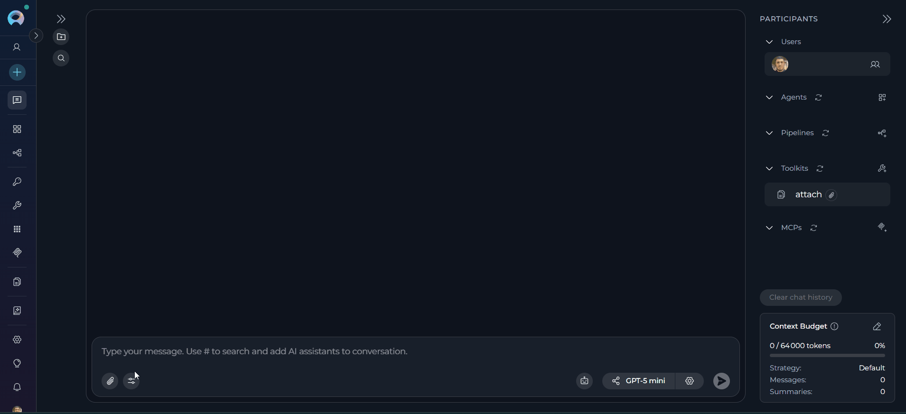{loading=lazy}

### Disable Attachments

**For Agents and Pipelines:**

*Method 1: Use the Toggle*

1. Navigate to the Agent/Pipeline **Configuration** tab
2. Click the **Allow attachments** toggle to turn it off
3. A confirmation popup appears with options:
     - Disable attachments only (default)
     - Check **"Also remove attachments artifact toolkit from the agent"** to remove the toolkit from the toolkit list
4. Confirm your choice

*Method 2: Remove the Toolkit*

1. Navigate to the Agent/Pipeline **Configuration** tab
2. Locate the Artifact Toolkit with the paperclip icon in the toolkit list
3. Remove the toolkit using the toolkit management controls

**Result:** The paperclip icon becomes inactive in new conversations. Previously attached files remain visible in existing chat history.

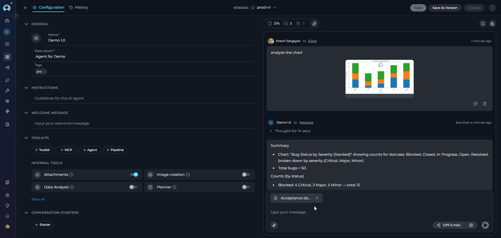{loading=lazy}

**For Conversations:**

1. Locate the Artifact Toolkit in the participants section (right panel)
2. Remove the toolkit from the conversation

**Result:** The paperclip icon becomes inactive. Previously attached files remain visible in chat history. 

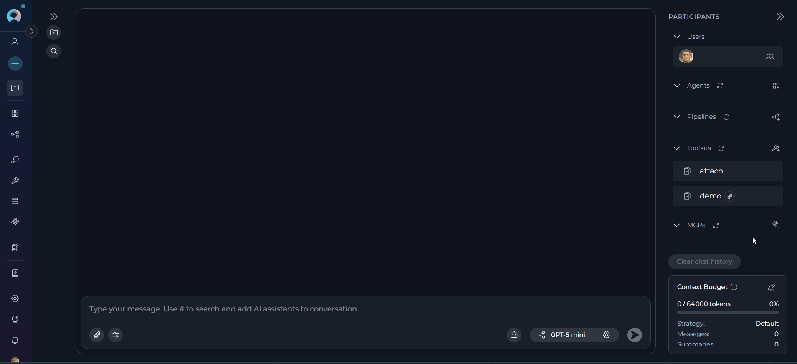{loading=lazy}

---

## Working with Non-Image Files

Non-image file attachments follow a different processing workflow than images. While images are analyzed directly by the LLM's vision capabilities, other file types are indexed for semantic search and retrieval.

**Processing Workflow:**

1. **Upload**: File is uploaded to the configured Artifact bucket
2. **Indexing**: File content is automatically extracted and indexed into a vector database
3. **Retrieval**: When you query, relevant content is retrieved through semantic search

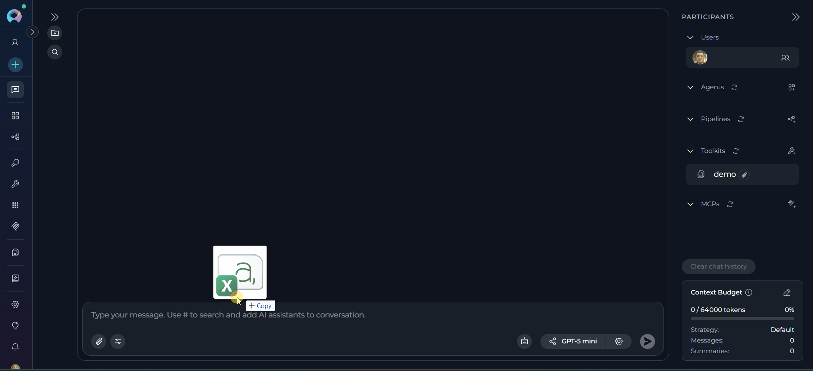{loading=lazy}

**Key Differences from Images:**

| Feature | Images | Non-Image Files |
|---------|--------|-----------------|
| Processing | Sent directly to LLM | Indexed in vector DB |
| Analysis | Real-time vision analysis | Semantic search retrieval |
| Query type | Visual analysis | Content-based search |
| Token usage | Per image | Per retrieved chunk |

!!! tip "Specificity Improves Results"
    Since content is retrieved through semantic search, specific queries that describe the information you're looking for will yield better results than general summarization requests.

**Shared Collection Behavior**

All non-image attachments using the same Artifact Toolkit are indexed into the same "attach" collection.

**Implications:**

- Search results may include content from previously attached files (if using the same toolkit)
- Queries might retrieve information from multiple uploaded files
- Results may include content you didn't intend to search

**Recommendations:**

1. **Be specific in queries** to avoid retrieving irrelevant content from other files
2. **Use different Artifact Toolkits** for different projects to maintain content separation
3. **Include context** in queries to help narrow down relevant content
4. **Reference filenames** when querying if you need content from a specific file

**Usage Tips** 

??? tip "Structure your queries effectively"
    Instead of asking "What does the file say?", ask "What are the recommended security practices mentioned in the uploaded security guidelines?"

??? tip "Include context in your prompt"
    Reference the file type or subject: "In the uploaded project plan, what are the Q2 milestones?"

??? tip "Query for specific sections"
    Ask for particular information: "Find all mentions of API rate limits in the uploaded documentation"

??? tip "Use keywords from your files"
    If you know specific terms appear in your files, include them in queries to improve retrieval accuracy

---

## Supported File Types and Limits

**Image Formats**

Images are sent directly to the LLM for visual analysis. Supported formats include:

| Extension | Notes |
|-----------|-------|
| `.jpg` / `.jpeg` | Standard compressed image format |
| `.png` | Lossless compression with transparency |
| `.gif` | First frame only for animated GIFs |
| `.bmp` | Uncompressed raster format |
| `.webp` | Modern compressed format |
| `.svg` | Vector-based graphics |
| `.tiff` / `.tif` | High-quality raster format |
| `.ico` | Windows icon format |
| `.apng` | Animated PNG format |
| `.avif` | Next-gen compressed format |

!!! note "Image Processing"
    Images are sent directly to the LLM's vision capabilities for analysis. Animated GIFs are processed using only the first frame.

**Non-Image File Types**

Non-image files are indexed into a vector database for semantic search and retrieval:

| Category | Extensions | Description |
|----------|------------|-------------|
| **Documents** | `.pdf` | PDF documents |
| | `.doc` / `.docx` | Microsoft Word documents |
| | `.ppt` / `.pptx` | Microsoft PowerPoint presentations |
| | `.xls` / `.xlsx` | Microsoft Excel spreadsheets |
| **Text & Data** | `.txt` | Plain text files |
| | `.md` / `.markdown` | Markdown documents |
| | `.json` | JSON data files |
| | `.yaml` / `.yml` | YAML configuration files |
| | `.csv` | Comma-separated values |
| | `.xml` | XML documents |
| **Code Files** | `.py`, `.js`, `.java`, `.cpp`, `.html`, `.css`, `.sql`, `.sh`, etc. | Programming language source files |

!!! info "Non-Image Processing"
    Unlike images, non-image files are not sent directly to the LLM. Instead, their content is indexed into a vector database collection named "attach" and retrieved through semantic search when relevant to your queries.

**File Size and Quantity Limits**

**Attachment Limits:**

- **Maximum attachments per message**: 10 files
- **Maximum total size per message**: 150 MB
- **Maximum individual file size**: 150 MB

**Image Size Limits by LLM Provider:**

The maximum size for individual images also depends on the AI model:

- **Anthropic (Claude) Models**: 5 MB per image
- **OpenAI (GPT) Models**: 20 MB per image
- **Other providers**: Consult model documentation

!!! warning "Size Validation"
    If any single file exceeds the LLM provider's size limit, the entire message (text and all attachments) will fail to be processed. Keep individual images within the appropriate size limit for your configured model.

---

## Frequently Asked Questions

??? question "Where are my attached files stored?"
    All attachments are stored in the Artifact bucket configured when you enabled attachments. You can view and manage these files from the **Artifacts** menu in the main navigation.

??? question "How long are files stored?"
    By default, new Artifact buckets have a 30-day retention period. Files older than the retention period are automatically deleted. You can view and modify retention periods from the **Artifacts** page.

??? question "Can I use attachments with multiple agents in one conversation?"
    Yes. In conversations, the attachment functionality is tied to the conversation session itself, not individual agents. When you attach a file, it's saved to the conversation's designated bucket. All agents participating in that conversation can access the chat history, including attachments.

??? question "Can I recover a deleted attachment?"
    No. Deletion is permanent. If you delete a file from the Artifacts bucket or use the "delete from artifact" option in chat, it cannot be recovered.

??? question "Why can't I send a message with only an attachment and no text?"
    The system requires a text prompt to provide context about how the AI should interpret or process the attachment(s). The Send button activates only after you enter text.

??? question "How many tokens does an image consume?"
    Token consumption varies by LLM provider:
    
    - **Claude (Anthropic)**: Fixed number of tokens per image (consult model documentation)
    - **GPT (OpenAI)**: Varies based on image size and resolution
    
    Check your LLM provider's documentation for specific token costs.

??? question "What happens when I attach the same filename twice?"
    When you upload a file with a name that already exists in the bucket:
    
    - The newer file overwrites the older one in the Artifact bucket
    - The original thumbnail remains visible in your chat history
    - This can cause confusion—use unique filenames to avoid this issue

??? question "Can I attach files in Agent/Pipeline chats?"
    Yes, if attachments are enabled in the Agent/Pipeline configuration. The configuration process is the same as described in the "Enable Attachments for Agents and Pipelines" section.

---

## Troubleshooting

??? warning "File size exceeds model limit"
    **Error:** LLM provider returns an error related to file size after sending a message
    
    **Cause:** At least one attached image exceeds the size limit for the active AI model. If even one file is too large, the entire message fails.
    
    **Solution:** 
    
    1. Identify oversized images (check against model limits: Claude 5MB, GPT 20MB)
    2. Remove or compress oversized images
    3. Resend the message

??? warning "Paperclip icon is disabled"
    **Symptom:** Cannot click the paperclip icon in the chat
    
    **Cause:** Attachments have not been enabled for this Agent/Pipeline or conversation
    
    **Solution:**
    
    1. Follow the "Enabling Attachments" instructions above
    2. Verify you have Editor/Admin permissions (for Agent/Pipeline configuration)
    3. Contact a project administrator if permissions are insufficient

??? warning "Duplicate filename error on clipboard paste"
    **Error:** "File already exists" error when pasting multiple images
    
    **Cause:** Windows clipboard stores images with generic names ("image.png"), causing filename conflicts
    
    **Solution:**
    
    1. Save images with unique filenames before uploading, or
    2. Use the "Attach files" button to select files with unique names, or
    3. Use drag-and-drop with pre-named files

??? warning "Attachment visible in chat but not found in Artifacts"
    **Symptom:** Thumbnail appears in chat, but file is missing from Artifacts menu
    
    **Possible Causes:**
    
    - File was deleted directly from the Artifacts page
    - Retention period expired and file was auto-deleted
    - Attachment bucket configuration was changed after upload
    
    **Solution:** Files deleted from Artifacts cannot be recovered. Re-upload if needed.

??? warning "Cannot delete attachment with \"Also delete from artifact toolkit\" option"
    **Error:** Deletion fails when "Also delete from artifact toolkit" is checked
    
    **Possible Causes:**
    
    - Artifact toolkit was changed after file upload
    - File was already deleted from the bucket via Artifacts page
    
    **Solution:**
    
    1. Uncheck "Also delete from artifact toolkit"
    2. Delete from chat only
    3. Verify current artifact toolkit configuration

??? warning "Maximum attachment limit reached"
    **Error:** Cannot attach more files to a message
    
    **Cause:** Attempting to attach more than 10 files per message
    
    **Solution:**
    
    1. Remove some attachments to stay within the 10-file limit
    2. Send multiple messages if needed
    3. Combine related content into fewer files when possible

??? warning "Total message size exceeds limit"
    **Error:** Message fails to send due to total attachment size
    
    **Cause:** Combined size of all attachments exceeds 150 MB
    
    **Solution:**
    
    1. Reduce number of attachments
    2. Compress images or files
    3. Send multiple messages with fewer attachments each

---

!!! info "Related Documentation"
    For more information about related features and configurations:

    - **[Data Analysis Internal Tool](data-analysis-internal-tool.md)** - Analyze CSV and data files with Pandas capabilities
    - **[Artifacts Menu](../../menus/artifacts.md)** - Manage buckets, retention policies, and file storage
    - **[Agent Configuration](../../menus/agents.md)** - Configure agents with attachment support
    - **[Chat Functionality](how-to-use-chat-functionality.md)** - General chat features and usage
    - **[Python Sandbox](python-sandbox-internal-tool.md)** - Execute custom Python code with file access