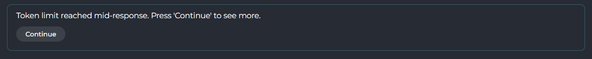
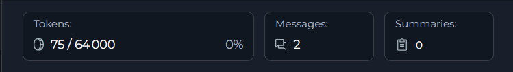
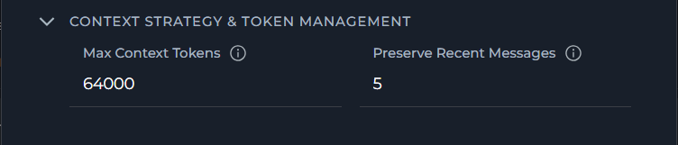
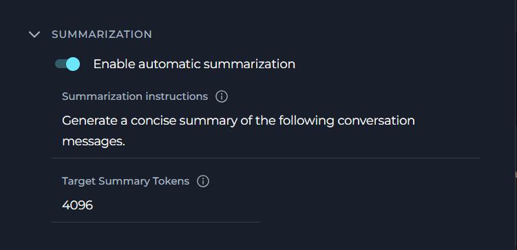
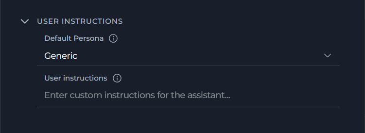

# Context Management

## Overview

The Context Management feature provides intelligent control over conversation token usage through automated message pruning and summarization. When enabled as a project-level secret, it helps maintain conversation continuity while staying within model token limits by automatically managing message history, generating summaries of older conversations, and preserving important messages.

The Context Budget widget displays real-time token usage metrics across Chat conversations, Agent runs, Pipeline executions, and Application configurations, providing immediate visibility into context consumption and management status.

!!! info "Prerequisites"
    To use context management, you need:
    
    * Project-level secret named `context_manager` with value `true`
    * An active conversation in Chat, Agent, Pipeline, or Application
    * LLM model configured with context management support

---

## Enabling Context Management

Context management is controlled by a project-level secret that enables the feature across all applicable interfaces.

**Access Project Secrets**

1. Navigate to **Settings** in the main menu
2. Click on the **Secrets** section
3. Click **+** button
4. In the secret creation form:
      - **Name**: Enter `context_manager` (exact name required)
      - **Value**: Enter `true` (exact value required)
5. Click **✔** to store the secret

 {width="600" loading="lazy"}

!!! warning "Widget Visibility"
    The Context Budget widget only appears when the `context_manager` secret exists and is set to `true`. Changes take effect immediately after the secret is created or updated.

---

## Accessing Context Management

Context management is available in multiple locations within ELITEA:

### From Chat Conversations

Monitor and control context during active conversations:

1. Navigate to **Chat** → **Conversations** in the main menu
2. Select or create a conversation
3. Send the first message to initiate the conversation
4. The **Context Budget** widget appears in the right panel (bottom left) after the first message
5. The widget displays real-time token usage and management status
6. Click on the widget to view detailed metrics and controls

     {width="600" loading="lazy"}

---

### In Agent Runs

Track context usage during agent execution:

1. Navigate to **Agents** and select an agent
2. Send the first message to initiate the conversation
3. The **Context Budget** widget appears above the chat panel interface after the first message
4. Monitor token consumption as the agent processes requests
5. View pruning and summarization activity in real-time

     {width="600" loading="lazy"}

---

### In Pipeline Executions

Monitor context during pipeline chat panels:

1. Navigate to **Pipelines** and select a pipeline
2. Open the pipeline's chat panel interface
3. Send the first message to initiate the conversation
4. The **Context Budget** widget appears above the chat panel interface after the first message
5. Track context usage across pipeline node executions
6. Observe automatic context management as the pipeline runs

     {width="600" loading="lazy"}
---

## Understanding the Context Budget Widget

The Context Budget widget provides three view modes that display progressively more detailed information.

**Collapsed View**

* The minimal view shows essential token usage at a glance:

    {width="160" loading="lazy"}

**Status Indicator**: Simple line indicator showing 
usage status
      * Green: Normal usage (0-100%)
      * Orange: High usage (more than 100%)

---

**Compact View**

The compact view adds token usage, message, and summary tracking:

* **Token Usage**: Current token utilization percentage with a high-usage warning indicator when context is running low
* **Messages Count**: Total messages in conversation context
* **Summaries Count**: Number of generated summaries
* **Edit Button**: Click to open the full Context Management configuration modal

    **Conversation**

       {width="250" loading="lazy"}

    **Agents** and **Pipelines**

       {width="250" loading="lazy"}
---

**Expanded View**

The full view displays comprehensive context management details organized in collapsible sections. Click on each section to expand and configure settings.

**Available Sections:**

* **Context Strategy & Token Management**: Configure token limits and message preservation settings
* **Summarization**: Enable automatic summarization and configure summary generation parameters
* **User Instructions**: Manage system message preservation, default persona, and custom user instructions

     {width="300" loading="lazy"}

For detailed information about each parameter, see the [Configuration Parameters](#configuration-parameters) section below.

**Context Management Toggle**

* At the top of the expanded view, there is a toggle switch to enable or disable Context Management entirely. When disabled, all automatic context management features (pruning and summarization) are turned off.

     {width="300" loading="lazy"}

---

## How Context Management Works

**Automatic Token Tracking**

The system continuously monitors token consumption:

1. **Message Addition**: Every new message added to conversation context
2. **Token Estimation**: Tokens calculated using tiktoken library (with character-based fallback)
3. **Real-Time Display**: Context Budget widget updates immediately
4. **Threshold Monitoring**: System checks if usage is approaching the maximum context token limit

Context Management settings are organized into three main sections in the expanded view modal.

!!! warning "Token Limit Mid-Response"
    When the model reaches its output token limit before finishing a response, a prompt appears directly in the chat. Click the **Continue** button to resume and receive the rest of the response. This may occur multiple times for very long outputs.

    {width="700" loading="lazy"}

---
## Configuration Parameters

### Overview Metrics

* The expanded view displays three real-time usage metrics:

    {width="580" loading="lazy"}

    | Metric | Description | Example |
    |--------|-------------|---------|
    | **Tokens** | Current token usage with percentage | "2,591 / 64,000 (4%)" |
    | **Messages** | Total number of messages in conversation | "7" |
    | **Summaries** | Number of generated summaries | "0" |

### Context Strategy & Token Management

* Configure token limits and message preservation to control how context is managed:

    {width="500" loading="lazy"}

    | Parameter | Description | Default | Range/Options | Purpose |
    |-----------|-------------|---------|---------------|---------|
    | **Max Context Tokens** | Maximum number of tokens to keep in conversation context | 64,000 tokens | 1,000 - 10,000,000 | Defines the upper limit before pruning or summarization occurs |
    | **Preserve Recent Messages** | Number of most recent messages to always keep in context | 5 messages | 1 - 99 | Ensures the most recent messages are protected during context optimization |

---

### Summarization

* Configure automatic summarization to compress older messages and preserve conversation continuity:

    {width="400" loading="lazy"}

    | Parameter | Description | Default | Range/Options | Purpose |
    |-----------|-------------|---------|---------------|---------|
    | **Enable Automatic Summarization** | Toggle to enable or disable automatic conversation summarization | Enabled | On/Off | Controls whether the system automatically generates summaries when context limits are approached |
    | **Summarization Instructions** | Custom instructions for how summaries should be generated | "Generate a concise summary of the following conversation messages." | Free text (multiline) | Guides the LLM on how to create summaries that match your needs |
    | **Target Summary Tokens** | Target length for generated summaries | 4,096 tokens | 100 - 4,096 | Controls the conciseness of generated summaries |

    !!! note
        **Target Summary Tokens must always be less than Max Context Tokens.** The UI enforces this rule and will prevent saving if the value equals or exceeds Max Context Tokens.

#### How Summarization Works

* When the context approaches the token limit:

1. **Summarization Trigger**: System detects token usage exceeds trigger ratio (e.g., 100%)
2. **Message Selection**: Identifies messages eligible for summarization (excludes preserved recent messages)
3. **Summary Generation**: LLM generates concise summary of selected messages using the configured Summary Model and Summarization Instructions
4. **Message Replacement**: Original messages replaced with summary in context
5. **Token Reduction**: Context token count reduced while preserving conversation continuity
6. **Summary Storage**: Summary tracked (total summaries limited by summaries_limit_count)

---

### User Instructions

* Configure system message preservation, default persona, and custom instructions for the assistant:

    {width="450" loading="lazy"}

    | Parameter | Description | Default | Range/Options | Purpose |
    |-----------|-------------|---------|---------------|---------|
    | **Always Preserve System Messages** | Toggle to keep system messages during context pruning | Enabled | On/Off | Ensures system-level instructions remain available throughout the conversation |
    | **Default Persona** | Default assistant persona for model chat (without agent selected) | Generic | Generic, QA, Nerdy, Quirky, Cynical | Sets the assistant's default behavioral style when no agent is selected |
    | **User instructions** | Custom instructions for the assistant | — | Free text (multiline) | Defines custom behavior guidelines for the AI assistant |

---

## Usage Scenarios

??? example "Long-Running Conversations"

    **Use Case**: Maintain coherent conversations that exceed model token limits
    
    **Configuration:**
    
    * Max Context Tokens: 64,000
    * Preserve Recent Messages: 10
    
    **Behavior:**
    
    1. User engages in extended conversation with AI assistant
    2. Context grows naturally as messages are added
    3. As context grows, older messages are automatically summarized to free up space
    4. System generates summary of older messages
    5. Last 10 messages always preserved for immediate context
    6. Conversation continues seamlessly with reduced token usage
    
    **Benefits:**
    
    * No manual intervention required
    * Important conversation details preserved in summaries
    * Recent context always available
    * Conversation never "forgets" early important information

??? example "Multi-Turn Agent Tasks"

    **Use Case**: Agent performing complex tasks requiring multiple interactions
    
    **Configuration:**
    
    * Max Context Tokens: 32,000
    * Preserve Recent Messages: 5
    
    **Behavior:**
    
    1. Agent starts task with initial instructions
    2. Multiple tool calls and responses accumulate
    3. As the context grows, oldest messages are automatically pruned to stay within the token limit
    4. Last 5 exchanges preserved for immediate task context
    5. Agent continues task execution without context overflow
    
    **Benefits:**
    
    * Task execution never interrupted by token limits
    * Most recent tool results always accessible
    * Efficient token usage for long-running tasks
    * Simplified context management for automated workflows

??? example "Pipeline Chat Contexts"

    **Use Case**: Pipeline with chat panel interface requiring context preservation
    
    **Configuration:**
    
    * Max Context Tokens: 16,000
    * Preserve Recent Messages: 8
    
    **Behavior:**
    
    1. Pipeline nodes generate output and chat messages
    2. User interactions add additional context
    3. Context Budget widget shows real-time usage across pipeline execution
    4. As the context grows, automatic pruning occurs to maintain token limits
    5. Recent user messages are preserved per the configured setting
    6. Pipeline continues with optimized context
    
    **Benefits:**
    
    * Pipeline execution state preserved
    * User can continue interacting without interruption
    * Important node outputs retained
    * Balanced context across pipeline stages

---

## Best Practices

**Monitoring Context Usage**

??? tip "Regular Budget Checks"

    * Check Context Budget widget periodically during long conversations
    * Pay attention to color changes in the percentage bar:
      - Green: Safe range, context is within limits
      - Yellow: Context is at or beyond the configured limit; the widget also shows the warning "Context usage is high. Consider configuring budget settings."
    * Expand widget to full view for detailed metrics when the bar turns yellow
    * Use compact view for quick token usage and message count checks

??? tip "Understanding Token Consumption"

    * Different message types consume different token amounts:
      - System prompts: Variable (often 100-500 tokens)
      - User messages: Depends on length (typically 10-200 tokens)
      - Assistant responses: Variable (often 100-1000+ tokens)
      - Tool calls: Includes function definitions (can be 50-300 tokens each)
    * Attachments and images can significantly increase token usage
    * Summary messages reduce overall token count while preserving information

---

**Optimizing Conversations**

??? tip "Message Structure"

    * Keep messages concise when possible to reduce token consumption
    * Break long messages into smaller logical chunks
    * Avoid unnecessary repetition or verbose phrasing

??? tip "Preserve Recent Messages Setting"

    * Adjust based on conversation type:
      - Quick Q&A: Lower number (3-5 messages)
      - Complex discussions: Higher number (10-15 messages)
      - Multi-step tasks: Medium number (5-10 messages)
    * Remember: Preserved messages are never pruned or summarized
    * Higher numbers mean more guaranteed context but less flexibility

??? tip "Coordinating Target Summary Tokens with Max Context Tokens"

    * **Target Summary Tokens must always be less than Max Context Tokens** — the UI enforces this rule and will prevent saving if it is violated
    * A good rule of thumb: set Target Summary Tokens to roughly 5–10% of your Max Context Tokens value (e.g., 4,096 Target Summary Tokens with 64,000 Max Context Tokens)
    * Very small Target Summary Tokens values produce very short, possibly lossy summaries; very large values leave little room for active conversation context
    * Adjust based on how much detail you need preserved in summaries

---

## Troubleshooting

??? warning "Context Budget Widget Not Visible"

    **Symptoms:**
    
    * Widget completely missing from right panel
    * No context management controls available
    
    **Diagnosis:**
    
    1. Verify project secret `context_manager` exists
    2. Check secret value is exactly `true` (case-sensitive)
    3. Confirm you're viewing a supported interface (Chat, Agent, Pipeline)
    4. Check browser console for errors
    
    **Resolution:**
    
    1. Navigate to Settings → Secrets
    2. Create or update `context_manager` secret with value `true`
    3. Refresh the page
    4. Widget should appear immediately if secret is correct

??? warning "Token Count Seems Inaccurate"

    **Symptoms:**
    
    * Displayed token count doesn't match expectations
    * Percentage bar doesn't align with message count
    
    **Explanation:**
    
    * Token counting uses tiktoken library with character-based fallback (~4 chars per token)
    * Different message types have different token densities
    * System messages, role labels, and formatting add overhead
    * Tool calls include function definitions in token count
    
    **Resolution:**
    
    * Token counts are estimates and may vary slightly from actual LLM processing
    * Focus on relative changes (increasing/decreasing) rather than absolute accuracy
    * If consistently far off, contact administrator to check token estimation configuration

??? warning "Summarization Not Occurring"

    **Symptoms:**
    
    * Summaries count does not increase even as context grows
    * Context continues to grow beyond expected limit
    
    **Possible Causes:**
    
    1. Insufficient messages to summarize (all recent messages preserved)
    2. LLM model configuration issue
    3. Backend summarization disabled
    
    **Resolution:**
    
    1. Check expanded view: Compare Messages vs Preserve Recent count
       - If Messages ≤ Preserve Recent, summarization cannot occur
    2. Verify LLM model is properly configured for text generation
    3. Contact administrator to check backend context management configuration

??? warning "Messages Disappearing Unexpectedly"

    **Symptoms:**
    
    * Messages from earlier in conversation no longer visible
    * Conversation feels disjointed or missing context
    
    **Explanation:**
    
    * This is expected behavior when pruning occurs
    * Messages are removed from context when token limit is approached
    * Pruned messages are not deleted, just removed from active context
    
    **Understanding:**
    
    1. Automatic pruning removes oldest messages when the token limit is approached
    2. Recent messages (per preserve_recent_messages) never disappear
    
    **If Unwanted:**
    
    * Increase max_context_tokens to reduce pruning frequency
    * Increase preserve_recent_messages to keep more messages

??? warning "Settings Not Saving — Inline Validation Error"

    **Symptoms:**
    
    * Save button remains disabled
    * A field shows an inline red error message
    
    **Most Common Cause:**
    
    * **Target Summary Tokens is equal to or greater than Max Context Tokens** — the UI validation requires Target Summary Tokens to be strictly less than Max Context Tokens
    * Example error shown: `Must be less than Max Context Tokens (64000)`
    
    **Resolution:**
    
    1. Open the Summarization accordion in the Context Management settings
    2. Check the **Target Summary Tokens** value
    3. Reduce it to a value less than **Max Context Tokens** (e.g., set to 4,096 when Max Context Tokens is 64,000)
    4. The Save button will re-enable once all validation errors are cleared

??? warning "Settings Not Saving — Toast Error After Submit"

    **Symptoms:**
    
    * A toast notification appears with the message: "Failed to update context strategy"
    * Settings appear to revert to previous values
    
    **Possible Causes:**
    
    1. Network connectivity issue
    2. API or backend service error
    3. Session has expired
    
    **Resolution:**
    
    1. Check your network connection and retry
    2. Refresh the page and attempt to save again
    3. If the problem persists, contact your administrator to check backend service health

??? warning "Performance Issues"

    **Symptoms:**
    
    * Slow message sending or response times
    * UI lag when interacting with Context Budget widget
    * Browser becomes unresponsive
    
    **Possible Causes:**
    
    1. Very high max_context_tokens causing expensive operations
    2. Excessive message count in conversation
    3. Frequent summarization operations
    4. Browser memory limitations
    
    **Resolution:**
    
    1. **Reduce max_context_tokens**:
       - Lower values mean less context to process
       - Typical range: 8,000 - 32,000 for optimal performance
    2. **Start new conversation**:
       - Very long conversations can accumulate state
       - Consider starting fresh for new topics
    3. **Check browser resources**:
       - Close unnecessary tabs
       - Ensure browser is up to date
       - Clear browser cache if needed
    4. **Contact administrator**:
       - May need to adjust backend processing limits
       - Could configure more aggressive pruning

### Support Contact

If you encounter issues not covered in this guide or need additional assistance with context management, please refer to **[Contact Support](../../support/contact-support.md)** for detailed information on how to reach the ELITEA Support Team.

---

!!! info "Related Documentation"
    
    * **[Chat Functionality](how-to-use-chat-functionality.md)** - General chat features and usage
    * **[Agent Configuration](../../menus/agents.md)** - Setting up agents with context management
    * **[Pipeline Configuration](../../menus/pipelines.md)** - Configuring pipelines with context support
    * **[Secrets Management](../../menus/settings/secrets.md)** - Managing project-level secrets including context_manager configuration
