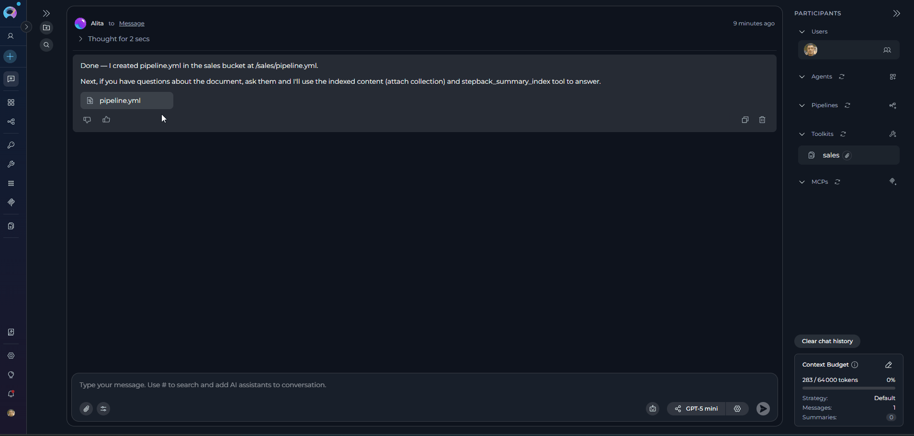
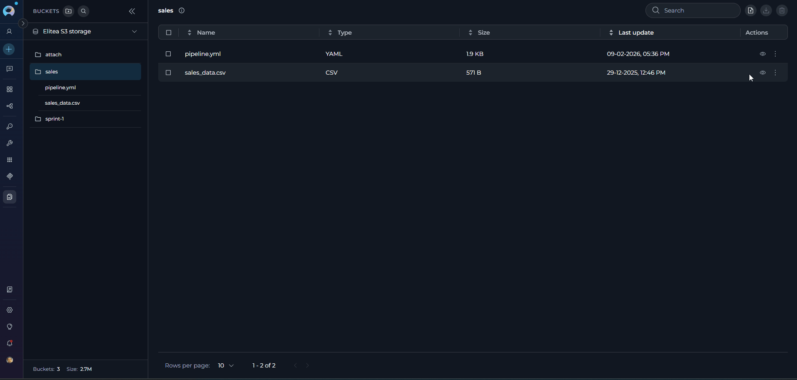
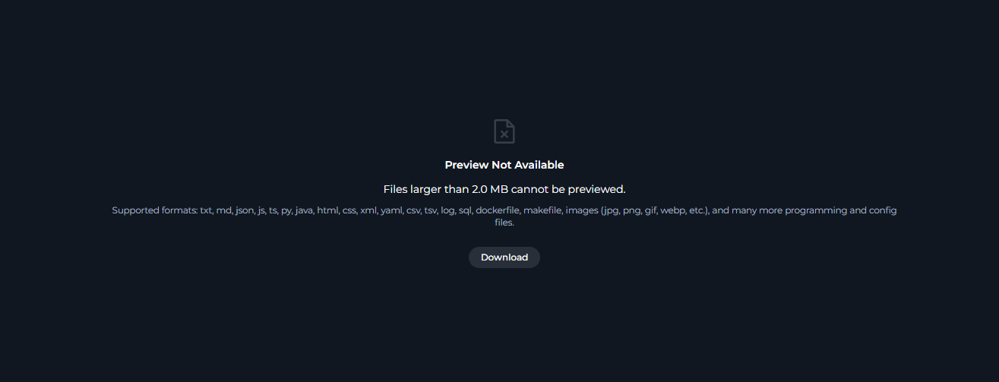

# File Editing in Canvas

## Introduction

Canvas file editing in ELITEA allows you to view and edit **actual files** directly within the platform without using external tools. You can work with files you attach to chat conversations, files stored in Artifacts buckets, and files generated by AI responses during conversations.

Canvas supports editing code files, text documents, data files (CSV/TSV), and rendering special formats like Markdown and Mermaid diagrams—all as complete files rather than conversation snippets.

This guide explains how to access Canvas file editing for attached, stored, and generated files, edit them, save changes, and understand the limits and constraints that apply.

!!! info "Scope of This Guide"
    This guide focuses on editing **complete files** (attachments, artifacts, and AI-generated files). For information about editing generated code blocks, tables, or diagrams within chat conversations, see [Canvas in Conversation](how-to-canvas.md).

---

## Working with Attached Files in Chat

 How to open, edit, and save files attached to chat conversations directly in Canvas—without downloading files or using external tools.

1. **Navigate to the Conversation:**
      * Click the Chat menu from the main navigation
      * Select and open the conversation containing the attached file

2.  **Open the File in Canvas:**
      * Hover over the attached file in the conversation and click the **eye icon** (tooltip: "View/Edit file")
      * The file opens in Canvas Mode as a modal overlay with automatic content fetching, file type detection, and syntax highlighting applied

3. **Edit the File:** Canvas automatically selects the appropriate editor based on file type. Make your changes using the available editing features, including universal controls like Copy, Undo/Redo, and Export/Download.

    !!! info "Available Editors"
        Canvas provides specialized editors for different file types:
        
        - **Code Editor**: syntax highlighting, language dropdown, Find/Replace, code folding
        - **Table Editor**: toggle Raw/Rendered modes, edit cells, add/remove rows/columns, sort/filter, Export to XLSX
        - **Markdown Editor**: toggle Raw/Preview modes
        - **Mermaid Diagram Editor**: live preview, export PNG/JPG/SVG
        - **Image Preview**: view-only for JPG, PNG, GIF, BMP, WebP, SVG, TIFF

4. **Save or Close:**
      * **To save:** Click the **Save button** in the header → file overwrites original in artifact storage → success notification appears

    !!! note "Save Button Behavior"
        - The Save and Discard buttons are only enabled when you have unsaved changes. They appear disabled (grayed out) when there are no changes to save.
        - **To discard changes:** Click the **Discard button** → changes are discarded without saving
        - **To close without saving:** Click the **X icon** → if unsaved changes exist, alert dialog appears asking to confirm closure

      

!!! note "Important Notes"
    * The file overwrites the original in artifact storage
    * Other conversation participants can access the updated file
    * The conversation retains a reference to the updated file

---

## Working with Files in Artifacts

This section covers the complete workflow for editing files stored in Artifacts—from accessing them to saving your changes.

1. **Navigate to Artifacts:**
      * Click the Artifacts menu from the main navigation
      * Select a bucket from the Bucket List on the left side
      * Locate your file in the File List and click the **Preview icon (eye symbol)** next to the filename
      * The file opens in Canvas Mode as a modal overlay with automatic content fetching, file type detection, and syntax highlighting applied

2. **Edit the File:** Canvas automatically selects the appropriate editor based on file type. Make your changes using the available editing features, including universal controls like Copy, Undo/Redo, and Export/Download.

    !!! info "Available Editors"
        Canvas provides specialized editors for different file types:
        
        - **Code Editor**: syntax highlighting, language dropdown, Find/Replace, code folding
        - **Table Editor**: toggle Raw/Rendered modes, edit cells, add/remove rows/columns, sort/filter, Export to XLSX
        - **Markdown Editor**: toggle Raw/Preview modes
        - **Mermaid Diagram Editor**: live preview, export PNG/JPG/SVG
        - **Image Preview**: view-only for JPG, PNG, GIF, BMP, WebP, SVG, TIFF

3. **Save or Close:**
   * **To save:** Click the **Save button** in the header → file overwrites original in bucket → success notification appears

    !!! note "Save Button Behavior"
        - The Save and Discard buttons are only enabled when you have unsaved changes. They appear disabled (grayed out) when there are no changes to save.
        - **To discard changes:** Click the **Discard button** → changes are discarded without saving
        - **To close without saving:** Click the **X icon** → if unsaved changes exist, alert dialog appears asking to confirm closure

!!! note "File Preview Requirements"
    * Files must be under 2 MB
    * File type must be supported (text-based files)

!!! note "Single-User Editing & Permissions"
    * Artifact file editing is single-user (last save wins). If multiple users edit the same file simultaneously, the last person to save will overwrite previous changes. Coordinate with team members to avoid conflicts.
    * The file overwrites the original in the bucket
    * The same filename and location are preserved
    * Other users with bucket access will see the updated version
---

## Real-World Examples

!!! example "Example 1: Editing an Attached Configuration File from Chat"
    **Scenario:** Alex, a DevOps Engineer, receives a YAML configuration file in a chat conversation and needs to update environment variables.

    **Workflow:**

    1. A colleague attaches a `deployment.yaml` file in the team conversation chat
    2. Alex opens the file in Canvas using the eye icon
    3. The file opens with YAML syntax highlighting
    4. Alex edits the environment variables: database connection string, API endpoint URL, and container resource limits
    5. Alex saves the changes
    6. The updated file is now available in the project's artifact bucket and ready for deployment

    **Benefits:**
    
    - No need to download, edit locally, and re-upload
    - Changes are immediately available to all conversation participants
    - The file is automatically versioned in the artifact system
    - Can continue the conversation about the configuration with the AI or colleagues

!!! example "Example 2: Editing Test Data from Artifacts"
    **Scenario:** Sarah, a QA Engineer, maintains a CSV file with test case data in Artifacts and needs to add new test scenarios for an upcoming release.

    **Workflow:**

    1. Sarah navigates to the Artifacts menu and selects the "QA-TestData" bucket
    2. She opens `login_test_cases.csv` in Canvas using the Preview icon
    3. The file opens with the Table Editor in Rendered mode
    4. Sarah makes several updates: adds 5 new rows for edge cases, updates test descriptions, adds an "Automation Status" column, sorts by Test ID, and filters high-priority cases
    5. Sarah saves the changes
    6. The updated file is now available in the "QA-TestData" bucket for automation scripts and team members

    **Follow-up actions:**
    
    - Sarah can export the table to XLSX for sharing with stakeholders
    - The automation framework reads the updated CSV directly from artifacts
    - Other QA team members can review and add additional test cases

    **Benefits:**
    
    - Centralized file management in Artifacts
    - No need to download, edit in Excel, and re-upload
    - Changes are immediately available to all team members and automation systems
    - Version control through artifact system maintains history

## Editing Limitations

!!! warning "Editing Limitations"
    **CSV/TSV files** can only be edited in **Raw mode**. Switch to Raw mode to make changes, then toggle back to Rendered mode to view the table.
        
    **Markdown files** can only be edited in **Raw mode**. Switch to Raw mode to edit the markdown source, then toggle to Preview mode to see the rendered output.
        
    **Mermaid diagrams** can only be edited in **Raw mode**. Edit the diagram code in Raw mode, then toggle to Rendered mode to see the visual diagram.
        
    **Image files** are **view-only** and cannot be edited.    

## Troubleshooting

??? warning "Issue: Eye Icon Not Appearing on Attached Files"
    **Possible causes:**
    
    - File type is not supported for preview
    - File exceeds the 2 MB size limit
    - You lack required permissions to view artifacts
    - File attachment is still uploading

    **Solution:**
    
    - Verify the file is a supported text-based type
    - Check file size (must be under 2 MB)
    - Ensure you have `configuration.artifacts.artifacts.view` permission
    - Wait for the file upload to complete

??? warning "Issue: \"View/Edit file\" Icon Not Available for Attachments"
    **Possible causes:**
   
    - File type is not supported for preview
    - File exceeds the 2 MB size limit
    - You lack required permissions

    **Solution:**
    - Verify the file is a supported text-based type
    - Check file size (must be under 2 MB)
    - Request appropriate permissions from your administrator

??? warning "Issue: Cannot Save Changes in Artifacts"
    **Possible causes:**
    
    - Network connectivity issues
    - Permission issues (lack of artifacts update permission)
    - Bucket or file has been deleted by another user
    - File is locked by another user (concurrent editing)

    **Solution:**
    
    - Check your internet connection
    - Verify you have `configuration.artifacts.buckets.update` permission
    - Refresh the page to see if the file still exists
    - Wait for other users to finish editing and try again

??? warning "Issue: File Preview Shows Error"
    **Possible causes:**
    
    - File is too large (exceeds 2 MB)
    - File type is not supported
    - File content is corrupted or binary

    {width="600"}

    **Solution:**
    
    - Reduce file size or split into smaller files
    - Verify the file extension is in the supported list
    - Check if the file can be opened in a local text editor

??? warning "Issue: Canvas Editor is Slow or Unresponsive"
    **Possible causes:**
    
    - File is close to the 2 MB limit
    - Complex rendering (large tables, intricate diagrams)
    - Browser performance issues

    **Solution:**
    
    - For data files, toggle to Raw mode for faster loading
    - Close other browser tabs to free up resources
    - Consider breaking large files into smaller modules
    - Use a modern browser with good performance

??? warning "Issue: Changes Not Appearing After Save"
    **Possible causes:**
    
    - Browser cache is showing old content
    - Save operation failed silently
    - Concurrent edit by another user overwrote your changes

    **Solution:**
    
    - Refresh the browser page
    - Check for error toast notifications
    - Re-open the file to verify the current content
    - Coordinate with team members to avoid simultaneous edits on the same file

??? warning "Issue: Unsaved Changes Alert Keeps Appearing"
    **Possible causes:**
    
    - You have made edits that haven't been saved
    - Canvas is detecting changes even though none were made (rare edge case)

    **Solution:**
    
    - Save your changes using the three-dot menu before navigating away
    - If you want to discard changes, confirm discard in the alert dialog
    - If the alert appears incorrectly, refresh the page to reset the state

---

!!! reference "Additional Resources"
    - **[Canvas in Conversation](how-to-canvas.md):** Guide on using Canvas for editing generated code blocks, tables, and diagrams within conversations
    - **[Chat Usage Guide](how-to-use-chat-functionality.md):** Complete overview of chat functionality including file attachments
    - **[Artifacts Menu](../../menus/artifacts.md):** Full documentation on Artifacts management and file organization
    - **[Attachments in Conversations](attach-images-and-files-in-chat.md):** Upload and attach images, documents, and data files for AI analysis

---
