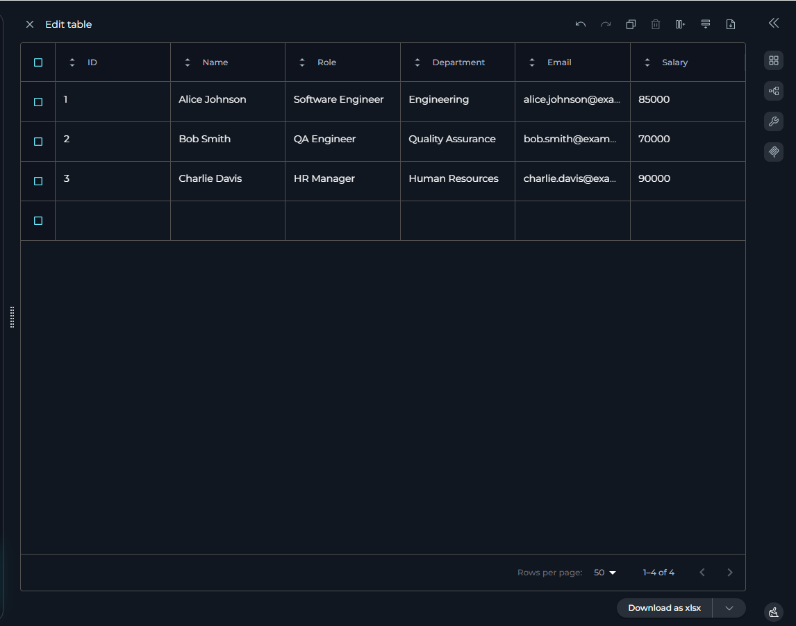

# Canvas in Conversation

## Introduction
 
Canvas is your all-in-one workspace for editing, refining, and collaborating on AI-generated content in ELITEA. Instead of copying results into other tools, you can work directly with code, tables, and diagrams—right where the conversation happens. Whether you’re a Business Analyst, QA, AQA, or developer, Canvas helps you and your team turn ideas into actionable, high-quality deliverables.
 
This guide will walk you through what Canvas is, how to use it, and how it fits into real-world SDLC scenarios. We’ll also point you to helpful resources and related documentation along the way.

## In this guide, you will learn:

* What Canvas is and the types of content it supports.
* Step-by-step instructions for accessing and using Canvas.
* A deep dive into the features of the Code, Table, and Diagram editors.
* Practical, real-world scenarios for BAs, QAs, and AQAs.
* Best practices and troubleshooting tips.
 
## What is Canvas?

Canvas is a built-in editor that appears automatically when ELITEA generates code, tables, or [Mermaid](https://mermaid-js.github.io/) diagrams in a chat.

### Key Benefits:

* Instant Editing: Modify content on the fly, eliminating the need for external tools.
* Version Control: Easily track changes with built-in undo/redo functionality.
* Flexible Exporting: Save or copy your refined content in various formats suitable for documentation, code repositories, or reports.

### Canvas supports three primary content types:

| **Content Type**   | **Description**                          | **Common Uses**                                      |
|---------------------|------------------------------------------|-----------------------------------------------------|
| **Code Blocks**     | For programming and scripting languages. | Python, Java, SQL, YAML, Selenium scripts.          |
| **Tables**          | For structured, tabular data.            | Test cases, requirements matrices, data sets.       |
| **Mermaid Diagrams**| For text-based visual diagrams.          | Flowcharts, sequence diagrams, ERDs.                |

 
## Getting Started: Accessing and Using Canvas

Using Canvas is a simple, three-step process.
 
### Prerequisites

* Ensure you have access to an [ELITEA conversation](how-to-use-chat-functionality.md) with supported participants, such as Agents, Pipelines, or LLM Models.
* The AI participant (Agent, Pipeline, or LLM Model) should generate content in the form of a code block, a Markdown table, or a Mermaid diagram.

### Step 1: Generate Canvas-Compatible Content

Start by asking ELITEA to create something for you.

**Example Prompts**:

* "Generate a Python Selenium script to test the login page." (for Code)
* "Create a Markdown table with test cases for user registration, including columns for Test Case ID, Step, Expected Result, and Status." (for Tables)
* "Create a Mermaid flowchart for an e-commerce order approval process." (for Diagrams)

### Step 2: Activate Canvas

Once ELITEA generates the content, look for the pencil icon (✏️) in the top-right corner of the content block. This icon indicates that Canvas is available.

Click the pencil icon to launch the Canvas editor for that content block.*

### Step 3: Edit Content

Clicking the icon opens the Canvas editor in a modal window. Here, you can directly modify the content. 

### Navigating the Canvas Interface

All Canvas editors share a set of universal controls:

| **Icon**       | **Action**          | **Description**                                                                 |
|-----------------|---------------------|---------------------------------------------------------------------------------|
| **Copy**       | Copy to Clipboard   | Copies the entire content to your clipboard.                                   |
| **Undo/Redo**  | Undo / Redo         | Reverts or reapplies your last action.                                         |
| **Save**       | Save Changes        | Saves your current progress. Remember to save often!                           |
| **Export**     | Export/Download     | Allows you to download the content in various formats (e.g., `.py`, `.xlsx`, `.png`). |
 

### A Deep Dive into Canvas Editors

Let's explore the unique features of each editor and see how they apply in real-world situations.

#### The Code Editor

**Perfect for developers, AQA engineers, and DevOps**

The Code Editor is a robust environment for refining AI-generated code snippets and scripts. It features syntax highlighting, auto-completion, and error checking to help you write production-ready code.

**Key Features**

* **Syntax Highlighting**: Improves readability for languages like Python, Java, JavaScript, and YAML.
* **Find/Replace**: Quickly locate and update variables, function names, or other text strings.
* **Code Folding**: Collapse functions or classes to focus on a specific part of the code.

**Real-World Example: Refining an AQA Test Script**
   * **Role**: Sarah, an AQA Engineer.  
   * **Goal**: Create a reliable Selenium test for a new checkout feature.

1. **Generate**: Sarah asks ELITEA: "Write a Selenium Python script to add an item to the cart and proceed to checkout."
2. **Activate Canvas**: The AI generates a functional but basic script. Sarah clicks the ✏️ icon to open it in the Code Editor.
3. **Refine in Canvas**:
      * She adds explicit waits to handle slow-loading page elements, making the script more stable.
      * She uses **Find/Replace** to change a generic variable name like `button` to a more descriptive name like `proceed_to_checkout_button`.
      * She adds a `try/except` block for error handling, ensuring the test fails gracefully and provides useful logs.
      * She adds comments to explain complex steps to her teammates.
4. **Export**: Once satisfied, Sarah clicks **Export** and saves the file as `test_checkout.py`, ready to be committed to her team's automation framework.

#### The Table Editor

**Ideal for Business Analysts, QA Analysts, and Project Managers.**  
The Table Editor transforms simple Markdown tables into a powerful, spreadsheet-like interface for organizing and managing structured data.

**Key Features**

* **Easy Cell Editing**: Click any cell to modify its content.
* **Structural Changes**: Add or remove rows and columns with a single click.
* **Sorting and Filtering**: Quickly organize your data to find what you need.
* **Import/Export**: Export your table to formats like XLSX (Excel) or Markdown.

**Real-World Example: Test Case Documentation**

* **Role**: David (Business Analyst).  
* **Goal**: Document test cases for a new user profile feature.  

1. **Generate**: David asks ELITEA: "Create a test case table for editing a user profile."
2. **Activate Canvas**: The AI generates a table with columns for ID, Step, and Expected Result. David clicks the ✏️ icon to open the table in Canvas.
3. **Refine in Canvas**:
      * David adds a new column called "Requirement ID" and populates it, linking each test case back to the original business requirements.
      * He adds another column for "Priority" (High, Medium, Low) to categorize the test cases.
      * Using the **Sort** feature, David organizes the table to display all "High" priority test cases first.
      * He reviews the steps and updates the "Expected Result" column to ensure clarity and accuracy.
4. **Export**: Once satisfied, David clicks **Export** and chooses XLSX. He now has a formatted spreadsheet to share with the testing team and stakeholders.

#### The Mermaid Diagram Editor

**A visual tool for Business Analysts, System Architects, and anyone needing to map processes.**  
The Mermaid Diagram Editor allows you to edit the simple text-based syntax of a Mermaid diagram while seeing your changes rendered visually in real-time.

**Key Features**

* **Live Preview**: The diagram updates instantly as you type.
* **Syntax Highlighting & Error Detection**: Quickly spots issues in your Mermaid code.
* **Multiple Export Options**: Save your finished diagram as a PNG, JPG, or SVG image file.

**Real-World Example: Visualizing a Business Process**

* **Role**: Tom, a Business Analyst.  
* **Goal**: Create a clear flowchart for a new expense approval workflow to present to stakeholders.

1. **Generate**: Tom asks ELITEA: "Generate a Mermaid flowchart for an employee submitting an expense report that needs manager approval."
2. **Activate Canvas**: ELITEA provides a simple, linear flowchart. Tom opens it in Canvas.
3. **Refine in Canvas**:
      * Using the **Live Preview**, Tom adds a decision point: `If Amount > $500`.
      * He adds two new paths from this decision: one for "Senior Manager Approval" and another back to the standard "Manager Approval."
      * He adds styling to the "Rejected" end-state node to make it red, highlighting the negative path.
4. **Export**: Happy with the visual, Tom clicks **Export** and saves the diagram as a PNG, ready to be inserted directly into his PowerPoint presentation.

### Tips and Best Practices

* **Start with a Clear Prompt**: The better your initial prompt, the less refinement you'll need. Be specific about formats and requirements.
* **Save Often**: Use the Save button regularly to ensure all changes are captured.
* **Use for Configuration Files**: The Code Editor is excellent for generating and refining YAML or JSON configuration files for CI/CD pipelines or application settings.
* **Follow Team Standards**: Use Canvas to enforce your team’s coding and documentation conventions before exporting.

### Troubleshooting Common Issues

**Q: The Canvas pencil icon (✏️) isn't appearing.**  
**A:** Ensure the AI-generated content is a properly formatted code block, Markdown table, or Mermaid diagram. If the format is incorrect, try re-phrasing your prompt to be more specific (e.g., "format the output as a Markdown table").

**Q: The editor is slow or unresponsive.**  
**A:** This can happen with extremely large blocks of code or tables. Try breaking your request into smaller chunks. Also, check your internet connection and consider clearing your browser cache.

**Q: I'm having trouble exporting my content.**  
**A:** Check that the file format you're trying to export to is supported for that editor. If an issue persists, try a different web browser or contact support.

!!! info "More Resources"
    * [ELITEA Chat Documentation](../../menus/chat.md)
    * [How to Use Chat Functionality](how-to-use-chat-functionality.md)
    * [Markdown Table Guide](https://www.markdownguide.org/extended-syntax/#tables)
    * [Mermaid.js Documentation](https://mermaid-js.github.io/)
    * [ELITEA Support](../../support/contact-support.md)
 
## Conclusion
 
Canvas makes it easy to turn AI-generated content into real, actionable deliverables—without ever leaving ELITEA. Use it to collaborate, refine, and perfect your work, whether you’re building requirements, test cases, automation scripts, or diagrams. For more help, check out the resources above or reach out to the [ELITEA support team](../../support/contact-support.md).
