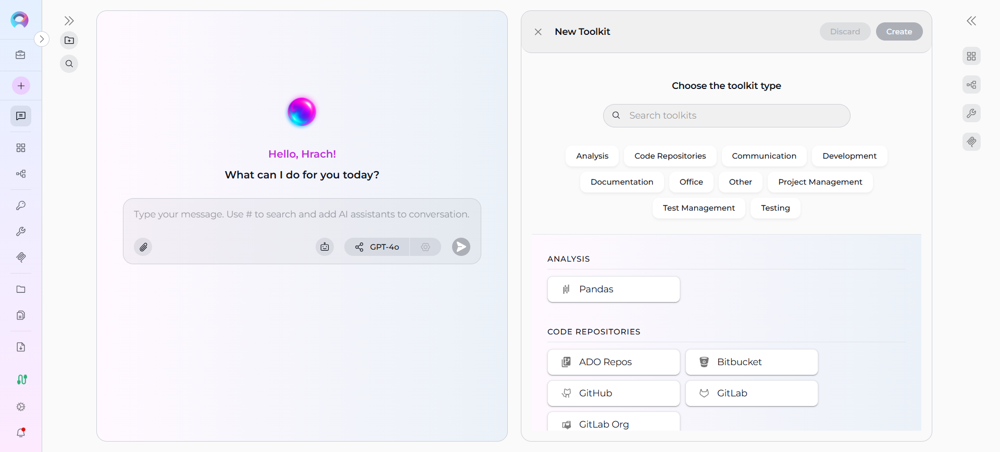

# How to Create and Edit Toolkits from Canvas

## Introduction

This user guide provides a comprehensive overview of the **Toolkit Canvas** feature in ELITEA and how to create, configure, and manage toolkits directly from the chat interface. The Toolkit Canvas enables streamlined toolkit management with an intuitive interface, enhancing productivity and collaboration across different development workflows.

## Toolkit Canvas Feature: Visual Toolkit Management

The **Toolkit Canvas** interface in ELITEA serves as an integrated toolkit management system accessible directly from the chat interface. This feature enables you to create, configure, and manage toolkits without leaving your conversation context, streamlining your development workflow.

**Key Aspects of the Toolkit Canvas Feature:**

* **Integrated Chat Experience:** Access toolkit management directly from the PARTICIPANTS section in chat, maintaining conversation context while managing tools.
* **Visual Configuration Interface:** Use an intuitive canvas-based interface that simplifies toolkit configuration with clear visual elements and organized sections.
* **Real-time Validation:** Configuration fields are validated in real-time, ensuring proper setup before toolkit creation.
* **Instant Integration:** Created toolkits are immediately available for use in conversations and can be added to the PARTICIPANTS section.
* **Secure Configuration:** Integration with ELITEA's credential management system ensures secure authentication setup.

## Creating Toolkits via Canvas Interface

### Step 1: Access the Toolkit Creation Canvas

1. Navigate to the **Chat** page (main sidebar menu).
2. In the **PARTICIPANTS** section, locate **Toolkits**.
3. Click on the **+Add toolkit** icon.
4. Click on **+ Create new Toolkit**.

The "Choose the toolkit type" canvas interface will be displayed with all available toolkit categories.

### Step 2: Select Toolkit Type

The toolkit selection interface provides several ways to find and select the toolkit type you need:

**Browse by Category:**

1. Click on a category (e.g., **Code Repositories**, **Project Management**).
2. Review the available toolkit options within that category.
3. Click on the desired toolkit (e.g., **GitHub**, **Jira**).

**Search for Specific Toolkit:**

1. Use the search field at the top of the interface.
2. Type the toolkit name (e.g., "github", "confluence").
3. The interface will filter available options in real-time.
4. Select the desired toolkit from the filtered results.

**Available Toolkit Categories:**

- **Analysis:** Tools for data analysis and reporting
- **Code Repositories:** Version control systems like GitHub, GitLab, Bitbucket
- **Communication:** Team collaboration platforms like Slack
- **Development:** Custom development tools and APIs
- **Documentation:** Knowledge management systems like Confluence
- **Office:** Productivity tools for document processing
- **Other:** Custom and miscellaneous integrations
- **Project Management:** Project tracking tools like Jira, Rally
- **Test Management:** Testing platforms like TestRail, Zephyr
- **Testing:** Automation and testing frameworks

### Step 3: Configure Toolkit Settings

Once you select a toolkit type (e.g., Github), the configuration canvas will open with toolkit-specific settings. The interface is organized into several sections:

#### Configuration Section

The **CONFIGURATION** section contains all the necessary fields to set up your toolkit:

**Common Configuration Fields:**

For **GitHub Toolkit** example:

  - **Github configuration*** (required): Select from saved GitHub credentials
  - **PgVector configuration**: Optional vector database configuration for advanced features
  - **Embedding Model**: Select embedding model for AI-powered features
  - **Repository*** (required): Enter repository in "owner/repository" format
  - **Active Branch**: Specify the working branch (default: main)
  - **Base Branch**: Specify the base branch for comparisons (default: main)

!!! info "Note"
    Required fields are marked with an asterisk * and must be completed before the toolkit can be created.
    

#### Tools Section

- The **TOOLS** section displays available tools within the selected toolkit:

### Step 4: Validate and Create Toolkit

Once all required fields are completed and configuration is validated, click the **Create** button (top right) to create your toolkit. After successful creation, a confirmation message will appear. You can then click the **X** (close) button to return to the PARTICIPANTS section, where the new toolkit will appear in the **Toolkits** list and be immediately available for use in conversations.

## Editing Toolkits via Canvas Interface

### Accessing Toolkit Edit Mode

1. Navigate to the **Chat** page where the toolkit is available.
2. In the **PARTICIPANTS** section, locate **Toolkits**.
3. Find the toolkit you want to edit.
4. Hover over the toolkit to reveal action buttons.
5. Click the pencil **Edit Toolkit** icon that appears.

The toolkit configuration canvas will open with current settings pre-populated.

### Modifying Toolkit Configuration

Once in edit mode, you can modify any configuration parameters to update your toolkit settings. The edit interface displays all current settings pre-populated, allowing you to make changes to authentication credentials, repository or project settings, optional configuration parameters, naming and description information, and even add or remove specific tools for toolkits that support tool selection.

For example, if you have a **GitHub Toolkit** configured for repository "owner/old-repo", you can easily change the **Repository** field to "owner/new-repo" to point to a different repository. Similarly, you might update the **Github configuration** to use different credentials, modify the **Active Branch** from "main" to "develop", or configure additional optional fields like **PgVector configuration** for enhanced AI capabilities.

The interface provides real-time validation to ensure your modifications are valid, and all required fields maintain their validation rules. Changes are reflected immediately in the interface. After making your desired configuration changes and ensuring all required fields remain completed, use the **Save** button located in the top right corner to apply your modifications. The updated configuration becomes immediately applied. 

## Troubleshooting Common Issues

### Toolkit Creation Issues

**Missing Required Fields:**

- **Problem:** Create button remains disabled
- **Solution:** Review all fields marked with asterisk (*) and ensure they are completed
- **Verification:** Check that credentials are properly selected and external identifiers are correctly formatted

**Credential Authentication Errors:**

- **Problem:** Toolkit creation fails due to authentication issues
- **Solution:** Verify credentials in the Credentials menu and ensure they have appropriate permissions
- **Prevention:** Test credentials separately before using in toolkit configuration

**External Service Connectivity:**

- **Problem:** Cannot connect to external service (GitHub, Jira, etc.)
- **Solution:** Verify external service availability and credential permissions
- **Check:** Ensure repository/project names are correct and accessible

### Toolkit Management Issues

**Edit Mode Access:**

- **Problem:** Cannot access edit mode for existing toolkit
- **Solution:** Verify you have appropriate permissions and the toolkit is not currently in use
- **Workaround:** Ensure no active operations are using the toolkit

**Configuration Validation:**

- **Problem:** Changes cannot be saved due to validation errors
- **Solution:** Review error messages and ensure all required fields maintain valid values
- **Resolution:** Check that external resources (repos, projects) still exist and are accessible

### PARTICIPANTS Section Issues

**Toolkit Not Appearing:**

- **Problem:** Created toolkit doesn't appear in PARTICIPANTS
- **Solution:** Refresh the interface or verify the toolkit was created in the correct workspace/project
- **Check:** Ensure you're viewing the correct project context

**Removal Confirmation:**

- **Problem:** Accidentally removed toolkit
- **Solution:** Recreate the toolkit using the same configuration
- **Prevention:** Always use the confirmation dialog carefully before confirming removal

## Conclusion

The Toolkit Canvas feature in ELITEA provides a powerful and intuitive way to manage toolkit integration directly from your chat interface. By following the practices outlined in this guide, you can effectively create, configure, and manage toolkits that enhance your development workflows and team collaboration.

**Key Benefits Recap:**

- **Streamlined Creation:** Create toolkits without leaving your conversation context
- **Visual Configuration:** Use intuitive canvas interface for easy setup
- **Real-time Integration:** Immediately use toolkits in your conversations
- **Secure Management:** Leverage ELITEA's credential system for secure authentication
- **Team Collaboration:** Share and manage toolkits within team projects

!!! info "Related Documentation"
    For additional information and related functionality, refer to these helpful resources:

    - **[Toolkit Menu](../../menus/toolkits.md)** - Complete reference for toolkit management and configuration options
    - **[Chat Menu](../../menus/chat.md)** - Comprehensive guide to chat interface features and navigation
    - **[Credential Menu](../../menus/credentials.md)** - Detailed instructions for managing authentication credentials
    - **[AI Configuration](../../menus/settings/ai-configuration.md)** - Setup and configuration guide for AI models and settings

