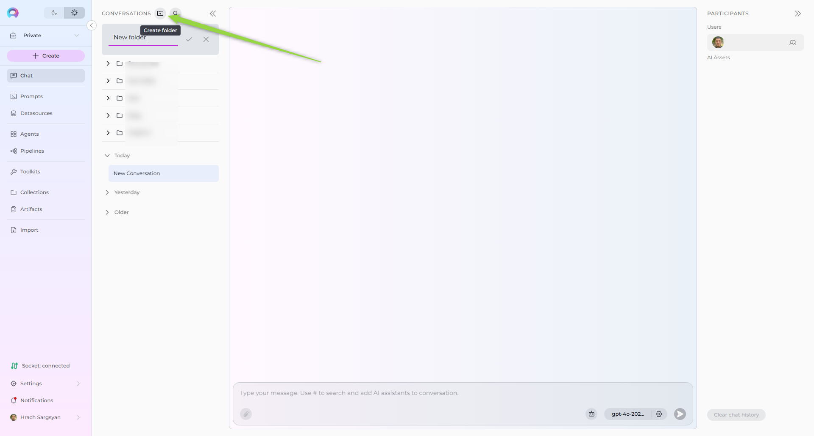
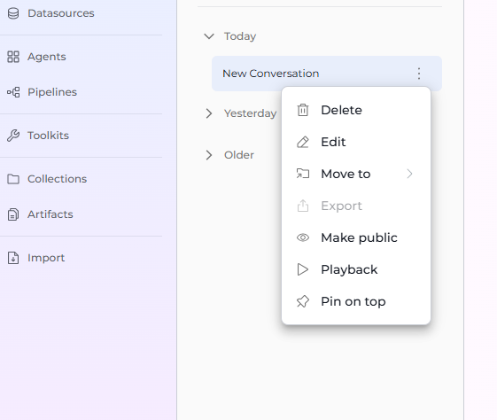
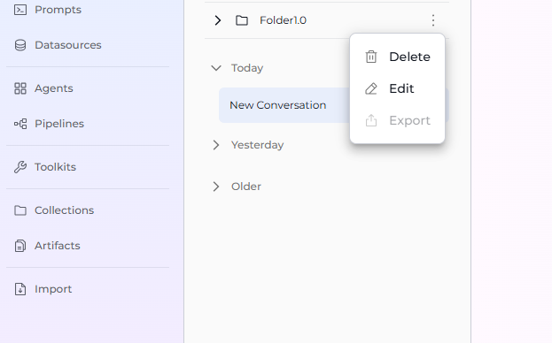
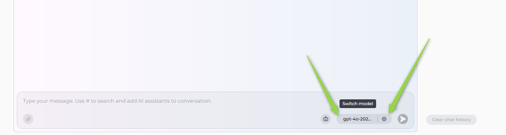
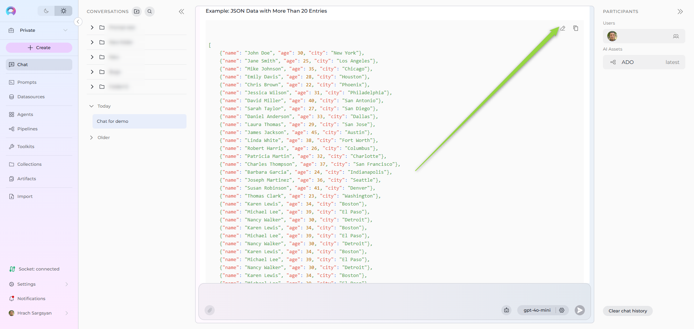

## Introduction to Chat Functionality

ELITEA Chat is a powerful feature designed to centralize your interactions with various ELITEA components, enabling you to achieve optimal results efficiently.

A Conversation in ELITEA represents a dynamic dialogue involving multiple participants. These can include language models (LLMs), Agents, Pipelines, Toolkits, MCPs, and human Users like yourself. You interact using natural language, and the chat maintains context, allowing you to refer to previous messages within the same conversation. Conversations are isolated; context is not shared between different conversations.

All your conversations are securely stored on the ELITEA server, making them accessible from any device where you log in. You can find all your conversations listed under the Chat menu in the sidebar.

## Key Features

* **Public and Private Conversations**: Control visibility and collaboration by sharing conversations or keeping them private.  
* **Diverse Participants**: Integrate Models, Agents, Pipelines, Toolkits, MCPs, and other Users (in public conversations) into your chat.  
* **Canvas Editor**: Edit and refine AI-generated code, tables, and diagrams with built-in editing tools.
* **File Attachments**: Upload and attach images and files for AI analysis and processing.
* **Internal Tools**: Execute Python code securely with the Python Sandbox internal tool.
* **Rich Interactions**: Engage with participants, copy responses, provide feedback, and more.  
* **Comprehensive Management**: Save, pin, share, delete, and clear conversations.  
* **Folder Organization**: Structure your conversations logically using folders.  
* **Playback Mode**: Simulate and review conversation flows without engaging live models, ideal for demos.  
 ## Getting Started

### Creating a New Conversation

1. In the main sidebar on the left, locate the **Chat** section.
2. Click **+ Create** to start a new conversation.
3. You'll see a welcome screen with the message "Hello, [Your Name]! What can I do for you today?"
4. The message input box at the bottom shows the placeholder: "Type your message. Use # to search and add AI assistants to conversation."
5. **Choose your approach:**
      - **Add a participant first**: Type `#` to search and select an Agent, Pipeline, Toolkit, or MCP from the dropdown list that appears. Selected participants will appear as chips above the input box.
      - **Select a model**: Click the model selector dropdown to choose an LLM (e.g., GPT-4, Claude).
6. **Type your message**: Enter your initial message, question, or command (e.g., "Help me write a Python script", "What are the best practices for API design?", "Explain quantum computing").
7. **Send**: Click the **Send** icon (paper airplane icon) or press Enter.
8. The system will automatically create a new conversation with a temporary name "Naming..." while it generates a descriptive name based on your conversation content. Once complete, the generated name will replace the placeholder. You can manually rename it at any time.

Your new conversation will now appear in the **CONVERSATIONS** sidebar on the left.


### Creating a New Folder

Organize your conversations by grouping them into folders.

1. In the **Conversations** sidebar, locate the folder icon button next to "Conversations" at the top.
2. Click the **folder icon** (Create folder button).
3. A new folder entry will appear. Enter a descriptive **Name** for your folder.
4. Press Enter or click the checkmark to save.

The new folder will appear in your **CONVERSATIONS** sidebar.  



## Managing Conversations

### Moving Conversations to Folders

To organize conversations into folders:

**Method 1: Drag and Drop**

1. In the **CONVERSATIONS** sidebar, click and hold on the conversation you wish to move.
2. Drag the conversation over the destination folder.
3. Release to drop the conversation into the folder.

**Method 2: Context Menu**

1. In the **CONVERSATIONS** sidebar, right-click on the conversation you wish to move.
2. Select **Move to** from the context menu.
3. Choose the desired destination folder from the list, OR
4. Select **Create folder** to create a new folder and move the conversation into it simultaneously.
5. To move a conversation back to the main list, select **Back to the list** from the Move to menu.


### Conversation Actions (Sidebar)

You can manage conversations directly from the **CONVERSATIONS** sidebar by right-clicking on a conversation or clicking the options menu (often **...**) associated with it. The following actions are available:

* **Edit**: Rename the conversation. Enter the new name and confirm.
* **Pin / Unpin**: Select **Pin** to keep the conversation at the top of the list for easy access. Select **Unpin** on a pinned conversation to remove it from the top.
* **Move To**: Move the conversation into a folder, as described above.
* **Make Public**: Convert a private conversation into a public one, visible to other project members.  
     **Caution**: This action is irreversible; you cannot make a public conversation private again.
* **Delete**: Permanently remove the conversation. You will be asked to confirm this action.
* **Playback**: Enter Playback mode for this conversation (See [Playback Mode](#playback-mode)).



## Managing Folders

### Folder Actions (Sidebar)

Folders can be managed directly from the **CONVERSATIONS** sidebar. Right-click on a folder or click its associated options menu (**...**) to access the following actions:

* **Edit Folder**: Rename the folder. Enter the new name and click the checkmark (✔) or **Save** button.
* **Delete Folder**: Remove the folder.  
  **Important**: Deleting a folder does not delete the conversations inside it. Conversations within a deleted folder are automatically moved back to the main conversation list (root level). You will be asked to confirm deletion.



## Understanding Conversation/Folder Visibility

Access and permissions depend on the project type (Private vs. Team) and the conversation/folder setting (Private vs. Public).

### Private Conversations and Folders

* Created within your private workspace or designated as private within a team project.
* Only visible and accessible to you, the creator.
* You can add **Agents**, **Pipelines**, MCPs and **Toolkits** as AI Assistants.
* You cannot add other **Users** as participants to private conversations.

### Team Project Conversations and Folders

When working within a shared team project:

* **Folders**: You can see all folders created within the project.
* **Conversations**: You can only see conversations within folders if you are a member (participant) of that specific conversation.
* **Membership Actions**: If you are a member of a conversation, you can move it into any folder (public or private if you created it) or move it out of a folder using the **Back to the list** option (often found within the **Move To** menu).
* **Folder Restrictions**: You generally cannot delete folders created by other users, even if you can manage conversations within them.

### Example: Collaboration in a Team Project Chat

**Scenario**:  
The QA, PM, and BA are working together on a new feature for a product. They are using a shared conversation to discuss requirements, testing strategies, and project timelines.

**Steps to Collaborate**:

   - **BA Adds Requirements**:  
     The BA starts the conversation by adding the feature requirements.  
     Example:  
     ```
     @BA: "The new feature should allow users to upload files up to 10MB in size. The system must validate file types and provide error messages for unsupported formats."
     ```

   - **PM Sets the Timeline**:  
     The PM responds by setting the timeline for the feature's development and testing.  
     Example:  
     ```
     @PM: "The development team will complete the implementation by May 15th. QA can start testing on May 16th, and we aim to release the feature by May 20th."
     ```

   - **QA Plans Testing**:  
     The QA outlines the testing strategy and asks for clarification on edge cases.  
     Example:  
     ```
     @QA: "I will create test cases for file uploads, including valid and invalid file types, file size limits, and error handling. @BA, can you confirm if the system should support drag-and-drop uploads?"
     ```

   - **BA Provides Clarifications**:  
     The BA clarifies the requirements and provides additional details.  
     Example:  
     ```
     @BA: "Yes, drag-and-drop uploads should be supported. Additionally, the system should display a progress bar during uploads."
     ```

   - **PM Tracks Progress**:  
     The PM uses the chat to track progress and ensure alignment.  
     Example:  
     ```
     @PM: "QA, please share the test results by May 18th so we can review them before the release."
     ```

**Using Folders for Organization**

   * The PM creates a folder named **"Feature: File Upload"** to organize all conversations related to this feature.
   * The conversation is moved into this folder for easy access by all team members.

**Collaboration Benefits**

   * **Centralized Communication**: All discussions, clarifications, and updates are stored in one place.
   * **Transparency**: Team members can see the progress and contribute as needed.
   * **Accountability**: Each participant's responsibilities and deadlines are clearly outlined.


### Tips for Effective Collaboration in Team Projects

* **Use Mentions**: Use `@` to mention specific teammates.
* **Organize Conversations**: Use folders to group related conversations for better accessibility.
* **Set Clear Expectations**: Define roles, responsibilities, and deadlines within the chat.
* **Provide Updates**: Regularly update the chat with progress, blockers, and next steps.


## Public Conversations and Folders

* **Folders**: Public folders are visible to all members of the project.
* **Conversations**: Conversations within public folders (or marked as public) can be viewed and interacted with by all project members. Any member interacting becomes a participant.
* **Permissions**: Project members can typically move conversations into or out of public folders, subject to their overall project permissions.
* **Irreversibility**: Public folders/conversations cannot be converted back to private.


## Working with Participants

Participants are the core components you interact with within a conversation.

### What are Participants?

Participants are the "tools" or "entities" you add to your chat. These include:

* **Models**: Large Language Models (e.g., GPT-4, Claude) for generating text, answering questions, etc.
* **Agents**: Pre-configured automated workflows or specialized bots designed for specific tasks.
* **Pipelines**: Multi-step automated processes that orchestrate multiple agents and tools.
* **Toolkits**: Collections of tools and integrations that extend chat capabilities (e.g., GitHub, Jira, Confluence).
* **MCPs**: Model Context Protocol servers that provide external tool capabilities (e.g., Playwright for browser automation, Figma for design files).
* **Users**: In public conversations, other project members who join or interact become participants. They cannot be manually "added" like other types but join implicitly.


### Adding Participants to a Conversation

To add participants:

**Method 1: Using the Participants Panel**

1. In the **Participants** section on the right side of the screen, you'll see collapsible sections for:
   - **Users** (if in a team project)
   - **agents**
   - **pipelines**
   - **toolkits**
   - **MCPs**
2. Click the **+** icon next to any section title to add participants of that type.
3. Once participants are added, type your message and click **Send**.


**Method 2: Using the # Symbol (Frequently Used)**

1. In the chat input box, type `#` to see a dropdown list of frequently used participants.
2. Select a participant from the list to add it to the conversation (e.g., `#Data Analysis Agent`).
3. The selected participant will appear as a chip above the input box.
4. Type your message and click **Send**.


**Creating New Participants from Chat:**

You can also create new participants directly from the chat interface using the Canvas feature:

* **Agents**: Click **Create new agent** to open the Agent Canvas and configure a new AI agent. See [How to Create and Edit Agents from Canvas](how-to-create-and-edit-agents-from-canvas.md).
* **Pipelines**: Click **Create new pipeline** to open the Pipeline Canvas and design a multi-step workflow. See [How to Create and Edit Pipelines from Canvas](how-to-create-and-edit-pipelines-from-canvas.md).
* **Toolkits**: Click **+Add toolkit** then **+ Create new Toolkit** to configure integrations like GitHub, Jira, etc. See [How to Create and Edit Toolkits from Canvas](how-to-create-and-edit-toolkits-from-canvas.md).
* **MCPs**: Click **Create new MCP** to connect Model Context Protocol servers. See [How to Create and Edit MCPs from Canvas](how-to-create-and-edit-mcps-from-canvas.md).


 


### Adding Users to a Conversation

Users (team members) can only be added to in team projects. They cannot be added to private conversations.

**To Add Users:**

1. Ensure your conversation is in team Project.
2. In the **Participants** section on the right side, locate the **Users** section.
3. Click the **+** icon next to **Users**.
4. A list of available team members will appear.
5. Select the user(s) you want to add to the conversation.
6. The selected users will appear in the **Users** section of the **Participants** panel.

**Important Notes:**

* Added users will receive notifications about being added to the conversation.
* Users can also join a public conversation implicitly by interacting with it.
* Once a conversation is public, it cannot be converted back to private.

For detailed information on adding teammates, see [Adding Teammates to Conversation](add-teammates-to-conversation.md).


### Using Participants in a Conversation

Once added, participants are ready to process your messages:

1. **Check Participants**: Ensure the desired participant is listed in the **Participants** section.
2. **Select Active Participant(s)**: 
       - **Click**: Click the participant's name/icon in the **Participants** list to make it active for your next message.
3. **Mention Users** (Team Projects only): You can mention other team members using `@` followed by their name (e.g., `@John Doe`). This notifies them and brings their attention to specific parts of the conversation.
4. **Send Message/Command**: Type your message or a simple command (like "Go", "Execute", "Run it") and press **Send**. The active participant(s) will process your input.

### Example Usage

* **To ask a general question using a specific model**:
    1. Select a model from the model selector dropdown (e.g., `GPT-4o`).
    2. Type: `"Explain the concept of recursion in programming."` -> **Send**.

* **To use a specific agent**:
    1. In the **Participants** panel, click the **+** icon next to "agents".
    2. Select `Data Analysis Agent` from the dropdown.
    3. Click on the agent in the **Participants** list to activate it, or type `#Data Analysis Agent` in the input box.
    4. Type your request: `"Analyze the latest sales data."` -> **Send**.

* **To use a toolkit**:
    1. Add the desired toolkit (e.g., `Artifact Toolkit`) from the **toolkits** section.
    3. Type: `"Store this data in artifacts."` -> **Send**.

* **To mention a team member** (Team Projects only):
    1. In your message, type `@` followed by the team member's name (e.g., `@John Doe`).
    2. Type: `"@John Doe, can you review this analysis?"` -> **Send**.


### Selecting and Configuring Models

Models are the large language models (LLMs) that power your conversations. You can select a model and adjust its behavior to suit your needs.

**Selecting a Model:**

1. In the conversation interface, locate the **model selector dropdown** at the top of the chat area.
2. Click the dropdown to see the list of available models (e.g., GPT-4o, Claude, GPT-3.5).
3. Select the desired model from the list.
4. The selected model will be used for your next message and subsequent messages until you change it.

**Configuring Model Settings:**

1. **Access Settings**: Click the **⚙️** (settings) icon next to the model selector dropdown.
2. **Adjustable Parameters**:
    * **Temperature**: Controls randomness (higher = more creative, lower = more deterministic). Range: 0-2.
    * **Top P**: Nucleus sampling (considers tokens with cumulative probability > P). Range: 0-1.
    * **Max Completion Tokens**: Maximum number of tokens in the response.
    * **Remaining Tokens**: Displays the number of tokens remaining in the current context window.
3. **Apply**: Click the **< SETTINGS** button to save changes for this conversation.




### Configuring Participants

You can configure and edit participants (Agents, Pipelines, Toolkits, and MCPs) directly within the conversation using the Canvas editor.

**Accessing Participant Settings:**

1. **Option 1**: Click the participant in the **Participants** list, then click the **⚙️** (settings) icon.
2. **Option 2**: Hover over the participant element in the **Participants** list and click the **Edit** icon that appears.
3. The appropriate **Canvas** editor will open based on the participant type.

**What You Can Configure:**

* **[Agents](how-to-create-and-edit-agents-from-canvas.md)**:
      - Edit the agent's **prompt** and instructions
      - Modify **variables** used by the agent
      - Configure **model settings** (Temperature, Top P, Top K, Maximum Length)
      - Select the agent **version** (default is "latest")
      - Adjust **toolkits** and integrations

* **[Pipelines](how-to-create-and-edit-pipelines-from-canvas.md)**:
      - Edit the pipeline **workflow** and step sequences
      - Modify **variables** and parameters
      - Configure **agents** used in the pipeline
      - Adjust **toolkits** and integrations
      - Select the pipeline **version** (default is "latest")

* **[Toolkits](how-to-create-and-edit-toolkits-from-canvas.md)**:
     - Configure **integration settings** and credentials
     - Adjust **tool parameters** and options
     - Enable or disable specific tools within the toolkit
     - Modify **connection settings** for external services

* **[MCPs](how-to-create-and-edit-mcps-from-canvas.md)** (Model Context Protocol servers):
     - Configure **server connection** settings
     - Adjust **tool availability** and permissions
     - Modify **environment variables** and parameters
     - Set **timeout** and performance options

!!! note
    MCP servers must be running before they can be used in conversations. Ensure your MCP server is started and accessible before adding it as a participant.

**Applying Changes:**

1. Make your edits in the Canvas editor.
2. Click the **Save** button to apply your modifications.
3. The updated configuration will be used for subsequent messages in the conversation.


### Displaying Configured Conversation Starters

When you add a participant (like an Agent, Pipeline, Toolkit, or MCP) that has a pre-configured "conversation starter" message or instruction set, this message will automatically appear in the chat. This helps guide you on how to interact with the participant effectively.


## Interacting with Conversation Outputs

### Like/Dislike and Commenting

1. Below each generated response, you'll see **Thumbs Up (👍)** and **Thumbs Down (👎)** icons.
2. Click **Thumbs Up** to indicate satisfaction.
3. Click **Thumbs Down** to indicate dissatisfaction.
4. After clicking **Thumbs Down**, a **Leave comment** field appears. Click it, type your specific feedback or reason for disliking, and press **Send** (or **Enter**). This feedback is valuable for improving models and prompts.


### Regenerating the Last Output

1. If you're not satisfied with the very last response generated by a participant, you can ask it to try again.
2. Ensure a response has been generated.
3. Click the **Regenerate** icon 🔄 usually located near the last message or the input box.
4. The system will use the same input/prompt that generated the last response and attempt to create a new, potentially improved, output.


## Using Canvas for Content Editing

Canvas is your all-in-one workspace for editing, refining, and collaborating on AI-generated content in ELITEA. Instead of copying results into other tools, you can work directly with code, tables, and diagrams—right where the conversation happens.

**What is Canvas?**

Canvas is a built-in editor that appears automatically when ELITEA generates code, tables, or Mermaid diagrams in a chat. It allows you to edit, refine, and export AI-generated content without leaving the conversation.

**Canvas Features:**

* **Code Editor**: Edit code with syntax highlighting, find/replace, and code folding. Export as various file formats (e.g., `.py`, `.js`, `.java`).
* **Table Editor**: Modify tables with spreadsheet-like functionality. Add/remove rows and columns, sort, filter, and export to XLSX or Markdown.
* **Diagram Editor**: Edit Mermaid diagrams with live preview and syntax highlighting. Export as PNG, JPG, or SVG.

**How to Use Canvas:**

1. Ask ELITEA to generate code, a table, or a Mermaid diagram.
2. When ELITEA generates the content, look for the pencil icon (✏️) in the top-right corner of the content block.
3. Click the icon to open the Canvas editor in a modal window.
4. Make your edits using the available tools:
      - **Copy**: Copy content to clipboard
      - **Undo/Redo**: Revert or reapply actions
      - **Save**: Save your changes
      - **Export**: Download in various formats
5. Click **Save** to preserve your changes in the conversation or **Export** to download files.

For detailed information, real-world examples, and best practices, see [Canvas in Conversation](how-to-canvas.md).




## Attaching Files and Images

ELITEA Chat supports attaching files and images to your conversations, enabling AI-powered analysis of visual content and documents.

**How It Works:**

The attachment functionality is integrated with the **Artifact Toolkit**. When you enable attachments for an Agent, Pipeline, or a specific chat, files are automatically uploaded and stored in the Artifact bucket associated with that toolkit. Files are subject to the retention policy of the bucket (default: 30 days).

**Key Features:**

* **Multiple Upload Methods**: Click the paperclip icon, drag and drop files, or paste from clipboard (Ctrl+V or Cmd+V).
* **Supported Formats**: JPEG, JPG, PNG, GIF (first frame only), WebP images.
* **File Limits**: Maximum 10 images per message. Size limits depend on the AI model (e.g., Anthropic: 5MB, OpenAI: 20MB per image).
* **Artifact Integration**: Files are stored in Artifact buckets with configurable retention policies.
* **Management Options**: Download or delete attachments directly from chat.

**To Enable Attachments:**

**From Chat:**

1. Click the paperclip icon in the message input area.
2. If not configured, the **Attachment settings** popup will appear.
3. Select an existing Artifact Toolkit or create a new one.
4. Once configured, you can attach files by clicking the paperclip, dragging files, or pasting.

**Using Attachments:**

1. After enabling, click the paperclip icon to see "Attach files" and "Attachment settings" options.
2. Attach images using click, drag-and-drop, or paste methods.
3. Type a text prompt to accompany your images (required).
4. Click **Send** to submit the message with attachments.

For complete setup instructions, advanced configuration, and troubleshooting, see [Attachments in Conversation](attach-images-and-files-in-chat.md).


## Using Internal Tools

Internal tools provide built-in capabilities that enhance your conversations and agents without requiring external integrations. Currently, ELITEA supports the **Python Sandbox** internal tool.

**What is Python Sandbox?**

Python Sandbox enables secure Python code execution directly within your conversations using Pyodide (Python compiled to WebAssembly).

**Python Sandbox Features:**

* **Secure Code Execution**: Run Python code in a secure sandbox environment.
* **Package Support**: Install and use Python packages like numpy, pandas, and matplotlib.
* **Persistent State**: Code execution maintains state within the same conversation.
* **Visualizations**: Generate data visualizations and reports.
* **Use Cases**: Execute code snippets, perform calculations and data analysis, test algorithms, and process data.

**To Enable Python Sandbox in Conversations:**

1. Navigate to your conversation.
2. Locate the chat input toolbar at the bottom of the screen.
3. Find the **Internal Tools** icon (value icon) next to the attachment button.
4. Click the Internal Tools icon to open the configuration popup.
5. Find **Python sandbox** in the list and toggle it ON.
6. A success notification will appear: "Internal tools configuration updated".

**To Enable Python Sandbox in Agents:**

1. Navigate to **Agents** in the main menu and select the agent.
2. Click the **Configuration** tab.
3. Scroll to the **TOOLKITS** section.
4. Find the **Python sandbox** switch and toggle it ON.
5. Click **Save** at the top of the configuration page.
6. The Python sandbox will be available in all new conversations using this agent.

**Using Python Sandbox:**

Once enabled, the AI assistant can execute Python code during conversations. The assistant can install packages, execute multi-line scripts, maintain state between executions, and generate visualizations.

For detailed usage examples, troubleshooting, and verification steps, see [Internal Tools in Conversation](enable-internal-tools.md).


## Playback Mode

Playback mode allows you to step through an existing conversation turn by turn, exactly as it happened, without actually sending requests to the Models, Toolkits, etc.

* **Purpose**: Excellent for demonstrating a workflow, reviewing a complex interaction, or debugging without incurring processing costs or waiting for live responses.
* **Activation**: Access this via the conversation's context menu in the sidebar (**Right-click conversation -> Playback**).
* **Controls**: During playback, you typically have controls to move forward to the next message, go back to the previous message, or stop the playback simulation.

### Example: Using Playback Mode for a Demo

**Scenario**:  
A Product Manager is preparing a demo for stakeholders to showcase how the team collaborated on a new feature. They use Playback Mode to simulate the conversation and highlight key decisions and actions.

**Steps to Use Playback Mode**:

**Access the Conversation**:  
   The Product Manager navigates to the conversation in the **CONVERSATIONS** sidebar where the team discussed the feature.

**Activate Playback Mode**:  
   The Product Manager right-clicks on the conversation and selects **Playback** from the context menu.

**Simulate the Conversation**:  
   - The playback starts with the BA's initial message outlining the feature requirements.  
     Example:  
     ```
     @BA: "The new feature should allow users to upload files up to 10MB in size. The system must validate file types and provide error messages for unsupported formats."
     ```
   - The PM uses the **Next** control to move to the next message, where they set the timeline for development and testing.  
     Example:  
     ```
     @PM: "The development team will complete the implementation by May 15th. QA can start testing on May 16th, and we aim to release the feature by May 20th."
     ```
   - The QA's message about testing strategies is reviewed next.  
     Example:  
     ```
     @QA: "I will create test cases for file uploads, including valid and invalid file types, file size limits, and error handling."
     ```

**Highlight Key Decisions**:  
   - The Product Manager pauses playback to explain the rationale behind certain decisions, such as the timeline or testing strategy.
   - They resume playback to show the BA's clarification about drag-and-drop uploads.  
     Example:  
     ```
     @BA: "Yes, drag-and-drop uploads should be supported. Additionally, the system should display a progress bar during uploads."
     ```

**Conclude the Demo**:  
   - The Product Manager stops playback after showcasing the final message tracking progress.  
     Example:  
     ```
     @PM: "QA, please share the test results by May 18th so we can review them before the release."
     ```

### Benefits of Playback Mode for Demos

* **Polished Presentations**: Playback Mode ensures a smooth and professional demo without interruptions or delays.
* **Clarity**: Stakeholders can see the exact flow of discussions and decisions.
* **Engagement**: The step-by-step simulation keeps the audience engaged and focused on key points.

By using Playback Mode, teams can effectively demonstrate their collaboration and decision-making processes to stakeholders, ensuring transparency and alignment.