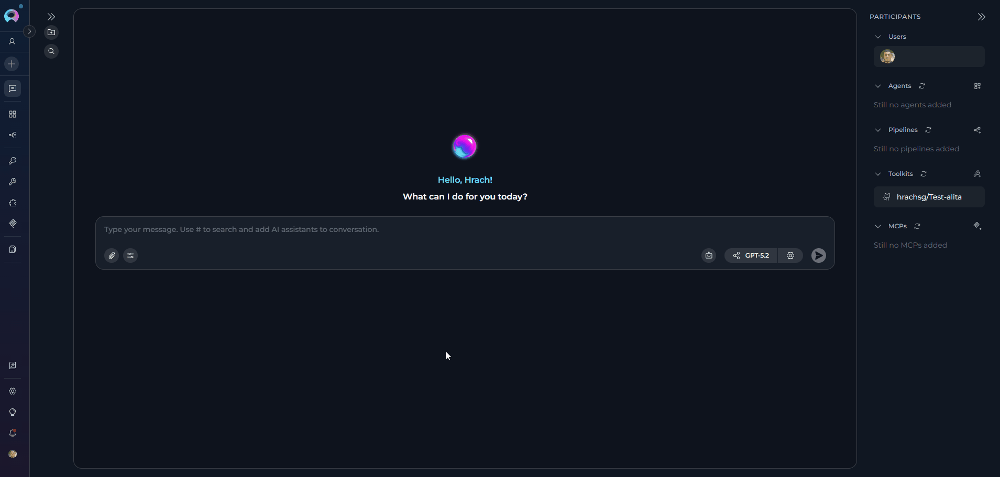
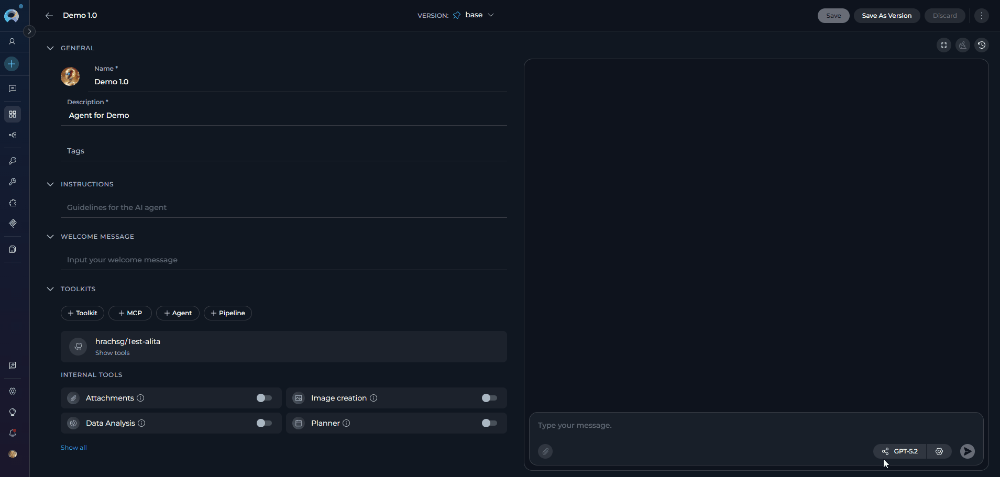
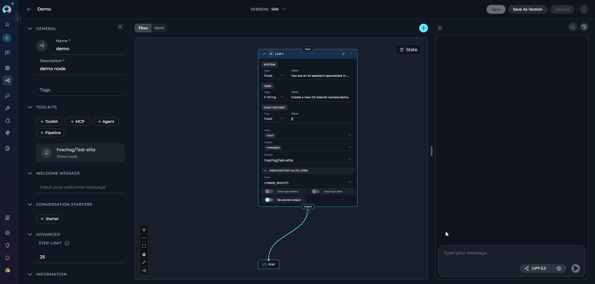

# Sensitive Action Authorization Guardrail

## Overview

The **Sensitive Action Authorization Guardrail** is a server-side security control that pauses agent execution whenever the agent is about to invoke a designated sensitive tool. Rather than letting an action execute silently, the guardrail surfaces a human-in-the-loop (HITL) dialog in the conversation, requiring an explicit **Authorize** or **Block** decision before the tool runs.

!!! warning "Administrator-only configuration"
    The Sensitive Action Authorization Guardrail is configured exclusively at the **server/infrastructure level** through environment variables. Individual users and agents cannot enable or disable it — it applies automatically to all conversations, agents, and pipelines once configured.

**Key capabilities:**

* **Pre-execution authorization** — Halts tool invocation, shows the pending action and its parameters to the user, and waits for a decision.
* **Transparent parameter display** — Surfaces the exact arguments the agent plans to pass, with security-sensitive fields (passwords, tokens, API keys, secrets) automatically masked as `***`.
* **Customizable authorization message** — Organizations can customize the approval request with their company name and a tailored policy message.
* **Flexible tool targeting** — Sensitive tools can be specified per toolkit type, per named toolkit instance, or globally across all toolkits using a wildcard (`*`).
* **Session-level auto-approve** — Once a tool is authorized within an execution batch, subsequent calls to the same tool in that batch do not re-interrupt, reducing friction for repetitive safe actions.
* **Stale-interrupt protection** — If a user sends a new message while an authorization dialog is pending, the system re-surfaces the existing interrupt instead of proceeding autonomously.

---

**How It Works**

When the guardrail is active, the following flow applies every time the agent attempts to call a designated sensitive tool:

1. **Detection:** The `SensitiveToolGuardMiddleware` intercepts the tool call before execution.
2. **Context building:** The middleware resolves the toolkit name, tool name, and planned arguments. Security-sensitive argument fields are masked.
3. **Interrupt:** Execution pauses and a HITL interrupt is raised. The conversation UI displays the authorization dialog.
4. **User decision:** The user reviews the action label, parameters, and policy message, then clicks **Authorize** or **Block**.
5. **Resume or skip:**
    - **Authorize** → the tool runs as originally planned.
    - **Block** → the tool is skipped. The agent receives a blocked-action message and continues or stops based on its logic.

```
Agent calls sensitive tool
         │
         ▼
 SensitiveToolGuardMiddleware
         │
  ┌──────┴──────┐
  │  Tool in    │
  │  sensitive  │──No──► Execute tool normally
  │  list?      │
  └──────┬──────┘
         │ Yes
         ▼
 HITL interrupt raised
 (conversation paused)
         │
  ┌──────┴────────────┐
  │  User decision    │
  ├──────┬────────────┤
Authorize│         Block│
         │              │
         ▼              ▼
   Tool executes    Tool skipped
                   (agent notified)
```

---

## Configuration

The Sensitive Action Authorization Guardrail is set up by your **ELITEA administrator** at the platform level. As an end user, you do not need to configure anything — the guardrail is already active when you see the authorization dialog in your conversations.

Your administrator controls three aspects of the guardrail:

* **Which tools require approval** — Specific actions within toolkits (such as deleting a repository, running a shell command, or dropping a database table) are designated as sensitive. Any agent that has access to those tools will trigger the authorization dialog when it attempts to use them.
* **Organization name** — The name shown in the authorization message (e.g., "Acme Corp requires approval before..."). This is set to match your organization's branding.
* **Approval message** — The policy message displayed in the dialog, explaining why the action needs review.

!!! info "Need to add or remove a tool from the guardrail?"
    Contact your ELITEA administrator. They can update the list of protected tools and apply the changes during the next platform maintenance window.

---

## Authorization Dialog in the UI

When a sensitive tool is triggered, the conversation pauses and displays an authorization card.

* **Dialog elements**

     | Element | Description |
     |---------|-------------|
     | **Header** | "⚠️ Sensitive Action Authorization Required" — amber-highlighted panel |
     | **Action label** | The specific action the agent plans to run, formatted as `toolkit_name.tool_name` (e.g., `github.delete_repo`) |
     | **Parameters** | Collapsible panel showing the exact arguments the tool will be called with. Security-sensitive fields (`password`, `token`, `api_key`, `secret`, `authorization`, etc.) are automatically masked as `***`. |
     | **Policy message** | The configured authorization message from `ALITA_SENSITIVE_ACTION_MESSAGE_TEMPLATE` |
     |  |  Approves the action, resumes execution |
     |  | Rejects the action, skips the tool call entirely |


!!! info "What happens when you block an action"
    When you click **Block**, the agent receives a notification that the action was skipped. It will typically acknowledge the cancellation and either stop or continue with the remainder of its task, depending on the agent's configuration. The tool is **never** executed.

---

## Usage in Conversations, Agents, and Pipelines

The guardrail is transparent — it activates automatically whenever a configured sensitive tool is about to be called, regardless of where the agent is running.

**In Conversations**

Start a conversation with any agent or model that has access to toolkits. When the agent decides to invoke a sensitive tool, the conversation pauses automatically and shows the authorization card.

1. Review the action label and parameters carefully.
2. Click **Authorize** to proceed or **Block** to cancel.
3. The conversation resumes automatically after your decision.

* **Authorize**

     

* **Block**

     

!!! tip "Multi-step agents"
    If an agent calls the same sensitive tool multiple times in one execution cycle (e.g., deleting multiple branches in a loop), only the **first call** raises the interrupt. Once authorized, subsequent calls to the same tool in the same execution batch are auto-approved — avoiding repeated dialogs for the same action within a single session.

**In Agents**

* When an agent is configured with toolkits that include sensitive tools, the guardrail activates mid-execution. The agent's task pauses at the sensitive tool call, the user authorizes or blocks, and the agent continues from that point.

     

**In Pipelines**

* In pipeline graphs, the guardrail wraps tools used in `toolkit`, `function`, `mcp`, `code`, and `llm` node types. When a pipeline node calls a sensitive tool, execution halts at that node, the authorization dialog appears, and the pipeline resumes from that checkpoint after the user's decision.

     

!!! info "Code nodes in pipelines"
    For `code` node types (Python Sandbox), the guardrail is applied when the sandbox tool is configured as sensitive (e.g., `"sandbox": ["pyodide_sandbox"]`). The pipeline pauses before any code execution, showing the code parameters for review.

---

## Limitations

!!! warning "Known limitations"
    * **Server-side only** — The guardrail cannot be configured per user, per conversation, or per agent from the ELITEA UI. All changes require access to server environment variables and a service restart.
    * **No partial approval** — Users can only approve or block the entire tool call. It is not possible to edit tool arguments through the authorization dialog.
    * **One pending interrupt at a time** — If an authorization dialog is pending and the user sends a new message, the new message is deferred. The user must resolve the pending authorization first, then re-send.
    * **Tool name normalization** — Tool names are lowercased and matched by their base name, stripping prefixes. Ensure the base name (after stripping `toolkit_type___` or `namespace:` prefixes) is used in the configuration.
    * **Auto-approve scope** — Session-level auto-approve applies within a single execution batch (one continuous agent run). A new user message starts a fresh execution; approvals do not carry over across messages.
    * **Checkpoint required** — The guardrail relies on LangGraph's `interrupt()` mechanism and requires a checkpointer (persistent memory). Stateless or non-checkpointed agent runs do not support HITL interrupts.

---

## Real-Life Usage Examples

??? example "Example 1: Protecting Destructive GitHub Operations"

    A DevOps agent has access to the GitHub toolkit and can manage repositories. Deleting repositories, branches, or merging pull requests are all protected — any attempt by the agent triggers the authorization dialog.

    **Usage scenario:**

    ```
    You: "Merge the hotfix-443 branch into main."

    Agent: [Initiating merge_pull_request...]

    ⚠️  Sensitive Action Authorization Required
    Agent is about to perform: github.merge_pull_request
    Parameters ▾
      base:   main
      head:   hotfix-443
      title:  Merge hotfix-443

    DevOps Team requires authorization before 'github.merge_pull_request'.
    This action may be irreversible.

    [ ✓ Authorize ]  [ ✗ Block ]
    ```

??? example "Example 2: Controlling Shell Command Execution"

    An infrastructure automation agent can run shell commands. When the agent attempts to execute any system-level command, the conversation pauses and presents the authorization dialog — showing the full command and its arguments — before anything runs.

    **Usage scenario:**

    ```
    You: "Run the cleanup script on the staging server."

    Agent: [Preparing to execute command...]

    ⚠️  Sensitive Action Authorization Required

    Agent is about to perform:
      shell.execute_command

    Parameters ▾
      command:  ./cleanup.sh
      host:     staging-server-01

    Security Operations: System-level command 'shell.execute_command'
    requires explicit authorization.

    [ ✓ Authorize ]  [ ✗ Block ]
    ```

    * Click **Authorize** to allow the script to run on the staging server.
    * Click **Block** if the command or target host is not what you expected.

??? example "Example 3: Guarding Jira Project Deletion"

    A project management agent can delete Jira projects, issues, and sprints. All destructive operations require explicit approval before the agent proceeds.

    **Usage scenario:**

    ```
    You: "Delete the LEGACY project from Jira — it's been archived."

    Agent: [Preparing to call delete_project...]

    ⚠️  Sensitive Action Authorization Required
    Agent is about to perform: jira.delete_project
    Parameters ▾
      project_key:  LEGACY

    Project Office requires approval before running the sensitive action
    'jira.delete_project'.

    [ ✓ Authorize ]  [ ✗ Block ]
    ```

??? example "Example 4: Wildcard Guard for Cross-Toolkit Operations"

    Dangerous database operations such as dropping or truncating tables are protected across all toolkits. Regardless of which database or toolkit the agent uses, the authorization dialog appears before any destructive data operation runs.

    **Usage scenario:**

    ```
    You: "Drop the legacy_orders table — we migrated everything last week."

    Agent: [Preparing to drop table...]

    ⚠️  Sensitive Action Authorization Required

    Agent is about to perform:
      database.drop_table

    Parameters ▾
      table:     legacy_orders
      database:  production_db

    Data Governance Team requires approval before 'database.drop_table'.
    Data loss operations are irreversible.

    [ ✓ Authorize ]  [ ✗ Block ]
    ```

    * Click **Authorize** only after confirming the table name and database are correct.
    * Click **Block** to cancel — the table will not be affected.

---

## FAQ

??? question "Can a user bypass the authorization dialog?"

    No. The guardrail is enforced at the middleware level in the server-side runtime. There is no UI control that can disable it per user or per conversation.

??? question "What if the agent calls two different sensitive tools in one message?"

    Each sensitive tool call raises its own independent interrupt. The first tool call pauses execution; after the user decides, the agent continues and pauses again at the second sensitive tool, presenting a new dialog.

??? question "Does the authorization dialog expire?"

    The authorization dialog remains active as long as the conversation's checkpoint is alive (session duration). If the user refreshes the page or returns to the conversation later, the pending interrupt is re-surfaced automatically.

??? question "Are pipeline runs affected?"

    Yes. Pipelines running in ELITEA share the same underlying runtime. Sensitive tool calls in any pipeline node are intercepted and paused for human authorization.

??? question "What does the agent receive when a tool is blocked?"

    The agent receives a structured message of the form:

    ```json
    {
      "type": "sensitive_tool_blocked",
      "status": "blocked",
      "action_label": "github.delete_repo",
      "message": "User blocked the sensitive action 'github.delete_repo'. This tool call was skipped and not executed."
    }
    ```

    The agent's next response should acknowledge that the action was cancelled.

---

## Troubleshooting

??? warning "The authorization dialog never appears — the tool executes silently"

    * Verify that `ALITA_SENSITIVE_TOOLS` is set and contains valid JSON. A parse error silently disables the guardrail.
    * Confirm the **tool name** in the config matches the base tool name (lowercase, underscores). Strip any prefix — `github___delete_repo` → `delete_repo`.
    * Confirm the **toolkit key** matches either the toolkit type (e.g., `github`), the exact instance name as configured in ELITEA, or `*`.
    * Restart the ELITEA backend after changing environment variables — the middleware reads the config at startup.
    * Check that the agent runtime uses a **checkpointer**. Without persistent state, `interrupt()` cannot pause execution.

??? warning "The dialog appears but clicking Authorize does nothing"

    * This usually indicates a **stale session**. Refresh the page — the interrupt will be re-surfaced.
    * If the conversation was idle for an extended period, the checkpoint may have expired. Start a new conversation and reproduce the tool call.
    * Confirm the ELITEA backend is reachable — network errors during the resume call can cause the button to appear unresponsive.

??? warning "The tool is blocked even though I clicked Authorize"

    * Check whether another user or automated process sent a message to the same conversation while the dialog was open. A concurrent message can cause the interrupt state to be reset.
    * Review server logs for `sensitive_tool_blocked` events to confirm whether the block originated from the guardrail or from the agent's own error handling.

??? warning "Security-sensitive parameters are not being masked"

    * Masking applies to fields whose names match known sensitive patterns: `password`, `token`, `api_key`, `secret`, `authorization`, `credential`, `private_key`. Custom field names outside this list are not masked automatically.
    * If a toolkit uses non-standard argument names for secrets, consider requesting an update to the masking pattern list from your ELITEA administrator.

??? warning "The same tool keeps interrupting on every call despite being authorized"

    * Auto-approve within a batch only applies to the **same tool name**. If the agent calls two slightly different tool variants (e.g., `delete_branch` and `delete_branch_remote`), each is treated as a separate tool.
    * Auto-approve resets between **user messages**. Each new message starts a fresh execution context — prior approvals do not carry forward.

---

!!! info "Related documentation"
    * [Context Management](context-management.md) — Manage conversation memory and history settings that affect what the agent retains between turns.
    * [Toolkits](../../menus/toolkits.md) — Set up and manage toolkits to control which tools your agents can access, including those that trigger the guardrail.
    * [Conversations](../../menus/chat.md) — Learn how to interact with agents in conversations, including how to respond to authorization dialogs.
    * [Agents](../../menus/agents.md) — Configure agents with toolkits and understand how guardrail interrupts fit into the agent execution flow.
    * [Pipelines](../../menus/pipelines.md) — Build multi-step pipelines and learn how authorization dialogs interrupt and resume pipeline node execution.
