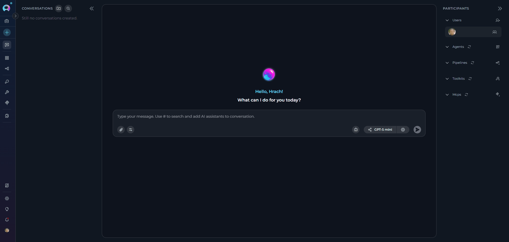
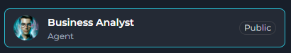
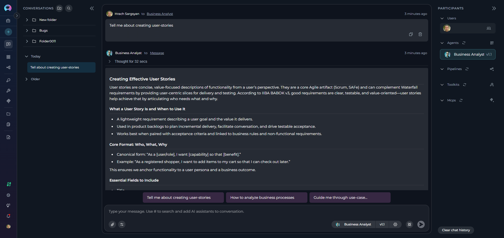

# How to Use Public Agents from Chat

## Introduction

While the **Public Project** has been removed from Elitea, **public agents** remain fully accessible and usable within **Elitea Chat**. These community-shared resources provide pre-built AI assistants and specialized capabilities that you can leverage directly in your conversations without needing to create them from scratch.

This guide explains how to discover, access, and use public agents from the Chat interface, as well as their permissions and limitations.

---

## Overview

### What Are Public Agents?

**Public Agents:**

* Pre-configured AI assistants designed for specific tasks
* Created by community members and approved by moderators
* Contain specialized instructions, model configurations, and integrated toolkits
* Examples: Data analysis agents, code review assistants, documentation generators

### Key Characteristics

* **Community-Driven:** Shared by other Elitea users after quality review
* **Easily Identifiable:** Marked with a "Public" chip/badge for quick recognition
* **Read-Only Core Config:** Core configuration cannot be modified (with temporary adjustments noted below)
* **Immediately Usable:** Add to conversations and start using right away
* **Discoverable:** Browse Latest, My Likes, and Trending sections

---

## Accessing Public Agents from Chat

Public agents are accessible directly within any conversation through the Chat interface.

### Method 1: Using the # Search

The quickest way to find and add public agents is using the `#` symbol:

1. **Open or Create a Conversation:**
     * Navigate to **Chat** in the main sidebar
      * Click **+ Create** for a new conversation, or open an existing one

2. **Search for Public Agents:**
      * In the message input box, type `#` followed by the name or keywords
      * A dropdown list appears showing matching agents
      * The list includes both your own agents and public community agents
      * Public agents are marked with a **"Public"** chip/badge for easy identification

3. **Select the Agent:**
      * Click on the desired agent from the dropdown
      * The selected agent appears as a chip above the input box

4. **Send Your Message:**
      * Type your message or question
      * Click **Send** or press Enter
      * The public agent will process your request

{loading=lazy}

### Method 2: Using the Participants Panel

You can also add public agents through the **PARTICIPANTS** panel on the right side:

1. **Locate the Participants Panel:**
      * On the right side of the chat interface, find the **PARTICIPANTS** section
      * You'll see a collapsible section for **Agents**

2. **Add Public Agents:**
      * Click the **+** icon next to **Agents**
      * A dropdown list appears with available agents, including public ones
      * Public agents are marked with a **"Public"** chip/badge
      * Select the public agent you want to add

3. **Interact with the Agent:**
      * Click on the participant in the **PARTICIPANTS** list to activate it
      * Type your message and send

{loading=lazy}

---

## Using Public Agents

### Using Public Agents

**Step-by-Step:**

1. **Add the Public Agent:**
     * Use `#AgentName` in the input box, OR
     * Click **+** next to **Agents** in the PARTICIPANTS panel

2. **Activate the Agent:**
     * Click on the agent name in the **PARTICIPANTS** list
     * The active agent is highlighted in the list

3. **Interact:**
     * Type your message or click a conversation starter if available
     * Send your message
     * The public agent processes your request and responds

!!! info "Visual Indicators"
    Public agents are marked with a **"Public"** chip/badge, making them easily identifiable. This badge appears on the agent card in lists and search results, helping you quickly distinguish between your private agents and community-shared public agents.
    
    {loading=lazy width=center}

!!! example "Example: Using Business Analyst Agent"
    The **Business Analyst** agent helps create requirements documentation, diagrams, and analysis artifacts for your projects.
    
    **Scenario:** You need user stories for an e-commerce shopping cart feature.
    
    **Step 1: Add the Agent**
    
    * Type `#Business Analyst` in the chat input box
    * The agent appears in PARTICIPANTS with a "Public" badge

    {loading=lazy}
    
    **Step 2: Ask Your Question**
    
    ```
    You: I need user stories for adding items to a shopping cart
    ```
    
    **Step 3: Agent Response**
    
    The agent provides a comprehensive guide on creating user stories, including:
    
    **Core Format:**
    ```
    As a [user/role], I want [capability] so that [benefit]
    ```
    
    **Complete User Story Example:**
    
    | Title | Description | Acceptance Criteria | Priority | Story Points |
    |---|---|---|---|---|
    | Add item to cart | As a registered shopper, I want to add a product to my cart so that I can purchase later | See scenarios below | High | 3 |
    
    **Acceptance Criteria (Gherkin format):**
    ```gherkin
    Scenario: Add an in-stock item
      Given I am a logged-in shopper
      And product "ABC123" is in stock
      When I click "Add to cart"
      Then the item appears in my cart with quantity 1
      And I see "Added to cart"
    
    Scenario: Prevent adding out-of-stock item
      Given product "XYZ999" is out of stock
      When I click "Add to cart"
      Then I see "Item out of stock"
      And the cart is unchanged
    ```
    
    **Agent Also Provides:**
    
    - ✔️ **Quality Checklist**: INVEST criteria (Independent, Negotiable, Valuable, Estimable, Small, Testable)
    - ✔️ **Story Splitting Techniques**: How to break down large stories
    - ✔️ **Non-Functional Requirements**: Performance, security, accessibility considerations
    - ✔️ **Traceability**: Links to business rules, test cases, and requirements
    - ✔️ **Alternative Formats**: YAML, Jira markup, or Azure DevOps format
    
    **Step 4: Request Specific Format**
    
    ```
    You: Can you provide this in YAML format for our Azure DevOps board?
    ```
    
    The agent will regenerate the story in your preferred format with all necessary fields.
    
    **Benefits:**
    
    - ⚡ **Fast**: Get complete, well-structured user stories in seconds
    - 📋 **Standards-Based**: Follows BABOK, IIBA, and Agile best practices
    - 🔄 **Adaptable**: Works with Jira, Azure DevOps, Confluence, or plain Markdown
    - 🎯 **Complete**: Includes acceptance criteria, NFRs, and traceability
    
    **Tip:** Click **⚙️** next to the agent to adjust Temperature (lower = more structured output) for your current session.

    {loading=lazy}

---

## Differences Between Public and Private Agents

### Functionality

| Aspect | Public Agents | Private Agents |
|--------|--------------|---------------|
| **Execution** | ✔️ Fully functional | ✔️ Fully functional |
| **Add to Chat** | ✔️ Via # search or + button | ✔️ Via # search or + button |
| **Temporary Model Changes** | ✔️ Change LLM & settings (session only) | ✔️ Full control |
| **Temporary Variables** | ✔️ Modify variables (session only) | ✔️ Full control |
| **Save Changes** | ✘ Cannot save any modifications | ✔️ Can save all changes |
| **Edit Core Configuration** | ✘ Prompts read-only | ✔️ Full edit access |
---

## Permissions and Limitations

### What You Can Do

✔️ **Execute Public Agents:**

* Run public agents in your conversations
* Use them as many times as needed
* Combine multiple public agents in one conversation

✔️ **View and Temporarily Modify Configurations:**

Public agents open with limited editing capabilities. You can view configurations and make temporary adjustments for your current conversation:

* Click the agent in **PARTICIPANTS** → Click **⚙️** settings icon
* Agent Canvas opens with read-only core configuration
  * **You CAN temporarily modify:**
       * LLM model selection
       * Model settings (Temperature, Top P, Top K, etc.)
       * Variables
  * **You CANNOT modify or save:**
       * Agent prompt/instructions
       * Toolkit configurations
       * Other core settings

!!! important "Session-Only Changes"
    All temporary modifications apply only to your current conversation. Starting a new conversation with the same public agent will revert to the original default configuration. This allows you to experiment without affecting the public version or other users.

✔️ **Create Your Own Versions:**

* While you cannot save modifications to public agents, you can create your own agent
* Copy concepts and adapt them to your needs in your Private or Team projects
* Save customized versions permanently in your workspace

### What You Cannot Do

✘ **Save Modifications to Public Agents:**

* Cannot save changes to model settings, variables, or credentials
* Temporary adjustments only last for the current conversation
* Each new conversation with the public agent starts with default configuration

✘ **Delete or Unpublish:**

* Only the original author and moderators can manage publication status
* Users cannot remove public agents from the community library

### Important Notes

**When Creating Your Own Versions:**

* **Learn from Public Agents:** Study how successful agents are structured, understand prompt engineering techniques, and learn effective configuration patterns
* **Adapt, Don't Copy Exactly:** Create variations suited to your specific needs, combine concepts from multiple public agents, and add your own improvements
* **Consider Publishing:** If you create something valuable, consider publishing it back to the community to share your improvements and help others

---

!!! note "Related Resources"
    * **[How to Use Chat Functionality](how-to-use-chat-functionality.md)** - Complete guide to Chat features
    * **[How to Create and Edit Agents from Canvas](how-to-create-and-edit-agents-from-canvas.md)** - Learn to create your own agents
    * **[Agents Menu Guide](../../menus/agents.md)** - Browse and manage agents
    * **[Agents Studio Menu Guide](../../menus/agents-studio.md)** - Discover and use public agents

---

## Summary

Public agents provide immediate access to community-tested AI assistants and specialized capabilities without the overhead of creating them yourself. While the Public Project interface has been removed, these resources remain accessible directly from Chat, where you can:

* ✔️ Search and add public agents using `#` or the Participants panel
* ✔️ Execute them freely in your conversations
* ✔️ Make temporary adjustments to model settings and variables for your session
* ✔️ View their core configurations (prompts and settings) in read-only mode
* ✔️ Learn from them to create your own custom versions with saved modifications

By leveraging public agents effectively, you can accelerate your workflows, experiment with different configurations, learn best practices from the community, and focus on solving your unique problems rather than reinventing common solutions.
