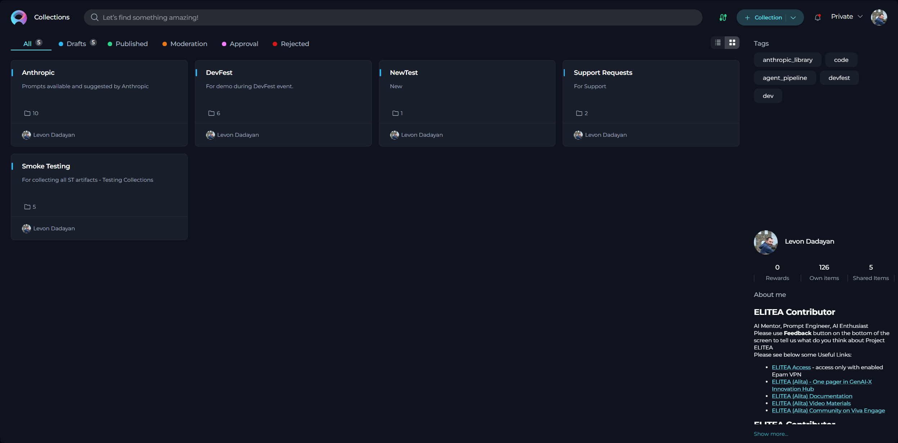
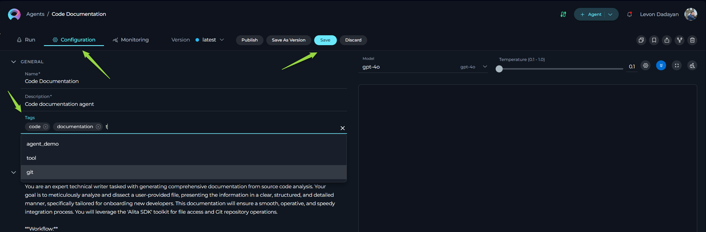
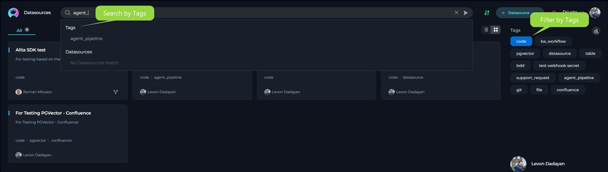
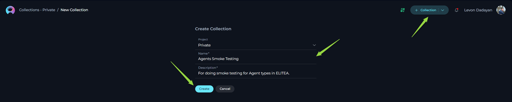
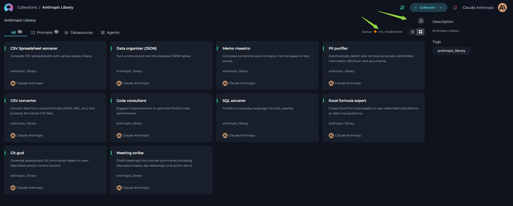
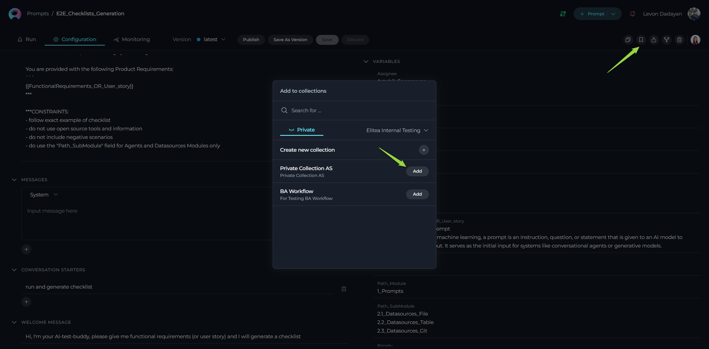
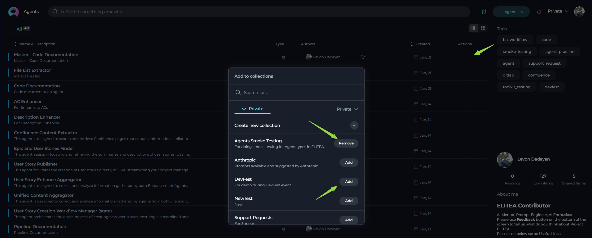

# Collections and Organizing Entities in ELITEA

## Introduction

This guide provides a comprehensive overview of **Collections** and **Tags** in ELITEA, powerful features designed to help you organize and manage your **Entities** effectively. In ELITEA, **Entities** refer to **Prompts, Datasources, and Agents** – the core building blocks of ELITEA and your AI-powered workflows. Whether you are working in your **Private** workspace, collaborating within a **Team** project, or contributing to the **Public** project, mastering these organizational tools is key to maximizing your efficiency and leveraging the full potential of ELITEA. This guide will walk you through the concepts, configuration, usage, and best practices for utilizing **Tags** and **Collections**.

**Understanding Project Scopes:**

*   **Private Workspace:** Your personal and private area within ELITEA to create and manage your Entities and Collections. Only you have access to your **Private** workspace.
*   **Team Projects:** Collaborative spaces for teams to work together on projects, sharing and managing Entities and Collections. Access to Team projects is controlled by project roles and permissions.
*   **Public Project:** A shared, community space within ELITEA where published Prompts and Collections are available for all users to discover and utilize.

## Importance of Organizing Entities in ELITEA

As you build and utilize more Entities within ELITEA, effective organization becomes paramount. Without a robust organizational system, managing a growing number of entities can become challenging, leading to:

*   **Difficulty in Finding Entities:** Spending excessive time searching for the right Prompt, Datasource, or Agent among a long, unorganized list.
*   **Reduced Efficiency:** Slower workflows and decreased productivity due to the time wasted on searching and managing entities.
*   **Inconsistent Naming and Duplication:** Lack of a clear organizational structure can lead to inconsistent naming conventions and accidental duplication of entities, creating clutter and confusion.
*   **Hindered Collaboration:** Sharing and collaborating on entities becomes difficult when they are not properly categorized and grouped, hindering team efficiency and knowledge sharing.

**Tags** and **Collections** in ELITEA directly address these challenges by providing intuitive and flexible ways to categorize, group, and manage your AI artifacts, ensuring you can quickly find, utilize, and share the resources you need, when you need them.

## Overview of Tags

In ELITEA, **Tags** are your essential tool for categorizing and labeling individual Entities. Think of tags as keywords or labels that you attach to each Entity, allowing you to create a flexible and searchable organizational system. Tags are designed to:

*   **Categorize Entities:** Assign Entities to relevant categories based on topic, function, project, team, or any other criteria that makes sense for your workflow.
*   **Improve Searchability:** Make it easy to find specific Entities by filtering and searching based on assigned tags.
*   **Enable Flexible Grouping:** Group Entities based on multiple criteria by assigning multiple tags to each item.

**Configuring Tags for Entities:**

1.  **Access Entity Configuration:** Open the configuration settings for the Entity you want to tag.
2.  **Locate "Tags" Input Box:** Within the **Configuration** tab, find the **Tags** input box.
3.  **Add Tags:**
    *   **Type a Tag Name:** Begin typing the desired tag name.
    *   **Select or Create:** Select a suggested tag or create a new one by pressing **Enter**.
4.  **Save Configuration:** Click the **Save** button to save the Entity with the selected tags.

**Note on 'code' Tag:**

The tag named `code` is reserved for integration with the Alita Code extension. If you create and assign the tag `code` to Prompts, Agents, or Datasources within your ELITEA project, it enables a special synchronization feature.

**Functionality of the `code` Tag:**

* **Alita Code Extension Connection**: When you set up the Alita Code extension and connect it to your ELITEA project, the extension will recognize and utilize Entities that are tagged with code.
* **Synchronization and Usage in Code Editor**: Entities tagged with code become accessible and usable directly within your IDE through the Alita Code extension. This allows you to seamlessly integrate your ELITEA-managed AI artifacts into your local coding workflows.

**Key Features of Tags:**

*   **Multi-Dimensional Labeling:** Assign multiple tags to each Entity for flexible categorization.
*   **Free-Form Text:** Create custom tags relevant to your specific needs.
*   **Searchable and Filterable:** Easily locate Entities using tag-based search and filtering.
*   **Visual Identification:** Tags are displayed as labels for quick identification.

**Searching and Filtering Entities by Tags:**

*   **Search by Tags:** Use the **Search** bar in any Entity menu (Prompts, Datasources, Agents) and type a tag name to filter the list.
*   **Filter by Tags:** Use the **Tags"** section in entity menus to select tags and narrow down the displayed list.

## Overview of Collections

**Collections** in ELITEA offer a higher level of organization, grouping related Entities into logical units. Collections are designed to:

*   **Group Related Entities:** Organize Entities by theme, project, or use case.
*   **Enhance Discoverability:** Improve the discoverability of related sets of Entities.
*   **Facilitate Sharing and Export:** Enable batch export and sharing of grouped Entities.
*   **Promote Thematic Organization:** Create curated sets of resources for specific topics or workflows.

**Configuration and Usage of Collections:**

**Creating Collections:**

1.  **Navigate to Collections Menu:** Access the **Collections** menu in your **Private** or **Team** project.
2.  **Create New Collection:** Click the **"+ Collection"** button.
3.  **Define Collection Details:**
    *   **Name:** Enter a descriptive **Name** for the collection.
    *   **Description:** Write a concise **Description** explaining the collection's purpose.
4.  **Create Collection:** Click **Create** to create the collection.

**Exploring Collections:**

1.  **Access Collections Menu:** Navigate to the **Collections** menu.
2.  **Open Collection:** Click on a **Collection Card** or **Name** to view its contents.
3.  **View Entities:** Explore the list of Prompts, Datasources, and Agents within the collection.
4.  **Interact with Entities:** Within a collection, you can:
    *   **View and Open Entities**
    *   **Modify Collection Details**
    *   **Filter Collection by Tags**
    *   **Publish Collection**
    *   **Delete Collection**
    *   **Export Collection**

**Filtering Entities within a Collection by Tabs and Tags:**

Within the **Collection Detail View**, you can filter Entities by **Type** using tabs and further refine the list using **Tags**:

*   **Filter by Type using Tabs:** Use the **All**, **Prompts**, **Datasources**, and **Agents** tabs to view specific entity types within the collection.
*   **Filter by Tags:** Use the **"Tags"** filter section to narrow down the displayed list to Entities with specific tags.

**Modifying a Collection:**

1.  **Open Collection Detail View:** Navigate to the Collections menu and open the desired collection.
2.  **Edit Collection Details:** Click the **"Edit" icon**.
3.  **Update Information:** Modify the **Name** and/or **Description**.
4.  **Saving Changes:** Click the **"Save"** button.

Here's the enhanced "Publishing a Collection (Public Project)" section with the added note clarifying the publishing requirements and behavior:

**Publishing a Collection (Public Project):**

1.  **Open Collection Detail View:** Navigate to the Collections menu and open the detail view of the collection you want to publish.
2.  **Review Collection Contents:** Ensure that the collection is complete, relevant, and contains **at least one published entity from that collection** before publishing the collection itself.
3.  **Publishing Collection:** Click the **"Publish collection" icon** within the collection detail view. This will submit the collection for review by ELITEA moderators.
4.  **Moderation and Approval:** The collection will be reviewed to ensure it meets ELITEA's quality and relevance guidelines. Once approved by a moderator, the collection will be published and become available in the Public project's Collections menu for community use.

**Important Notes on Publishing Collections:**

*   **Minimum Requirement - Published Entity:** **A Collection cannot be published unless it contains at least one *already published* Entity (Prompt, Datasource, or Agent).** Ensure that your collection includes at least one published entity before attempting to publish the collection itself.
*   **Separate Entity Publication is Necessary:** **Publishing a Collection does *not* automatically publish the individual entities (Prompts, Datasources, Agents) contained within it.**  If you intend to include specific entities in your published Collection in the Public project, you must **publish each of those entities *separately*** in their respective menus (Prompts, Datasources, Agents) *before* publishing the Collection.
*   **Collection Duplication in Public Project:** Publishing a Collection essentially **creates a *duplicate* of your Collection in the Public project.** This published copy will include all the *already published* entities that were part of your original Collection at the time of publishing.  Changes made to the original Collection in your Private or Team project *after* publishing will **not** automatically be reflected in the published Collection in the **Public** project.
*   **Currently Supported Entity Type for Public Collections - Prompts:**  **Currently, publishing Collections primarily focuses on sharing *Prompts* within the collection to the Public project.** While Collections can contain Datasources and Agents, the publishing mechanism for Collections is primarily designed for sharing groups of Prompts within the community.  Functionality for publishing Collections with Datasources and Agents will be expanded in future updates.

**Deleting a Collection:**

1.  **Open Collections Menu:** Navigate to the Collections menu.
2.  **Locate Collection:** Find the collection you want to delete.
3.  **Delete Collection:** Click the **Delete** icon.
4.  **Confirmation:** Confirm the deletion when prompted.

**Exporting Collections:**

1.  **Open Collection Detail View:** Navigate to the Collections menu and open the collection you want to export.
2.  **Export Collection:** Click the **Export Collection** icon.
3.  **Download JSON File:** A JSON file containing the collection data will be downloaded.

**Importing Collections:**

1.  **Import Collection:** Click the **Import** button in the Collections menu.
2.  **Select Collection File:** In the "Import Wizard," select the **JSON file** from your device.
3.  **Configure Import Options:** Choose the target project and select Entities to import.
4.  **Start Import:** Click the **"Import"** button.
5.  **Locate Imported Entities:** Find imported Entities in their respective menus (Prompts, Datasources, Agents).

**Important Note on Collection Entity Recreation:** The Collection entity itself is not automatically recreated during import.

For more information about importing collections and entities, please refer to the [Export and Import Guide](../feature-guides/core-features/export-import.md).

### How to Add an Entity to a Collection

ELITEA offers a convenient way to add Prompts, Datasources, and Agents to your Collections, allowing you to build and curate your organized sets of entities efficiently.

**Adding Entities from within the Entity Menus (Prompts, Datasources, Agents)**

To add Entities to Collections from the Prompts, Datasources, or Agents menus as you are browsing or managing your individual entities.

1.  **Navigate to Entity Menu:** Go to the **Prompts**, **Datasources**, or **Agents** menu, depending on the type of entity you want to add to a Collection.
2.  **Locate the Entity to Add:** Find the specific Entity (Prompt, Datasource, or Agent) that you want to add to a Collection within the list. ELITEA offers two view options, and the process is similar in both:
    *   **Card list view**: If you are viewing your entities in a card format, locate the desired entity card.
    *   **Table view**: If you are viewing your entities in a table format, locate the entity you want to add in the list.
3.  **To add entity to collection**  For the chosen Entity, locate and click the **Bookmark** icon.
    *   **Card list view**: On the top right corner of the Entity's card.

        

    *   **Table view**: In the **Actions** column, which is usually the last column in the table, click on the ellipsis icon (`...`) next to the entity. A dropdown menu will appear. Hover over or click on the **"Add to collection"** option.

        

4.  **Select Target Collection:** After clicking the Bookmark icon, a pop-up window will appear, displaying a list of your existing Collections.
    *   **Choose a Collection:** Select the **Collection** to which you want to add the current Entity from the list.
5.  **Entity Added to Collection:** Once you select a Collection, the Entity will be automatically added to that Collection.

## Best Practices and Examples: Organizing Entities in ELITEA

Effective organization with **Tags** and **Collections** is crucial for managing your AI assets in ELITEA. Here are some best practices and examples to guide you:

**Tagging Strategies:**

*   **Tag by Topic or Subject Area:** Examples: `#UserStories`, `#CodeDocumentation`, `#CompetitiveAnalysis`.
*   **Tag by Function or Purpose:** Examples: `#Drafting`, `#Summarization`, `#DataRetrieval`.
*   **Tag by Project or Team:** Examples: `#ProjectAlpha`, `#TeamBeta`, `#MarketingDepartment`.
*   **Tag by User Skill Level:** Examples: `#BeginnerFriendly`, `#AdvancedUsers`.
*   **Maintain Consistency:** Establish and document a consistent tagging system.
*   **Combine General and Specific Tags:** Use a mix of tag granularity for effective categorization.

**Example Tagging Scenarios:**

*   **Prompt: "Draft User Story for Checkout Feature"**: Tags: `#UserStories`, `#Jira`, `#Drafting`, `#BeginnerFriendly`, `#ProjectAlpha`.
*   **Agent: "Confluence Page Publisher"**: Tags: `#Confluence`, `#Publishing`, `#Documentation`, `#TeamBeta`.
*   **Datasource: "Competitor Pricing Data - Web Scraper"**: Tags: `#CompetitiveAnalysis`, `#DataRetrieval`, `#MarketingDepartment`.

**Collection Strategies:**

*   **Group by Use Case or Workflow:** Example: "User Story Management Toolkit."
*   **Group by Project or Client:** Example: "Project Alpha - AI Assets Collection."
*   **Group by Theme or Topic:** Example: "Code Documentation Prompts Collection."
*   **Create "Starter Kits" or Template Collections:** Develop template collections for common tasks.
*   **Curate "Best Practices" Collections:** Share collections showcasing best practices within your organization.

**Example Collection Scenarios:**

*   **Collection: "User Story Management Toolkit"**: Contains Prompts, Agents, and Datasources for user story management.
*   **Collection: "Code Documentation Automation"**: Contains Prompts and Agents for code documentation.
*   **Collection: "Marketing Content Generation - Social Media"**: Contains Prompts and Datasources for social media marketing content.

**Combining Tags and Collections for Optimal Organization:**

*   **Collections for High-Level Grouping:** Use Collections as thematic folders.
*   **Tags for Granular Filtering:** Use Tags for detailed categorization within Collections.
*   **Example:** "Marketing Content Generation" Collection with tags like `#SocialMedia`, `#BlogPosts`, `#EmailMarketing`.

## Useful Links and Materials

To further expand your knowledge and skills in organizing Entities and utilizing Collections within ELITEA, here are some helpful resources:

*   **[Collections Menu](../platform-documentation/menus/collections.md)**:  Access the dedicated Collections Menu Guide for a comprehensive walkthrough of the Collections menu interface, features, and functionalities within ELITEA.
*   **[ELITEA Public Project Guide](../feature-guides/core-features/public-project.md)**:  Explore the ELITEA Public Project to discover and utilize community-shared Prompts and Collections. Learn more about the purpose and guidelines of the Public project.
*   **[Publishing Prompts and Collections Guide](../platform-documentation/menus/publishing.md)**:  Consult this guide for step-by-step instructions and best practices on publishing your Prompts and Collections to the ELITEA Public Project, making them available to the wider community.
*   **[Export and Import Guide](../feature-guides/core-features/export-import.md)**:  Refer to the detailed Export and Import Guide for in-depth instructions on exporting and importing individual Entities and entire Collections within ELITEA.
