# Individual User Credentials for Shared Toolkits

## Overview

This guide explains how to set up toolkits in team projects so each user operates with their own personal credentials instead of shared project credentials. This approach enhances security, improves auditing, and ensures actions are traceable to individual users.

### Key Benefits

- **Enhanced Security**: Each user operates with their own credentials
- **Better Auditing**: Actions are traceable to individual users
- **Granular Access Control**: Users maintain their specific permission levels
- **Compliance**: Meets security requirements for individual accountability

## Quick Start: The Main Concept

### The Challenge

When creating toolkits in project space with project credentials:

- All users share the same credentials.
- Actions appear under a single account.
- It's difficult to audit individual user actions.
- Potential security and compliance issues.

### The Solution: Private Credential Variables
By using private credentials with matching IDs, you can create a system where each user's private credentials are automatically used when they execute the toolkit.

**How it works:**

- Team agrees on a common credential ID (e.g., "github-team-access").
- Each user creates private credentials with that exact ID.
- Toolkit creator configures the project toolkit to reference a private credential with that common ID.
- When users execute the toolkit, the system resolves the reference to their individual private credentials and uses them for execution.

## Understanding Credential Types

### Project Credentials vs Private Credentials

**Project Credentials:**
- Created and stored at the project level
- Accessible to all project members (based on their role permissions)
- Shared across the entire project team
- Identified by a briefcase icon (💼) in the interface

**Private Credentials:**
- Created and stored in individual user's private workspace
- Only accessible to the credential owner
- Cannot be shared with other users
- Identified by a human icon (👤) in the interface

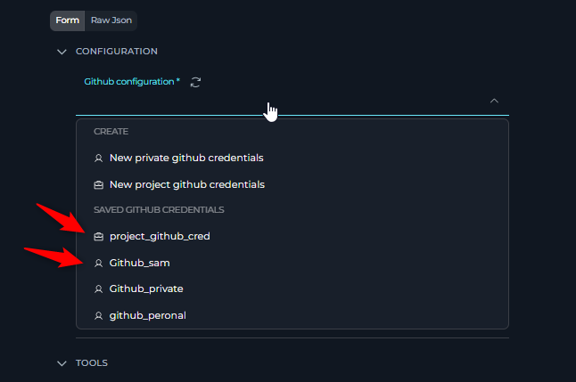

### Methods to Create Credentials

#### Creating Project Credentials

1. **From Credentials Page:**
   - Navigate to Settings → Credentials
   - Select the target project from the project dropdown
   - Create new credentials (will be stored as project credentials)

   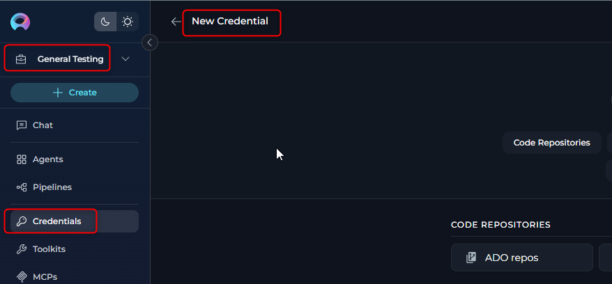

2. **From Toolkit Configuration:**
   - While configuring a toolkit in a project
   - Select "New project credential" from the credential dropdown

   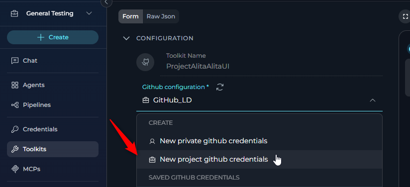

#### Creating Private Credentials

1. **From Private Project Credentials Page:**
   - Navigate to your private workspace
   - Go to Settings → Credentials
   - Create credentials (automatically stored as private)

2. **From Toolkit Configuration:**
   - While configuring a toolkit (even in a project context)
   - Select "New private credential" from the credential dropdown

   

## Credential Names and IDs

### Understanding the Distinction

When creating credentials, you'll notice two important fields:

- **Credential Name**: A human-readable display name
- **Credential ID**: A unique identifier (usually lowercase, same as the name initially)

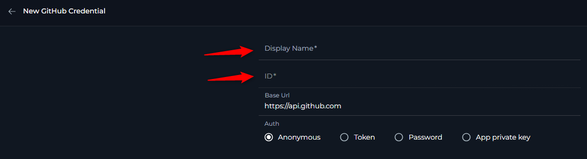

!!! important "Key Differences"
    - **Name**: Can be descriptive and user-friendly (e.g., "GitHub Integration Token")
    - **ID**: Must be unique within the scope and is used for programmatic references (e.g., "github_integration_token")

### ID and Name Mismatch

#### Automatic ID Generation
When the credential name contains spaces and capital letters, the ID will be automatically created with lowercase letters and spaces replaced with underscores.

**Example:**
- **Name**: "GitHub Integration Token"  
- **Generated ID**: "github_integration_token"

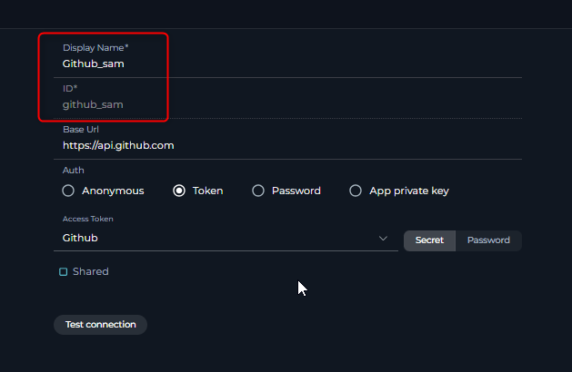

#### ID Collision Handling
In cases where a credential ID already exists in the project:

1. An error message will appear during save
2. The ID field will become editable and you can modify the **ID** while keeping the same **Name**

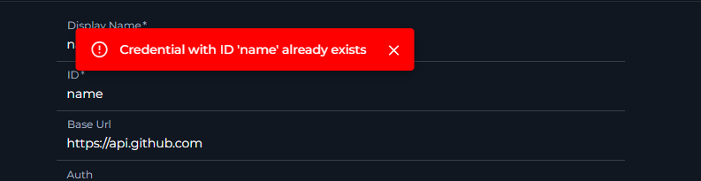

## Credential Type Visibility

### Context-Dependent Options

The available credential options depend on your current workspace context:

#### In Private Workspace
- **Only private credentials** are available for toolkit creation
- No other users can access toolkits created in private workspace

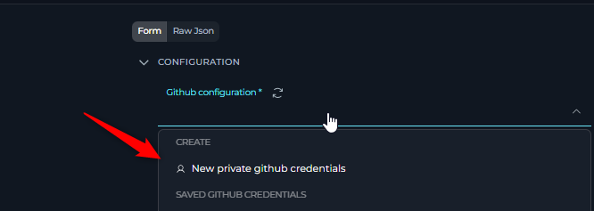

#### In Project Workspace
- **Project credentials** available to all project members
- **Private credentials** of the current user
- Filtered by toolkit type (e.g., only GitHub credentials for GitHub toolkit)

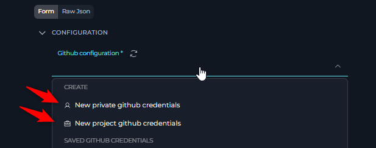

### Credential Type Indicators

- 💼 **Briefcase Icon**: Project credentials
- 👤 **Human Icon**: Private credentials

## Step-by-Step Implementation

### Prerequisites

1. **All team members must create private credentials with identical ID values**
2. **Credential names can differ, but IDs must match exactly**
3. **Each user must have appropriate access to the target service**

### Implementation Steps

**Step 1: Coordinate Credential ID**
Team members agree on a common credential ID (e.g., "github-team-access")

**Step 2: Each User Creates Private Credentials**
Every team member creates their private credentials with the agreed-upon ID:

**Step 3: Toolkit Creator Configures Project Toolkit**
The toolkit creator selects a private credential with the common ID:

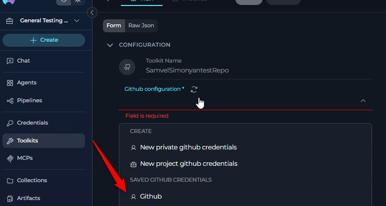

**Step 4: Variable Resolution**
When any user executes the toolkit, the system automatically resolves to their private credentials with the matching ID.

### How It Works

The private credential selection acts as a **variable reference**:

1. User initiates toolkit execution
2. System looks for private credentials in user's workspace with matching ID
3. If found, uses the user's private credentials
4. If not found, toolkit becomes unavailable.
  
  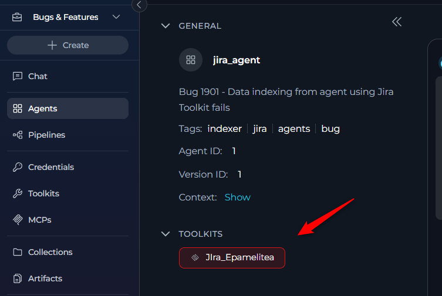

## Troubleshooting

### Toolkit Appears unavailable

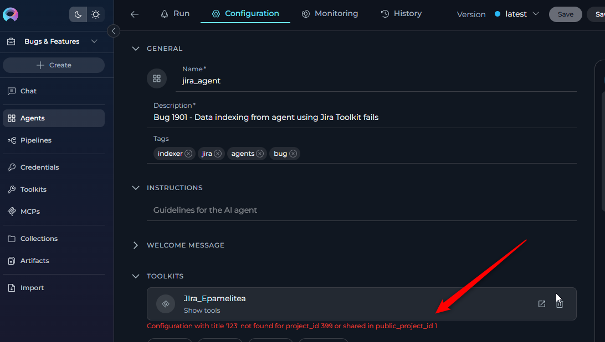
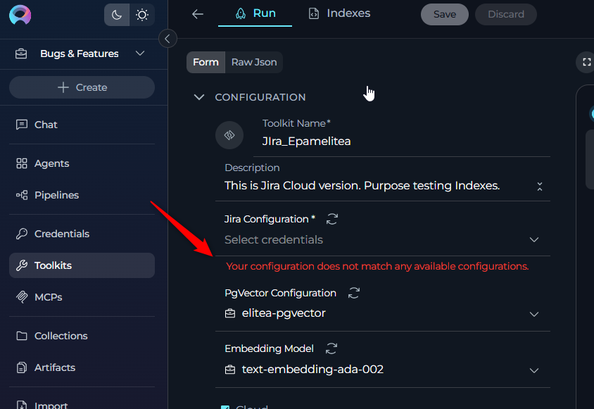

**Problem:** Toolkit has following signes( red outline or error message ) for a specific user.

**Cause:** The user doesn't have private credentials with the required ID.

**Solution:**

1. User must create private credentials in their private workspace
2. Ensure the credential ID matches exactly

### Execution Error: Credentials Missing

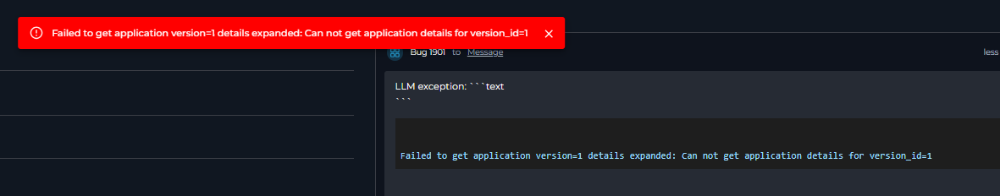

**Problem:** Error during agent or toolkit execution stating credentials are missing.

**Cause:** The private credential ID referenced by the toolkit doesn't exist in the executor's private workspace.

**Solution:**

1. Check the exact credential ID required by the toolkit
2. Create private credentials with matching ID
3. Ensure credentials are properly configured and saved

### Toolkit Not Recognizing Private Credentials

**Problem:** User has private credentials with the correct name, but toolkit still appears as read-only.

**Cause:** Credential names match, but IDs are different.

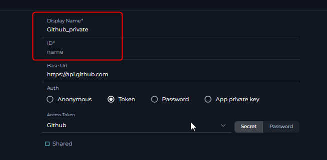

**Solution:**

1. Verify the credential **ID** (not name) matches exactly
2. Edit existing credentials to update the ID field
3. Ensure ID is lowercase and matches the expected format

## Limitations and Considerations

!!! warning "Important Limitations"
    - Only toolkits that use credentials can leverage this functionality
    - Toolkits without credential requirements cannot use user-specific credentials
   

### Service-Specific Considerations

Different services may have varying requirements:
- **API Rate Limits**: Individual credentials may have separate rate limits
- **Permission Models**: Ensure all users have necessary permissions
- **Account Types**: Some services distinguish between personal and organizational accounts

## FAQ

**Q: Can I use this approach with any toolkit?**
**A:** No, only toolkits that require credentials can use this functionality. Toolkits without credential requirements cannot leverage user-specific credentials. List of the toolkits can be found on following page [How to Use Credentials](./how-to-use-credentials.md)

**Q: What happens if a user doesn't have the required private credentials?**
**A:** The toolkit will appear as without credentials for that user, and they won't be able to execute it until they create the necessary private credentials.

**Q: Do credential names need to match exactly?**
**A:** No, credential names can be different. Only the credential **IDs** need to match exactly (case-sensitive).

**Q: Can I mix project and private credentials in the same toolkit?**
**A:** A toolkit can only use one credential configuration. You either use project credentials (shared) or private credentials (user-specific), but not both simultaneously.

**Q: How do I know what credential ID is required?**
**A:** The toolkit creator should document the required credential ID, or you can check the toolkit configuration if you have appropriate permissions.

**Q: Can I change the credential ID after creating the toolkit?**
**A:** Yes, you can edit the toolkit configuration to update the credential reference, but all team members will need to update their private credentials accordingly.

## Related Documentation

- [How to Use Credentials](./how-to-use-credentials.md)
- [Credentials Management](../../menus/credentials.md)
- [About Toolkits](../../menus/toolkits.md)
- [Security Best Practices](../../menus/settings/secrets.md)