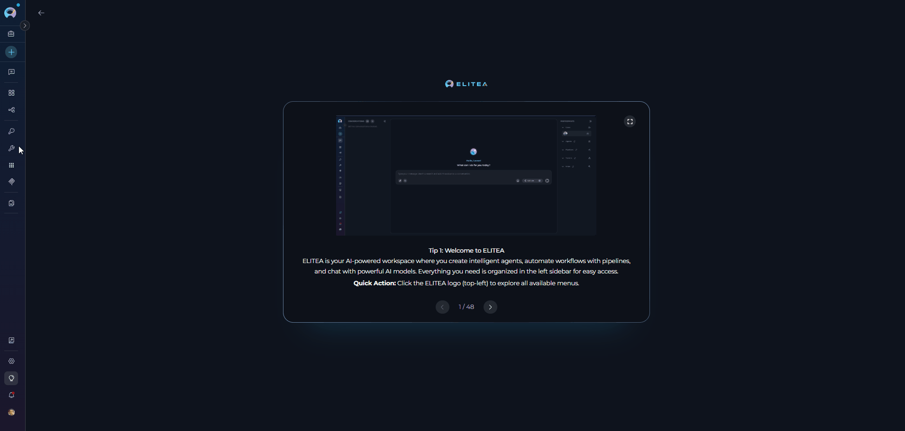
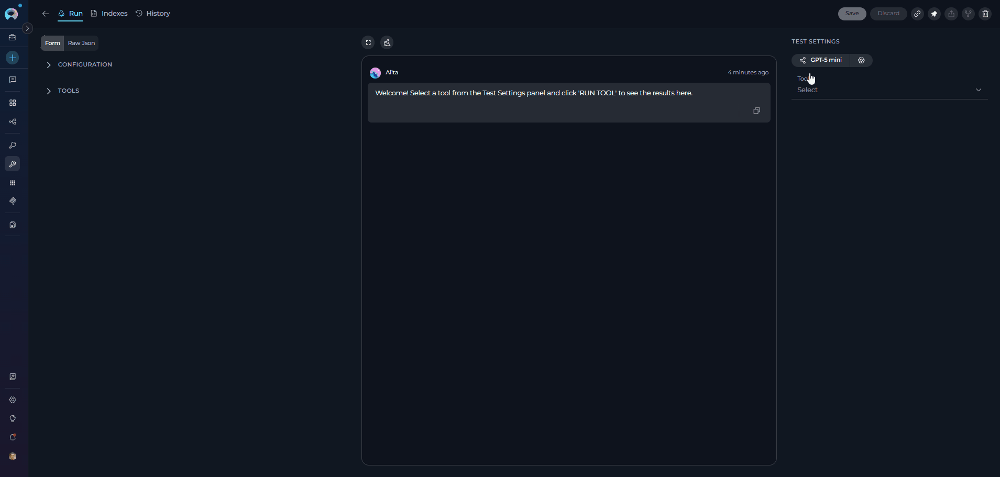
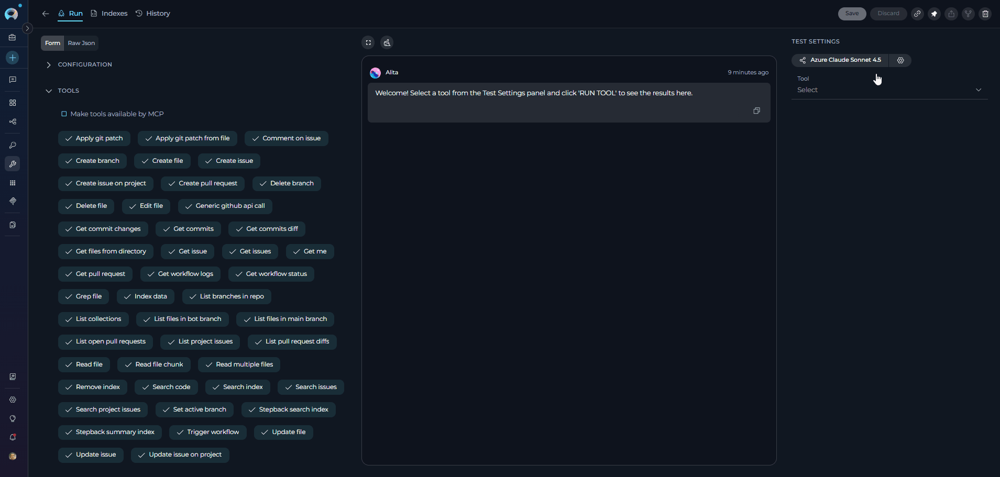
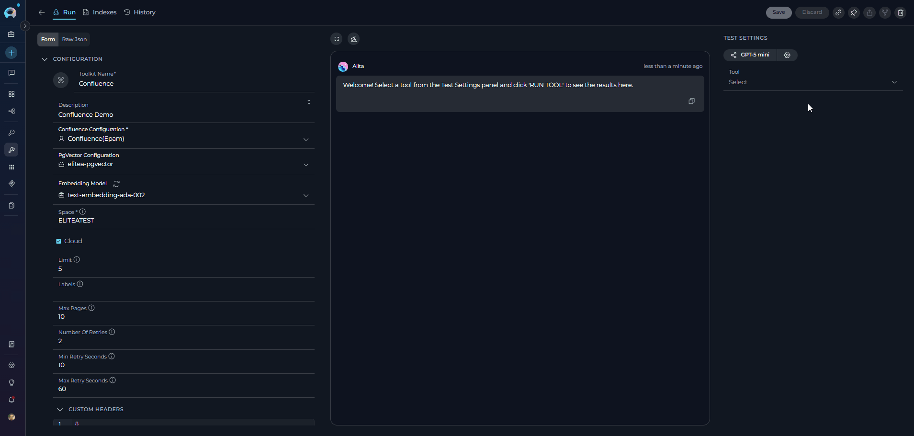

# How to Test Toolkit Tools

## Overview

The **Test Settings** panel provides a powerful interface for testing toolkit tools directly from the Toolkit detailed page. This feature allows you to validate toolkit functionality, verify credentials, test tool parameters, and ensure proper integration before using toolkits in agents or conversations.

Testing toolkit tools is an essential step in the toolkit configuration workflow, enabling you to:

* **Verify Credentials**: Confirm that authentication credentials are correctly configured
* **Validate Tool Functionality**: Test individual tools with real parameters
* **Debug Tool Behavior**: Understand how tools respond to different inputs
* **Preview Tool Outputs**: See actual responses before integrating with agents
* **Optimize Parameters**: Fine-tune tool settings and parameters for your use case

---

## Accessing the Test Settings Panel

The Test Settings panel is located on the right side of the Toolkit detailed page and is available for all configured toolkits.

**How to Access:**

1. **Navigate to Toolkits**: Go to **Toolkits** from the main navigation
2. **Select a Toolkit**: Click on any configured toolkit from the list
3. **View Test Settings**: The Test Settings panel appears on the right side of the page



---

## Test Settings Interface Components

The Test Settings panel consists of several key components that work together to enable comprehensive tool testing:

### 1. Model Selection

Choose the Large Language Model (LLM) that will be used to execute the tool test.

* **Model Dropdown**: Select from available LLM models configured in your project
* **Default Selection**: The system selects your project's default model automatically
* **Model Options**: Displays model names (e.g., `gpt-4o`, `gpt-4o-mini`, `claude-3-5-sonnet`)



### 2. Model Settings 

Fine-tune how the selected model generates responses using these controls. Click the **Model Settings** icon (⚙️) next to the model selector to access these settings. The available settings vary depending on the selected model:

**For Reasoning Models** (e.g., `o3-mini`, `o1`):

| Parameter | Levels | Description | Best Practices |
|-----------|--------|-------------|----------------|
| **Reasoning** | Low / Medium / High | Controls the depth of logical thinking and problem-solving | **Low**: Fast, surface-level reasoning with concise answers and minimal steps<br>**Medium** (default): Balanced reasoning with clear explanations and moderate multi-step thinking<br>**High**: Deep, thorough reasoning with detailed step-by-step analysis (may be slower) |
| **Max Completion Tokens** | Auto / Custom | Limits the maximum length of AI responses measured in tokens (roughly 4 characters per token) | **Auto** (default): System automatically sets the token limit to 4096 tokens<br>**Custom**: Manually set a specific token limit for responses |

**For Standard Models** (e.g., `gpt-4o`, `gpt-4o-mini`, `claude-3-5-sonnet`):

| Parameter | Range | Description | Best Practices |
|-----------|-------|-------------|----------------|
| **Creativity** | 1 - 5 | Controls response randomness and creativity (maps to temperature internally) | **1 (Low - 0.2)**: Highly focused and deterministic outputs<br>**2 (Mid-Low - 0.4)**: Mostly focused with slight variation<br>**3 (Medium - 0.6)** (default): Balanced between focus and creativity<br>**4 (Mid-High - 0.8)**: More varied and creative responses<br>**5 (High - 1.0)**: Maximum creativity and diversity |
| **Max Completion Tokens** | Auto / Custom | Limits the maximum length of AI responses measured in tokens (roughly 4 characters per token) | **Auto** (default): System automatically sets the token limit to 4096 tokens<br>**Custom**: Manually set a specific token limit for responses |


!!! tip "Recommended Settings for Testing"
    For toolkit tool testing, we recommend:
    
    **For Standard Models:**
    * **Creativity**: 1 or 2 (for consistent, predictable results)
    * **Max Completion Tokens**: Auto mode or 1024-4096 (sufficient for most tool responses)
    
    **For Reasoning Models:**
    * **Reasoning**: Medium (balanced approach for testing)
    * **Max Completion Tokens**: Auto mode (ensures adequate response length)

### 3. Tool Selection

Choose which specific tool from your toolkit you want to test.

* **Tool Dropdown**: Lists all available and enabled tools in the current toolkit
* **Search Functionality**: Type to filter available tools by name
* **Tool Grouping**: Tools are organized by their functionality type
* **Enabled Tools Only**: Only shows tools that are enabled in the toolkit configuration



!!! note "Testing Index-Related Tools"
    For testing index-related tools (such as `index_data` and `search_index`), it is recommended to use the **[Indexes](../indexing/using-indexes-tab-interface.md)** tab instead of the Test Settings panel. The Indexes tab provides a dedicated interface with specialized features for managing and testing indexing operations, including progress tracking, index management, and search result visualization.

**Tool Parameters**

After selecting a tool, the Test Settings panel dynamically displays the required and optional parameters for that specific tool.

**Parameter Field Types:**

| Field Type | Description | Examples |
|------------|-------------|----------|
| **Text Fields** | For string inputs | Repository names, URLs |
| **Number Fields** | For numeric inputs | Limits, IDs |
| **Dropdown Selects** | For predefined choices | Status values |
| **Boolean Checkboxes** | For true/false options | Include archived |
| **Array Fields** | For multiple values | List of labels, file extensions |
| **Object Fields** | For complex structured data | JSON configurations |

**Field Indicators:**

| Indicator | Description |
|-----------|-------------|
| **Required Fields** | Marked with an asterisk (*) and must be filled before testing |
| **Optional Fields** | Can be left empty; the tool will use default values |
| **Default Values** | Pre-populated fields show the tool's default setting |
| **Field Descriptions** | Hover over field labels for detailed parameter information |

---

## How to Test a Toolkit Tool

Follow this workflow to test any tool from your configured toolkit:

1. **Select Model** → Choose your LLM model and optionally adjust settings (Creativity/Reasoning, Max Tokens)
2. **Select Tool** → Pick the specific tool you want to test from the dropdown
3. **Configure Parameters** → Fill in required fields (*) and optional parameters as needed
4. **Run Tool** → Click the **RUN TOOL** button to execute
5. **Review Results** → Examine the tool output in the chat interface



---

### Understanding Test Results

Test results are displayed in a chat-style interface in real-time as the tool executes. The interface uses socket-based communication to provide live feedback during tool execution.

You'll see detailed information about:

* **Tool Name**: The specific tool being executed
* **Parameters**: The input values passed to the tool
* **Execution Time**: How long the operation took
* **Status**: Whether the operation succeeded or failed
* **Output**: The complete response from the tool

**Result Display Format:**

Each test execution shows:

1. **Execution Request** - Displays the tool name and parameters being tested
2. **Tool Execution Status** - Real-time status indicator with execution time  
3. **Tool Output** - The actual result returned by the tool

**Tool Execution Summary:**

At the top of each result, you'll see a status line showing:

```
✅ `tool_name` (0.523s) 
```

or in case of error:

```
❌ `tool_name` (0.234s)
```

**Status Indicators:**

| Symbol | Meaning |
|--------|---------|
| ✅ | Tool executed successfully |
| ❌ | Tool execution failed or encountered an error |
| 🔄 | Tool is currently executing |

**Execution Time:** The number in parentheses shows how long the tool took to execute (in seconds).

**Tool Output Format:**

The tool output is displayed as formatted JSON or text depending on what the tool returns:


---

## Advanced Testing Features

**Chat History and Multiple Tests**

The test interface maintains a conversation history, allowing you to:

* **Review Previous Tests**: Scroll through past test executions
* **Compare Results**: See how different parameters affect tool outputs
* **Track Changes**: Monitor how tool behavior changes after configuration updates

!!! note "Session-Based History"
    The chat history and test results are only available during your current session. If you navigate away from the toolkit page or refresh the browser, all test history will be cleared. To preserve important test results, use the copy functionality to save them externally before leaving the page.

**Clear Chat History:**

* Click the **Clear** (trash) icon at the top of the chat interface
* This removes all previous test results and starts fresh

**Copy Options**

The test interface provides flexible copy functionality for reusing test results:

**Copy Entire Message:**

* Click the **Copy** icon on any message in the chat history
* Copies the complete message content including tool outputs, error messages, or responses
* Useful for sharing test results, reporting issues, or documenting tool behavior

**Copy Code Blocks:**

* Hover over any code block in the test results to reveal the toolbar
* Click the **Copy code** button (clipboard icon) in the top-right corner of the code block
* Copies only the code content without syntax highlighting or formatting
* Ideal for extracting JSON responses, code snippets, or specific output sections

**Language Display in Code Blocks**

Code blocks in test results automatically display with syntax highlighting based on the detected or specified language:

**Automatic Language Detection:**

* JSON responses are automatically highlighted with JSON syntax
* Python, JavaScript, and other code outputs use appropriate syntax highlighting
* The language is detected from the content structure or tool response format

**Language Indicator:**

* The detected language is shown in the code block rendering
* Common languages displayed include: `json`, `python`, `javascript`, `bash`, `xml`, `yaml`, and more
* Syntax highlighting makes it easier to read structured data, error traces, and code outputs

**Fullscreen Mode**

For detailed result analysis:

1. Click the **Fullscreen** icon at the top of the chat interface
2. The test results expand to fill the entire screen
3. Click the fullscreen icon again (or press ESC) to return to normal view

This is particularly useful when:

* Examining large JSON responses
* Analyzing complex tool outputs
* Comparing multiple test results side-by-side

---

## Common Testing Scenarios

??? example "Scenario 1: Testing GitHub Create Branch"
    **Objective**: Verify that your GitHub credential can create a new branch in a repository

    **Steps:**

    1. **Select Model**: `GPT-5`
    2. **Select Tool**: `create_branch`
    3. **Configure Parameters**:
         * `branch_name`: `feature/test-branch`
    4. **Run Tool**: Click RUN TOOL
    5. **Verify Result**: Confirm that the new branch was created successfully

    **Expected Result**: JSON response confirming branch creation with branch name, commit SHA, and reference details.

??? example "Scenario 2: Testing Jira Issue Creation"
    **Objective**: Test creating a new Jira issue with your configured credentials

    **Steps:**

    1. **Select Model**: `GPT-5.1`
    2. **Select Tool**: `create_issue`
    3. **Configure Parameters**:
         `Issue Json *`:  
    {
      "fields": {
        "project": {
          "key": "EL"
        },
        "summary": "Test issue from ELITEA toolkit",
        "issuetype": {
          "name": "Task"
        },
        "description": {
          "type": "doc",
          "version": 1,
          "content": [
            {
              "type": "paragraph",
              "content": [
                {
                  "type": "text",
                  "text": "This is a test issue created via toolkit testing"
                }
              ]
            }
          ]
        }
      }
    }
         ```
    4. **Run Tool**: Click RUN TOOL
    5. **Verify Result**: Check that the issue was created and the response includes the issue key

    **Expected Result**: Success response with the newly created issue key (e.g., `DEMO-123`).

??? example "Scenario 3: Testing Confluence Page Creation"
    **Objective**: Verify that your Confluence credential can create a new page in your workspace

    **Steps:**

    1. **Select Model**: `GPT-5-mini`
    2. **Select Tool**: `create_page`
    3. **Configure Parameters**:
         * `title *`: `Test Page from ELITEA`
         * `body *`: `This is a test page created via toolkit testing to verify Confluence integration.`
         * `space`: `DEMO` (your Confluence space key)
         * `status`: `current` (to publish immediately) or `draft`
         * `representation`: `storage` (for HTML content)
    4. **Run Tool**: Click RUN TOOL
    5. **Verify Result**: Confirm that the page was created and check the returned page ID

    **Expected Result**: JSON response with page details including page ID, title, space key, and creation timestamp.

    !!! tip "Confluence Content Format"
        - Use `representation: storage` for HTML content (e.g., `<p>content</p>`)
        - Use `representation: wiki` for Markdown content
        - For testing, start with simple HTML to ensure basic connectivity works

---

## Testing Tools vs. Using in Agents

Understanding the differences between testing tools and using them in agents helps set appropriate expectations:

| Aspect | Tool Testing | Agent Usage |
|--------|--------------|-------------|
| **Execution Context** | Direct tool call with explicit parameters | Agent decides when and how to call tools based on conversation |
| **Parameter Source** | Manually provided by you | Extracted from conversation by the LLM |
| **Error Handling** | Immediate error feedback | Agent may retry or request clarification |
| **Output Format** | Raw tool output (usually JSON) | Natural language interpretation by agent |
| **Execution Flow** | Single tool execution | May involve multiple tool calls in sequence |
| **User Interaction** | One-time test | Ongoing conversation with context |

**Key Takeaway**: Successful tool testing validates that the tool works correctly with proper parameters. In agent usage, the LLM determines when to call tools and how to extract parameters from natural language conversations.

---


## Troubleshooting

??? warning "Authentication Errors"
    **Problem**: `401 Unauthorized` or `403 Forbidden` errors

    **Solutions:**

    * **Verify Credentials**: Check that credentials are correctly configured in Settings → Credentials
    * **Check Permissions**: Ensure the credential has necessary permissions for the tool
    * **Refresh Tokens**: Update expired tokens or API keys
    * **Test Connectivity**: Verify network access to the external service

??? warning "Parameter Validation Errors"
    **Problem**: `Invalid parameter` or `Required field missing` errors

    **Solutions:**

    * **Review Required Fields**: Ensure all fields marked with (*) are filled
    * **Check Data Types**: Verify that values match expected types (string, number, array, etc.)
    * **Validate Formats**: Ensure data formats are correct (e.g., valid JSON for object fields)
    * **Review Field Descriptions**: Hover over field labels for parameter requirements

??? warning "Connection Timeouts"
    **Problem**: Tool execution times out without response

    **Solutions:**

    * **Check Service Status**: Verify the external service is operational
    * **Network Connectivity**: Ensure network access to the service URL
    * **Firewall Rules**: Check if firewalls are blocking connections
    * **Service URLs**: Verify endpoint URLs are correct in toolkit configuration

??? warning "Tool Not Found Errors"
    **Problem**: Selected tool doesn't execute or shows as unavailable

    **Solutions:**

    * **Enable Tool**: Ensure the tool is checked in toolkit configuration
    * **Save Configuration**: Save toolkit changes before testing
    * **Refresh Page**: Reload the toolkit page to update available tools
    * **Check Tool Selection**: Verify the tool is supported for the toolkit type

??? warning "Model Configuration Issues"
    **Problem**: LLM model errors or unavailable models

    **Solutions:**

    * **Select Valid Model**: Choose a model configured in your project
    * **Check Model Access**: Verify you have access to the selected model
    * **Review Model Settings**: Ensure model parameters are within valid ranges
    * **Use Default Model**: Try testing with the project's default model first

---

## Best Practices

??? tip "Before Production Use"
    1. **Test All Critical Tools**: Verify each tool you plan to use in agents or conversations
    2. **Validate with Real Data**: Test with actual data you'll be working with
    3. **Check Error Handling**: Test tools with invalid inputs to understand error responses
    4. **Document Results**: Keep notes on successful parameter combinations
    5. **Test After Updates**: Re-test tools after updating credentials or configuration

??? tip "Parameter Testing Strategy"
    1. **Start with Defaults**: Begin testing with default parameter values and default model settings
    2. **Test Required Fields Only**: First test with just required parameters
    3. **Add Optional Parameters**: Gradually add optional parameters to understand their impact
    4. **Test Edge Cases**: Try boundary values (empty strings, maximum limits, etc.)
    5. **Validate Complex Inputs**: Carefully test tools requiring JSON or complex objects
    6. **Adjust Model Settings**: Fine-tune Creativity/Reasoning and token limits based on tool requirements

??? tip "Performance Testing"
    1. **Monitor Execution Times**: Note how long different tools take to execute
    2. **Test with Different Models**: Compare performance across different LLM models
    3. **Adjust Timeouts**: Configure appropriate timeout values based on tool performance
    4. **Test Under Load**: Consider how tools perform with larger datasets or parameters

??? tip "Security Testing"
    1. **Test Permission Boundaries**: Verify tools respect credential permissions
    2. **Validate Data Access**: Ensure tools only access authorized data
    3. **Check Sensitive Data**: Confirm sensitive information is properly handled
    4. **Test Error Messages**: Verify error messages don't expose sensitive information

---

!!! related "Related Resources"
    For more information on toolkit configuration and usage:

    * **[Toolkits Menu](../../menus/toolkits.md)** — Complete guide to toolkit management and configuration
    * **[Create a Credential](../../getting-started/create-credential.md)** — How to configure authentication credentials
    * **[AI Configuration](../../menus/settings/ai-configuration.md)** — Set up LLM models and embedding configurations
    * **[Agents Menu](../../menus/agents.md)** — Create agents that use your tested toolkits
    * **[Chat Menu](../../menus/chat.md)** — Use toolkits in conversations
    * **[Indexing Overview](../indexing/indexing-overview.md)** — Learn about indexing tools and data processing

---
