# Credentials User Guide

## Introduction

This user guide provides a comprehensive overview of the **Credentials** feature in ELITEA and how to use these credentials when configuring toolkits. The Credentials feature enables secure authentication with external platforms, streamlining workflows and enhancing collaboration across different tools.

The ability to manage authentication credentials centrally within ELITEA offers significant benefits, including:

* **Enhanced Security:** Store sensitive authentication information like API keys, tokens, and passwords securely using ELITEA's credential management system.
* **Centralized Management:** Manage authentication details for various external services from a single location within ELITEA, simplifying administration and improving visibility.
* **Reusability:** Create reusable credentials that can be easily applied to multiple Agent toolkits, saving time and effort.
* **Flexibility:** Configure credentials at different levels (personal or project-specific) to meet various security and access requirements.

This guide will detail the process of creating and managing Credentials, along with best practices and practical use cases to help you effectively leverage this feature. 

**Important Note:**

In ELITEA, your work is organized within three distinct types of spaces:

* **Private Workspace:** This is your personal area within ELITEA. You have exclusive access to all the content you create and manage here. Think of it as your individual sandbox where you can experiment and build your AI solutions. This includes your personal Chats, Agents, Prompts, Datasources, Collections, Artifacts, and Credentials.
* **Team Project:** These are collaborative spaces where multiple users are added as team members. Within a Team project, all members have access to the project's content, fostering collaboration and shared development. This shared content includes Chats, Agents, Prompts, Datasources, Collections, Artifacts, and Credentials that belong to that specific project.
* **Public Project:** This space allows you to engage with the wider ELITEA community and explore content shared by other users. This shared content includes Chats, Agents, Prompts, Datasources, and Collections.

Understanding the distinction between your **Private Workspace**, where you have exclusive access to your credentials, and **Team Projects**, which are collaborative spaces where team members can share access to project credentials, is crucial for effectively managing **Credentials** within ELITEA.

## Credentials Feature: Secure Authentication Management

The **Credentials** menu in ELITEA serves as a centralized hub for securely managing authentication details needed to connect your toolkits to external services. By configuring credentials, you make these external services available for use within your toolkits with proper authentication.

**Key Aspects of the Credentials Feature:**

* **Centralized Authentication Management:** The Credentials menu provides a single point of control for managing authentication details for various external services.
* **Supported Platforms:** ELITEA currently supports credentials for multiple platforms:

| Platform | Description | Authentication Methods |
|----------|-------------|----------------------|
| **[ADO (Azure DevOps)](#ado-azure-devops-credential-setup)** | Microsoft Azure DevOps platform | Personal Access Token |
| **[ADO Repos](#ado-repos-credential-setup)** | Azure DevOps repository integration | ADO Configuration reference |
| **[Bitbucket](#bitbucket-credential-setup)** | Git repository hosting service | Username/Password |
| **[Browser](#browser-credential-setup)** | Web automation, browser testing | Google API Key, Search Engine ID |
| **[Carrier](#carrier-credential-setup)** | Communication services, messaging | Private Token |
| **[Confluence](#confluence-credential-setup)** | Atlassian knowledge management | Basic Auth, Bearer Token |
| **[Figma](#figma-credential-setup)** | Design collaboration platform | Personal Access Token, OAuth2 |
| **[GitHub](#github-credential-setup)** | Git repository hosting service | Token, Password, App Private Key, Anonymous |
| **[GitLab](#gitlab-credential-setup)** | Git repository and DevOps platform | Private Token |
| **[Google Places](#google-places-credential-setup)** | Location services, mapping APIs | API Key |
| **[Jira](#jira-credential-setup)** | Atlassian project management | Basic Auth, Bearer Token |
| **[Postman](#postman-credential-setup)** | API development platform | API Key |
| **[QTest](#qtest-credential-setup)** | Test management platform | API Token |
| **[Rally](#rally-credential-setup)** | Agile project management | Username/Password, API Key |
| **[Report Portal](#report-portal-credential-setup)** | Test reporting, analytics | API Key |
| **[Salesforce](#salesforce-credential-setup)** | CRM, customer relationship management | Client Credentials (OAuth2) |
| **[ServiceNow](#servicenow-credential-setup)** | IT service management platform | Username/Password |
| **[SharePoint](#sharepoint-credential-setup)** | Document management, collaboration | Client Credentials |
| **[Slack](#slack-credential-setup)** | Team communication platform | Bot/User Token |
| **[Sonar](#sonar-credential-setup)** | Code quality analysis, security | API Token |
| **[SQL](#sql-credential-setup)** | Database connections, data queries | Username/Password, Connection String |
| **[TestIO](#testio-credential-setup)** | Crowdsourced testing platform | API Key |
| **[TestRail](#testrail-credential-setup)** | Test case management | Email/Password |
| **[Xray](#xray-credential-setup)** | Test management for Jira | Client Credentials |
| **[Zephyr Enterprise](#zephyr-enterprise-credential-setup)** | Test management platform | API Token |
| **[Zephyr Essential](#zephyr-essential-credential-setup)** | Test management, essential features | Token |
| **[Zephyr Scale](#zephyr-scale-credential-setup)** | Test management for Jira | Token, Username/Password, Cookies |

* **Reusable Configurations:** Once a credential is configured, it can be reused across multiple toolkits within the **same project** or your **Private** workspace.
* **Private and Project Level Credentials:** You can create credentials within your **Private** workspace for personal use or within **Team** projects for shared access among project members.
* **Secure Storage:** ELITEA securely stores sensitive information such as API keys, tokens, and passwords, with the option to use **[Secrets](../../menus/settings/secrets.md)** for enhanced security.

**Accessing the Credentials Menu:**

1. Log in to ELITEA.
2. Navigate to either your **Private** workspace or the specific **Team** project where you want to configure credentials.
3. Click on **Credentials** in the main navigation menu.

**Creating a New Credential:**

1. In the Credentials menu, click the **+ Create** button.
2. A dialog will appear prompting you to **Select Credential Type**. Choose the service you want to create credentials for (e.g., Confluence, GitHub, Jira, Slack).
   

3. You will be presented with a configuration form specific to the selected credential type. Follow the detailed steps below for each service.
4. Configure the credential parameters including name and authentication details.
5. **Shared Credential Option:** Use the **Shared** checkbox to control credential visibility:
      * **Checked:** The credential will be accessible by all team members in the current project
      * **Unchecked:** The credential will be private to you only
6. Click the **Save** button to create the credential.

After saving, the newly created credential will be added to your **Credentials** dashboard, making it available for selection when configuring toolkits. You can manage your saved credentials directly from the dashboard. Click on a credential to edit its details, set it as default, or delete it if it's no longer needed.

### Important Considerations for Credentials

When setting up credentials in ELITEA, it's important to understand the following considerations and best practices:

* **Credential Scope:**
    * **Private Credentials:** Created in your **Private** workspace and only accessible to you.
    * **Project Credentials:** Created within a **Team** project and accessible to all project members.

* **Authentication Verification:** Always double-check the authentication details you provide for each credential. Incorrect credentials will prevent ELITEA from successfully connecting to the external service. Ensure that the API keys, tokens, usernames, or passwords you enter are accurate and have the necessary permissions to access the desired resources on the external platform.

**Security Options for Sensitive Information**

For any credential field that requires sensitive information (such as API keys, passwords, or tokens), you have secure options:

* **Using Secrets (Highly Recommended):** For enhanced security, always use pre-configured secrets from the **[Secrets](../../menus/settings/secrets.md)** section. This approach avoids exposing sensitive information in configuration forms, provides better security through encryption, and makes it easier to update credentials in the future.
* **Manual Entry:** Enter the sensitive value directly into the provided field. Use this only for testing or temporary setups when secrets are not available.

## Supported Credential Types and Setup Guides

Below are the supported credential types in ELITEA, with step-by-step instructions for each:

### ADO (Azure DevOps) Credential Setup

To create an **ADO (Azure DevOps)** credential:

**Required Fields:**

* **Display Name:** A descriptive name for your credential
* **Organization URL:** The base API URL of your ADO organization
* **Project:** Your ADO project name
* **Token:** Your ADO Personal Access Token

**Step-by-step Instructions:**

1. Click **+ Create** in the Credentials menu.
2. Select **ADO** as the credential type.
      * Enter a descriptive name (e.g., "ADO - Project Management").
      * Enter your organization URL (e.g., `https://dev.azure.com/yourorg`).
      * Enter your ADO project name.
      * Enter your ADO Personal Access Token.
      * **Shared Credential:** Check the **Shared** checkbox if you want this credential to be accessible by all team members in the current project.
3. Click **Save**.

### ADO Repos Credential Setup

To create an **ADO Repos** credential:

**Required Fields:**

* **Display Name:** A descriptive name for your credential
* **Repository ID:** Your ADO repository ID
* **ADO Configuration:** Reference to an existing ADO credential

**Step-by-step Instructions:**

1. Click **+ Create** in the Credentials menu.
2. Select **ADO Repos** as the credential type.
    * Enter a descriptive name (e.g., "ADO Repos - Source Code").
    * Enter your repository ID.
    * Select an existing ADO configuration or create a new one.
    * **Shared Credential:** Check the **Shared** checkbox if you want this credential to be accessible by all team members in the current project.
3. Click **Save**.

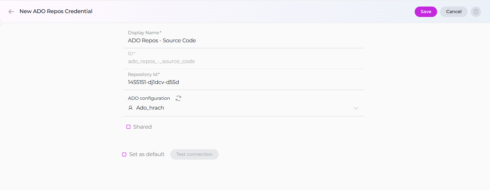

### Bitbucket Credential Setup

To create a **Bitbucket** credential:

**Required Fields:**

* **Display Name:** A descriptive name for your credential
* **URL:** The URL of your Bitbucket instance
* **Authentication:** Username and Password

**Step-by-step Instructions:**

1. Click **+ Create** in the Credentials menu.
2. Select **Bitbucket** as the credential type.
    * Enter a descriptive name (e.g., "Bitbucket - Repository Access").
    * Enter your Bitbucket URL (e.g., `https://bitbucket.org`).
    * Enter your Bitbucket username.
    * Enter your Bitbucket password or app password.
    * **Shared Credential:** Check the **Shared** checkbox if you want this credential to be accessible by all team members in the current project.
3. Click **Save**.

### Confluence Credential Setup

To create a **Confluence** credential:

**Required Fields:**

* **Display Name:** A descriptive name for your credential
* **Base URL:** The URL of your Confluence instance
* **Authentication Options (choose one):**
     * **Basic:** Username and API Key
     * **Bearer:** Token

**Step-by-step Instructions:**

1. Click **+ Create** in the Credentials menu.
2. Select **Confluence** as the credential type.
    * Enter a descriptive name (e.g., "Confluence - Knowledge Base").
    * Enter the base URL of your Confluence instance (e.g., `https://yourcompany.atlassian.net/wiki`).
    * Choose your authentication method:
        * For **Basic:** Enter your username and API key
        * For **Bearer:** Enter your token
    * **Shared Credential:** Check the **Shared** checkbox if you want this credential to be accessible by all team members in the current project.
3. Click **Save**.

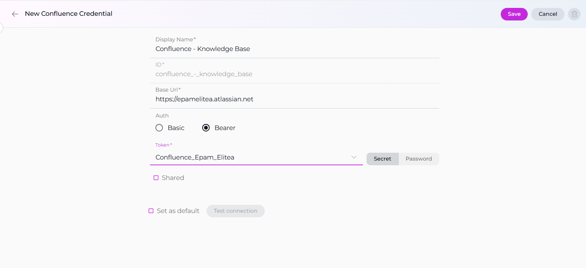

### Figma Credential Setup

To create a **Figma** credential:

**Required Fields:**

* **Display Name:** A descriptive name for your credential
* **Authentication Options (choose one):**
    * **Token:** Personal Access Token
    * **OAuth2:** OAuth2 Token

**Step-by-step Instructions:**

1. Click **+ Create** in the Credentials menu.
2. Select **Figma** as the credential type.
    * Enter a descriptive name (e.g., "Figma - Design Assets").
    * Choose your authentication method:
        * For **Token:** Enter your Figma Personal Access Token (starts with `figd_`)
        * For **OAuth2:** Enter your OAuth2 token
    * **Shared Credential:** Check the **Shared** checkbox if you want this credential to be accessible by all team members in the current project.
3. Click **Save**.

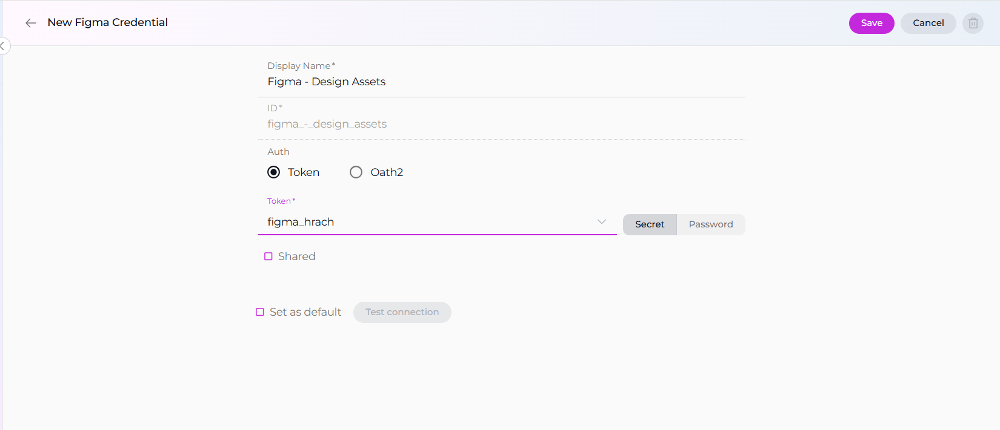

### GitHub Credential Setup

To create a **GitHub** credential:

**Required Fields:**

* **Display Name:** A descriptive name for your credential
* **Base URL:** Base API URL (optional, defaults to `https://api.github.com`)
* **Authentication Options (choose one or leave blank for anonymous):**
    * **Token:** Access Token
    * **Password:** Username and Password
    * **App Private Key:** App ID and Private Key
    * **Anonymous:** No authentication (for public repositories)

**Step-by-step Instructions:**

1. Click **+ Create** in the Credentials menu.
2. Select **GitHub** as the credential type.
    * Enter a descriptive name (e.g., "GitHub - Project Repository").
    * Base URL:
        * For **GitHub.com**: Leave blank to use the default `https://api.github.com`.
        * For **GitHub Enterprise Server**: Set to your REST v3 endpoint, e.g., `https://[YOUR_HOST]/api/v3` (GraphQL: `https://[YOUR_HOST]/api/graphql`).
    * Choose your authentication method:
        * For **Token:** Enter your GitHub Personal Access Token
        * For **Password:** Enter your username and password
        * For **App Private Key:** Enter your GitHub App ID and private key
        * For **Anonymous:** Leave all authentication fields blank (suitable for public repositories)
    * **Shared Credential:** Check the **Shared** checkbox if you want this credential to be accessible by all team members in the current project.
3. Click **Save**.

!!! info "GitHub.com vs GitHub Enterprise (Endpoints)"
    When configuring GitHub credentials, the Base URL depends on whether you use GitHub.com or a self‑hosted GitHub Enterprise Server (GHES).

    | API | Enterprise | GitHub.com |
    | --- | --- | --- |
    | v3 (REST) | `https://[YOUR_HOST]/api/v3` | `https://api.github.com` |
    | v4 (GraphQL) | `https://[YOUR_HOST]/api/graphql` | `https://api.github.com/graphql` |

    - For **GitHub.com**: Leave the Base URL blank to use the default `https://api.github.com`.
    - For **GitHub Enterprise Server**: Set the Base URL to your REST v3 endpoint (example: `https://ghe.company.com/api/v3`). GraphQL requests use `https://ghe.company.com/api/graphql`.
    - Ensure your token scopes match your use case (e.g., `repo`, `workflow`, `read:org`) and that your GHES certificate is trusted by your environment.

### GitLab Credential Setup

To create a **GitLab** credential:

**Required Fields:**

* **Display Name:** A descriptive name for your credential
* **URL:** The URL of your GitLab instance
* **Authentication:** GitLab private token

**Step-by-step Instructions:**

1. Click **+ Create** in the Credentials menu.
2. Select **GitLab** as the credential type.
   * Enter a descriptive name (e.g., "GitLab - Development").
   * Enter the URL of your GitLab instance (e.g., `https://gitlab.com`).
   * Enter your GitLab private token.
   * **Shared Credential:** Check the **Shared** checkbox if you want this credential to be accessible by all team members in the current project.
3. Click **Save**.

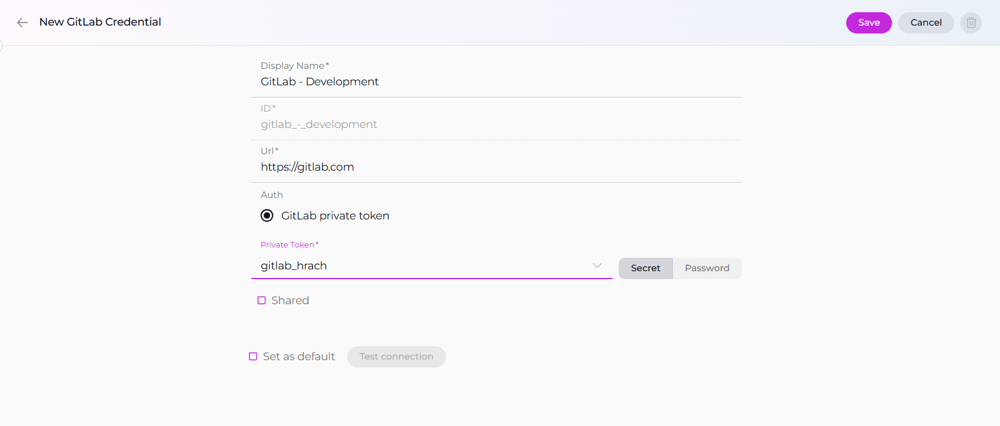

### Jira Credential Setup

To create a **Jira** credential:

**Required Fields:**

* **Display Name:** A descriptive name for your credential
* **Base URL:** The URL of your Jira instance
* **Authentication Options (choose one):**
    * **Basic:** Username and API Key
    * **Bearer:** Token

**Step-by-step Instructions:**

1. Click **+ Create** in the Credentials menu.
2. Select **Jira** as the credential type.
    * Enter a descriptive name (e.g., "Jira - Project Management").
    * Enter the base URL of your Jira instance (e.g., `https://yourcompany.atlassian.net`).
    * Choose your authentication method:
        * For **Basic:** Enter your username and API key
        * For **Bearer:** Enter your token
    * **Shared Credential:** Check the **Shared** checkbox if you want this credential to be accessible by all team members in the current project.
3. Click **Save**.

### Postman Credential Setup

To create a **Postman** credential:

**Required Fields:**

* **Display Name:** A descriptive name for your credential
* **Base URL:** Postman API base URL
* **Workspace ID:** Default workspace ID
* **Authentication:** API Key

**Step-by-step Instructions:**

1. Click **+ Create** in the Credentials menu.
2. Select **Postman** as the credential type.
    * Enter a descriptive name (e.g., "Postman - API Collections").
    * Enter the Postman API base URL.
    * Enter your default workspace ID.
    * Enter your Postman API key.
    * **Shared Credential:** Check the **Shared** checkbox if you want this credential to be accessible by all team members in the current project.
3. Click **Save**.

### QTest Credential Setup

To create a **QTest** credential:

**Required Fields:**

* **Display Name:** A descriptive name for your credential
* **Base URL:** The URL of your QTest instance
* **API Token:** Your QTest API token

**Step-by-step Instructions:**

1. Click **+ Create** in the Credentials menu.
2. Select **QTest** as the credential type.
    * Enter a descriptive name (e.g., "QTest - Quality Management").
    * Enter the base URL of your QTest instance.
    * Enter your QTest API token.
    * **Shared Credential:** Check the **Shared** checkbox if you want this credential to be accessible by all team members in the current project.
3. Click **Save**.

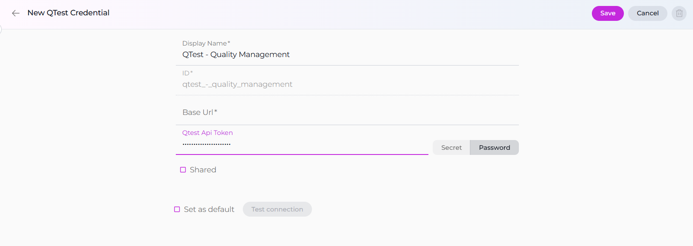

### Rally Credential Setup

To create a **Rally** credential:

**Required Fields:**

* **Display Name:** A descriptive name for your credential
* **Server:** Rally server URL
* **Authentication Options (choose one):**
    * **Password:** Username and Password
    * **API Key:** API Key

**Step-by-step Instructions:**

1. Click **+ Create** in the Credentials menu.
2. Select **Rally** as the credential type.
    * Enter a descriptive name (e.g., "Rally - Agile Management").
    * Enter your Rally server URL.
    * Choose your authentication method:
        * For **Password:** Enter your username and password
        * For **API Key:** Enter your Rally API key
    * **Shared Credential:** Check the **Shared** checkbox if you want this credential to be accessible by all team members in the current project.
3. Click **Save**.

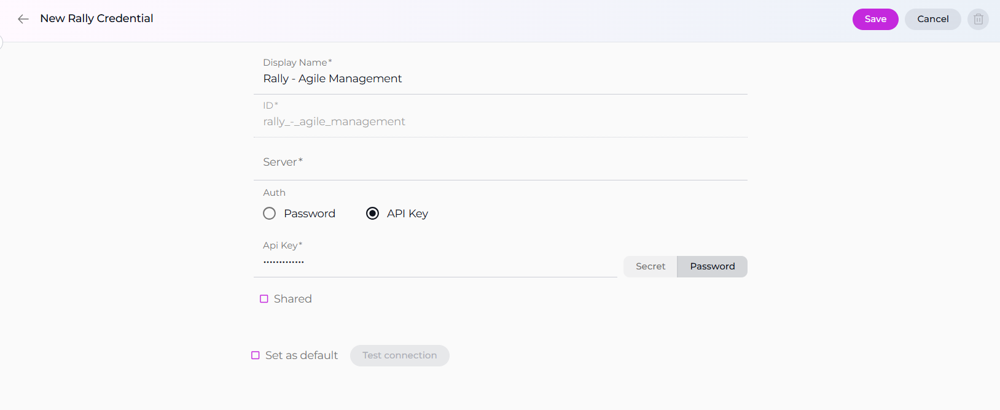

### ServiceNow Credential Setup

To create a **ServiceNow** credential:

**Required Fields:**

* **Display Name:** A descriptive name for your credential
* **Base URL:** The URL of your ServiceNow instance
* **Authentication:** Username and Password

**Step-by-step Instructions:**

1. Click **+ Create** in the Credentials menu.
2. Select **ServiceNow** as the credential type.
    * Enter a descriptive name (e.g., "ServiceNow - IT Service Management").
    * Enter the base URL of your ServiceNow instance (e.g., `https://yourinstance.service-now.com`).
    * Enter your ServiceNow username.
    * Enter your ServiceNow password.
    * **Shared Credential:** Check the **Shared** checkbox if you want this credential to be accessible by all team members in the current project.
3. Click **Save**.

### Slack Credential Setup

To create a **Slack** credential:

**Required Fields:**

* **Display Name:** A descriptive name for your credential
* **Slack Token:** Your Slack authentication token (format: XOXB-*****-*****-*****-*****)
* **Name:** Slack workspace name (optional)
* **Channel ID:** Default channel ID (optional)

**Step-by-step Instructions:**

1. Click **+ Create** in the Credentials menu.
2. Select **Slack** as the credential type.
   * Enter a descriptive name (e.g., "Slack - Team Communication").
   * Enter your Slack Bot Token or User Token (starts with `xoxb-` or `xoxp-`).
   * Optionally enter a Slack workspace name in the **Name (Slack)** field and default channel ID.
   * **Shared Credential:** Check the **Shared** checkbox if you want this credential to be accessible by all team members in the current project.
3. Click **Save**.

### TestRail Credential Setup

To create a **TestRail** credential:

**Required Fields:**

* **Display Name:** A descriptive name for your credential
* **URL:** The URL of your TestRail instance
* **Email:** Your TestRail account email
* **Password:** Your TestRail account password

**Step-by-step Instructions:**

1. Click **+ Create** in the Credentials menu.
2. Select **TestRail** as the credential type.
   * Enter a descriptive name (e.g., "TestRail - Test Management").
   * Enter the URL of your TestRail instance (e.g., `https://yourcompany.testrail.net`).
   * Enter your TestRail email address.
   * Enter your TestRail password.
   * **Shared Credential:** Check the **Shared** checkbox if you want this credential to be accessible by all team members in the current project.
3. Click **Save**.

### Xray Credential Setup

To create an **Xray** credential:

**Required Fields:**

* **Display Name:** A descriptive name for your credential
* **Base URL:** The URL of your Xray instance
* **Authentication:** Client Credentials

**Step-by-step Instructions:**

1. Click **+ Create** in the Credentials menu.
2. Select **Xray** as the credential type.
* Enter a descriptive name (e.g., "Xray - Test Automation").
   * Enter the base URL of your Xray instance.
   * Enter your Client ID.
   * Enter your Client Secret.
   * **Shared Credential:** Check the **Shared** checkbox if you want this credential to be accessible by all team members in the current project.
3. Click **Save**.

### Zephyr Enterprise Credential Setup

To create a **Zephyr Enterprise** credential:

**Required Fields:**

* **Display Name:** A descriptive name for your credential
* **Base URL:** The URL of your Zephyr Enterprise instance
* **Token:** API token

**Step-by-step Instructions:**

1. Click **+ Create** in the Credentials menu.
2. Select **Zephyr Enterprise** as the credential type.
   * Enter a descriptive name (e.g., "Zephyr Enterprise - Test Management").
   * Enter the base URL of your Zephyr Enterprise instance.
   * Enter your API token.
   * **Shared Credential:** Check the **Shared** checkbox if you want this credential to be accessible by all team members in the current project.
3. Click **Save**.

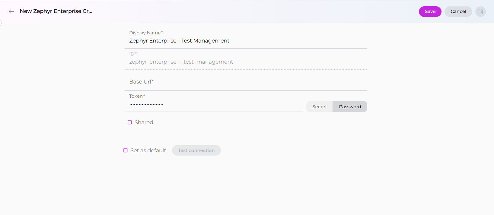

### Zephyr Scale Credential Setup

To create a **Zephyr Scale** credential:

**Required Fields:**

* **Display Name:** A descriptive name for your credential
* **Base URL:** The URL of your Zephyr Scale instance
* **Authentication Options (choose one):**
    * **Token:** API Token
    * **Username & Password:** Username and Password
    * **Cookies:** Cookie-based authentication

**Step-by-step Instructions:**

1. Click **+ Create** in the Credentials menu.
2. Select **Zephyr Scale** as the credential type.
    * Enter a descriptive name (e.g., "Zephyr Scale - Test Planning").
    * Enter the base URL of your Zephyr Scale instance.
    * Choose your authentication method:
        * For **Token:** Enter your API token
        * For **Username & Password:** Enter your username and password
        * For **Cookies:** Enter your authentication cookies
    * **Shared Credential:** Check the **Shared** checkbox if you want this credential to be accessible by all team members in the current project.
3. Click **Save**.

---

### Browser Credential Setup

To create a **Browser** credential:

**Required Fields:**

* **Display Name:** A descriptive name for your credential
* **Google API Key:** API key for Google Programmable Search Engine
* **Search Engine ID:** Custom Search Engine ID

**Step-by-step Instructions:**

1. Click **+ Create** in the Credentials menu.
2. Select **Browser** as the credential type.
      * Enter a descriptive name (e.g., "Browser - Web Search").
      * Enter your Google API Key.
      * Enter your Custom Search Engine ID(Google Cse Id).
      * **Shared Credential:** Check the **Shared** checkbox if you want this credential to be accessible by all team members in the current project.
3. Click **Save**.

---

### Carrier Credential Setup

To create a **Carrier** credential:

**Required Fields:**

* **Display Name:** A descriptive display name for your credential
* **ID:** Unique identifier for the carrier configuration
* **Organization:** Your Carrier organization name
* **URL:** Carrier service endpoint URL
* **Private Token:** Carrier platform private token

**Step-by-step Instructions:**

1. Click **+ Create** in the Credentials menu.
2. Select **Carrier** as the credential type.
    * Enter a descriptive display name (e.g., "Carrier - Communication Service").
    * Enter a unique ID for this configuration.
    * Enter your organization name.
    * Enter the carrier service URL.
    * Enter your private token.
    * **Shared Credential:** Check the **Shared** checkbox if you want this credential to be accessible by all team members in the current project.
9. Click **Save**.

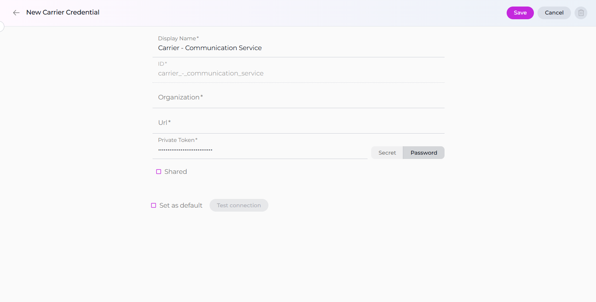

---

### Google Places Credential Setup

To create a **Google Places** credential:

**Required Fields:**

* **Display Name:** A descriptive name for your credential
* **API Key:** Google Places API key

**Step-by-step Instructions:**

1. Click **+ Create** in the Credentials menu.
2. Select **Google Places** as the credential type.
    * Enter a descriptive name (e.g., "Google Places - Location Services").
    * Enter your Google Places API key.
    * **Shared Credential:** Check the **Shared** checkbox if you want this credential to be accessible by all team members in the current project.
3. Click **Save**.

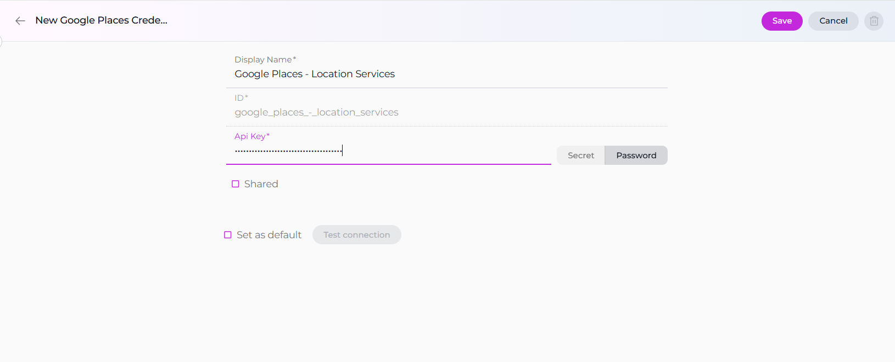

---

### Report Portal Credential Setup

To create a **Report Portal** credential:

**Required Fields:**

* **Display Name:** A descriptive name for your credential
* **Base URL:** The URL of your Report Portal instance
* **Authentication:** API Key

**Step-by-step Instructions:**

1. Click **+ Create** in the Credentials menu.
2. Select **Report Portal** as the credential type.
    * Enter a descriptive name (e.g., "Report Portal - Test Analytics").
    * Enter the base URL of your Report Portal instance(Endpoint *).
    * Enter your API key.
    * **Shared Credential:** Check the **Shared** checkbox if you want this credential to be accessible by all team members in the current project.
3. Click **Save**.

---

### Salesforce Credential Setup

To create a **Salesforce** credential:

**Required Fields:**

* **Display Name:** A descriptive name for your credential
* **Instance URL:** Your Salesforce instance URL
* **Client ID:** Consumer Key from your Connected App
* **Client Secret:** Consumer Secret from your Connected App

**Step-by-step Instructions:**

1. Click **+ Create** in the Credentials menu.
2. Select **Salesforce** as the credential type.
    * Enter a descriptive name (e.g., "Salesforce - CRM Integration").
    * Enter your Salesforce instance URL (e.g., `https://your-domain.my.salesforce.com`).
    * Enter your Client ID (Consumer Key).
    * Enter your Client Secret (Consumer Secret).
    * **Shared Credential:** Check the **Shared** checkbox if you want this credential to be accessible by all team members in the current project.
3. Click **Save**.

---

### SharePoint Credential Setup

To create a **SharePoint** credential:

**Required Fields:**

* **Display Name:** A descriptive name for your credential
* **Site URL:** SharePoint site URL
* **Client ID:** Application Client ID
* **Client Secret:** Application Client Secret

**Step-by-step Instructions:**

1. Click **+ Create** in the Credentials menu.
2. Select **SharePoint** as the credential type.
    * Enter a descriptive name (e.g., "SharePoint - Document Management").
    * Enter your SharePoint site URL.
    * Enter your Client ID.
    * Enter your Client Secret.
    * **Shared Credential:** Check the **Shared** checkbox if you want this credential to be accessible by all team members in the current project.
3. Click **Save**.

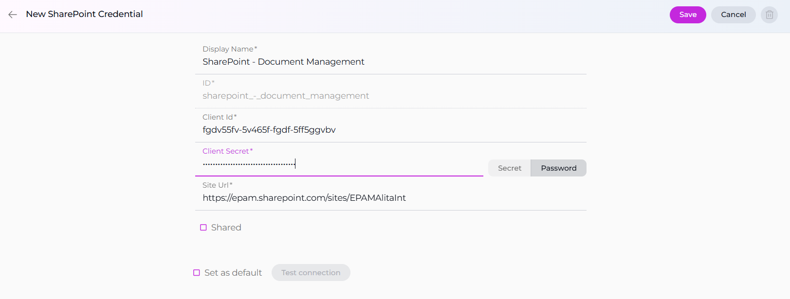

---

### Sonar Credential Setup

To create a **Sonar** credential:

**Required Fields:**

* **Display Name:** A descriptive name for your credential
* **Base URL:** SonarQube/SonarCloud instance URL
* **Token:** API token

**Step-by-step Instructions:**

1. Click **+ Create** in the Credentials menu.
2. Select **Sonar** as the credential type.
    * Enter a descriptive name (e.g., "Sonar - Code Quality").
    * Enter the base URL of your SonarQube/SonarCloud instance.
    * Enter your API token.
    * **Shared Credential:** Check the **Shared** checkbox if you want this credential to be accessible by all team members in the current project.
3. Click **Save**.

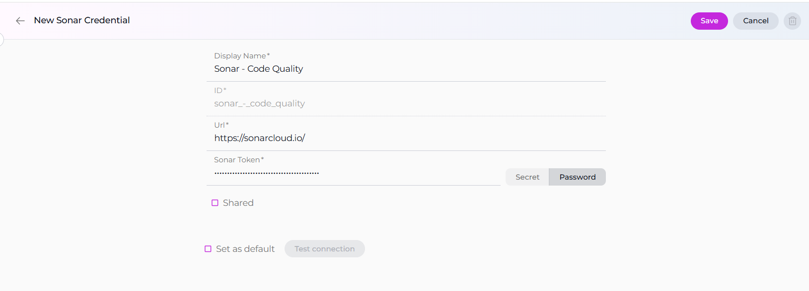

---

### SQL Credential Setup

To create a **SQL** credential:

**Required Fields:**

* **Display Name:** A descriptive name for your credential
* **Host:** Database server hostname or IP
* **Port:** Database port number
* **Username:** Database username
* **Password:** Database password

**Step-by-step Instructions:**

1. Click **+ Create** in the Credentials menu.
2. Select **SQL** as the credential type.
    * Enter a descriptive name (e.g., "SQL - Production Database").
    * Enter the database host address.
    * Enter the port number.
    * Enter your username.
    * Enter your password.
    * **Shared Credential:** Check the **Shared** checkbox if you want this credential to be accessible by all team members in the current project.
9. Click **Save**.

!!! warning "Database Security"
    Ensure your database credentials have only the minimum permissions required for your intended operations.

---

### TestIO Credential Setup

To create a **TestIO** credential:

**Required Fields:**

* **Display Name:** A descriptive name for your credential
* **API Key:** TestIO platform API key

**Step-by-step Instructions:**

1. Click **+ Create** in the Credentials menu.
2. Select **TestIO** as the credential type.
    * Enter a descriptive name (e.g., "TestIO - Crowdsourced Testing").
    * Enter your TestIO API key.
    * **Shared Credential:** Check the **Shared** checkbox if you want this credential to be accessible by all team members in the current project.
3. Click **Save**.

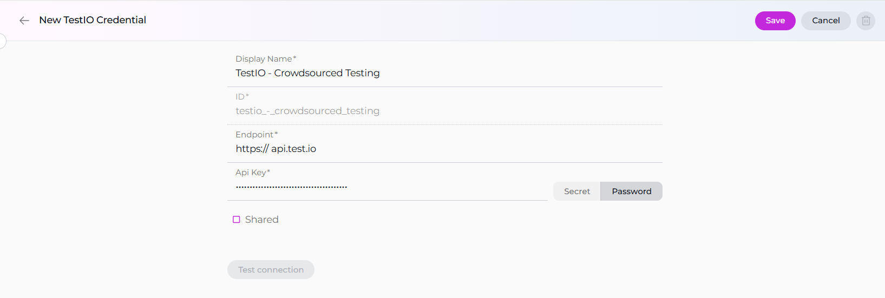

---

### Zephyr Essential Credential Setup

To create a **Zephyr Essential** credential:

**Required Fields:**

* **Display Name:** A descriptive name for your credential
* **Base URL:** The URL of your Zephyr Essential instance
* **Token:** API Token

**Step-by-step Instructions:**

1. Click **+ Create** in the Credentials menu.
2. Select **Zephyr Essential** as the credential type.
    * Enter a descriptive name (e.g., "Zephyr Essential - Test Management").
    * Enter the base URL of your Zephyr Essential instance.
    * Enter your API token.
    * **Shared Credential:** Check the **Shared** checkbox if you want this credential to be accessible by all team members in the current project.
3. Click **Save**.

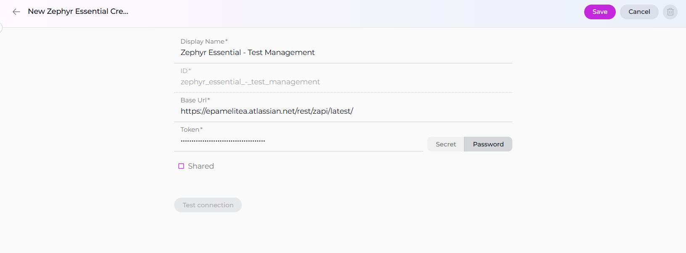

---

## Using Credentials in Toolkits

Once you have created credentials, you can assign them to toolkits to enable secure access to external services.

**How to Assign a Credential:**

1. When creating or editing a toolkit, locate the **configuration** dropdown.
2. Choose an existing credential from the list, or create a new one if needed.
3. Save your changes to apply the credential to your toolkit.

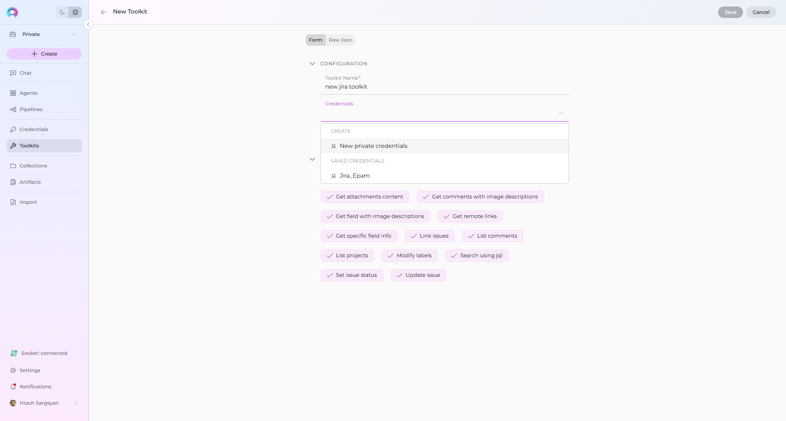

**Credential Scope and Access:**

* **Private Credentials:** These are created in your **Private** workspace and are only visible to you. They appear in the dropdown when configuring toolkits in your private workspace.
* **Project Credentials:** These are created within a **Team** project and are visible to all team members. They appear in the dropdown when configuring toolkits within that project.

**Best Practices:**

* Use **project-scoped credentials** for team integrations and shared toolkits.
* Use **personal credentials** for individual agent tasks and private toolkits.
* Regularly rotate and update credentials to maintain security.
* Use Secrets for storing sensitive authentication information.

For more information on creating and managing Toolkits, see the [Toolkits documentation](../../getting-started/create-toolkit.md).

## Best Practices and Use Cases

Here are some examples of how to effectively utilize Credentials in your ELITEA workflows:

### Use Case 1: Individual Jira Credentials for User Story Management

* **Scenario:** You are building an agent workflow to create and publish user stories in Jira. You want each Business Analyst (BA) using the agent to authenticate with their own Jira credentials to ensure traceability of who created which user story.
* **Solution:**
    1. Instruct each BA to create their personal Jira credential in their **Private** workspace.
    2. When configuring the Jira toolkit in the agent, each BA can select their own private Jira credential from the dropdown, ensuring personal authentication.

### Use Case 2: Service Account for GitHub Code Access

* **Scenario:** You are creating an agent workflow to read code from a GitHub repository to generate automation test cases. You have a dedicated service account for accessing the GitHub repository and want to use these credentials consistently for this purpose.
* **Solution:**
    1. The team manager creates a GitHub credential in the **Team** project using the service account's access token.
    2. When configuring the GitHub toolkit, team members can select the shared project credential.

### Use Case 3: Mixed Authentication for Confluence and TestRail Workflow

* **Scenario:** You are building an agent workflow to read information from Confluence pages and then publish manual test cases in TestRail. You want to use a service account for accessing Confluence but require each Quality Assurance (QA) engineer to use their own TestRail credentials for publishing test cases.
* **Solution:**
    1. The team manager creates a Confluence credential in the **Team** project using the service account's credentials.
    2. Each QA engineer creates their personal TestRail credential in their **Private** workspace.
    3. When configuring the agent:
        * For the Confluence toolkit, select the shared project Confluence credential.
        * For the TestRail toolkit, each QA uses their own private TestRail credential.

### Use Case 4: GitLab Integration for CI/CD Automation

* **Scenario:** You are building an agent workflow to trigger CI/CD pipelines in GitLab and fetch pipeline statuses. You want to use a service account for consistent access.
* **Solution:**
    1. The team manager creates a GitLab credential in the **Team** project using the service account's token.
    2. When configuring the GitLab toolkit, select the shared project credential.

### Security Best Practices

* **Use Secrets:** For enhanced security, store sensitive authentication information (API keys, tokens, passwords) as Secrets and reference them in your credentials.
* **Regular Rotation:** Regularly rotate and update your credentials to maintain security compliance.
* **Principle of Least Privilege:** Ensure that each credential has only the minimum permissions necessary for its intended use.
* **Audit and Review:** Regularly review and audit your credentials to remove unused or outdated ones.

By strategically using **Credentials**, you can create flexible and secure agent workflows that cater to various authentication needs and enhance collaboration within your ELITEA environment.

!!! info "Related Documentation"
    For more detailed information, refer to:
    
    - **[Credentials Menu](../../menus/credentials.md)** - Comprehensive guide to the Credentials interface and management
    - **[Toolkits Menu](../../menus/toolkits.md)** - Learn how to integrate credentials with toolkits
    - **[Secrets](../../menus/settings/secrets.md)** - Enhanced security through the Secrets management system
    - **[Glossary](../../home/glossary.md)** - Definitions of key terms and concepts used in ELITEA
