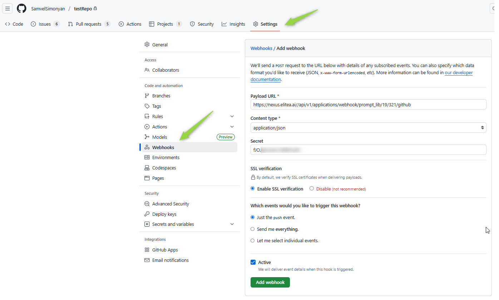
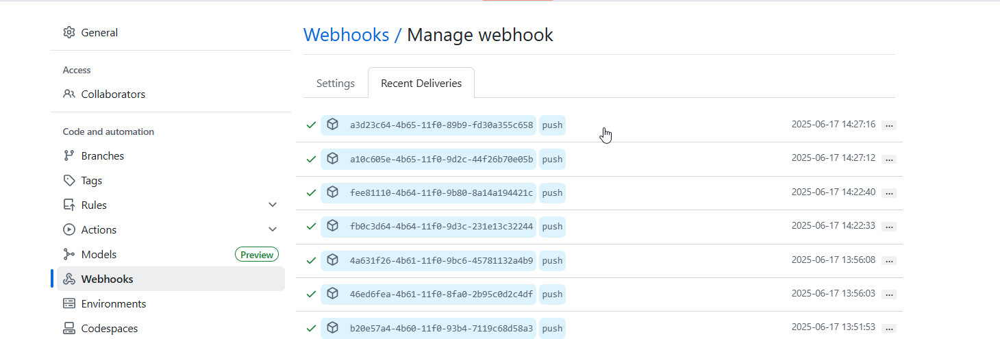
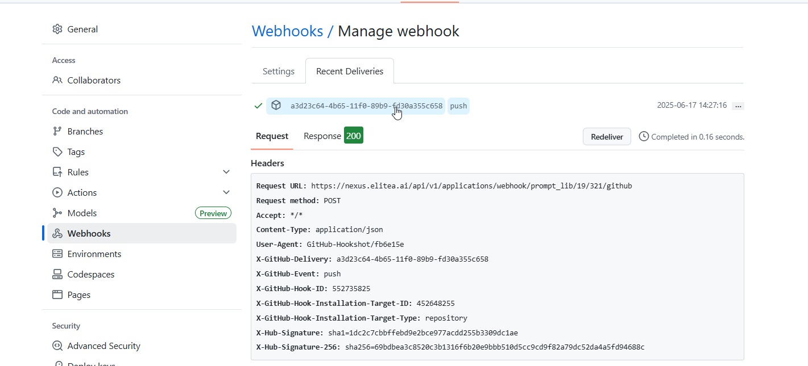
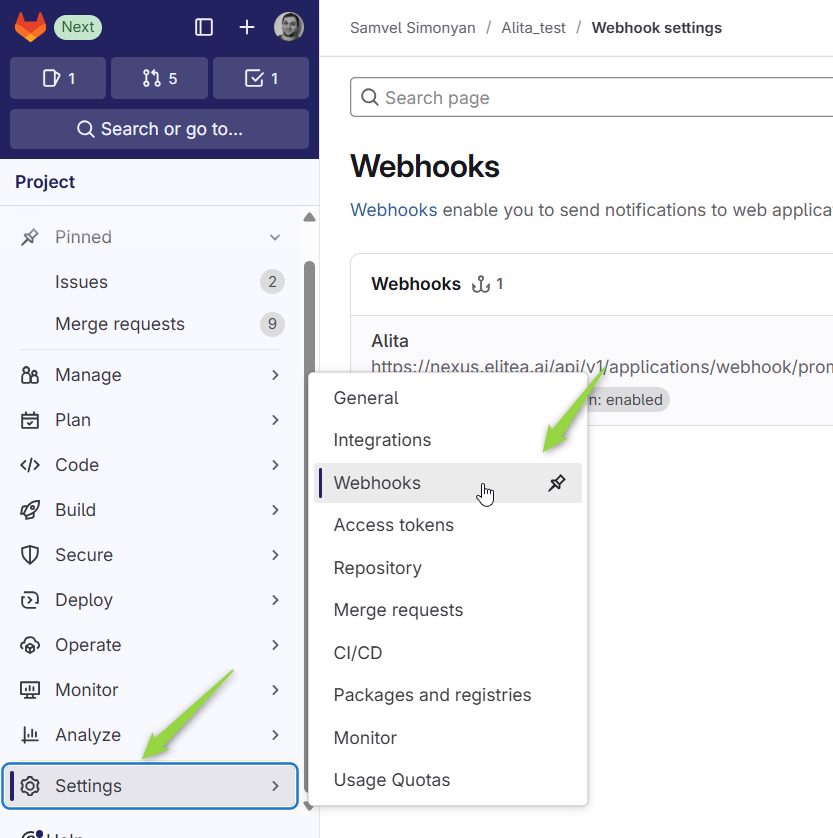
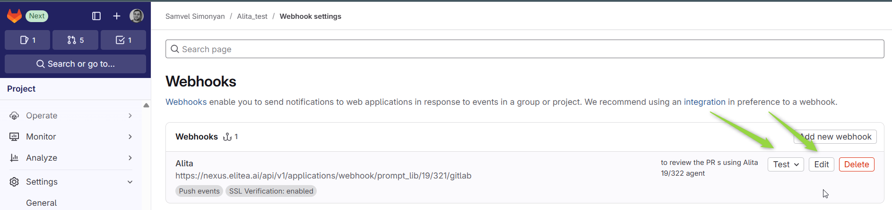
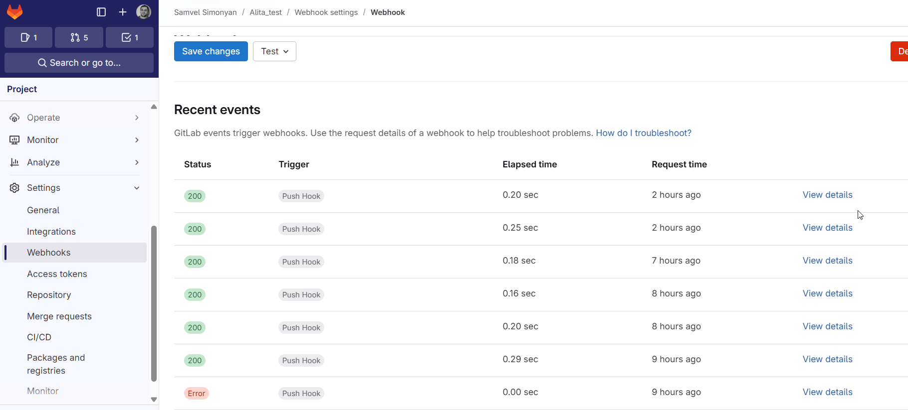

# Guide: Configuring Webhooks to Trigger Elitea Agents

## Introduction

### Purpose and Overview

This guide provides comprehensive instructions for configuring ELITEA webhooks in GitHub and GitLab to trigger your Elitea agents. When a specified event occurs in your Git repository (e.g., a pull request is opened, code is pushed), the configured webhook will send a notification (payload) to Elitea URL. Elitea then passes the content of this webhook payload as `user_input` to your designated agent, enabling automated workflows and integrations.
This document covers setting up webhooks in both GitHub and GitLab, configuring your Elitea agent to receive these webhooks securely, and examples for testing your setup.

### Brief Overview of Webhooks with Elitea

Webhooks are automated messages sent from apps when something happens. In this context:
1.  An event occurs in GitHub or GitLab (e.g., a new pull request).
2.  GitHub/GitLab sends an HTTP POST request (the webhook) containing data about the event (the payload) to a pre-configured Elitea URL.
3.  Eliea validates the webhook (using a shared secret) and routes the payload to the specified agent.
4.  Your Elitea agent receives the payload as `user_input` and can then perform actions based on its instructions and the received data (e.g., analyze code, post comments, interact with other tools).

This enables powerful CI/CD integrations, automated code reviews, notifications, and more.

### Key Terms

*   **Webhook:** An automated HTTP callback triggered by an event.
*   **Payload:** The data sent by the webhook, typically in JSON format, describing the event.
*   **Secret (Webhook Secret):** A token used by both the sending service (GitHub/GitLab) and Elitea to verify that the webhook request is legitimate and not tampered with.
*   **HMAC Signature:** (Hash-based Message Authentication Code) A cryptographic signature generated using the secret and the payload. GitHub uses this to ensure payload integrity and authenticity.
*   **`{{alita_deployment_url}}`:** The base URL of your Elitea instance (e.g., `https://nexus.elitea.ai`).
*   **`{{project_id}}`:** The ID of your project within Elitea.
*   **`{{agent_version_id}}`:** The specific version ID of the Elitea agent you want to trigger. This is **not** the agent ID; it's the ID for a particular saved version of an agent.


## Prerequisites

Before you begin, ensure you have:
*   Access to an Elitea instance with privileges to view project IDs and agent version IDs.
*   An Elitea agent that you want to trigger via webhook.
*   The `Project ID` and `Agent Version ID` for your Elitea agent.
*   Administrator or owner access to the GitHub or GitLab repository where you want to set up the webhook.

## Elitea Agent Configuration for Webhooks

Before setting up the webhook in GitHub or GitLab, you must configure your Elitea agent to expect and validate webhooks.

1.  **Navigate to your Elitea Agent:** Open the configuration page for the agent you want to use with webhooks.
2.  **Set the Webhook Secret:**
    *   Open Agent Advanced settings and locate the `webhook_secret` field.
    *   Generate a strong, random string to use as your secret. Store this securely.
    *   Enter this secret string into the `webhook_secret` field in your Elitea agent's settings.
    *   Save your agent configuration.

    
    
    


**Important:** The secret you set in the Elitea agent **must exactly match** the secret you configure in GitHub or GitLab.

## How Elitea Processes Webhook Payloads

When a valid webhook is received by Elitea:
*   Eliea uses the configured `webhook_secret` for that agent to verify the signature (for GitHub) or token (for GitLab).
*   If valid, the entire JSON body of the webhook payload is passed to your agent as the `user_input`.
*   Your agent's instructions should be designed to parse this JSON payload to extract the necessary information.

## Setting Up a Webhook in GitHub

1.  **Navigate to Repository Settings:** Go to your GitHub repository, then click on **Settings** > **Webhooks** (in the sidebar).
2.  **Add Webhook:** Click the **Add webhook** button.
3.  **Configure the Webhook:**
    *   **Payload URL:** Construct the URL as follows:
        `{{alita_deployment_url}}/api/v1/applications/webhook/prompt_lib/{{project_id}}/{{agent_version_id}}/github`
        *   Replace `{{alita_deployment_url}}` with your Elitea instance URL (e.g., `https://nexus.elitea.ai`).
        *   Replace `{{project_id}}` with your Elitea project ID.
        *   Replace `{{agent_version_id}}` with the specific version ID of your configured Elitea agent.
        Example: `https://nexus.elitea.ai/api/v1/applications/webhook/prompt_lib/12/321/github`
    *   **Content type:** Select `application/json`.
    *   **Secret:** Enter the **exact same secret string** you configured in your Elitea agent's `webhook_secret` field.
    *   **SSL verification:** "Enable SSL verification" (recommended).
    *   **Which events would you like to trigger this webhook?**
        *   E.g. select "Let me select individual events" and choose the specific events relevant to your agent (e.g., "Pull requests," "Pushes").
    *   **Active:** Ensure this checkbox is checked.
4.  Click **Add webhook**.

    


> **Note:** GitHub uses the `X-Hub-Signature-256` header for the HMAC signature, calculated using your secret and the payload body. Elitea will use this header and your agent's `webhook_secret` to verify the request.

To test the webhook integration, send a ping request. Then, click on the webhook to view the request details. Observe the status code and other details of the webhook request. Ideally, you should see a 200 response code.
From this view, you can also inspect the exact payload sent to the agent, which helps in configuring the agent's instructions.





## Setting Up a Webhook in GitLab

1.  **Navigate to Repository Settings:** Go to your GitLab project, then navigate to **Settings** > **Webhooks**.

     


2.  **Configure the Webhook:**
    *   **URL:** Construct the URL similarly to GitHub, but with `/gitlab` at the end:
        `{{alita_deployment_url}}/api/v1/applications/webhook/prompt_lib/{{project_id}}/{{agent_version_id}}/gitlab`
        *   Replace placeholders as described for GitHub.
        Example: `https://nexus.elitea.ai/api/v1/applications/webhook/prompt_lib/12/322/gitlab`
    *   **Secret token:** Enter the **exact same secret string** you configured in your Elitea agent's `webhook_secret` field. GitLab will send this token in the `X-Gitlab-Token` header.
    *   **Trigger:** Select the events you want to trigger this webhook (e.g., "Push events," "Merge request events").
    *   **Enable SSL verification:** Ensure this is checked (recommended).
3.  Click **Add webhook**.
   
    

> **Note:** GitLab sends its authentication token in the `X-Gitlab-Token` header. Elitea will use this header and your agent's `webhook_secret` to verify the request.

To test the configured webhook you can use test functionality on the created webhook , or click the edit button and observe the sent request details 

 
 
 

## Use Case Example

A common use case is automated pull request (PR) or merge request (MR) review:
1.  **Event:** A new PR is opened in GitHub.
2.  **Webhook Trigger:** The configured webhook sends the PR details to your Elitea agent.
3.  **Agent Action:**
    *   The Elitea agent receives the payload.
    *   It uses its GitHub toolkit instruction to fetch more details like changed files or review comments.
    *   The agent analyzes the changes based on predefined criteria.
    *   It then posts its findings as a comment back on the PR.

GitHub and GitLab webhooks can be triggered by a wide variety of events, allowing for diverse automation scenarios.

## Simulating Webhook Requests

It's often useful to test your webhook setup without actually triggering events in GitHub/GitLab. You can use tools like Postman or write simple scripts.


### Python Example (Simulating Github/GitLab)

This Python script demonstrates sending a webhook request similar to how Github/GitLab might, using the webhook request.

```python
import requests
import hashlib
import hmac
import json

def get_user_input():
    """Get user configuration"""
    while True:
        platform = input("Platform (github/gitlab): ").lower().strip()
        if platform in ['github', 'gitlab']:
            break
        print("Enter 'github' or 'gitlab'")
    
    project_id = int(input("Project ID: "))
    app_version_id = int(input("App Version ID: "))
    secret = input("Webhook Secret: ").strip()
    
    return platform, project_id, app_version_id, secret

def get_sample_payload(platform):
    """Get sample payload based on platform"""
    if platform == 'github':
        return {
            "zen": "Responsive is better than fast.",
            "hook_id": 12345678,
            "repository": {
                "id": 35129377,
                "name": "sample-repo",
                "full_name": "user/sample-repo"
            }
        }
    else:  # gitlab
        return {
            "object_kind": "push",
            "event_name": "push",
            "ref": "refs/heads/master",
            "user_name": "John Smith",
            "project": {
                "id": 15,
                "name": "Sample Project"
            }
        }

def send_webhook(platform, project_id, app_version_id, secret, payload):
    """Send webhook with appropriate headers"""
    
    # Build URL
    base_url = "https://nexus.elitea.ai/api/v1/applications/webhook/prompt_lib"
    url = f"{base_url}/{project_id}/{app_version_id}/{platform}"
    
    # Convert payload to JSON
    payload_json = json.dumps(payload, separators=(',', ':'))
    
    # Set headers based on platform
    if platform == 'github':
        # GitHub uses HMAC-SHA256 signature
        signature = hmac.new(
            secret.encode('utf-8'),
            payload_json.encode('utf-8'),
            hashlib.sha256
        ).hexdigest()
        
        headers = {
            'Content-Type': 'application/json',
            'X-Hub-Signature-256': f'sha256={signature}',
            'X-GitHub-Event': 'ping'
        }
    else:  # gitlab
        # GitLab uses token directly
        headers = {
            'Content-Type': 'application/json',
            'X-Gitlab-Token': secret,
            'X-Gitlab-Event': 'Push Hook'
        }
    
    print(f"Sending {platform.upper()} webhook to: {url}")
    
    try:
        response = requests.post(url, data=payload_json, headers=headers, timeout=30)
        
        print(f"Status: {response.status_code}")
        print(f"Response: {response.text}")
        
        if response.status_code == 200:
            print("✅ Success!")
        else:
            print("❌ Failed")
            
    except requests.exceptions.RequestException as e:
        print(f"Error: {e}")

def main():
    print("🎯 Webhook Sender")
    print("=" * 30)
    
    # Get configuration
    platform, project_id, app_version_id, secret = get_user_input()
    
    # Get sample payload
    payload = get_sample_payload(platform)
    
    # Send webhook
    send_webhook(platform, project_id, app_version_id, secret, payload)

if __name__ == "__main__":
    main()
```
## Troubleshooting

If you encounter issues setting up or using webhooks with your Elitea agent, refer to these common problems and solutions:

*   **Secret Mismatch:**
    *   **Symptom:** Elitea rejects the webhook with an error (e.g., HTTP 401 Unauthorized or 403 Forbidden). GitHub/GitLab webhook delivery logs might show failed attempts.
    *   **Solution:**
        1.  Verify that the secret string in your Elitea agent's `webhook_secret` configuration field is *exactly* the same as the secret configured in your GitHub or GitLab webhook settings.
        2.  Ensure it's also identical to the value used in your Postman `webhooksecret` global variable if you are using Postman for testing.
        3.  Secrets are case-sensitive. Double-check for any discrepancies in capitalization, extra spaces, or missing characters.

*   **Incorrect Agent Version ID or Project ID:**
    *   **Symptom:** Webhook requests result in an HTTP 404 Not Found error from Elitea, or the request seems to be ignored.
    *   **Solution:**
        1.  Confirm you are using the correct `agent_version_id` in the Payload URL. This is specific to a *saved version* of your agent. It is **not** the shorter, often numerical, `agent_id`.
        
        
    


*   **Webhook Body Modified After Hash Generation (Primarily for GitHub):**
    *   **Symptom:** Elitea reports a signature mismatch, even if the secrets are confirmed to be identical.
    *   **Solution:**
        1.  The HMAC signature (used by GitHub) is calculated based on the *exact* raw body of the webhook payload. If any proxy, middleware, or even subtle re-encoding modifies the request body between GitHub (or your testing tool) and Elitea, the signature will no longer match.
        2.  Ensure there are no services in the path that might alter the payload.
    

*   **Malformed Payload URL:**
    *   **Symptom:** HTTP 404 Not Found errors from Elitea, or GitHub/GitLab reporting that the webhook endpoint cannot be reached.
    *   **Solution:**
        1.  Carefully re-examine the entire Payload URL.
        2.  Check `{{alita_deployment_url}}` (your Elitea instance base URL).
        3.  Verify `{{project_id}}` and `{{agent_version_id}}`.
        4.  Ensure the URL correctly ends with `/github` for GitHub webhooks or `/gitlab` for GitLab webhooks.
        5.  Look for typos, missing slashes, or extra characters.


*   **Eliea Agent Not Correctly Configured to Expect Webhooks:**
    *   **Symptom:** The agent might not process the payload as expected, even if the request reaches Elitea.
    *   **Solution:**
        1. Double-check that your agent's instructions are designed to handle webhook payloads. You can test this by manually providing a sample webhook payload as `user_input` in the Elitea UI

## FAQ

**Q: What data does my Elitea agent receive from the webhook?**
**A:** Your Elitea agent receives the entire JSON payload sent by GitHub or GitLab as `user_input`. The structure of this payload varies depending on the event type (e.g., push, pull request, issue comment). You can review recent webhook deliveries and their payloads in your repository’s GitHub or GitLab webhook settings for easy debugging and reference.


**Q: How secure is this webhook integration?**
**A:** The security of the integration relies heavily on the secrecy of your `webhook_secret` and the use of HTTPS.
    *   **For GitHub:** The `X-Hub-Signature-256` HMAC signature, calculated using your secret, ensures that the payload has not been tampered with in transit and that it genuinely originated from a source that knows the secret (i.e., your GitHub configuration).
    *   **For GitLab:** The `X-Gitlab-Token` header acts as a shared secret for authentication.
    *   Always use HTTPS for your Payload URL to encrypt the data in transit, including the payload and any sensitive headers.

**Q: What should I do if my webhook secret is compromised?**
**A:** If you suspect your webhook secret has been exposed, you must act quickly:
    1.  Generate a new, strong, random secret string.
    2.  Immediately update the `webhook_secret` in your Elitea agent's configuration with this new secret and save the agent (this may generate a new `agent_version_id`).
    3.  Update the secret in your GitHub and/or GitLab webhook settings to match the new secret. If the `agent_version_id` changed, update the Payload URL as well.
    This will invalidate any further webhook requests attempting to use the old, compromised secret.


**Q: Where can I monitor if my webhooks are being delivered successfully and if Elitea is processing them?**
**A:**
    *   **GitHub:** In your repository's **Settings > Webhooks** page, select your configured webhook. The "Recent Deliveries" tab provides a log of attempts, showing HTTP status codes, request/response headers, and payloads for successful and failed deliveries.
    *   **GitLab:** In your project's **Settings > Webhooks** page, select your configured webhook. You can view recent events and their delivery status. Clicking on an event often shows details of the request and response.


## Support and Contact Information

If you encounter persistent issues not covered in this guide, require further assistance with Elitea Agents, or have questions specific to your webhook integration with Elitea, please contact the designated Elitea Support Team:

*   **Email:** `SupportAlita@epam.com` (or your organization's specific Elitea support channel)

To help the support team assist you efficiently, please be prepared to provide the following details:

*   **Eliea Environment:** (e.g., "Nexus," "Alita Lab," specific deployment name)
*   **Eliea Project ID** and the **Agent Version ID** being used.
*   **GitHub/GitLab Repository:** The repository where the webhook is configured.
*   **Detailed Issue Description:** A clear explanation of the problem, steps to reproduce it, the expected behavior, and the actual behavior observed.
*   **Relevant Configurations:** Screenshots of your GitHub/GitLab webhook settings and your Elitea agent's webhook-related configuration.
*   **Error Messages:** Full text of any error messages from GitHub/GitLab delivery logs or Elitea agent logs.
*   **Sample Payload (if applicable):** A sample of the webhook payload that is causing issues.

## Summary

Configuring webhooks provides a powerful mechanism to connect your GitHub and GitLab repositories directly with your Elitea agents, enabling automated, event-driven workflows. By carefully setting up your Payload URLs, managing your shared secrets securely, and ensuring your Elitea agent is correctly configured to process incoming payloads, you can significantly enhance your CI/CD pipelines, automate code review processes, and implement custom notifications. Always refer to the official documentation for GitHub, GitLab, and Elitea for the most up-to-date information and advanced configurations.
